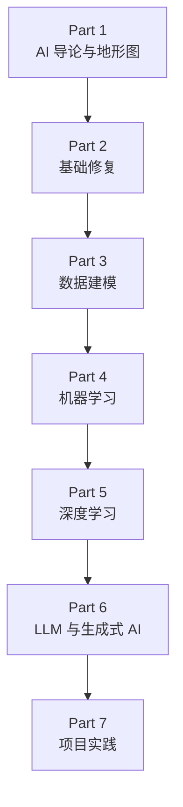

# AiBook（简体中文）

> Section ID: `BOOK-index`
> Version: `v2026.07.19`

AiBook 是一本用于重新学习 AI 的静态网页书。它面向第一次学习 AI 的读者、曾经学过 AI 导论但概念已经变得模糊的读者，以及用过 AI 工具但希望进一步理解内部原理的非专业读者，并让这些读者可以沿着同一条学习路径阅读。

这本书的目标不是尽可能多地收集资料，而是建立一条重新学习的路径：`AI 导论与地形图 -> 基础修复 -> 数据建模 -> 机器学习 -> 深度学习 -> LLM 与生成式 AI -> 项目实践`。读者在看到 AI 服务时，应当能够说明每个概念用在什么位置。

本书不会把 `AI`、`机器学习(machine learning)`、`深度学习(deep learning)`、`生成式 AI(generative AI)`、`LLM(large language model)` 当作彼此孤立的标签来记忆，而是重新整理规则式方法、数据、学习、模型执行、表示学习、生成、检索和工具使用如何在同一条流程中连接起来。

如果你是第一次进入本书，可以先通过 [目录](table-of-contents.md) 查看整体学习顺序，然后进入 [Part 1 概览](parts/part-01/index.md)。阅读中如果术语变得不清楚，可以在 [概念词汇表](reference/concept-glossary.md) 中找到该术语的代表说明位置。

## 这本书写给谁

这本书面向以下读者。

- 第一次学习 AI，希望慢慢连接术语和整体流程的读者
- 曾经学过 AI 导论或基础课程，但现在记忆已经很模糊的读者
- 使用过 LLM、聊天机器人、图像生成工具等 AI 服务，但还没有整理清楚内部概念的读者

解释层级以 `可能没有接受过大学本科层级系统教育的读者` 为基准。本书不假定读者已经掌握大学层级的数学、编程或系统基础。同时，它也不会只停留在容易理解的比喻上，而是把核心术语连接到标准说明，使读者之后还能重新找到这些概念。

## 重新学习什么

重新学习 AI，并不只是为了追赶最新潮流。只有理解规则式方法、搜索(search)、概率(probability)、机器学习、神经网络和深度学习怎样在历史和概念上连接起来，今天的 LLM 与生成式 AI 才不会显得过于模糊。

本书会依次关闭下面这些问题。

- AI 处理的是哪一类问题？
- 直接编写规则的方法，与从数据中学习模式的方法有什么不同？
- 数学如何作为阅读模型计算的语言使用，而不只是证明的对象？
- 把原始数据转成样本(sample)、特征(feature)、基准线(baseline)和比较结构，是什么意思？
- 学习(learning)改变了什么，模型执行(inference)又在执行什么？
- 深度学习中的权重(weight)、表示(representation)、反向传播(backpropagation)形成了怎样的计算流程？
- Transformer、LLM、提示词(prompt)、嵌入(embedding)、RAG(retrieval-augmented generation)、智能体(agent)如何在 AI 服务中连接起来？
- 如何用小项目验证并记录已经理解的内容？

## 本书结构

本书由七个 Part 组成。

- **Part 1. AI 导论与地形图**：先建立 AI 的范围、历史、规则与学习的区别，以及 LLM 使用体验所需的基础词汇。
- **Part 2. 基础修复**：把数学、Python、数据工具和执行环境恢复到能够阅读 AI 模型计算的程度。
- **Part 3. 数据建模**：把原始数据整理成可学习的输入和可比较的输出结构。
- **Part 4. 机器学习**：把问题定义、数据划分、学习、评估和代表性算法作为一个共同结构来阅读。
- **Part 5. 深度学习**：讲神经网络计算、反向传播、CNN、RNN、attention，以及通向 Transformer 的结构。
- **Part 6. LLM 与生成式 AI**：连接 token、提示词、生成设置、嵌入、检索、RAG、智能体和评估。
- **Part 7. 项目实践**：把前面学到的概念做成小型产出物，并用执行日志和评估标准进行验证。

相反，这本书不会一开始就快速塞入特定框架的细节 API、大规模运行优化，或研究级公式推导的全部内容。即使需要这些细节，也会先整理 `为什么需要它`、`问题和输入输出是什么`、`核心原理是什么`、`怎样简单确认`，再进入具体实现。

## 整体流程

这条流程不是单纯的目录顺序，而是学习依赖关系。Part 1 建立整体地图，Part 2 修复阅读和实作所需的基础，Part 3 把数据变成可学习的结构。在此之上，Part 4 建立机器学习的共同结构，Part 5 处理深度学习的计算和结构。Part 6 连接到当前的 LLM 与生成式 AI 服务，Part 7 则用项目产出物和验证记录收束学习路径。

## 阅读方法

基本路径是 `目录 -> Part 起始页 -> 代表说明 Section -> 后续 Section -> 概念词汇表`。如果想先看整体结构，可以打开 [目录](table-of-contents.md)。如果想直接开始阅读，可以从 [Part 1 概览](parts/part-01/index.md) 建立 AI 的整体地形。

第一次阅读的读者和已有一定经验的读者，可以从不同位置开始。

| 读者状态 | 推荐开始路径 |
| --- | --- |
| AI 整体流程还很陌生 | 介绍页 -> Part 1 -> Part 2 |
| 数学或 Python 记忆已经模糊 | 介绍页 -> Part 1 -> Part 2 -> Part 3 |
| 用过 AI 工具，但内部结构较弱 | 介绍页 -> Part 1 -> Part 3 -> Part 4 |

在同一个 Part 内，重要概念的详细说明会尽量只放在一个代表位置。后续 Section 只重新连接当前语境所需的部分。阅读中如果术语变得不清楚，可以回到 [概念词汇表](reference/concept-glossary.md)，先查看 `中心 Section`，如果想知道当前语境中这个概念在哪里再次出现，再继续查看 `出现 Section`。

本书中的每个 Section 承担的角色并不相同。有些 Section 负责给出某个概念的代表说明，有些 Section 则展示这个概念如何在另一个问题场景中再次使用。因此，可以把前面的 Section 当作建立概念骨架的位置，把后面的 Section 当作查看当前语境中什么发生变化的位置来阅读。

## 本书的观点

这本书可以从个人直觉出发，但不会把这种直觉直接当作答案。说明会尽量分成下面三层。

- `标准说明`：与教材、论文、官方文档或可信资料连接的说明
- `工作假设`：帮助理解的个人比喻或临时说明
- `需要验证`：与标准说明冲突，或证据还不充分的部分

例如，把深度学习理解为 `寻找有用权重和表示的过程` 可以作为出发点。但这个表达在哪些范围内成立，需要另外检查。同样，LLM 输出看起来像人的思考，也不能马上断定它就等同于人的思考。

## 与 AI 工具一起制作的书

这本书使用 AI 工具制作。人负责设定课程结构和审查标准，AI 则帮助资料调查、初稿撰写、比较整理、图示制作和文档结构化。

Codex 是这个制作过程中的重要工具。本书不会把 Codex 视为自动写作器，而是把它作为从 LLM agent 视角理解的、辅助初稿和审查的工具。同时，包括 Codex 在内的生成式 AI 输出始终都是审查对象。不能因为文字自然流畅，就把它直接当作事实。

因此，本书中重要的事情不是制造很多看起来合理的句子，而是确认每个句子是否真的有依据，并持续修正错误或模糊的说明。

## 语言支持

目前本书的基准版本是韩语。

- 韩语：当前持续写作与审校的主版本
- 英语：已开放介绍页、目录页、Part 1 全部、Part 2 全部、Part 3 全部、Part 4 全部，以及 Part 5 全部的一轮翻译
- 简体中文：已开放介绍页、目录页、Part 1 全部、Part 2 全部、Part 3 全部、Part 4 全部，以及 Part 5 全部的一轮翻译

## 反馈与 Issue

如果在阅读中发现错别字、说明错误、目录结构问题，或需要补强的部分，请通过 [AiBook 仓库 Issues](https://github.com/devchan64/AiBook/issues){: target="_blank" rel="noopener noreferrer" } 告知。

## 来源与参考资料

本文档是为了说明本书的目的、读者、学习路径和写作观点而写成的原创介绍。它没有直接引用或概括外部资料。之后如果加入基于外部资料的说明，会同时记录来源和确认日期。
