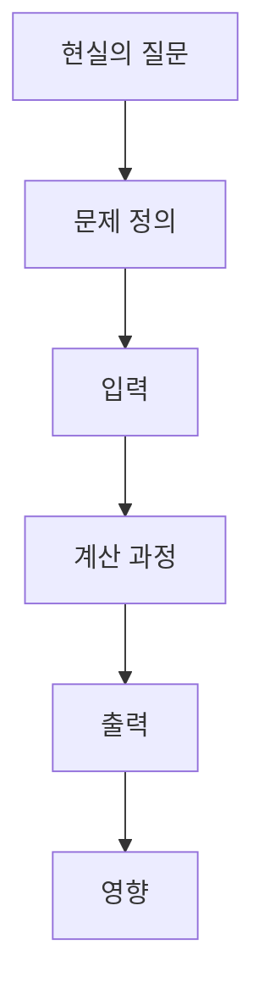

# 1.2 AI가 다루는 문제

1.1에서는 AI라는 말의 범위를 정리했습니다. 이번 절에서는 그 넓은 범위 안에서 AI가 실제로 어떤 종류의 문제를 다루는지 봅니다.

AI를 기술 이름으로만 보면 규칙 기반 AI, 머신러닝, 딥러닝, 생성형 AI가 서로 다른 세계처럼 보입니다. 하지만 문제의 형태로 보면 공통점이 보입니다. 대부분의 AI 시스템은 어떤 입력(input)을 받아, 목표(objective)에 맞는 출력(output)을 만들고, 그 결과가 사람의 판단이나 환경에 영향을 줍니다.

## 이 절의 범위

이 절은 다음 질문에 답합니다.

- AI는 어떤 종류의 문제를 반복해서 다루는가?
- 입력과 출력 관점으로 문제를 보면 어떤 공통 구조가 보이는가?
- 같은 데이터도 질문이 바뀌면 왜 다른 AI 문제가 되는가?

이 절은 다음 내용은 깊게 다루지 않습니다.

- 각 문제 유형에 쓰이는 알고리즘의 세부 구현
- 문제 유형별 수학적 최적화 기법
- 실제 서비스 파이프라인의 복합 설계

문제 유형별 알고리즘과 학습 구조는 머신러닝 문제를 다루는 Part 3, 딥러닝 구조를 다루는 Part 4, LLM과 생성형 AI를 다루는 Part 5에서 다시 회수합니다. 이 절은 먼저 `무엇을 넣고 무엇이 나오는가`라는 문제 정의 감각을 만드는 데 집중합니다.

## 이 절의 목표

- AI 문제를 입력과 출력의 관점에서 나눕니다.
- 인식, 탐색, 예측, 추천, 생성, 제어 같은 문제 유형을 구분합니다.
- 같은 현실 문제가 문제 정의에 따라 다른 AI 문제로 바뀔 수 있음을 이해합니다.

## 주요 학습내용

이 절은 알고리즘 이름보다 문제의 모양을 먼저 보는 절입니다. 처음 읽을 때는 아래 세 가지를 전체 지도처럼 먼저 붙잡으면 됩니다.

| 먼저 볼 것 | 왜 중요한가 | 이 절에서 먼저 이해할 수준 |
| --- | --- | --- |
| AI는 먼저 `입력`과 `출력`으로 읽을 수 있다는 점 | 그래야 서로 다른 기술 이름이 나와도 공통 구조가 보입니다. | 무엇을 넣고 무엇이 나오는지만 먼저 말할 수 있으면 충분합니다. |
| 같은 데이터도 `질문`이 바뀌면 다른 문제가 된다는 점 | 그래야 분류, 예측, 추천, 생성이 왜 갈라지는지 보입니다. | 고객 데이터 하나로도 여러 문제를 만들 수 있다는 정도면 충분합니다. |
| 결과는 사람이나 서비스에 `영향`을 준다는 점 | AI를 단순 계산이 아니라 실제 판단 구조로 보게 해 줍니다. | 출력이 어디에 쓰이는지 한 문장으로 설명할 수 있으면 충분합니다. |

## 세부 학습내용

### 문제 유형으로 보는 이유

AI를 다시 배울 때 처음부터 알고리즘 이름을 외우면 금방 복잡해집니다. 같은 이미지 데이터를 다루더라도 어떤 시스템은 고양이인지 아닌지를 분류하고, 어떤 시스템은 물체의 위치를 찾고, 어떤 시스템은 새로운 이미지를 생성합니다.

따라서 먼저 물어볼 질문은 “어떤 기술을 쓰는가?”가 아니라 “무엇을 입력으로 받아 무엇을 출력하려는가?”입니다. 이 질문은 규칙 기반 시스템, 머신러닝 모델, 딥러닝 모델, LLM 서비스를 같은 지도 위에 놓게 해 줍니다.

### AI가 자주 다루는 문제 유형

다음 표는 이 책에서 반복해서 사용할 문제 유형입니다. 이 구분은 완전한 분류표가 아니라 학습용 지도입니다.

| 문제 유형 | 영어 표현 | 입력 | 출력 | 예시 |
| --- | --- | --- | --- | --- |
| 인식 | recognition | 이미지, 음성, 텍스트, 센서 데이터 | 대상, 상태, 의미 | 이미지에서 사물 알아보기, 음성 명령 이해하기 |
| 분류 | classification | 데이터와 후보 범주 | 범주 또는 라벨 | 메일을 스팸/정상으로 나누기 |
| 군집화 | clustering | 라벨이 없는 데이터 | 비슷한 항목의 묶음 | 고객 그룹 찾기, 문서 묶기 |
| 예측 | prediction, regression | 과거 데이터, 현재 상태 | 미래 값, 점수, 확률 | 수요 예측, 고장 가능성 예측 |
| 탐색과 계획 | search, planning | 가능한 상태와 목표 | 경로, 순서, 행동 계획 | 게임에서 다음 수 찾기, 기사 방문 순서 정하기 |
| 추천과 순위화 | recommendation, ranking | 사용자, 항목, 맥락 | 추천 목록, 우선순위 | 상품 추천, 도움말 문서 순서 정하기 |
| 생성 | generation | 지시, 조건, 예시, 맥락 | 새 텍스트, 이미지, 음성, 코드 | 문장 작성, 이미지 생성, 코드 초안 작성 |
| 제어와 행동 | control, action | 상태 관측, 목표, 피드백 | 행동, 정책 | 로봇 회전 제어, 신호등 앞 감속, 게임 에이전트 이동 |

이 표에서 중요한 점은 문제 유형과 구현 방식이 같지 않다는 것입니다. 예를 들어 `분류` 문제는 사람이 직접 작성한 규칙으로도 풀 수 있고, 머신러닝 모델로도 풀 수 있으며, 딥러닝 모델로도 풀 수 있습니다. 반대로 LLM 서비스 하나도 내부에서는 생성, 검색, 추천, 도구 호출, 안전 필터링이 함께 동작할 수 있습니다.

처음 읽을 때는 모든 문제 유형을 여기서 끝까지 붙잡으려 하기보다, `어느 문제를 뒤 Part에서 본격적으로 다시 읽는가`만 먼저 연결해 두면 충분합니다.

| 지금 잡는 문제 유형 | 뒤에서 본격적으로 다시 읽는 위치 | 지금 단계에서 기억할 이유 |
| --- | --- | --- |
| 분류, 예측, 군집화 | Part 3 | 머신러닝은 결국 어떤 질문을 예측 문제로 바꾸는가를 배우는 파트이기 때문입니다. |
| 이미지, 음성, 시퀀스 같은 복잡한 입력 인식 | Part 4 | 딥러닝 구조가 왜 필요한지 데이터 구조 관점에서 다시 읽기 때문입니다. |
| 생성, 검색 결합, 도구 실행 | Part 5 | LLM, RAG, agent가 무엇을 생성하고 무엇을 밖에서 가져오는지 본격적으로 설명하기 때문입니다. |
| 계획, 제어, 행동 | Part 1 보충학습과 Part 6의 작은 시스템 관점 | 현재 책에서는 큰 제어 이론보다 `입력-판단-행동` 구조를 읽는 감각을 먼저 붙잡는 편이 더 중요하기 때문입니다. |

### 같은 데이터도 다른 문제가 된다

AI 문제는 데이터 자체로 결정되지 않습니다. 같은 데이터를 어떤 질문으로 바꾸는지가 문제를 결정합니다.

예를 들어 고객 구매 데이터가 있다고 해 봅니다.

| 질문 | 문제 유형 | 가능한 출력 |
| --- | --- | --- |
| 이 고객은 이탈할 가능성이 높은가? | 예측 | 이탈 확률 |
| 비슷한 고객은 어떤 상품을 샀는가? | 추천 | 추천 상품 목록 |
| 고객을 몇 개의 집단으로 나눌 수 있는가? | 군집화 | 고객 그룹 |
| 다음 달 매출은 얼마나 될까? | 예측 | 매출 추정값 |
| 고객 상담 내용을 요약할 수 있는가? | 생성 | 상담 요약문 |

이 관점은 이후 Part 2와 Part 3에서 중요해집니다. 수학이나 소프트웨어를 깊게 이해하기 전에, 먼저 현실의 질문을 입력과 출력이 있는 문제로 바꾸는 연습이 필요합니다.

### 함수와 워크플로우로 읽기

다음 관점은 소프트웨어 경험과 AI 개념을 연결하기 위한 학습용 일반화입니다. Poole과 Mackworth의 공개 교재는 에이전트(agent)를 환경 안에서 행동하는 것으로 설명하고, 에이전트를 입력과 출력의 관점에서 보는 black-box 관점을 제시합니다. 또한 에이전트가 받은 지각 또는 입력의 이력을 명령으로 바꾸는 `transduction`을 함수로 설명하고, 이를 구현하는 것을 `controller`로 설명합니다.

이 관점에서 보면 AI 시스템도 어느 정도는 함수(function)처럼 읽을 수 있습니다. 요청, 관측값, 센서 데이터, 웹 요청 같은 입력이 들어오고, 내부 처리 과정을 거쳐 응답, 명령, 추천, 행동 같은 출력이 나옵니다.

다만 AI가 일반적인 소프트웨어 함수와 다른 점은 출력 규칙을 사람이 모두 명시하지 않는 경우가 많다는 데 있습니다. 전통적인 함수가 사람이 작성한 조건문과 절차를 따라 결과를 만든다면, 학습 기반 AI는 데이터에서 얻은 패턴, 파라미터, 통계적 관계 또는 학습된 표현을 이용해 결과를 만듭니다. 그래서 같은 `입력 -> 처리 -> 출력` 구조를 가지더라도, 내부 처리 방식과 검증 방법이 달라집니다.

이 관점은 사람의 업무 흐름(workflow)을 이해할 때도 도움이 됩니다. 사람은 요청을 받고, 맥락을 확인하고, 필요한 정보를 찾고, 판단한 뒤, 응답하거나 행동합니다. AI 시스템을 설계한다는 것은 이 흐름 전체를 그대로 흉내 내는 일이 아니라, 그중 계산으로 맡길 수 있고 반복 가능하며 충분히 강건하게(robust) 만들 수 있는 부분을 찾아 구성하는 일에 가깝습니다. 센서, 데이터, 외부 시스템, 사용자의 요청은 불완전하거나 지연될 수 있으므로, 어떤 부분을 자동화하고 어떤 부분을 사람이 검토해야 하는지도 함께 정해야 합니다.

따라서 이 책에서는 AI를 단순한 자동 응답 장치로만 보지 않습니다. 요청을 처리해 응답을 만드는 기본적인 소프트웨어 구조 위에, 인식, 예측, 추천, 생성, 계획 같은 문제 해결 기능을 붙여 사람의 워크플로우 일부를 보조하거나 확장하는 시스템으로 읽습니다.

### 문제 정의가 먼저다

AI 시스템을 만들거나 이해할 때는 모델보다 문제 정의가 먼저입니다. 문제 정의가 흐리면 좋은 모델을 써도 결과를 해석하기 어렵습니다.

문제 정의에는 최소한 다음 요소가 필요합니다.

- 입력: 시스템이 무엇을 받는가?
- 출력: 시스템이 무엇을 만들어야 하는가?
- 목표: 어떤 결과를 좋다고 볼 것인가?
- 제약: 시간, 비용, 안전, 개인정보, 저작권 같은 제한은 무엇인가?
- 영향: 출력이 사람의 판단이나 실제 환경에 어떤 영향을 주는가?

OECD의 AI 시스템 설명도 입력, 목표, 출력, 환경에 대한 영향을 함께 봅니다. 이 책에서는 이 관점을 따라 AI를 “사람처럼 보이는가”보다 “어떤 문제를 계산 가능한 형태로 바꾸고 어떤 출력을 만드는가”로 읽습니다.

### 문제 유형 사이의 경계는 겹친다

실제 AI 서비스는 하나의 문제 유형으로만 설명되지 않는 경우가 많습니다.

예를 들어 도움말 검색 서비스는 한 덩어리처럼 보이지만 실제로는 여러 문제가 이어집니다.

| 단계 | 문제 유형 | 작은 업무 장면 |
| --- | --- | --- |
| 질문 문장을 읽음 | 인식 또는 언어 이해 | `환불이 늦어요`가 어떤 의도인지 파악 |
| 문서 후보를 찾음 | 검색 | 관련 도움말 20개를 먼저 모음 |
| 보여 줄 순서를 정함 | 순위화 | 환불 정책 문서를 맨 위에 올림 |
| 답변 문장을 씀 | 생성 | `환불 처리 기간은 보통 3영업일입니다`라고 안내 |

제어와 행동도 거대한 자율주행 전체보다 더 작은 장면으로 보는 편이 이해가 쉽습니다.

| 상황 | 먼저 보이는 문제 유형 | 작은 업무 장면 |
| --- | --- | --- |
| 로봇 이동 | 제어 | 바닥 선을 따라 속도를 조금 줄임 |
| 차량 보조 기능 | 예측 + 제어 | 앞차가 멈출 것 같아 감속 시작 |
| 게임 캐릭터 이동 | 행동 선택 | 장애물을 피해 왼쪽으로 이동 |

따라서 문제 유형은 딱딱한 분류가 아니라 분석 도구입니다. 어떤 시스템이 여러 문제를 어떻게 묶고 있는지 보면, AI라는 넓은 말을 더 작은 단위로 나누어 이해할 수 있습니다.

## 사례로 보기

### 사례 1. 같은 고객 데이터, 다른 문제

고객 구매 데이터 하나가 있다고 해 보겠습니다. 사람은 처음에는 데이터가 하나면 AI 문제도 하나라고 느끼기 쉽습니다. 하지만 같은 데이터로도 `이탈할 가능성이 높은가`를 물으면 예측 문제가 되고, `비슷한 고객은 무엇을 샀는가`를 물으면 추천 문제가 되며, `상담 내용을 짧게 정리할 수 있는가`를 물으면 생성 문제가 됩니다. 이 사례는 데이터 종류보다 `무슨 질문을 던졌는가`가 문제 유형을 바꾼다는 점을 보여 줍니다.

### 사례 2. 검색 서비스 안에 여러 문제가 섞이는 경우

사용자가 제품 매뉴얼 사이트에 `환불은 언제 완료되나요?`라고 묻는다고 해 보겠습니다. 겉으로는 검색창 하나지만, 내부에서는 질문 이해, 문서 검색, 결과 순위화, 답변 생성이 짧게 이어집니다. 이 사례는 실제 서비스가 하나의 AI 문제만 다루는 것이 아니라, 여러 문제 유형을 한 흐름으로 묶어 놓는 경우가 많다는 점을 보여 줍니다.

### 이 책에서 사용할 질문

앞으로 새로운 AI 사례를 볼 때는 다음 순서로 읽습니다.

- 이 시스템은 어떤 현실 문제를 다루는가?
- 입력은 무엇이고 출력은 무엇인가?
- 출력은 분류, 예측, 추천, 생성, 계획, 제어 중 어디에 가까운가?
- 정답이나 평가 기준은 어떻게 정하는가?
- 결과가 틀렸을 때 어떤 위험이 생기는가?

이 질문은 기술을 단순화하기 위한 것이 아닙니다. 오히려 복잡한 AI 시스템을 여러 문제 유형으로 나누어 검토하기 위한 기준입니다.

## 이 절에서 기억할 관점

- AI 문제는 먼저 입력과 출력이 무엇인지로 읽어야 합니다.
- 같은 데이터라도 어떤 질문을 던지느냐에 따라 예측, 추천, 생성처럼 전혀 다른 문제가 됩니다.
- 실제 서비스는 검색, 랭킹, 생성처럼 여러 문제 유형이 한 흐름 안에 함께 들어갈 수 있습니다.

지금 단계의 최소 기억점은 `같은 데이터라도 질문이 바뀌면 다른 AI 문제가 된다`는 한 문장입니다.

처음 읽은 뒤에는 아래 세 줄만 다시 말할 수 있어도 충분합니다.

| 지금은 이 정도만 남기면 충분한 것 | 왜 이것만 먼저 남겨도 되는가 |
| --- | --- |
| AI 문제는 `입력 -> 출력`으로 먼저 읽는다 | 그래야 기술 이름이 달라도 공통 구조를 다시 붙잡을 수 있기 때문입니다. |
| 같은 데이터도 질문이 바뀌면 예측, 추천, 생성처럼 다른 문제가 된다 | 개론 단계에서 모든 알고리즘보다 문제 정의가 먼저라는 기준을 남기기 때문입니다. |
| 실제 서비스는 검색, 순위화, 생성 같은 여러 문제를 한 흐름으로 묶을 수 있다 | 뒤 Part에서 한 서비스 안에 여러 구조가 왜 함께 나오는지 덜 놀라게 하기 때문입니다. |

## 체크리스트

- AI 문제를 입력과 출력의 관점에서 설명할 수 있다.
- 인식, 분류, 예측, 탐색, 추천, 생성, 제어의 차이를 예시로 설명할 수 있다.
- 같은 데이터도 질문에 따라 다른 AI 문제가 될 수 있음을 설명할 수 있다.
- 문제 유형과 구현 방식이 같지 않다는 점을 구분할 수 있다.
- AI 시스템을 볼 때 모델보다 문제 정의를 먼저 확인해야 하는 이유를 설명할 수 있다.

## 출처와 참고 자료

- OECD.AI, Stuart Russell, Karine Perset, Marko Grobelnik, [Updates to the OECD’s definition of an AI system explained](https://oecd.ai/en/wonk/ai-system-definition-update), 2023-11-29, 확인 날짜: 2026-06-22.
- Cambridge Dictionary, [Meaning of artificial intelligence in English](https://dictionary.cambridge.org/dictionary/english/artificial-intelligence), 확인 날짜: 2026-06-22.
- Stanford Encyclopedia of Philosophy, Selmer Bringsjord and Naveen Sundar Govindarajulu, [Artificial Intelligence](https://plato.stanford.edu/entries/artificial-intelligence/), 2018-07-12, 확인 날짜: 2026-06-22.
- Stuart Russell, Peter Norvig, [Artificial Intelligence: A Modern Approach, 4th US ed.](https://aima.cs.berkeley.edu/), 확인 날짜: 2026-06-22.
- David L. Poole, Alan K. Mackworth, [Artificial Intelligence: Foundations of Computational Agents, 3rd ed.](https://artint.info/3e/html/ArtInt3e.html), 2023, 확인 날짜: 2026-06-22.
- Usama M. Fayyad, Gregory Piatetsky-Shapiro, Padhraic Smyth, [From Data Mining to Knowledge Discovery in Databases](https://www.kdnuggets.com/gpspubs/aimag-kdd-overview-1996-Fayyad.pdf), AI Magazine, 1996, 확인 날짜: 2026-06-22.
