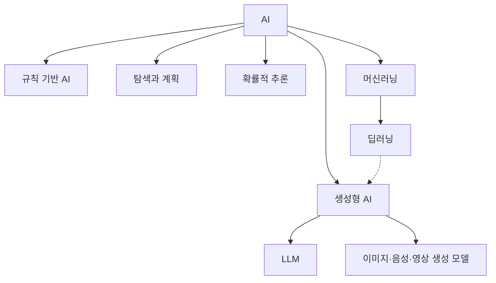

# 1.3 AI, 머신러닝, 딥러닝, 생성형 AI의 관계

1.1에서는 AI라는 말의 범위를, 1.2에서는 AI가 다루는 문제 유형을 봤습니다. 이번 절에서는 앞으로 반복해서 나올 `AI`, `머신러닝`, `딥러닝`, `생성형 AI`, `LLM`의 관계를 정리합니다.

이 절의 목적은 용어를 완벽한 포함 관계로 외우는 것이 아닙니다. 서로 다른 층위(level)의 말을 같은 뜻처럼 섞어 쓰지 않도록 기준선을 잡는 것입니다.

## 목표

- AI, 머신러닝, 딥러닝, 생성형 AI, LLM의 기본 관계를 구분합니다.
- “AI = LLM”처럼 최신 서비스 경험만으로 AI 전체를 좁게 이해하지 않습니다.
- 포함 관계가 대체로 맞더라도 실제 서비스에서는 여러 기술이 섞인다는 점을 이해합니다.

## 먼저 큰 그림부터 본다

가장 넓은 말은 AI입니다. AI는 인간 지능과 관련된 일부 기능을 컴퓨터 시스템, 기계, 알고리즘으로 수행하려는 넓은 분야와 시스템 범주입니다. 그 안에는 규칙 기반 접근, 탐색, 계획, 확률적 추론, 머신러닝처럼 서로 다른 접근이 들어갑니다.

머신러닝(machine learning)은 그중 데이터나 경험을 통해 성능을 개선하는 접근입니다. 사람이 모든 규칙을 직접 쓰기보다, 입력과 출력의 예시, 보상, 데이터 안의 구조를 이용해 모델이 판단 기준을 학습하도록 합니다.

딥러닝(deep learning)은 머신러닝 안에서 신경망(neural network), 특히 여러 층을 가진 깊은 신경망을 사용해 표현(representation)을 학습하는 접근입니다. 과거에는 사람이 특징(feature)을 직접 설계하는 일이 중요했다면, 딥러닝은 원시 데이터에서 유용한 표현을 함께 학습하려는 방향을 강하게 보여줍니다.

생성형 AI(generative AI)는 텍스트, 이미지, 음성, 영상, 코드 같은 새 콘텐츠를 만들어 내는 AI 모델과 서비스를 가리키는 말입니다. 최근 생성형 AI는 대개 딥러닝과 대규모 모델을 바탕으로 하지만, “딥러닝”과 “생성형 AI”는 같은 말이 아닙니다. 딥러닝은 학습 방법과 모델 구조에 가까운 말이고, 생성형 AI는 출력의 성격에 가까운 말입니다.

LLM(large language model, 대규모 언어 모델)은 대규모 텍스트 데이터로 학습한 언어 모델 계열입니다. LLM은 오늘날 생성형 AI를 대표하는 기술 중 하나이지만, 생성형 AI 전체가 LLM은 아닙니다. 이미지 생성 모델, 음성 생성 모델, 영상 생성 모델처럼 언어 모델이 아닌 생성형 AI도 있습니다.

이 그림은 학습용 지도입니다. 실제 연구와 서비스에서는 경계가 더 복잡합니다. 예를 들어 검색 서비스에 LLM을 붙이면 생성형 AI처럼 보이지만, 그 안에는 검색 엔진, 데이터베이스, 권한 관리, 규칙 기반 필터, 추천 모델이 함께 들어갈 수 있습니다.

## 용어를 같은 층위(level)로 보지 않는다

혼동은 서로 다른 층위(level)의 말을 나란히 비교할 때 생깁니다.

| 용어 | 주로 가리키는 층위(level) | 짧은 설명 | 주의할 점 |
| --- | --- | --- | --- |
| AI | 분야와 시스템 범주 | 지능과 관련된 기능을 기계가 수행하도록 만드는 넓은 분야 | 특정 최신 모델 하나로 좁히면 안 됨 |
| 머신러닝 | 학습 접근 | 데이터나 경험으로 성능을 개선하는 모델을 만드는 접근 | 모든 AI가 머신러닝은 아님 |
| 딥러닝 | 머신러닝 방법 | 깊은 신경망과 표현 학습을 사용하는 접근 | 모든 머신러닝이 딥러닝은 아님 |
| 생성형 AI | 출력 성격과 서비스 범주 | 새 텍스트, 이미지, 음성, 코드 등을 생성하는 모델과 서비스 | 생성 결과가 사실이라는 뜻은 아님 |
| LLM | 모델 계열 | 언어 데이터를 중심으로 학습한 대규모 언어 모델 | 모든 생성형 AI가 LLM은 아님 |

따라서 “AI와 머신러닝 중 무엇이 더 좋은가?”라는 질문은 조심해야 합니다. 머신러닝은 AI 안의 한 접근입니다. “딥러닝과 생성형 AI 중 무엇이 더 최신인가?”라는 질문도 층위(level)가 섞여 있습니다. 딥러닝은 모델을 학습하는 방법 쪽이고, 생성형 AI는 생성 결과를 만드는 모델과 서비스 쪽입니다.

## 포함 관계는 출발점일 뿐이다

처음 학습할 때는 다음처럼 대략적인 흐름을 놓아 볼 수 있습니다.

> AI > 머신러닝 > 딥러닝 > 생성형 AI > LLM

하지만 이 줄은 매우 강한 단순화입니다. 특히 생성형 AI는 출력 성격과 서비스 범주에 가까운 말이므로, 딥러닝의 단순한 하위 단계라고만 보면 안 됩니다. 정확한 설명으로 쓰려면 몇 가지 예외를 함께 기억해야 합니다.

- 규칙 기반 AI는 머신러닝이 아니어도 AI 범위에 들어갈 수 있습니다.
- 머신러닝에는 딥러닝이 아닌 방법도 많습니다.
- 딥러닝은 생성만 하는 기술이 아니라 분류, 인식, 예측, 제어에도 쓰입니다.
- 생성형 AI는 텍스트뿐 아니라 이미지, 음성, 영상, 코드도 만들 수 있습니다.
- LLM은 생성형 AI의 대표 모델 계열이지만, 서비스 전체를 뜻하지는 않습니다.

즉 포함 관계는 길잡이로는 유용하지만, 실제 시스템을 설명할 때는 “어떤 문제를 다루는가”, “어떤 모델이나 규칙을 쓰는가”, “어떤 출력을 만드는가”를 따로 봐야 합니다.

## 예시로 다시 구분하기

다음 예시는 용어를 구분하는 연습입니다.

| 사례 | AI인가 | 머신러닝인가 | 딥러닝인가 | 생성형 AI인가 | LLM인가 |
| --- | --- | --- | --- | --- | --- |
| 사람이 작성한 규칙으로 대출 가능 여부를 판정하는 시스템 | 가능 | 아님 | 아님 | 아님 | 아님 |
| 과거 거래 데이터로 사기 가능성을 예측하는 모델 | 가능 | 가능 | 경우에 따라 다름 | 보통 아님 | 아님 |
| 이미지에서 결함 부위를 찾는 신경망 모델 | 가능 | 가능 | 가능 | 보통 아님 | 아님 |
| 문장을 입력하면 요약문을 만드는 챗봇 | 가능 | 가능 | 대개 가능 | 가능 | 대개 가능 |
| 텍스트 프롬프트로 이미지를 만드는 모델 | 가능 | 가능 | 대개 가능 | 가능 | 보통 LLM은 아님 |

이 표에서 “가능”, “대개”, “보통” 같은 표현을 쓰는 이유는 실제 구현을 확인해야 하기 때문입니다. 같은 겉모습의 서비스라도 내부 구조는 다를 수 있습니다.

## 생성형 AI와 LLM을 구분해야 하는 이유

최근에는 사용자가 AI를 처음 만나는 경험이 챗봇인 경우가 많습니다. 그래서 AI, 생성형 AI, LLM, ChatGPT 같은 제품 이름이 한 덩어리처럼 느껴질 수 있습니다.

하지만 학습할 때는 구분이 필요합니다. LLM은 언어를 중심으로 한 모델 계열이고, 생성형 AI는 새 콘텐츠를 만드는 더 넓은 범주입니다. NIST의 생성형 AI 프로파일은 생성형 AI를 입력 데이터의 구조와 특성을 모방해 파생된 합성 콘텐츠를 생성하는 AI 모델 범주로 설명하며, 이미지, 영상, 오디오, 텍스트 같은 디지털 콘텐츠를 예로 듭니다. 또한 이 문서는 LLM을 생성형 AI가 사용되는 대표적인 공통 활동 중 하나로 언급합니다.

이 관점에서 보면 LLM은 생성형 AI의 중요한 사례이지만, 생성형 AI 전체를 대표해서 모든 것을 설명할 수는 없습니다. 반대로 생성형 AI 서비스를 만들 때도 LLM 하나만 있으면 끝나는 것이 아닙니다. 실제 서비스에는 프롬프트 처리, 검색, 권한, 로그, 안전 필터, 사용자 인터페이스, 비용 관리가 함께 필요합니다.

## 이 책에서 사용할 기준

앞으로 이 책에서는 다음 기준으로 용어를 씁니다.

- `AI`는 가장 넓은 분야와 시스템 범주를 가리킬 때 사용합니다.
- `머신러닝`은 데이터나 경험에서 모델이 성능을 개선하는 접근을 가리킬 때 사용합니다.
- `딥러닝`은 깊은 신경망과 표현 학습을 중심으로 설명할 때 사용합니다.
- `생성형 AI`는 새 콘텐츠를 생성하는 모델과 서비스를 설명할 때 사용합니다.
- `LLM`은 언어 데이터를 중심으로 학습한 대규모 언어 모델을 가리킬 때 사용합니다.

이 기준은 이후 장에서 더 세밀하게 수정됩니다. 지금은 용어의 위치를 잡는 것이 중요합니다. 세부 알고리즘, 수식, 학습 방식은 Part 3, Part 4, Part 5에서 다시 다룹니다.

## 체크리스트

- AI가 머신러닝보다 넓은 말이라는 점을 설명할 수 있다.
- 머신러닝과 딥러닝의 차이를 데이터 학습과 신경망·표현 학습 관점에서 설명할 수 있다.
- 딥러닝과 생성형 AI가 같은 말이 아니라는 점을 설명할 수 있다.
- 생성형 AI와 LLM의 관계를 “대표 사례이지만 전체는 아님”으로 설명할 수 있다.
- 실제 AI 서비스가 모델 하나가 아니라 여러 구성요소의 조합일 수 있음을 설명할 수 있다.

## 출처와 참고 자료

- OECD.AI, Stuart Russell, Karine Perset, Marko Grobelnik, [Updates to the OECD’s definition of an AI system explained](https://oecd.ai/en/wonk/ai-system-definition-update), 2023-11-29, 확인 날짜: 2026-06-22.
- Stanford Encyclopedia of Philosophy, Selmer Bringsjord and Naveen Sundar Govindarajulu, [Artificial Intelligence](https://plato.stanford.edu/entries/artificial-intelligence/), 2018-07-12, 확인 날짜: 2026-06-22.
- Stuart Russell, Peter Norvig, [Artificial Intelligence: A Modern Approach, 4th US ed.](https://aima.cs.berkeley.edu/), 확인 날짜: 2026-06-22.
- NIST, [Artificial Intelligence Risk Management Framework: Generative Artificial Intelligence Profile](https://doi.org/10.6028/NIST.AI.600-1), NIST AI 600-1, 2024-07, 확인 날짜: 2026-06-22.
- Wayne Xin Zhao et al., [A Survey of Large Language Models](https://arxiv.org/abs/2303.18223), arXiv:2303.18223, 확인 날짜: 2026-06-22.
