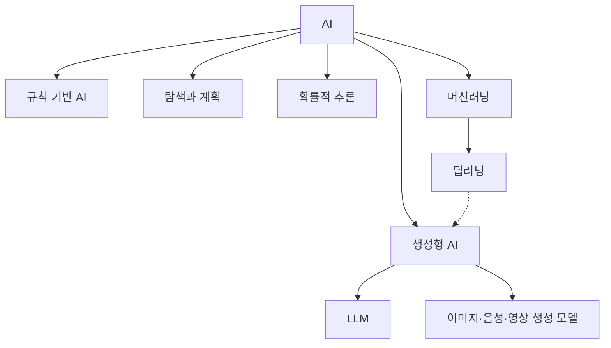

# P1-1.3 AI, 머신러닝, 딥러닝, 생성형 AI의 관계

> Section ID: `P1-1.3`
> Version: `v2026.07.09`

1.1에서는 AI라는 말의 범위를, 1.2에서는 AI가 다루는 문제 유형을 봤습니다. 이번 절에서는 앞으로 반복해서 나올 `AI`, `머신러닝`, `딥러닝`, `생성형 AI`, `LLM`의 관계를 정리합니다.

여기서 필요한 일은 용어를 완벽한 포함 관계로 외우는 것이 아니라, 서로 다른 층위(level)의 말을 같은 뜻처럼 섞어 쓰지 않도록 기준선을 세우는 것입니다.

Part 1에서 `AI`, `머신러닝`, `딥러닝`, `생성형 AI`, `LLM`의 관계는 이 절에서 기준선을 잡습니다. 뒤 절에서 이 용어들이 다시 나오더라도 현재 질문에 필요한 최소 연결만 남기고, 용어 관계 자체를 다시 정리해야 할 때는 이 절과 [개념사전](../../../reference/concept-glossary.md)으로 돌아옵니다.

## 이 절의 범위

여기서는 다음 질문을 정리합니다.

- AI, 머신러닝, 딥러닝, 생성형 AI, LLM은 어떤 관계로 읽는 것이 안전한가?
- 포함 관계로 설명할 수 있는 부분과 실제 서비스에서 섞여 쓰이는 부분은 무엇이 다른가?
- 왜 `AI = LLM`처럼 좁혀 읽으면 혼동이 생기는가?

다음 내용은 여기서 깊게 다루지 않습니다.

- 머신러닝과 딥러닝의 세부 학습 알고리즘
- LLM 내부 구조와 토큰 단위 계산
- 상용 생성형 AI 제품의 기능 비교

각 층위의 내부 구조는 머신러닝 전개를 다루는 Part 4, 딥러닝 구조를 다루는 Part 5, LLM과 생성형 AI를 다루는 Part 6에서 다시 회수합니다. 여기서는 먼저 용어의 `자리`를 구분하는 데 집중합니다.

## 이 절의 목표

- AI, 머신러닝, 딥러닝, 생성형 AI, LLM의 기본 관계를 구분합니다.
- “AI = LLM”처럼 최신 서비스 경험만으로 AI 전체를 좁게 이해하지 않습니다.
- 포함 관계가 대체로 맞더라도 실제 서비스에서는 여러 기술이 섞인다는 점을 이해합니다.

## 먼저 연결할 개념

이 절은 Part 1 전체에서 반복해서 다시 참조할 용어 관계의 기준선입니다. 아래 개념은 지금 자리만 먼저 잡아 두고, 더 자세한 정의가 필요할 때는 각 표제어 항목으로 바로 이동해 다시 확인합니다.

| 개념 | 여기서 먼저 잡을 뜻 | 왜 지금 필요한가 |
| --- | --- | --- |
| [AI](../../../reference/concept-glossary.md#ai-artificial-intelligence) | 가장 넓은 분야와 시스템 범주 | 나머지 용어가 어디에 놓이는지 보기 위해 |
| [머신러닝](../../../reference/concept-glossary.md#machine-learning) | 데이터로 성능을 개선하는 학습 접근 | 규칙 기반 방식과 학습 기반 방식을 구분하기 위해 |
| [딥러닝](../../../reference/concept-glossary.md#deep-learning) | 신경망과 표현 학습을 강하게 쓰는 접근 | 머신러닝 안의 중요한 확장 방향을 잡기 위해 |
| [생성형 AI](../../../reference/concept-glossary.md#aigenerative-ai) | 새 콘텐츠를 만들어 내는 출력 범주 | 학습 방법과 출력 성격을 섞지 않기 위해 |
| [LLM](../../../reference/concept-glossary.md#llm) | 언어를 다루는 대규모 언어 모델 계열 | 생성형 AI와 AI 전체를 좁게 같은 말로 읽지 않기 위해 |

## 주요 학습내용

이 장면에서 중요한 일은 포함 관계 암기가 아니라, 서로 다른 층위를 안정적으로 분리하는 것입니다. 아래 세 가지가 전체 지도입니다.

| 기준 | 왜 중요한가 | 이 절에서 필요한 이해 수준 |
| --- | --- | --- |
| AI가 가장 넓고, 머신러닝과 딥러닝은 그 안의 접근이라는 점 | 서로 다른 말을 같은 급으로 비교하는 실수를 줄여 줍니다. | `AI > 머신러닝 > 딥러닝`이라는 큰 흐름을 구분합니다. |
| 생성형 AI는 `무엇을 만든다`는 출력 성격의 말이라는 점 | 딥러닝, LLM, 서비스 경험을 한 덩어리로 오해하지 않게 해 줍니다. | 생성형 AI가 텍스트나 이미지를 만드는 출력 범주라는 점을 구분합니다. |
| LLM은 생성형 AI의 대표 사례이지만 AI 전체는 아니라는 점 | 최근 사용 경험만으로 AI 전체를 좁게 보는 일을 막아 줍니다. | `AI = LLM`이 아니라는 점을 분명히 구분합니다. |

이 절에서 가장 먼저 남겨야 할 구분은 다섯 용어가 모두 같은 종류의 이름이 아니라는 점입니다. `AI`는 가장 넓은 분야와 시스템 범주이고, `머신러닝`은 데이터를 통해 성능을 개선하는 학습 접근이며, `딥러닝`은 그중 신경망과 표현 학습을 강하게 쓰는 방법입니다. `생성형 AI`는 새 콘텐츠를 만들어 내는 출력 범주이고, `LLM`은 그 안에서 언어를 다루는 대표 모델 계열입니다. 즉 `AI는 바깥 범주`, `머신러닝과 딥러닝은 학습 접근`, `생성형 AI는 출력 범주`, `LLM은 언어 모델 계열`로 읽어야 합니다.

## 세부 학습내용

### 먼저 큰 그림부터 본다

가장 넓은 말은 AI입니다. AI는 인간 지능과 관련된 일부 기능을 컴퓨터 시스템, 기계, 알고리즘으로 수행하려는 넓은 분야와 시스템 범주입니다. 그 안에는 규칙 기반 접근, 탐색, 계획, 확률적 추론, 머신러닝처럼 서로 다른 접근이 들어갑니다.

머신러닝(machine learning)은 그중 데이터나 경험을 통해 성능을 개선하는 접근입니다. 사람이 모든 규칙을 직접 쓰기보다, 입력과 출력의 예시, 보상, 데이터 안의 구조를 이용해 모델이 판단 기준을 학습하도록 합니다.

딥러닝(deep learning)은 머신러닝 안에서 신경망(neural network), 특히 여러 층을 가진 깊은 신경망을 사용해 표현(representation)을 학습하는 접근입니다. 과거에는 사람이 특징(feature)을 직접 설계하는 일이 중요했다면, 딥러닝은 원시 데이터에서 유용한 표현을 함께 학습하려는 방향을 강하게 보여줍니다.

생성형 AI(generative AI)는 텍스트, 이미지, 음성, 영상, 코드 같은 새 콘텐츠를 만들어 내는 AI 모델과 서비스를 가리키는 말입니다. 최근 생성형 AI는 대개 딥러닝과 대규모 모델을 바탕으로 하지만, “딥러닝”과 “생성형 AI”는 같은 말이 아닙니다. 딥러닝은 학습 방법과 모델 구조에 가까운 말이고, 생성형 AI는 출력의 성격에 가까운 말입니다.

왜 `출력의 성격`이라고 부르는지는 같은 입력을 두고 비교해 보면 더 분명합니다. 예를 들어 고객 문의 문장을 넣었을 때 시스템이 `환불 문의`, `배송 문의`, `계정 문의` 가운데 하나를 고르면 그것은 분류(classification)에 가깝습니다. 반대로 같은 문의 문장을 읽고 `환불은 보통 3영업일 안에 완료됩니다`처럼 새 답변 문장을 만들어 내면 그것은 생성(generation)에 가깝습니다. 즉 입력이 텍스트라는 사실보다 `출력이 미리 정한 범주인가, 새 콘텐츠인가`가 생성형 AI를 구분하는 더 직접적인 기준입니다.

LLM(large language model, 대규모 언어 모델)은 대규모 텍스트 데이터로 학습한 언어 모델 계열입니다. LLM은 오늘날 생성형 AI를 대표하는 기술 중 하나이지만, 생성형 AI 전체가 LLM은 아닙니다. 이미지 생성 모델, 음성 생성 모델, 영상 생성 모델처럼 언어 모델이 아닌 생성형 AI도 있습니다.

```mermaid
flowchart TD
  AI[AI]
  Rule[규칙 기반 AI]
  Search[탐색과 계획]
  Prob[확률적 추론]
  ML[머신러닝]
  DL[딥러닝]
  Gen[생성형 AI]
  LLM[LLM]
  OtherGen[이미지·음성·영상 생성 모델]

  AI --> Rule
  AI --> Search
  AI --> Prob
  AI --> ML
  ML --> DL
  AI --> Gen
  DL -.-> Gen
  Gen --> LLM
  Gen --> OtherGen
```

이 그림은 학습용 지도입니다. 실제 연구와 서비스에서는 경계가 더 복잡합니다. 예를 들어 검색 서비스에 LLM을 붙이면 생성형 AI처럼 보이지만, 그 안에는 검색 엔진, 데이터베이스, 권한 관리, 규칙 기반 필터, 추천 모델이 함께 들어갈 수 있습니다.

이 도식의 핵심은 화살표를 엄격한 계보표처럼 외우는 데 있지 않습니다. 여기서 읽어야 할 핵심은 `AI가 가장 넓은 바깥 범주`, `머신러닝과 딥러닝은 학습 접근 쪽`, `생성형 AI는 출력 범주 쪽`, `LLM은 생성형 AI 안의 대표 언어 모델 계열`이라는 자리입니다.

### 용어를 같은 층위(level)로 보지 않는다

혼동은 서로 다른 층위(level)의 말을 나란히 비교할 때 생깁니다.

| 용어 | 주로 가리키는 층위(level) | 짧은 설명 | 주의할 점 |
| --- | --- | --- | --- |
| AI | 분야와 시스템 범주 | 지능과 관련된 기능을 기계가 수행하도록 만드는 넓은 분야 | 특정 최신 모델 하나로 좁히면 안 됨 |
| 머신러닝 | 학습 접근 | 데이터나 경험으로 성능을 개선하는 모델을 만드는 접근 | 모든 AI가 머신러닝은 아님 |
| 딥러닝 | 머신러닝 방법 | 깊은 신경망과 표현 학습을 사용하는 접근 | 모든 머신러닝이 딥러닝은 아님 |
| 생성형 AI | 출력 성격과 서비스 범주 | 새 텍스트, 이미지, 음성, 코드 등을 생성하는 모델과 서비스 | 생성 결과가 사실이라는 뜻은 아님 |
| LLM | 모델 계열 | 언어 데이터를 중심으로 학습한 대규모 언어 모델 | 모든 생성형 AI가 LLM은 아님 |

따라서 “AI와 머신러닝 중 무엇이 더 좋은가?”라는 질문은 조심해야 합니다. 머신러닝은 AI 안의 한 접근입니다. “딥러닝과 생성형 AI 중 무엇이 더 최신인가?”라는 질문도 층위(level)가 섞여 있습니다. 딥러닝은 모델을 학습하는 방법 쪽이고, 생성형 AI는 생성 결과를 만드는 모델과 서비스 쪽입니다.

### 포함 관계는 출발점일 뿐이다

처음 학습할 때는 다음처럼 대략적인 흐름을 놓아 볼 수 있습니다.

> AI > 머신러닝 > 딥러닝 > 생성형 AI > LLM

하지만 이 줄은 매우 강한 단순화입니다. 특히 생성형 AI는 출력 성격과 서비스 범주에 가까운 말이므로, 딥러닝의 단순한 하위 단계라고만 보면 안 됩니다. 정확한 설명으로 쓰려면 몇 가지 예외를 함께 기억해야 합니다.

- 규칙 기반 AI는 머신러닝이 아니어도 AI 범위에 들어갈 수 있습니다.
- 머신러닝에는 딥러닝이 아닌 방법도 많습니다.
- 딥러닝은 생성만 하는 기술이 아니라 분류, 인식, 예측, 제어에도 쓰입니다.
- 생성형 AI는 텍스트뿐 아니라 이미지, 음성, 영상, 코드도 만들 수 있습니다.
- LLM은 생성형 AI의 대표 모델 계열이지만, 서비스 전체를 뜻하지는 않습니다.

즉 포함 관계는 길잡이로는 유용하지만, 실제 시스템을 설명할 때는 “어떤 문제를 다루는가”, “어떤 모델이나 규칙을 쓰는가”, “어떤 출력을 만드는가”를 따로 봐야 합니다.

### 예시로 다시 구분하기

다음 예시는 용어를 구분하는 연습입니다.

| 사례 | AI인가 | 머신러닝인가 | 딥러닝인가 | 생성형 AI인가 | LLM인가 |
| --- | --- | --- | --- | --- | --- |
| 사람이 작성한 규칙으로 대출 가능 여부를 판정하는 시스템 | 가능 | 아님 | 아님 | 아님 | 아님 |
| 과거 거래 데이터로 사기 가능성을 예측하는 모델 | 가능 | 가능 | 경우에 따라 다름 | 보통 아님 | 아님 |
| 이미지에서 결함 부위를 찾는 신경망 모델 | 가능 | 가능 | 가능 | 보통 아님 | 아님 |
| 문장을 입력하면 요약문을 만드는 챗봇 | 가능 | 가능 | 대개 가능 | 가능 | 대개 가능 |
| 텍스트 프롬프트로 이미지를 만드는 모델 | 가능 | 가능 | 대개 가능 | 가능 | 보통 LLM은 아님 |

이 표에서 “가능”, “대개”, “보통” 같은 표현을 쓰는 이유는 실제 구현을 확인해야 하기 때문입니다. 같은 겉모습의 서비스라도 내부 구조는 다를 수 있습니다.

특히 초심자가 가장 자주 헷갈리는 장면은 `하나의 서비스 이름`과 `그 안에 들어 있는 여러 층위`를 한 덩어리로 부를 때입니다. 예를 들어 문서 질문에 답하는 챗봇 하나를 두고도 다음처럼 서로 다른 층위의 설명이 동시에 붙을 수 있습니다.

| 같은 서비스에 붙이는 설명 | 왜 이 말이 맞는가 | 여기서 조심할 점 |
| --- | --- | --- |
| AI 서비스 | 질문을 받아 답변을 만들고 사람의 판단에 영향을 주는 넓은 시스템이기 때문 | 가장 넓은 범주 설명이므로 내부 방식을 아직 말해 주지는 않음 |
| 머신러닝 또는 딥러닝 기반 서비스 | 답변 품질을 높이는 중심 모델이 데이터 학습과 신경망 표현 학습을 쓸 수 있기 때문 | 모든 구성요소가 딥러닝이라는 뜻은 아님 |
| 생성형 AI 서비스 | 최종 출력이 새 답변 문장을 만들어 내기 때문 | 생성 결과가 사실 검증까지 끝났다는 뜻은 아님 |
| LLM을 포함한 서비스 | 중심 언어 모델이 질문과 답변을 처리할 수 있기 때문 | 검색, 권한, 로그, 안전 필터까지 모두 LLM 자체라고 보면 안 됨 |

이 표가 보여 주는 핵심은 `어느 설명이 틀렸는가`가 아니라 `어느 층위를 말하고 있는가`입니다. 같은 서비스라도 바깥에서는 AI 서비스이고, 모델 관점에서는 딥러닝 기반일 수 있으며, 출력 관점에서는 생성형 AI이고, 핵심 언어 모델 관점에서는 LLM을 포함한 시스템일 수 있습니다.

### 생성형 AI와 LLM을 구분해야 하는 이유

최근에는 사용자가 AI를 처음 만나는 경험이 챗봇인 경우가 많습니다. 그래서 AI, 생성형 AI, LLM, ChatGPT 같은 제품 이름이 한 덩어리처럼 느껴질 수 있습니다.

하지만 학습할 때는 구분이 필요합니다. LLM은 언어를 중심으로 한 모델 계열이고, 생성형 AI는 새 콘텐츠를 만드는 더 넓은 범주입니다. NIST의 생성형 AI 프로파일은 생성형 AI를 입력 데이터의 구조와 특성을 모방해 파생된 합성 콘텐츠를 생성하는 AI 모델 범주로 설명하며, 이미지, 영상, 오디오, 텍스트 같은 디지털 콘텐츠를 예로 듭니다. 또한 이 문서는 LLM을 생성형 AI가 사용되는 대표적인 공통 활동 중 하나로 언급합니다.

이 관점에서 보면 LLM은 생성형 AI의 중요한 사례이지만, 생성형 AI 전체를 대표해서 모든 것을 설명할 수는 없습니다. 반대로 생성형 AI 서비스를 만들 때도 LLM 하나만 있으면 끝나는 것이 아닙니다. 실제 서비스에는 프롬프트 처리, 검색, 권한, 로그, 안전 필터, 사용자 인터페이스, 비용 관리가 함께 필요합니다.

### 이 책에서 사용할 기준

앞으로는 다음 기준으로 용어를 씁니다.

- `AI`는 가장 넓은 분야와 시스템 범주를 가리킬 때 사용합니다.
- `머신러닝`은 데이터나 경험에서 모델이 성능을 개선하는 접근을 가리킬 때 사용합니다.
- `딥러닝`은 깊은 신경망과 표현 학습을 중심으로 설명할 때 사용합니다.
- `생성형 AI`는 새 콘텐츠를 생성하는 모델과 서비스를 설명할 때 사용합니다.
- `LLM`은 언어 데이터를 중심으로 학습한 대규모 언어 모델을 가리킬 때 사용합니다.

이 기준은 이후 장에서 더 세밀하게 수정됩니다. 지금은 용어의 위치를 잡는 것이 중요합니다. Part 3에서는 데이터 모델링을 먼저 정리하고, 세부 알고리즘과 학습 방식은 Part 4, Part 5, Part 6에서 다시 다룹니다.

이 용어들을 여기서 한 번에 끝내지는 않습니다. 대신 `어느 Part에서 본격적으로 다시 읽는가`를 먼저 연결합니다.

| 지금 잡는 용어 | 뒤에서 본격적으로 다시 읽는 위치 | 지금 단계에서 기억할 이유 |
| --- | --- | --- |
| 머신러닝 | Part 4 | 문제, 데이터, 평가를 어떤 구조로 읽는지 가장 먼저 본격적으로 정리하기 때문입니다. |
| 딥러닝 | Part 5 | 표현 학습, 역전파, CNN, Attention, Transformer 같은 계산 구조를 실제로 회수하기 때문입니다. |
| 생성형 AI | Part 6 | 생성 구조, RAG, 도구 사용, agent를 서비스 관점까지 이어서 설명하기 때문입니다. |
| LLM | Part 6 | 토큰, next-token prediction, GPT 계열, 지시 튜닝을 한 흐름으로 본격 설명하기 때문입니다. |

### 간단한 층위 구분 연습

아래 사례는 `AI인지`, `머신러닝인지`, `딥러닝인지`, `생성형 AI인지`, `LLM인지`를 한 칸씩 나눠 적어 보는 연습입니다.

| 사례 | 먼저 떠올릴 구분 질문 | 특히 헷갈리기 쉬운 지점 |
| --- | --- | --- |
| 사람이 정한 규칙표로 보험 심사를 보조하는 시스템 | 데이터에서 학습했는가, 사람이 규칙을 직접 썼는가 | AI처럼 보여도 머신러닝은 아닐 수 있습니다. |
| 거래 기록으로 이상 거래를 잡는 예측 모델 | 패턴을 데이터에서 배웠는가, 신경망이 꼭 필요한가 | 머신러닝과 딥러닝을 같은 말처럼 섞기 쉽습니다. |
| 텍스트 프롬프트로 이미지를 만드는 서비스 | 새 콘텐츠를 만드는가, 중심 출력이 텍스트인가 이미지인가 | 생성형 AI이지만 LLM이 아닐 수 있습니다. |
| 문서 질문에 답하는 챗봇 | 중심 모델이 언어 모델인가, 검색과 규칙이 함께 붙는가 | LLM과 서비스 전체를 같은 말처럼 보기 쉽습니다. |

이 연습의 핵심은 포함 관계 암기보다 `지금 보고 있는 것이 분야 이름인지, 학습 접근인지, 모델 계열인지, 출력 범주인지`를 분리해 보는 데 있습니다. 같은 서비스라도 `생성형 AI 서비스`, `LLM을 포함한 시스템`, `검색과 규칙이 함께 붙은 응용`처럼 여러 층위로 동시에 설명될 수 있습니다.

## 이 절에서 기억할 관점

- `AI`, `머신러닝`, `딥러닝`, `생성형 AI`, `LLM`은 같은 층위의 단어가 아닙니다.
- 생성형 AI는 LLM보다 넓은 범주이고, LLM은 그 안의 대표적인 언어 모델 계열입니다.
- 실제 서비스는 모델 하나로 끝나지 않고 검색, 권한, 로그, 안전 필터 같은 구성요소와 함께 읽어야 합니다.

지금 단계의 최소 기억점은 `AI가 가장 넓고, 생성형 AI는 출력 범주이며, LLM은 그 안의 언어 모델 계열`이라는 한 문장입니다.

## 사례 및 예시

### 사례 1. 이미지 생성 서비스는 왜 LLM 전체로 설명되지 않는가

사용자가 텍스트 프롬프트로 포스터 이미지를 만드는 서비스를 본다고 해 보겠습니다. 사람은 최근 AI 서비스가 대부분 챗봇으로 보이기 때문에, 이런 시스템도 곧바로 `LLM`이라고 부르고 싶어질 수 있습니다. 하지만 이 서비스는 생성형 AI 범주에는 들어가도, 중심 모델이 언어 모델이 아닐 수 있습니다. 즉, `생성형 AI`와 `LLM`은 자주 겹치지만 같은 말은 아니며, 출력이 이미지인지 텍스트인지도 함께 봐야 합니다. 이 사례는 생성형 AI가 LLM보다 넓은 범주라는 점을 보여 줍니다.

### 사례 2. 규칙 기반 판정 시스템은 왜 머신러닝이 아닐 수 있는가

회사 내부 승인 시스템이 사람이 정한 조건문으로만 작동한다고 해 보겠습니다. 사용자는 이 시스템이 업무 판단을 대신하니 AI처럼 느낄 수 있지만, 데이터에서 패턴을 학습하는 구조가 없으면 머신러닝이라고 부르기는 어렵습니다. 즉, AI라는 넓은 범주 안에는 들어갈 수 있어도 머신러닝, 딥러닝, 생성형 AI와는 다른 층위의 접근일 수 있습니다. 이 사례는 `AI > 머신러닝 > 딥러닝`이라는 큰 지도와 `실제 구현 방식`을 함께 봐야 혼동이 줄어든다는 점을 보여 줍니다.

## 체크리스트

- AI가 머신러닝보다 넓은 말이라는 점을 설명할 수 있다.
- 머신러닝과 딥러닝의 차이를 데이터 학습과 신경망·표현 학습 관점에서 설명할 수 있다.
- 딥러닝과 생성형 AI가 같은 말이 아니라는 점을 설명할 수 있다.
- 생성형 AI와 LLM의 관계를 “대표 사례이지만 전체는 아님”으로 설명할 수 있다.
- 실제 AI 서비스가 모델 하나가 아니라 여러 구성요소의 조합일 수 있음을 설명할 수 있다.

## 언제 이 관점을 먼저 떠올려야 하는가

다음처럼 기술 이름은 익숙한데 서로 어떤 층위의 말인지 섞여 보일 때 이 절의 기준을 먼저 떠올리면 됩니다.

- `AI와 머신러닝 중 어느 것이 더 좋다`처럼 비교 질문 자체가 어색하게 느껴질 때
- 생성형 AI 서비스 하나를 보고 곧바로 `LLM`이라고 부르고 싶을 때
- 규칙 기반 시스템, 예측 모델, 이미지 생성 서비스, 문서 QA 챗봇을 같은 표에서 구분해야 할 때

이때는 `분야와 시스템 범주`, `학습 접근`, `출력 범주`, `모델 계열`을 분리해 적고, 지금 보고 있는 사례가 어느 칸에 먼저 놓이는지부터 확인하면 용어 충돌이 줄어듭니다.

## 출처와 참고 자료

- OECD.AI, Stuart Russell, Karine Perset, Marko Grobelnik, [Updates to the OECD’s definition of an AI system explained](https://oecd.ai/en/wonk/ai-system-definition-update){: target="_blank" rel="noopener noreferrer" }, 2023-11-29, 확인 날짜: 2026-06-22.
- Stanford Encyclopedia of Philosophy, Selmer Bringsjord and Naveen Sundar Govindarajulu, [Artificial Intelligence](https://plato.stanford.edu/entries/artificial-intelligence/){: target="_blank" rel="noopener noreferrer" }, 2018-07-12, 확인 날짜: 2026-06-22.
- Stuart Russell, Peter Norvig, [Artificial Intelligence: A Modern Approach, 4th US ed.](https://aima.cs.berkeley.edu/){: target="_blank" rel="noopener noreferrer" }, 확인 날짜: 2026-06-22.
- NIST, [Artificial Intelligence Risk Management Framework: Generative Artificial Intelligence Profile](https://doi.org/10.6028/NIST.AI.600-1){: target="_blank" rel="noopener noreferrer" }, NIST AI 600-1, 2024-07, 확인 날짜: 2026-06-22.
- Wayne Xin Zhao et al., [A Survey of Large Language Models](https://arxiv.org/abs/2303.18223){: target="_blank" rel="noopener noreferrer" }, arXiv:2303.18223, 확인 날짜: 2026-06-22.
