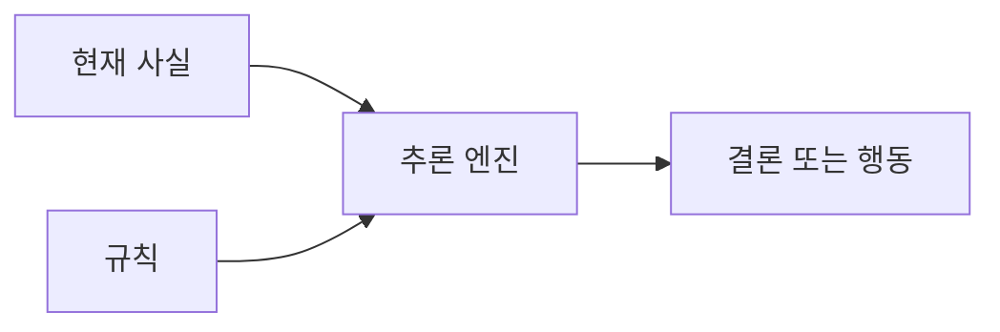

# 2.1 기호 기반 AI와 규칙 기반 접근

Chapter 1에서는 AI라는 말의 범위와 용어 관계를 정리했습니다. Chapter 2에서는 AI가 어떤 방식으로 문제를 풀려고 해 왔는지 역사적 패러다임을 봅니다. 이번 절의 중심은 기호 기반 AI(symbolic AI)와 규칙 기반 접근(rule-based approach)입니다.

기호 기반 AI는 인간의 지식을 기호(symbol), 규칙(rule), 논리(logic), 명시적 표현(representation)으로 나타내고, 그 표현을 조작해 결론이나 행동을 얻으려는 접근입니다. 쉽게 말하면 “사람이 정리한 지식을 컴퓨터가 다룰 수 있는 형식으로 적고, 그 형식 위에서 추론하게 만들자”는 생각입니다.

## 목표

- 기호 기반 AI가 무엇을 하려 했는지 이해합니다.
- 규칙, 지식 표현, 추론, 탐색이 어떻게 연결되는지 봅니다.
- 규칙 기반 접근의 강점과 한계를 구분합니다.
- 이 접근이 왜 여전히 일부 시스템에서 유용한지 이해합니다.

## 왜 이런 접근이 먼저 등장했는가

초기 AI 연구자들이 마주한 큰 질문은 “지능적인 행동을 어떻게 컴퓨터 프로그램으로 만들 것인가”였습니다. 그중 한 흐름은 사람이 알고 있는 사실, 규칙, 추론 절차를 명시적으로 적고, 컴퓨터가 그것을 조작해 결론을 내게 하는 방식이었습니다.

Stanford Encyclopedia of Philosophy의 논리 기반 AI 항목은 John McCarthy가 상식 추론(commonsense reasoning)을 형식화하기 위해 철학적 논리의 아이디어를 사용하려 했다고 설명합니다. 이 흐름에서는 지능을 “기호로 표현된 사실과 규칙을 조작해 결론이나 행동을 얻는 과정”으로 보려는 경향이 강했습니다.

규칙 기반 접근은 이런 생각을 실제 시스템으로 옮기기 쉬운 형태였습니다. 전문가가 알고 있는 판단 기준을 조건, 상황, 패턴, 결론, 행동 같은 명시적 규칙으로 적으면, 컴퓨터는 현재 사실과 규칙을 대조해 결론을 낼 수 있습니다. 초기 전문가 시스템은 큰 절차적 규칙 집합에 기반했고, 이후에는 배경 지식을 따로 표현하는 지식 표현(knowledge representation)의 필요성이 강조되었습니다.

따라서 기호 기반 AI와 규칙 기반 접근은 단순히 오래된 기술이라기보다, “지식을 명시적으로 적고, 그 지식 위에서 추론하게 하자”는 초기 AI의 중요한 문제 해결 전략으로 이해할 수 있습니다.

## 왜 “symbolic”이라고 부르는가

여기서 말하는 symbol은 문학이나 예술에서 말하는 상징과 다릅니다. AI 역사에서의 symbol은 컴퓨터가 구분하고 조작할 수 있도록 이름 붙인 명시적 표식, 즉 기호에 가깝습니다. 예를 들어 `비`, `길이 젖음`, `환자`, `증상`, `체스 말의 위치`, `규칙 A`처럼 대상, 상태, 개념, 관계를 나타내는 표식입니다.

이 절에서는 symbolic AI를 기본적으로 “기호 기반 AI”라고 부릅니다. “상징주의 AI”, “기호주의 AI”, “상징적 AI”, “심볼릭 인공지능” 같은 표현도 볼 수 있지만, 국내 학술 검색 결과에서는 표현이 고르게 정착되어 있다고 보기 어렵습니다. 특히 “상징”이나 “기호”는 예술, 기호학, 종교, 문화 연구에서도 많이 쓰이므로 AI 패러다임을 가리키는 말인지 문맥 확인이 필요합니다.

기호 기반 AI(symbolic AI)는 이런 표식들을 조합해 지식을 표현하고, 그 표현 위에서 규칙 적용, 논리 추론, 탐색을 수행하려는 흐름을 가리킵니다. 따라서 이 책에서 “기호 기반”이라는 말은 “기호와 명시적 표현을 중심으로 지능을 구현하려는 AI 접근”이라는 뜻으로 사용합니다.

비슷한 표현들이 함께 등장하기 때문에 다음처럼 구분해 읽으면 좋습니다.

| 표현 | 영어 표현 | 이 책에서의 의미 |
| --- | --- | --- |
| 기호 기반 AI | symbolic AI | 이 책의 기본 표현. 기호, 규칙, 명시적 지식 표현을 중심으로 하는 넓은 접근 |
| 심볼릭 인공지능, 상징적 AI | symbolic AI | 국내 자료에서 보이는 표현. 다만 문맥에 따라 예술·기호학적 의미와 섞일 수 있음 |
| 상징주의 AI, 기호주의 AI | symbolic AI | 의미 전달은 가능하지만 독자에게 낯설 수 있어 이 책의 기본 표현으로는 쓰지 않음 |
| 논리 기반 AI | logic-based AI | 논리 형식과 추론 규칙을 강하게 사용하는 기호 기반 AI 계열 |
| 규칙 기반 접근 | rule-based approach | 조건, 상황, 패턴에 따라 결론이나 행동을 정하는 규칙으로 판단을 구성하는 구현 방식 |
| 고전적 AI | classical AI | 딥러닝 이전의 AI 흐름을 넓게 부를 때 쓰는 말. 범위가 넓으므로 문맥 확인이 필요함 |

즉, symbolic AI를 처음 접할 때는 “컴퓨터에게 사람이 읽을 수 있는 이름표와 규칙을 주고, 그것을 조작해 결론을 내게 하는 방식”으로 이해하면 됩니다.

## 기호로 세계를 표현하려는 시도

기호 기반 AI의 출발점은 지식을 명시적으로 표현할 수 있다는 생각입니다. 사람은 “비가 오면 길이 젖는다”, “환자가 특정 증상을 보이면 어떤 질병을 의심한다”, “체스에서 이 수를 두면 다음 상태가 이렇게 바뀐다”처럼 세계에 대한 지식을 문장, 규칙, 기호, 관계로 표현할 수 있습니다.

기호 기반 AI는 이런 표현을 컴퓨터가 다룰 수 있는 구조로 바꾸려 했습니다. 대표적인 재료는 다음과 같습니다.

| 구성 요소 | 영어 표현 | 역할 |
| --- | --- | --- |
| 기호 | symbol | 사람이나 시스템이 구분할 수 있는 대상, 개념, 상태를 나타냄 |
| 규칙 | rule | 어떤 조건에서 어떤 결론이나 행동을 낼지 표현함 |
| 지식 표현 | knowledge representation | 사실, 관계, 개념, 규칙을 저장하고 다루는 형식 |
| 추론 | reasoning, inference | 주어진 지식에서 새로운 결론을 이끌어 내는 과정 |
| 탐색 | search | 가능한 상태나 해답 후보를 따라가며 목표를 찾는 과정 |

이 관점에서 AI 시스템은 데이터에서 패턴을 자동으로 학습하기보다, 사람이 정리한 지식과 규칙을 사용해 문제를 풉니다. 그래서 기호 기반 AI는 사람이 규칙을 직접 쓰는 방식, 논리로 결론을 도출하는 방식, 가능한 상태를 탐색하는 방식과 깊게 연결됩니다.

## 규칙 기반 접근의 기본 모양

규칙 기반 접근은 기호 기반 AI를 이해하기 쉬운 형태로 보여줍니다. 핵심은 현재 사실이나 상황을 명시적 규칙과 대조해 결론, 분류, 행동, 처리 절차를 정하는 것입니다.

> 조건/상황/패턴 -> 결론/분류/행동/처리

`IF 조건 THEN 결론`은 이런 규칙을 설명할 때 자주 쓰는 단순한 표기입니다. 하지만 규칙 기반 접근 전체가 반드시 이 문법으로만 작성되는 것은 아닙니다. 규칙은 다음처럼 여러 형태로 나타날 수 있습니다.

| 상황 | 규칙의 예 | 결과 |
| --- | --- | --- |
| 생활 판단 | 비가 오고 외출 예정이면 우산을 챙긴다 | 행동 결정 |
| 업무 처리 | 결제 금액이 승인 한도를 넘으면 관리자 승인 단계로 보낸다 | 처리 절차 선택 |
| 분류 | 혈압, 체온, 증상 조합이 기준 범위에 들어오면 추가 확인 대상으로 분류한다 | 분류 또는 경고 |
| 접근 제어 | 사용자의 역할이 `관리자`가 아니면 설정 변경을 허용하지 않는다 | 허용 또는 차단 |
| 추천 | 고객 등급, 구매 이력, 재고 상태가 조건에 맞으면 특정 상품군을 우선 노출한다 | 추천 목록 조정 |
| 안전 정책 | 입력이 금지된 요청 유형과 일치하면 응답을 중단하거나 안전한 안내로 전환한다 | 정책 적용 |

같은 내용을 `IF-THEN` 표기로 바꾸면 다음처럼 쓸 수 있습니다.

> IF 비가 온다 THEN 우산을 챙긴다
> IF 결제 금액이 승인 한도를 넘는다 THEN 관리자 승인 단계로 보낸다
> IF 체온이 높고 기침이 있다 THEN 감염 가능성을 확인한다
> IF 사용자의 역할이 관리자가 아니다 THEN 설정 변경을 차단한다

이 예시는 실제 의료·비즈니스·보안 규칙으로 쓰기에는 너무 단순합니다. 여기서 중요한 것은 구조입니다. 규칙 기반 시스템은 사실(fact)과 규칙(rule)을 모아 두고, 현재 상황에 맞는 규칙을 적용해 결론을 냅니다.

전문가 시스템(expert system)은 이런 규칙 기반 접근이 실제 응용으로 발전한 대표 사례입니다. 전문가의 판단을 규칙과 지식으로 정리해, 특정 영역의 진단, 분류, 추천, 의사결정을 보조하려 했습니다. 다만 이 절에서는 전문가 시스템을 깊게 다루지 않습니다. 여기서는 기호 기반 AI와 규칙 기반 접근의 기본 사고방식만 잡고, 장점과 한계는 3.1에서 다시 정리합니다.

## 논리 기반 AI와 지식 표현

규칙 기반 접근이 명시적 규칙을 적용해 판단을 구성하는 방식에 가깝다면, 논리 기반 AI(logic-based AI)는 더 형식적인 언어로 지식을 표현하고 추론하려는 흐름입니다. Stanford Encyclopedia of Philosophy의 논리 기반 AI 항목은 John McCarthy가 상식 추론(commonsense reasoning)을 형식화하려 했고, 철학적 논리의 아이디어를 AI에 적용하려 했다고 설명합니다.

이 흐름에서 중요한 질문은 다음과 같습니다.

- 세계의 사실과 관계를 어떤 언어로 표현할 것인가?
- 그 표현에서 어떤 결론이 따라나온다고 볼 것인가?
- 새 정보가 들어오면 기존 결론을 어떻게 바꿀 것인가?
- 행동과 시간 변화는 어떻게 표현할 것인가?
- 상식처럼 애매하고 예외가 많은 지식을 어떻게 다룰 것인가?

이 질문들은 현대 AI에서도 완전히 사라지지 않았습니다. LLM이나 딥러닝 모델을 쓰더라도, 서비스 정책, 권한, 안전 필터, 업무 규칙, 검증 로직은 여전히 명시적 규칙으로 관리되는 경우가 많습니다.

## 강점: 설명 가능하고 통제하기 쉽다

기호 기반 AI와 규칙 기반 접근의 강점은 사람이 구조를 읽을 수 있다는 점입니다.

- 규칙이 명시되어 있어 어떤 조건에서 어떤 결론이 나오는지 추적하기 쉽습니다.
- 도메인 전문가가 지식을 직접 검토하고 수정할 수 있습니다.
- 법, 정책, 업무 절차처럼 명시적 기준이 중요한 영역에 맞습니다.
- 같은 입력에 대해 같은 출력을 내도록 통제하기 쉽습니다.
- 시스템이 왜 그렇게 판단했는지 설명하기가 비교적 쉽습니다.

이런 이유로 규칙 기반 접근은 오래된 방식이지만 사라진 방식은 아닙니다. AI 서비스 안에서도 권한 검사, 금지어 필터, 정책 위반 탐지의 일부, 업무 절차 검증, 라우팅 규칙처럼 명시적이고 반복 가능한 부분에는 규칙이 여전히 유용합니다.

## 한계: 모든 지식을 규칙으로 쓰기 어렵다

반대로 한계도 분명합니다. 현실 세계의 문제는 예외가 많고, 상황이 자주 바뀌며, 사람이 규칙으로 정확히 설명하기 어려운 경우가 많습니다.

예를 들어 이미지를 보고 사물을 알아보는 일, 자연스러운 문장을 이해하는 일, 음성의 미묘한 차이를 구분하는 일은 사람이 할 수는 있지만 모든 규칙을 문장으로 적기 어렵습니다. 이런 문제에서는 데이터에서 패턴을 학습하는 접근이 더 강해질 수 있습니다.

규칙 기반 접근의 대표적 한계는 다음과 같습니다.

- 규칙을 직접 작성하고 유지하는 비용이 큽니다.
- 예외가 늘어나면 규칙이 복잡해지고 충돌할 수 있습니다.
- 규칙으로 표현하지 못한 상황에는 약합니다.
- 모호한 입력, 잡음이 있는 데이터, 불완전한 정보에 취약할 수 있습니다.
- 학습을 통해 스스로 표현을 개선하는 능력은 제한적입니다.

따라서 “규칙 기반 AI가 틀렸고 머신러닝이 맞다”라고 보는 것은 단순합니다. 더 정확히는 문제의 성격이 달라진 것입니다. 명시적 규칙으로 충분한 문제도 있고, 데이터에서 패턴을 학습해야 더 잘 풀리는 문제도 있습니다.

## 데이터 라벨링과의 느슨한 연결

데이터 라벨링(data labeling)도 이 관점과 느슨하게 연결됩니다. 지도학습(supervised learning)에서 라벨(label)은 데이터에 붙은 정답, 이름, 범주에 가깝습니다. 예를 들어 이미지에 `고양이`, `개`, `정상`, `불량` 같은 라벨을 붙이면, 모델은 입력 특징과 라벨 사이의 관계를 학습합니다.

이때 라벨은 사람이 세계를 구분해 붙인 명시적 이름이라는 점에서 기호처럼 볼 수 있습니다. 하지만 데이터 라벨링을 기호 기반 AI와 같은 것으로 보지는 않습니다. 데이터 라벨링은 주로 머신러닝 모델이 학습할 데이터를 준비하는 과정이고, 기호 기반 AI는 기호와 규칙 자체를 직접 조작해 추론하려는 접근입니다.

따라서 이 절에서는 둘의 관계를 다음처럼만 기억합니다.

> 라벨은 학습 데이터 안에 들어간 명시적 이름표이며, 기호 기반 AI와 머신러닝이 만나는 접점처럼 볼 수 있습니다. 다만 라벨링은 추론 방식이 아니라 학습 데이터를 구성하는 방법입니다.

## 이 절에서 기억할 관점

기호 기반 AI는 실패한 과거가 아니라, AI가 지식을 어떻게 다루려 했는지 보여주는 중요한 출발점입니다. 이 접근은 “지능은 기호와 규칙을 조작하는 과정으로 설명할 수 있다”는 강한 직관을 갖고 있었습니다.

현대 AI는 딥러닝과 생성형 AI로 크게 확장되었지만, 기호 기반 AI가 던진 질문은 여전히 남아 있습니다. AI가 무엇을 알고 있는가, 왜 그런 결론을 냈는가, 어떤 규칙을 지켜야 하는가, 사람이 검토할 수 있는가 같은 문제는 지금도 중요합니다.

이 책에서는 기호 기반 AI와 규칙 기반 접근을 다음처럼 읽습니다.

> 기호 기반 AI는 지식을 사람이 읽을 수 있는 기호와 규칙으로 표현하고, 그 표현 위에서 추론과 탐색을 수행하려 한 접근입니다. 이 접근은 설명 가능성과 통제 가능성이 강하지만, 현실 세계의 모호함과 예외, 대규모 패턴 인식에는 한계를 보였습니다.

## 체크리스트

- 기호 기반 AI가 기호, 규칙, 지식 표현, 추론을 중심으로 한다는 점을 설명할 수 있다.
- 규칙 기반 접근이 조건, 상황, 패턴에 따라 결론이나 행동을 정하는 명시적 규칙을 사용한다는 점을 설명할 수 있다.
- 규칙 기반 접근이 설명 가능성과 통제 가능성에서 강점을 가진다는 점을 설명할 수 있다.
- 모든 지식을 규칙으로 작성하기 어렵다는 한계를 설명할 수 있다.
- 데이터 라벨은 기호처럼 볼 수 있지만, 데이터 라벨링과 기호 기반 AI를 같은 것으로 보지 않는다는 점을 설명할 수 있다.
- 규칙 기반 접근과 학습 기반 접근을 단순한 우열 관계가 아니라 문제 성격의 차이로 볼 수 있다.

## 출처와 참고 자료

- Stanford Encyclopedia of Philosophy, Selmer Bringsjord and Naveen Sundar Govindarajulu, [Artificial Intelligence](https://plato.stanford.edu/entries/artificial-intelligence/), 2018-07-12, 확인 날짜: 2026-06-22.
- Stanford Encyclopedia of Philosophy, Richmond H. Thomason, [Logic-Based Artificial Intelligence](https://plato.stanford.edu/entries/logic-ai/), substantive revision 2024-02-27, 확인 날짜: 2026-06-22.
- Stuart Russell, Peter Norvig, [Artificial Intelligence: A Modern Approach, 4th US ed.](https://aima.cs.berkeley.edu/), 확인 날짜: 2026-06-22.
- Google for Developers, [Machine Learning Glossary](https://developers.google.com/machine-learning/glossary), 확인 날짜: 2026-06-22.
- Google for Developers, [Supervised Learning](https://developers.google.com/machine-learning/intro-to-ml/supervised), 확인 날짜: 2026-06-22.
- 한국학술지인용색인(KCI), [논문 검색](https://www.kci.go.kr/kciportal/po/search/poArtiSear.kci), 검색어: `상징주의 AI`, `기호주의 AI`, `상징적 AI`, `심볼릭 인공지능`, `symbolic AI`, `기호 기반 인공지능`, `규칙 기반 인공지능`, 확인 날짜: 2026-06-22.
