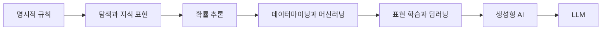

# 2.3 머신러닝, 딥러닝, 생성형 AI로의 흐름

2.1에서는 기호 기반 AI와 규칙 기반 접근을 봤고, 2.2에서는 탐색, 지식 표현, 확률 추론을 봤습니다. 이번 절에서는 그 다음 흐름을 봅니다. 왜 AI의 중심 설명은 점점 데이터에서 학습하는 모델로 이동했을까요?

이 절의 목적은 머신러닝, 딥러닝, 생성형 AI를 깊게 설명하는 것이 아닙니다. 그것은 Part 3, Part 4, Part 5에서 따로 다룹니다. 여기서는 “사람이 규칙을 모두 쓰는 방식”에서 “데이터와 경험으로 모델을 학습하는 방식”으로 중심이 이동한 이유를 역사적 관점에서 잡습니다.

## 목표

- 규칙 기반 접근만으로 풀기 어려운 문제가 왜 데이터 기반 학습으로 이어졌는지 이해합니다.
- 머신러닝, 딥러닝, 생성형 AI를 역사적 흐름 속에서 구분합니다.
- 데이터, 특징, 표현, 모델, 파라미터가 왜 중요해졌는지 봅니다.
- 생성형 AI와 LLM을 갑작스러운 단절이 아니라 누적된 흐름의 결과로 읽습니다.

## 규칙을 모두 쓰기 어려운 문제

규칙 기반 접근은 사람이 판단 기준을 명시적으로 적을 수 있을 때 강합니다. 업무 승인, 권한 검사, 정책 적용, 단순 분류처럼 기준이 비교적 분명한 문제에서는 여전히 유용합니다.

하지만 현실의 많은 문제는 규칙으로 모두 쓰기 어렵습니다.

| 문제 | 규칙으로 쓰기 어려운 이유 |
| --- | --- |
| 사진에서 사물 알아보기 | 픽셀 조합을 사람이 규칙으로 다 적기 어렵습니다. |
| 자연어 문장 이해 | 문맥, 생략, 중의성, 표현 차이가 많습니다. |
| 스팸 메일 판단 | 단어 몇 개만으로 확정하기 어렵고 공격자가 계속 회피합니다. |
| 고객 이탈 예측 | 행동 패턴이 복잡하고 시간에 따라 바뀝니다. |
| 음성 인식 | 발음, 억양, 잡음, 녹음 환경이 계속 달라집니다. |

이런 문제에서는 “어떤 규칙을 사람이 직접 쓸 것인가?”보다 “데이터에서 어떤 관계를 학습할 수 있는가?”가 더 중요한 질문이 됩니다. 머신러닝(machine learning)은 바로 이 질문을 중심에 둡니다.

Stanford Encyclopedia of Philosophy의 AI 항목은 머신러닝 시스템을 예시가 주어졌을 때 특정 과제의 성능을 개선하는 시스템으로 설명합니다. 이 관점에서 학습은 사람이 모든 규칙을 작성하는 일이 아니라, 데이터와 경험을 통해 모델의 판단 기준을 조정하는 일입니다.

## 머신러닝: 규칙 작성에서 모델 학습으로

머신러닝은 데이터나 경험을 사용해 모델(model)의 성능을 개선하는 접근입니다. 여기서 모델은 입력을 받아 예측, 분류, 추천, 점수, 행동 같은 출력을 만드는 계산 구조입니다.

> 데이터/경험 -> 학습 -> 모델 -> 예측/분류/추천/행동

규칙 기반 접근과 머신러닝의 차이는 다음처럼 볼 수 있습니다.

| 구분 | 규칙 기반 접근 | 머신러닝 접근 |
| --- | --- | --- |
| 판단 기준 | 사람이 명시적으로 작성한 규칙 | 데이터에서 학습한 모델 |
| 개발자의 중심 작업 | 규칙 작성, 예외 처리, 규칙 충돌 관리 | 데이터 준비, 특징 설계, 학습, 평가 |
| 강점 | 설명과 통제가 비교적 쉬움 | 복잡한 패턴을 데이터에서 학습할 수 있음 |
| 약점 | 예외와 변화에 취약할 수 있음 | 데이터 품질, 편향, 과적합, 설명 가능성 문제가 생김 |
| 오류 검토 | 규칙이 맞는지 검토 | 학습 데이터와 평가 결과를 검토 |

머신러닝은 한 가지 방식이 아닙니다. 지도학습(supervised learning)은 정답이 붙은 예시에서 입력과 출력의 관계를 학습합니다. 비지도학습(unsupervised learning)은 정답 없이 데이터 안의 구조나 패턴을 찾습니다. 강화학습(reinforcement learning)은 행동의 결과로 얻는 보상을 통해 더 나은 행동 방식을 학습합니다.

이 절에서는 세 학습 유형을 이름만 잡습니다. 자세한 내용은 Chapter 8에서 다룹니다.

| 학습 유형 | 영어 표현 | 기본 질문 |
| --- | --- | --- |
| 지도학습 | supervised learning | 입력이 주어졌을 때 어떤 정답이나 값을 예측할 것인가? |
| 비지도학습 | unsupervised learning | 정답 없이 데이터 안의 구조를 어떻게 찾을 것인가? |
| 강화학습 | reinforcement learning | 행동의 결과가 나중에 보상으로 돌아올 때 어떤 정책을 배울 것인가? |

## 데이터마이닝과 데이터 기반 판단의 배경

머신러닝으로의 이동은 AI 내부의 변화만으로 설명되지 않습니다. 데이터가 많이 쌓이고, 그 데이터에서 패턴을 찾으려는 실무적 요구도 함께 커졌습니다.

Fayyad, Piatetsky-Shapiro, Smyth의 KDD 개요 논문은 KDD(knowledge discovery in databases)를 데이터에서 유용한 지식을 발견하는 전체 과정으로 설명하고, 데이터마이닝(data mining)을 그 과정 안에서 특정 알고리즘으로 패턴을 추출하는 단계로 구분합니다. 이 문헌은 KDD가 데이터베이스, 통계, AI, 머신러닝과 만나는 다학제적 활동이라고 설명합니다.

이 흐름은 사용자가 기억하는 빅데이터(big data), 데이터마이닝, 의사결정지원시스템(DSS, decision support system), 비즈니스 인텔리전스(BI, business intelligence)와도 연결됩니다. 이들은 AI 모델 그 자체는 아니지만, 데이터를 저장하고 분석하고 의사결정에 연결하는 문화와 인프라를 키웠습니다.

| 흐름 | 역할 | AI와의 연결 |
| --- | --- | --- |
| 데이터 웨어하우스, BI, DSS | 데이터를 모아 보고 판단을 지원함 | 데이터 기반 의사결정 문화의 기반 |
| KDD와 데이터마이닝 | 데이터에서 유용한 패턴을 찾음 | 머신러닝, 통계, 데이터베이스가 만나는 영역 |
| 머신러닝 | 데이터에서 예측·분류 모델을 학습함 | 패턴 발견을 자동화된 판단으로 연결 |
| 현대 AI 서비스 | 모델, 데이터, 검색, 규칙, UI를 조합함 | 데이터 기반 판단을 실제 워크플로우에 배치 |

따라서 “AI가 규칙에서 데이터 기반 판단으로 이동했다”는 관점은 유용합니다. 다만 AI라는 말 자체가 처음부터 데이터 기반 판단만을 뜻한 것은 아닙니다. 더 안전한 표현은 다음과 같습니다.

> 현대 AI를 이해할 때는 규칙, 탐색, 지식 표현, 확률 추론의 층위(level) 위에 데이터에서 판단 기준을 학습하는 머신러닝의 층위(level)가 강하게 추가되었다고 보는 것이 좋습니다.

## 딥러닝: 특징 설계에서 표현 학습으로

머신러닝에서는 데이터가 곧바로 모델에 들어가는 것이 아닙니다. 대개 데이터를 모델이 다룰 수 있는 특징(feature)이나 표현(representation)으로 바꿔야 합니다.

예를 들어 이메일을 스팸인지 판단하려면 단어 빈도, 발신자 정보, 링크 수, 제목 패턴 같은 특징을 만들 수 있습니다. 이미지에서는 색, 모서리, 질감, 형태 같은 특징을 생각할 수 있습니다. 전통적인 머신러닝에서는 사람이 어떤 특징을 만들지 설계하는 일이 중요했습니다.

딥러닝(deep learning)은 이 지점을 크게 바꿨습니다. 딥러닝은 여러 층을 가진 신경망(neural network)을 사용해 데이터에서 유용한 표현을 함께 학습하려는 접근입니다. Stanford Encyclopedia of Philosophy의 AI 항목도 딥러닝을 표현 학습(representation learning)과 연결해 설명합니다.

| 구분 | 전통적 머신러닝의 전형적 흐름 | 딥러닝의 전형적 흐름 |
| --- | --- | --- |
| 특징 | 사람이 많이 설계함 | 모델이 데이터에서 표현을 학습함 |
| 모델 | 상대적으로 얕은 모델도 많이 사용 | 여러 층의 신경망을 사용 |
| 강점 | 데이터가 적거나 구조가 명확한 문제에 유용 | 이미지, 음성, 언어처럼 복잡한 입력에서 강함 |
| 부담 | 특징 설계와 도메인 지식이 중요 | 많은 데이터, 계산 자원, 평가가 중요 |

딥러닝을 생물학적 뇌와 같다고 이해하면 곤란합니다. 신경망과 시냅스라는 비유는 학습을 직관적으로 이해하는 데 도움이 되지만, 인공신경망은 생물학적 뇌의 복사본이 아닙니다. 이 책에서는 딥러닝을 다음처럼 설명합니다.

> 딥러닝은 학습 가능한 가중치(weight)를 가진 여러 층의 신경망으로 데이터의 표현과 예측 규칙을 찾는 최적화 과정입니다.

분류, 언어 모델링, 생성 모델처럼 출력이 확률로 해석되는 경우에는 딥러닝을 “좋은 확률적 예측 모델을 찾는 시도”로 볼 수 있습니다. 하지만 모든 딥러닝 모델을 명시적인 확률 모델이라고 부르기는 어렵습니다. 그래서 이 책에서는 확률 모델(probabilistic model), 표현 학습(representation learning), 최적화(optimization)를 구분해서 설명합니다.

## 생성형 AI: 판단에서 생성으로 보이는 전환

생성형 AI(generative AI)는 텍스트, 이미지, 오디오, 영상, 코드 같은 새 콘텐츠를 만들어 내는 AI 모델과 서비스를 가리킵니다. NIST의 생성형 AI 프로파일은 생성형 AI를 입력 데이터의 구조와 특성을 모방해 파생된 합성 콘텐츠를 생성하는 AI 모델 범주로 설명하고, 이미지, 영상, 오디오, 텍스트 같은 디지털 콘텐츠를 예로 듭니다.

이 정의에서 중요한 점은 생성형 AI가 “사실을 말하는 기계”가 아니라는 것입니다. 생성형 AI는 학습 데이터의 구조와 패턴을 바탕으로 그럴듯한 출력을 생성합니다. 따라서 생성 결과가 자연스럽다고 해서 자동으로 사실이 되는 것은 아닙니다.

| 구분 | 중심 출력 | 예 |
| --- | --- | --- |
| 분류 | 범주 | 정상/불량, 스팸/정상 |
| 예측 | 값 또는 점수 | 매출 예측, 이탈 확률 |
| 추천 | 후보 목록 | 상품 추천, 문서 추천 |
| 생성 | 새 콘텐츠 | 문장, 이미지, 코드, 음성 |

여기서 한국어의 `추론`이라는 말은 주의해야 합니다. AI 문맥에서 inference는 학습된 모델을 실행해 출력을 만드는 사용 시점의 계산을 뜻할 수 있습니다. 반면 reasoning은 근거를 따라 문제를 푸는 논리적 사고를 뜻합니다. 생성형 AI가 inference에서 출력을 만든다고 해서, 그 출력이 항상 논리적으로 추론된 사실이라는 뜻은 아닙니다.

## LLM은 이 흐름에서 어디에 있는가

LLM(large language model, 대규모 언어 모델)은 생성형 AI를 대표하는 모델 계열이지만, 생성형 AI 전체와 같은 말은 아닙니다. LLM은 언어 데이터를 중심으로 학습한 대규모 언어 모델입니다. Zhao 등의 LLM survey는 언어 모델이 통계적 언어 모델에서 신경망 언어 모델, 사전학습 언어 모델을 거쳐 대규모 언어 모델로 발전해 왔다고 설명합니다.

이 절에서 중요한 것은 LLM을 갑자기 등장한 예외로 보지 않는 것입니다. LLM은 다음 흐름 위에서 이해할 수 있습니다.

이 그림은 대체 관계가 아니라 누적 관계를 보여줍니다. 현대 AI 서비스는 LLM만으로 이루어지지 않습니다. 검색, 데이터베이스, 지식 그래프, 규칙 기반 필터, 권한 관리, 평가, UI, 운영 시스템이 함께 들어갈 수 있습니다.

따라서 이 절의 흐름은 다음처럼 읽는 것이 안전합니다.

> AI의 중심 설명은 명시적 규칙과 탐색에서 시작해, 불확실성을 다루는 확률 추론과 데이터에서 패턴을 학습하는 머신러닝으로 확장되었습니다. 딥러닝은 데이터에서 표현을 학습하는 능력을 크게 확장했고, 생성형 AI와 LLM은 그 표현 학습과 대규모 데이터, 계산 자원, 언어 모델링이 결합된 최근의 강한 사례입니다.

## 사용자의 관점을 일반화하기

사용자는 AI를 “SW의 함수를 무언가로 바꾼 것”처럼 이해하고 있습니다. 이 관점은 학습용 비유로 유용합니다. 전통적인 소프트웨어 함수가 사람이 작성한 로직으로 입력을 처리한다면, 머신러닝 모델은 데이터로 학습된 파라미터를 사용해 입력을 처리합니다.

다만 모델은 단순한 함수 하나보다 넓은 시스템 안에 놓입니다. 실제 서비스에서는 다음 흐름이 함께 움직입니다.

> 사용자 요청 -> 입력 정리 -> 모델 또는 도구 실행 -> 결과 검토 -> 응답 또는 업무 처리

이 구조는 사람이 일을 처리하는 워크플로우(workflow)와 닮았습니다. 어떤 단계는 규칙으로 고정하고, 어떤 단계는 검색으로 보강하며, 어떤 단계는 모델이 예측하거나 생성하게 만들 수 있습니다. 중요한 것은 모든 것을 AI에게 맡기는 것이 아니라, 반복 가능하고 검증 가능한 부분을 찾아 시스템으로 구성하는 일입니다.

이 책에서는 이 관점을 다음 문장으로 정리합니다.

> 현대 AI 서비스는 사람이 직접 작성한 로직, 데이터에서 학습한 모델, 검색과 도구, 검증 절차를 조합해 요청을 처리하는 워크플로우로 이해할 수 있습니다.

## 이 절에서 기억할 관점

머신러닝, 딥러닝, 생성형 AI는 서로 다른 이름이지만, 한 가지 흐름으로 읽을 수 있습니다. 사람이 규칙을 모두 쓰기 어려운 문제에서 데이터 기반 학습이 중요해졌고, 딥러닝은 그 학습이 특징 설계를 넘어 표현 자체를 배우는 방향으로 확장되었으며, 생성형 AI는 학습된 표현을 사용해 새 콘텐츠를 만드는 방향을 강하게 보여줍니다.

하지만 이것은 기존 접근을 완전히 대체했다는 뜻이 아닙니다. 규칙, 탐색, 지식 표현, 확률 추론, 데이터마이닝, 머신러닝, 딥러닝, 생성형 AI는 실제 시스템 안에서 섞입니다. AI의 역사는 하나의 기술이 이전 기술을 지워 버린 역사가 아니라, 문제를 푸는 도구가 층층이 늘어난 역사로 보는 편이 안전합니다.

## 체크리스트

- 규칙 기반 접근만으로 풀기 어려운 문제가 왜 데이터 기반 학습으로 이어졌는지 설명할 수 있다.
- 머신러닝을 데이터나 경험으로 모델 성능을 개선하는 접근으로 설명할 수 있다.
- 데이터마이닝과 KDD가 데이터 기반 판단 문화와 연결되지만, 머신러닝과 완전히 같은 말은 아니라는 점을 설명할 수 있다.
- 딥러닝을 특징 설계를 줄이고 표현을 학습하는 신경망 기반 접근으로 설명할 수 있다.
- 생성형 AI가 새 콘텐츠를 생성하는 모델과 서비스 범주이며, 생성 결과가 곧 사실은 아니라는 점을 설명할 수 있다.
- LLM을 생성형 AI의 대표 사례로 보되, 생성형 AI 전체와 동일시하지 않을 수 있다.
- 현대 AI 서비스를 모델 하나가 아니라 규칙, 검색, 데이터, 모델, 검증이 조합된 워크플로우로 볼 수 있다.

## 출처와 참고 자료

- Stanford Encyclopedia of Philosophy, Selmer Bringsjord and Naveen Sundar Govindarajulu, [Artificial Intelligence](https://plato.stanford.edu/entries/artificial-intelligence/), 2018-07-12, 확인 날짜: 2026-06-22.
- Stuart Russell, Peter Norvig, [Artificial Intelligence: A Modern Approach, 4th US ed., Full Table of Contents](https://aima.cs.berkeley.edu/contents.html), 확인 날짜: 2026-06-22.
- David L. Poole, Alan K. Mackworth, [Artificial Intelligence: Foundations of Computational Agents, 3rd ed.](https://artint.info/3e/html/ArtInt3e.html), 확인 날짜: 2026-06-22.
- Usama Fayyad, Gregory Piatetsky-Shapiro, Padhraic Smyth, [From Data Mining to Knowledge Discovery in Databases](https://www.kdnuggets.com/gpspubs/aimag-kdd-overview-1996-Fayyad.pdf), AI Magazine, 1996, 확인 날짜: 2026-06-22.
- NIST, [Artificial Intelligence Risk Management Framework: Generative Artificial Intelligence Profile](https://doi.org/10.6028/NIST.AI.600-1), NIST AI 600-1, 2024-07, 확인 날짜: 2026-06-22.
- Wayne Xin Zhao et al., [A Survey of Large Language Models](https://arxiv.org/abs/2303.18223), arXiv:2303.18223, 확인 날짜: 2026-06-22.
