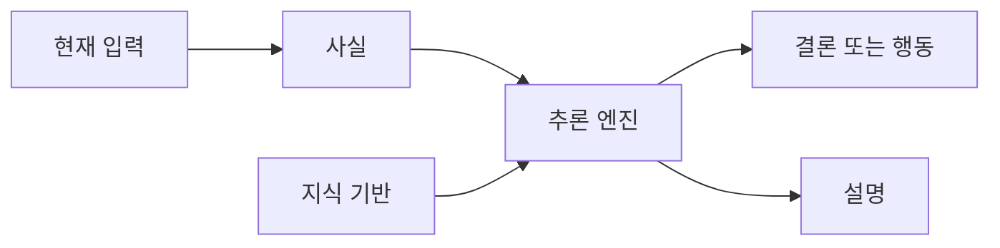
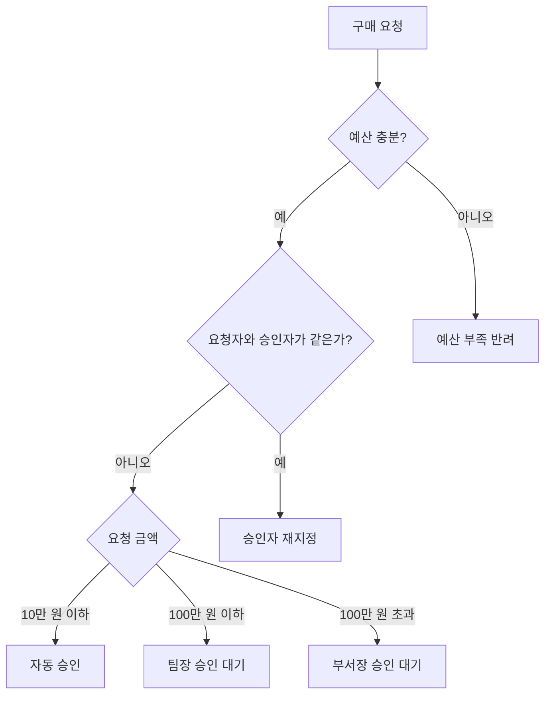
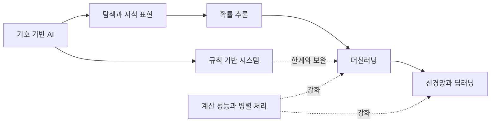

# 3.1 규칙 기반 시스템의 강점과 한계

2.1에서는 기호 기반 AI(symbolic AI)와 규칙 기반 접근(rule-based approach)의 역사적 위치를 봤습니다. 이번 절에서는 한 걸음 더 좁혀, 실제 규칙 기반 시스템(rule-based system)이 어떤 장점을 가졌고 어디에서 한계를 드러냈는지 정리합니다.

이 절의 목적은 규칙 기반 AI를 과거의 실패한 방식으로 단정하는 것이 아닙니다. 오히려 현대 AI 서비스를 이해하려면 규칙 기반 시스템이 왜 유용했고, 왜 머신러닝(machine learning)으로 관심이 이동했으며, 지금도 어떤 부분에서 규칙이 필요한지 구분해야 합니다.

## 목표

- 규칙 기반 시스템의 기본 구성 요소를 이해합니다.
- 규칙 기반 시스템이 설명 가능성과 통제 가능성에서 강한 이유를 봅니다.
- 전문가 시스템(expert system) 사례가 보여 준 가능성과 한계를 구분합니다.
- 규칙 작성, 지식 획득, 예외 관리가 왜 어려운지 이해합니다.
- 현대 시스템에서 규칙과 모델이 함께 쓰이는 위치를 간단히 잡습니다.

## 규칙 기반 시스템의 기본 구조

규칙 기반 시스템은 현재 사실(fact)이나 입력(input)을 규칙(rule)과 대조해 결론(conclusion), 분류(classification), 행동(action), 처리 절차(workflow)를 정하는 시스템입니다.

기본 구조는 다음처럼 볼 수 있습니다.

> 현재 사실 + 규칙 집합 -> 추론 엔진 -> 결론 또는 행동

조금 더 나누면 다음 요소가 필요합니다.

| 구성 요소 | 영어 표현 | 역할 |
| --- | --- | --- |
| 사실 | facts | 현재 입력, 관찰값, 사용자 상태, 업무 데이터 |
| 규칙 | rules | 어떤 조건에서 어떤 결론이나 행동을 낼지 적은 지식 |
| 지식 기반 | knowledge base | 사실, 규칙, 도메인 지식을 저장한 구조 |
| 추론 엔진 | inference engine | 현재 사실에 맞는 규칙을 찾아 적용하는 장치 |
| 설명 기능 | explanation facility | 어떤 규칙 때문에 결론이 나왔는지 보여 주는 기능 |

MYCIN 연구를 정리한 Buchanan과 Shortliffe의 책은 MYCIN을 규칙 기반 전문가 시스템의 대표 실험으로 다룹니다. 이 자료에서는 지식 기반, 규칙, 추론 절차, 설명 기능, 불확실성 처리 같은 요소가 별도로 논의됩니다. 즉 전문가 시스템은 단순히 `IF-THEN` 문을 많이 모아 둔 프로그램이 아니라, 도메인 지식을 어떻게 표현하고, 적용하고, 설명할지 연구한 시스템이었습니다.

## 예시: 승인 업무를 규칙으로 표현하기

규칙 기반 시스템을 가장 쉽게 이해할 수 있는 예는 승인 업무입니다. 승인 업무는 조건이 비교적 명확하고, 누가 왜 승인해야 하는지 기록해야 하며, 같은 조건에서는 같은 처리가 반복되어야 합니다.

예를 들어 회사의 구매 요청 처리 규칙을 단순화하면 다음처럼 쓸 수 있습니다.

| 현재 사실 | 적용할 규칙 | 결과 |
| --- | --- | --- |
| 요청 금액이 10만 원 이하이고, 예산 잔액이 충분함 | 팀장 승인 없이 자동 승인 | 승인 완료 |
| 요청 금액이 10만 원 초과 100만 원 이하 | 팀장 승인 필요 | 팀장 승인 대기 |
| 요청 금액이 100만 원 초과 | 부서장 승인 필요 | 부서장 승인 대기 |
| 예산 잔액이 부족함 | 금액과 관계없이 반려 | 예산 부족 반려 |
| 요청자가 승인자와 같음 | 자기 승인 금지 | 승인자 재지정 |

이를 절차로 보면 다음과 같습니다.

이 예시는 단순하지만 규칙 기반 시스템의 성격을 잘 보여 줍니다. 규칙은 사람이 읽을 수 있고, 결론을 설명할 수 있으며, 업무 정책이 바뀌면 특정 규칙을 수정할 수 있습니다.

다만 이 예시도 실제 업무에 들어가면 곧 복잡해집니다. 긴급 구매, 법인카드 예외, 프로젝트별 예산, 승인자 휴가, 감사 대상 품목, 공급업체 제한 같은 조건이 추가되기 때문입니다. 이 복잡성이 뒤에서 볼 규칙 기반 시스템의 한계로 이어집니다.

## 강점 1: 사람이 읽고 검토할 수 있다

규칙 기반 시스템의 가장 큰 장점은 판단 기준이 명시적이라는 점입니다. 규칙이 문서나 코드, 설정, 지식 기반 안에 드러나 있으므로 사람이 읽고 검토할 수 있습니다.

예를 들어 다음과 같은 규칙은 시스템의 판단 기준을 비교적 쉽게 설명할 수 있습니다.

> 결제 금액이 승인 한도를 넘으면 관리자 승인 단계로 보낸다.
> 사용자 권한이 관리자보다 낮으면 설정 변경을 차단한다.
> 온도 센서 값이 기준 범위를 넘으면 점검 알림을 보낸다.

이런 규칙은 완벽하지 않을 수 있지만, 적어도 “왜 이런 처리가 되었는가?”를 추적하기 쉽습니다. 도메인 전문가, 운영자, 감사자, 개발자가 같은 규칙을 놓고 토론할 수도 있습니다.

이 장점은 다음 상황에서 특히 중요합니다.

| 상황 | 규칙 기반 시스템이 유리한 이유 |
| --- | --- |
| 법, 정책, 권한 | 기준이 명시되어야 하고 변경 이력이 중요합니다. |
| 업무 승인 절차 | 누가 어떤 조건에서 승인해야 하는지 설명할 수 있어야 합니다. |
| 안전 필터 | 금지 조건과 허용 조건을 사람이 검토해야 합니다. |
| 운영 자동화 | 반복되는 조건 처리를 예측 가능하게 실행해야 합니다. |
| 교육과 진단 보조 | 결론뿐 아니라 이유를 보여 주는 것이 중요합니다. |

예를 들어 위의 구매 승인 시스템에서 “왜 부서장 승인 대기 상태가 되었는가?”라는 질문이 나오면 다음처럼 설명할 수 있습니다.

> 요청 금액이 100만 원을 초과했고,
> 예산 잔액은 충분하며,
> 요청자와 승인자가 같지 않으므로,
> 부서장 승인 규칙이 적용되었다.

이 설명은 모델의 내부 가중치를 해석하는 문제가 아니라, 어떤 사실과 어떤 규칙이 연결되었는지 추적하는 문제입니다. 그래서 규칙 기반 시스템은 감사(audit), 정책 검토, 운영 로그와 잘 맞습니다.

## 강점 2: 같은 입력에 같은 출력을 내기 쉽다

규칙 기반 시스템은 대개 결정적(deterministic)으로 동작합니다. 같은 사실과 같은 규칙이 주어지면 같은 결론이 나오는 구조를 만들기 쉽습니다.

이 점은 현대의 생성형 AI(generative AI)와 대비됩니다. 생성형 AI는 같은 요청에도 설정, 문맥, 모델 상태, 샘플링 방식에 따라 다른 출력을 만들 수 있습니다. 반면 규칙 기반 시스템은 명시적 조건이 맞으면 정해진 처리를 실행합니다.

그래서 규칙 기반 시스템은 다음처럼 “반드시 지켜야 하는 절차”에 적합합니다.

- 권한이 없으면 접근을 차단합니다.
- 필수 값이 없으면 다음 단계로 보내지 않습니다.
- 금지된 파일 형식은 업로드하지 않습니다.
- 약관 동의가 없으면 가입을 완료하지 않습니다.
- 배포 브랜치가 아니면 배포를 실행하지 않습니다.

이런 영역에서는 모델이 “대체로 그럴듯하게” 판단하는 것보다, 규칙이 “명확하게” 차단하거나 허용하는 것이 더 중요할 수 있습니다.

운영 시스템의 알림 규칙도 좋은 예입니다.

| 현재 상태 | 규칙 | 결과 |
| --- | --- | --- |
| CPU 사용률이 5분 동안 90% 이상 | 경고 알림 발송 | 운영자 확인 |
| 디스크 사용률이 95% 이상 | 긴급 알림 발송 | 즉시 조치 |
| 결제 실패율이 평소보다 급증 | 장애 후보로 표시 | 모니터링 강화 |
| 배포 직후 오류율이 기준 이상 | 롤백 검토 알림 | 배포 담당자 확인 |

이런 규칙은 예측 모델이 아니어도 충분히 유용합니다. 중요한 것은 “정해진 조건을 놓치지 않고 반복 실행하는 것”입니다.

## 강점 3: 작은 영역에서는 빠르게 유용해질 수 있다

규칙 기반 시스템은 문제 범위가 좁고 기준이 분명할 때 빠르게 유용해질 수 있습니다. 도메인 전문가가 판단 기준을 설명할 수 있고, 입력 데이터의 형태가 비교적 안정적이며, 예외가 많지 않다면 규칙은 강력한 도구가 됩니다.

전문가 시스템은 이런 가능성을 잘 보여 주었습니다. DENDRAL은 화학 지식을 활용해 분자 구조 후보를 찾는 연구로 알려졌고, MYCIN은 감염성 질환 영역에서 규칙과 불확실성 처리를 결합한 의료 상담 시스템으로 연구되었습니다. 이 사례들은 “도메인 지식을 잘 표현하면 특정 문제에서 강한 성능을 낼 수 있다”는 가능성을 보여 주었습니다.

다만 이 사례들을 현대 의료 서비스처럼 바로 일반화하면 안 됩니다. MYCIN은 연구 시스템이었고, 실제 임상 배포나 책임 문제는 별도의 검토가 필요한 영역입니다. 이 절에서는 전문가 시스템을 “규칙 기반 시스템의 가능성과 한계를 보여 주는 역사적 사례”로만 다룹니다.

학습용으로 단순화하면 전문가 시스템의 규칙은 다음과 같은 모양으로 이해할 수 있습니다.

> 관찰된 증상이나 검사 결과가 특정 조건을 만족하면,
> 가능한 원인 후보를 올리거나 내린다.
>
> 기계 장비의 진동이 기준 범위를 넘고,
> 최근 정비 이력이 오래되었으면,
> 점검 우선순위를 높인다.

이 예시는 실제 의료 진단이나 장비 정비 규칙으로 사용할 수 있는 완성된 규칙이 아닙니다. 중요한 것은 구조입니다. 전문가 시스템은 전문가가 가진 판단 단서를 지식 기반에 넣고, 현재 관찰값과 대조해 결론 후보를 좁히려 했습니다.

## 사례: 인식과 제어도 한때는 손으로 설계했다

규칙 기반 시스템의 장점과 한계는 전문가 시스템에만 나타난 것이 아닙니다. 얼굴인식(face recognition), 자율주행(autonomous driving), 음성 합성(TTS, text-to-speech) 같은 분야에서도 사람이 특징, 절차, 규칙을 직접 설계하려는 시도가 오래 이어졌습니다.

이 절에서 이 사례들을 자세한 기술사로 다루지는 않습니다. 목적은 얼굴인식, 자율주행, TTS 자체를 설명하는 것이 아니라, 사람이 직접 만든 규칙과 수작업 특징이 어떤 조건에서 유용했고 어떤 조건에서 한계에 부딪혔는지 보는 것입니다.

다만 여기서 표현을 조심해야 합니다. 얼굴인식의 초기 연구를 모두 “규칙 기반”이라고 부르는 것은 과장입니다. 더 정확히는 기하학적 특징(geometry-based features), 수작업 특징(hand-crafted features), 템플릿(template), 전통적 머신러닝을 조합한 접근이 많았습니다. 최근 얼굴인식 survey들은 전통적 방법을 geometry-based, holistic, feature-based, hybrid methods로 나누고, 이런 방법들이 CNN 기반 딥러닝으로 크게 대체되었다고 설명합니다.

| 분야 | 손으로 설계한 요소 | 유용했던 이유 | 한계 |
| --- | --- | --- | --- |
| 얼굴인식 | 눈, 코, 입, 턱 같은 얼굴 구성 요소의 위치와 거리, 수작업 특징 | 사람이 얼굴을 구분할 때 보는 단서를 계산 가능한 형태로 만들 수 있음 | 조명, 표정, 자세, 가림, 카메라 품질 변화에 약함 |
| 얼굴검출 | Haar-like feature, HOG 같은 수작업 특징과 분류기 | 얼굴 후보 영역을 빠르게 찾는 데 유용함 | 통제되지 않은 환경의 다양한 얼굴을 안정적으로 다루기 어려움 |
| 자율주행 차선 추적 | ROI(region of interest), 색상 변환, Canny edge, Hough transform, 조향 규칙 | 차선이 선명하고 환경이 단순하면 설명 가능한 파이프라인을 만들 수 있음 | 비, 눈, 그림자, 지워진 차선, 공사 구간, 복잡한 교통 상황에 취약함 |
| TTS | 글자-소리 변환, 발음 사전, 음절화, 강세, 동음이의어 처리 규칙 | 언어의 표기와 발음 규칙을 단계적으로 처리할 수 있음 | 예외 발음, 문맥, 억양, 감정, 자연스러움 표현이 어려움 |

자율주행에서도 비슷한 흐름을 볼 수 있습니다. 차선 추적 프로토타입 논문들은 카메라 영상에서 ROI를 정하고, Canny edge detection, Sobel filter, Hough transform 같은 영상 처리 기법으로 차선을 찾은 뒤, 차선 각도에 따라 차량을 직진·좌회전·우회전시키는 식의 절차를 설명합니다. 이런 방식은 작은 실험 환경에서는 이해하기 쉽고 구현도 가능합니다. 하지만 실제 도로는 조명, 날씨, 차선 상태, 보행자, 다른 차량, 공사 구간처럼 변수가 많습니다.

반대로 TTS는 규칙 기반 접근이 비교적 성공적으로 쓰인 영역으로 볼 수 있습니다. TTS 시스템은 입력 텍스트를 정규화하고, 단어를 발음으로 바꾸고, 음절과 강세와 억양 정보를 만든 뒤, 음향 신호를 생성합니다. Skut, Ulrich, Hammervold의 규칙 컴파일러 논문은 TTS에서 규칙 집합을 finite-state transducer(FST)로 변환해 결정적 장치로 구현하는 방식을 설명합니다. 이 사례는 규칙이 실패만 한 것이 아니라, 문제가 충분히 구조화되어 있으면 강력한 공학적 도구가 될 수 있음을 보여 줍니다.

이 비교에서 얻을 수 있는 결론은 단순합니다.

> 규칙과 수작업 특징은 사람이 이해한 구조를 시스템에 넣는 강력한 방법이었다. 다만 입력 세계가 너무 다양해지고 예외가 많아질수록, 사람이 모든 특징과 규칙을 직접 설계하는 방식은 한계에 부딪힌다.

## 흐름을 어떻게 표현할 것인가

규칙 기반 시스템, 기호 기반 AI, 머신러닝, 신경망을 시간순으로만 이해하면 혼란이 생길 수 있습니다. AI의 역사는 한 방식이 다음 방식을 완전히 밀어낸 단선적 교체라기보다, 시대의 문제와 계산 환경이 바뀌면서 어떤 접근의 중요성이 더 강해지는 흐름에 가깝습니다.

초기에는 지식을 명시적으로 표현하고 규칙으로 추론하는 접근이 특히 중요했습니다. 이후 현실 문제의 예외와 불확실성, 대규모 데이터, 계산 자원의 증가, 학습 알고리즘의 발전이 겹치면서 데이터에서 패턴과 표현을 학습하는 접근의 중요성이 커졌습니다. 이 변화 속에서 신경망은 오래된 연구 전통에서 딥러닝이라는 강한 중심 흐름으로 다시 부상했습니다.

이 흐름은 연구와 실무의 중심이 이동하고 각 접근의 역할이 달라진 과정으로 이해할 수 있습니다. 규칙 기반 시스템이 사라지고 신경망이 그 자리를 단순히 대체한 것이 아니라, 문제의 종류와 공학적 조건이 바뀌면서 어떤 접근이 더 강하게 쓰이는지가 달라졌습니다. 규칙 기반 시스템은 명시적 정책, 권한, 절차, 검증에 계속 강점을 갖고, 머신러닝과 딥러닝은 많은 사례에서 사람이 직접 적기 어려운 패턴과 표현을 데이터에서 학습하는 쪽으로 중심성이 커졌습니다.

여기에는 물리적 성능의 변화도 크게 작용했습니다. 규칙 기반 시스템은 비교적 적은 데이터와 계산 자원으로도 유용한 시스템을 만들 수 있었지만, 딥러닝은 많은 데이터, 큰 행렬 연산, 반복 학습, 병렬 처리 능력을 필요로 합니다. 저장 장치가 싸지고 데이터가 많이 쌓였으며, CPU와 GPU, 분산 처리 환경, 오픈소스 학습 도구가 발전하면서 과거에는 연구 아이디어에 가까웠던 신경망 접근이 실제 성능을 내는 공학적 선택지로 강해졌습니다.

예를 들어 AlexNet 논문은 ImageNet의 120만 개 학습 이미지, 6천만 개 파라미터를 가진 깊은 합성곱 신경망, 효율적인 GPU 구현, 두 개의 GTX 580 GPU를 사용한 학습을 함께 설명합니다. 이 사례는 딥러닝의 부상이 단지 아이디어의 변화만이 아니라, 데이터 규모와 계산 성능이 결합된 공학적 변화와도 연결되어 있음을 보여 줍니다. 다만 GPU와 딥러닝 구조의 세부 내용은 이후 딥러닝 장에서 다시 다룹니다.

| 변화 | AI 접근에 준 영향 |
| --- | --- |
| 데이터 축적과 저장 비용 감소 | 규칙으로 직접 적기 어려운 패턴을 학습할 재료가 늘어났습니다. |
| CPU, GPU, 병렬 처리 발전 | 큰 신경망을 반복 학습하고 비교할 수 있는 계산 조건이 좋아졌습니다. |
| 분산 처리와 클라우드 환경 | 대규모 데이터 전처리, 학습, 평가 파이프라인을 운영하기 쉬워졌습니다. |
| 오픈소스 프레임워크와 벤치마크 | 연구 결과를 재현하고, 비교하고, 개선하는 속도가 빨라졌습니다. |

이 관계는 다음처럼 정리할 수 있습니다.

> 기호 기반 AI는 지식과 규칙을 명시적으로 표현해 추론하려는 넓은 흐름이고, 규칙 기반 시스템은 그 흐름을 실제 시스템으로 구현한 대표 방식 중 하나입니다. 신경망 기반 접근은 그 뒤에 단순히 이어진 후속 단계라기보다, 오래전부터 병렬로 존재하다가 데이터, 계산 자원, 학습 알고리즘의 발전과 함께 중요성이 크게 강화된 흐름입니다.

흐름을 그림으로 나타내면 다음과 같습니다.

이 그림은 “앞 단계가 사라지고 다음 단계가 완전히 대체했다”는 뜻이 아닙니다. 실제 역사는 더 겹쳐 있습니다. 규칙 기반 시스템, 탐색, 확률 추론, 머신러닝, 신경망은 서로 다른 시기에 중요성이 달라졌고, 현대 시스템 안에서도 함께 쓰입니다.

흔한 오해를 줄이면 다음과 같습니다.

| 혼동하기 쉬운 표현 | 더 정확한 표현 |
| --- | --- |
| 규칙 기반이 기호 기반으로 흘러갔다 | 기호 기반 AI가 더 넓은 흐름이고, 규칙 기반 시스템은 그 대표 구현 중 하나다. |
| 기호 기반이 신경망으로 이어졌다 | 기호 기반의 한계와 데이터 기반 학습의 필요가 커지면서, 오래된 신경망 연구가 딥러닝으로 다시 강해졌다. |
| 시대 변화는 아이디어 변화만으로 설명된다 | 문제 규모, 데이터 축적, 물리적 계산 성능, 병렬 처리, 도구 생태계가 함께 바뀌며 연구와 실무의 중심이 이동했다. |
| 규칙 기반은 과거 방식이다 | 규칙 기반은 과거의 중심 접근이었지만, 현대 AI 서비스에서도 정책, 권한, 안전, 검증에 계속 쓰인다. |
| 신경망이 규칙을 대체했다 | 일부 인식·예측·생성 문제에서는 신경망이 수작업 규칙과 특징 설계를 크게 줄였지만, 모든 규칙을 없앤 것은 아니다. |

## 한계 1: 규칙을 얻는 일이 어렵다

규칙 기반 시스템은 지식을 명시적으로 적어야 합니다. 그래서 가장 먼저 부딪히는 문제는 “좋은 규칙을 어디서 얻을 것인가?”입니다.

전문가는 많은 판단을 하지만, 그 판단을 항상 간단한 문장으로 설명할 수 있는 것은 아닙니다. 경험, 예외, 암묵지(tacit knowledge), 상황 판단이 섞여 있기 때문입니다. 전문가가 말로 설명한 규칙도 실제 사례에 적용해 보면 빠진 조건이 있거나, 다른 규칙과 충돌하거나, 너무 좁게 작성되었을 수 있습니다.

이 과정을 지식 획득(knowledge acquisition) 또는 지식 공학(knowledge engineering)이라고 볼 수 있습니다. MYCIN 계열 연구에서도 전문가의 지식을 시스템의 지식 기반으로 옮기고, 규칙을 입력하고, 수정하고, 설명하고, 디버깅하는 문제가 중요하게 다뤄졌습니다.

규칙 기반 시스템의 어려움은 단순히 “코드를 많이 써야 한다”가 아닙니다. 더 정확히는 다음과 같습니다.

| 어려움 | 설명 |
| --- | --- |
| 지식 획득 | 전문가의 판단을 규칙으로 꺼내 적어야 합니다. |
| 표현 선택 | 사실, 조건, 예외, 결론을 어떤 형식으로 표현할지 정해야 합니다. |
| 검증 | 규칙이 실제 사례에서 맞는지 확인해야 합니다. |
| 충돌 관리 | 서로 다른 규칙이 다른 결론을 낼 수 있습니다. |
| 최신성 유지 | 업무, 정책, 환경이 바뀌면 규칙도 바뀌어야 합니다. |

예를 들어 “위험 거래를 차단한다”는 규칙을 만들고 싶다고 해 봅니다. 처음에는 다음처럼 쓸 수 있습니다.

> 평소와 다른 국가에서 로그인하고,
> 큰 금액의 결제가 발생하면,
> 추가 인증을 요구한다.

하지만 실제 운영에서는 곧 질문이 늘어납니다.

| 질문 | 규칙 작성이 어려워지는 이유 |
| --- | --- |
| 평소와 다른 국가는 어떻게 정의할 것인가? | 출장, VPN, 해외 거주 사용자를 구분해야 합니다. |
| 큰 금액은 얼마부터인가? | 사용자별 소비 규모가 다릅니다. |
| 추가 인증 실패는 사기인가 실수인가? | 사용자 행동만으로 의도를 단정하기 어렵습니다. |
| 신규 사용자는 평소 패턴이 없는데 어떻게 할 것인가? | 비교 기준 자체가 부족합니다. |
| 공격자가 규칙을 알면 어떻게 회피할 것인가? | 규칙이 고정되면 우회 전략이 생길 수 있습니다. |

이처럼 좋은 규칙은 단순한 문장이 아니라, 도메인 지식, 데이터 분포, 예외, 운영 정책을 함께 요구합니다.

## 한계 2: 예외가 늘어나면 복잡해진다

규칙 기반 시스템은 처음에는 단순해 보입니다. 하지만 예외가 늘어나면 규칙 집합은 빠르게 복잡해집니다.

예를 들어 고객 지원 요청을 분류하는 규칙을 생각해 봅니다.

> 환불이라는 단어가 있으면 환불 요청으로 분류한다.
> 배송이라는 단어가 있으면 배송 문의로 분류한다.

처음에는 충분해 보이지만 곧 예외가 생깁니다.

> "환불은 원하지 않고 배송만 확인하고 싶다."
> "배송은 받았지만 파손되어 교환하고 싶다."
> "이전 환불 건과 별도로 새 주문 배송 문의다."

이런 예외를 모두 규칙으로 처리하려면 조건이 계속 늘어납니다. 규칙이 늘어나면 어떤 규칙이 먼저 적용되어야 하는지, 서로 충돌할 때 무엇을 우선해야 하는지, 새 규칙이 기존 규칙을 깨뜨리지 않는지 검토해야 합니다.

이 지점에서 머신러닝이 등장할 공간이 생깁니다. 사람이 모든 규칙을 쓰기 어려운 문제에서는 많은 예시 데이터에서 패턴을 학습하는 방식이 더 나을 수 있습니다.

앞의 구매 승인 예시도 같은 문제를 가집니다.

| 추가 요구 | 새로 필요한 규칙 |
| --- | --- |
| 긴급 장애 대응 구매는 빠르게 승인해야 함 | 장애 티켓이 연결된 경우 임시 승인 허용 |
| 감사 대상 품목은 금액과 관계없이 검토해야 함 | 특정 품목군은 감사 승인 단계로 보냄 |
| 승인자가 휴가 중일 수 있음 | 대체 승인자 규칙 필요 |
| 프로젝트 예산과 부서 예산이 다를 수 있음 | 예산 종류별 차감 순서 필요 |
| 같은 공급업체에 반복 구매가 몰릴 수 있음 | 기간별 누적 금액 확인 필요 |

처음에는 금액 기준 세 줄이면 충분해 보였지만, 실제 업무 조건이 들어오면 규칙은 서로 얽히기 시작합니다. 이때 필요한 작업은 단순 추가가 아니라 규칙의 우선순위, 충돌, 테스트 케이스를 함께 관리하는 일입니다.

## 한계 3: 모호한 입력과 복잡한 패턴에 약하다

규칙 기반 시스템은 기준이 명확한 문제에 강하지만, 모호한 입력과 복잡한 패턴에는 약할 수 있습니다.

예를 들어 다음 문제는 사람이 규칙을 직접 쓰기 어렵습니다.

- 사진 속 물체가 개인지 고양이인지 구분하기
- 문장의 감정이나 의도를 문맥까지 고려해 판단하기
- 음성에서 말소리를 잡음과 구분하기
- 수많은 사용자 행동에서 이탈 가능성을 예측하기
- 자연스러운 문장이나 이미지를 새로 생성하기

이런 문제는 입력의 변형이 너무 많고, 사람이 어떤 특징을 모두 규칙으로 적기 어렵습니다. 따라서 데이터 기반 학습, 통계적 모델, 딥러닝(deep learning)이 강해진 것은 규칙 기반 시스템이 “틀렸기 때문”이라기보다, 문제의 성격이 달라졌기 때문입니다.

고객 문의 분류 예시를 다시 보면 차이가 더 분명합니다.

| 입력 문장 | 단순 규칙의 어려움 |
| --- | --- |
| “환불은 괜찮고 배송지만 바꾸고 싶어요.” | `환불`이라는 단어가 있어도 환불 요청이 아닙니다. |
| “어제 받은 상품이 깨져 있었는데 다시 받을 수 있나요?” | `교환`이라는 단어가 없어도 교환 또는 재배송 의도가 있습니다. |
| “지난번처럼 처리해 주세요.” | 이전 대화 맥락 없이는 의미가 불분명합니다. |
| “배송 늦으면 취소할게요.” | 배송 문의와 취소 가능성이 함께 있습니다. |

이런 입력에서는 단어 포함 규칙만으로는 부족합니다. 문맥, 의도, 과거 이력, 표현 차이를 함께 봐야 하므로 학습 기반 분류 모델이나 LLM을 보조적으로 사용할 수 있습니다.

## 한계 4: 규칙은 학습하지 않는다

일반적인 규칙 기반 시스템은 스스로 경험에서 규칙을 개선하지 않습니다. 사람이 규칙을 추가하거나 수정해야 시스템이 바뀝니다.

물론 규칙을 자동으로 생성하거나 수정하려는 연구도 있었고, 규칙 기반 시스템과 학습 기반 시스템을 결합하는 방식도 있습니다. 하지만 기본적인 규칙 기반 시스템의 중심은 명시적 지식입니다. 판단 기준을 사람이 만들고, 시스템은 그 기준을 적용합니다.

반면 머신러닝은 데이터와 평가 기준을 사용해 모델의 파라미터(parameter)를 조정합니다. 이 차이를 다음처럼 구분할 수 있습니다.

| 구분 | 규칙 기반 시스템 | 머신러닝 시스템 |
| --- | --- | --- |
| 판단 기준 | 사람이 작성한 규칙 | 데이터에서 학습된 파라미터 |
| 개선 방식 | 규칙 추가, 수정, 삭제 | 학습 데이터와 손실 함수로 파라미터 조정 |
| 검토 대상 | 규칙의 타당성, 충돌, 누락 | 데이터 품질, 평가 성능, 과적합, 편향 |
| 강한 영역 | 명시적 절차와 정책 | 복잡한 패턴 인식과 예측 |
| 약한 영역 | 예외가 많고 패턴이 복잡한 입력 | 설명 가능성과 통제가 중요한 절차 |

## 현대 시스템에서도 규칙은 사라지지 않는다

현대 AI 시스템은 모델 하나로만 이루어지지 않습니다. LLM을 사용하는 서비스라도 권한 검사, 입력 검증, 금지 요청 처리, 개인정보 마스킹, 도구 호출 조건, 배포 절차, 비용 제한, 감사 로그 같은 부분에는 명시적 규칙이 필요합니다.

여기서는 서비스 아키텍처를 자세히 설명하지 않습니다. 핵심은 “학습된 모델이 있어도 명시적 규칙이 필요한 영역은 남는다”는 점입니다. RAG, Tool use, Agent 같은 구체적인 구조는 뒤의 서비스 아키텍처 장에서 다시 다룹니다.

예를 들어 LLM 기반 문서 도우미를 만든다고 해도 다음 규칙은 여전히 필요합니다.

> 사용자가 접근 권한이 없는 문서는 검색하지 않는다.
> 개인정보가 포함된 입력은 저장하지 않는다.
> 출처가 없는 답변은 사실처럼 단정하지 않는다.
> 배포 브랜치가 main이 아니면 자동 배포하지 않는다.

조금 더 실제 서비스에 가깝게 보면 다음처럼 역할을 나눌 수 있습니다.

| 처리 단계 | 규칙이 맡기 좋은 부분 | 모델이 맡기 좋은 부분 |
| --- | --- | --- |
| 입력 접수 | 파일 크기, 권한, 금지 형식 검사 | 사용자의 의도 분류 |
| 검색 | 접근 가능한 문서만 검색 | 질문과 관련 있는 문서 후보 찾기 |
| 답변 생성 | 출처 없는 단정 금지, 민감정보 마스킹 | 문서 내용을 자연어로 요약 |
| 도구 호출 | 허용된 도구와 파라미터만 실행 | 어떤 도구가 필요한지 후보 제안 |
| 배포 또는 실행 | 승인, 브랜치, 환경 조건 확인 | 변경 요약 초안 작성 |

이런 규칙은 모델이 학습해서 “대충 알아서” 처리하도록 맡기기 어렵습니다. 서비스의 안전성, 책임, 운영 기준과 연결되기 때문입니다.

따라서 현대 AI를 이해할 때는 규칙 기반 시스템과 머신러닝을 대립 관계로만 보면 안 됩니다. 더 현실적인 관점은 다음과 같습니다.

> 규칙은 명시적으로 통제해야 하는 절차와 제약을 담당하고, 머신러닝 모델은 사람이 규칙으로 모두 쓰기 어려운 패턴 인식, 예측, 생성 문제를 담당한다. 실제 AI 서비스는 이 둘을 조합해 만든다.

## 이 절에서 기억할 관점

규칙 기반 시스템은 사람이 지식을 명시적으로 쓰고, 시스템이 그 규칙을 적용해 결론이나 행동을 내는 방식입니다. 이 방식은 설명 가능성, 통제 가능성, 재현성에서 강합니다. 그래서 정책, 권한, 업무 절차, 안전 조건처럼 명확한 기준이 필요한 곳에서는 지금도 중요합니다.

하지만 모든 현실 문제를 규칙으로 쓸 수는 없습니다. 전문가의 암묵지를 규칙으로 꺼내는 일은 어렵고, 예외가 늘어나면 규칙은 복잡해지며, 이미지·음성·언어처럼 복잡한 패턴은 사람이 규칙으로 모두 설명하기 어렵습니다.

따라서 규칙 기반 시스템의 한계는 머신러닝으로 넘어가는 중요한 이유가 됩니다. 다음 절에서는 이 전환을 이어 받아, “데이터에서 패턴을 배운다는 것”이 무엇인지 살펴봅니다.

## 체크리스트

- 규칙 기반 시스템을 사실, 규칙, 지식 기반, 추론 엔진, 설명 기능으로 나누어 설명할 수 있다.
- 규칙 기반 시스템이 설명 가능성과 통제 가능성에서 강한 이유를 말할 수 있다.
- 전문가 시스템을 특정 도메인의 지식을 규칙과 지식 기반으로 표현하려 한 역사적 사례로 설명할 수 있다.
- 지식 획득과 지식 공학이 규칙 기반 시스템의 중요한 어려움이라는 점을 설명할 수 있다.
- 예외와 규칙 충돌이 늘어날수록 유지보수가 어려워진다는 점을 설명할 수 있다.
- 규칙 기반 시스템과 머신러닝 시스템을 우열이 아니라 역할 차이로 구분할 수 있다.
- 연구 중심의 이동과 역할 변화를 데이터, 계산 성능, 병렬 처리, 도구 생태계 변화와 연결해 설명할 수 있다.
- 현대 시스템에서도 명시적 규칙이 필요한 영역을 예로 들 수 있다.

## 출처와 참고 자료

- Bruce G. Buchanan, Edward H. Shortliffe (eds.), [Rule-Based Expert Systems: The MYCIN Experiments of the Stanford Heuristic Programming Project](https://people.dbmi.columbia.edu/~ehs7001/Buchanan-Shortliffe-1984/MYCIN%20Book.htm), Addison-Wesley, 1984, 확인 날짜: 2026-06-22.
- Stanford Encyclopedia of Philosophy, Richmond H. Thomason, [Logic-Based Artificial Intelligence](https://plato.stanford.edu/entries/logic-ai/), substantive revision 2024-02-27, 확인 날짜: 2026-06-22.
- Stuart Russell, Peter Norvig, [Artificial Intelligence: A Modern Approach, 4th US ed., Full Table of Contents](https://aima.cs.berkeley.edu/contents.html), 확인 날짜: 2026-06-22.
- Daniel Saez Trigueros, Li Meng, Margaret Hartnett, [Face Recognition: From Traditional to Deep Learning Methods](https://arxiv.org/abs/1811.00116), arXiv:1811.00116, 2018, 확인 날짜: 2026-06-22.
- Shervin Minaee, Ping Luo, Zhe Lin, Kevin Bowyer, [Going Deeper Into Face Detection: A Survey](https://arxiv.org/abs/2103.14983), arXiv:2103.14983, 2021, 확인 날짜: 2026-06-22.
- Sertap Kamci, Dogukan Aksu, Muhammed Ali Aydin, [Lane Detection For Prototype Autonomous Vehicle](https://arxiv.org/abs/1912.05220), arXiv:1912.05220, 2019, 확인 날짜: 2026-06-22.
- Wojciech Skut, Stefan Ulrich, Kathrine Hammervold, [A Flexible Rule Compiler for Speech Synthesis](https://arxiv.org/abs/cs/0403039), arXiv:cs/0403039, 2004, 확인 날짜: 2026-06-22.
- Alex Krizhevsky, Ilya Sutskever, Geoffrey E. Hinton, [ImageNet Classification with Deep Convolutional Neural Networks](https://proceedings.neurips.cc/paper/2012/hash/c399862d3b9d6b76c8436e924a68c45b-Abstract.html), NeurIPS, 2012, 확인 날짜: 2026-06-22.
