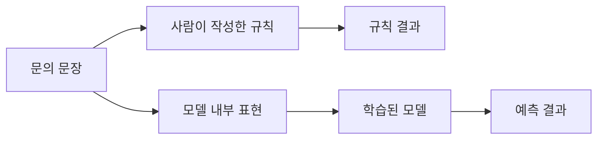
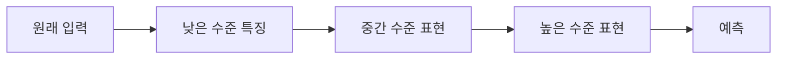
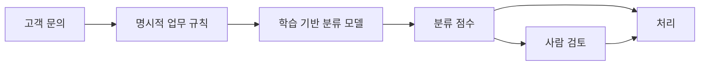

# 3.3 규칙 기반 접근(rule-based approach)과 표현 학습(representation learning)

3.1에서는 사람이 규칙을 직접 쓰는 방식의 장점과 한계를 봤고, 3.2에서는 데이터에서 패턴을 배우는 기본 구조를 봤습니다. 이번 절에서는 학습 과정 전체를 다시 설명하지 않고, 입력을 어떤 형태로 다루는가에 초점을 맞춥니다.

중심 질문은 단순합니다.

> 사람이 규칙을 직접 쓰는 접근과,
> 모델이 데이터에서 표현을 학습하는 접근은 무엇이 다른가?

이 절의 목적은 딥러닝의 내부를 자세히 설명하는 것이 아닙니다. 여기서는 `규칙(rule)`, `특징(feature)`, `표현(representation)`, `파라미터(parameter)`가 서로 어떻게 다른 위치에 있는지 잡는 데 집중합니다.

## 목표

- 규칙 기반 접근(rule-based approach)과 표현 학습(representation learning)의 차이를 구분합니다.
- 특징(feature)과 표현(representation)의 관계를 이해합니다.
- 사람이 설계한 특징과 모델이 학습한 표현의 차이를 봅니다.
- 학습된 표현이 강력하지만 해석이 어려울 수 있음을 이해합니다.
- 4장에서 다룰 입력, 출력, 데이터, 특징, 파라미터 개념으로 연결합니다.

## 먼저 같은 문제를 두 방식으로 보기

고객 문의 분류 예시를 계속 사용하겠습니다. 다음 문장이 들어왔다고 해 봅니다.

> 배송이 내일까지 안 오면 취소할게요.

규칙 기반으로 접근하면 사람이 직접 조건을 씁니다.

> 문장에 "배송"이 있고 "내일"이 있으면 배송 문의로 분류한다.
> 문장에 "취소"가 있으면 주문 취소 후보로 표시한다.
> 두 조건이 함께 있으면 사람 검토로 보낸다.

이 규칙은 사람이 읽을 수 있습니다. 어떤 조건 때문에 어떤 결과가 나왔는지도 비교적 쉽게 추적할 수 있습니다. 대신 사람이 조건과 예외를 계속 써야 합니다.

학습 기반 모델은 다른 방식으로 접근합니다. 3.2에서 본 것처럼 학습은 과거 문의와 분류 예시를 사용합니다. 이 절에서 새로 볼 부분은, 모델이 문장을 내부 값으로 바꾸고 그 내부 값을 이용해 어느 분류가 더 그럴듯한지 계산한다는 점입니다.

> 문장 -> 내부 표현 -> 모델 계산 -> 분류 점수

여기서 핵심은 `내부 표현`입니다. 모델은 문장을 그대로 읽는 것이 아니라, 계산 가능한 값의 묶음으로 바꿔 사용합니다.

## 이 절의 경계: 학습 전체가 아니라 표현을 본다

3.2는 학습 데이터, 라벨, 모델, 학습, 추론의 기본 구조를 설명했습니다. 3.3은 그 구조를 반복하지 않습니다. 이 절의 관심사는 입력이 모델 안에서 어떤 형태로 바뀌며, 그 형태가 사람이 작성한 규칙과 어떻게 다른지입니다.

| 구분 | 3.2의 중심 | 3.3의 중심 |
| --- | --- | --- |
| 질문 | 데이터에서 패턴을 배운다는 말은 무엇인가? | 입력을 표현으로 바꾼다는 말은 무엇인가? |
| 핵심 용어 | 예시, 라벨, 모델, 학습, 추론, 일반화 | 규칙, 특징, 표현, 파라미터 |
| 주요 위험 | 암기, 과적합, 데이터 품질 문제 | 해석 어려움, 표현의 불투명성 |
| 다음 연결 | 머신러닝의 학습 구조 | 문제를 모델로 바꾸는 과정 |

## 규칙은 밖에 있고, 표현은 안에 있다

명시적 규칙은 시스템 바깥에 가까운 곳에 있습니다. 사람이 읽고, 문서화하고, 수정할 수 있는 형태로 존재합니다.

> 조건을 만족하면 어떤 결과를 낸다.

반면 학습된 표현은 모델 내부에 있습니다. 입력이 모델을 지나가면서 만들어지는 중간 값이거나, 학습된 파라미터가 입력을 변환해 만든 값입니다. 이 값은 보통 사람이 바로 읽을 수 있는 문장이나 규칙이 아닙니다.

| 구분 | 명시적 규칙 | 학습된 표현 |
| --- | --- | --- |
| 위치 | 코드, 설정, 지식 기반, 정책 문서 | 모델 내부의 벡터, 활성값, 파라미터 |
| 작성 방식 | 사람이 조건과 결과를 직접 작성 | 데이터와 학습 절차를 통해 조정 |
| 장점 | 읽고 검토하기 쉽고 통제하기 좋음 | 복잡한 패턴과 문맥을 다루기 좋음 |
| 약점 | 예외가 많아지면 관리가 어려움 | 왜 그런 판단을 했는지 설명하기 어려울 수 있음 |
| 수정 방식 | 규칙 추가, 삭제, 우선순위 조정 | 데이터, 라벨, 특징, 모델, 학습 절차 조정 |

이 차이를 이해하면 “AI가 규칙을 스스로 만들었다”라는 표현을 더 조심해서 볼 수 있습니다. 모델이 내부 기준을 학습했다고 해서, 사람이 읽을 수 있는 규칙 목록이 자동으로 생긴 것은 아닙니다.

## 특징은 사람이 설계할 수도 있고, 모델이 배울 수도 있다

3.2에서는 특징(feature)을 모델이 입력으로 사용하는 값이라고 설명했습니다. 특징은 두 방식으로 만들어질 수 있습니다.

첫째, 사람이 직접 특징을 설계할 수 있습니다.

| 원래 입력 | 사람이 만든 특징 |
| --- | --- |
| 문의 문장 | `환불` 단어 포함 여부 |
| 문의 문장 | `배송` 단어 포함 여부 |
| 문의 문장 | 문장 길이 |
| 문의 문장 | 부정 표현 포함 여부 |
| 고객 정보 | 최근 주문 수 |

이런 특징은 규칙과 학습 사이에 있습니다. 사람이 계산할 값을 정하지만, 최종 판단은 모델이 학습할 수 있습니다.

둘째, 모델이 표현을 학습할 수 있습니다. 특히 딥러닝(deep learning)에서는 입력을 여러 층(layer)을 거치며 점점 다른 표현으로 바꿀 수 있습니다.

Stanford Encyclopedia of Philosophy의 AI 항목은 얼굴 이미지를 예로 들며, 낮은 층은 edge 같은 단서를 잡고, 다음 층은 눈이나 코 같은 얼굴 특징을 조합하고, 더 높은 층은 여러 특징의 묶음에 반응할 수 있다고 설명합니다. 이 설명은 딥러닝을 “사람이 모든 특징을 직접 쓰는 방식”과 구분하는 데 도움이 됩니다.

고객 문의 예시로 단순화하면 다음처럼 볼 수 있습니다.

| 단계 | 사람이 이해하기 쉬운 설명 |
| --- | --- |
| 원문 | “배송이 내일까지 안 오면 취소할게요.” |
| 낮은 수준 단서 | `배송`, `내일까지`, `안 오면`, `취소` |
| 중간 수준 표현 | 배송 지연, 기한 조건, 취소 가능성 |
| 높은 수준 표현 | 고객이 기한을 조건으로 문제 해결을 요구함 |
| 출력 | 배송 문의 또는 취소 관련 검토 |

실제 모델 내부 표현이 이 표처럼 사람이 읽기 쉬운 단계로 저장된다고 단정하면 안 됩니다. 이 표는 개념을 이해하기 위한 단순화입니다. 중요한 점은 입력이 모델 안에서 계산 가능한 표현으로 바뀌고, 그 표현이 예측에 사용된다는 것입니다.

## 표현이 달라지면 문제 난이도도 달라진다

Bengio, Courville, Vincent의 표현 학습(representation learning) 리뷰는 머신러닝 알고리즘의 성공이 데이터 표현에 크게 의존한다고 설명합니다. 같은 데이터라도 어떤 표현으로 바꾸느냐에 따라 중요한 요인이 잘 드러날 수도 있고, 반대로 숨어 버릴 수도 있습니다.

예를 들어 문의 분류에서 원문 문자열만 보면 다음 두 문장은 달라 보입니다.

> 상품이 깨져서 왔어요.
> 어제 받은 물건이 파손되어 다시 받고 싶습니다.

하지만 의미 단위로 보면 둘 다 `수령 완료`, `파손`, `교환 또는 재배송 가능성`과 연결될 수 있습니다. 좋은 표현은 이런 공통점을 모델이 사용하기 쉽게 만듭니다.

| 표현 방식 | 모델이 보기 쉬운 것 | 놓칠 수 있는 것 |
| --- | --- | --- |
| 원문 문자열 | 정확히 같은 단어 반복 | 같은 뜻의 다른 표현 |
| 사람이 만든 키워드 | 중요한 단어 포함 여부 | 문맥, 부정, 조건 |
| 학습된 표현 | 여러 단서의 조합과 유사성 | 사람이 직접 읽기 어려운 내부 기준 |

이 때문에 머신러닝에서는 “어떤 알고리즘을 쓸 것인가?”만큼 “입력을 어떤 표현으로 만들 것인가?”가 중요합니다.

## 학습용 비유: 의미 단위로 묶기

사람의 빠른 판단을 설명할 때 “컨텍스트 압축”이라는 표현을 떠올릴 수 있습니다. 다만 이 표현은 이 책에서 쓰는 학습용 비유이지, 표준 신경과학 용어로 쓰지는 않습니다. 여기서 말하는 압축은 사람이 이해한 개념과 기억된 정의를 바탕으로 복잡한 상황을 더 적은 의미 단위로 다룬다는 뜻에 가깝습니다.

인지심리학에서는 이와 가까운 설명으로 청킹(chunking)과 재부호화(recoding)를 이야기할 수 있습니다. Miller의 고전 논문은 사람이 입력을 익숙한 단위나 덩어리로 조직하고, 더 큰 덩어리로 묶으면서 기억할 수 있는 정보량을 늘릴 수 있다고 설명합니다. 이 근거는 사람의 정보 처리에 대한 비유를 뒷받침하기 위한 것이며, 머신러닝 모델이 사람처럼 이해한다는 근거로 쓰지는 않습니다.

예를 들어 `배송이 내일까지 안 오면 취소할게요.`라는 문장은 글자 하나씩 따로 보기보다 다음처럼 의미 단위로 묶어 볼 수 있습니다.

| 입력에서 보이는 표현 | 묶인 의미 단위 |
| --- | --- |
| 배송이 내일까지 안 오면 | 배송 지연과 기한 조건 |
| 취소할게요 | 취소 의도 또는 취소 가능성 |
| 전체 문장 | 고객이 기한을 조건으로 문제 해결을 요구함 |

이 비유가 중요한 이유는, 표현 학습을 “사람처럼 이해한다”로 설명하기 위해서가 아닙니다. 입력의 세부 조각을 어떤 단위로 다시 표현하느냐에 따라 판단 문제가 쉬워질 수도 있고 어려워질 수도 있다는 점을 보여 주기 위해서입니다.

## 학습된 표현은 규칙보다 흐릿하지만 넓게 대응할 수 있다

명시적 규칙은 선명합니다.

> "주소 변경"이라는 표현이 있으면 배송 정보 변경 후보로 보낸다.

하지만 실제 문장은 선명하지 않습니다.

> 받는 사람 번호를 잘못 썼어요.
> 아직 출고 전이면 다른 곳으로 받을 수 있나요?
> 전에 보낸 주소 말고 회사로 보내 주세요.

이 문장들은 `주소 변경`이라는 정확한 표현을 쓰지 않아도 배송 정보 변경과 관련될 수 있습니다. 학습된 표현은 이런 유사성을 다루는 데 유리할 수 있습니다. 모델은 단어 하나만 보는 대신, 여러 단서가 함께 나타나는 방식을 내부 값으로 반영할 수 있기 때문입니다.

다만 이 장점은 동시에 위험이 됩니다. 모델이 어떤 단서를 얼마나 중요하게 봤는지 사람이 바로 읽기 어렵고, 학습 데이터의 편향이나 우연한 반복을 따라갈 수도 있습니다. 그래서 학습된 표현을 쓰는 시스템에서는 평가, 실패 사례 분석, 데이터 검토가 중요합니다.

| 상황 | 규칙이 유리한 경우 | 학습된 표현이 유리한 경우 |
| --- | --- | --- |
| 법적 금지 조건 | 명확히 차단해야 할 때 | 보조 탐지만 가능 |
| 승인 절차 | 누가 어떤 조건에서 승인할지 정해야 할 때 | 예외 후보를 추천할 때 |
| 문장 분류 | 키워드가 명확할 때 | 표현이 다양하고 문맥이 중요할 때 |
| 이미지 인식 | 단순한 색상, 크기 조건 | 조명, 자세, 배경 변화가 큰 대상 |
| 운영 자동화 | 반드시 반복되어야 하는 절차 | 이상 징후 후보를 찾을 때 |

## 규칙과 표현은 경쟁만 하는 관계가 아니다

규칙 기반 접근과 학습 기반 접근을 “옛 방식과 새 방식”으로만 나누면 실제 시스템을 이해하기 어렵습니다. 많은 시스템은 둘을 함께 사용합니다.

예를 들어 고객 문의 자동 분류 시스템은 다음처럼 구성될 수 있습니다.

이 구조에서 규칙은 반드시 지켜야 할 정책을 담당하고, 모델은 사람이 직접 쓰기 어려운 표현의 다양성과 유사성을 다룹니다.

예를 들어 다음과 같이 나눌 수 있습니다.

| 역할 | 담당 방식 |
| --- | --- |
| 개인정보가 포함된 문의는 자동 응답하지 않는다 | 명시적 규칙 |
| 환불, 배송, 교환 문의 후보를 분류한다 | 학습된 표현을 쓰는 모델 |
| 점수가 낮거나 민감한 문의는 사람에게 보낸다 | 규칙과 모델 점수 결합 |
| 반복 실패 사례를 모아 데이터셋을 보강한다 | 운영 검토와 재학습 |

따라서 중요한 질문은 “규칙이냐 모델이냐”가 아닙니다. 더 좋은 질문은 다음과 같습니다.

> 어떤 부분은 사람이 명시적으로 통제해야 하는가?
> 어떤 부분은 데이터에서 표현을 학습하게 할 수 있는가?
> 어떤 판단은 사람 검토로 남겨야 하는가?

## 이 절에서 기억할 관점

명시적 규칙은 사람이 읽을 수 있는 판단 기준입니다. 설명과 통제에 강하지만, 예외와 표현의 다양성이 커질수록 관리가 어려워집니다.

학습된 표현은 모델 내부에서 입력을 계산 가능한 형태로 바꾼 결과입니다. 복잡한 패턴과 유사성을 다루는 데 강하지만, 사람이 곧바로 읽을 수 있는 규칙 목록은 아닙니다.

이 차이는 이후 장의 핵심으로 이어집니다. 4장에서는 현실 문제를 입력, 출력, 데이터, 특징으로 바꾸는 과정을 다루고, 뒤의 머신러닝과 딥러닝 파트에서는 모델이 어떤 기준으로 파라미터와 표현을 조정하는지 더 자세히 봅니다.

## 체크리스트

- 규칙 기반 접근과 표현 학습의 차이를 설명할 수 있다.
- 특징(feature)과 표현(representation)이 입력을 모델이 쓰기 쉬운 형태로 바꾸는 개념임을 설명할 수 있다.
- 사람이 만든 특징과 모델이 학습한 표현을 구분할 수 있다.
- 학습된 표현이 강력하지만 해석이 어려울 수 있음을 설명할 수 있다.
- 규칙과 모델을 경쟁 관계가 아니라 역할 분담 관계로 볼 수 있다.

## 출처와 참고 자료

- Stanford Encyclopedia of Philosophy, Selmer Bringsjord and Naveen Sundar Govindarajulu, [Artificial Intelligence](https://plato.stanford.edu/entries/artificial-intelligence/), 2018-07-12, 확인 날짜: 2026-06-22.
- Yoshua Bengio, Aaron Courville, Pascal Vincent, [Representation Learning: A Review and New Perspectives](https://arxiv.org/abs/1206.5538), arXiv, 2012-06-24, 확인 날짜: 2026-06-22.
- George A. Miller, [The Magical Number Seven, Plus or Minus Two: Some Limits on our Capacity for Processing Information](http://psychclassics.yorku.ca/Miller/), Psychological Review, 1956, 확인 날짜: 2026-06-22.
