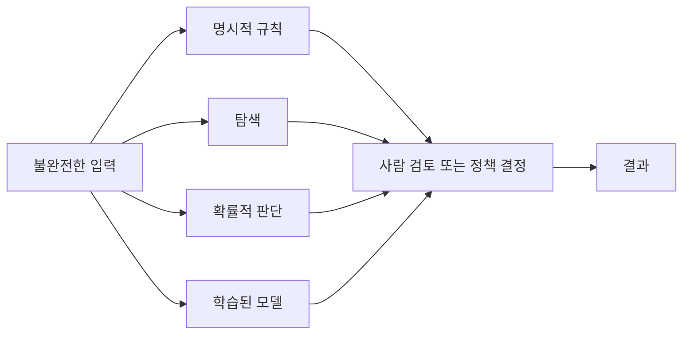

# 6.1 불완전한 정보와 예외가 많은 문제

5장에서는 학습(learning)과 모델 실행(inference)을 구분했습니다. 이제는 왜 AI가 규칙, 탐색, 확률, 학습을 함께 사용하게 되었는지 볼 차례입니다.

이 절의 질문은 단순합니다.

> 왜 어떤 문제는 명시적 규칙만으로 처리하기 어려울까?

규칙은 중요합니다. 권한, 정책, 금지 조건, 업무 절차, 배포 조건은 명시적 규칙으로 관리해야 합니다. 하지만 현실 문제는 모든 조건과 예외를 미리 적어 두기 어렵습니다.

이 절은 먼저 예시를 봅니다. 정답을 바로 외우기보다, 어떤 지점에서 규칙이 흔들리는지 생각해 보는 것이 목적입니다.

## 이 절의 범위

6.1은 Chapter 6의 도입입니다. 확률 계산, 조건부 확률, 확률 변수, stochastic의 정의는 6.2에서 다룹니다. 탐색 알고리즘과 휴리스틱은 Chapter 7에서 다룹니다.

여기서는 다음 관점만 잡습니다.

> 규칙은 필요하지만,
> 현실 문제는 규칙만으로 처리하기 어려운 조건을 자주 가진다.

## 목표

- 규칙 기반 접근이 잘 작동하는 조건을 이해합니다.
- 규칙만으로 처리하기 어려운 문제 조건을 구분합니다.
- 불완전한 정보(incomplete information), 부분 관측(partial observability), 잡음(noise), 예외(exception), 계산 한계(computational limit)를 입문 수준에서 연결합니다.
- 불확실성(uncertainty), 확률(probability), 휴리스틱(heuristic), 학습(learning)이 왜 이어서 등장하는지 준비합니다.

## 먼저 생각해 볼 예시

다음 입력을 규칙으로 처리한다고 가정해 봅니다.

> “어제 주문했는데 아직 조회가 안 됩니다.”

처리 규칙을 하나 만들면 다음처럼 쓸 수 있습니다.

> 배송 조회가 안 된다는 문의가 오면 배송팀으로 보낸다.

이 규칙은 나쁘지 않습니다. 실제로 많은 문의를 빠르게 분류할 수 있습니다. 하지만 다음 상황이 섞이면 판단은 곧 어려워집니다.

| 추가로 드러난 상황 | 처음 규칙만으로 충분한가 |
| --- | --- |
| 주문한 지 10분밖에 지나지 않았다 | 시스템 반영 지연일 수 있음 |
| 결제는 되었지만 주문 번호가 없다 | 결제 또는 주문 생성 문제일 수 있음 |
| 주문 상품이 예약 배송 상품이다 | 배송 문제가 아닐 수 있음 |
| 고객이 다른 계정으로 주문했다 | 사용자 확인 문제가 될 수 있음 |
| 택배사 송장은 있지만 추적이 안 된다 | 외부 연동 문제일 수 있음 |

이 예시는 한 가지를 보여 줍니다. 처음 규칙이 틀렸다고 말하기는 어렵습니다. 다만 그 규칙만으로는 충분하지 않은 상황이 생깁니다.

이번에는 얼굴 인식 예시를 생각해 봅니다.

> 눈, 코, 입의 위치가 특정 비율이면 얼굴로 판단한다.

이런 규칙은 직관적으로 이해하기 쉽습니다. 하지만 실제 사진에는 조명, 각도, 가림, 표정, 해상도, 배경이 섞입니다.

| 사진 조건 | 규칙이 어려워지는 이유 |
| --- | --- |
| 얼굴이 옆으로 돌아가 있음 | 눈, 코, 입의 위치 규칙이 깨짐 |
| 마스크나 손으로 얼굴 일부가 가려짐 | 필요한 특징이 보이지 않음 |
| 조명이 어둡거나 강함 | 관측된 픽셀이 실제 형태를 잘 반영하지 못함 |
| 그림, 사진, 화면 속 얼굴이 함께 있음 | 무엇을 실제 얼굴로 볼지 애매함 |

자율주행도 비슷합니다.

> 앞에 장애물이 있으면 멈춘다.

이 규칙은 안전을 위해 필요합니다. 그러나 현실 도로에서는 멈춰야 하는 장애물, 지나갈 수 있는 그림자, 비닐봉지, 차선 변경 중인 차량, 갑자기 튀어나오는 사람이 섞입니다. “앞에 있다”는 말도 센서 종류, 거리, 속도, 도로 상황에 따라 달라집니다.

이런 예시는 AI가 왜 단순 규칙만으로 닫히기 어려운지 보여 줍니다.

> 규칙은 필요하다.
> 하지만 현실 입력은 불완전하고, 흔들리고, 예외가 많다.

## 규칙이 잘 작동하는 조건

규칙은 조건과 행동이 분명할 때 강합니다.

| 상황 | 규칙 예시 | 왜 다루기 쉬운가 |
| --- | --- | --- |
| 권한 확인 | 관리자만 배포할 수 있다 | 조건과 행동이 명확함 |
| 입력 검증 | 이메일 형식이 아니면 가입을 막는다 | 검사 기준이 분명함 |
| 업무 라우팅 | 배송 문의는 배송팀으로 보낸다 | 라벨과 처리 부서가 정해져 있음 |
| 안전 정책 | 금지된 요청이면 거절한다 | 정책 조건을 명시할 수 있음 |

이런 규칙은 AI 시스템에서도 계속 필요합니다. 설명할 수 있고, 검토할 수 있으며, 의도한 통제를 명시적으로 유지할 수 있기 때문입니다.

## 규칙만으로 어려워지는 조건

위 예시를 다시 정리하면, 현실 문제에서는 다음 조건이 자주 나타납니다.

| 조건 | 의미 | 예시 |
| --- | --- | --- |
| 정보 부족 | 판단에 필요한 정보가 다 주어지지 않음 | “조회가 안 됩니다.”만으로 배송 지연 원인을 확정하기 어려움 |
| 부분 관측 | 전체 상태 중 일부만 볼 수 있음 | 로봇이 모든 물건 위치를 처음부터 알지 못함 |
| 잡음 | 관측이 틀리거나 흔들림 | 센서 오차, 이미지 흔들림, 오타 |
| 예외 증가 | 규칙의 예외가 계속 생김 | 배송, 취소, 환불이 한 문의에 섞임 |
| 후보 폭증 | 가능한 선택지를 모두 검토하기 어려움 | 경로 찾기, 일정 계획, 게임 탐색 |

규칙을 만들 수는 있습니다. 문제는 규칙을 하나 추가할 때마다 새로운 예외가 생기고, 예외를 처리하기 위해 또 다른 규칙이 필요해질 수 있다는 점입니다.

이때 질문은 “규칙을 버릴 것인가”가 아닙니다. 더 중요한 질문은 다음입니다.

> 어디까지 규칙으로 명시할 수 있고,
> 어디부터는 탐색, 확률, 학습, 사람 검토가 필요한가?

## 여러 접근이 함께 필요해진다

AIMA의 목차는 탐색(search), 휴리스틱 탐색(heuristic search), 부분 관측 환경(partially observable environments), 불확실한 지식과 추론(uncertain knowledge and reasoning)을 AI 개론의 주요 축으로 배치합니다. Poole과 Mackworth도 에이전트가 목표를 달성하는 방법을 찾는 문제를 탐색으로 설명하고, 불확실한 상황에서는 관측한 정보(evidence)를 바탕으로 믿음을 갱신하는 관점을 설명합니다.

이 흐름은 다음처럼 이해할 수 있습니다.

| 문제 조건 | 필요한 접근 |
| --- | --- |
| 명확히 금지하거나 허용해야 함 | 규칙 |
| 후보가 너무 많음 | 탐색, 휴리스틱 |
| 정보가 불완전함 | 확률, 불확실성 처리 |
| 입력 표현이 다양함 | 데이터 기반 학습 |
| 책임 있는 판단이 필요함 | 사람 검토, 정책 결정 |

이 그림은 실제 서비스 아키텍처가 아닙니다. 6.1에서는 AI가 왜 여러 접근을 조합하게 되는지 이해하는 데만 사용합니다.

## 이 절에서 기억할 관점

규칙은 AI에서 사라진 것이 아닙니다. 규칙은 여전히 정책, 안전, 권한, 절차, 검증에 강합니다. 다만 현실 문제는 정보가 불완전하고, 관측이 흔들리고, 예외가 늘어나고, 후보가 많아지는 경우가 많습니다.

그래서 AI는 다음 질문을 함께 다룹니다.

> 무엇을 규칙으로 명시할 것인가?
> 무엇을 탐색으로 찾을 것인가?
> 무엇을 확률로 다룰 것인가?
> 무엇을 데이터에서 학습할 것인가?
> 무엇을 사람 검토로 남길 것인가?

6.2에서는 이 흐름을 이어 받아 `확률`, `불확실성`, `stochastic` 같은 표현을 구분합니다.

## 체크리스트

- 규칙 기반 접근이 잘 작동하는 조건을 설명할 수 있다.
- 규칙만으로 처리하기 어려운 조건을 정보 부족, 부분 관측, 잡음, 예외, 후보 폭증으로 나누어 설명할 수 있다.
- 규칙이 사라진 것이 아니라 다른 접근과 조합된다는 점을 설명할 수 있다.
- 불확실성, 확률, 탐색, 휴리스틱, 학습이 왜 이어서 등장하는지 설명할 수 있다.

## 출처와 참고 자료

- Stuart Russell, Peter Norvig, [Artificial Intelligence: A Modern Approach, 4th US ed., Full Table of Contents](https://aima.cs.berkeley.edu/contents.html), 확인 날짜: 2026-06-22.
- David L. Poole, Alan K. Mackworth, [Artificial Intelligence: Foundations of Computational Agents, 3rd ed.](https://artint.info/3e/html/ArtInt3e.html), 확인 날짜: 2026-06-22.
- Stanford Encyclopedia of Philosophy, Selmer Bringsjord and Naveen Sundar Govindarajulu, [Artificial Intelligence](https://plato.stanford.edu/entries/artificial-intelligence/), 2018-07-12, 확인 날짜: 2026-06-22.
