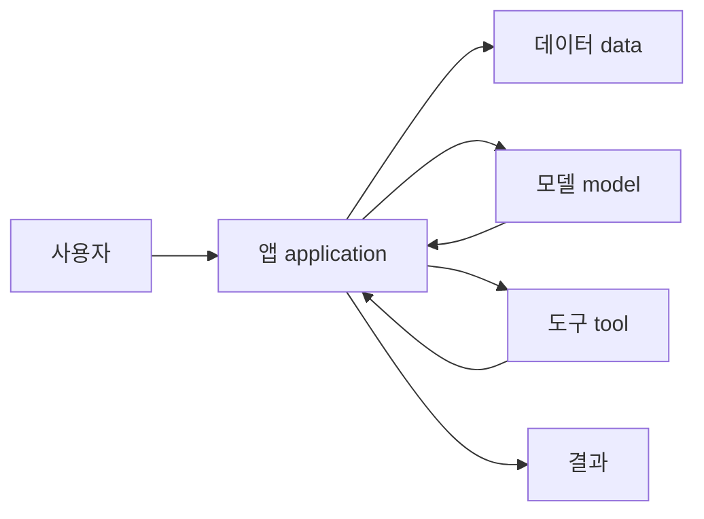

# 14.1 모델(model), 앱(application), 데이터(data), 도구(tool)

13장에서는 임베딩(embedding), 유사도 검색(similarity search), RAG(retrieval-augmented generation), 벡터 검색 구현의 직관을 봤습니다. 이 흐름은 중요한 전환을 만듭니다.

> LLM 하나만 보는 관점
> -> LLM을 둘러싼 서비스 구조를 보는 관점

AI 서비스는 모델(model) 하나로만 만들어지지 않습니다. 사용자가 만나는 앱(application), 모델이 참고할 데이터(data), 외부 시스템과 연결되는 도구(tool), 그리고 이 흐름을 조정하는 코드가 함께 있어야 합니다.

> AI 서비스는 모델이 판단과 생성을 담당하고, 앱이 사용자 경험과 흐름을 만들고, 데이터가 근거와 상태를 제공하고, 도구가 외부 행동을 실행하게 연결한 시스템이다.

이 절의 목적은 세부 구현이 아니라 큰 지도를 잡는 것입니다.

## 이 절의 범위

이 절은 AI 서비스의 주요 구성요소를 구분합니다. RAG와 도구 사용(tool use)의 구체적 위치는 14.2에서 다룹니다. 에이전트(agent), MCP(Model Context Protocol), 하네스(harness), 비용과 운영 제약은 14.3 이후에서 다룹니다.

| 주제 | 이 절에서 볼 질문 |
| --- | --- |
| 모델(model) | 무엇을 생성하고 판단하는가? |
| 앱(application) | 사용자는 어디에서 요청하고 결과를 받는가? |
| 데이터(data) | 모델이 참고할 근거와 상태는 어디에 있는가? |
| 도구(tool) | 모델 밖의 시스템을 어떻게 실행하는가? |
| 흐름(orchestration) | 이 요소들을 누가 어떤 순서로 연결하는가? |

## 이 절의 목표

- AI 서비스를 모델 하나가 아니라 여러 구성요소의 조합으로 이해합니다.
- 모델(model), 앱(application), 데이터(data), 도구(tool)의 역할을 구분합니다.
- 프롬프트(prompt), RAG, 도구 호출이 서비스 흐름 안에서 어디에 놓이는지 큰 그림을 잡습니다.
- 모델이 직접 모든 일을 하는 것이 아니라, 앱과 실행 코드가 모델의 입출력을 감싼다는 점을 이해합니다.
- 14.2의 RAG와 도구 사용(tool use) 설명으로 넘어갈 준비를 합니다.

## 모델은 답변을 만드는 핵심 부품이다

모델(model)은 AI 서비스의 핵심 부품입니다. 사용자의 입력을 받아 텍스트, 코드, 이미지 설명, 구조화된 데이터 같은 출력을 만들 수 있습니다.

입문 단계에서는 모델을 다음처럼 볼 수 있습니다.

> 입력(input)
> -> 모델(model)
> -> 출력(output)

하지만 실제 서비스에서는 이 흐름이 훨씬 더 많이 감싸집니다.

> 사용자 요청
> -> 앱에서 입력 정리
> -> 필요한 데이터 검색
> -> 모델 호출
> -> 결과 검토 또는 후처리
> -> 사용자에게 표시

모델은 중요한 판단과 생성을 담당하지만, 사용자 계정 관리, 권한 확인, 데이터 저장, 외부 API 호출, 화면 표시를 혼자 처리하지 않습니다. 그런 일은 앱과 서비스 코드가 담당합니다.

그래서 “AI 서비스 = 모델”이라고 보면 흐름을 놓치기 쉽습니다.

| 오해 | 더 안전한 설명 |
| --- | --- |
| 모델이 서비스를 전부 처리한다 | 모델은 서비스 안의 핵심 계산 부품이다 |
| 모델이 데이터를 모두 알고 있다 | 모델은 입력으로 받은 맥락과 학습된 표현을 바탕으로 답한다 |
| 모델이 직접 행동한다 | 실제 행동은 앱, 서버, 도구 호출 코드가 실행한다 |

## 앱은 사용자의 요청과 결과를 다룬다

앱(application)은 사용자가 실제로 만나는 표면입니다. 웹 페이지, 모바일 앱, 채팅 UI, IDE 확장, 업무용 대시보드가 모두 앱이 될 수 있습니다.

앱은 모델에 질문을 그대로 던지는 통로만은 아닙니다. 보통 다음 일을 함께 합니다.

| 앱의 역할 | 설명 |
| --- | --- |
| 입력 수집 | 사용자의 질문, 파일, 선택값, 설정을 받음 |
| 맥락 구성 | 사용자 상태, 화면 정보, 이전 대화, 선택된 문서를 정리함 |
| 출력 표시 | 모델 결과를 읽기 쉬운 형태로 보여 줌 |
| 오류 처리 | 실패, 지연, 권한 문제를 사용자에게 알려 줌 |
| 검토 흐름 | 사용자가 결과를 수정, 승인, 재시도하게 함 |

예를 들어 문서 작성 도우미 앱을 생각해 봅니다.

> 사용자:
> 이 문단을 더 쉽게 설명해 줘.
>
> 앱:
> 현재 문단, 문서 제목, 선택 범위, 원하는 톤을 묶어 모델에 전달한다.
>
> 모델:
> 수정 후보를 생성한다.
>
> 앱:
> 원문과 수정안을 비교해 보여 주고 사용자가 적용할지 선택하게 한다.

이때 사용자는 모델을 직접 만나는 것처럼 느낄 수 있지만, 실제 경험은 앱이 설계한 흐름 안에서 만들어집니다.

## 데이터는 근거와 상태를 제공한다

데이터(data)는 AI 서비스에서 두 가지 역할을 합니다.

첫째, 답변의 근거가 됩니다. RAG에서 검색하는 문서, 사내 지식베이스, 제품 설명서, 이 책의 Section 문서가 여기에 해당합니다.

둘째, 서비스의 상태가 됩니다. 사용자 설정, 권한, 작업 이력, 주문 상태, 프로젝트 메타데이터처럼 현재 요청을 처리하는 데 필요한 정보입니다.

| 데이터 종류 | 예 |
| --- | --- |
| 근거 자료(evidence data) | 문서, 매뉴얼, 논문, FAQ, 책 본문 |
| 상태 데이터(state data) | 사용자 설정, 권한, 세션, 작업 진행 상태 |
| 입력 데이터(input data) | 사용자가 올린 파일, 질문, 선택한 문단 |
| 로그 데이터(log data) | 요청 기록, 오류, 평가 결과, 피드백 |

AI 서비스에서 데이터는 단순히 “많을수록 좋은 것”이 아닙니다. 어떤 데이터를 모델에 보여 줄지, 어떤 데이터는 숨겨야 하는지, 어떤 데이터는 최신으로 유지해야 하는지가 중요합니다.

> 좋은 데이터 연결:
> 필요한 정보만, 권한에 맞게, 최신 상태로, 출처와 함께 전달한다.
>
> 나쁜 데이터 연결:
> 관련 없는 정보, 오래된 정보, 권한 없는 정보, 출처 없는 정보를 섞어 전달한다.

이 관점은 13장의 RAG와 연결됩니다. RAG는 데이터 전체를 모델에 넣는 방식이 아니라, 질문과 관련된 후보를 찾아 입력 맥락(context)에 넣는 방식입니다.

## 도구는 모델 밖의 행동을 실행한다

도구(tool)는 모델 밖의 시스템과 연결되는 실행 수단입니다. OpenAI의 function calling 문서도 큰 언어 모델이 외부 데이터와 시스템에 연결될 수 있음을 설명합니다.

입문 단계에서는 도구를 이렇게 생각할 수 있습니다.

> 모델:
> 무엇을 해야 할지 제안하거나 호출할 도구와 인자를 만든다.
>
> 도구 실행 코드:
> 실제 API 호출, 검색, 파일 처리, 데이터베이스 조회를 수행한다.

예를 들어 사용자가 이렇게 요청한다고 합시다.

> 지난주 회의록에서 결정 사항만 찾아서 일정표에 추가해 줘.

이 요청은 모델 답변만으로 끝나지 않을 수 있습니다.

| 필요한 일 | 담당 요소 |
| --- | --- |
| 회의록 찾기 | 검색 도구 또는 파일 검색 |
| 결정 사항 추출 | 모델 |
| 일정 형식으로 변환 | 모델 또는 앱 코드 |
| 캘린더에 추가 | 캘린더 API 도구 |
| 결과 확인 | 앱 |

도구 사용은 강력하지만 위험도 있습니다. 잘못된 도구를 호출하거나, 권한 없는 데이터에 접근하거나, 사용자가 승인하지 않은 행동을 실행하면 문제가 됩니다. 그래서 도구 호출은 14.2에서 더 구체적으로 다룹니다.

## 흐름은 앱과 실행 코드가 조정한다

모델, 앱, 데이터, 도구가 있어도 자동으로 좋은 서비스가 되지는 않습니다. 이 요소들을 어떤 순서로 연결할지 정해야 합니다.

이를 흐름 조정(orchestration)이라고 부를 수 있습니다.

> 사용자 요청 수신
> -> 권한 확인
> -> 필요한 데이터 검색
> -> 프롬프트 구성
> -> 모델 호출
> -> 도구 호출 필요 여부 판단
> -> 결과 후처리
> -> 사용자에게 표시
> -> 로그와 피드백 저장

이 흐름은 서비스 목적에 따라 달라집니다.

| 서비스 | 중요한 흐름 |
| --- | --- |
| 문서 검색 챗봇 | 검색, 출처 표시, 답변 검토 |
| 코드 작성 도우미 | 파일 읽기, 패치 생성, 테스트 실행 |
| 고객 지원 봇 | 고객 상태 조회, 정책 확인, 상담 이관 |
| 업무 자동화 앱 | 승인, 외부 API 호출, 실행 로그 |

여기서 중요한 점은 모델이 흐름 전체를 자동으로 책임지는 것이 아니라는 점입니다. 모델은 흐름 안에서 판단과 생성을 담당합니다. 앱과 서버 코드는 모델을 언제 호출할지, 어떤 데이터를 줄지, 어떤 도구를 허용할지, 결과를 어떻게 검토할지 정합니다.

## 네 구성요소를 한 번에 보기

AI 서비스를 단순화하면 다음 구조로 볼 수 있습니다.

이 그림은 실제 시스템을 완전히 표현하지는 않습니다. 하지만 입문 단계에서는 충분히 유용합니다.

| 구성요소 | 중심 질문 |
| --- | --- |
| 앱(application) | 사용자는 어디에서 요청하고 결과를 확인하는가? |
| 데이터(data) | 어떤 근거와 상태를 사용할 것인가? |
| 모델(model) | 무엇을 생성, 분류, 판단할 것인가? |
| 도구(tool) | 모델 밖의 어떤 행동을 실행할 것인가? |
| 흐름(orchestration) | 어떤 순서와 조건으로 연결할 것인가? |

13장까지는 주로 데이터와 모델 사이의 검색 흐름을 봤습니다. 14장부터는 여기에 앱, 도구, 실행 환경이 붙으면서 실제 서비스 구조로 확장됩니다.

## 이 절에서 기억할 관점

AI 서비스는 모델 하나가 아닙니다. 모델은 중요한 부품이지만, 앱, 데이터, 도구, 실행 흐름이 함께 있어야 사용 가능한 서비스가 됩니다.

> 모델은 생성과 판단을 담당한다.
> 앱은 사용자 경험과 흐름을 담당한다.
> 데이터는 근거와 상태를 제공한다.
> 도구는 외부 시스템의 행동을 실행한다.
> 실행 흐름은 이 요소들을 순서와 조건에 맞게 연결한다.

이 관점을 잡으면 다음 절에서 RAG와 도구 사용을 서비스 구조 안에서 더 정확히 볼 수 있습니다.

## 체크리스트

- AI 서비스를 모델(model) 하나가 아니라 앱, 데이터, 도구, 흐름의 조합으로 설명할 수 있다.
- 앱(application)이 사용자 입력, 맥락 구성, 출력 표시, 오류 처리를 담당할 수 있음을 설명할 수 있다.
- 데이터(data)를 근거 자료, 상태 데이터, 입력 데이터, 로그 데이터로 구분할 수 있다.
- 도구(tool)를 모델 밖의 시스템을 실행하는 연결 수단으로 설명할 수 있다.
- 모델이 직접 모든 행동을 실행하는 것이 아니라 앱과 서버 코드가 실행 흐름을 감싼다는 점을 설명할 수 있다.
- RAG가 데이터와 모델을 연결하는 한 방식이고, 도구 사용은 외부 행동을 연결하는 방식임을 구분할 수 있다.

## 출처와 참고 자료

- OpenAI, [Text generation](https://developers.openai.com/api/docs/guides/text), OpenAI API Docs, 확인 날짜: 2026-06-23.
- OpenAI, [Function calling](https://developers.openai.com/api/docs/guides/function-calling), OpenAI API Docs, 확인 날짜: 2026-06-23.
- NIST, [Artificial Intelligence Risk Management Framework (AI RMF 1.0)](https://nvlpubs.nist.gov/nistpubs/ai/NIST.AI.100-1.pdf), 2023, 확인 날짜: 2026-06-23.
