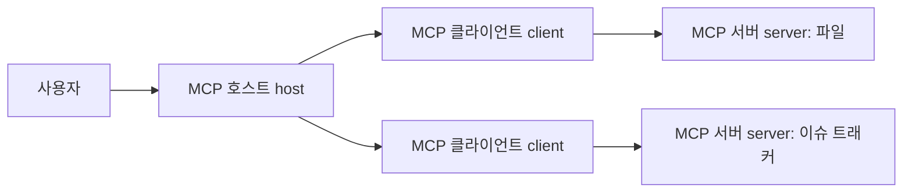

# 14.4 MCP(Model Context Protocol)와 도구 연결 표준화

14.3에서는 에이전트(agent)를 목표(goal), 상태(state), 행동(action), 관찰(observation)을 이어 가는 작업 흐름(workflow)으로 봤습니다. 이때 에이전트가 외부 자료나 도구를 쓰려면 연결 방식이 필요합니다.

> 에이전트:
> 무엇을 해야 하는지 결정하고 작업 흐름을 이어 간다.
>
> MCP:
> 에이전트나 AI 앱이 외부 도구와 데이터에 연결되는 방식을 표준화한다.

MCP(Model Context Protocol)는 AI 애플리케이션(application)이 외부 시스템(external system)에 연결되는 방식을 표준화하려는 공개 프로토콜(open protocol)입니다. 여기서 중요한 점은 MCP가 모델(model) 자체도 아니고, 에이전트(agent) 자체도 아니라는 것입니다.

> MCP는 AI 앱과 외부 데이터, 도구, 작업 템플릿 사이의 연결 방식을 맞추기 위한 프로토콜이다.

이 절에서는 MCP를 깊게 구현하지 않고, 왜 이런 표준화가 필요한지와 어떤 구성요소로 생각하면 되는지 봅니다.

## 이 절의 범위

이 절은 MCP(Model Context Protocol)의 기본 역할과 구조를 설명합니다. MCP 서버 구현, SDK 사용법, JSON-RPC 메시지 상세, OAuth 인증 흐름은 다루지 않습니다. 하네스(harness), 평가(evaluation), 실행 로그(log)는 14.5에서 다룹니다. 보안(security)과 개인정보(privacy)의 세부 쟁점은 15장에서 다시 다룹니다.

| 주제 | 이 절에서 볼 질문 |
| --- | --- |
| 표준화 | 왜 도구 연결에 공통 규칙이 필요한가? |
| 구성요소 | 호스트(host), 클라이언트(client), 서버(server)는 무엇을 맡는가? |
| 제공 대상 | 도구(tools), 리소스(resources), 프롬프트(prompts)는 어떻게 다른가? |
| 연결 흐름 | 에이전트는 MCP를 통해 무엇을 발견하고 호출하는가? |
| 주의점 | MCP가 해결하지 않는 문제는 무엇인가? |

## 이 절의 목표

- MCP(Model Context Protocol)를 에이전트가 아니라 연결 프로토콜(protocol)로 이해합니다.
- 호스트(host), 클라이언트(client), 서버(server)의 역할을 구분합니다.
- 도구(tools), 리소스(resources), 프롬프트(prompts)를 같은 것으로 섞지 않습니다.
- MCP가 도구 사용(tool use)을 편하게 만들 수 있지만, 권한(permission), 승인(approval), 검증(validation)을 자동으로 해결하지는 않음을 이해합니다.
- 14.5의 하네스(harness)와 평가 실행 환경으로 넘어갈 준비를 합니다.

## 왜 연결 표준이 필요한가

14.1에서 AI 서비스는 모델(model), 앱(application), 데이터(data), 도구(tool), 흐름(orchestration)의 조합이라고 했습니다. 문제는 서비스가 커질수록 연결해야 할 외부 시스템도 늘어난다는 점입니다.

> 파일 시스템
> 데이터베이스
> 검색 엔진
> 일정 관리 도구
> 이슈 트래커
> 디자인 도구
> 배포 시스템
> 사내 문서 저장소

각 AI 앱이 각 도구마다 별도 연결 방식을 직접 만들면 조합이 빠르게 복잡해집니다.

> 앱 A -> 도구 1, 도구 2, 도구 3
> 앱 B -> 도구 1, 도구 2, 도구 3
> 앱 C -> 도구 1, 도구 2, 도구 3

이런 상황에서는 같은 도구를 여러 앱에 붙일 때마다 비슷한 코드를 반복하게 됩니다. MCP는 이 문제를 줄이기 위해 `AI 앱이 외부 시스템과 대화하는 공통 규칙`을 제공하려는 흐름으로 볼 수 있습니다.

입문 단계에서는 MCP를 이렇게 이해하면 충분합니다.

> 도구마다 제각각 연결하는 방식
> -> 공통 프로토콜을 통해 발견하고 호출하는 방식

공식 MCP 소개 문서는 MCP를 AI 애플리케이션이 데이터 소스, 도구, 워크플로우에 연결되도록 하는 공개 표준으로 설명합니다.

## 호스트, 클라이언트, 서버

MCP는 클라이언트-서버(client-server) 구조를 따릅니다. 다만 일반적인 웹 서비스의 클라이언트와 서버만 떠올리면 헷갈릴 수 있습니다. MCP 문맥에서는 호스트(host), 클라이언트(client), 서버(server)를 구분합니다.

| 구성요소 | 설명 |
| --- | --- |
| MCP 호스트(MCP host) | 사용자가 만나는 AI 앱 또는 에이전트 실행 환경 |
| MCP 클라이언트(MCP client) | 특정 MCP 서버와 연결을 유지하는 구성요소 |
| MCP 서버(MCP server) | 외부 데이터, 도구, 프롬프트를 MCP 방식으로 제공하는 프로그램 |

흐름은 단순화하면 다음과 같습니다.

하나의 AI 앱은 여러 MCP 서버에 연결될 수 있습니다. 이때 보통 서버마다 별도의 MCP 클라이언트가 연결을 관리합니다. 예를 들어 코딩 도구가 파일 시스템 MCP 서버와 이슈 트래커 MCP 서버에 동시에 연결될 수 있습니다.

중요한 점은 MCP 서버가 반드시 원격 서버(remote server)일 필요는 없다는 것입니다. 로컬 컴퓨터에서 실행되는 프로그램일 수도 있고, 네트워크를 통해 접근하는 원격 서비스일 수도 있습니다.

## MCP 서버는 무엇을 제공하는가

MCP 서버가 제공하는 대표 요소는 도구(tools), 리소스(resources), 프롬프트(prompts)입니다.

| 요소 | 역할 | 예 |
| --- | --- | --- |
| 도구(tools) | 실행 가능한 함수 또는 행동 | 파일 읽기, 이슈 생성, 데이터베이스 조회, 계산 |
| 리소스(resources) | 읽을 수 있는 맥락 데이터 | 파일 내용, 데이터베이스 레코드, API 응답, 문서 조각 |
| 프롬프트(prompts) | 재사용 가능한 상호작용 템플릿 | 특정 업무용 지시문, 예시가 포함된 작업 양식 |

이 구분은 14.2에서 본 RAG와 도구 사용의 차이와 연결됩니다.

> 리소스(resources):
> 모델이 참고할 맥락 데이터를 제공한다.
>
> 도구(tools):
> 외부 시스템의 기능을 실행한다.
>
> 프롬프트(prompts):
> 상호작용 방식을 일정한 형태로 재사용하게 돕는다.

예를 들어 사내 문서 시스템을 MCP 서버로 제공한다면, 다음처럼 나눌 수 있습니다.

| 제공 항목 | MCP 관점 |
| --- | --- |
| 문서 본문 읽기 | 리소스(resource) |
| 문서 검색 실행 | 도구(tool) |
| 규정 검토용 질문 템플릿 | 프롬프트(prompt) |

이렇게 나누면 에이전트는 “무엇을 읽을 수 있는지”, “무엇을 실행할 수 있는지”, “어떤 상호작용 형식이 준비되어 있는지”를 더 명확히 알 수 있습니다.

## 발견하고 호출하는 흐름

MCP의 핵심 직관 중 하나는 `발견(discovery)`입니다. AI 앱은 연결된 MCP 서버에 어떤 도구와 리소스가 있는지 물어볼 수 있습니다.

> 1. AI 앱이 MCP 서버에 연결한다.
> 2. 서버가 제공하는 기능과 능력을 확인한다.
> 3. 사용 가능한 도구 목록을 가져온다.
> 4. 필요한 도구를 선택해 호출한다.
> 5. 실행 결과를 받아 모델 입력이나 앱 상태에 반영한다.

공식 아키텍처 문서는 도구 목록을 가져오는 `tools/list`와 도구를 실행하는 `tools/call` 같은 흐름을 예로 듭니다. 입문 단계에서는 메서드 이름을 외울 필요는 없습니다. 중요한 것은 실행 전에 “어떤 도구가 있는지”를 확인하고, 호출할 때 “어떤 이름과 인자를 보낼지”를 구조화한다는 점입니다.

예를 들어 날씨 MCP 서버가 있다고 합시다.

> 도구 발견:
> weather_current 도구가 있음
>
> 도구 설명:
> 현재 날씨를 조회함
>
> 입력 형식:
> location, units
>
> 호출:
> location = Seoul
> units = metric
>
> 결과:
> 현재 날씨 데이터

이 구조가 있으면 모델은 자연어로만 “날씨 좀 봐 줘”라고 답하는 것이 아니라, 앱이 이해할 수 있는 도구 호출 후보를 만들 수 있습니다. 실제 실행은 여전히 앱과 서버의 권한 정책 안에서 이루어져야 합니다.

## MCP는 에이전트의 연결면을 정리한다

14.3의 에이전트 루프를 다시 가져오면 MCP의 위치가 더 분명해집니다.

> 목표 확인
> -> 상태 확인
> -> 다음 행동 선택
> -> 도구 실행
> -> 관찰
> -> 상태 갱신

MCP는 이 중 특히 `도구 실행`과 `외부 맥락 확보`의 연결면을 정리합니다.

| 에이전트 흐름 | MCP가 도울 수 있는 부분 |
| --- | --- |
| 상태 확인 | 리소스(resources)를 통해 파일, 문서, 데이터 내용을 읽음 |
| 다음 행동 선택 | 사용 가능한 도구(tools) 목록과 설명을 참고함 |
| 도구 실행 | 표준화된 방식으로 도구를 호출함 |
| 관찰 | 도구 실행 결과를 받아 다음 판단에 반영함 |

하지만 MCP가 에이전트의 계획 능력이나 판단 품질을 보장하는 것은 아닙니다. MCP는 연결 규칙입니다. 에이전트가 어떤 목표를 세우고, 어떤 순서로 실행하고, 언제 멈출지는 여전히 앱, 모델, 하네스, 정책의 문제입니다.

## MCP가 해결하지 않는 것

MCP는 도구 연결을 표준화하는 데 도움이 되지만, 모든 문제를 자동으로 해결하지는 않습니다.

| 해결하지 않는 문제 | 이유 |
| --- | --- |
| 도구가 안전한지 판단 | 서버가 제공하는 도구 자체가 위험할 수 있음 |
| 사용자 권한 결정 | 어떤 사용자가 어떤 데이터를 볼 수 있는지는 서비스 정책 문제 |
| 실행 승인 | 외부 상태를 바꾸는 행동은 사람 확인이 필요할 수 있음 |
| 결과의 사실성 | 도구 결과를 어떻게 해석할지는 별도 검토가 필요함 |
| 에이전트 평가 | 작업이 성공했는지 측정하는 기준은 하네스와 평가 문제 |

MCP 보안 문서도 혼동된 대리인 문제(confused deputy problem), 토큰 전달(token passthrough), SSRF(Server-Side Request Forgery), 세션 하이재킹(session hijacking), 로컬 MCP 서버 손상(local MCP server compromise) 같은 위험을 별도로 다룹니다. 이 절에서 보안을 깊게 설명하지는 않지만, MCP 서버는 외부 시스템과 연결되므로 신뢰 경계(trust boundary)를 반드시 생각해야 합니다.

입문 단계에서 기억할 안전한 원칙은 다음입니다.

> MCP 서버를 연결한다는 것은 외부 능력을 추가한다는 뜻이다.
> 외부 능력은 권한, 승인, 로그, 격리와 함께 다뤄야 한다.

## 이 책의 작업 흐름으로 보는 MCP

이 책의 작성 과정을 예로 들면 MCP의 위치를 더 쉽게 볼 수 있습니다.

> 사용자:
> 14.4 절을 작성해 줘.
>
> 에이전트:
> 목차와 앞 절을 확인한다.
> 근거 자료를 찾는다.
> 본문을 작성한다.
> 빌드를 확인한다.
> 결과를 보고한다.

여기서 MCP가 있다면 다음 연결면을 표준화할 수 있습니다.

| 작업 | MCP로 연결될 수 있는 대상 |
| --- | --- |
| 저장소 파일 읽기 | 파일 시스템 MCP 서버 |
| 이슈와 작업 상태 확인 | GitHub 또는 프로젝트 관리 MCP 서버 |
| 참고 자료 검색 | 검색 또는 문서 저장소 MCP 서버 |
| 빌드 실행 | 로컬 실행 환경 또는 명령 실행 도구 |

이 예시는 MCP가 글을 대신 써 준다는 뜻이 아닙니다. MCP는 에이전트가 외부 데이터와 도구를 더 일관된 방식으로 찾고 사용할 수 있게 해 주는 연결 규칙입니다.

## 이 절에서 기억할 관점

MCP(Model Context Protocol)는 AI 앱과 외부 시스템 사이의 연결을 표준화하려는 프로토콜입니다.

> 에이전트는 목표를 작업 흐름으로 이어 간다.
> MCP는 그 작업 흐름이 외부 도구와 데이터에 연결되는 방식을 정리한다.
> 도구(tools)는 행동을 실행한다.
> 리소스(resources)는 맥락 데이터를 제공한다.
> 프롬프트(prompts)는 상호작용 템플릿을 제공한다.
> 권한, 승인, 보안, 평가까지 자동으로 해결되지는 않는다.

이 관점을 잡으면 다음 절의 하네스(harness)를 더 정확히 볼 수 있습니다. 하네스는 모델, 도구, MCP 연결을 실제 실행 환경에서 어떻게 감싸고, 기록하고, 평가할지의 문제로 이어집니다.

## 체크리스트

- MCP(Model Context Protocol)를 모델이나 에이전트가 아니라 연결 프로토콜(protocol)로 설명할 수 있다.
- MCP 호스트(host), 클라이언트(client), 서버(server)의 역할을 구분할 수 있다.
- 도구(tools), 리소스(resources), 프롬프트(prompts)를 구분할 수 있다.
- MCP가 에이전트의 도구 연결과 맥락 확보를 도울 수 있음을 설명할 수 있다.
- MCP가 권한(permission), 승인(approval), 보안(security), 평가(evaluation)를 자동으로 해결하지는 않음을 설명할 수 있다.

## 출처와 참고 자료

- Model Context Protocol, [What is the Model Context Protocol (MCP)?](https://modelcontextprotocol.io/docs/getting-started/intro), 확인 날짜: 2026-06-23.
- Model Context Protocol, [Architecture overview](https://modelcontextprotocol.io/docs/learn/architecture), 확인 날짜: 2026-06-23.
- Model Context Protocol, [Security Best Practices](https://modelcontextprotocol.io/docs/tutorials/security/security_best_practices), 확인 날짜: 2026-06-23.
