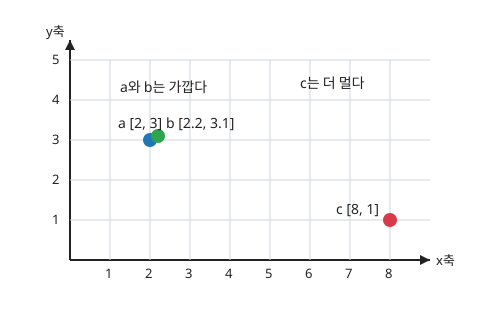

# P2-3.2 벡터 공간(vector space)과 위치의 직관

> Section ID: `P2-3.2`
> Version: `v2026.09.08`

벡터의 각 값을 좌표로 사용하면 벡터를 공간 안의 한 점처럼 놓을 수 있습니다. 같은 좌표 기준으로 표현한 벡터끼리는 위치와 거리를 비교할 수 있습니다.

## 세 벡터의 위치

다음 세 벡터를 2차원 평면에 놓아 봅니다.

\[
\mathbf{a} = [2,\ 3]
\]

\[
\mathbf{b} = [2.2,\ 3.1]
\]

\[
\mathbf{c} = [8,\ 1]
\]

`a`에서 `b`로 이동하려면 첫 번째 좌표는 `0.2`, 두 번째 좌표는 `0.1`만큼 바뀝니다. `a`에서 `c`로 이동할 때는 각각 `6`, `−2`만큼 바뀝니다. 좌표 그림에서도 `a`와 `b`가 가깝고 `c`는 더 멀리 있습니다.

## 위치 비교의 조건

| 기준 | 왜 중요한가 |
| --- | --- |
| 벡터를 위치처럼 읽는다 | 임베딩과 표현 학습 설명이 좌표, 위치, 공간의 언어를 자주 쓰기 때문입니다. |
| 가까움은 비슷함의 후보다 | 유사도 검색과 추천에서 가까운 벡터를 찾는 이유를 설명하기 때문입니다. |
| 같은 공간에서만 비교한다 | 차원과 shape가 다르면 거리나 유사도를 바로 계산할 수 없기 때문입니다. |

## 벡터와 좌표

두 값을 가진 벡터는 두 좌표로 읽을 수 있습니다.

\[
\mathbf{x} = [2,\ 3]
\]

이 벡터는 값 2개를 가진 목록입니다. 동시에 2차원 평면에서 한 점의 좌표처럼 읽을 수도 있습니다. 이때 첫 번째 값은 가로 방향 위치, 두 번째 값은 세로 방향 위치처럼 읽을 수 있습니다.

즉 \([2,\ 3]\)은 “가로로 2, 세로로 3만큼 이동한 위치”처럼 읽을 수 있습니다.

물론 “숫자가 비슷하면 항상 의미가 비슷하다”는 뜻은 아닙니다. 어떤 값이 어떤 의미를 갖도록 만들었는지, 어떤 방식으로 학습되었는지, 어떤 거리나 유사도 기준을 쓰는지에 따라 달라집니다.

## 같은 공간과 차원

벡터 공간(vector space)에서는 벡터의 덧셈과 스칼라배를 정해진 규칙에 따라 계산합니다. 좌표 벡터를 비교하려면 값의 개수와 각 좌표의 기준도 맞아야 합니다.

예를 들어 다음 벡터들은 모두 값 2개를 가집니다.

\[
[1,\ 2],\quad [3,\ 4],\quad [0,\ -1]
\]

이들은 같은 2차원 공간에 놓을 수 있습니다. 반대로 값 3개를 가진 벡터는 3차원 공간의 표현으로 볼 수 있습니다.

\[
[1,\ 2,\ 3]
\]

이때 중요한 것은 같은 공간 안에서 비교해야 한다는 점입니다. 값 2개짜리 벡터와 값 3개짜리 벡터는 바로 같은 방식으로 비교하기 어렵습니다.

[1, 2]와 [1, 2, 3]은 길이가 다르므로, 같은 위치 비교나 거리 계산을 바로 적용하기 어렵습니다.

이것은 코드의 shape 문제와도 연결됩니다. 벡터 공간의 직관은 결국 “같은 규칙과 같은 모양 안에서 비교한다”는 감각을 줍니다.

## 덧셈·스칼라배·선형 결합

벡터 공간의 기본 연산은 덧셈과 스칼라배입니다.

- 벡터끼리 더할 수 있다.
- 벡터에 숫자를 곱할 수 있다.

첫 번째는 벡터 덧셈(vector addition)입니다.

\[
[1,\ 2] + [3,\ 4] = [4,\ 6]
\]

두 번째는 스칼라배(scalar multiplication)입니다. 여기서 스칼라(scalar)는 숫자 하나입니다.

\[
2[1,\ 2] = [2,\ 4]
\]

이 두 계산이 중요한 이유는 새 벡터를 만들 수 있기 때문입니다. 예를 들어 두 벡터를 더하거나, 어떤 벡터를 조금 크게 또는 작게 만들 수 있습니다.

\[
0.5[2,\ 4] = [1,\ 2]
\]

이처럼 벡터에 숫자를 곱하고 더해서 새 벡터를 만드는 방식을 선형 결합(linear combination)이라고 부릅니다.

\[
2\mathbf{a} + 3\mathbf{b}
\]

이 식은 벡터 \(\mathbf{a}\)를 2배 하고, 벡터 \(\mathbf{b}\)를 3배 한 뒤 더한다는 뜻입니다.

예를 들어 입력 벡터에 가중치를 곱하고, 여러 값을 더해 새 표현을 만들고, 그 벡터 표현을 조금씩 조정하는 계산이 모두 이 관점 위에서 설명됩니다.

공통 장면으로 돌아가면, `a`와 `b`를 비교하는 일만이 아니라 `a + b`처럼 새 표현을 만들거나 `2a`처럼 크기를 바꾸는 일도 가능합니다. 즉 벡터 공간은 비교의 자리이면서 동시에 새 벡터를 구성하는 계산의 자리이기도 합니다.

## 좌표의 개수와 고차원

아래 좌표 벡터에서는 성분의 개수가 공간의 차원(dimension)에 대응합니다.

\[
[2,\ 3]
\]

이 벡터는 값이 2개이므로 2차원 벡터로 볼 수 있습니다.

\[
[0.1,\ 0.7,\ -0.2,\ 1.5]
\]

이 벡터는 값이 4개이므로 4차원 벡터로 볼 수 있습니다.

현실에서는 2차원이나 3차원은 그림으로 상상하기 쉽습니다. 하지만 AI에서는 수백 차원, 수천 차원의 벡터도 자주 등장합니다. 예를 들어 텍스트 임베딩(embedding)은 하나의 문장이나 단어를 많은 숫자로 된 벡터로 표현할 수 있습니다.

이 많은 차원은 사람이 직접 그림으로 보기 어렵습니다. 그래도 각 차원은 표현의 한 좌표처럼 쓰이고, 벡터 전체는 하나의 위치처럼 비교될 수 있으며, 가까움과 멂은 데이터 관계를 읽는 단서가 될 수 있다는 기본 직관은 유지됩니다.

다만 각 차원이 사람이 바로 해석할 수 있는 의미를 갖는다고 단정하면 안 됩니다. 학습된 임베딩의 각 숫자는 사람이 붙인 명확한 이름표가 아닐 수 있습니다.

## 가까움과 유사성

벡터 공간에서 가까운 위치에 있는 벡터들은 비슷한 데이터일 수 있습니다. 이것은 임베딩과 벡터 검색의 핵심 직관입니다.

예를 들어 아주 단순하게 두 특징만 가진 상품 벡터를 생각해 봅니다.

여기서는 첫 번째 값을 가격대, 두 번째 값을 무게라고 두겠습니다.

\[
\mathbf{p}_1 = [3,\ 2]
\]

\[
\mathbf{p}_2 = [3.1,\ 2.2]
\]

\[
\mathbf{p}_3 = [9,\ 8]
\]

\(\mathbf{p}_1\)과 \(\mathbf{p}_2\)는 가격대와 무게가 비슷합니다. 이 둘은 가까운 벡터일 가능성이 큽니다. \(\mathbf{p}_3\)은 둘과 더 멀 수 있습니다.

이런 직관은 추천(recommendation), 검색(search), 분류(classification)에서 자주 쓰입니다. 결국 비슷한 사용자, 비슷한 문서, 비슷한 이미지, 비슷한 상품을 찾는 질문으로 이어집니다.

하지만 가까움은 “정답”이 아니라 후보입니다. 어떤 기준으로 가깝다고 보는지, 벡터가 어떤 데이터로 학습되었는지, 실제 문제에서 가까움이 유용한지 검증해야 합니다.

## 위치와 위상

여기서 말하는 위치(position)는 벡터를 좌표처럼 놓고 가까움과 멂을 생각하는 입문적 표현입니다. 반면 위상(topology)은 수학에서 더 넓고 추상적인 개념입니다. 위상은 단순히 한 점의 좌표를 말하기보다, 어떤 점들이 서로 가까운지, 어떤 구조가 이어져 있는지, 연속성(continuity) 같은 성질을 어떻게 볼지와 관련됩니다.

AI 문서에서도 “공간의 위상”, “데이터 매니폴드(manifold)”, “표현 공간의 구조” 같은 표현이 나올 수 있습니다. 이런 표현은 벡터가 놓인 좌표 하나만 보겠다는 뜻이 아니라, 데이터 표현들이 이루는 전체적인 연결 관계나 구조를 보겠다는 뜻에 가깝습니다.

## 임베딩과 문서 검색

임베딩(embedding)은 텍스트, 이미지, 상품, 사용자 같은 대상을 벡터로 바꾸는 표현입니다.

대상은 임베딩 모델을 거쳐 벡터로 바뀌고, 그 결과는 벡터 공간 안의 한 위치처럼 다뤄집니다.

예를 들어 문장 하나가 다음 벡터로 표현된다고 해 봅니다.

\[
\mathbf{e} = [0.12,\ -0.03,\ 0.88,\ 0.41]
\]

이 벡터의 각 숫자가 사람이 바로 읽을 수 있는 단어 뜻을 갖는다고 보기는 어렵습니다. 하지만 전체 벡터는 해당 문장의 표현(representation)으로 사용될 수 있습니다.

이 표현을 벡터 공간에 놓으면 다른 문장 벡터와 비교할 수 있습니다.

문장 A, 문장 B, 문장 C의 벡터를 같은 공간에 놓으면 어느 문장이 더 가까운지 비교할 수 있습니다.

문서 검색에서는 질문과 문서를 같은 임베딩 모델로 벡터화하고, 질문 벡터와 가까운 문서 벡터를 찾습니다. 검색 결과는 질문에 답할 자료의 후보로 사용됩니다.

## 표현 학습과 단어 벡터 연구

표현 학습(representation learning)과 단어 벡터(word vector) 연구에서도 데이터 표현과 벡터 공간의 관계는 중요한 주제로 다뤄졌습니다.

Bengio, Courville, Vincent의 표현 학습 리뷰는 머신러닝 알고리즘의 성공이 데이터 표현(data representation)에 크게 의존한다고 설명합니다. 또한 표현 학습, 밀도 추정(density estimation), 매니폴드 학습(manifold learning) 사이의 기하학적 연결을 중요한 질문으로 제시합니다. 이 근거는 “벡터 표현은 단순 숫자 목록이 아니라 데이터 구조를 드러내는 표현일 수 있다”는 관점을 뒷받침합니다.

Mikolov, Chen, Corrado, Dean의 word2vec 논문은 큰 텍스트 데이터에서 단어의 연속 벡터 표현(continuous vector representation)을 학습하고, 그 품질을 단어 유사도(word similarity) 과제로 평가했습니다. 이 근거는 “단어 같은 기호적 대상도 벡터 공간의 표현으로 바꾸고, 그 벡터들 사이의 가까움을 비교할 수 있다”는 현대 NLP의 중요한 흐름을 보여 줍니다.

## 체크리스트

- 벡터(vector)를 값의 목록이자 좌표처럼 읽을 수 있는 표현으로 설명할 수 있다.
- 벡터 공간(vector space)을 벡터들이 놓이고 비교되는 계산 가능한 자리로 설명할 수 있다.
- 차원(dimension)을 벡터가 가진 값의 개수 또는 좌표 축의 수로 설명할 수 있다.
- 가까운 벡터가 비슷함의 후보가 될 수 있지만 정답은 아님을 설명할 수 있다.
- 위치(position), 거리(distance), 위상(topology)을 같은 말로 섞지 않고 구분할 수 있다.
- 임베딩(embedding)이 대상을 벡터 공간 안의 표현으로 바꾸는 방식임을 설명할 수 있다.
- 벡터 공간 직관이 유사도 검색, RAG, 추천, 클러스터링에서 다시 등장하는 이유를 설명할 수 있다.
- 벡터 덧셈(vector addition), 스칼라배(scalar multiplication), 선형 결합(linear combination)을 벡터 공간의 기본 계산으로 가볍게 설명할 수 있다.
- 벡터를 값 목록에서 위치와 가까움의 관점으로 연결해 설명할 수 있다.
- 임베딩과 유사도 검색이 왜 같은 공간과 차원 조건을 요구하는지 설명할 수 있다.

## 출처와 참고 자료

- Marc Peter Deisenroth, A. Aldo Faisal, Cheng Soon Ong, [Mathematics for Machine Learning](https://mml-book.github.io/){: target="_blank" rel="noopener noreferrer" }, Cambridge University Press, 2020, 확인 날짜: 2026-07-19.
- Ian Goodfellow, Yoshua Bengio, Aaron Courville, [Deep Learning](https://www.deeplearningbook.org/){: target="_blank" rel="noopener noreferrer" }, MIT Press, 2016, 확인 날짜: 2026-07-19.
- Charles R. Harris et al., [Array Programming with NumPy](https://arxiv.org/abs/2006.10256){: target="_blank" rel="noopener noreferrer" }, Nature, 2020, 확인 날짜: 2026-07-19.
- Yoshua Bengio, Aaron Courville, Pascal Vincent, [Representation Learning: A Review and New Perspectives](https://arxiv.org/abs/1206.5538){: target="_blank" rel="noopener noreferrer" }, arXiv, 2012, 확인 날짜: 2026-07-19.
- Tomas Mikolov, Kai Chen, Greg Corrado, Jeffrey Dean, [Efficient Estimation of Word Representations in Vector Space](https://arxiv.org/abs/1301.3781){: target="_blank" rel="noopener noreferrer" }, arXiv, 2013, 확인 날짜: 2026-07-19.
- Google for Developers, [Embeddings: Embedding space and static embeddings](https://developers.google.com/machine-learning/crash-course/embeddings/embedding-space){: target="_blank" rel="noopener noreferrer" }, Machine Learning Crash Course, 확인 날짜: 2026-07-19. 임베딩을 벡터 표현과 임베딩 공간의 가까움으로 설명하는 공식 교육 자료입니다.
- Google for Developers, [Measuring similarity from embeddings](https://developers.google.com/machine-learning/clustering/dnn-clustering/supervised-similarity){: target="_blank" rel="noopener noreferrer" }, Machine Learning Crash Course, 확인 날짜: 2026-07-19. 임베딩 벡터의 유사도를 거리, 코사인, 내적 등으로 측정한다는 연결을 확인하는 참고 자료입니다.
