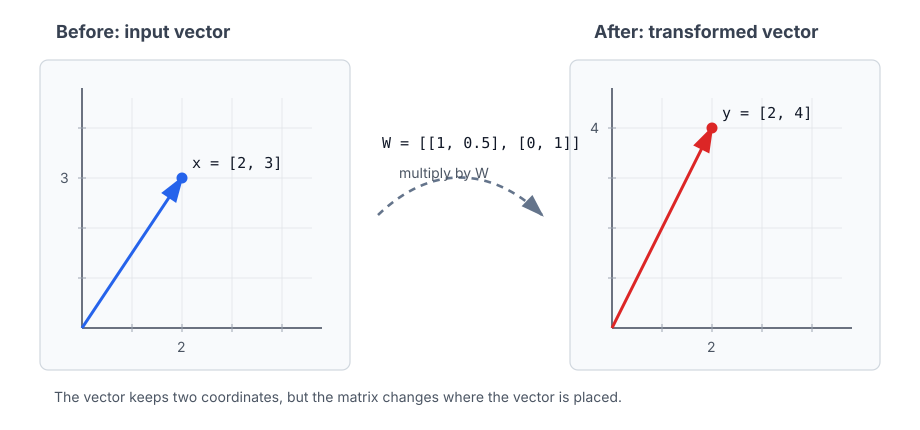

# P2-3.3 What Does Matrix Multiplication Reuse?

> Section ID: `P2-3.3`
> Version: `v2026.07.20`

In P2-3.1, we looked at scalar, vector, and matrix from the perspective of data shape. In P2-3.2, we built the intuition of reading a vector like a position inside space and comparing nearness and farness. Now we move to matrix multiplication.

Matrix multiplication looks at first like a simple multiplication rule, but in practice it is closer to `a calculation that reuses the same weighted-sum pattern many times`.

1. Bundle input values together with weights and add them.
2. Make one new value.
3. Repeat the same calculation for several outputs.
4. Apply it to several inputs at once.

Here the focus is on building the reading habit for what AI documents mean when they say `multiply the input vector by a weight matrix`.

Here we reorganize `matrix multiplication`, `weighted sum`, `weight matrix`, `linear transformation`, and `input/output dimension`. If 3.1 was about reading data shape and 3.2 was about reading vectors like positions, this section organizes the calculation structure that turns that input into a new representation.

Rather than fully mastering matrix-calculation formulas, we focus on reading the computation by which AI models turn an input into a new representation. Once the intuitions of weighted sum, shape, and linear transformation are stable, it becomes much easier to understand structurally `why we multiply by matrices` when later reading neural-network layers or classifiers.

| What to fix in this section now | Question that follows immediately | Where it reappears later |
| --- | --- | --- |
| The distinction that matrix multiplication is not position-wise multiplication | In P2-3.6, we directly check array shape and multiplication in NumPy. | It returns when reading feature matrix `X` in Part 3, and weights and score calculations in Parts 4 and 5. |
| The intuition that one weighted-sum pattern is reused for several outputs | In later sections, we check shape errors and calculation results in code. | It continues into explanations of linear layers, attention calculation, and representation transforms in Part 5. |
| The fact that input and output dimensions are reflected in shape | It leads into how weights and loss connect in `P2-6.1`, `P2-6.2`, and `P2-6.3`. | It reappears when reading embedding projection, logits, and output vectors in Part 5. |

## Core Criteria: What Does Matrix Multiplication Reuse?

- You can explain that matrix multiplication is not element-wise multiplication.
- You can understand that multiplying a vector and weights produces a new value through a weighted sum.
- You can read matrix multiplication as a way of calculating several weighted sums at once.
- You can explain that input dimension and output dimension are reflected in the shape of the matrix.
- You can understand linear transformation as a calculation that moves a vector into another representation space.
- You can explain why this calculation reappears in neural-network layers, embeddings, and classification.

## Three Criteria

| Criterion | Why it matters | Level of understanding needed here |
| --- | --- | --- |
| Matrix multiplication reuses weighted sums | Because it is the basic calculation that can create not only one output, but several outputs at once. | Understand that the calculation “multiply inputs by weights and add them” is repeated across columns. |
| Shape decides whether the calculation is possible | Because if the inner dimensions do not match, we cannot decide which value corresponds to which weight. | Understand that input length must match the input-side size of the weight matrix. |
| Linear transformation changes representation | Because explanations of neural-network layers and classifiers all continue into calculations that turn an input into a new representation. | Understand that matrix multiplication can move a vector into another vector with different length and meaning. |

## Element-Wise Multiplication and Matrix Multiplication Are Different

In P2-3.1, we said that vectors or matrices with the same shape can be added position by position. Multiplication can also be written as element-wise multiplication.

\[
[1,\ 2,\ 3] \odot [4,\ 5,\ 6] = [4,\ 10,\ 18]
\]

Here, \(\odot\) marks multiplication of values at the same positions. This calculation processes each position separately.

Matrix multiplication is different. Matrix multiplication is not a calculation that multiplies only matching positions. It creates new values by combining a row from one side with a column from the other.

1. Element-wise multiplication multiplies matching positions.
2. Matrix multiplication multiplies and adds by matching rows and columns.

We need to separate these two first. If matrix multiplication is misunderstood as element-wise multiplication, we misread both shape errors and the meaning of the calculation.

## One Output Is Made from a Weighted Sum

First, think about one vector and one set of weights.

\[
\mathbf{x} = [2,\ 3]
\]

\[
\mathbf{w} = [4,\ 5]
\]

If we multiply matching positions and then add them, one number comes out.

\[
2 \times 4 + 3 \times 5 = 8 + 15 = 23
\]

This calculation can be read as follows.

1. Multiply the first input value by the first weight.
2. Multiply the second input value by the second weight.
3. Add the results.
4. Make one output value.

This is the basic form of a weighted sum.

\[
y = x_1w_1 + x_2w_2
\]

In AI models, input values do not always carry the same importance. Some values can be reflected strongly, some weakly, and some in a negative direction. A weight expresses this degree of influence as a number.

We do not cover how weights are learned here. The basic flow of training and optimization returns in P2-6.1 to P2-6.3, and backpropagation and optimizers in the deep-learning context return in P5-5.1, P5-7.1, and P5-7.2. Here we only look at the calculation form `multiply inputs by weights and add to make a new value`.

## Matrix Multiplication Reuses Weighted Sums Several Times

To make one output, we needed one weight vector. If we want to make two outputs, we need two weight vectors.

\[
\mathbf{x} = [2,\ 3]
\]

\[
W =
\begin{bmatrix}
4 & 1 \\
5 & 2
\end{bmatrix}
\]

Here, \(W\) is a weight matrix. The first column can be read as the weights for making the first output value, and the second column as the weights for making the second output value.

\[
\mathbf{y} = \mathbf{x}W
\]

When calculated, it becomes the following.

\[
\mathbf{y}
=
[2,\ 3]
\begin{bmatrix}
4 & 1 \\
5 & 2
\end{bmatrix}
\]

\[
=
[2 \times 4 + 3 \times 5,\ 2 \times 1 + 3 \times 2]
\]

\[
=
[23,\ 8]
\]

This calculation has reused the weighted sum twice.

```text
First output: 2 x 4 + 3 x 5 = 23
Second output: 2 x 1 + 3 x 2 = 8
```

Matrix multiplication repeatedly applies the small calculation `multiply and add` to several outputs. That is why matrix multiplication becomes a tool for turning one input vector into an output vector of another shape. Here, the input vector shape is 2, the weight matrix shape is `2 x 2`, and the output vector shape is also 2.

## Shape Decides Whether the Calculation Is Possible

In matrix multiplication, shape is extremely important. The number of values in the input vector must match the number of rows of the weight matrix.

\[
[2,\ 3]
\begin{bmatrix}
4 & 1 \\
5 & 2
\end{bmatrix}
\]

In this calculation, the input vector has length 2 and the matrix also has 2 rows. So each input value can correspond to the weights in each row.

By contrast, the following calculation does not match immediately.

\[
[2,\ 3,\ 4]
\begin{bmatrix}
4 & 1 \\
5 & 2
\end{bmatrix}
\]

The input has 3 values, but the weight matrix has a shape that can receive only 2 inputs.

1. The input length and the input-side size of the weight matrix must match.
2. If they do not match, we cannot decide which value should be multiplied with which weight.

This is one reason shape errors appear so often in AI code. Matrix multiplication is, both mathematically and in code, a calculation that can run only when the shapes match.

## Matrix Multiplication Handles Several Data Points at Once

The power of matrix multiplication is not only in handling one input. We can gather several inputs into a matrix and calculate them at once.

For example, suppose we have two input vectors.

\[
X =
\begin{bmatrix}
2 & 3 \\
1 & 4
\end{bmatrix}
\]

Each row is one input sample.

```text
First sample: [2, 3]
Second sample: [1, 4]
```

Now multiply by the same weight matrix \(W\).

\[
W =
\begin{bmatrix}
4 & 1 \\
5 & 2
\end{bmatrix}
\]

\[
Y = XW
\]

The calculation result becomes:

\[
Y =
\begin{bmatrix}
23 & 8 \\
24 & 9
\end{bmatrix}
\]

The first row is the output of the first sample, and the second row is the output of the second sample.

1. Gather several input samples into a matrix.
2. Multiply by the same weight matrix.
3. Obtain several output samples at once.

This connects to the basic intuition of batch calculation. A model can process inputs one by one, but if several inputs are bundled and calculated at once, the same calculation structure can be reused repeatedly.

## Linear Transformation Is a Calculation That Moves a Representation into Another Space

Linear transformation can first be understood as a calculation that changes one vector into another by multiplying by a matrix.

1. Prepare the input vector.
2. Apply the weight matrix.
3. Obtain the output vector.

For example, if the input has 2 values and the output has 3 values, the weight matrix must have a shape that can receive 2 inputs and produce 3 outputs.

\[
\mathbf{x} \in \mathbb{R}^{2}
\]

\[
W \in \mathbb{R}^{2 \times 3}
\]

\[
\mathbf{y} = \mathbf{x}W,\quad \mathbf{y} \in \mathbb{R}^{3}
\]

This can be read as follows.

1. Receive an input represented by 2 values.
2. Change it into an output represented by 3 values.

In two dimensions, this change can be seen in a drawing. The following example shows an input vector \(\mathbf{x} = [2,\ 3]\) multiplied by a simple matrix \(W\), moving to \(\mathbf{y} = [2,\ 4]\).



What matters in this figure is not the numeric calculation itself but the perspective. A vector can be read like a position in space, and matrix multiplication can be read as a calculation that moves that position to another position.

```text
Input position: [2, 3]
Apply matrix W.
Output position: [2, 4]
```

In actual AI models, this kind of transformation happens in far more dimensions than a 2D picture. So it is hard for a person to draw directly, but the basic way of thinking stays the same. An input representation moves into another representation as it passes through a weight matrix.

This perspective matters in AI. A model does not leave the input representation as it is. It changes it through several stages of calculation into another representation.

1. There is an original input representation.
2. It passes through the first transformation.
3. We obtain an intermediate representation.
4. It passes through the next transformation.
5. It moves toward a representation closer to the final output.

The layers of a neural network can be seen as a structure that stacks these transformations several times. Of course, a real neural network is not made only of linear transformations. Other calculations such as activation functions, normalization, and attention also appear together. Here we only note that linear transformation is one of the important basic blocks among them.

## What Does Matrix Multiplication Reuse?

The title of this section is `what does matrix multiplication reuse?` The answer can be organized into three points.

First, it reuses the same weighted-sum structure.

1. Multiply.
2. Add.
3. Make one output value.

Second, it reuses the same weight matrix across several input samples.

1. Apply the same `W` to sample A.
2. Apply the same `W` to sample B.
3. Apply the same `W` to sample C.

Third, it repeats the same transformation structure across several layers.

1. Change the representation.
2. Change the representation again.
3. Move toward a representation that fits the problem better.

Viewed this way, matrix multiplication is not just a formula. It is a basic device through which a model repeatedly changes, compresses, and re-represents data.

## Looking Through a Case

### Case 1. A Calculation That Makes Two New Scores from Two Features

When a learner first sees matrix multiplication, it can feel like only a rule for arranging numbers and multiplying them. But in actual model calculation, the more important perspective is `re-bundling input features with several weight combinations to make new scores`.

For example, suppose one product is represented by two values: `price level` and `purchase frequency`. If we apply two different weight combinations to these two input features, we can make two new output values such as `price influence score` and `purchase tendency score`. This exact structure of `repeating several weighted sums from the same input` is matrix multiplication.

This case also shows why matrix multiplication is not simple position-wise multiplication. We are not multiplying only matching positions. We are combining the values of one input vector with the weights prepared for each output and producing a new representation.

So matrix multiplication is read less as a memorized rule and more as `a reusable calculation that changes an input into another representation space`. This intuition continues directly into explanations of neural-network layers, linear transformations, and weight matrices.

## Checklist

- Can you distinguish matrix multiplication from element-wise multiplication?
- Can you explain weighted sum as a calculation that multiplies input values by weights and adds them?
- Can you read matrix multiplication as a way of calculating several weighted sums at once?
- Can you explain that the length of the input vector must match the input-side size of the weight matrix?
- Can you explain the intuition of batch calculation, where several samples are bundled into a matrix and the same weight matrix is applied?
- Can you explain linear transformation as a calculation that changes an input representation into another output representation?
- Can you explain why matrix multiplication reappears in neural-network layers, embeddings, and classification?
- Can you explain matrix multiplication as the reusable weighted-sum structure of `input -> weight matrix -> output`?

## Sources and References

- Marc Peter Deisenroth, A. Aldo Faisal, Cheng Soon Ong, [Mathematics for Machine Learning](https://mml-book.github.io/){: target="_blank" rel="noopener noreferrer" }, Cambridge University Press, 2020, checked 2026-07-19.
- Ian Goodfellow, Yoshua Bengio, Aaron Courville, [Deep Learning](https://www.deeplearningbook.org/){: target="_blank" rel="noopener noreferrer" }, MIT Press, 2016, checked 2026-07-19.
- Charles R. Harris et al., [Array Programming with NumPy](https://arxiv.org/abs/2006.10256){: target="_blank" rel="noopener noreferrer" }, Nature, 2020, checked 2026-07-19.
- NumPy Developers, [numpy.matmul](https://numpy.org/doc/stable/reference/generated/numpy.matmul.html){: target="_blank" rel="noopener noreferrer" }, NumPy User Guide, checked on 2026-07-19. This official reference supports the shape condition of matrix multiplication and the meaning of the `@` operator.
- Google for Developers, [Neural networks: Nodes and hidden layers](https://developers.google.com/machine-learning/crash-course/neural-networks/nodes-hidden-layers){: target="_blank" rel="noopener noreferrer" }, Machine Learning Crash Course, checked on 2026-07-19. This official educational reference explains that neural-network node values are calculated by summing products of inputs and weights.
