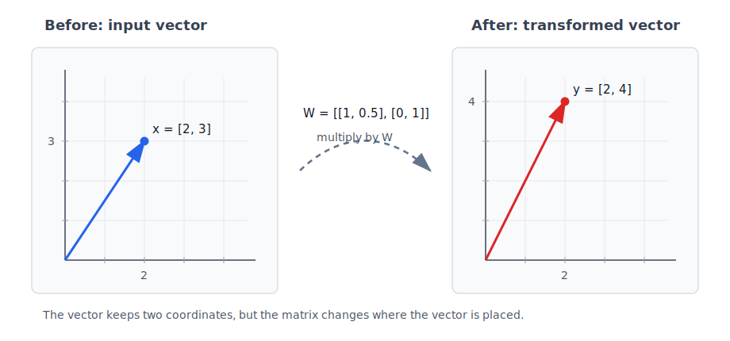

# P2-3.3 행렬 곱(matrix multiplication)은 무엇을 재사용하는가

P2-3.1에서는 스칼라(scalar), 벡터(vector), 행렬(matrix)을 데이터 모양(shape)의 관점에서 봤습니다. P2-3.2에서는 벡터를 공간 안의 위치(position)처럼 읽고, 가까움과 멂을 비교하는 직관을 잡았습니다. 이제 행렬 곱(matrix multiplication)을 봅니다.

행렬 곱은 처음 보면 단순한 곱셈처럼 보이지만, 실제로는 “같은 방식의 가중합(weighted sum)을 여러 번 재사용하는 계산”에 가깝습니다.

> 벡터의 값들을 가중치와 함께 묶어 더한다.
> -> 하나의 새 값을 만든다.
> -> 같은 계산을 여러 출력에 반복한다.
> -> 여러 입력에도 한꺼번에 적용한다.

이 절의 목표는 행렬 곱을 빠르게 계산하는 기술이 아닙니다. AI 문서에서 “입력 벡터에 가중치 행렬을 곱한다”는 말이 무엇을 뜻하는지 읽는 감각을 만드는 것입니다.

## 이 절의 범위

이 절은 행렬 곱(matrix multiplication), 가중합(weighted sum), 선형 변환(linear transformation)의 입문적 의미를 다룹니다. 행렬식(determinant), 역행렬(inverse matrix), 고유값(eigenvalue), 고유벡터(eigenvector)는 다루지 않습니다. NumPy로 행렬 곱을 직접 실행하는 실습은 P2-3.4로 넘깁니다.

여기서는 다음 질문에 집중합니다.

> 행렬 곱은 위치별 곱과 무엇이 다른가?
> 왜 행과 열을 맞춰 계산하는가?
> 행렬 곱은 어떤 계산을 반복해서 재사용하는가?
> 가중치 행렬(weight matrix)은 무엇을 바꾸는가?
> 선형 변환(linear transformation)은 왜 AI에서 자주 등장하는가?

## 이 절의 목표

- 행렬 곱(matrix multiplication)이 위치별 곱(element-wise multiplication)이 아님을 설명할 수 있습니다.
- 벡터와 가중치의 곱이 가중합(weighted sum)으로 새 값을 만든다는 점을 이해할 수 있습니다.
- 행렬 곱을 여러 가중합을 한꺼번에 계산하는 방식으로 읽을 수 있습니다.
- 입력 차원(input dimension)과 출력 차원(output dimension)이 행렬의 모양(shape)에 반영된다는 점을 설명할 수 있습니다.
- 선형 변환(linear transformation)을 벡터를 다른 표현 공간으로 옮기는 계산으로 이해할 수 있습니다.
- 이 계산이 신경망(neural network)의 층(layer), 임베딩(embedding), 분류(classification)에서 다시 등장하는 이유를 말할 수 있습니다.

## 위치별 곱과 행렬 곱은 다르다

P2-3.1에서는 같은 모양(shape)의 벡터나 행렬을 위치별로 더할 수 있다고 했습니다. 곱셈도 위치별 곱(element-wise multiplication)으로 생각하면 다음처럼 쓸 수 있습니다.

\[
[1,\ 2,\ 3] \odot [4,\ 5,\ 6] = [4,\ 10,\ 18]
\]

여기서 \(\odot\)는 같은 위치의 값끼리 곱한다는 표시입니다. 이 계산은 각 위치를 따로 처리합니다.

행렬 곱(matrix multiplication)은 다릅니다. 행렬 곱은 같은 위치끼리만 곱하는 계산이 아니라, 한쪽의 행(row)과 다른 쪽의 열(column)을 조합해 새 값을 만듭니다.

> 위치별 곱: 같은 위치끼리 곱한다.
> 행렬 곱: 행과 열을 맞춰 곱하고 더한다.

이 차이를 먼저 구분해야 합니다. 행렬 곱을 위치별 곱으로 오해하면 shape 오류와 계산 의미를 모두 잘못 읽게 됩니다.

## 하나의 출력은 가중합으로 만들어진다

먼저 벡터 하나와 가중치(weight) 하나를 생각합니다.

\[
\mathbf{x} = [2,\ 3]
\]

\[
\mathbf{w} = [4,\ 5]
\]

두 벡터를 같은 위치끼리 곱한 뒤 더하면 하나의 숫자가 나옵니다.

\[
2 \times 4 + 3 \times 5 = 8 + 15 = 23
\]

이 계산은 다음처럼 읽을 수 있습니다.

> 첫 번째 입력값에 첫 번째 가중치를 곱한다.
> 두 번째 입력값에 두 번째 가중치를 곱한다.
> 그 결과를 더한다.
> 하나의 출력값을 만든다.

이것이 가중합(weighted sum)의 기본 모양입니다.

\[
y = x_1w_1 + x_2w_2
\]

AI 모델에서 입력값은 모두 같은 중요도를 갖지 않을 수 있습니다. 어떤 값은 크게 반영하고, 어떤 값은 작게 반영하고, 어떤 값은 음의 방향으로 반영할 수도 있습니다. 가중치(weight)는 이런 반영 정도를 숫자로 표현합니다.

다만 이 절에서는 가중치가 어떻게 학습되는지는 다루지 않습니다. 학습(training)과 최적화(optimization)는 뒤의 장에서 다룹니다. 여기서는 “입력에 가중치를 곱해 더하면 새 값이 만들어진다”는 계산 형태만 봅니다.

## 행렬 곱은 가중합을 여러 번 재사용한다

출력값 하나를 만들 때는 가중치 벡터 하나가 필요했습니다. 출력값을 두 개 만들고 싶다면 가중치 벡터도 두 개 필요합니다.

\[
\mathbf{x} = [2,\ 3]
\]

\[
W =
\begin{bmatrix}
4 & 1 \\
5 & 2
\end{bmatrix}
\]

여기서 \(W\)는 가중치 행렬(weight matrix)입니다. 첫 번째 열(column)은 첫 번째 출력값을 만들기 위한 가중치이고, 두 번째 열은 두 번째 출력값을 만들기 위한 가중치로 볼 수 있습니다.

\[
\mathbf{y} = \mathbf{x}W
\]

계산하면 다음과 같습니다.

\[
\mathbf{y}
=
[2,\ 3]
\begin{bmatrix}
4 & 1 \\
5 & 2
\end{bmatrix}
\]

\[
=
[2 \times 4 + 3 \times 5,\ 2 \times 1 + 3 \times 2]
\]

\[
=
[23,\ 8]
\]

이 계산은 가중합을 두 번 재사용한 것입니다.

```text
첫 번째 출력: 2 x 4 + 3 x 5 = 23
두 번째 출력: 2 x 1 + 3 x 2 = 8
```

행렬 곱은 “곱하고 더한다”는 작은 계산을 여러 출력에 반복 적용합니다. 그래서 행렬 곱은 하나의 입력 벡터를 다른 모양의 출력 벡터로 바꾸는 도구가 됩니다.

> 입력 벡터 shape: 2
> 가중치 행렬 shape: 2 x 2
> 출력 벡터 shape: 2

## shape은 계산 가능 여부를 정한다

행렬 곱에서는 shape이 매우 중요합니다. 입력 벡터의 값 개수와 가중치 행렬의 행(row) 수가 맞아야 합니다.

\[
[2,\ 3]
\begin{bmatrix}
4 & 1 \\
5 & 2
\end{bmatrix}
\]

위 계산에서는 입력 벡터의 길이가 2이고, 행렬의 행도 2개입니다. 그래서 각 입력값이 각 행의 가중치와 대응될 수 있습니다.

반대로 다음 계산은 바로 맞지 않습니다.

\[
[2,\ 3,\ 4]
\begin{bmatrix}
4 & 1 \\
5 & 2
\end{bmatrix}
\]

입력값은 3개인데, 가중치 행렬은 2개의 입력만 받을 수 있는 모양입니다.

> 입력 길이와 가중치 행렬의 입력 방향 크기가 맞아야 한다.
> 맞지 않으면 어떤 값과 어떤 가중치를 곱할지 정할 수 없다.

이것이 AI 코드에서 shape 오류가 자주 발생하는 이유입니다. 행렬 곱은 수학적으로도, 코드적으로도 “모양이 맞아야 실행되는 계산”입니다.

## 행렬 곱은 여러 데이터를 한꺼번에 처리한다

행렬 곱의 힘은 입력 하나만 처리하는 데 있지 않습니다. 여러 입력을 행렬로 모아 한꺼번에 계산할 수 있습니다.

예를 들어 입력 벡터 두 개가 있다고 해 봅니다.

\[
X =
\begin{bmatrix}
2 & 3 \\
1 & 4
\end{bmatrix}
\]

각 행(row)은 하나의 입력 샘플(sample)입니다.

```text
첫 번째 샘플: [2, 3]
두 번째 샘플: [1, 4]
```

같은 가중치 행렬 \(W\)를 곱합니다.

\[
W =
\begin{bmatrix}
4 & 1 \\
5 & 2
\end{bmatrix}
\]

\[
Y = XW
\]

계산 결과는 다음과 같습니다.

\[
Y =
\begin{bmatrix}
23 & 8 \\
24 & 9
\end{bmatrix}
\]

첫 번째 행은 첫 번째 샘플의 출력이고, 두 번째 행은 두 번째 샘플의 출력입니다.

> 여러 입력 샘플을 행렬로 묶는다.
> 같은 가중치 행렬을 곱한다.
> 여러 출력 샘플을 한꺼번에 얻는다.

이것은 배치(batch) 계산의 기본 직관과 연결됩니다. 모델은 입력 하나씩만 처리할 수도 있지만, 여러 입력을 묶어 한 번에 계산하면 같은 계산 구조를 반복해서 재사용할 수 있습니다.

## 선형 변환은 표현을 다른 공간으로 옮기는 계산이다

선형 변환(linear transformation)은 벡터에 행렬을 곱해 다른 벡터로 바꾸는 계산으로 먼저 이해할 수 있습니다.

> 입력 벡터
> -> 가중치 행렬
> -> 출력 벡터

예를 들어 입력이 2개 값이고 출력이 3개 값이라면, 가중치 행렬은 입력 2개를 받아 출력 3개를 만들 수 있는 모양이어야 합니다.

\[
\mathbf{x} \in \mathbb{R}^{2}
\]

\[
W \in \mathbb{R}^{2 \times 3}
\]

\[
\mathbf{y} = \mathbf{x}W,\quad \mathbf{y} \in \mathbb{R}^{3}
\]

이 식은 다음처럼 읽을 수 있습니다.

> 2개의 값으로 표현된 입력을
> 3개의 값으로 표현된 출력으로 바꾼다.

2차원에서는 이 변화를 그림으로 볼 수 있습니다. 다음 예시는 입력 벡터 \(\mathbf{x} = [2,\ 3]\)에 단순한 행렬 \(W\)를 곱해 \(\mathbf{y} = [2,\ 4]\)로 옮기는 모습을 보여 줍니다.



이 그림에서 중요한 것은 숫자 계산 자체보다 관점입니다. 벡터는 공간 안의 위치처럼 읽을 수 있고, 행렬 곱은 그 위치를 다른 위치로 옮기는 계산으로 볼 수 있습니다.

```text
입력 위치: [2, 3]
행렬 W를 적용한다.
출력 위치: [2, 4]
```

실제 AI 모델에서는 이런 변환이 2차원 그림보다 훨씬 많은 차원에서 일어납니다. 그래서 사람이 직접 눈으로 그리기는 어렵지만, 기본 사고는 같습니다. 입력 표현은 가중치 행렬을 지나며 다른 표현으로 이동합니다.

이 관점이 AI에서 중요합니다. 모델은 입력 표현을 그대로 두지 않고, 여러 단계의 계산을 거치며 다른 표현으로 바꿉니다.

> 원래 입력 표현
> -> 첫 번째 변환
> -> 중간 표현
> -> 다음 변환
> -> 출력에 가까운 표현

신경망(neural network)의 층(layer)은 이런 변환을 여러 번 쌓는 구조로 볼 수 있습니다. 다만 실제 신경망은 선형 변환만으로 구성되지 않습니다. 활성화 함수(activation function), 정규화(normalization), attention 같은 다른 계산도 함께 등장합니다. 이 절에서는 선형 변환이 그중 중요한 기본 블록이라는 점만 봅니다.

## 행렬 곱은 무엇을 재사용하는가

이 절의 제목은 “행렬 곱은 무엇을 재사용하는가”입니다. 답은 세 가지로 정리할 수 있습니다.

첫째, 같은 가중합 구조를 재사용합니다.

> 곱한다.
> 더한다.
> 하나의 출력값을 만든다.

둘째, 같은 가중치 행렬을 여러 입력 샘플에 재사용합니다.

> 샘플 A에도 같은 W를 적용한다.
> 샘플 B에도 같은 W를 적용한다.
> 샘플 C에도 같은 W를 적용한다.

셋째, 같은 변환 구조를 여러 층에서 반복합니다.

> 표현을 바꾼다.
> 다시 표현을 바꾼다.
> 더 문제에 맞는 표현으로 이동한다.

이렇게 보면 행렬 곱은 단순 계산 공식이 아니라, 모델이 데이터를 반복적으로 바꾸고 압축하고 재표현하는 기본 장치입니다.

## 이 절에서 기억할 관점

행렬 곱(matrix multiplication)은 위치별 곱이 아닙니다. 행렬 곱은 입력값과 가중치를 곱해 더하는 가중합을 여러 번 재사용해 새 벡터를 만드는 계산입니다.

> 입력 벡터
> -> 가중치 행렬
> -> 출력 벡터

이 구조는 AI 모델에서 계속 반복됩니다. 입력 데이터는 숫자 표현이 되고, 가중치 행렬을 지나며 다른 표현으로 바뀌고, 여러 단계의 변환을 거쳐 최종 출력에 가까워집니다.

## 체크리스트

- 행렬 곱(matrix multiplication)과 위치별 곱(element-wise multiplication)을 구분할 수 있다.
- 가중합(weighted sum)이 입력값에 가중치를 곱해 더하는 계산임을 설명할 수 있다.
- 행렬 곱을 여러 가중합을 한꺼번에 계산하는 방식으로 읽을 수 있다.
- 입력 벡터의 길이와 가중치 행렬의 입력 방향 크기가 맞아야 함을 설명할 수 있다.
- 여러 샘플을 행렬로 묶어 같은 가중치 행렬을 적용하는 배치(batch) 계산의 직관을 설명할 수 있다.
- 선형 변환(linear transformation)을 입력 표현을 다른 출력 표현으로 바꾸는 계산으로 설명할 수 있다.
- 행렬 곱이 신경망의 층(layer), 임베딩, 분류에서 다시 등장하는 이유를 말할 수 있다.

## 출처와 참고 자료

- Marc Peter Deisenroth, A. Aldo Faisal, Cheng Soon Ong, [Mathematics for Machine Learning](https://mml-book.github.io/), Cambridge University Press, 2020, 확인 날짜: 2026-06-24.
- Ian Goodfellow, Yoshua Bengio, Aaron Courville, [Deep Learning](https://www.deeplearningbook.org/), MIT Press, 2016, 확인 날짜: 2026-06-24.
- Charles R. Harris et al., [Array Programming with NumPy](https://arxiv.org/abs/2006.10256), Nature, 2020, 확인 날짜: 2026-06-24.
