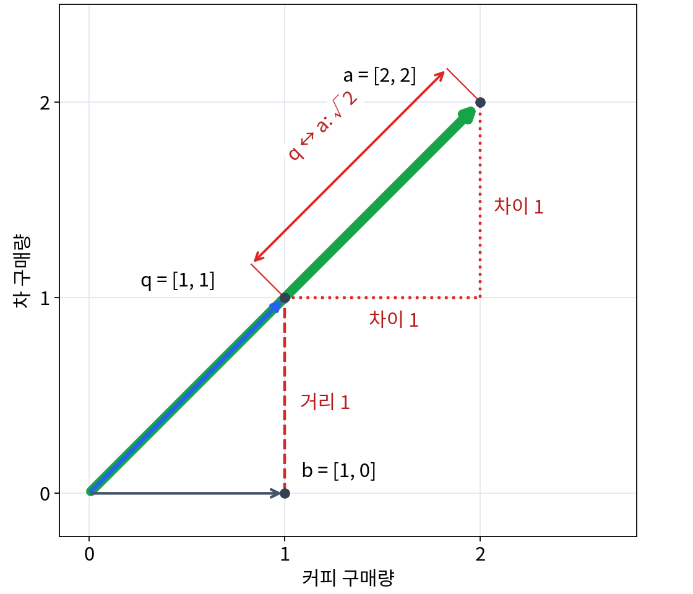
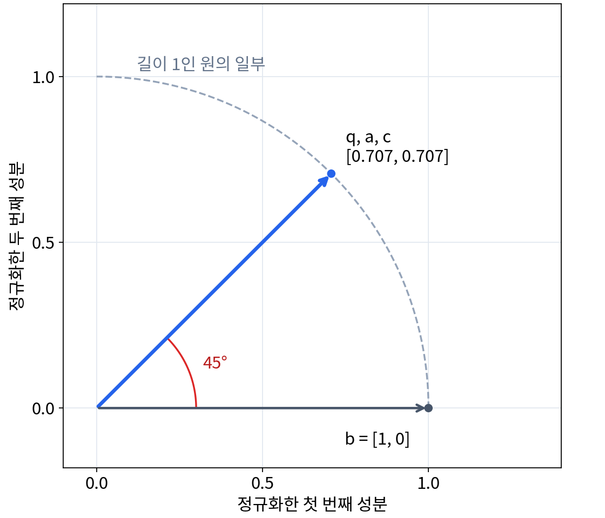

# P2-3.4 내적(dot product), 길이(norm), 거리(distance), 유사도(similarity)

> Section ID: `P2-3.4`
> Version: `v2026.09.14`

커피와 차를 각각 한 잔씩 산 사람에게 비슷한 구매자를 찾아준다고 합시다. 커피와 차를 두 잔씩 산 사람은 구매 비율이 같고, 커피만 한 잔 산 사람은 구매량의 차이가 더 작습니다. 무엇을 비슷하다고 볼지에 따라 선택이 달라집니다.

벡터를 비교하는 내적, 길이, 거리, 유사도는 이런 판단을 숫자로 표현하는 도구입니다. 같은 데이터를 쓰더라도 계산 기준이 달라지면 후보의 순서가 바뀔 수 있습니다.

## 구매량과 구매 비율

각 벡터의 첫 번째 성분은 커피 구매량, 두 번째 성분은 차 구매량입니다. 모두 같은 기간에 구매한 잔 수로 비교합니다.

| 구매자 | 벡터 | 기준 구매자와의 차이 |
| --- | --- | --- |
| 기준 `q` | `[1, 1]` | 커피와 차를 한 잔씩 구매 |
| `a` | `[2, 2]` | 두 음료를 각각 두 배 구매 |
| `b` | `[1, 0]` | 커피는 같고 차는 구매하지 않음 |
| `c` | `[10, 10]` | 두 음료를 각각 열 배 구매 |

`a`와 `c`는 `q`와 구매 비율이 같습니다. 좌표평면에서는 원점에서 같은 방향에 놓입니다. `b`는 두 번째 성분이 0이어서 방향은 다르지만, 구매량은 `q`와 차 한 잔만 다릅니다.

## 내적: 성분의 곱과 합

내적(dot product)은 두 벡터의 같은 위치 값을 곱하고 모두 더하는 계산입니다. 실수 벡터의 성분이 각각 \(n\)개라면 다음과 같이 계산합니다.

\[
x\cdot y=x_1y_1+x_2y_2+\cdots+x_ny_n
\]

구매량 벡터에서는 커피끼리 곱한 값과 차끼리 곱한 값을 더합니다.

\[
q\cdot a=1\times2+1\times2=4
\]

같은 방법으로 `q·b = 1`, `q·c = 20`입니다. `a`와 `c`는 모두 기준 구매자와 구매 비율이 같지만, 구매량이 많은 `c`의 내적이 더 큽니다. **내적에는 방향뿐 아니라 벡터의 크기도 반영됩니다.** 내적이 크다는 이유만으로 구매 비율이 더 비슷하다고 판단할 수는 없습니다.

성분에 음수가 있으면 곱한 값들이 서로 상쇄될 수도 있습니다. 예를 들어 `[1, 1]·[1, -1] = 1−1 = 0`입니다. 내적은 행렬 곱에서도 쓰입니다. 앞 절에서 계산한 결과 행렬의 한 칸은 왼쪽 행렬의 한 행과 오른쪽 행렬의 한 열을 내적한 값입니다.

## 길이: 원점까지의 거리

벡터의 길이를 나타내는 값을 노름(norm)이라고 합니다. 여기서 사용하는 **2-노름**은 원점에서 벡터의 끝점까지 잰 직선거리입니다. 두 성분을 가로·세로 길이로 놓으면 피타고라스 정리로 계산할 수 있습니다.

\[
\|x\|_2=\sqrt{x_1^2+x_2^2+\cdots+x_n^2}
\]

\[
\|q\|_2=\sqrt{1^2+1^2}=\sqrt2,\qquad
\|a\|_2=\sqrt{2^2+2^2}=2\sqrt2
\]

`a`는 `q`의 각 성분을 두 배로 늘린 벡터이므로 길이도 두 배입니다. `c`의 길이는 `10√2`로, `q`의 열 배입니다. 방향은 같아도 길이는 다릅니다.

2-노름을 구매 잔 수의 합과 혼동하지 않아야 합니다. `q`가 구매한 총량은 `1+1=2`잔이지만, 2-노름은 `√2`입니다. 노름은 선택한 계산 규칙에 따른 벡터의 크기입니다.

## 거리: 두 점 사이의 차이

유클리드 거리(Euclidean distance)는 두 벡터의 끝점 사이를 직선으로 잰 거리입니다. **성분별로 차이를 구한 뒤 그 차이 벡터의 길이를 계산합니다.**

\[
d(q,a)=\|a-q\|_2
=\sqrt{(2-1)^2+(2-1)^2}=\sqrt2\approx1.414
\]

\[
d(q,b)=\sqrt{(1-1)^2+(0-1)^2}=1
\]

원점에서 뻗는 화살표는 각 구매자의 벡터이고, 빨간 거리 표시는 끝점 사이를 비교합니다. `q`에서 `a`로 가려면 가로와 세로로 각각 1만큼 이동하지만, `b`로 가려면 세로로만 1만큼 이동합니다. 그래서 **구매량의 차이를 이 거리로 비교하면 `b`가 더 가깝습니다.**

원점에서 끝점까지 재면 벡터의 길이이고, 한 끝점에서 다른 끝점까지 재면 두 벡터 사이의 거리입니다. 같은 길이 계산을 어느 위치의 차이에 적용하는지가 다릅니다.

## 코사인 유사도: 크기를 나누고 방향 비교

코사인 유사도(cosine similarity)는 두 벡터의 내적을 각 벡터 길이의 곱으로 나눈 값입니다. 두 벡터 모두 길이가 0이 아니어야 합니다.

\[
\operatorname{cos\_sim}(q,a)
=\frac{q\cdot a}{\|q\|_2\|a\|_2}
=\frac{4}{\sqrt2\times2\sqrt2}=1
\]

벡터의 각 성분을 그 벡터의 길이로 나누면 방향은 유지되고 길이는 1이 됩니다. 이것을 **단위 벡터로 정규화한다**고 합니다. `q`, `a`, `c`를 각각 정규화하면 모두 약 `[0.707, 0.707]`이 됩니다. 코사인 유사도는 이렇게 크기의 영향을 제거한 두 벡터의 내적과 같습니다.

\[
\frac{q}{\|q\|_2}=\left[\frac1{\sqrt2},\frac1{\sqrt2}\right]\approx[0.707,\ 0.707]
\]

점선 원 위의 점들은 원점에서 거리가 모두 1입니다. 정규화한 `q`, `a`, `c`는 같은 방향에 겹치고 `b`와는 45도 차이가 납니다. `q`와 `b`의 코사인 유사도는 `1/(√2×1) ≈ 0.707`입니다.

코사인 유사도는 두 벡터 사이 각도의 코사인 값입니다. 각도가 0°에서 180°로 커질수록 값은 `1`에서 `−1`로 작아집니다. 같은 방향이면 `1`, 직각이면 `0`, 정반대 방향이면 `−1`이며 값의 범위는 `−1`부터 `1`입니다. 예를 들어 `[1, 1]`과 `[1, -1]`은 직각이므로 `0`, `[1, 1]`과 `[-1, -1]`은 정반대이므로 `−1`입니다. 음수 성분은 구매 잔 수에는 맞지 않지만, 다른 데이터를 표현하는 벡터에서는 나올 수 있습니다.

`[0, 0]`은 길이가 0이어서 나눗셈을 할 수 없고 방향도 정할 수 없습니다. 이 벡터의 코사인 유사도는 위 수식으로 정의되지 않습니다.

## 비교 기준이 바꾸는 선택

| 기준 `q = [1, 1]`과 비교 | 내적 | 유클리드 거리 | 코사인 유사도 |
| --- | --- | --- | --- |
| `a = [2, 2]` | `4` | 약 `1.414` | `1` |
| `b = [1, 0]` | `1` | `1` | 약 `0.707` |
| `c = [10, 10]` | `20` | 약 `12.728` | `1` |

구매량이 가까운 사람을 거리로 고르면 `b`입니다. 구매 비율이 같은 사람을 코사인 유사도로 고르면 `a`와 `c`가 공동으로 선택됩니다. 내적이 가장 큰 사람을 고르면 구매량이 많은 `c`입니다. 세 계산은 서로 다른 질문에 답합니다.

이 사례에서는 두 좌표의 뜻과 단위가 정해져 있어 방향을 구매 비율로 해석할 수 있습니다. 문장 임베딩의 방향을 의미와 연결하려면, 그 임베딩 모델이 어떤 방식으로 학습되었고 어떤 비교 기준을 사용하는지 확인해야 합니다. 코사인 유사도 자체가 문장의 뜻을 판정하는 것은 아닙니다. k-NN과 벡터 검색에서도 사용한 벡터 표현과 비교 기준을 함께 확인해야 합니다.

거리에는 성분의 단위와 규모도 영향을 줍니다. 한 성분은 구매 잔 수이고 다른 성분은 구매 금액이라면, 금액 쪽의 큰 숫자가 거리에 더 큰 영향을 줄 수 있습니다. 전체 벡터의 길이를 1로 만드는 것만으로 서로 다른 성분의 단위 문제가 자동으로 해결되지는 않습니다.

## 연습: 구매량을 두 배로 늘리면

`a = [2, 2]`를 `a′ = [4, 4]`로 바꾸고 기준 `q = [1, 1]`은 유지합니다. 내적, `q`까지의 거리, 코사인 유사도가 각각 커지는지 또는 그대로인지 먼저 예상한 뒤 계산해 보세요.

??? note "계산과 해설"
    내적은 `4`에서 `8`로 커집니다. 거리는 `√2`에서 `√(3²+3²)=3√2`로 커집니다. 코사인 유사도는 `8/(√2×4√2)=1`로 같습니다. 구매량은 늘어났지만 구매 비율은 바뀌지 않았기 때문입니다.

## 체크리스트

- 내적이 크기에 영향을 받는다는 것을 `a`와 `c`의 계산으로 설명할 수 있는가?
- 벡터의 길이와 두 벡터 사이의 거리가 각각 어디서부터 재는 값인지 구분할 수 있는가?
- 성분별 차이에서 유클리드 거리를 직접 계산할 수 있는가?
- 구매량 비교에서는 `b`, 구매 비율 비교에서는 `a`와 `c`가 선택되는 이유를 설명할 수 있는가?
- 정규화로 길이가 1이 되어도 방향은 유지된다는 것을 그림에서 확인할 수 있는가?
- 길이가 0인 벡터에 코사인 유사도 수식을 적용할 수 없는 이유를 말할 수 있는가?

## 출처와 참고 자료

- NumPy Developers, `numpy.dot`. 1차원 배열에서는 내적(inner product), 2차원 배열에서는 행렬 곱으로 읽힌다고 직접 설명하므로, 이 절의 내적 직관을 뒷받침합니다. [https://numpy.org/doc/stable/reference/generated/numpy.dot.html](https://numpy.org/doc/stable/reference/generated/numpy.dot.html){: target="_blank" rel="noopener noreferrer" } / 확인일: 2026-07-19
- NumPy Developers, `numpy.linalg.norm`. 벡터 노름과 행렬 노름의 기본 뜻을 직접 확인할 수 있으므로, 길이(norm)를 크기 요약값으로 읽는 이 절의 설명을 뒷받침합니다. [https://numpy.org/doc/stable/reference/generated/numpy.linalg.norm.html](https://numpy.org/doc/stable/reference/generated/numpy.linalg.norm.html){: target="_blank" rel="noopener noreferrer" } / 확인일: 2026-07-19
- scikit-learn developers, `cosine_similarity`. 코사인 유사도를 정규화된 내적(normalized dot product)으로 직접 설명하므로, 유사도와 방향 비교를 연결하는 이 절의 설명을 보강합니다. [https://scikit-learn.org/stable/modules/generated/sklearn.metrics.pairwise.cosine_similarity.html](https://scikit-learn.org/stable/modules/generated/sklearn.metrics.pairwise.cosine_similarity.html){: target="_blank" rel="noopener noreferrer" } / 확인일: 2026-09-08
