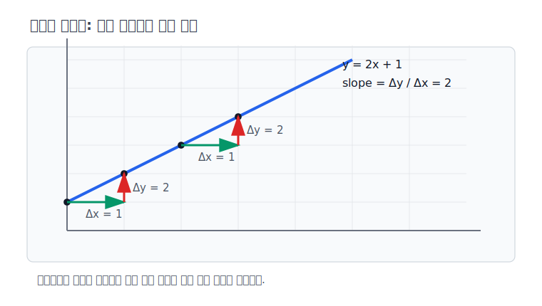
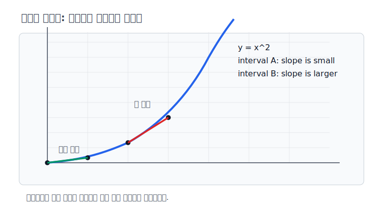

# P2-4.2 변화율(rate of change)과 기울기(slope)

P2-4.1에서는 미분을 배웠던 기억을 다시 꺼냈습니다. 접선의 기울기, 순간 변화율, 거리와 속도, 점에서 부피로 이어지는 흐름은 모두 변화와 누적을 이해하려는 수학적 사고와 연결됩니다.

이제 그 기억을 조금 더 계산 가능한 언어로 좁힙니다. 이 절에서는 “값이 얼마나 변하는가”를 변화율(rate of change)과 기울기(slope)로 읽습니다.

## 이 절의 범위

이 절은 변화율(rate of change), 평균 변화율(average rate of change), 기울기(slope)의 직관을 다룹니다. 도함수(derivative), 그래디언트(gradient), 경사하강법(gradient descent), 역전파(backpropagation)는 다음 절과 이후 장에서 다룹니다.

여기서는 다음 질문에 집중합니다.

> 변화율은 무엇을 비교하는가?
> 기울기는 왜 변화율의 시각적 표현인가?
> 입력 변화와 출력 변화는 어떻게 연결되는가?
> 미분은 왜 기울기에서 시작해서 학습으로 이어지는가?

## 이 절의 목표

- 변화율(rate of change)을 입력 변화에 대한 출력 변화로 설명할 수 있습니다.
- 기울기(slope)를 두 값의 변화 비율로 읽을 수 있습니다.
- 직선의 기울기와 곡선의 기울기가 왜 다르게 느껴지는지 설명할 수 있습니다.
- 평균 변화율이 순간 변화율과 미분으로 이어지는 흐름을 말할 수 있습니다.
- AI 학습에서 미분을 배우는 이유가 “값을 어떻게 바꿀지 판단하기 위해서”라는 점을 이해할 수 있습니다.

## 변화율은 무엇을 비교하는가

변화율(rate of change)은 어떤 값이 다른 값에 따라 얼마나 변하는지 보는 방식입니다.

가장 단순한 예는 시간에 따른 거리입니다.

> 1시간 동안 60km를 이동했다.
> -> 시간 변화: 1시간
> -> 거리 변화: 60km
> -> 변화율: 60km / 1시간 = 시속 60km

수식으로 쓰면 다음과 같습니다.

\[
\text{변화율} = \frac{\text{출력의 변화}}{\text{입력의 변화}}
\]

함수(function) 문맥에서는 입력을 \(x\), 출력을 \(f(x)\)로 두고 다음처럼 씁니다.

\[
\frac{\Delta y}{\Delta x}
\]

여기서 \(\Delta\)는 변화량을 뜻합니다. \(\Delta x\)는 입력의 변화이고, \(\Delta y\)는 출력의 변화입니다.

이 표기는 “출력값이 얼마나 변했는가”만 보지 않습니다. 반드시 “입력이 얼마나 변했을 때 출력이 얼마나 변했는가”를 함께 봅니다.

## 기울기는 변화율을 그림으로 읽는 방법이다

기울기(slope)는 그래프에서 변화율을 보는 방법입니다.

예를 들어 다음 함수가 있다고 하겠습니다.

\[
y = 2x + 1
\]

값을 표로 보면 다음과 같습니다.

| \(x\) | \(y = 2x + 1\) |
| --- | --- |
| 0 | 1 |
| 1 | 3 |
| 2 | 5 |
| 3 | 7 |

\(x\)가 1 증가할 때마다 \(y\)는 2 증가합니다. 따라서 변화율은 2입니다.

\[
\frac{\Delta y}{\Delta x} = \frac{2}{1} = 2
\]

이 값이 그래프에서는 기울기입니다. 기울기가 크면 같은 입력 변화에 대해 출력이 더 크게 변합니다. 기울기가 0이면 입력이 변해도 출력이 변하지 않습니다. 기울기가 음수이면 입력이 증가할 때 출력이 감소합니다.

> 기울기가 양수다 -> 입력이 커질수록 출력이 커지는 경향
> 기울기가 0이다 -> 입력이 변해도 출력이 변하지 않는 경향
> 기울기가 음수다 -> 입력이 커질수록 출력이 작아지는 경향

## 직선에서는 기울기가 일정하다

직선(linear function)에서는 기울기가 어디서나 같습니다.

\[
y = 2x + 1
\]

이 함수에서는 \(x\)가 0에서 1로 갈 때도 \(y\)가 2 증가하고, \(x\)가 2에서 3으로 갈 때도 \(y\)가 2 증가합니다.

> x: 0 -> 1, y: 1 -> 3, 변화율 2
> x: 2 -> 3, y: 5 -> 7, 변화율 2

직선은 변화율이 일정하기 때문에 다루기 쉽습니다. 한 구간에서 계산한 기울기가 전체 직선의 기울기와 같습니다.

하지만 많은 현실 문제는 직선처럼 움직이지 않습니다. 처음에는 천천히 변하다가 나중에는 빠르게 변할 수 있고, 어떤 구간에서는 증가하다가 다른 구간에서는 감소할 수 있습니다.

## 곡선에서는 구간에 따라 변화율이 달라진다

다음 함수를 보겠습니다.

\[
y = x^2
\]

값을 표로 보면 다음과 같습니다.

| \(x\) | \(y = x^2\) |
| --- | --- |
| 0 | 0 |
| 1 | 1 |
| 2 | 4 |
| 3 | 9 |

\(x\)가 0에서 1로 갈 때 \(y\)는 1 증가합니다.

\[
\frac{1 - 0}{1 - 0} = 1
\]

\(x\)가 2에서 3으로 갈 때 \(y\)는 5 증가합니다.

\[
\frac{9 - 4}{3 - 2} = 5
\]

같은 함수인데 구간에 따라 변화율이 다릅니다. 이것이 곡선(curve)을 다룰 때 기울기가 더 어려워지는 이유입니다.

> 직선: 어디서 보아도 기울기가 같다.
> 곡선: 어느 구간을 보느냐에 따라 기울기가 달라진다.

## 0차, 1차, n차라는 기억은 어떻게 둘 것인가

미분을 배웠던 기억에는 `0차`, `1차`, `2차`, `n차` 같은 표현도 남아 있을 수 있습니다. 여기서는 미분방정식(differential equation)을 깊게 다루지 않지만, 용어의 방향은 조심해서 잡아둘 필요가 있습니다.

이 절에서 먼저 기억할 표현은 미분의 차수(order of derivative)입니다.

> 0차: 원래 함수 자체를 보는 관점
> 1차: 한 번 미분해서 변화율을 보는 관점
> 2차: 변화율이 다시 어떻게 변하는지 보는 관점
> n차: 여러 번 반복해서 변화의 구조를 보는 관점

거리, 속도, 가속도 예시로 보면 다음처럼 연결됩니다.

> 거리: 시간에 대한 위치 함수
> 속도: 거리의 1차 변화율
> 가속도: 속도의 변화율, 즉 거리의 2차 변화율

반면 미분방정식(differential equation)은 함수와 그 함수의 도함수들이 함께 들어 있는 방정식을 말합니다. 이 절의 목표는 미분방정식을 푸는 것이 아닙니다. 다만 “차수”라는 기억이 있다면, 우선은 `몇 번 변화율을 보느냐`라는 정도로 이해해도 충분합니다.

## 평균 변화율은 구간의 변화다

곡선에서 두 점을 잡아 변화율을 계산하면 평균 변화율(average rate of change)을 얻습니다.

\[
\text{평균 변화율} = \frac{f(b) - f(a)}{b - a}
\]

예를 들어 \(f(x) = x^2\)에서 \(x = 1\)부터 \(x = 3\)까지의 평균 변화율은 다음과 같습니다.

\[
\frac{f(3) - f(1)}{3 - 1}
= \frac{9 - 1}{2}
= 4
\]

이 값은 \(x=1\)과 \(x=3\) 사이 전체 구간을 하나의 직선처럼 보고 계산한 변화율입니다.

그래프에서는 두 점을 잇는 선을 생각할 수 있습니다. 이 선은 곡선을 한 구간에서 대략적으로 읽게 해 줍니다.

## 순간 변화율로 가면 미분이 보인다

평균 변화율은 구간 전체의 변화입니다. 그런데 우리는 때로 특정 지점에서 값이 어떻게 변하고 있는지 알고 싶습니다.

예를 들어 다음 질문은 평균 변화율만으로는 부족합니다.

> 바로 이 순간 속도는 얼마인가?
> 바로 이 지점에서 함수는 올라가고 있는가, 내려가고 있는가?
> 현재 손실(loss)을 줄이려면 파라미터(parameter)를 어느 방향으로 바꿔야 하는가?

이 질문은 특정 지점 근처의 변화율을 묻습니다. 구간을 점점 좁히면 평균 변화율은 특정 지점의 순간 변화율(instantaneous rate of change)에 가까워집니다.

이 흐름이 미분(derivative)으로 이어집니다.

\[
\text{평균 변화율}
\rightarrow
\text{구간을 아주 작게 좁힌 변화율}
\rightarrow
\text{순간 변화율}
\rightarrow
\text{미분}
\]

이 절에서는 여기까지만 기억하면 충분합니다. 미분 계산법은 다음 절에서 다룹니다.

## AI 학습에서 왜 필요한가

AI 모델 학습에서는 보통 손실(loss)을 줄이고 싶어 합니다. 손실은 모델의 예측이 원하는 결과와 얼마나 다른지 나타내는 값입니다.

학습은 대략 다음 질문을 반복합니다.

> 현재 모델의 손실은 얼마인가?
> 파라미터를 조금 바꾸면 손실은 어떻게 변하는가?
> 손실이 줄어드는 방향은 어디인가?
> 얼마나 크게 바꿔야 하는가?

여기서 “조금 바꾸면 값이 어떻게 변하는가”가 변화율의 질문입니다. 이 질문을 여러 파라미터에 대해 계산하면 그래디언트(gradient)로 이어집니다. 그래디언트는 다음 절과 이후 최적화 장에서 다룹니다.

따라서 미분을 배우는 이유는 공식을 외우기 위해서만이 아닙니다. 모델이 더 나은 방향으로 움직이게 하려면, 값이 어느 방향으로 얼마나 변하는지 읽어야 하기 때문입니다.

## 이 절에서 기억할 관점

변화율은 입력 변화에 대한 출력 변화입니다. 기울기는 그 변화율을 그래프에서 읽는 방법입니다.

> 변화율 = 출력 변화 / 입력 변화
> 기울기 = 그래프에서 본 변화율
> 직선 = 기울기가 일정한 경우
> 곡선 = 위치나 구간에 따라 기울기가 달라지는 경우
> 평균 변화율 = 구간 전체의 변화율
> 순간 변화율 = 한 지점 근처의 변화율
> 미분 = 순간 변화율을 다루는 수학적 도구

Part 2의 목적은 미분을 증명하는 것이 아닙니다. AI 문서에서 손실, 기울기, 그래디언트, 최적화라는 말을 만났을 때 “값을 줄이거나 키우기 위해 변화 방향을 읽는 이야기”라고 연결할 수 있으면 됩니다.

## 체크리스트

- 변화율(rate of change)을 입력 변화에 대한 출력 변화로 설명할 수 있다.
- \(\Delta x\), \(\Delta y\)가 각각 입력 변화와 출력 변화를 뜻한다는 것을 설명할 수 있다.
- 기울기(slope)가 그래프에서 변화율을 나타낸다는 점을 설명할 수 있다.
- 직선에서는 기울기가 일정하고, 곡선에서는 구간에 따라 변화율이 달라질 수 있음을 설명할 수 있다.
- 평균 변화율(average rate of change)이 두 점 사이의 변화율임을 설명할 수 있다.
- 순간 변화율(instantaneous rate of change)이 미분으로 이어진다는 흐름을 설명할 수 있다.
- AI 학습에서 변화율이 손실을 줄이는 방향을 찾는 문제로 연결됨을 설명할 수 있다.

## 출처와 참고 자료

- OpenStax, [Calculus Volume 1, 3.1 Defining the Derivative](https://openstax.org/books/calculus-volume-1/pages/3-1-defining-the-derivative){: target="_blank" rel="noopener noreferrer" }, 확인 날짜: 2026-06-24.
