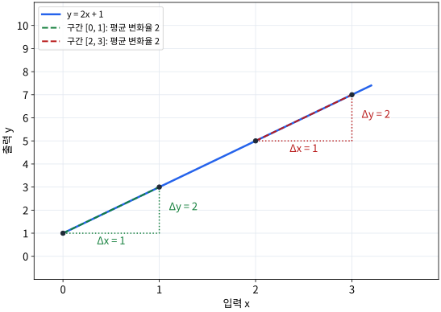
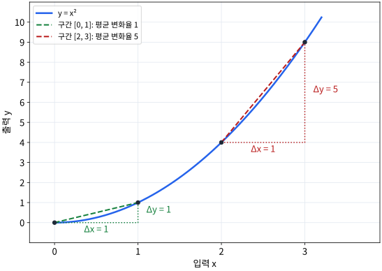

# P2-4.2 변화율(rate of change)과 기울기(slope)

> Section ID: `P2-4.2`
> Version: `v2026.09.08`

변화율(rate of change)은 출력의 변화량을 입력의 변화량으로 나눈 값입니다. 같은 출력 변화라도 입력이 얼마나 바뀌었는지에 따라 변화율은 달라집니다.

## 변화량과 변화율

| 기준 | 왜 중요한가 |
| --- | --- |
| 변화율은 입력 변화 대비 출력 변화다 | 출력만 보는 것이 아니라 입력이 얼마나 바뀌었는지 함께 봐야 의미가 생기기 때문입니다. |
| 기울기는 변화율의 시각적 표현이다 | 그래프에서 증가, 감소, 민감도를 빠르게 읽게 해 주기 때문입니다. |
| 평균 변화율은 순간 변화율로 좁혀진다 | 곡선에서 한 점 근처의 변화를 읽으려면 구간을 점점 줄여야 하기 때문입니다. |

## 출력 변화와 입력 변화

변화율(rate of change)은 어떤 값이 다른 값에 따라 얼마나 변하는지 보는 방식입니다.

가장 단순한 예는 시간에 따른 거리입니다.

1. 1시간 동안 60km를 이동했습니다.
2. 시간 변화는 1시간입니다.
3. 거리 변화는 60km입니다.
4. 따라서 변화율은 `60km / 1시간`, 즉 시속 60km입니다.

수식으로 쓰면 다음과 같습니다.

\[
\text{변화율} = \frac{\text{출력의 변화}}{\text{입력의 변화}}
\]

함수(function) 문맥에서는 입력을 \(x\), 출력을 \(f(x)\)로 두고 다음처럼 씁니다.

\[
\frac{\Delta y}{\Delta x}
\]

여기서 \(\Delta\)는 변화량을 뜻합니다. \(\Delta x\)는 입력의 변화이고, \(\Delta y\)는 출력의 변화입니다.

이 표기는 “출력값이 얼마나 변했는가”만 보지 않습니다. 반드시 “입력이 얼마나 변했을 때 출력이 얼마나 변했는가”를 함께 봅니다.

## 그래프의 기울기

기울기(slope)는 그래프에서 변화율을 보는 방법입니다.

예를 들어 다음 함수가 있다고 하겠습니다.

\[
y = 2x + 1
\]

값을 표로 보면 다음과 같습니다.

| \(x\) | \(y = 2x + 1\) |
| --- | --- |
| 0 | 1 |
| 1 | 3 |
| 2 | 5 |
| 3 | 7 |

\(x\)가 1 증가할 때마다 \(y\)는 2 증가합니다. 따라서 변화율은 2입니다.

\[
\frac{\Delta y}{\Delta x} = \frac{2}{1} = 2
\]

이 값이 그래프에서는 기울기입니다. 기울기의 절댓값이 크면 같은 입력 변화에 대해 출력이 더 크게 변합니다. 기울기가 0이면 입력이 변해도 출력이 변하지 않습니다. 기울기가 음수이면 입력이 증가할 때 출력이 감소합니다.

1. 기울기가 양수면 입력이 커질수록 출력이 커지는 경향을 뜻합니다.
2. 기울기가 0이면 입력이 변해도 출력이 변하지 않는 경향을 뜻합니다.
3. 기울기가 음수면 입력이 커질수록 출력이 작아지는 경향을 뜻합니다.

## 직선의 일정한 기울기

직선(linear function)에서는 기울기가 어디서나 같습니다.

\[
y = 2x + 1
\]

이 함수에서는 \(x\)가 0에서 1로 갈 때도 \(y\)가 2 증가하고, \(x\)가 2에서 3으로 갈 때도 \(y\)가 2 증가합니다.

1. x가 0에서 1로 갈 때 y는 1에서 3으로 가고 변화율은 2입니다.
2. x가 2에서 3으로 갈 때 y는 5에서 7으로 가고 변화율도 2입니다.

직선은 변화율이 일정하기 때문에 다루기 쉽습니다. 한 구간에서 계산한 기울기가 전체 직선의 기울기와 같습니다.

하지만 많은 현실 문제는 직선처럼 움직이지 않습니다. 천천히 변하다가 나중에는 빠르게 변할 수 있고, 어떤 구간에서는 증가하다가 다른 구간에서는 감소할 수 있습니다.

## 곡선의 구간별 변화율

다음 함수를 보겠습니다.

\[
y = x^2
\]

값을 표로 보면 다음과 같습니다.

| \(x\) | \(y = x^2\) |
| --- | --- |
| 0 | 0 |
| 1 | 1 |
| 2 | 4 |
| 3 | 9 |

\(x\)가 0에서 1로 갈 때 \(y\)는 1 증가합니다.

\[
\frac{1 - 0}{1 - 0} = 1
\]

\(x\)가 2에서 3으로 갈 때 \(y\)는 5 증가합니다.

\[
\frac{9 - 4}{3 - 2} = 5
\]

같은 함수인데 구간에 따라 변화율이 다릅니다. 이것이 곡선(curve)을 다룰 때 기울기가 더 어려워지는 이유입니다.

1. 직선은 어디서 보아도 기울기가 같습니다.
2. 곡선은 어느 구간을 보느냐에 따라 기울기가 달라집니다.

## 미분의 차수

미분의 차수(order of derivative)는 미분을 몇 번 했는지를 나타냅니다.

1. 0차는 원래 함수 자체입니다.
2. 1차는 한 번 미분한 도함수입니다.
3. 2차는 도함수를 다시 미분한 함수입니다.
4. n차는 미분을 n번 반복한 결과입니다.

시간에 따른 위치 함수에서는 1차 도함수가 속도, 2차 도함수가 가속도입니다. 함수와 도함수가 함께 들어 있는 방정식은 미분방정식(differential equation)이라고 부릅니다.

## 두 점 사이의 평균 변화율

곡선에서 두 점을 잡아 변화율을 계산하면 평균 변화율(average rate of change)을 얻습니다.

\[
\text{평균 변화율} = \frac{f(b) - f(a)}{b - a}
\]

예를 들어 \(f(x) = x^2\)에서 \(x = 1\)부터 \(x = 3\)까지의 평균 변화율은 다음과 같습니다.

\[
\frac{f(3) - f(1)}{3 - 1}
= \frac{9 - 1}{2}
= 4
\]

이 값은 \(x=1\)과 \(x=3\) 사이 전체 구간을 하나의 직선처럼 보고 계산한 변화율입니다.

그래프에서는 두 점을 잇는 선을 생각할 수 있습니다. 이 선은 곡선을 한 구간에서 대략적으로 읽게 해 줍니다.

## 한 지점의 순간 변화율

평균 변화율은 구간 전체의 변화입니다. 그런데 우리는 때로 특정 지점에서 값이 어떻게 변하고 있는지 알고 싶습니다.

예를 들어 다음 질문은 평균 변화율만으로는 부족합니다.

1. 바로 이 순간 속도는 얼마인가?
2. 바로 이 지점에서 함수는 올라가고 있는가, 내려가고 있는가?
3. 현재 손실(loss)을 줄이려면 파라미터(parameter)를 어느 방향으로 바꿔야 하는가?

이 질문은 특정 지점 근처의 변화율을 묻습니다. 구간을 점점 좁혔을 때 평균 변화율이 한 값으로 수렴하면, 그 값이 해당 지점의 순간 변화율(instantaneous rate of change)입니다.

이 흐름이 미분(derivative)으로 이어집니다.

\[
\text{평균 변화율}
\rightarrow
\text{구간을 아주 작게 좁힌 변화율}
\rightarrow
\text{순간 변화율}
\rightarrow
\text{미분}
\]

## 손실 기울기와 조정 방향

AI 모델 학습에서는 보통 손실(loss)을 줄이고 싶어 합니다. 손실은 모델의 예측이 원하는 결과와 얼마나 다른지 나타내는 값입니다.

학습은 대략 다음 질문을 반복합니다.

1. 현재 모델의 손실은 얼마인가?
2. 파라미터를 조금 바꾸면 손실은 어떻게 변하는가?
3. 손실이 줄어드는 방향은 어디인가?
4. 얼마나 크게 바꿔야 하는가?

여기서 “조금 바꾸면 값이 어떻게 변하는가”가 변화율의 질문입니다. 이 질문을 여러 파라미터에 대해 계산하면 그래디언트(gradient)로 이어집니다.

한 파라미터에 대한 손실 기울기가 양수라면, 그 파라미터를 충분히 조금 늘릴 때 손실이 커지고 조금 줄일 때 손실이 작아집니다.

## 광고비 구간별 가입자 변화

다음은 광고비와 가입자 수를 비교하기 위해 만든 예시 기록입니다.

| 주차 | 광고비 | 가입자 수 |
| --- | --- | --- |
| 1주 | 100만 원 | 50명 |
| 2주 | 200만 원 | 60명 |
| 3주 | 300만 원 | 62명 |

1주에서 2주로 갈 때의 변화율은 `(60 − 50) / (200 − 100) = 0.1명/만 원`입니다. 2주에서 3주로 갈 때는 `(62 − 60) / (300 − 200) = 0.02명/만 원`입니다. 같은 100만 원 증가에 대응한 가입자 증가분이 10명에서 2명으로 줄었습니다.

두 값은 각각의 구간에서 구한 평균 변화율입니다. 이 세 기록만으로 특정 광고비에서의 순간 변화율을 알 수는 없습니다. 주차별 다른 조건도 달라질 수 있으므로, 광고비가 가입자 증가를 일으킨 효과로 바로 해석하지도 않습니다.

## 체크리스트

- 변화율(rate of change)을 입력 변화에 대한 출력 변화로 설명할 수 있다.
- \(\Delta x\), \(\Delta y\)가 각각 입력 변화와 출력 변화를 뜻한다는 것을 설명할 수 있다.
- 기울기(slope)가 그래프에서 변화율을 나타낸다는 점을 설명할 수 있다.
- 직선에서는 기울기가 일정하고, 곡선에서는 구간에 따라 변화율이 달라질 수 있음을 설명할 수 있다.
- 평균 변화율(average rate of change)이 두 점 사이의 변화율임을 설명할 수 있다.
- 순간 변화율(instantaneous rate of change)이 미분으로 이어진다는 흐름을 설명할 수 있다.
- AI 학습에서 변화율이 손실을 줄이는 방향을 찾는 문제로 연결됨을 설명할 수 있다.
- 값의 크기와 `입력이 얼마나 바뀌었을 때 출력이 얼마나 바뀌었는가`를 구분해 읽을 수 있다.
- 평균 변화율에서 순간 변화율로 왜 좁혀 가는지 설명할 수 있다.

## 출처와 참고 자료

- OpenStax, [Calculus Volume 1, 3.1 Defining the Derivative](https://openstax.org/books/calculus-volume-1/pages/3-1-defining-the-derivative){: target="_blank" rel="noopener noreferrer" }, 할선 기울기, 접선 기울기, 평균 속도와 순간 속도, 순간 변화율 정의를 확인할 수 있습니다. 확인 날짜: 2026-07-20.
