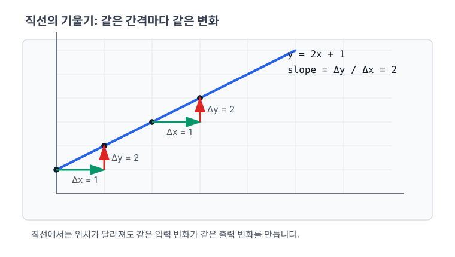
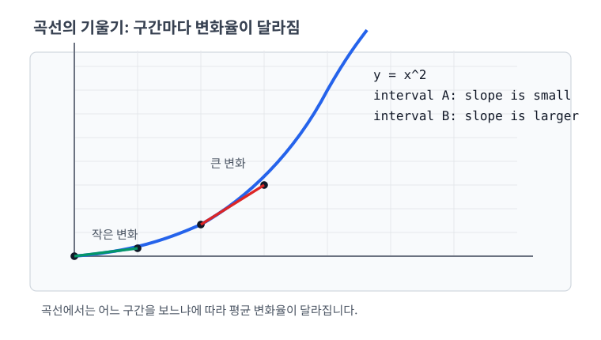

# P2-4.2 변화율(rate of change)과 기울기(slope)

> Section ID: `P2-4.2`
> Version: `v2026.07.07`

P2-4.1에서는 미분을 배웠던 기억을 다시 꺼냈습니다. 접선의 기울기, 순간 변화율, 거리와 속도, 점에서 부피로 이어지는 흐름은 모두 변화와 누적을 이해하려는 수학적 사고와 연결됩니다.

이제 그 기억을 조금 더 계산 가능한 언어로 좁힙니다. 여기서는 “값이 얼마나 변하는가”를 변화율(rate of change)과 기울기(slope)로 읽습니다.

여기서는 `변화율(rate of change)`, `기울기(slope)`, `평균 변화율(average rate of change)`, `순간 변화율(instantaneous rate of change)`, `곡선(curve)`을 다시 정리합니다. 4.1에서 미분을 질문으로 다시 꺼냈다면, 이제 그 질문을 구간과 한 점의 변화 비교로 더 구체화합니다.

여기서는 도함수 공식을 바로 계산하기보다 구간의 변화율에서 한 점 근처의 변화율로 시야를 좁히는 데 집중합니다. 변화율, 기울기, 평균 변화율, 순간 변화율의 연결을 잡아 두면, 뒤에서 손실(loss)을 줄이는 방향과 그래디언트(gradient)를 읽을 때 왜 `조금 바꾸면 얼마나 달라지는가`를 먼저 묻는지 바로 연결됩니다.

| 지금 이 절에서 잡을 것 | 바로 다음에 이어질 질문 | 이후 다시 쓰이는 위치 |
| --- | --- | --- |
| 변화율이 입력 변화 대비 출력 변화라는 점 | `P2-4.3`에서 순간 변화율과 미분 표기를 더 직접 봅니다. | `P2-6.1`, `P2-6.2`, `P2-6.3`에서 손실이 얼마나 줄어드는지 읽을 때 다시 씁니다. |
| 평균 변화율과 순간 변화율의 차이 | `P2-4.3`에서 도함수 표기와 접선 의미로 이어집니다. | Part 4의 gradient, 역전파, 최적화 설명으로 이어집니다. |
| 기울기가 변화 방향을 읽게 해 준다는 점 | 이어지는 예시에서 구간별 반응 차이를 더 구체화합니다. | 모델 학습에서 파라미터를 어느 방향으로 바꿀지 해석할 때 다시 등장합니다. |

## 이 절의 범위

여기서는 변화율(rate of change), 평균 변화율(average rate of change), 기울기(slope)의 직관을 다룹니다. 도함수(derivative), 그래디언트(gradient), 경사하강법(gradient descent), 역전파(backpropagation)는 다음 절과 이후 장에서 다룹니다.

여기서는 다음 네 질문에 집중합니다.

1. 변화율은 무엇을 비교하는가?
2. 기울기는 왜 변화율의 시각적 표현인가?
3. 입력 변화와 출력 변화는 어떻게 연결되는가?
4. 미분은 왜 기울기에서 시작해서 학습으로 이어지는가?

| 용어 | 아주 짧은 뜻 | 이 절에서의 역할 |
| --- | --- | --- |
| 변화율 | 입력 변화 대비 출력 변화 | 이 절의 중심 질문 |
| 기울기 | 변화율을 그래프에서 읽는 값 | 시각적 해석의 기준 |
| 평균 변화율 | 구간 전체의 변화율 | 직선과 곡선 비교의 출발점 |
| 순간 변화율 | 한 점 근처의 변화율 | 미분으로 넘어가는 다리 |
| 곡선 | 구간마다 변화율이 달라질 수 있는 함수 모양 | 미분이 필요한 이유를 보여 주는 대상 |

## 이 절의 목표

- 변화율(rate of change)을 입력 변화에 대한 출력 변화로 설명할 수 있습니다.
- 기울기(slope)를 두 값의 변화 비율로 읽을 수 있습니다.
- 직선의 기울기와 곡선의 기울기가 왜 다르게 느껴지는지 설명할 수 있습니다.
- 평균 변화율이 순간 변화율과 미분으로 이어지는 흐름을 말할 수 있습니다.
- AI 학습에서 미분을 배우는 이유가 “값을 어떻게 바꿀지 판단하기 위해서”라는 점을 이해할 수 있습니다.

## 세 가지 기준

| 기준 | 왜 중요한가 | 이 절에서 필요한 이해 수준 |
| --- | --- |
| 변화율은 입력 변화 대비 출력 변화다 | 출력만 보는 것이 아니라 입력이 얼마나 바뀌었는지 함께 봐야 의미가 생기기 때문입니다. | `출력 변화 / 입력 변화`라는 비교 구조로 이해합니다. |
| 기울기는 변화율의 시각적 표현이다 | 그래프에서 증가, 감소, 민감도를 빠르게 읽게 해 주기 때문입니다. | 기울기를 변화율을 그림 위에서 읽는 값으로 이해합니다. |
| 평균 변화율은 순간 변화율로 좁혀진다 | 곡선에서 한 점 근처의 변화를 읽으려면 구간을 점점 줄여야 하기 때문입니다. | 평균 변화율이 미분으로 이어지는 중간 단계라고 이해합니다. |

## 변화율은 무엇을 비교하는가

변화율(rate of change)은 어떤 값이 다른 값에 따라 얼마나 변하는지 보는 방식입니다.

가장 단순한 예는 시간에 따른 거리입니다.

1. 1시간 동안 60km를 이동했습니다.
2. 시간 변화는 1시간입니다.
3. 거리 변화는 60km입니다.
4. 따라서 변화율은 `60km / 1시간`, 즉 시속 60km입니다.

수식으로 쓰면 다음과 같습니다.

\[
\text{변화율} = \frac{\text{출력의 변화}}{\text{입력의 변화}}
\]

함수(function) 문맥에서는 입력을 \(x\), 출력을 \(f(x)\)로 두고 다음처럼 씁니다.

\[
\frac{\Delta y}{\Delta x}
\]

여기서 \(\Delta\)는 변화량을 뜻합니다. \(\Delta x\)는 입력의 변화이고, \(\Delta y\)는 출력의 변화입니다.

이 표기는 “출력값이 얼마나 변했는가”만 보지 않습니다. 반드시 “입력이 얼마나 변했을 때 출력이 얼마나 변했는가”를 함께 봅니다.

## 기울기는 변화율을 그림으로 읽는 방법이다

기울기(slope)는 그래프에서 변화율을 보는 방법입니다.

예를 들어 다음 함수가 있다고 하겠습니다.

\[
y = 2x + 1
\]

값을 표로 보면 다음과 같습니다.

| \(x\) | \(y = 2x + 1\) |
| --- | --- |
| 0 | 1 |
| 1 | 3 |
| 2 | 5 |
| 3 | 7 |

\(x\)가 1 증가할 때마다 \(y\)는 2 증가합니다. 따라서 변화율은 2입니다.

\[
\frac{\Delta y}{\Delta x} = \frac{2}{1} = 2
\]

이 값이 그래프에서는 기울기입니다. 기울기가 크면 같은 입력 변화에 대해 출력이 더 크게 변합니다. 기울기가 0이면 입력이 변해도 출력이 변하지 않습니다. 기울기가 음수이면 입력이 증가할 때 출력이 감소합니다.

1. 기울기가 양수면 입력이 커질수록 출력이 커지는 경향을 뜻합니다.
2. 기울기가 0이면 입력이 변해도 출력이 변하지 않는 경향을 뜻합니다.
3. 기울기가 음수면 입력이 커질수록 출력이 작아지는 경향을 뜻합니다.

## 직선에서는 기울기가 일정하다

직선(linear function)에서는 기울기가 어디서나 같습니다.

\[
y = 2x + 1
\]

이 함수에서는 \(x\)가 0에서 1로 갈 때도 \(y\)가 2 증가하고, \(x\)가 2에서 3으로 갈 때도 \(y\)가 2 증가합니다.

1. x가 0에서 1로 갈 때 y는 1에서 3으로 가고 변화율은 2입니다.
2. x가 2에서 3으로 갈 때 y는 5에서 7으로 가고 변화율도 2입니다.

직선은 변화율이 일정하기 때문에 다루기 쉽습니다. 한 구간에서 계산한 기울기가 전체 직선의 기울기와 같습니다.

하지만 많은 현실 문제는 직선처럼 움직이지 않습니다. 천천히 변하다가 나중에는 빠르게 변할 수 있고, 어떤 구간에서는 증가하다가 다른 구간에서는 감소할 수 있습니다.

## 곡선에서는 구간에 따라 변화율이 달라진다

다음 함수를 보겠습니다.

\[
y = x^2
\]

값을 표로 보면 다음과 같습니다.

| \(x\) | \(y = x^2\) |
| --- | --- |
| 0 | 0 |
| 1 | 1 |
| 2 | 4 |
| 3 | 9 |

\(x\)가 0에서 1로 갈 때 \(y\)는 1 증가합니다.

\[
\frac{1 - 0}{1 - 0} = 1
\]

\(x\)가 2에서 3으로 갈 때 \(y\)는 5 증가합니다.

\[
\frac{9 - 4}{3 - 2} = 5
\]

같은 함수인데 구간에 따라 변화율이 다릅니다. 이것이 곡선(curve)을 다룰 때 기울기가 더 어려워지는 이유입니다.

1. 직선은 어디서 보아도 기울기가 같습니다.
2. 곡선은 어느 구간을 보느냐에 따라 기울기가 달라집니다.

## 0차, 1차, n차라는 기억은 어떻게 둘 것인가

미분을 배웠던 기억에는 `0차`, `1차`, `2차`, `n차` 같은 표현도 남아 있을 수 있습니다. 여기서는 미분방정식(differential equation)을 깊게 다루지 않지만, 용어의 방향은 조심해서 잡아둘 필요가 있습니다.

여기서 먼저 기억할 표현은 미분의 차수(order of derivative)입니다.

1. 0차는 원래 함수 자체를 보는 관점입니다.
2. 1차는 한 번 미분해서 변화율을 보는 관점입니다.
3. 2차는 변화율이 다시 어떻게 변하는지 보는 관점입니다.
4. n차는 여러 번 반복해서 변화의 구조를 보는 관점입니다.

거리, 속도, 가속도 예시로 보면 다음처럼 연결됩니다.

1. 거리는 시간에 대한 위치 함수입니다.
2. 속도는 거리의 1차 변화율입니다.
3. 가속도는 속도의 변화율, 즉 거리의 2차 변화율입니다.

반면 미분방정식(differential equation)은 함수와 그 함수의 도함수들이 함께 들어 있는 방정식을 말합니다. 여기서는 미분방정식을 푸는 대신, “차수”라는 기억을 `몇 번 변화율을 보느냐`라는 정도로 먼저 정리합니다.

## 평균 변화율은 구간의 변화다

곡선에서 두 점을 잡아 변화율을 계산하면 평균 변화율(average rate of change)을 얻습니다.

\[
\text{평균 변화율} = \frac{f(b) - f(a)}{b - a}
\]

예를 들어 \(f(x) = x^2\)에서 \(x = 1\)부터 \(x = 3\)까지의 평균 변화율은 다음과 같습니다.

\[
\frac{f(3) - f(1)}{3 - 1}
= \frac{9 - 1}{2}
= 4
\]

이 값은 \(x=1\)과 \(x=3\) 사이 전체 구간을 하나의 직선처럼 보고 계산한 변화율입니다.

그래프에서는 두 점을 잇는 선을 생각할 수 있습니다. 이 선은 곡선을 한 구간에서 대략적으로 읽게 해 줍니다.

## 순간 변화율로 가면 미분이 보인다

평균 변화율은 구간 전체의 변화입니다. 그런데 우리는 때로 특정 지점에서 값이 어떻게 변하고 있는지 알고 싶습니다.

예를 들어 다음 질문은 평균 변화율만으로는 부족합니다.

1. 바로 이 순간 속도는 얼마인가?
2. 바로 이 지점에서 함수는 올라가고 있는가, 내려가고 있는가?
3. 현재 손실(loss)을 줄이려면 파라미터(parameter)를 어느 방향으로 바꿔야 하는가?

이 질문은 특정 지점 근처의 변화율을 묻습니다. 구간을 점점 좁히면 평균 변화율은 특정 지점의 순간 변화율(instantaneous rate of change)에 가까워집니다.

이 흐름이 미분(derivative)으로 이어집니다.

\[
\text{평균 변화율}
\rightarrow
\text{구간을 아주 작게 좁힌 변화율}
\rightarrow
\text{순간 변화율}
\rightarrow
\text{미분}
\]

여기서는 평균 변화율이 순간 변화율과 미분으로 이어지는 흐름까지 정리합니다. 미분 계산법은 다음 절에서 다룹니다.

## AI 학습에서 왜 필요한가

AI 모델 학습에서는 보통 손실(loss)을 줄이고 싶어 합니다. 손실은 모델의 예측이 원하는 결과와 얼마나 다른지 나타내는 값입니다.

학습은 대략 다음 질문을 반복합니다.

1. 현재 모델의 손실은 얼마인가?
2. 파라미터를 조금 바꾸면 손실은 어떻게 변하는가?
3. 손실이 줄어드는 방향은 어디인가?
4. 얼마나 크게 바꿔야 하는가?

여기서 “조금 바꾸면 값이 어떻게 변하는가”가 변화율의 질문입니다. 이 질문을 여러 파라미터에 대해 계산하면 그래디언트(gradient)로 이어집니다. 그래디언트는 다음 절과 이후 최적화 장에서 다룹니다.

따라서 미분을 배우는 이유는 공식을 외우기 위해서만이 아닙니다. 모델이 더 나은 방향으로 움직이게 하려면, 값이 어느 방향으로 얼마나 변하는지 읽어야 하기 때문입니다.

## 이 절에서 기억할 관점

변화율은 입력 변화에 대한 출력 변화입니다. 기울기는 그 변화율을 그래프에서 읽는 방법입니다.

1. 변화율은 `출력 변화 / 입력 변화`입니다.
2. 기울기는 그래프에서 본 변화율입니다.
3. 직선은 기울기가 일정한 경우입니다.
4. 곡선은 위치나 구간에 따라 기울기가 달라지는 경우입니다.
5. 평균 변화율은 구간 전체의 변화율입니다.
6. 순간 변화율은 한 지점 근처의 변화율입니다.
7. 미분은 순간 변화율을 다루는 수학적 도구입니다.

Part 2의 목적은 미분을 증명하는 것이 아닙니다. AI 문서에서 손실, 기울기, 그래디언트, 최적화라는 말을 만났을 때 “값을 줄이거나 키우기 위해 변화 방향을 읽는 이야기”라고 연결할 수 있으면 됩니다.

## 사례로 보기

### 사례 1. 광고비가 늘 때 가입자 수는 얼마나 달라지는가

한 서비스 팀이 가입자 수를 늘리기 위해 광고를 집행한다고 하겠습니다. 실무자는 먼저 `이번 주 광고비`, `유입 수`, `가입 완료 수`를 봅니다. 숫자는 바로 확인되지만, 이 숫자만으로는 광고비를 더 써야 하는지 줄여야 하는지 판단하기 어렵습니다.

예를 들어 광고비를 100만 원 늘렸을 때 가입자가 10명 늘었다면, 사람은 `늘긴 늘었네` 정도로 해석할 수 있습니다. 하지만 다음 주에 광고비를 다시 100만 원 늘렸는데 가입자가 2명만 늘었다면, 같은 증가라도 의미는 완전히 다릅니다.

이때 필요한 개념이 변화율입니다. `광고비가 얼마나 늘었을 때 가입자 수가 얼마나 늘었는가`를 함께 봐야 하고, 이 비율을 그래프에서 읽으면 기울기라는 말로 바꿀 수 있습니다. 직선처럼 일정하게 반응하면 해석이 쉽지만, 실제 캠페인은 어느 구간부터 효율이 급격히 떨어질 수 있습니다.

확인 가능한 결과는 주차별 광고비와 가입자 수를 표로 놓고, `광고비 증가분 대비 가입자 증가분`을 계산해 보는 것입니다. 구간마다 이 값이 달라진다면 곡선처럼 반응한다고 읽고, 바로 그 지점에서 평균 변화율과 순간 변화율을 구분합니다.

## 짧은 점검

- 변화율(rate of change)을 입력 변화에 대한 출력 변화로 설명할 수 있다.
- \(\Delta x\), \(\Delta y\)가 각각 입력 변화와 출력 변화를 뜻한다는 것을 설명할 수 있다.
- 기울기(slope)가 그래프에서 변화율을 나타낸다는 점을 설명할 수 있다.
- 직선에서는 기울기가 일정하고, 곡선에서는 구간에 따라 변화율이 달라질 수 있음을 설명할 수 있다.
- 평균 변화율(average rate of change)이 두 점 사이의 변화율임을 설명할 수 있다.
- 순간 변화율(instantaneous rate of change)이 미분으로 이어진다는 흐름을 설명할 수 있다.
- AI 학습에서 변화율이 손실을 줄이는 방향을 찾는 문제로 연결됨을 설명할 수 있다.

## 언제 이 관점을 먼저 떠올려야 하는가

- 표나 그래프를 보면서 값의 크기는 읽히는데 `입력이 얼마나 바뀌었을 때 출력이 얼마나 바뀌었는가`가 아직 분리되지 않을 때 먼저 떠올립니다.
- 직선의 일정한 기울기와 곡선의 구간별 변화율 차이를 한 번에 설명해야 할 때 먼저 떠올립니다.
- 미분을 배우기 전에 평균 변화율에서 순간 변화율로 왜 좁혀 가는지 다시 연결해야 할 때 먼저 떠올립니다.

## 출처와 참고 자료

- OpenStax, [Calculus Volume 1, 3.1 Defining the Derivative](https://openstax.org/books/calculus-volume-1/pages/3-1-defining-the-derivative){: target="_blank" rel="noopener noreferrer" }, 확인 날짜: 2026-06-24.
