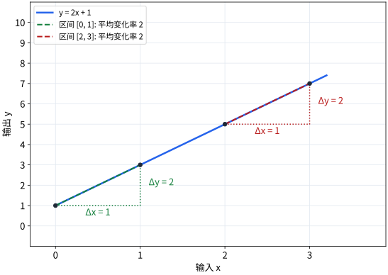
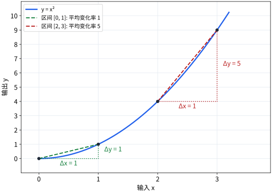

# P2-4.2 变化率(rate of change)与斜率(slope)

> Section ID: `P2-4.2`
> Version: `v2026.07.20`

在 P2-4.1 中，我们重新拿出了当年学习微分时的记忆。切线的斜率、瞬时变化率、距离与速度、从点到体积的流程，都连接着一种试图理解变化与累积的数学思路。

现在，我们把这个记忆收窄成稍微更可计算的语言。这里把“数值变化了多少”读成变化率(rate of change)与斜率(slope)。

本节重新整理 `变化率(rate of change)`、`斜率(slope)`、`平均变化率(average rate of change)`、`瞬时变化率(instantaneous rate of change)`、`曲线(curve)`。如果说 4.1 是把微分重新作为问题拿出来，那么现在就是把这个问题进一步具体化成：区间变化与某一点附近变化的比较。

这里关注的不是立刻去算导函数公式，而是把视角从区间的变化率收窄到一点附近的变化率。只要先抓住变化率、斜率、平均变化率、瞬时变化率之间的连接，后面再读“损失(loss)怎样下降”和“梯度(gradient)”时，就能直接接上为什么要先问 `稍微改一点，会变化多少？`

读者在这里最容易漏掉的点，是把`斜率`只读成图像题然后就结束了。但在学习语境里，斜率其实是在为下面这个问题做准备：`现在如果把这个值稍微改一点，结果会往哪边、变化多少？`

## 核心判断标准：变化率(rate of change)与斜率(slope)

- 你可以把变化率(rate of change)说明成“相对于输入变化的输出变化”。
- 你可以把斜率(slope)读成两个值变化比例。
- 你可以说明为什么直线的斜率与曲线的斜率会让人感觉不同。
- 你可以说出平均变化率如何接到瞬时变化率与微分。
- 你可以理解，在 AI 学习里学微分，是为了`判断数值该怎样改动`。

## 三个判断标准

| 标准 | 为什么重要 | 本节需要达到的理解程度 |
| --- | --- | --- |
| 变化率是相对于输入变化的输出变化 | 如果只看输出而不看输入变了多少，就不会出现真正的意义。 | 理解成 `输出变化 / 输入变化` 这个比较结构。 |
| 斜率是变化率的视觉表达 | 它让我们能在图上快速读出增加、减少、敏感度。 | 理解斜率是在图上读取变化率的值。 |
| 平均变化率会收窄成瞬时变化率 | 因为想读曲线某一点附近的变化，就必须把区间越缩越小。 | 理解平均变化率是通向微分的中间阶段。 |

## 变化率在比较什么

变化率(rate of change)是一种看法，用来观察一个值相对于另一个值变化了多少。

最简单的例子就是时间与距离。

1. 1 小时内走了 60 km。
2. 时间变化是 1 小时。
3. 距离变化是 60 km。
4. 所以变化率是 `60 km / 1 小时`，也就是时速 60 km。

写成公式就是下面这样。

\[
\text{变化率} = \frac{\text{输出的变化}}{\text{输入的变化}}
\]

在函数(function)语境里，我们把输入写成 \(x\)，把输出写成 \(f(x)\)，于是也会这样写。

\[
\frac{\Delta y}{\Delta x}
\]

这里的 \(\Delta\) 表示变化量。\(\Delta x\) 是输入变化，\(\Delta y\) 是输出变化。

这个记号并不只是在看`输出到底变了多少？` 它一定会把`输入变了多少时，输出变了多少？`放在一起看。

## 斜率是把变化率画成图之后的读法

斜率(slope)是我们在图像上读取变化率的方法。

例如，假设有下面这个函数。

\[
y = 2x + 1
\]

把数值写成表后如下。

| \(x\) | \(y = 2x + 1\) |
| --- | --- |
| 0 | 1 |
| 1 | 3 |
| 2 | 5 |
| 3 | 7 |

每当 \(x\) 增加 1，\(y\) 就增加 2。所以变化率是 2。

\[
\frac{\Delta y}{\Delta x} = \frac{2}{1} = 2
\]

这个值在图上就是斜率。斜率越大，同样的输入变化对应的输出变化就越大。斜率为 0 时，输入变了输出也不变。斜率为负时，输入增加，输出反而减少。

1. 如果斜率是正的，就表示输入变大时输出也倾向于变大。
2. 如果斜率是 0，就表示输入变了，输出也倾向于不变。
3. 如果斜率是负的，就表示输入变大时输出反而倾向于变小。

## 在直线里，斜率是固定的

在直线(linear function)里，斜率处处都一样。

\[
y = 2x + 1
\]

在这个函数里，\(x\) 从 0 到 1 时，\(y\) 增加 2；\(x\) 从 2 到 3 时，\(y\) 也增加 2。

1. 当 x 从 0 到 1 时，y 从 1 到 3，变化率是 2。
2. 当 x 从 2 到 3 时，y 从 5 到 7，变化率也还是 2。

直线容易处理，就是因为它的变化率恒定。在一个区间里算出的斜率，也就是整条直线的斜率。

但很多真实问题并不像直线那样运动。它们可能一开始变化很慢，后来变快；也可能在某些区间增加，在另一些区间减少。

## 在曲线里，变化率会随着区间不同而改变

来看下面这个函数。

\[
y = x^2
\]

把数值写成表后如下。

| \(x\) | \(y = x^2\) |
| --- | --- |
| 0 | 0 |
| 1 | 1 |
| 2 | 4 |
| 3 | 9 |

当 \(x\) 从 0 到 1 时，\(y\) 增加 1。

\[
\frac{1 - 0}{1 - 0} = 1
\]

当 \(x\) 从 2 到 3 时，\(y\) 增加 5。

\[
\frac{9 - 4}{3 - 2} = 5
\]

明明是同一个函数，但变化率会随着区间不同而不同。这就是为什么一旦处理曲线(curve)，斜率就会变得更难。

1. 直线无论从哪里看，斜率都一样。
2. 曲线会随着你看的是哪个区间，而出现不同的斜率。

## 该怎样保留 0 阶、1 阶、n 阶的记忆

关于学微分的记忆里，也可能会留下 `0 阶`、`1 阶`、`2 阶`、`n 阶` 这样的表达。这里不会深入讲微分方程(differential equation)，但有必要先把术语方向抓稳。

这里首先要记住的是导数的阶数(order of derivative)。

1. 0 阶是看原函数本身的视角。
2. 1 阶是微分一次，看变化率的视角。
3. 2 阶是再去看变化率本身怎样变化的视角。
4. n 阶是多次重复这个动作，去观察变化结构的视角。

如果借用距离、速度、加速度的例子，可以接成下面这样。

1. 距离是关于时间的位置函数。
2. 速度是距离的一阶变化率。
3. 加速度是速度的变化率，也就是距离的二阶变化率。

相对地，微分方程(differential equation)指的是函数与它的导数一起出现在一个方程里。这里我们不会去解微分方程，而只是先把关于“阶数”的记忆整理成：`我们是在第几次看变化率？`

## 平均变化率是区间上的变化

如果在曲线上抓两个点来计算变化率，就会得到平均变化率(average rate of change)。

\[
\text{平均变化率} = \frac{f(b) - f(a)}{b - a}
\]

例如，在 \(f(x) = x^2\) 里，从 \(x = 1\) 到 \(x = 3\) 的平均变化率如下。

\[
\frac{f(3) - f(1)}{3 - 1}
= \frac{9 - 1}{2}
= 4
\]

这个值表示：把 \(x=1\) 到 \(x=3\) 的整个区间，当成一条直线来读时得到的变化率。

在图像上，我们可以想象一条连接这两个点的线。它能帮助我们粗略地读取这条曲线在一个区间上的变化。

## 当我们走向瞬时变化率时，就会看到微分

平均变化率描述的是整个区间上的变化。但有时候，我们想知道的是某一个特定点上，数值正在怎样变化。

例如，仅靠平均变化率还不足以回答下面这些问题。

1. 就在这一刻，速度是多少？
2. 就在这一点上，函数是在上升还是在下降？
3. 如果想减小当前损失(loss)，参数(parameter)应该往哪个方向调整？

这些问题问的是某个特定点附近的变化率。只要把区间越缩越小，平均变化率就会越来越接近该点的瞬时变化率(instantaneous rate of change)。

这条流程会接到微分(derivative)。

\[
\text{平均变化率}
\rightarrow
\text{非常小区间上的变化率}
\rightarrow
\text{瞬时变化率}
\rightarrow
\text{微分}
\]

这里我们先整理到“平均变化率如何接到瞬时变化率与微分”这一条流程。导数的计算方法会在下一节处理。

## 以学习来读取的一条短判断流程

如果把“为什么变化率与斜率会接到学习”再压缩一次，就会变成下面这样。

| 场景 | 先看什么值 | 接着问什么问题 | 学习上的连接 |
| --- | --- | --- | --- |
| 直线 | 斜率是不是固定的 | 输入增加时，输出会增加多少？ | 读取简单关系的起点 |
| 曲线 | 斜率会不会随区间改变 | 在当前位置它有多敏感？ | 在损失曲线上读取当前位置的感觉 |
| 平均变化率 | 整个区间总共变了多少 | 整体流程是什么？ | 把多个 step 合在一起看的视角 |
| 瞬时变化率 | 就在这一点变化多少 | 现在应该往哪里移动？ | 为梯度与更新方向做准备 |

也就是说，`在图上读斜率` 这句话，后面会变成 `为了减小损失，应该往哪个方向移动` 这句话。

## 为什么这在 AI 学习里是必要的

在 AI 模型学习中，我们通常想减小损失(loss)。损失是用来表示模型预测和想要结果之间差了多少的值。

学习大致会重复下面这些问题。

1. 当前模型的损失是多少？
2. 如果把某个参数稍微改一点，损失会怎么变？
3. 哪个方向会让损失下降？
4. 应该改多大？

这里的 `稍微改一点，值会怎么变？` 正是变化率的问题。把这个问题对很多参数一起计算，就会连到梯度(gradient)。梯度会在下一节和后面的优化章节里处理。

所以，学习微分并不是只为了背公式。真正原因是：如果想让模型往更好的方向移动，就必须读懂数值会朝哪个方向、变化多少。

例如，在损失曲线的某个点上，如果斜率为正，我们就可以读成：沿着这个方向再走，损失很可能会变大。反过来，如果想减小损失，就会先怀疑反方向。这种解释感会直接接到下一节的微分记号，以及 Chapter 6 的梯度下降。

## 用案例来看

### 案例 1. 广告费增加时，注册人数会变化多少？

假设一个服务团队为了增加注册人数而投放广告。实务人员会先看 `本周广告费`、`流入人数`、`完成注册人数`。这些数字可以立刻确认，但光看这些数字，仍然很难判断广告费到底该增加还是减少。

例如，当广告费增加 100 万韩元时，注册人数增加了 10 人，人可能会先解释成 `确实增加了`。但如果下一周广告费再增加 100 万韩元，注册人数却只增加了 2 人，那么虽然同样都在增加，意义已经完全不同。

这时需要的概念就是变化率。我们必须把`广告费增加了多少时，注册人数增加了多少`放在一起看；如果把这个比率读到图像上，它就可以换个名字叫做斜率。如果反应像直线那样保持稳定，解释会比较容易；但真实广告活动常常会在某个区间之后效率突然下降。

可以确认的结果是：把每周广告费与注册人数放进表格里，再计算 `相对于广告费增加量的注册人数增加量`。如果这个值会随着区间不同而改变，就把它读成像曲线那样的反应；也正是在这里，需要区分平均变化率和瞬时变化率。

## 检查清单

- 你可以把变化率(rate of change)解释成相对于输入变化的输出变化。
- 你可以说明 \(\Delta x\)、\(\Delta y\) 分别表示输入变化与输出变化。
- 你可以说明斜率(slope)是在图像上表示变化率。
- 你可以说明直线里的斜率固定，而曲线里的变化率会随着区间不同而变化。
- 你可以说明平均变化率(average rate of change)是两个点之间的变化率。
- 你可以说明瞬时变化率(instantaneous rate of change)如何接到微分。
- 你可以说明，在 AI 学习里，变化率会接到“寻找让损失下降的方向”这个问题。
- 你可以区分值的大小和`输入变化了多少时输出变化了多少`。
- 你可以说明为什么要从平均变化率逐渐收窄到瞬时变化率。

## 来源与参考资料

- OpenStax, [Calculus Volume 1, 3.1 Defining the Derivative](https://openstax.org/books/calculus-volume-1/pages/3-1-defining-the-derivative){: target="_blank" rel="noopener noreferrer" }。可以确认割线斜率、切线斜率、平均速度与瞬时速度、瞬时变化率定义。确认日期: 2026-07-20.
