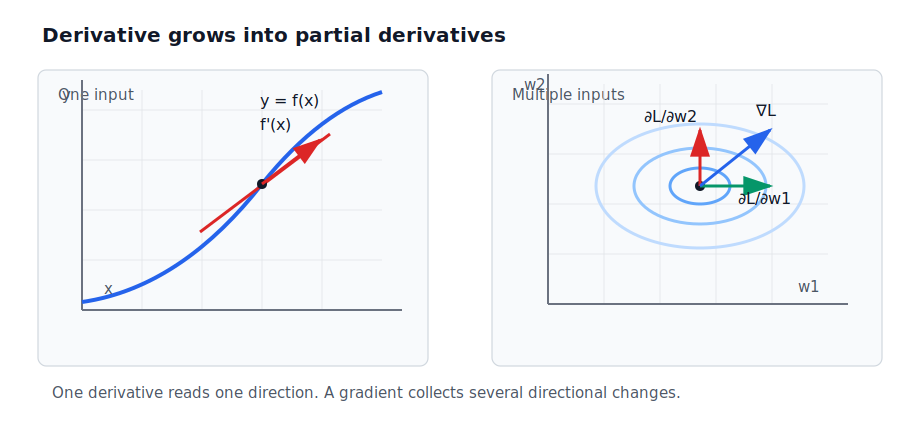
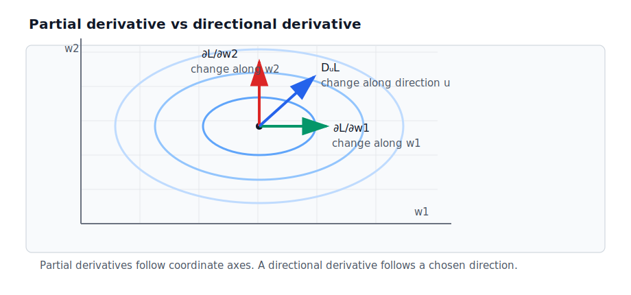
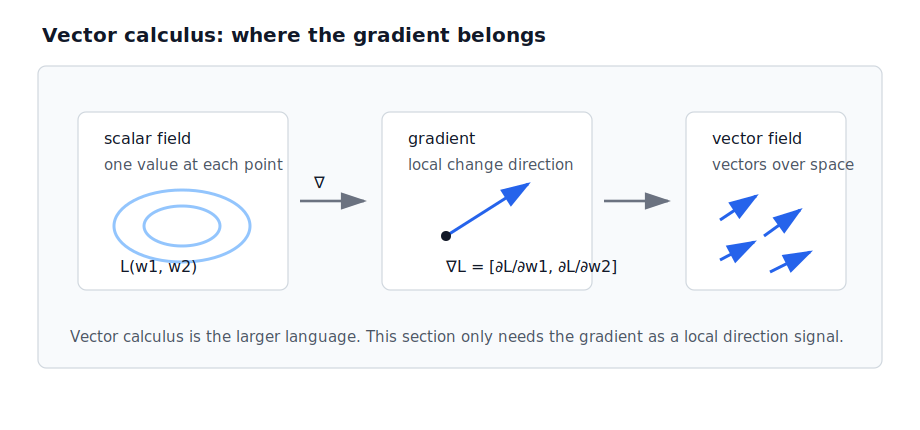
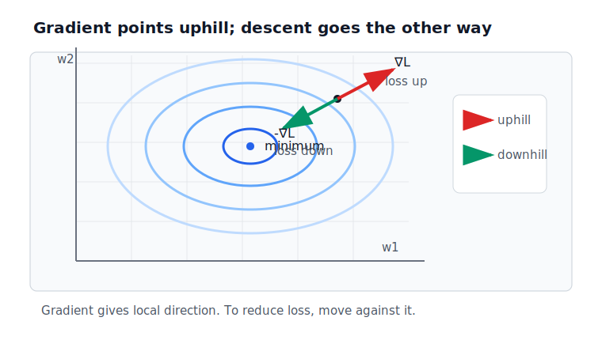
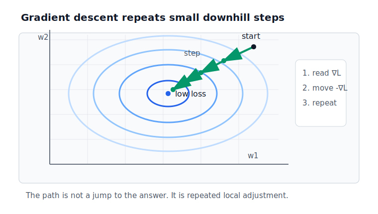
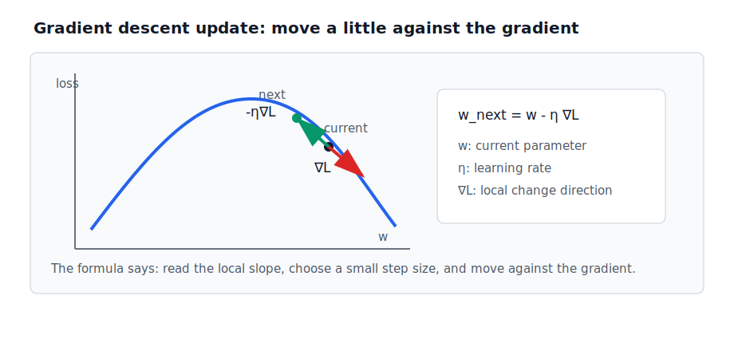
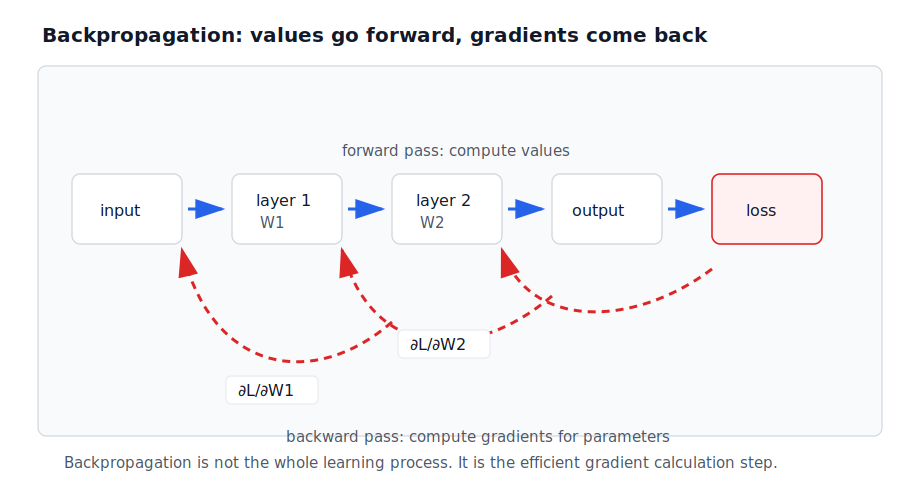

# P2-4.5 그래디언트 보충수업: 고등학교 미분에서 다변수 미분으로

P2-4.3에서는 미분(derivative), 편미분(partial derivative), 그래디언트(gradient)를 연결했고, P2-4.4에서는 미분이 학습(training)에서 왜 필요한지 봤습니다.

이 절은 고등학교 미분 기억에서 그래디언트로 넘어갈 때 생기는 낯섦을 줄이기 위한 보충수업입니다. 분량은 조금 길지만, 목적은 하나입니다. AI 학습 문서에서 반복해서 만나는 `gradient`, `gradient descent`, `backpropagation`이라는 말을 처음부터 계산 공식으로 밀어붙이지 않고, 무엇을 보려는 개념인지 먼저 잡는 것입니다.

> 한 변수 함수의 미분
> -> 한 방향의 변화율
>
> 여러 변수 함수의 그래디언트
> -> 여러 방향의 변화율 묶음
>
> 경사하강법
> -> 그 묶음을 참고해 손실을 줄이는 반복 방법

## 먼저 정의부터 잡기

이 보충수업에서는 엄밀한 대학 수학 정의보다, AI 학습 문서를 읽기 위한 작업용 정의를 먼저 둡니다. 이후 설명과 차트는 이 정의를 조금씩 풀어 가는 방식으로 읽으면 됩니다.

| 용어 | 작업용 정의 |
| --- | --- |
| 미분(derivative) | 입력 하나를 아주 조금 바꿨을 때 출력이 얼마나 변하는지 나타내는 변화율 |
| 편미분(partial derivative) | 입력이 여러 개일 때, 그중 하나만 바꿨다고 보고 계산한 변화율 |
| 방향도함수(directional derivative) | 특정 방향으로 조금 움직였을 때 함수값이 얼마나 변하는지 나타내는 변화율 |
| 그래디언트(gradient) | 여러 편미분을 순서 있게 모은 벡터 |
| 벡터해석(vector calculus) | 벡터, 함수, 변화율을 공간 위에서 함께 다루는 수학 체계 |
| 손실(loss) | 모델의 현재 결과가 목표와 얼마나 다른지 나타내는 값 |
| 경사하강법(gradient descent) | 그래디언트를 이용해 손실이 줄어드는 방향으로 파라미터를 조금씩 바꾸는 반복 방법 |
| 역전파(backpropagation) | 딥러닝 모델에서 각 파라미터의 그래디언트를 효율적으로 계산하는 절차 |

짧게 말하면 다음과 같습니다.

> 미분
> -> 한 방향에서 얼마나 변하는지 본다.
>
> 편미분
> -> 여러 방향 중 하나씩 따로 본다.
>
> 방향도함수
> -> 내가 고른 방향으로 변화를 본다.
>
> 그래디언트
> -> 그 변화율들을 한 묶음으로 모은다.
>
> 경사하강법
> -> 그 묶음을 참고해 손실이 줄어드는 쪽으로 조금씩 이동한다.
>
> 역전파
> -> 그 묶음을 딥러닝 모델 안에서 효율적으로 계산한다.

여기서 중요한 점은 그래디언트가 “정답”이 아니라는 것입니다. 그래디언트는 현재 위치에서의 변화 방향을 알려 주는 정보입니다. 경사하강법은 그 정보를 이용해 더 나은 위치로 이동하려는 방법입니다. 역전파는 딥러닝 모델 안에서 그 정보를 계산하는 절차입니다.

> 그래디언트
> -> 현재 위치의 방향 정보
>
> 경사하강법
> -> 방향 정보를 이용한 반복 이동 방법
>
> 역전파
> -> 방향 정보를 효율적으로 구하는 계산 절차

이 구분을 먼저 잡아 두면 뒤의 설명이 덜 헷갈립니다.

## 이 절의 범위

이 절은 고등학교 미분 기억에서 그래디언트로 넘어가는 다리 역할을 합니다.

다음 내용은 분량이 커서 이 절에서 깊게 다루기 어렵습니다.

- 편미분(partial derivative)의 엄밀한 계산
- 방향도함수(directional derivative)의 공식
- 벡터해석(vector calculus)의 전체 체계
- 경사하강법(gradient descent)의 업데이트 공식
- 역전파(backpropagation)의 계산 절차

다만 위 개념을 이름만 남기고 넘기지는 않습니다. 이 절에서는 고등학생 수준에서 이해할 수 있는 정의, 비유, 학습 순서, 차트를 제공합니다. 계산을 깊게 하지 않는다는 뜻이지, 개념을 설명하지 않는다는 뜻은 아닙니다.

이 절에서는 다음 질문에 집중합니다.

> 왜 그래디언트가 낯설게 느껴지는가?
> 한 변수 미분과 다변수 미분은 무엇이 다른가?
> 편미분과 방향도함수는 무엇을 다르게 보는가?
> 그래디언트와 경사하강법은 어떻게 연결되는가?
> 역전파는 왜 나중에 등장하는가?

## 어떻게 공부하면 좋을까

이 절은 다음 순서로 읽으면 됩니다.

> 1. 미분을 한 방향의 변화율로 다시 떠올린다.
> 2. 입력이 여러 개일 때는 방향도 여러 개가 된다고 생각한다.
> 3. 편미분은 그 방향을 하나씩 따로 보는 방법이라고 이해한다.
> 4. 방향도함수는 내가 고른 방향으로 보는 변화율이라고 이해한다.
> 5. 그래디언트는 여러 편미분을 한 묶음으로 모은 벡터라고 이해한다.
> 6. 경사하강법은 그 벡터를 참고해 손실을 낮추는 반복 방법이라고 이해한다.
> 7. 역전파는 딥러닝 모델에서 그래디언트를 효율적으로 계산하는 절차라고 이해한다.

처음 읽을 때는 공식을 외우려 하지 않는 편이 좋습니다. 대신 다음 질문에 답할 수 있으면 충분합니다.

> 무엇이 변하는가?
> 어느 방향으로 변하는가?
> 그 변화가 손실을 키우는가, 줄이는가?
> 여러 방향의 변화율을 왜 묶어야 하는가?
> 그 묶음을 모델 학습에서는 어떻게 사용하는가?

이 질문들은 이후 최적화(optimization), 경사하강법(gradient descent), 역전파(backpropagation)를 다시 만날 때 출발점이 됩니다.

## 이 절의 목표

- 그래디언트(gradient)가 고등학교 미분 기억만으로 낯설 수 있는 이유를 설명할 수 있습니다.
- 한 변수 함수(single-variable function)와 다변수 함수(multivariable function)의 차이를 설명할 수 있습니다.
- 편미분(partial derivative)을 여러 입력 중 하나씩 따로 본 변화율로 설명할 수 있습니다.
- 방향도함수(directional derivative)를 특정 방향으로 본 변화율로 설명할 수 있습니다.
- 그래디언트(gradient)를 여러 편미분을 모은 벡터로 설명할 수 있습니다.
- 경사하강법(gradient descent)을 그래디언트를 이용해 손실을 낮추는 반복 방법으로 설명할 수 있습니다.
- 역전파(backpropagation)를 딥러닝 모델에서 그래디언트를 효율적으로 계산하는 절차로 구분할 수 있습니다.

## 고등학교 미분 기억은 보통 한 방향에서 시작한다

고등학교 미분을 떠올리면 보통 다음 기억이 먼저 떠오릅니다.

> y = f(x)
> 접선의 기울기
> 순간 변화율
> 미분계수
> 도함수
> 속도와 가속도

이 흐름은 대부분 입력이 하나인 함수에서 출발합니다.

\[
y = f(x)
\]

이때 질문은 비교적 단순합니다.

> x가 조금 변하면 y는 얼마나 변하는가?

그래서 변화율도 하나의 방향으로 이해하기 쉽습니다. 선 위에서 앞으로 조금 움직였을 때 높이가 얼마나 변하는지 보는 식입니다.

> 한 입력 x
> -> 한 출력 y
> -> 한 지점의 기울기

이 기억은 매우 중요합니다. 그래디언트는 이 기억을 버리는 개념이 아니라, 여러 입력이 있을 때 이 기억을 확장하는 개념입니다.

아래 차트는 한 방향의 미분이 여러 방향의 편미분과 그래디언트로 확장되는 흐름을 보여 줍니다.

## 그래디언트가 낯선 이유

그래디언트가 낯선 이유는 보통 두 가지입니다.

첫째, 그래디언트는 입력이 여러 개인 함수에서 자연스럽게 등장합니다.

\[
z = f(x, y)
\]

이제 질문이 하나가 아닙니다.

> x를 조금 바꾸면 z는 어떻게 변하는가?
> y를 조금 바꾸면 z는 어떻게 변하는가?

둘째, 그래디언트는 결과가 숫자 하나로 끝나지 않고 벡터(vector)로 나타납니다.

> x 방향 변화율
> y 방향 변화율
> -> 두 값을 묶은 벡터

고등학교 미분 기억이 `기울기 하나`에 익숙하다면, 그래디언트는 `기울기 묶음`처럼 보입니다. 그래서 처음에는 같은 미분 계열의 개념인지, 새로운 수학인지 헷갈릴 수 있습니다.

## 편미분은 하나씩 따로 보는 변화율이다

다변수 함수(multivariable function)를 하나 보겠습니다.

\[
L(w_1, w_2)
\]

AI 문맥에서는 \(L\)을 손실(loss), \(w_1\)과 \(w_2\)를 파라미터(parameter)라고 생각해도 됩니다.

이 함수에서 \(w_1\)만 조금 바꿨을 때 \(L\)이 어떻게 변하는지 보는 것이 \(w_1\)에 대한 편미분(partial derivative)입니다.

\[
\frac{\partial L}{\partial w_1}
\]

\(w_2\)만 조금 바꿨을 때 \(L\)이 어떻게 변하는지 보는 것은 \(w_2\)에 대한 편미분입니다.

\[
\frac{\partial L}{\partial w_2}
\]

입문 단계에서는 다음처럼 이해하면 충분합니다.

> 미분
> -> 입력이 하나일 때의 변화율
>
> 편미분
> -> 입력이 여러 개일 때, 하나의 입력만 따로 본 변화율

엄밀한 계산법은 나중에 다루더라도, 지금은 “여러 조절값 중 하나씩 따로 민감도를 본다”는 감각을 잡는 것이 중요합니다.

## 방향도함수는 원하는 방향으로 보는 변화율이다

편미분은 보통 좌표축 방향을 하나씩 따로 봅니다. \(w_1\) 방향, \(w_2\) 방향처럼 기준 방향이 정해져 있습니다.

방향도함수(directional derivative)는 그보다 조금 더 일반적인 질문을 합니다.

> 좌표축 방향이 아니라,
> 내가 고른 어떤 방향으로 움직이면 함수값은 얼마나 변하는가?

편미분과 방향도함수는 모두 변화율을 다루지만 보는 방향이 다릅니다. 아래 차트에서는 편미분이 좌표축 방향을 하나씩 보는 변화율이고, 방향도함수가 임의의 방향을 따라 보는 변화율임을 구분합니다.

이 절에서는 방향도함수의 공식을 계산하지 않습니다. 지금 필요한 것은 다음 구분입니다.

> 편미분
> -> 기준 축 방향으로 보는 변화율
>
> 방향도함수
> -> 내가 선택한 방향으로 보는 변화율

## 그래디언트는 여러 편미분을 모은 벡터다

그래디언트(gradient)는 여러 편미분을 순서 있게 모은 벡터입니다.

\[
\nabla L =
\left[
\frac{\partial L}{\partial w_1},
\frac{\partial L}{\partial w_2}
\right]
\]

이 식은 다음 질문의 답을 한 묶음으로 담습니다.

> w_1을 바꾸면 손실은 어떻게 변하는가?
> w_2를 바꾸면 손실은 어떻게 변하는가?

현장 감각으로 바꾸면 다음과 같습니다.

> 조절 손잡이가 하나라면
> -> 기울기 하나를 보면 된다.
>
> 조절 손잡이가 여러 개라면
> -> 손잡이별 변화율을 함께 봐야 한다.
>
> 그 변화율 묶음이 그래디언트다.

그래디언트가 벡터라는 점도 여기서 자연스럽게 이해할 수 있습니다. 벡터는 여러 숫자를 순서 있게 묶은 표현입니다. 그래디언트는 그중에서도 “각 방향의 변화율”을 묶은 벡터입니다.

벡터해석(vector calculus)은 이 관계를 더 넓게 다루는 수학 언어입니다. 이 절에서는 전체 체계를 배우지 않고, 스칼라장(scalar field)의 각 위치에서 변화 방향을 읽으면 그래디언트가 되고, 그런 벡터들이 공간 위에 놓이면 벡터장(vector field)으로 볼 수 있다는 정도만 확인합니다.

## 그래디언트는 어느 방향을 알려 주는가

그래디언트는 여러 변수 함수에서 값이 가장 빠르게 증가하는 방향과 연결됩니다. AI 학습에서는 보통 손실(loss)을 줄이고 싶습니다. 그래서 그래디언트 자체보다 그래디언트의 반대 방향이 중요해지는 경우가 많습니다.

> 그래디언트 방향
> -> 손실이 커지는 쪽
>
> 그래디언트 반대 방향
> -> 손실이 작아지는 쪽

다음 차트는 손실 함수(loss function)의 한 지점에서 그래디언트 방향과 손실을 줄이는 방향이 어떻게 반대가 되는지 보여 줍니다.

여기서 중요한 것은 그래디언트가 전체 지도를 다 알려 주는 것이 아니라, 현재 위치 근처의 방향 정보를 알려 준다는 점입니다. 지금 위치에서 어느 쪽으로 움직이면 값이 커지고, 어느 쪽으로 움직이면 값이 작아질 가능성이 있는지를 알려 줍니다.

## AI 학습에서는 왜 그래디언트가 필요할까

AI 학습에서는 손실(loss)을 줄이고 싶습니다. 손실은 모델이 현재 얼마나 틀렸는지 알려 주지만, 손실 값 하나만으로는 어떤 파라미터를 어느 방향으로 바꿔야 할지 알기 어렵습니다.

> 손실이 크다.
> -> 현재 결과가 좋지 않다는 뜻이다.
> -> 하지만 무엇을 어떻게 바꿀지는 아직 모른다.

그래디언트는 현재 위치에서 각 파라미터를 바꿨을 때 손실이 어떻게 변하는지 알려 줍니다.

> 각 파라미터에 대한 손실의 변화율
> -> 그래디언트
>
> 손실을 줄이는 방향을 찾기 위한 단서
> -> 그래디언트의 반대 방향

이것이 경사하강법(gradient descent)으로 이어집니다.

> 그래디언트는 여러 파라미터를 가진 손실 함수에서,
> 어느 방향으로 움직이면 값이 변하는지 알려 주는 변화율 묶음이다.

## 경사하강법이라는 이름을 어떻게 읽을까

경사하강법(gradient descent)은 이름부터 낯설 수 있습니다. 영어 표현을 나누어 보면 조금 쉬워집니다.

| 표현 | 입문적 의미 |
| --- | --- |
| gradient | 현재 위치에서 값이 가장 빠르게 증가하는 방향 |
| descent | 내려감, 낮은 쪽으로 이동함 |
| gradient descent | 그래디언트를 참고해 값을 낮추는 쪽으로 이동하는 반복 방법 |

정의에 가깝게 쓰면 다음과 같습니다.

> 경사하강법은 현재 파라미터 위치에서 손실 함수의 그래디언트를 계산하고,
> 손실이 줄어드는 방향으로 파라미터를 조금 이동시키는 일을 반복하는 최적화 방법이다.

이 문장에는 네 가지 요소가 들어 있습니다.

| 요소 | 뜻 |
| --- | --- |
| 현재 파라미터 위치 | 지금 모델이 가지고 있는 숫자들의 상태 |
| 손실 함수 | 현재 모델이 얼마나 틀렸는지 계산하는 기준 |
| 그래디언트 | 손실이 어느 방향으로 얼마나 변하는지 알려 주는 변화율 묶음 |
| 조금 이동 | 한 번에 크게 바꾸지 않고 작은 폭으로 값을 조정하는 일 |

그래서 경사하강법은 산에서 내려오는 비유로 자주 설명됩니다. 현재 위치에서 주변의 기울기를 보고, 더 낮아지는 방향으로 조금 이동합니다. 한 번에 정답 위치로 순간이동하는 것이 아니라, 조금 이동하고 다시 기울기를 확인하는 일을 반복합니다.

아래 차트처럼 경사하강법은 한 번에 중심으로 이동하는 방식이 아닙니다. 현재 위치에서 손실이 줄어드는 방향으로 조금 이동하고, 이동한 위치에서 다시 방향을 읽습니다.

> 현재 위치에서 손실을 본다.
> 그래디언트로 변화 방향을 읽는다.
> 손실이 줄어드는 쪽으로 조금 이동한다.
> 다시 손실을 본다.

## 경사하강법 업데이트는 무엇을 말하는가

경사하강법은 보통 다음과 같은 모양의 업데이트 식으로 설명됩니다.

\[
w_{\text{next}} = w - \eta \nabla L
\]

이 식을 지금 완전히 계산할 필요는 없습니다. 다만 각 기호가 말하는 역할은 이해할 수 있습니다.

| 기호 | 입문적 의미 |
| --- | --- |
| \(w\) | 현재 파라미터 값 |
| \(w_{\text{next}}\) | 다음 파라미터 값 |
| \(\nabla L\) | 현재 위치에서 손실이 변하는 방향 정보 |
| \(\eta\) | 한 번에 얼마나 움직일지 정하는 학습률(learning rate) |
| \(-\eta \nabla L\) | 손실이 줄어드는 쪽으로 조금 이동하는 양 |

여기서 `조금`이라는 말이 중요합니다. 너무 크게 움직이면 낮은 곳을 지나쳐 버릴 수 있고, 너무 작게 움직이면 오래 걸릴 수 있습니다. 이 이동 폭은 나중에 학습률(learning rate)이라는 이름으로 다시 만납니다.

아래 차트는 경사하강법의 업데이트 식을 직관적으로 보여 줍니다. 수식을 외우는 것이 목표는 아니지만, `현재 값에서 그래디언트 반대 방향으로 학습률만큼 조금 이동한다`는 구조는 기억할 필요가 있습니다.

또 하나 중요한 점은 경사하강법이 항상 완벽한 답을 보장하는 마법 같은 방법은 아니라는 것입니다. 현재 위치에서 보이는 기울기를 이용해 더 나은 방향으로 가려는 방법입니다. 시작 위치, 손실 함수의 모양, 이동 폭, 반복 횟수에 따라 결과가 달라질 수 있습니다.

이 절에서는 여기까지만 이해하면 됩니다. 학습률을 어떻게 정할지, 반복을 언제 멈출지, 여러 파라미터에서 어떻게 계산할지는 P2-6.3에서 다시 다룹니다.

## 역전파는 경사하강법과 같은 말이 아니다

역전파(backpropagation)는 경사하강법과도 연결되지만 같은 말은 아닙니다.

> 경사하강법
> -> 그래디언트를 이용해 값을 조정하는 최적화 방법
>
> 역전파
> -> 딥러닝 모델 안에서 많은 파라미터의 그래디언트를 효율적으로 계산하는 절차

딥러닝 모델은 여러 층(layer)의 계산이 이어진 구조입니다. 입력이 여러 층을 지나 출력이 되고, 그 출력으로 손실을 계산합니다.

> 입력
> -> 1층 계산
> -> 2층 계산
> -> 출력
> -> 손실

학습하려면 손실이 각 층의 파라미터에 대해 어떻게 변하는지 알아야 합니다. 역전파는 이 정보를 뒤쪽에서 앞쪽으로 효율적으로 전달하며 계산하는 절차입니다.

아래 차트처럼 순전파(forward pass)는 입력에서 출력과 손실까지 값을 계산하고, 역전파(backward pass)는 손실에서 거꾸로 각 층의 파라미터가 손실에 얼마나 영향을 주는지 계산합니다.

입문 단계에서는 다음 정도로 구분하면 충분합니다.

> 손실을 줄이기 위해 값을 어떻게 바꿀까?
> -> 경사하강법
>
> 각 층의 파라미터가 손실에 얼마나 영향을 주는지 어떻게 계산할까?
> -> 역전파

## 교육과정 관점에서 조심해야 할 말

2022 개정 고등학교 교육과정의 `인공지능 수학`에는 손실함수(loss function)와 경사하강법(gradient descent)이 등장합니다. 따라서 “고등학교 과정에서 그래디언트와 전혀 연결되는 내용이 없다”고 말하면 부정확할 수 있습니다.

다만 `인공지능 수학`은 과거에 고등학교 수학을 배운 독자에게 익숙한 과목명이 아닐 수 있습니다. 사용자가 2015년 이전의 수학 학습 경험을 기준으로 기억한다면, 손실함수나 경사하강법을 고등학교 수학의 일부로 떠올리지 못하는 것이 자연스럽습니다. 이 책은 그 기억을 틀렸다고 처리하기보다, 현재 교육과정에서 새롭게 확인되는 흐름과 연결해 다시 설명합니다.

확인한 고등학교 교육과정 문서의 텍스트 기준으로 `그래디언트`, `gradient`, `편미분`, `방향도함수`라는 용어는 확인되지 않았습니다. `인공지능 수학`의 경사하강법도 일변수함수로 정의된 손실함수와 미분계수를 직관적으로 이해하는 수준에 가깝습니다.

따라서 이 책에서는 다음처럼 표현합니다.

> 고등학교 과정에서도 손실함수와 경사하강법은 소개될 수 있다.
> 하지만 그래디언트와 편미분의 체계는 별도 보충 설명이 필요할 수 있다.

이 표현은 사용자의 학습 기억과 공식 자료의 범위를 함께 존중합니다.

## 보충수업으로 남겨 둘 것

이 절에서는 그래디언트를 완전히 계산할 필요가 없습니다. 대신 다음 경계를 기억합니다.

| 구분 | 지금 필요한 이해 |
| --- | --- |
| 미분(derivative) | 한 입력에 대한 순간 변화율 |
| 편미분(partial derivative) | 여러 입력 중 하나씩 따로 본 변화율 |
| 방향도함수(directional derivative) | 특정 방향으로 본 변화율 |
| 벡터해석(vector calculus) | 변화율과 벡터를 공간에서 함께 다루는 더 큰 수학 언어 |
| 그래디언트(gradient) | 편미분을 모은 벡터 |
| 경사하강법(gradient descent) | 그래디언트를 이용해 손실을 줄이는 반복 방법 |
| 역전파(backpropagation) | 많은 파라미터의 그래디언트를 효율적으로 계산하는 절차 |

계산은 나중에 다시 만납니다. 지금은 용어가 서로 어떻게 연결되는지, 그리고 왜 AI 학습에서 반복해서 등장하는지를 잡는 것이 목표입니다.

## 이 절에서 기억할 관점

그래디언트는 고등학교에서 배운 미분과 완전히 다른 세계가 아닙니다. 익숙한 미분이 여러 입력을 가진 함수로 확장될 때 나타나는 표현입니다.

> 미분
> -> 한 방향의 변화율
>
> 편미분
> -> 여러 방향 중 하나를 따로 본 변화율
>
> 그래디언트
> -> 여러 방향의 변화율을 모은 벡터
>
> 경사하강법
> -> 그 벡터를 이용해 손실을 낮추는 반복 방법
>
> 역전파
> -> 그 벡터를 딥러닝 모델 안에서 계산하는 절차

AI 학습에서 모델은 많은 파라미터를 갖습니다. 그래서 손실을 줄이려면 변화율 하나가 아니라 변화율 묶음이 필요합니다. 이 묶음이 그래디언트입니다.

## 체크리스트

- 고등학교 미분 기억이 주로 한 변수 함수의 변화율에서 시작한다는 점을 설명할 수 있다.
- 그래디언트가 여러 입력을 가진 함수에서 자연스럽게 등장함을 설명할 수 있다.
- 편미분을 “여러 입력 중 하나씩 따로 본 변화율”로 설명할 수 있다.
- 방향도함수를 “특정 방향으로 본 변화율”로 설명할 수 있다.
- 그래디언트를 “편미분을 모은 벡터”로 설명할 수 있다.
- 경사하강법을 “그래디언트를 이용해 손실을 줄이는 반복 방법”으로 설명할 수 있다.
- 역전파를 “많은 파라미터의 그래디언트를 효율적으로 계산하는 절차”로 설명할 수 있다.
- 고등학교 `인공지능 수학`에서도 경사하강법은 등장하지만, 그래디언트와 편미분 체계는 별도 보충이 필요할 수 있음을 설명할 수 있다.

## 출처와 참고 자료

- 교육부, `교육부 고시 제2022-33호 [별책4] 고등학교 교육과정(Ⅰ)`, 확인 날짜: 2026-06-24.
- 교육부, `교육부 고시 제2022-33호 [별책4] 고등학교 교육과정(Ⅱ)`, 확인 날짜: 2026-06-24.
- 교육부, `교육부 고시 제2022-33호 [별책4] 고등학교 교육과정(Ⅲ)`, 확인 날짜: 2026-06-24.
- KOCW, `미분적분학 2: 14.7 방향도함수와 그래디언트`, 확인 날짜: 2026-06-24.
