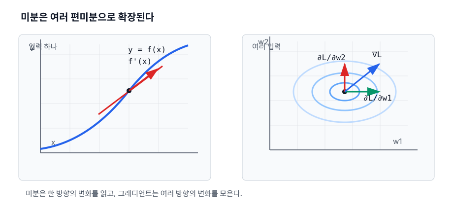
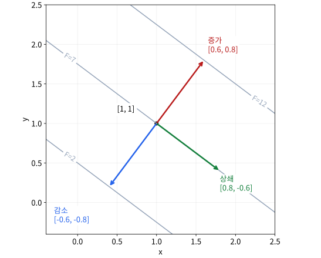
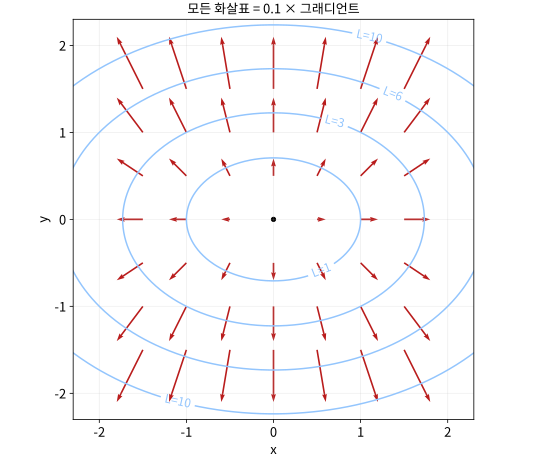
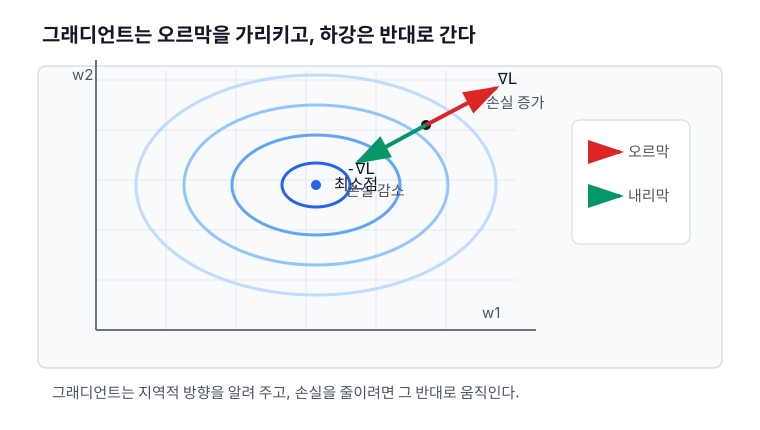
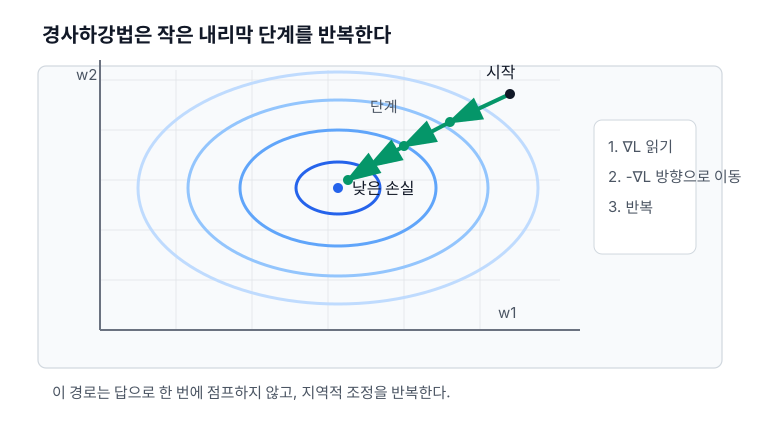
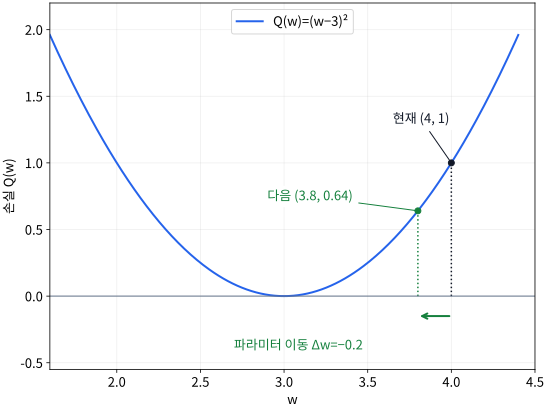
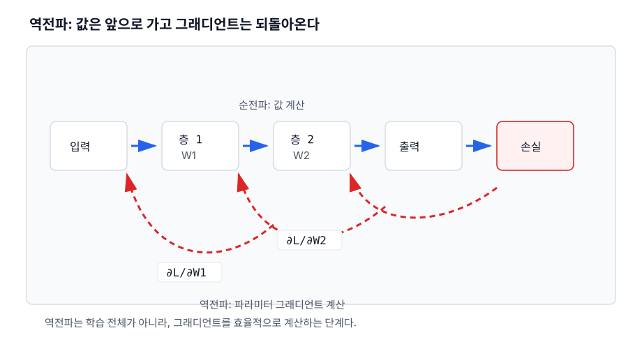

# P2-4.5 그래디언트 보충학습: 고등학교 미분에서 다변수 미분으로

> Section ID: `P2-4.5`
> Version: `v2026.07.20`

P2-4.3에서는 미분(derivative), 편미분(partial derivative), 그래디언트(gradient)를 연결했고, P2-4.4에서는 미분이 학습(training)에서 왜 필요한지 봤습니다.

여기서는 고등학교 미분 기억에서 그래디언트로 넘어갈 때 생기는 낯섦을 줄이기 위한 보충학습을 제공합니다. `그래디언트(gradient)`의 대표 설명은 P2-4.3에, `경사하강법(gradient descent)`의 대표 설명은 P2-6.3에 두고, 이 절에서는 그 사이 간격을 메우는 데 필요한 배경만 더 천천히 정리합니다. 용어를 다시 빠르게 확인할 때는 [개념사전](../../../reference/concept-glossary.md)도 함께 봅니다.

여기서는 `보충학습`, `방향도함수(directional derivative)`, `벡터해석(vector calculus)`처럼 본문에서 짧게 지나간 배경 개념을 중심으로 읽습니다. `gradient`, `gradient descent`, `backpropagation`을 처음부터 공식으로 밀어붙이기보다, 무엇을 보려는 개념인지 다시 붙잡는 것이 목적입니다.

독자 기준에서는 이 절이 특히 길게 느껴질 수 있습니다. 그래서 먼저 `고등학교 미분에서 어디가 끊기는가`를 짧게 정리하고 들어가는 편이 이해 복구에 더 유리합니다.

## 먼저 보는 끊김 지점

| 고등학교 기억 | 여기서 막히는 이유 | 이 절에서 다시 붙잡을 표현 |
| --- | --- | --- |
| `y = f(x)` 한 변수 함수 | 입력이 여러 개로 늘어나는 순간 질문이 하나가 아니게 된다 | 다변수 함수(multivariable function) |
| 기울기 하나 | 손실은 여러 파라미터에 동시에 반응한다 | 여러 편미분의 묶음 |
| 접선의 기울기 | 좌표축 방향, 임의의 방향을 구분해 본 적이 적다 | 편미분, 방향도함수 |
| 미분 공식 계산 | 학습에서는 계산 결과보다 `어느 쪽으로 움직일까`가 더 중요하다 | 그래디언트, 경사하강법 |
| 미분 문제 풀이 | 딥러닝에서는 그래디언트를 많이, 효율적으로 계산해야 한다 | 역전파(backpropagation) |

이 표를 먼저 붙잡으면, 낯설어 보이는 용어가 `새 수학`이라기보다 `한 변수 변화율 기억을 여러 방향으로 확장한 것`이라는 점이 더 분명해집니다.

## 먼저 정의부터 잡기

이 보충학습에서는 엄밀한 대학 수학 정의보다, AI 학습 문서를 읽기 위한 작업용 구분을 먼저 둡니다. 다만 같은 Part 안의 대표 정의를 다시 길게 복제하지는 않고, 현재 절에서 꼭 필요한 연결만 남깁니다.

| 용어 | 작업용 정의 |
| --- | --- |
| 미분(derivative) | 입력 하나를 아주 조금 바꿨을 때 출력이 얼마나 변하는지 나타내는 변화율 |
| 편미분(partial derivative) | 입력이 여러 개일 때, 그중 하나만 바꿨다고 보고 계산한 변화율 |
| 방향도함수(directional derivative) | 특정 방향으로 조금 움직였을 때 함수값이 얼마나 변하는지 나타내는 변화율 |
| 그래디언트(gradient) | 여러 편미분을 순서 있게 모은 벡터 |
| 벡터해석(vector calculus) | 벡터, 함수, 변화율을 공간 위에서 함께 다루는 수학 체계 |
| 경사하강법(gradient descent) | 그래디언트를 이용해 손실이 줄어드는 방향으로 파라미터를 조금씩 바꾸는 반복 방법 |
| 역전파(backpropagation) | 딥러닝 모델에서 각 파라미터의 그래디언트를 효율적으로 계산하는 절차 |

짧게 말하면, 미분은 한 방향의 변화율이고 편미분은 여러 방향을 하나씩 따로 본 값입니다. 방향도함수는 내가 고른 방향으로 변화를 읽는 방식이고, 그래디언트는 그런 변화율들을 한 묶음으로 모은 벡터입니다. 경사하강법은 그 벡터를 참고해 이동하는 방법이고, 역전파는 그 벡터를 딥러닝 모델 안에서 효율적으로 계산하는 절차입니다.

## 어떻게 공부하면 좋을까

이 절은 다음 순서로 이어집니다.

1. 미분을 한 방향의 변화율로 다시 떠올린다.
2. 입력이 여러 개일 때는 방향도 여러 개가 된다고 생각한다.
3. 편미분은 그 방향을 하나씩 따로 보는 방법이라고 이해한다.
4. 방향도함수는 내가 고른 방향으로 보는 변화율이라고 이해한다.
5. 그래디언트는 여러 편미분을 한 묶음으로 모은 벡터라고 이해한다.
6. 경사하강법은 그 벡터를 참고해 손실을 낮추는 반복 방법이라고 이해한다.
7. 역전파는 딥러닝 모델에서 그래디언트를 효율적으로 계산하는 절차라고 이해한다.

이 흐름을 읽을 때는 `무엇이 변하는가`, `어느 방향으로 변하는가`, `그 변화가 손실을 키우는가 줄이는가`, `여러 방향의 변화율을 왜 묶어야 하는가`, `그 묶음을 모델 학습에서는 어떻게 사용하는가`를 함께 물으면 됩니다.

이 질문들은 이후 최적화(optimization), 경사하강법(gradient descent), 역전파(backpropagation)를 다시 만날 때 출발점이 됩니다.

## 처음 읽는 기준: 그래디언트: 고등학교 미분에서 다변수 미분으로

- 그래디언트(gradient)가 고등학교 미분 기억만으로 낯설 수 있는 이유를 설명할 수 있습니다.
- 한 변수 함수(single-variable function)와 다변수 함수(multivariable function)의 차이를 설명할 수 있습니다.
- 편미분(partial derivative)을 여러 입력 중 하나씩 따로 본 변화율로 설명할 수 있습니다.
- 방향도함수(directional derivative)를 특정 방향으로 본 변화율로 설명할 수 있습니다.
- 그래디언트(gradient)를 여러 편미분을 모은 벡터로 설명할 수 있습니다.
- 경사하강법(gradient descent)을 그래디언트를 이용해 손실을 낮추는 반복 방법으로 설명할 수 있습니다.
- 역전파(backpropagation)를 딥러닝 모델에서 그래디언트를 효율적으로 계산하는 절차로 구분할 수 있습니다.

## 세 가지 기준

| 기준 | 왜 중요한가 | 이 절에서 필요한 이해 수준 |
| --- | --- | --- |
| 보충학습이 따로 필요한 이유를 먼저 본다 | 고등학교 미분 기억과 AI 학습의 다변수 미분 사이 간격이 크기 때문입니다. | 한 변수 미분에서 다변수 미분으로 넘어가는 복구 절이라고 이해합니다. |
| 그래디언트, 경사하강법, 역전파를 구분한다 | 세 용어가 같은 역할처럼 섞이면 학습 절차를 읽기 어려워지기 때문입니다. | 그래디언트는 방향 정보, 경사하강법은 이동 방법, 역전파는 계산 절차라고 이해합니다. |
| 계산보다 역할과 연결을 먼저 본다 | 개념이 잡혀야 뒤의 공식과 최적화 설명도 덜 끊기기 때문입니다. | 각 용어가 무엇을 보려는 개념인지 설명할 수 있는 수준으로 이해합니다. |

## 중간 요약: 지금 어디까지 왔는가

여기까지의 연결을 짧게 접으면 다음 순서입니다.

| 단계 | 한 문장 요약 |
| --- | --- |
| 미분 | 입력 하나를 조금 바꿨을 때 출력이 얼마나 변하는지 본다 |
| 편미분 | 입력이 여러 개일 때 하나씩 따로 바꿔 본다 |
| 방향도함수 | 축 방향이 아니라 내가 고른 방향으로 변화를 본다 |
| 그래디언트 | 여러 편미분을 한 벡터로 모은다 |
| 경사하강법 | 그 벡터를 이용해 손실이 줄어드는 쪽으로 이동한다 |
| 역전파 | 딥러닝에서 그 벡터를 효율적으로 계산한다 |

이 중간 표가 보이면, 본문이 길어도 독자는 현재 어떤 층위의 설명을 읽는지 다시 복귀할 수 있습니다.

## 고등학교 미분 기억은 보통 한 방향에서 시작한다

고등학교 미분을 떠올리면 보통 `y = f(x)`, 접선의 기울기, 순간 변화율, 미분계수, 도함수, 속도와 가속도가 먼저 떠오릅니다.

이 흐름은 대부분 입력이 하나인 함수에서 출발합니다.

\[
y = f(x)
\]

이때 질문은 비교적 단순합니다. `x가 조금 변하면 y는 얼마나 변하는가?`를 묻는 구조입니다.

그래서 변화율도 하나의 방향으로 이해하기 쉽습니다. 선 위에서 앞으로 조금 움직였을 때 높이가 얼마나 변하는지 보는 식입니다.

즉 입력 \(x\) 하나가 출력 \(y\) 하나에 대응하고, 그 관계의 한 지점에서 기울기를 읽는 감각이 고등학교 미분의 출발점이었습니다.

이 기억은 매우 중요합니다. 그래디언트는 이 기억을 버리는 개념이 아니라, 여러 입력이 있을 때 이 기억을 확장하는 개념입니다.

아래 차트는 한 방향의 미분이 여러 방향의 편미분과 그래디언트로 확장되는 흐름을 보여 줍니다.

## 그래디언트가 낯선 이유

그래디언트가 낯선 이유는 보통 두 가지입니다.

첫째, 그래디언트는 입력이 여러 개인 함수에서 자연스럽게 등장합니다.

\[
z = f(x, y)
\]

이제는 `x를 조금 바꾸면 z는 어떻게 변하는가?`, `y를 조금 바꾸면 z는 어떻게 변하는가?`처럼 질문이 둘 이상으로 늘어납니다.

둘째, 그래디언트는 결과가 숫자 하나로 끝나지 않고 벡터(vector)로 나타납니다.

\(x\) 방향 변화율과 \(y\) 방향 변화율을 함께 보면, 두 값을 묶은 벡터가 됩니다.

고등학교 미분 기억이 `기울기 하나`에 익숙하다면, 그래디언트는 `기울기 묶음`처럼 보입니다. 그래서 같은 미분 계열의 개념인지, 새로운 수학인지 헷갈리기 쉽습니다.

## 편미분은 하나씩 따로 보는 변화율이다

다변수 함수(multivariable function)를 하나 보겠습니다.

\[
L(w_1, w_2)
\]

AI 문맥에서는 \(L\)을 손실(loss), \(w_1\)과 \(w_2\)를 파라미터(parameter)라고 생각해도 됩니다.

이 함수에서 \(w_1\)만 조금 바꿨을 때 \(L\)이 어떻게 변하는지 보는 것이 \(w_1\)에 대한 편미분(partial derivative)입니다.

\[
\frac{\partial L}{\partial w_1}
\]

\(w_2\)만 조금 바꿨을 때 \(L\)이 어떻게 변하는지 보는 것은 \(w_2\)에 대한 편미분입니다.

\[
\frac{\partial L}{\partial w_2}
\]

여기서는 미분을 입력이 하나일 때의 변화율로, 편미분을 입력이 여러 개일 때 하나의 입력만 따로 본 변화율로 이해합니다.

엄밀한 계산법은 나중에 다루더라도, 지금은 “여러 조절값 중 하나씩 따로 민감도를 본다”는 감각을 잡는 것이 중요합니다.

## 방향도함수는 원하는 방향으로 보는 변화율이다

편미분은 보통 좌표축 방향을 하나씩 따로 봅니다. \(w_1\) 방향, \(w_2\) 방향처럼 기준 방향이 정해져 있습니다.

방향도함수(directional derivative)는 그보다 조금 더 일반적인 질문을 합니다.

즉 좌표축 방향이 아니라, 내가 고른 어떤 방향으로 움직이면 함수값은 얼마나 변하는가를 묻습니다.

편미분과 방향도함수는 모두 변화율을 다루지만 보는 방향이 다릅니다. 아래 차트에서는 편미분이 좌표축 방향을 하나씩 보는 변화율이고, 방향도함수가 임의의 방향을 따라 보는 변화율임을 구분합니다.

여기서는 방향도함수의 공식을 계산하지 않습니다. 지금 필요한 것은 다음 구분입니다.

편미분은 기준 축 방향으로 보는 변화율이고, 방향도함수는 내가 선택한 방향으로 보는 변화율입니다.

## 그래디언트는 여러 편미분을 모은 벡터다

그래디언트(gradient)는 여러 편미분을 순서 있게 모은 벡터입니다.

\[
\nabla L =
\left[
\frac{\partial L}{\partial w_1},
\frac{\partial L}{\partial w_2}
\right]
\]

이 식은 `w_1`을 바꾸면 손실은 어떻게 변하는가, `w_2`를 바꾸면 손실은 어떻게 변하는가라는 두 질문의 답을 한 묶음으로 담습니다.

현장 감각으로 바꾸면 다음과 같습니다.

조절 손잡이가 하나라면 기울기 하나를 보면 되지만, 손잡이가 여러 개라면 손잡이별 변화율을 함께 봐야 합니다. 그 변화율 묶음이 그래디언트입니다.

그래디언트가 벡터라는 점도 여기서 자연스럽게 이해할 수 있습니다. 벡터는 여러 숫자를 순서 있게 묶은 표현입니다. 그래디언트는 그중에서도 “각 방향의 변화율”을 묶은 벡터입니다.

벡터해석(vector calculus)은 이 관계를 더 넓게 다루는 수학 언어입니다. 여기서는 전체 체계를 배우지 않고, 스칼라장(scalar field)의 각 위치에서 변화 방향을 읽으면 그래디언트가 되고, 그런 벡터들이 공간 위에 놓이면 벡터장(vector field)으로 볼 수 있다는 정도만 확인합니다.

## 그래디언트는 어느 방향을 알려 주는가

그래디언트는 여러 변수 함수에서 값이 가장 빠르게 증가하는 방향과 연결됩니다. AI 학습에서는 보통 손실(loss)을 줄이고 싶습니다. 그래서 그래디언트 자체보다 그래디언트의 반대 방향이 중요해지는 경우가 많습니다.

그래디언트 방향은 손실이 커지는 쪽과 연결되고, 그래디언트의 반대 방향은 손실이 작아지는 쪽과 연결됩니다.

다음 차트는 손실 함수(loss function)의 한 지점에서 그래디언트 방향과 손실을 줄이는 방향이 어떻게 반대가 되는지 보여 줍니다.

여기서 중요한 것은 그래디언트가 전체 지도를 다 알려 주는 것이 아니라, 현재 위치 근처의 방향 정보를 알려 준다는 점입니다. 지금 위치에서 어느 쪽으로 움직이면 값이 커지고, 어느 쪽으로 움직이면 값이 작아질 가능성이 있는지를 알려 줍니다.

## AI 학습에서는 왜 그래디언트가 필요할까

AI 학습에서는 손실(loss)을 줄이고 싶습니다. 손실은 모델이 현재 얼마나 틀렸는지 알려 주지만, 손실 값 하나만으로는 어떤 파라미터를 어느 방향으로 바꿔야 할지 알기 어렵습니다.

손실이 크면 현재 결과가 좋지 않다는 뜻이지만, 무엇을 어떻게 바꿀지는 아직 모릅니다.

그래디언트는 현재 위치에서 각 파라미터를 바꿨을 때 손실이 어떻게 변하는지 알려 줍니다.

각 파라미터에 대한 손실의 변화율을 모은 것이 그래디언트이고, 손실을 줄이는 방향을 찾을 때는 그 그래디언트의 반대 방향이 단서가 됩니다.

이것이 경사하강법(gradient descent)으로 이어집니다. 즉 그래디언트는 여러 파라미터를 가진 손실 함수에서 어느 방향으로 움직이면 값이 변하는지 알려 주는 변화율 묶음입니다.

## 경사하강법이라는 이름을 어떻게 읽을까

경사하강법(gradient descent)은 이름부터 낯설 수 있습니다. 영어 표현을 나누어 보면 조금 쉬워집니다.

| 표현 | 입문적 의미 |
| --- | --- |
| gradient | 현재 위치에서 값이 가장 빠르게 증가하는 방향 |
| descent | 내려감, 낮은 쪽으로 이동함 |
| gradient descent | 그래디언트를 참고해 값을 낮추는 쪽으로 이동하는 반복 방법 |

정의에 가깝게 쓰면 경사하강법은 현재 파라미터 위치에서 손실 함수의 그래디언트를 계산하고, 손실이 줄어드는 방향으로 파라미터를 조금 이동시키는 일을 반복하는 최적화 방법입니다.

이 문장에는 네 가지 요소가 들어 있습니다.

| 요소 | 뜻 |
| --- | --- |
| 현재 파라미터 위치 | 지금 모델이 가지고 있는 숫자들의 상태 |
| 손실 함수 | 현재 모델이 얼마나 틀렸는지 계산하는 기준 |
| 그래디언트 | 손실이 어느 방향으로 얼마나 변하는지 알려 주는 변화율 묶음 |
| 조금 이동 | 한 번에 크게 바꾸지 않고 작은 폭으로 값을 조정하는 일 |

그래서 경사하강법은 산에서 내려오는 비유로 자주 설명됩니다. 현재 위치에서 주변의 기울기를 보고, 더 낮아지는 방향으로 조금 이동합니다. 한 번에 정답 위치로 순간이동하는 것이 아니라, 조금 이동하고 다시 기울기를 확인하는 일을 반복합니다.

아래 차트처럼 경사하강법은 한 번에 중심으로 이동하는 방식이 아닙니다. 현재 위치에서 손실이 줄어드는 방향으로 조금 이동하고, 이동한 위치에서 다시 방향을 읽습니다.

즉 현재 위치에서 손실을 보고, 그래디언트로 변화 방향을 읽고, 손실이 줄어드는 쪽으로 조금 이동한 뒤, 다시 손실을 보는 과정을 반복합니다.

## 경사하강법 업데이트는 무엇을 말하는가

경사하강법은 보통 다음과 같은 모양의 업데이트 식으로 설명됩니다.

\[
w_{\text{next}} = w - \eta \nabla L
\]

이 식을 지금 완전히 계산할 필요는 없습니다. 다만 각 기호가 말하는 역할은 이해할 수 있습니다.

| 기호 | 입문적 의미 |
| --- | --- |
| \(w\) | 현재 파라미터 값 |
| \(w_{\text{next}}\) | 다음 파라미터 값 |
| \(\nabla L\) | 현재 위치에서 손실이 변하는 방향 정보 |
| \(\eta\) | 한 번에 얼마나 움직일지 정하는 학습률(learning rate) |
| \(-\eta \nabla L\) | 손실이 줄어드는 쪽으로 조금 이동하는 양 |

여기서 `조금`이라는 말이 중요합니다. 너무 크게 움직이면 낮은 곳을 지나쳐 버릴 수 있고, 너무 작게 움직이면 오래 걸릴 수 있습니다. 이 이동 폭은 P5-7.1에서 학습률(learning rate)이라는 이름으로 다시 만납니다.

아래 차트는 경사하강법의 업데이트 식을 직관적으로 보여 줍니다. 수식을 외우는 것이 목표는 아니지만, `현재 값에서 그래디언트 반대 방향으로 학습률만큼 조금 이동한다`는 구조는 기억할 필요가 있습니다.

또 하나 중요한 점은 경사하강법이 항상 완벽한 답을 보장하는 마법 같은 방법은 아니라는 것입니다. 현재 위치에서 보이는 기울기를 이용해 더 나은 방향으로 가려는 방법입니다. 시작 위치, 손실 함수의 모양, 이동 폭, 반복 횟수에 따라 결과가 달라질 수 있습니다.

여기서는 그래디언트가 현재 위치의 방향 정보를 준다는 점까지 정리합니다. 학습률을 어떻게 정할지, 반복을 언제 멈출지, 여러 파라미터에서 어떻게 계산할지는 P2-6.3에서 다시 다룹니다.

## 역전파는 경사하강법과 같은 말이 아니다

역전파(backpropagation)는 경사하강법과도 연결되지만 같은 말은 아닙니다.

경사하강법은 그래디언트를 이용해 값을 조정하는 최적화 방법이고, 역전파는 딥러닝 모델 안에서 많은 파라미터의 그래디언트를 효율적으로 계산하는 절차입니다.

딥러닝 모델은 여러 층(layer)의 계산이 이어진 구조입니다. 입력이 여러 층을 지나 출력이 되고, 그 출력으로 손실을 계산합니다.

딥러닝 모델은 `입력 -> 1층 계산 -> 2층 계산 -> 출력 -> 손실`처럼 여러 층의 계산이 이어진 구조로 읽을 수 있습니다.

학습하려면 손실이 각 층의 파라미터에 대해 어떻게 변하는지 알아야 합니다. 역전파는 이 정보를 뒤쪽에서 앞쪽으로 효율적으로 전달하며 계산하는 절차입니다.

아래 차트처럼 순전파(forward pass)는 입력에서 출력과 손실까지 값을 계산하고, 역전파(backward pass)는 손실에서 거꾸로 각 층의 파라미터가 손실에 얼마나 영향을 주는지 계산합니다.

여기서는 손실을 줄이기 위해 값을 어떻게 바꿀지를 다루는 것이 경사하강법이고, 각 층의 파라미터가 손실에 얼마나 영향을 주는지 계산하는 것이 역전파라고 구분합니다.

## 교육과정 관점에서 조심해야 할 말

2022 개정 고등학교 교육과정의 `인공지능 수학`에는 손실함수(loss function)와 경사하강법(gradient descent)이 등장합니다. 따라서 “고등학교 과정에서 그래디언트와 전혀 연결되는 내용이 없다”고 말하면 부정확할 수 있습니다.

다만 `인공지능 수학`은 과거에 고등학교 수학을 배운 독자에게 익숙한 과목명이 아닐 수 있습니다. 오래전에 학교 수학을 배운 독자라면, 손실함수나 경사하강법을 고등학교 수학의 일부로 떠올리지 못하는 것이 자연스럽습니다. 여기서는 그런 기억을 틀렸다고 처리하기보다, 현재 교육과정에서 새롭게 확인되는 흐름과 연결해 다시 설명합니다.

확인한 고등학교 교육과정 문서의 텍스트 기준으로 `그래디언트`, `gradient`, `편미분`, `방향도함수`라는 용어는 확인되지 않았습니다. `인공지능 수학`의 경사하강법도 일변수함수로 정의된 손실함수와 미분계수를 직관적으로 이해하는 수준에 가깝습니다.

따라서 여기서는 고등학교 과정에서도 손실함수와 경사하강법은 소개될 수 있지만, 그래디언트와 편미분의 체계는 별도 보충 설명이 필요할 수 있다고 표현합니다.

이 표현은 독자의 학습 기억과 공식 자료의 범위를 함께 존중합니다.

## 보충학습으로 남겨 둘 것

여기서는 그래디언트를 완전히 계산할 필요가 없습니다. 대신 다음 경계를 기억합니다.

| 구분 | 지금 필요한 이해 |
| --- | --- |
| 미분(derivative) | 한 입력에 대한 순간 변화율 |
| 편미분(partial derivative) | 여러 입력 중 하나씩 따로 본 변화율 |
| 방향도함수(directional derivative) | 특정 방향으로 본 변화율 |
| 벡터해석(vector calculus) | 변화율과 벡터를 공간에서 함께 다루는 더 큰 수학 언어 |
| 그래디언트(gradient) | 편미분을 모은 벡터 |
| 경사하강법(gradient descent) | 그래디언트를 이용해 손실을 줄이는 반복 방법 |
| 역전파(backpropagation) | 많은 파라미터의 그래디언트를 효율적으로 계산하는 절차 |

편미분이 경사하강법으로 이어지는 계산은 P2-6.3에서, 손실이 각 가중치에 어떻게 전달되는지는 P5-5.1과 P5-5.2에서, 실제 업데이트 규칙은 P5-7.1과 P5-7.2에서 다시 만납니다. 지금은 용어가 서로 어떻게 연결되는지, 그리고 왜 AI 학습에서 반복해서 등장하는지를 잡는 것이 목표입니다.

## 사례 및 예시

### 사례 1. 여러 조절 손잡이가 있는 믹서 패널을 한 번에 읽어야 할 때

오디오 믹서 패널을 다룬다고 생각해 보겠습니다. 볼륨, 저음, 고음, 잔향 같은 손잡이가 여러 개 있고, 최종 소리는 이 값들이 함께 만든 결과입니다. 사람이 손으로 맞출 때는 보통 한 손잡이씩 돌려 보며 `소리가 더 맑아졌는가`, `목소리가 너무 얇아졌는가`를 듣습니다.

하지만 손잡이가 많아질수록 한 번의 조정이 다른 특성과 함께 얽히기 시작합니다. 고음을 올리면 선명도는 좋아질 수 있지만 거칠게 들릴 수 있고, 잔향을 늘리면 풍부해질 수 있지만 말소리가 뭉개질 수 있습니다. `하나만 바꿔 본다`는 감각은 여전히 유효하지만, 전체적으로는 여러 방향의 변화율을 함께 읽어야 더 안정적으로 조정할 수 있습니다.

그래디언트 보충학습이 필요한 이유도 여기에 있습니다. 고등학교 미분은 손잡이 하나를 돌렸을 때의 변화를 보는 감각에 가깝고, 다변수 미분과 그래디언트는 여러 손잡이가 동시에 있는 패널을 읽는 감각에 가깝습니다. 경사하강법은 그중에서 결과를 더 좋게 만드는 방향으로 조금씩 조정하는 반복 방법이고, 역전파는 복잡한 장비 안에서 각 손잡이의 영향도를 효율적으로 계산하는 절차라고 볼 수 있습니다.

확인 가능한 결과는 각 손잡이를 아주 조금만 조정했을 때 최종 음질 점수가 어떻게 달라지는지 기록하는 것입니다. 예를 들어 볼륨을 1단계 올렸을 때 잡음 점수가 얼마나 커지는지, 저음을 1단계 낮췄을 때 음성 명료도 점수가 얼마나 좋아지는지를 비교하면 `한 방향의 변화율`과 `여러 방향의 변화율 묶음` 차이를 직관적으로 볼 수 있습니다.

## 체크리스트

- 고등학교 미분 기억이 주로 한 변수 함수의 변화율에서 시작한다는 점을 설명할 수 있다.
- 그래디언트가 여러 입력을 가진 함수에서 자연스럽게 등장함을 설명할 수 있다.
- 편미분을 `여러 입력 중 하나씩 따로 본 변화율`로 설명할 수 있다.
- 방향도함수를 `특정 방향으로 본 변화율`로 설명할 수 있다.
- 그래디언트를 `편미분을 모은 벡터`로 설명할 수 있다.
- 경사하강법을 `그래디언트를 이용해 손실을 줄이는 반복 방법`으로 설명할 수 있다.
- 역전파를 `많은 파라미터의 그래디언트를 효율적으로 계산하는 절차`로 설명할 수 있다.
- 고등학교 `인공지능 수학`에서도 경사하강법은 등장하지만, 그래디언트와 편미분 체계는 별도 보충이 필요할 수 있음을 설명할 수 있다.
- 편미분, 방향도함수, 그래디언트가 각각 무엇을 다르게 보는지 구분할 수 있다.
- 고등학교 미분 기억과 AI 학습 문서 사이 간격이 왜 생기는지 설명할 수 있다.

## 출처와 참고 자료

- 교육부, `[교육부 고시 제2022-33호] 초중등학교 교육과정 총론 및 각론 고시`. 2022 개정 고등학교 교육과정의 공식 고시와 별책 자료 위치를 확인할 수 있습니다. [https://www.moe.go.kr/boardCnts/viewRenew.do?boardID=141&boardSeq=93458&lev=0&page=1&searchType=null&statusYN=W](https://www.moe.go.kr/boardCnts/viewRenew.do?boardID=141&boardSeq=93458&lev=0&page=1&searchType=null&statusYN=W){: target="_blank" rel="noopener noreferrer" } / 확인일: 2026-07-20
- OpenStax, [Calculus Volume 3, 4.6 Directional Derivatives and the Gradient](https://openstax.org/books/calculus-volume-3/pages/4-6-directional-derivatives-and-the-gradient){: target="_blank" rel="noopener noreferrer" }, 편미분, 방향도함수, 그래디언트 벡터와 최대 증가 방향의 관계를 확인할 수 있습니다. 확인 날짜: 2026-07-20.
- KOCW, `미분적분학2 - 한양대학교`. 미분적분학2 강의가 다변수 함수, 편미분, 벡터함수 등을 다루는 공개 강의임을 확인할 수 있습니다. [https://www.kocw.or.kr/home/search/kemView.do?kemId=330031](https://www.kocw.or.kr/home/search/kemView.do?kemId=330031){: target="_blank" rel="noopener noreferrer" } / 확인일: 2026-07-20
