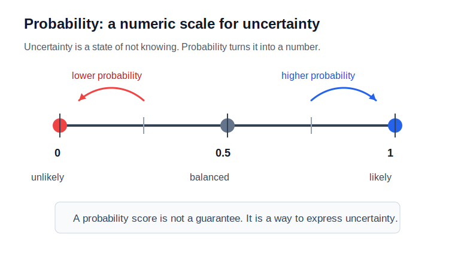
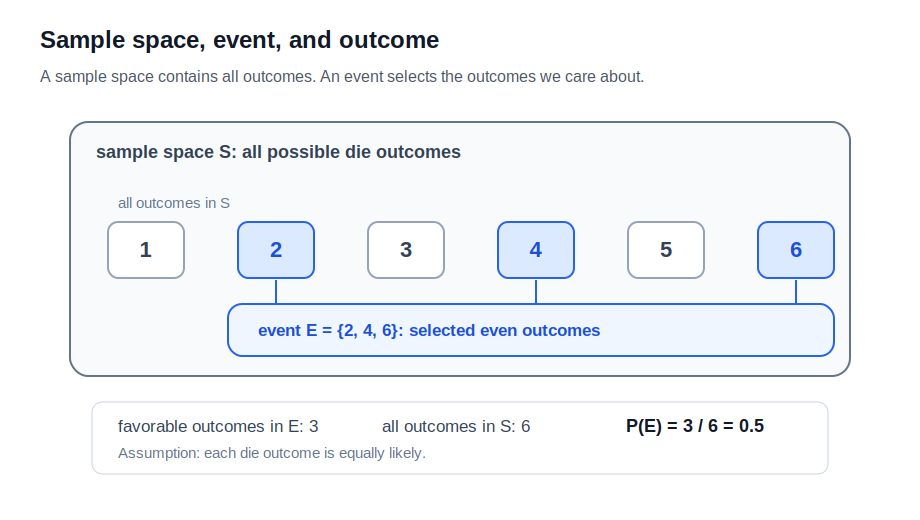
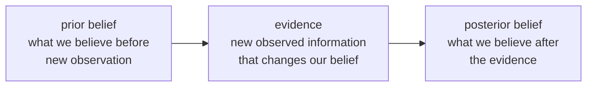
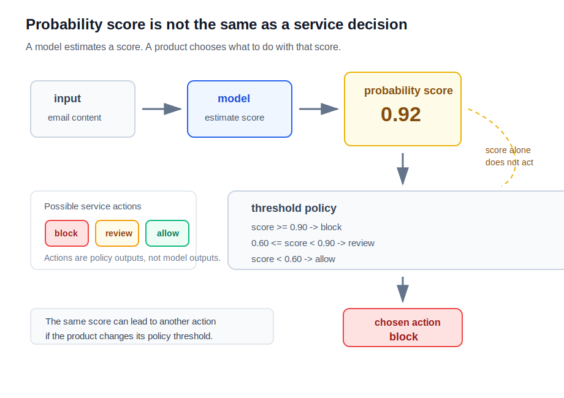

# P2-5.1 확률(probability)은 불확실성을 어떻게 숫자로 표현하는가

P2-4장에서는 미분(derivative)과 그래디언트(gradient)를 통해 “값을 어떻게 바꾸면 손실(loss)이 줄어드는가”를 봤습니다. 이제 다른 종류의 수학 언어가 필요합니다.

미분은 변화의 방향을 읽게 해 줍니다. 확률(probability)은 확실하지 않은 상황을 숫자로 다루게 해 줍니다.

> 미분
> -> 값이 어떻게 변하는가를 읽는 언어
>
> 확률
> -> 모르는 상태를 숫자로 표현하는 언어

AI를 공부할 때 확률은 주사위나 동전 문제에만 머물지 않습니다. 데이터가 부족하거나, 관측이 불완전하거나, 모델이 세상을 단순화해서 볼 때 우리는 확실한 답 대신 “어느 정도 그럴 가능성이 있는가”를 다룹니다. 이 절은 그 출발점을 잡습니다.

## 이 절의 범위

이 절은 확률(probability)을 불확실성(uncertainty)을 표현하는 숫자 언어로 소개합니다.

다음 내용은 깊게 다루지 않습니다.

- 확률 공리(probability axioms)의 엄밀한 증명
- 조건부확률(conditional probability)의 공식 계산
- 베이즈 규칙(Bayes' rule)의 계산
- 확률분포(probability distribution)의 종류
- 통계적 추정(statistical estimation)의 절차

이 내용은 이후 P2-5.2, P2-5.3, 그리고 머신러닝 파트에서 다시 다룹니다.

이 절에서는 다음 질문에 집중합니다.

> 불확실성은 무엇인가?
> 확률은 왜 0과 1 사이의 숫자로 표현되는가?
> 사건(event), 결과(outcome), 표본공간(sample space)은 무엇인가?
> 확률은 정답인가, 믿음인가, 장기 빈도인가?
> AI에서는 왜 확률 언어가 반복해서 등장하는가?

## 이 절의 목표

- 불확실성(uncertainty)을 “아직 모르는 상태”로 설명할 수 있습니다.
- 확률(probability)을 불확실성을 표현하고 비교하는 숫자 언어로 설명할 수 있습니다.
- 결과(outcome), 사건(event), 표본공간(sample space)을 구분할 수 있습니다.
- 확률이 항상 정답을 보장하는 숫자가 아니라, 판단과 모델링을 위한 표현이라는 점을 설명할 수 있습니다.
- 장기 빈도(long-run frequency)와 믿음의 정도(degree of belief)를 구분해 볼 수 있습니다.
- AI 모델의 예측(prediction)이 확률적 표현과 연결되는 이유를 말할 수 있습니다.

## 불확실성은 숫자가 아니라 상태다

불확실성(uncertainty)은 숫자 자체가 아닙니다. 불확실성은 우리가 아직 모르는 상태입니다.

예를 들어 다음 질문을 생각해 봅니다.

> 내일 비가 올까?
> 이 이메일은 스팸일까?
> 이 사진 속 물체는 고양이일까?
> 이 사용자는 다음 달에도 서비스를 사용할까?

이 질문들은 지금 당장 완전히 확정하기 어렵습니다. 정보가 부족하거나, 미래가 아직 오지 않았거나, 관측이 불완전하기 때문입니다.

확률은 이런 불확실한 상태를 숫자로 표현하는 방법입니다.

> 비가 올 가능성: 70%
> 스팸일 가능성: 95%
> 고양이일 가능성: 82%
> 이탈할 가능성: 30%

여기서 숫자는 “정답을 이미 안다”는 뜻이 아닙니다. 현재 가진 정보와 모델을 기준으로 어느 쪽이 더 그럴듯한지 표현하는 방식입니다.

아래 차트는 불확실한 상태를 0과 1 사이의 확률 숫자로 표현하는 감각을 보여 줍니다.



## 확률은 0과 1 사이의 숫자로 표현한다

확률(probability)은 보통 0과 1 사이의 숫자로 표현합니다.

> 0
> -> 일어나지 않는다고 보는 쪽
>
> 1
> -> 반드시 일어난다고 보는 쪽
>
> 0.5
> -> 두 가능성을 비슷하게 보는 쪽

퍼센트(percent)로 쓰면 다음과 같습니다.

```text
0.7 = 70%
0.2 = 20%
1.0 = 100%
```

중요한 점은 확률이 “좋다/나쁘다”를 직접 말하는 숫자가 아니라는 것입니다. 확률은 어떤 사건(event)이 일어날 가능성을 나타냅니다.

> 비 올 확률 80%
> -> 비가 오는 사건의 가능성이 크다는 뜻
> -> 좋은 날씨인지 나쁜 날씨인지는 목적에 따라 다르다.

AI 서비스에서도 이 구분이 중요합니다. 어떤 모델이 “스팸일 확률 0.95”라고 출력했다면, 그것은 스팸이라는 사건에 대한 가능성 점수입니다. 그 결과를 차단할지, 사용자에게 경고할지, 사람이 검토하게 할지는 별도의 의사결정입니다.

## 결과, 사건, 표본공간을 구분한다

확률을 읽으려면 세 단어를 먼저 구분해야 합니다.

| 용어 | 영어 | 작업용 정의 |
| --- | --- | --- |
| 결과 | outcome | 한 번의 시행에서 실제로 나올 수 있는 개별 결과 |
| 사건 | event | 관심 있는 결과들을 묶은 것 |
| 표본공간 | sample space | 가능한 모든 결과의 모음 |

주사위 하나를 던지는 상황을 보겠습니다.

> 가능한 결과
> -> 1, 2, 3, 4, 5, 6
>
> 표본공간
> -> {1, 2, 3, 4, 5, 6}
>
> 짝수가 나오는 사건
> -> {2, 4, 6}

이때 주사위가 공정하다고 가정하면, 짝수가 나올 확률은 다음처럼 계산할 수 있습니다.

\[
P(\text{짝수}) = \frac{3}{6} = 0.5
\]

이 계산은 “관심 있는 결과의 개수”를 “전체 가능한 결과의 개수”로 나눈 것입니다.

> 관심 있는 결과: 2, 4, 6
> 전체 결과: 1, 2, 3, 4, 5, 6
> 확률: 3 / 6

아래 차트처럼 사건(event)은 표본공간(sample space) 안에서 관심 있는 결과(outcome)를 묶은 것입니다.



다만 이 방식은 모든 결과가 똑같이 일어날 가능성이 있다고 볼 수 있을 때만 안전합니다. 실제 데이터에서는 모든 결과가 균등하게 일어나지 않는 경우가 많습니다.

## 동전과 주사위는 출발점일 뿐이다

확률을 처음 배울 때 동전과 주사위가 자주 등장하는 이유는 단순합니다. 가능한 결과를 나열하기 쉽고, 공정한 동전이나 주사위라면 각 결과가 비슷한 가능성을 가진다고 가정하기 쉽기 때문입니다.

> 동전
> -> 앞면, 뒷면
>
> 주사위
> -> 1, 2, 3, 4, 5, 6

하지만 현실의 AI 문제는 이보다 복잡합니다.

> 고객이 이탈할까?
> 문장이 긍정 감정일까?
> 이미지에 보행자가 있을까?
> 대출 신청의 위험은 어느 정도일까?

이 문제들은 가능한 결과를 단순히 같은 비율로 나누기 어렵습니다. 그래서 데이터(data), 특징(feature), 모델(model)을 이용해 가능성을 추정합니다.

이때 확률은 “주사위처럼 세면 되는 문제”에서 “관측한 데이터로 가능성을 추정하는 문제”로 확장됩니다.

## 장기 빈도와 믿음의 정도

확률을 이해할 때 두 관점이 자주 등장합니다.

하나는 장기 빈도(long-run frequency)입니다.

> 같은 실험을 아주 많이 반복한다.
> 어떤 결과가 나타나는 비율을 본다.
> 그 비율을 확률로 해석한다.

공정한 동전을 여러 번 던지면 앞면의 비율이 대체로 0.5에 가까워진다고 기대할 수 있습니다. 이 관점은 반복 가능한 실험을 설명할 때 직관적입니다.

다른 하나는 믿음의 정도(degree of belief)입니다.

> 현재 가진 정보를 바탕으로
> 어떤 일이 그럴듯하다고 보는 정도를 숫자로 표현한다.

예를 들어 의사가 증상과 검사 결과를 보고 어떤 질병의 가능성을 판단하거나, 모델이 이메일 내용을 보고 스팸 가능성을 계산하는 경우입니다. 같은 사람을 무한히 복제해 반복 실험할 수는 없지만, 현재 정보에 근거해 가능성을 표현할 수는 있습니다.

입문 단계에서는 두 관점을 다음처럼 구분하면 충분합니다.

> 반복 가능한 실험
> -> 장기 빈도 관점이 이해하기 쉽다.
>
> 현재 정보로 판단해야 하는 상황
> -> 믿음의 정도 관점이 이해하기 쉽다.

AI에서는 두 관점이 모두 등장합니다. 데이터에서 관측된 빈도를 사용하기도 하고, 모델의 현재 정보에 근거한 가능성 점수를 사용하기도 합니다.

## 베이즈 규칙은 믿음 갱신의 언어다

베이즈 규칙(Bayes' rule)은 처음 보면 매우 낯설 수 있습니다. 특히 확률을 동전, 주사위, 비율 계산으로만 기억하고 있다면 “믿음을 갱신한다”는 표현 자체가 수학처럼 느껴지지 않을 수 있습니다.

이 절에서는 베이즈 규칙을 계산하지 않습니다. 다만 왜 이 이름이 확률과 AI 문서에서 자주 등장하는지는 미리 잡아 둡니다.

베이즈 규칙은 아주 거칠게 말하면 다음 흐름을 다루는 규칙입니다.

> 기존에 가지고 있던 믿음
> -> 새로 관측한 정보
> -> 바뀐 믿음

영어 용어로는 다음처럼 자주 표현합니다.

| 용어 | 영어 | 작업용 설명 |
| --- | --- | --- |
| 사전 믿음 | prior belief | 새 관측을 보기 전에 가지고 있던 가능성 판단 |
| 증거 | evidence | 믿음을 바꾸게 만드는 관측 정보 |
| 사후 믿음 | posterior belief | 증거를 본 뒤 갱신된 가능성 판단 |

예를 들어 어떤 이메일이 스팸일 가능성을 처음에는 낮게 보고 있었다고 하겠습니다. 그런데 링크가 많고, 특정 문구가 반복되고, 발신자가 의심스럽다는 증거(evidence)가 추가되면 판단이 바뀔 수 있습니다.

> 처음 판단
> -> 스팸일 가능성이 낮아 보인다.
>
> 새 증거
> -> 링크가 많고 발신자가 낯설다.
>
> 갱신된 판단
> -> 스팸일 가능성을 더 높게 본다.

아래 차트는 베이즈 규칙을 공식이 아니라 “새 증거로 믿음을 갱신하는 흐름”으로 보여 줍니다.



여기서 중요한 단어는 증거(evidence)입니다. evidence는 단순히 “근거 자료”라는 뜻만이 아니라, 확률 판단을 바꾸는 관측 정보로도 쓰입니다. AI 문서에서 evidence라는 말이 나오면 “무엇이 판단을 바꾸게 했는가?”라고 물어보면 도움이 됩니다.

베이즈 규칙은 P2-5.1의 핵심 계산 대상은 아닙니다. 여기서는 이름을 보고 겁먹지 않도록, “확률은 새로운 관측으로 갱신될 수 있다”는 관점만 남깁니다. 조건부확률(conditional probability)과 베이즈 규칙의 계산은 별도 절에서 다루는 것이 더 안전합니다.

## 확률은 정답이 아니라 표현이다

확률을 “정답”으로 읽으면 오해가 생깁니다.

> 비 올 확률 70%
> -> 반드시 비가 온다는 뜻이 아니다.
>
> 스팸 확률 95%
> -> 절대적으로 스팸이라는 뜻이 아니다.
>
> 고양이 확률 82%
> -> 모델이 고양이라는 단어를 이해했다는 뜻만은 아니다.

확률은 불확실성을 다루기 위한 표현입니다. 그 표현이 얼마나 믿을 만한지는 별도의 질문입니다.

> 데이터가 충분한가?
> 데이터가 치우쳐 있지 않은가?
> 모델이 어떤 기준으로 가능성을 계산했는가?
> 확률 점수가 실제 빈도와 잘 맞는가?
> 결정 기준은 무엇인가?

이 질문들은 이후 머신러닝에서 평가(evaluation), 보정(calibration), 편향(bias), 안전성(safety)을 볼 때 다시 등장합니다.

## AI에서 확률이 필요한 이유

AI는 많은 경우 확실한 규칙만으로 동작하지 않습니다. 데이터에서 패턴을 찾고, 그 패턴을 바탕으로 새 입력에 대한 가능성을 계산합니다.

예를 들어 이미지 분류 모델은 다음처럼 여러 후보에 점수를 줄 수 있습니다.

> 고양이: 0.82
> 강아지: 0.12
> 토끼: 0.04
> 기타: 0.02

이 숫자는 모델이 각 후보를 어느 정도 가능하게 보는지 나타냅니다. 가장 큰 값을 고르면 “고양이”라는 예측이 됩니다. 하지만 모델 내부에서는 단순한 정답 하나보다, 후보들 사이의 가능성 분포가 더 중요한 경우가 많습니다.

자연어 모델도 비슷한 구조를 가집니다.

> 다음 단어 후보 A
> 다음 단어 후보 B
> 다음 단어 후보 C
>
> 각 후보가 이어질 가능성을 비교한다.

이 절에서 자연어 모델의 세부 계산을 다루지는 않습니다. 다만 AI가 “정답을 바로 꺼내는 기계”라기보다, 불확실한 후보들 사이에서 가능성을 비교하는 계산을 많이 사용한다는 점은 기억해 둘 필요가 있습니다.

## 확률, 불확실성, stochastic은 같은 말이 아니다

앞으로 AI 문서를 읽다 보면 확률(probability), 불확실성(uncertainty), 확률적(stochastic)이라는 말을 자주 만납니다. 세 말은 연결되어 있지만 같은 말은 아닙니다.

| 용어 | 영어 | 구분 |
| --- | --- | --- |
| 불확실성 | uncertainty | 아직 모르는 상태 |
| 확률 | probability | 불확실성을 숫자로 표현하는 언어 |
| 확률적 | stochastic | 과정이나 행동에 확률적 변동이 포함된 성질 |

예를 들어 주사위 던지기는 확률적 과정(stochastic process)으로 볼 수 있습니다. 어떤 면이 나올지 사전에 확정해서 말하기 어렵고, 반복할 때 결과가 달라질 수 있기 때문입니다.

반면 “내가 고객의 마음을 충분히 관측하지 못해서 이탈 여부를 확신할 수 없다”는 상황은 불확실성(uncertainty)의 문제입니다. 이 불확실성을 모델이 0.3 같은 숫자로 표현하면 확률(probability)이 됩니다.

> 불확실성
> -> 모르는 상태
>
> 확률
> -> 그 모르는 상태를 숫자로 표현
>
> stochastic
> -> 과정 자체에 확률적 변동이 포함됨

이 구분은 이후 머신러닝과 생성형 AI를 읽을 때 중요합니다. 특히 `random`, `stochastic`, `nondeterministic`, `probabilistic`을 모두 같은 말처럼 쓰면 설명이 흐려질 수 있습니다.

## 간단한 예시: 스팸 메일 판단

스팸 메일 분류를 생각해 보겠습니다.

> 입력
> -> 이메일 제목과 본문
>
> 출력
> -> 스팸일 가능성

모델은 다음과 같은 단서를 볼 수 있습니다.

> 특정 단어가 반복되는가?
> 링크가 많은가?
> 발신자가 낯선가?
> 이전 스팸 메일과 패턴이 비슷한가?

그리고 다음과 같은 숫자를 만들 수 있습니다.

> 스팸일 확률: 0.92

이 숫자는 “무조건 스팸”이라는 선언이 아닙니다. 현재 모델과 데이터 기준에서 스팸일 가능성이 높다는 표현입니다. 실제 서비스에서는 이 숫자를 기준으로 다음 선택을 할 수 있습니다.

> 0.99 이상
> -> 자동 차단
>
> 0.80 이상
> -> 스팸함으로 이동
>
> 0.50 근처
> -> 사용자가 직접 판단하게 표시

여기서 확률은 판단을 돕는 숫자이고, 운영 기준은 별도로 정해야 합니다. 이 구분은 AI 서비스를 이해할 때 매우 중요합니다.

아래 차트는 모델의 확률 점수와 서비스의 운영 결정을 분리해서 봐야 한다는 점을 보여 줍니다. 같은 확률 점수라도 서비스 목적, 위험, 비용, 정책에 따라 다른 행동으로 이어질 수 있습니다.



## 이 절에서 기억할 관점

확률은 AI를 “불확실한 세계에서 판단하는 계산”으로 이해하게 해 줍니다.

> 세상은 항상 완전히 관측되지 않는다.
> 데이터는 제한적이고 치우칠 수 있다.
> 모델은 현실을 단순화해서 본다.
> 그래서 AI는 많은 경우 가능성을 계산한다.

확률을 배운다는 것은 주사위 문제만 푸는 일이 아닙니다. AI 문서에서 반복해서 만나는 예측, 분류, 생성, 샘플링, 신뢰도, 위험, 평가를 읽기 위한 언어를 회복하는 일입니다.

## 체크리스트

- 불확실성(uncertainty)을 숫자 자체가 아니라 모르는 상태로 설명할 수 있다.
- 확률(probability)을 불확실성을 표현하는 0과 1 사이의 숫자 언어로 설명할 수 있다.
- 결과(outcome), 사건(event), 표본공간(sample space)을 구분할 수 있다.
- 공정한 주사위에서 짝수가 나올 확률을 \(3/6\)으로 계산할 수 있다.
- 확률이 항상 정답을 보장하는 숫자가 아니라 현재 정보와 모델의 표현이라는 점을 설명할 수 있다.
- 장기 빈도(long-run frequency)와 믿음의 정도(degree of belief)를 구분할 수 있다.
- 베이즈 규칙(Bayes' rule)을 계산하지 않더라도, 새 증거(evidence)로 믿음을 갱신하는 흐름으로 설명할 수 있다.
- 확률(probability), 불확실성(uncertainty), 확률적(stochastic)을 같은 말처럼 쓰지 않아야 함을 설명할 수 있다.
- AI 모델의 출력 확률과 실제 운영 결정은 구분해야 함을 설명할 수 있다.

## 출처와 참고 자료

- Barbara Illowsky, Susan Dean, [Introductory Statistics, 3.1 Terminology](https://openstax.org/books/introductory-statistics/pages/3-1-terminology){: target="_blank" rel="noopener noreferrer" }, OpenStax, 확인 날짜: 2026-06-24.
- Ian Goodfellow, Yoshua Bengio, Aaron Courville, [Deep Learning, Chapter 3: Probability and Information Theory](https://www.deeplearningbook.org/contents/prob.html){: target="_blank" rel="noopener noreferrer" }, MIT Press, 2016, 확인 날짜: 2026-06-24.
