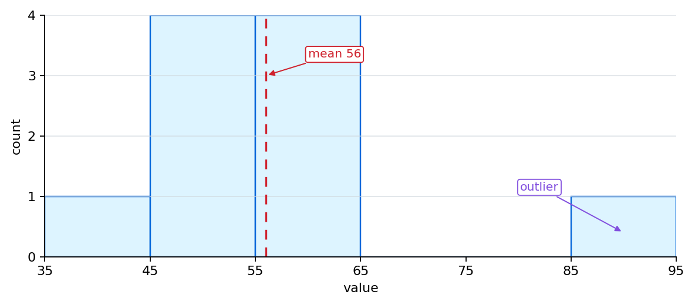
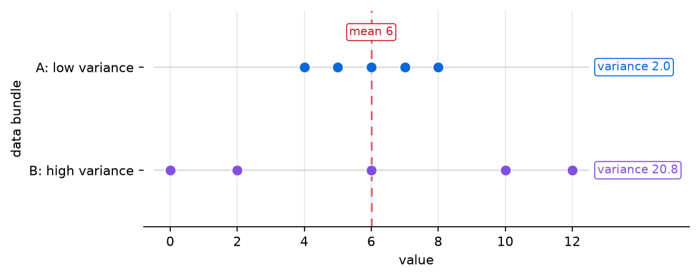

# P2-5.2 Distribution, Mean, and Variance

> Section ID: `P2-5.2`
> Version: `v2026.07.20`

In P2-5.1, we looked at probability as the language that expresses uncertainty as numbers. Now we move to the question of what we should look at when many of those numbers are gathered together.

If we look at one datum, we read one value. But in AI, we usually deal not with one value but with a bundle of values. The score of one student or the click of one user is one value, but the scores of 100 students or the click records of 100,000 users are data bundles.

Distribution, mean, and variance are basic tools for reading this data bundle. Distribution shows what shape the values are arranged in, mean shows where to place a representative center, and variance shows how widely values spread around that center.

This Section reorganizes distribution, mean, variance, center, and spread. If P2-5.1 read uncertainty through probability numbers, now we organize how a bundle of values should be read through shape and summary values.

Here, rather than calculating statistical formulas in detail, the focus is on reading the shape, center, and spread of a data bundle. If we distinguish the roles of distribution, mean, and variance here, then later, when expressions such as mean loss, data distribution, and distribution shift appear, we can still read them on the same map.

| What We Hold in This Section Now | The Question That Connects Immediately Next | Where It Is Used Again Later |
| --- | --- | --- |
| The point that distribution, mean, and variance are tools that read the same data from different angles | It continues into questions of sample and estimation in P2-5.3. | It is used again in data splitting, generalization, and interpretation of evaluation metrics in Part 3. |
| The difference between data distribution and probability distribution | It expands into concepts such as standard deviation and correlation in the supplementary learning of P2-5.5. | It appears again in the context of distribution shift and dataset inspection. |
| The point that mean alone is not enough, and spread must also be seen | It moves into questions of sample variation and estimation error in `P2-5.3`. | It continues into explanations of mean loss, batch statistics, and normalization in model learning. |

## Core Criteria: Distribution, Mean, and Variance

- You can explain a distribution as the shape in which values are arranged.
- You can explain a mean as the value that summarizes many values into one representative center.
- You can explain variance as the value that shows how far values spread around the mean.
- You can explain that even if the mean is the same, the character of the data may differ when the variance is different.
- You can distinguish data distribution and probability distribution at an introductory level.

## One Scene to Hold First

The first scene to hold in this Section is `two bundles with the same mean, but with a different feel`.

| Data Bundle | Mean | Question to Hold Now |
| --- | --- | --- |
| `A: 4, 5, 6, 7, 8` | `6` | Are the values gathered near the center? |
| `B: 0, 2, 6, 10, 12` | `6` | Are the values spread far from the center? |

In other words, data is not the same just because the mean is the same. The core of this Section is to hold the reading order: `look at the distribution first, then look at the mean, and finally look at the variance`.

## Three Criteria

| Criterion | Why It Matters | Level of Understanding Needed in This Section |
| --- | --- | --- |
| A distribution is the shape of values | When reading a data bundle, we must first see the whole arrangement in order to interpret center and spread. | Understand it as the shape that shows where values gather and how widely they spread. |
| Mean summarizes the center into one value | We need to compress many values into one comparable number. | Understand the mean as a representative center value. |
| Variance reveals spread separately | With the mean alone, we cannot distinguish different data bundles that share the same center. | Understand variance as the value that shows how scattered values are around the mean. |

If we rewrite these three criteria as an actual reading order, it becomes the following.

| Reading Order | Question to Ask First |
| --- | --- |
| distribution | Where are the values concentrated and where are they empty? |
| mean | If I write one representative center, where is it? |
| variance | How widely is the data spread around that center? |

## A Distribution Is the Shape of Values

Distribution means how values are arranged.

Suppose there are 10 test scores.

`40, 45, 48, 50, 52, 55, 58, 60, 62, 90`

If we look one by one, they are just a list of numbers. But from the perspective of distribution, the following questions become important.

- Are the values concentrated on the lower side?
- Are they concentrated on the higher side?
- Are many of them gathered in the middle?
- Are they spread widely to both sides?
- Is there a value that sticks out unusually?

Distribution lets us read a list of values as a `shape`. That is why visualizations such as histograms, bar charts, and density curves appear together.

The chart below shows the order for reading distribution, mean, and variance. We first look at the whole shape, and then look at center and spread.

## Separate Data Distribution and Probability Distribution

The word distribution is used in several contexts. Here, we must first separate two uses.

| Expression | English | Working Explanation |
| --- | --- | --- |
| data distribution | data distribution | the shape in which the values of actually observed data are arranged |
| probability distribution | probability distribution | a mathematical expression that assigns probabilities to possible values |

For example, suppose there are actually 100,000 user-age data points. If we draw them as a histogram, we are looking at the data distribution.

By contrast, if we express mathematically `how likely is each possible value to appear?`, that is a probability distribution.

A data distribution talks about how already collected values are arranged, while a probability distribution talks about with what probabilities possible values might occur.

They are connected, but they are not the same thing. We may look at a real data distribution and assume or estimate a probability distribution, but that does not mean the observed data itself is the complete probability distribution.

This distinction matters in AI. The distribution of training data is the shape of the data the model actually saw, while the distribution of the real world is the shape of the data the model may encounter later. If the two distributions differ, model performance may become unstable.

This problem returns again in the contexts of dataset preparation in P2-12.3, generalization in P3-5, and checking data distributions in Part 6 projects.

## The Mean Summarizes the Center into One Value

The mean is the value that summarizes many values into one representative center.

Suppose there are the following values.

`2, 4, 6, 8, 10`

The mean is calculated by adding all values and dividing by the number of values.

\[
\text{mean} = \frac{2 + 4 + 6 + 8 + 10}{5} = 6
\]

Written with sigma notation, it is the following.

\[
\bar{x} = \frac{1}{n}\sum_{i=1}^{n}x_i
\]

This formula connects to the sigma we saw in P2-2.2. In other words, we add all values and divide by the number of values to summarize the center of the data bundle into one number.

The mean is used very often. The reason is simple. It compresses many values into one number that can be compared. This is how we read the average response time this month, the average clicks per user, the mean loss of a batch, and the model's average accuracy.

But the mean does not tell us every feature of the data.

## The Mean Is Convenient, but It Can Be Dangerous

The mean shows the center quickly, but it can hide the shape of the values.

Suppose there are two data bundles.

`A: 4, 5, 6, 7, 8`, `B: 0, 2, 6, 10, 12`

The mean of both bundles is 6.

\[
\text{mean}(A) = 6,\quad \text{mean}(B) = 6
\]

But the two data bundles do not feel the same. In `A`, values gather near the mean. In `B`, values spread far away from the mean.

If we look only at the mean, the two data bundles may look similar. But in reality, stability, predictability, and risk may differ.

The chart below shows that even when the mean is the same, the spread can be different.

If we summarize this scene more briefly:

| Number We Are Looking at Now | What to Be Careful About |
| --- | --- |
| one mean | it shows only the center |
| one variance | it shows only the spread |
| distribution + mean + variance | together they show the character of the data bundle more safely |

## View It Through a Case

### Case 1. Two Classes Whose Mean Scores Are the Same but Whose Atmosphere Feels Different

Suppose two classes both have an average score of 70. At first, we may feel that the two classes have similar ability. But in one class, most scores may gather between 65 and 75, while in the other, scores in the 30s and 90s may be mixed together.

At that point, the mean shows the same center value of 70 for both classes, but the distribution and variance reveal completely different pictures. In one class, values are gathered around the mean, while in the other, many values are far from the mean.

This case shows well why it is risky to understand data by looking at only one mean. In AI as well, we must look together at whether the data distribution is concentrated on one side, whether the values are widely spread, and whether there are values that stick out strangely, so that model inputs and results can be interpreted more accurately.

In other words, distribution, mean, and variance are not terms to memorize separately. They are tools that read the same data from different angles. We must look at the shape first, then the center, and finally the spread if we want the character of the data bundle to become clearer.

## Variance Explains Spread

Variance is the value that shows how widely values spread around the mean.

Here, it is enough to understand that variance asks how far each value is from the mean, and whether that distance is generally large or small.

The representative flow for calculating variance is the following.

1. Compute the mean.
2. Subtract the mean from each value.
3. Square the difference.
4. Take the mean of those squared values.

In formula form, it can be written like this.

\[
\mathrm{Var}(X) = \frac{1}{n}\sum_{i=1}^{n}(x_i - \bar{x})^2
\]

What matters here is not memorizing the formula itself, but the question variance is trying to see. It asks how far values are from the mean and, when that distance is summarized overall, how large it is.

Why square the differences can be treated more deeply later. For now, it is enough to understand that values above the mean give positive differences and values below the mean give negative differences, so if we simply add them they can cancel each other out. By squaring, we can gather all distances as positive quantities.

## Read Mean and Variance Together Through a Small Example

Let us look again at two data bundles: `A: 4, 5, 6, 7, 8`, `B: 0, 2, 6, 10, 12`.

Both have the same mean of 6.

But how far they are from the mean is different. For example, in A, the differences from the mean are `4 -> -2`, `5 -> -1`, `6 -> 0`, `7 -> 1`, `8 -> 2`. In B, they become `0 -> -6`, `2 -> -4`, `6 -> 0`, `10 -> 4`, `12 -> 6`, which are much larger.

B contains more values that are far from the mean. So the variance of B is larger than the variance of A.

There is one point to remember from this example. The mean tells the center, and the variance tells how scattered things are around that center.

## How Are Variance and Standard Deviation Connected?

When learning variance, we also often meet standard deviation.

Standard deviation is the square root of the variance.

\[
\text{standard deviation} = \sqrt{\text{variance}}
\]

Here, we do not treat standard deviation in depth. Standard deviation and correlation return in the supplementary learning of P2-5.5. But when you see the name, it helps to first understand that variance is the value that summarizes the squared distances from the mean, and standard deviation is the value obtained by taking the square root of that variance so that it comes back closer to the unit of the original values.

For example, when data has units such as `seconds`, `won`, or `score`, variance can be interpreted in a squared unit. Standard deviation reduces this problem and makes comparison with the scale of actual values easier.

For now, it is enough to remember standard deviation as `a representative tool that explains spread together with variance`.

## Where Does It Reappear in AI?

Distribution, mean, and variance reappear in dataset preparation in P2-12.3, generalization in P3-5, evaluation metrics in P3-6, and project-data inspection in Part 6.

| Scene That Appears Again Later | Intuition to Leave Here First |
| --- | --- |
| mean loss | summarize many errors into one center value |
| data distribution | if the shape of the training data changes, interpretation of performance can also become unstable |
| distribution shift | the shape of the data seen during training may differ from the shape of real data |
| feature scale and spread | we must look not only at the mean, but also at the spread of values |

In data preparation, we check whether the distributions of training and test data are similar, whether values are concentrated too much in one region, and whether there are many outliers.

In learning, the loss of one sample is read as one value, while the mean loss of a batch is read as the summary of many sample losses.

In evaluation, we look together at whether the average accuracy is high, whether results fluctuate greatly from experiment to experiment, and whether performance is unusually low for certain data groups.

In deep learning, mean and variance also repeatedly appear in normalization, initialization, and optimization. We do not need to know every implementation detail now. But it is worth remembering that mean and variance are not merely terms from a statistics course. They are deeply connected to how a model handles data.

## Checklist

- Can you explain in one sentence each what distribution, mean, and variance are looking at?
- Can you say why data can differ even when the mean is the same?
- Can you explain at an introductory level the difference between a data distribution and a probability distribution?
- Can you say why, when mean loss or distribution shift appears later, you should return to this Section?
- You can explain a distribution as the shape in which values are arranged.
- You can distinguish a data distribution from a probability distribution.
- You can explain a mean as the value that summarizes many values into one center.
- You can explain that the mean alone makes it hard to know the spread of data or the presence of outliers.
- You can explain variance as the value that shows how far values spread around the mean.
- You can explain that even if the mean is the same, the character of the data may change when the variance is different.
- You can explain at an introductory level the relationship between variance and standard deviation.
- You can say that mean loss, data distribution, and distribution shift reappear later in AI learning.

## Sources and References

- Barbara Illowsky, Susan Dean, [Introductory Statistics, 2.2 Histograms, Frequency Polygons, and Time Series Graphs](https://openstax.org/books/introductory-statistics/pages/2-2-histograms-frequency-polygons-and-time-series-graphs){: target="_blank" rel="noopener noreferrer" }, OpenStax, checked 2026-07-20. Used to confirm that histograms help read the shape, center, and spread of large data bundles.
- Barbara Illowsky, Susan Dean, [Introductory Statistics, 2.5 Measures of the Center of the Data](https://openstax.org/books/introductory-statistics/pages/2-5-measures-of-the-center-of-the-data){: target="_blank" rel="noopener noreferrer" }, OpenStax, checked 2026-07-20. Used as support for explaining the mean as a representative measure of center.
- Barbara Illowsky, Susan Dean, [Introductory Statistics, 2.7 Measures of the Spread of the Data](https://openstax.org/books/introductory-statistics/pages/2-7-measures-of-the-spread-of-the-data){: target="_blank" rel="noopener noreferrer" }, OpenStax, checked 2026-07-20. Used to confirm the explanation of variance and standard deviation as spread around the mean, squared deviations, and connection back to original units.
