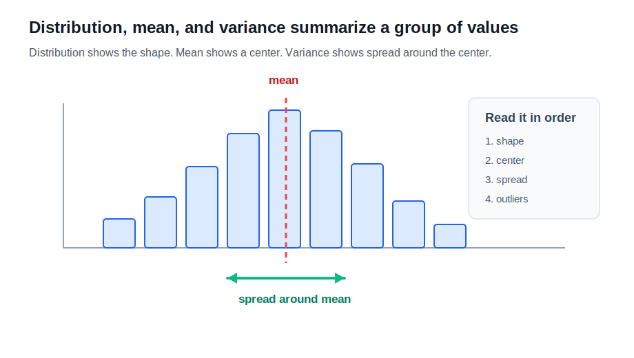
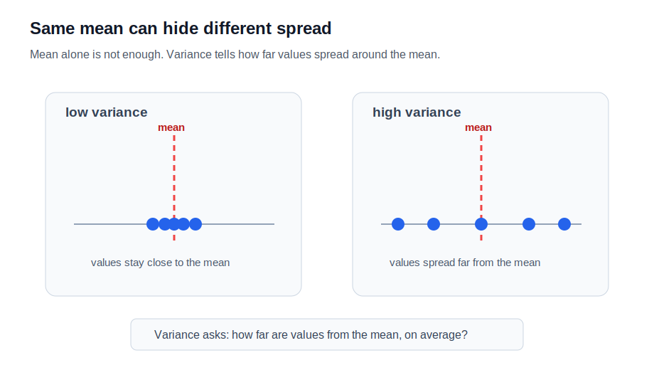

# P2-5.2 분포(distribution), 평균(mean), 분산(variance)

P2-5.1에서는 확률(probability)을 불확실성(uncertainty)을 숫자로 표현하는 언어로 봤습니다. 이제 그 숫자들이 여러 개 모였을 때 무엇을 봐야 하는지로 넘어갑니다.

데이터 하나만 보면 값 하나를 읽으면 됩니다. 하지만 AI에서는 보통 값 하나가 아니라 값의 묶음을 다룹니다.

```text
학생 한 명의 점수
-> 값 하나

학생 100명의 점수
-> 데이터 묶음

사용자 한 명의 클릭 여부
-> 값 하나

사용자 10만 명의 클릭 기록
-> 데이터 묶음
```

분포(distribution), 평균(mean), 분산(variance)은 이 데이터 묶음을 읽기 위한 기본 도구입니다.

```text
분포
-> 값들이 어떤 모양으로 놓여 있는가

평균
-> 값들의 대표 중심을 어디로 볼 것인가

분산
-> 값들이 중심 주변에 얼마나 퍼져 있는가
```

## 이 절의 범위

이 절은 데이터 묶음의 모양과 요약을 다룹니다.

다음 내용은 깊게 다루지 않습니다.

- 정규분포(normal distribution)의 성질
- 확률밀도함수(probability density function)
- 표준편차(standard deviation)의 세부 활용
- 공분산(covariance)과 상관계수(correlation coefficient)
- 통계적 추론(statistical inference)

이 내용은 이후 통계, 머신러닝 평가, 데이터 분석에서 다시 등장합니다. 여기서는 분포, 평균, 분산을 “AI 문서를 읽기 위한 최소 통계 언어”로 복구합니다.

이 절에서는 다음 질문에 집중합니다.

```text
데이터 묶음의 모양을 왜 봐야 하는가?
평균은 무엇을 대표하는가?
평균만 보면 왜 부족한가?
분산은 퍼짐을 어떻게 설명하는가?
AI에서 분포와 평균, 분산은 어디에서 다시 등장하는가?
```

## 이 절의 목표

- 분포(distribution)를 값들이 놓인 모양으로 설명할 수 있습니다.
- 평균(mean)을 여러 값을 하나의 대표 중심으로 요약한 값으로 설명할 수 있습니다.
- 분산(variance)을 값들이 평균 주변에 얼마나 퍼져 있는지 나타내는 값으로 설명할 수 있습니다.
- 평균이 같아도 분산이 다르면 데이터의 성격이 달라질 수 있음을 설명할 수 있습니다.
- 데이터 분포(data distribution)와 확률분포(probability distribution)를 입문 수준에서 구분할 수 있습니다.
- AI 모델 학습과 평가에서 평균과 분산이 왜 반복해서 등장하는지 설명할 수 있습니다.

## 분포는 값들의 모양이다

분포(distribution)는 값들이 어떻게 놓여 있는지를 말합니다.

예를 들어 시험 점수 10개가 있다고 하겠습니다.

```text
40, 45, 48, 50, 52, 55, 58, 60, 62, 90
```

이 값을 하나씩 보면 숫자 목록입니다. 하지만 분포 관점으로 보면 질문이 달라집니다.

```text
값들이 낮은 쪽에 몰려 있는가?
높은 쪽에 몰려 있는가?
중간에 많이 모여 있는가?
양쪽으로 넓게 퍼져 있는가?
특별히 튀는 값이 있는가?
```

분포는 값의 목록을 “모양”으로 바꾸어 읽게 해 줍니다. 그래서 히스토그램(histogram), 막대그래프(bar chart), 밀도 곡선(density curve) 같은 시각화가 함께 등장합니다.

아래 차트는 분포, 평균, 분산을 읽는 순서를 보여 줍니다. 먼저 전체 모양을 보고, 그다음 중심과 퍼짐을 봅니다.



## 데이터 분포와 확률분포를 구분한다

분포라는 말은 여러 문맥에서 쓰입니다. 입문 단계에서는 두 가지를 구분하면 좋습니다.

| 표현 | 영어 | 작업용 설명 |
| --- | --- | --- |
| 데이터 분포 | data distribution | 실제로 관측한 데이터 값들이 놓인 모양 |
| 확률분포 | probability distribution | 가능한 값들에 확률을 배정한 수학적 표현 |

예를 들어 사용자 나이 데이터가 실제로 10만 개 있다고 하겠습니다. 이 값을 히스토그램으로 그리면 데이터 분포를 볼 수 있습니다.

반면 “어떤 값이 나올 가능성이 얼마나 되는가”를 수학적으로 표현하면 확률분포입니다.

```text
데이터 분포
-> 이미 모은 값들이 어떻게 놓였는가

확률분포
-> 가능한 값들이 어떤 가능성으로 나올 것인가
```

둘은 연결되어 있지만 같은 말은 아닙니다. 실제 데이터 분포를 보고 확률분포를 가정하거나 추정할 수 있지만, 관측 데이터 자체가 곧 완전한 확률분포라는 뜻은 아닙니다.

AI에서는 이 구분이 중요합니다.

```text
학습 데이터의 분포
-> 모델이 실제로 본 데이터의 모양

현실 세계의 분포
-> 모델이 앞으로 만날 가능성이 있는 데이터의 모양

두 분포가 다르면
-> 모델 성능이 흔들릴 수 있다.
```

이 문제는 이후 데이터셋(dataset), 일반화(generalization), 분포 이동(distribution shift)을 배울 때 다시 등장합니다.

## 평균은 중심을 하나로 요약한다

평균(mean)은 여러 값을 하나의 대표 중심으로 요약한 값입니다.

예를 들어 다음 값들이 있다고 하겠습니다.

```text
2, 4, 6, 8, 10
```

평균은 모든 값을 더한 뒤 값의 개수로 나눕니다.

\[
\text{mean} = \frac{2 + 4 + 6 + 8 + 10}{5} = 6
\]

시그마(sigma) 표기로 쓰면 다음과 같습니다.

\[
\bar{x} = \frac{1}{n}\sum_{i=1}^{n}x_i
\]

이 식은 P2-2.2에서 봤던 시그마와 연결됩니다.

```text
모든 값을 더한다.
값의 개수로 나눈다.
데이터 묶음의 중심을 하나의 숫자로 요약한다.
```

평균은 매우 자주 쓰입니다. 이유는 단순합니다. 많은 값을 하나의 숫자로 압축해 비교할 수 있기 때문입니다.

```text
이번 달 평균 응답 시간
사용자당 평균 클릭 수
배치(batch)의 평균 손실
모델의 평균 정확도
```

하지만 평균은 데이터의 모든 특징을 말해 주지는 않습니다.

## 평균은 편리하지만 위험할 수 있다

평균은 중심을 빠르게 보여 주지만, 값의 모양을 숨길 수 있습니다.

예를 들어 두 데이터 묶음이 있다고 하겠습니다.

```text
A: 4, 5, 6, 7, 8
B: 0, 2, 6, 10, 12
```

두 묶음의 평균은 모두 6입니다.

\[
\text{mean}(A) = 6,\quad \text{mean}(B) = 6
\]

하지만 두 데이터는 같은 성격으로 보이지 않습니다.

```text
A
-> 값들이 평균 근처에 모여 있다.

B
-> 값들이 평균에서 멀리 퍼져 있다.
```

평균만 보면 두 데이터가 비슷해 보일 수 있습니다. 하지만 실제로는 안정성, 예측 가능성, 위험이 다를 수 있습니다.

아래 차트는 평균이 같아도 퍼짐이 다를 수 있음을 보여 줍니다.



## 분산은 퍼짐을 설명한다

분산(variance)은 값들이 평균 주변에 얼마나 퍼져 있는지 나타내는 값입니다.

입문 단계에서는 다음 질문으로 이해하면 됩니다.

```text
각 값은 평균에서 얼마나 떨어져 있는가?
그 떨어진 정도가 전반적으로 큰가, 작은가?
```

분산을 계산하는 대표적인 흐름은 다음과 같습니다.

```text
1. 평균을 구한다.
2. 각 값에서 평균을 뺀다.
3. 그 차이를 제곱한다.
4. 제곱한 값을 평균낸다.
```

수식으로는 다음처럼 쓸 수 있습니다.

\[
\mathrm{Var}(X) = \frac{1}{n}\sum_{i=1}^{n}(x_i - \bar{x})^2
\]

여기서 중요한 것은 공식을 외우는 것이 아닙니다. 분산이 보려는 질문입니다.

```text
평균에서 얼마나 멀리 떨어져 있는가?
그 떨어짐을 전체적으로 요약하면 어느 정도인가?
```

왜 차이를 제곱하는지는 나중에 더 깊게 다룰 수 있습니다. 지금은 다음 정도로 이해하면 충분합니다.

```text
평균보다 큰 값
-> 차이가 양수

평균보다 작은 값
-> 차이가 음수

그냥 더하면 서로 상쇄될 수 있다.
제곱하면 떨어진 정도를 양수로 모을 수 있다.
```

## 작은 예시로 평균과 분산을 같이 읽기

두 데이터 묶음을 다시 보겠습니다.

```text
A: 4, 5, 6, 7, 8
B: 0, 2, 6, 10, 12
```

둘 다 평균은 6입니다.

하지만 평균에서 얼마나 떨어져 있는지는 다릅니다.

```text
A의 평균과 차이
4 -> -2
5 -> -1
6 ->  0
7 ->  1
8 ->  2

B의 평균과 차이
0  -> -6
2  -> -4
6  ->  0
10 ->  4
12 ->  6
```

B는 평균에서 더 멀리 떨어진 값이 많습니다. 그래서 B의 분산은 A보다 큽니다.

이 예시에서 기억할 점은 하나입니다.

```text
평균은 중심을 말한다.
분산은 중심에서 얼마나 흩어졌는지 말한다.
```

## 분산과 표준편차는 어떻게 연결되는가

분산(variance)을 배우면 표준편차(standard deviation)도 자주 만납니다.

표준편차는 분산의 제곱근입니다.

\[
\text{standard deviation} = \sqrt{\text{variance}}
\]

이 절에서는 표준편차를 깊게 다루지 않습니다. 다만 이름을 봤을 때 다음 정도로 연결하면 됩니다.

```text
분산
-> 평균에서 떨어진 정도를 제곱해서 요약한 값

표준편차
-> 분산에 제곱근을 취해 원래 값의 단위에 더 가깝게 돌린 값
```

예를 들어 데이터가 `초`, `원`, `점수` 같은 단위를 가질 때 분산은 단위가 제곱된 형태로 해석될 수 있습니다. 표준편차는 이 문제를 완화해 실제 값의 규모와 더 직접적으로 비교하기 쉽게 합니다.

지금은 표준편차를 “분산과 함께 퍼짐을 설명하는 대표 도구” 정도로만 기억해도 충분합니다.

## AI에서는 어디에서 다시 등장하는가

분포, 평균, 분산은 AI 곳곳에서 다시 등장합니다.

데이터 준비에서는 입력 데이터의 분포를 확인합니다.

```text
훈련 데이터와 테스트 데이터의 분포가 비슷한가?
특정 값에 지나치게 몰려 있지 않은가?
이상치(outlier)가 많은가?
```

학습 과정에서는 손실(loss)의 평균을 자주 봅니다.

```text
샘플 하나의 손실
-> 값 하나

배치의 평균 손실
-> 여러 샘플 손실의 요약
```

평가에서는 여러 결과의 평균과 변동성을 함께 봅니다.

```text
평균 정확도는 높은가?
실험마다 결과가 많이 흔들리는가?
특정 데이터 그룹에서 성능이 유난히 낮은가?
```

딥러닝에서는 정규화(normalization), 초기화(initialization), 최적화(optimization)에서도 평균과 분산이 반복해서 등장합니다. 지금 모든 세부 구현을 알 필요는 없습니다. 다만 평균과 분산이 단순 통계 과목의 용어가 아니라, 모델이 데이터를 다루는 방식과 깊게 연결된다는 점은 기억해 둘 필요가 있습니다.

## 이 절에서 기억할 관점

분포, 평균, 분산은 데이터 묶음을 읽는 세 가지 기본 질문입니다.

```text
분포
-> 값들이 어떤 모양으로 놓여 있는가?

평균
-> 중심을 어디로 볼 것인가?

분산
-> 중심 주변에 얼마나 퍼져 있는가?
```

평균만 보면 데이터의 차이를 놓칠 수 있습니다. 분포를 보고, 평균을 보고, 분산을 함께 봐야 데이터 묶음의 성격을 더 안전하게 읽을 수 있습니다.

AI에서는 이 관점이 더 중요합니다. 모델은 값 하나가 아니라 데이터 묶음에서 패턴을 찾기 때문입니다.

## 체크리스트

- 분포(distribution)를 값들이 놓인 모양으로 설명할 수 있다.
- 데이터 분포(data distribution)와 확률분포(probability distribution)를 구분할 수 있다.
- 평균(mean)을 여러 값을 하나의 중심으로 요약한 값으로 설명할 수 있다.
- 평균만으로는 데이터의 퍼짐과 이상치를 알기 어렵다는 점을 설명할 수 있다.
- 분산(variance)을 값들이 평균 주변에 얼마나 퍼져 있는지 나타내는 값으로 설명할 수 있다.
- 평균이 같아도 분산이 다르면 데이터의 성격이 달라질 수 있음을 설명할 수 있다.
- 분산과 표준편차(standard deviation)의 관계를 입문 수준에서 설명할 수 있다.
- 평균 손실(mean loss), 데이터 분포(data distribution), 분포 이동(distribution shift)이 이후 AI 학습에서 다시 등장함을 말할 수 있다.

## 출처와 참고 자료

- Barbara Illowsky, Susan Dean, [Introductory Statistics, 2.2 Histograms, Frequency Polygons, and Time Series Graphs](https://openstax.org/books/introductory-statistics/pages/2-2-histograms-frequency-polygons-and-time-series-graphs){: target="_blank" rel="noopener noreferrer" }, OpenStax, 확인 날짜: 2026-06-24.
- Barbara Illowsky, Susan Dean, [Introductory Statistics, 2.5 Measures of the Center of the Data](https://openstax.org/books/introductory-statistics/pages/2-5-measures-of-the-center-of-the-data){: target="_blank" rel="noopener noreferrer" }, OpenStax, 확인 날짜: 2026-06-24.
- Barbara Illowsky, Susan Dean, [Introductory Statistics, 2.7 Measures of the Spread of the Data](https://openstax.org/books/introductory-statistics/pages/2-7-measures-of-the-spread-of-the-data){: target="_blank" rel="noopener noreferrer" }, OpenStax, 확인 날짜: 2026-06-24.
