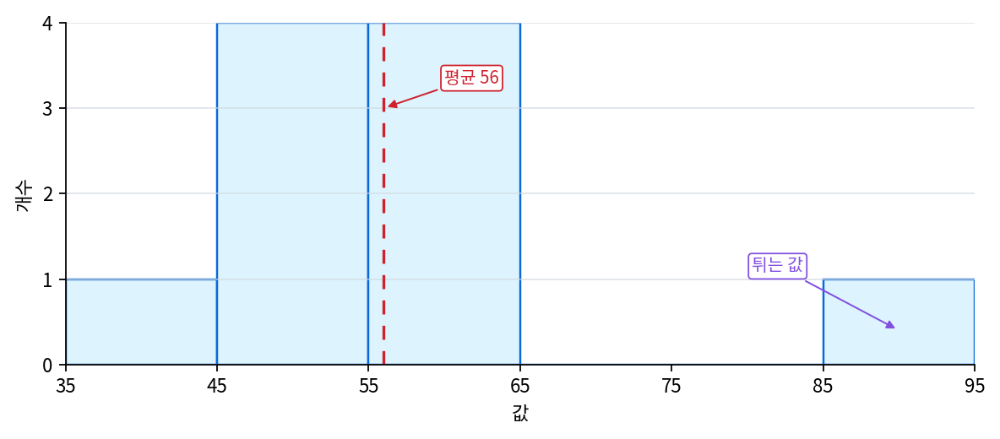
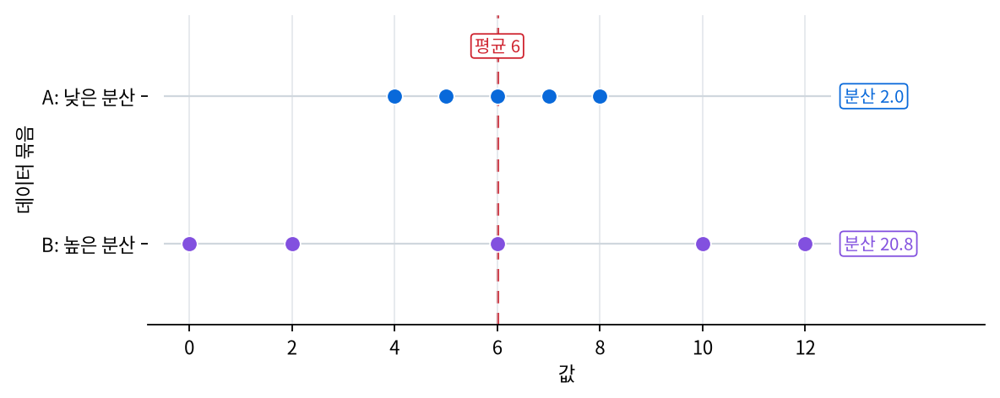

# P2-5.2 분포(distribution), 평균(mean), 분산(variance)

> Section ID: `P2-5.2`
> Version: `v2026.07.20`

P2-5.1에서는 확률(probability)을 불확실성(uncertainty)을 숫자로 표현하는 언어로 봤습니다. 이제 그 숫자들이 여러 개 모였을 때 무엇을 봐야 하는지로 넘어갑니다.

데이터 하나만 보면 값 하나를 읽습니다. 하지만 AI에서는 보통 값 하나가 아니라 값의 묶음을 다룹니다. 학생 한 명의 점수나 사용자 한 명의 클릭 여부는 값 하나이지만, 학생 100명의 점수나 사용자 10만 명의 클릭 기록은 데이터 묶음입니다.

분포(distribution), 평균(mean), 분산(variance)은 이 데이터 묶음을 읽기 위한 기본 도구입니다. 분포는 값들이 어떤 모양으로 놓여 있는지, 평균은 값들의 대표 중심을 어디로 볼지, 분산은 값들이 중심 주변에 얼마나 퍼져 있는지를 보여 줍니다.

여기서는 `분포(distribution)`, `평균(mean)`, `분산(variance)`, `중심(center)`, `퍼짐(spread)`을 다시 정리합니다. 5.1에서 불확실성을 확률 숫자로 읽었다면, 값의 묶음을 어떤 모양과 요약값으로 읽어야 하는지 정리합니다.

여기서는 통계 공식을 세세하게 계산하기보다, 데이터 묶음의 모양과 중심과 퍼짐을 읽는 데 집중합니다. 여기서 분포, 평균, 분산의 역할을 구분해 두면, 뒤에서 평균 손실(mean loss), 데이터 분포(data distribution), 분포 이동(distribution shift) 같은 표현이 나와도 모두 같은 지도 안에서 읽을 수 있습니다.

| 지금 이 절에서 잡을 것 | 바로 다음에 이어질 질문 | 이후 다시 쓰이는 위치 |
| --- | --- | --- |
| 분포, 평균, 분산이 같은 데이터를 다른 각도에서 읽는 도구라는 점 | P2-5.3에서 표본과 추정 질문으로 이어집니다. | Part 3의 데이터 분할, 일반화, 평가 지표 해석에서 다시 씁니다. |
| 데이터 분포와 확률분포의 차이 | P2-5.5 보충학습에서 표준편차와 상관 개념으로 확장합니다. | 분포 이동(distribution shift)과 데이터셋 점검 문맥에서 다시 등장합니다. |
| 평균만으로는 부족하고 퍼짐도 봐야 한다는 점 | `P2-5.3`에서 표본 변동과 추정 오차 질문으로 넘어갑니다. | 평균 손실, 배치 통계, 정규화 같은 모델 학습 설명으로 이어집니다. |

## 이 절의 목표

- 분포(distribution)를 값들이 놓인 모양으로 설명할 수 있습니다.
- 평균(mean)을 여러 값을 하나의 대표 중심으로 요약한 값으로 설명할 수 있습니다.
- 분산(variance)을 값들이 평균 주변에 얼마나 퍼져 있는지 나타내는 값으로 설명할 수 있습니다.
- 평균이 같아도 분산이 다르면 데이터의 성격이 달라질 수 있음을 설명할 수 있습니다.
- 데이터 분포(data distribution)와 확률분포(probability distribution)를 입문 수준에서 구분할 수 있습니다.

## 먼저 붙잡을 한 장면

이 절에서 가장 먼저 붙잡아야 할 장면은 `평균은 같은데 데이터 느낌은 다른 두 묶음`입니다.

| 데이터 묶음 | 평균 | 지금 붙잡을 질문 |
| --- | --- | --- |
| `A: 4, 5, 6, 7, 8` | `6` | 값이 중심 근처에 모여 있는가 |
| `B: 0, 2, 6, 10, 12` | `6` | 값이 중심에서 멀리 퍼져 있는가 |

즉 평균(mean)만 같다고 같은 데이터는 아닙니다. 이 절의 핵심은 `먼저 분포를 보고, 그다음 평균을 보고, 마지막으로 분산을 본다`는 읽기 순서를 붙잡는 일입니다.

## 세 가지 기준

| 기준 | 왜 중요한가 | 이 절에서 필요한 이해 수준 |
| --- | --- | --- |
| 분포는 값들의 모양이다 | 데이터 묶음을 읽을 때 먼저 전체 배치를 봐야 중심과 퍼짐 해석이 가능해지기 때문입니다. | 값들이 어디에 몰리고 얼마나 퍼지는지를 보여 주는 모양으로 이해합니다. |
| 평균은 중심을 하나로 요약한다 | 많은 값을 비교 가능한 하나의 숫자로 압축해야 하기 때문입니다. | 평균을 대표 중심값으로 이해합니다. |
| 분산은 퍼짐을 따로 드러낸다 | 평균만으로는 같은 중심을 가진 다른 데이터 묶음을 구분할 수 없기 때문입니다. | 분산을 평균 주변에 얼마나 흩어져 있는지 보여 주는 값으로 이해합니다. |

이 세 기준을 실제 읽기 순서로 다시 쓰면 다음과 같습니다.

| 읽기 순서 | 먼저 물을 질문 |
| --- | --- |
| 분포(distribution) | 값들이 어디에 몰리고 어디가 비어 있는가 |
| 평균(mean) | 대표 중심을 하나로 적으면 어디인가 |
| 분산(variance) | 그 중심 주변에 얼마나 퍼져 있는가 |

## 분포는 값들의 모양이다

분포(distribution)는 값들이 어떻게 놓여 있는지를 말합니다.

예를 들어 시험 점수 10개가 있다고 하겠습니다.

`40, 45, 48, 50, 52, 55, 58, 60, 62, 90`

이 값을 하나씩 보면 숫자 목록입니다. 하지만 분포 관점으로 보면 다음 질문이 중요해집니다.

- 값들이 낮은 쪽에 몰려 있는가?
- 높은 쪽에 몰려 있는가?
- 중간에 많이 모여 있는가?
- 양쪽으로 넓게 퍼져 있는가?
- 특별히 튀는 값이 있는가?

분포는 값의 목록을 “모양”으로 바꾸어 읽게 해 줍니다. 그래서 히스토그램(histogram), 막대그래프(bar chart), 밀도 곡선(density curve) 같은 시각화가 함께 등장합니다.

아래 차트는 분포, 평균, 분산을 읽는 순서를 보여 줍니다. 먼저 전체 모양을 보고, 그다음 중심과 퍼짐을 봅니다.

## 데이터 분포와 확률분포를 구분한다

분포라는 말은 여러 문맥에서 쓰입니다. 여기서는 두 가지를 먼저 구분해 두어야 합니다.

| 표현 | 영어 | 작업용 설명 |
| --- | --- | --- |
| 데이터 분포 | data distribution | 실제로 관측한 데이터 값들이 놓인 모양 |
| 확률분포 | probability distribution | 가능한 값들에 확률을 배정한 수학적 표현 |

예를 들어 사용자 나이 데이터가 실제로 10만 개 있다고 하겠습니다. 이 값을 히스토그램으로 그리면 데이터 분포를 볼 수 있습니다.

반면 “어떤 값이 나올 가능성이 얼마나 되는가”를 수학적으로 표현하면 확률분포입니다.

데이터 분포는 이미 모은 값들이 어떻게 놓였는가를 말하고, 확률분포는 가능한 값들이 어떤 가능성으로 나올 것인가를 말합니다.

둘은 연결되어 있지만 같은 말은 아닙니다. 실제 데이터 분포를 보고 확률분포를 가정하거나 추정할 수 있지만, 관측 데이터 자체가 곧 완전한 확률분포라는 뜻은 아닙니다.

AI에서는 이 구분이 중요합니다. 학습 데이터의 분포는 모델이 실제로 본 데이터의 모양이고, 현실 세계의 분포는 모델이 앞으로 만날 가능성이 있는 데이터의 모양입니다. 두 분포가 다르면 모델 성능이 흔들릴 수 있습니다.

이 문제는 P2-12.3의 데이터셋(dataset) 준비, P3-5의 일반화(generalization), 그리고 Part 6 프로젝트에서 데이터 분포를 점검하는 문맥에서 다시 등장합니다.

## 평균은 중심을 하나로 요약한다

평균(mean)은 여러 값을 하나의 대표 중심으로 요약한 값입니다.

예를 들어 다음 값들이 있다고 하겠습니다.

`2, 4, 6, 8, 10`

평균은 모든 값을 더한 뒤 값의 개수로 나눕니다.

\[
\text{mean} = \frac{2 + 4 + 6 + 8 + 10}{5} = 6
\]

시그마(sigma) 표기로 쓰면 다음과 같습니다.

\[
\bar{x} = \frac{1}{n}\sum_{i=1}^{n}x_i
\]

이 식은 P2-2.2에서 봤던 시그마와 연결됩니다. 즉 모든 값을 더하고 값의 개수로 나누어 데이터 묶음의 중심을 하나의 숫자로 요약합니다.

평균은 매우 자주 쓰입니다. 이유는 단순합니다. 많은 값을 하나의 숫자로 압축해 비교할 수 있기 때문입니다. 예를 들어 이번 달 평균 응답 시간, 사용자당 평균 클릭 수, 배치(batch)의 평균 손실, 모델의 평균 정확도가 모두 이런 방식으로 읽힙니다.

하지만 평균은 데이터의 모든 특징을 말해 주지는 않습니다.

## 평균은 편리하지만 위험할 수 있다

평균은 중심을 빠르게 보여 주지만, 값의 모양을 숨길 수 있습니다.

예를 들어 두 데이터 묶음이 있다고 하겠습니다.

`A: 4, 5, 6, 7, 8`, `B: 0, 2, 6, 10, 12`

두 묶음의 평균은 모두 6입니다.

\[
\text{mean}(A) = 6,\quad \text{mean}(B) = 6
\]

하지만 두 데이터는 같은 성격으로 보이지 않습니다. `A`는 값들이 평균 근처에 모여 있고, `B`는 값들이 평균에서 멀리 퍼져 있습니다.

평균만 보면 두 데이터가 비슷해 보일 수 있습니다. 하지만 실제로는 안정성, 예측 가능성, 위험이 다를 수 있습니다.

아래 차트는 평균이 같아도 퍼짐이 다를 수 있음을 보여 줍니다.

이 장면을 더 짧게 다시 요약하면:

| 지금 보는 숫자 | 조심할 점 |
| --- | --- |
| 평균 하나 | 중심만 보여 준다 |
| 분산 하나 | 퍼짐만 보여 준다 |
| 분포 + 평균 + 분산 | 데이터 묶음의 성격을 더 같이 보여 준다 |

## 사례 및 예시

### 사례 1. 평균 점수는 같은데 학급 분위기가 다른 두 반

두 학급의 평균 점수가 모두 70점이라고 해 보겠습니다. 처음 보면 두 반의 실력이 비슷하다고 느낄 수 있습니다. 하지만 한 반은 대부분 65~75점 사이에 몰려 있고, 다른 반은 30점대와 90점대가 함께 섞여 있을 수 있습니다.

이때 평균(mean)은 두 반 모두 70이라는 같은 중심값을 보여 주지만, 분포(distribution)와 분산(variance)은 전혀 다른 그림을 드러냅니다. 한 반은 평균 주변에 값이 모여 있고, 다른 반은 평균에서 멀리 떨어진 값이 많을 수 있습니다.

이 사례는 왜 평균 하나만 보고 데이터를 이해하면 위험한지를 잘 보여 줍니다. AI에서도 데이터 분포가 한쪽에 몰려 있는지, 값이 넓게 퍼져 있는지, 이상하게 튀는 값이 있는지를 함께 봐야 모델 입력과 결과를 더 정확히 해석할 수 있습니다.

즉 분포, 평균, 분산은 따로 외우는 용어가 아니라 같은 데이터를 서로 다른 각도에서 읽는 도구입니다. 먼저 모양을 보고, 그다음 중심을 보고, 마지막으로 퍼짐을 보아야 데이터 묶음의 성격이 더 선명해집니다.

## 분산은 퍼짐을 설명한다

분산(variance)은 값들이 평균 주변에 얼마나 퍼져 있는지 나타내는 값입니다.

여기서는 각 값이 평균에서 얼마나 떨어져 있는지, 그리고 그 떨어진 정도가 전반적으로 큰지 작은지를 묻는다고 이해합니다.

분산을 계산하는 대표적인 흐름은 다음과 같습니다.

1. 평균을 구한다.
2. 각 값에서 평균을 뺀다.
3. 그 차이를 제곱한다.
4. 제곱한 값을 평균낸다.

수식으로는 다음처럼 쓸 수 있습니다.

\[
\mathrm{Var}(X) = \frac{1}{n}\sum_{i=1}^{n}(x_i - \bar{x})^2
\]

여기서 중요한 것은 공식을 외우는 것이 아니라 분산이 보려는 질문입니다. 평균에서 얼마나 멀리 떨어져 있는지, 그리고 그 떨어짐을 전체적으로 요약하면 어느 정도인지를 보는 것입니다.

왜 차이를 제곱하는지는 나중에 더 깊게 다룰 수 있습니다. 지금은 평균보다 큰 값은 차이가 양수이고, 평균보다 작은 값은 차이가 음수라서 그냥 더하면 서로 상쇄될 수 있지만, 제곱하면 떨어진 정도를 모두 양수로 모을 수 있다고 이해하면 됩니다.

## 작은 예시로 평균과 분산을 같이 읽기

두 데이터 묶음을 다시 보겠습니다. `A: 4, 5, 6, 7, 8`, `B: 0, 2, 6, 10, 12`입니다.

둘 다 평균은 6입니다.

하지만 평균에서 얼마나 떨어져 있는지는 다릅니다. 예를 들어 A에서는 평균과의 차이가 `4 -> -2`, `5 -> -1`, `6 -> 0`, `7 -> 1`, `8 -> 2`로 나타납니다. B에서는 `0 -> -6`, `2 -> -4`, `6 -> 0`, `10 -> 4`, `12 -> 6`으로 더 크게 벌어집니다.

B는 평균에서 더 멀리 떨어진 값이 많습니다. 그래서 B의 분산은 A보다 큽니다.

이 예시에서 기억할 점은 하나입니다. 평균은 중심을 말하고, 분산은 그 중심에서 얼마나 흩어졌는지를 말합니다.

## 분산과 표준편차는 어떻게 연결되는가

분산(variance)을 배우면 표준편차(standard deviation)도 자주 만납니다.

표준편차는 분산의 제곱근입니다.

\[
\text{standard deviation} = \sqrt{\text{variance}}
\]

표준편차와 상관 개념은 P2-5.5 보충학습에서 다시 다룹니다. 여기서는 분산이 평균에서 떨어진 정도를 제곱해서 요약한 값이고, 표준편차는 그 분산에 제곱근을 취해 원래 값의 단위에 더 가깝게 돌린 값이라는 연결만 먼저 붙잡으면 됩니다.

예를 들어 데이터가 `초`, `원`, `점수` 같은 단위를 가질 때 분산은 단위가 제곱된 형태로 해석될 수 있습니다. 표준편차는 이 문제를 완화해 실제 값의 규모와 더 직접적으로 비교하기 쉽게 합니다.

지금은 표준편차를 “분산과 함께 퍼짐을 설명하는 대표 도구”로 기억해 두면 됩니다.

## AI에서는 어디에서 다시 등장하는가

분포, 평균, 분산은 P2-12.3의 데이터셋(dataset) 준비, P3-5의 일반화(generalization), P3-6의 평가 지표, 그리고 Part 6의 프로젝트 데이터 점검에서 다시 등장합니다.

| 뒤에서 다시 만나는 장면 | 여기서 먼저 남길 감각 |
| --- | --- |
| 평균 손실(mean loss) | 여러 오차를 한 중심값으로 요약한다 |
| 데이터 분포(data distribution) | 학습 데이터의 모양이 바뀌면 성능 해석도 흔들릴 수 있다 |
| 분포 이동(distribution shift) | 학습 때 본 데이터 모양과 실제 데이터 모양이 다를 수 있다 |
| 특징 스케일과 퍼짐 | 평균만이 아니라 값의 spread도 같이 봐야 한다 |

데이터 준비에서는 훈련 데이터와 테스트 데이터의 분포가 비슷한지, 특정 값에 지나치게 몰려 있지 않은지, 이상치(outlier)가 많은지를 확인합니다.

학습 과정에서는 샘플 하나의 손실은 값 하나로 보고, 배치의 평균 손실은 여러 샘플 손실을 요약한 값으로 읽습니다.

평가에서는 평균 정확도가 높은지, 실험마다 결과가 많이 흔들리는지, 특정 데이터 그룹에서 성능이 유난히 낮은지를 함께 봅니다.

딥러닝에서는 정규화(normalization), 초기화(initialization), 최적화(optimization)에서도 평균과 분산이 반복해서 등장합니다. 지금 모든 세부 구현을 알 필요는 없습니다. 다만 평균과 분산이 단순 통계 과목의 용어가 아니라, 모델이 데이터를 다루는 방식과 깊게 연결된다는 점은 기억해 둘 필요가 있습니다.

## 체크리스트

- 분포, 평균, 분산이 각각 무엇을 보는지 한 문장씩 설명할 수 있는가?
- 평균이 같아도 데이터가 다를 수 있는 이유를 말할 수 있는가?
- 데이터 분포와 확률분포의 차이를 입문 수준에서 설명할 수 있는가?
- 뒤에서 평균 손실이나 분포 이동이 나왔을 때 왜 이 절로 돌아와야 하는지 말할 수 있는가?
- 분포(distribution)를 값들이 놓인 모양으로 설명할 수 있다.
- 데이터 분포(data distribution)와 확률분포(probability distribution)를 구분할 수 있다.
- 평균(mean)을 여러 값을 하나의 중심으로 요약한 값으로 설명할 수 있다.
- 평균만으로는 데이터의 퍼짐과 이상치를 알기 어렵다는 점을 설명할 수 있다.
- 분산(variance)을 값들이 평균 주변에 얼마나 퍼져 있는지 나타내는 값으로 설명할 수 있다.
- 평균이 같아도 분산이 다르면 데이터의 성격이 달라질 수 있음을 설명할 수 있다.
- 분산과 표준편차(standard deviation)의 관계를 입문 수준에서 설명할 수 있다.
- 평균 손실(mean loss), 데이터 분포(data distribution), 분포 이동(distribution shift)이 이후 AI 학습에서 다시 등장함을 말할 수 있다.

## 출처와 참고 자료

- Barbara Illowsky, Susan Dean, [Introductory Statistics, 2.2 Histograms, Frequency Polygons, and Time Series Graphs](https://openstax.org/books/introductory-statistics/pages/2-2-histograms-frequency-polygons-and-time-series-graphs){: target="_blank" rel="noopener noreferrer" }, OpenStax, 확인 날짜: 2026-07-20. 히스토그램을 통해 큰 데이터 묶음의 모양, 중심, 퍼짐을 읽는다는 설명 확인에 사용했다.
- Barbara Illowsky, Susan Dean, [Introductory Statistics, 2.5 Measures of the Center of the Data](https://openstax.org/books/introductory-statistics/pages/2-5-measures-of-the-center-of-the-data){: target="_blank" rel="noopener noreferrer" }, OpenStax, 확인 날짜: 2026-07-20. 평균(mean)을 데이터 중심의 대표값으로 설명하는 근거로 사용했다.
- Barbara Illowsky, Susan Dean, [Introductory Statistics, 2.7 Measures of the Spread of the Data](https://openstax.org/books/introductory-statistics/pages/2-7-measures-of-the-spread-of-the-data){: target="_blank" rel="noopener noreferrer" }, OpenStax, 확인 날짜: 2026-07-20. 분산과 표준편차가 평균 주변의 퍼짐, 제곱 편차, 원래 단위와 연결되는 설명 확인에 사용했다.
