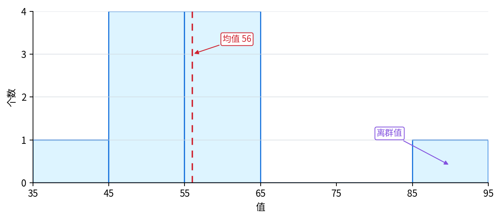
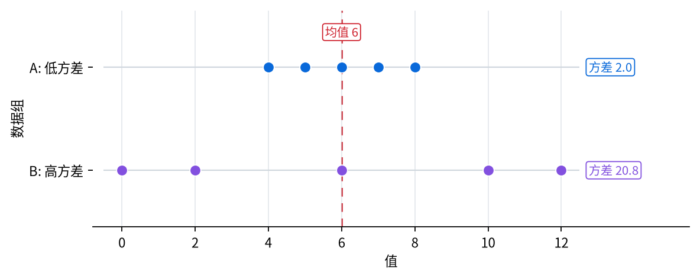

# P2-5.2 分布(distribution)、均值(mean)、方差(variance)

> Section ID: `P2-5.2`
> Version: `v2026.07.20`

在 P2-5.1 中，我们把概率(probability)看成是“把不确定性(uncertainty)表示成数字的语言”。现在问题要再往前走一步：当这些数字不是一个，而是很多个聚在一起时，我们首先该看什么？

看单个数据时，我们读的是一个值。但在 AI 里，我们通常处理的不是一个值，而是一组值。一个学生的分数、一个用户是否点击，都是一个值；而 100 个学生的分数、10 万个用户的点击记录，则是一整组数据。

分布(distribution)、均值(mean)、方差(variance)就是用来读取这组数据的基础工具。分布告诉我们值整体摆成了什么样子，均值告诉我们要把代表中心放在哪里，方差告诉我们值在这个中心周围散得有多开。

本节重新整理 `分布(distribution)`、`均值(mean)`、`方差(variance)`、`中心(center)`、`扩散(spread)`。如果说 5.1 是用概率数字来读取不确定性，那么这里就是在整理：面对一整组值时，应该怎样通过形状与摘要值来读取它们。

这里不会把重点放在细算统计公式，而是放在读懂一组数据的形状、中心与扩散。只要在这里先区分清楚分布、均值、方差各自的角色，那么后面遇到 `mean loss`、`data distribution`、`distribution shift` 这些表达时，就都还能在同一张地图上读。

| 现在本节要抓住的内容 | 紧接着会接到的问题 | 之后再次使用的位置 |
| --- | --- | --- |
| 分布、均值、方差是从不同角度读取同一份数据的工具 | 它会接到 P2-5.3 里的样本与估计问题。 | 在 Part 3 的数据划分、泛化、评估指标解释里会再次使用。 |
| 数据分布与概率分布的差别 | 它会在 P2-5.5 补充学习中扩展成标准差与相关概念。 | 会在分布偏移(distribution shift)和数据集检查语境里再次出现。 |
| 只看均值还不够，还要看扩散程度 | 它会走向 `P2-5.3` 里的样本波动和估计误差问题。 | 会继续接到平均损失、batch 统计、normalization 等学习说明。 |

## 核心判断标准：分布(distribution)、均值(mean)、方差(variance)

- 你可以把分布(distribution)解释成值摆放出来的形状。
- 你可以把均值(mean)解释成把很多值总结成一个代表中心的值。
- 你可以把方差(variance)解释成值在均值周围散开多少的值。
- 你可以说明：即使均值相同，只要方差不同，数据的性质也可能不同。
- 你可以在入门水平上区分数据分布(data distribution)和概率分布(probability distribution)。

## 先抓住的一个画面

本节最先要抓住的画面是：`均值一样，但数据感觉不同的两组值。`

| 数据组 | 均值 | 现在先抓住的问题 |
| --- | --- | --- |
| `A: 4, 5, 6, 7, 8` | `6` | 值是不是都集中在中心附近？ |
| `B: 0, 2, 6, 10, 12` | `6` | 值是不是离中心很远地散开了？ |

也就是说，均值(mean)相同，并不表示数据就相同。本节的核心，是抓住这样一种读取顺序：`先看分布，再看均值，最后看方差。`

## 三个判断标准

| 标准 | 为什么重要 | 本节需要达到的理解程度 |
| --- | --- | --- |
| 分布是值的形状 | 因为要读一组数据，必须先看整体摆放，才能解释中心和扩散。 | 理解分布是在显示值都聚在哪里、散得多开。 |
| 均值把中心压成一个值 | 因为要比较很多值，就需要一个可以对比的代表数字。 | 理解均值是代表性的中心值。 |
| 方差把扩散单独揭露出来 | 因为只看均值，没法区分中心相同却性质不同的数据组。 | 理解方差是在显示值在均值周围散得有多开。 |

如果把这三个标准改写成实际的读取顺序，就会变成下面这样。

| 读取顺序 | 先问的问题 |
| --- | --- |
| 分布(distribution) | 值集中在哪里，哪里是空的？ |
| 均值(mean) | 如果只写一个代表中心，它在哪里？ |
| 方差(variance) | 围绕这个中心，散开得有多远？ |

## 分布是值的形状

分布(distribution)说的是：值是怎样摆出来的。

假设有 10 个考试分数。

`40, 45, 48, 50, 52, 55, 58, 60, 62, 90`

如果一个一个看，它们只是数字列表。但从分布的角度看，下面这些问题会更重要。

- 值是不是集中在较低的一侧？
- 是不是集中在较高的一侧？
- 是不是很多值都堆在中间？
- 是不是向两边散得很开？
- 有没有特别突出、显得异常的值？

分布会让我们把一串数字，读成一种“形状”。所以像直方图(histogram)、条形图(bar chart)、密度曲线(density curve)这样的可视化会一起出现。

下面这张图展示的是：应该按什么顺序去看分布、均值和方差。我们先看整体形状，再看中心和扩散。

## 要区分数据分布和概率分布

“分布”这个词会在多个语境里出现。这里必须先把两种意思分开。

| 表达 | 英语 | 工作用解释 |
| --- | --- | --- |
| 数据分布 | data distribution | 实际观测到的数据值是怎样摆出来的 |
| 概率分布 | probability distribution | 给可能取值分配概率的数学表达 |

例如，假设真实收集到了 10 万个用户年龄数据。如果把这些值画成直方图，我们看到的是数据分布。

而如果我们是在数学上表达“某个值出现的可能性是多少”，那读的是概率分布。

数据分布说的是：已经收集到的值是怎样摆放的；概率分布说的是：可能取值会以什么样的可能性出现。

它们彼此有关，但并不是同一个东西。我们可以看实际数据分布，然后去假设或估计一个概率分布，但这并不表示观测到的数据本身就等于完整的概率分布。

在 AI 里，这个区分很重要。训练数据的分布，是模型真正见过的数据形状；而现实世界的分布，是模型之后可能会遇到的数据形状。如果这两种分布不同，模型性能就可能变得不稳定。

这个问题会在 P2-12.3 的数据集(dataset)准备、P3-5 的泛化(generalization)、以及 Part 6 的数据分布检查里再次出现。

## 均值把中心总结成一个值

均值(mean)是把很多值总结成一个代表中心的值。

假设有下面这些值。

`2, 4, 6, 8, 10`

均值的做法是：把所有值加起来，再除以值的个数。

\[
\text{mean} = \frac{2 + 4 + 6 + 8 + 10}{5} = 6
\]

如果用 sigma 记号写，就是：

\[
\bar{x} = \frac{1}{n}\sum_{i=1}^{n}x_i
\]

这个式子和我们在 P2-2.2 看过的 sigma 是连着的。也就是说，我们把所有值加总后，再除以值的个数，就能把这组数据的中心压缩成一个数字。

均值之所以被大量使用，原因很简单：它能把很多值压成一个可以比较的数字。比如本月平均响应时间、每个用户平均点击次数、一个 batch 的平均损失、模型的平均准确率，都是这样读取的。

但均值并不会把数据的所有特点都告诉你。

## 均值很方便，但也可能有危险

均值能很快显示出中心，但它也可能把值的形状隐藏起来。

假设有两组数据。

`A: 4, 5, 6, 7, 8`, `B: 0, 2, 6, 10, 12`

这两组的均值都是 6。

\[
\text{mean}(A) = 6,\quad \text{mean}(B) = 6
\]

但这两组数据显然不会给人同样的感觉。`A` 的值集中在均值附近，而 `B` 的值离均值散得很远。

如果只看均值，两组数据可能会看起来差不多。但实际上，稳定性、可预测性、风险都可能不同。

下面这张图展示的是：即使均值一样，扩散程度也可能完全不同。

如果把这个画面再压缩一点，可以写成：

| 现在看的数字 | 要小心什么 |
| --- | --- |
| 一个均值 | 它只告诉你中心 |
| 一个方差 | 它只告诉你扩散 |
| 分布 + 均值 + 方差 | 它们一起才能更安全地显示出这组数据的特征 |

## 用案例来看

### 案例 1. 两个班级平均分相同，但班级氛围不同

假设两个班级的平均分都等于 70。刚看时，我们可能会觉得两个班的水平差不多。但其中一个班可能大多数分数都集中在 65~75 分之间，而另一个班可能是 30 多分和 90 多分同时混在一起。

这时，均值(mean)对两个班都给出了相同的中心值 70，但分布(distribution)和方差(variance)会揭露完全不同的画面。一个班的值集中在均值附近，而另一个班则可能有很多值离均值很远。

这个案例很好地说明了：为什么只看一个均值来理解数据是有风险的。在 AI 里，我们同样必须一起看数据分布是否偏向某一侧、值是否散得很开、有没有奇怪地跳出来的值，这样才能更准确地解释模型输入和结果。

也就是说，分布、均值、方差并不是分开死记的术语，而是从不同角度读取同一份数据的工具。要先看形状，再看中心，最后看扩散，数据组的性格才会更清楚。

## 方差在说明扩散

方差(variance)是显示值在均值周围散开多大的那个值。

这里可以把它理解成：去问每个值离均值有多远，以及这些距离整体上是大还是小。

计算方差时常见的流程如下。

1. 先求均值。
2. 用每个值减去均值。
3. 把差值平方。
4. 再对这些平方值求平均。

用公式写出来就是：

\[
\mathrm{Var}(X) = \frac{1}{n}\sum_{i=1}^{n}(x_i - \bar{x})^2
\]

这里重要的并不是背下公式，而是看懂方差在问什么。它问的是：值离均值有多远，以及把这种距离整体总结起来之后，到底大到什么程度。

至于为什么要把差值平方，后面当然还可以更深入地处理。现在只要先理解：比均值大的值会给出正差值，比均值小的值会给出负差值，如果直接相加就会互相抵消；而平方后，就能把这些距离都收成正的量。

## 用一个小例子一起读均值和方差

再来看一次这两组数据：`A: 4, 5, 6, 7, 8`，`B: 0, 2, 6, 10, 12`。

它们的均值都等于 6。

但它们离均值的距离不同。例如，A 里和均值的差值分别是 `4 -> -2`、`5 -> -1`、`6 -> 0`、`7 -> 1`、`8 -> 2`。而 B 则变成 `0 -> -6`、`2 -> -4`、`6 -> 0`、`10 -> 4`、`12 -> 6`，明显大得多。

B 中有更多值远离均值。所以 B 的方差会比 A 更大。

这个例子里要记住的一件事是：均值说的是中心，而方差说的是围绕中心散开得有多厉害。

## 方差和标准差是怎样连起来的

一旦学方差(variance)，通常也会很快遇到标准差(standard deviation)。

标准差就是方差的平方根。

\[
\text{standard deviation} = \sqrt{\text{variance}}
\]

这里不会深入处理标准差。标准差和相关概念会在 P2-5.5 补充学习里再次出现。不过当看到这个名字时，先理解成下面这样会很有帮助：方差是把离均值的距离平方后总结起来的值，而标准差则是对这个方差再开平方，让它更接近原始值的单位。

例如，当数据有 `秒`、`韩元`、`分数` 这些单位时，方差会带有“单位被平方”的感觉。标准差则会缓和这个问题，使它更容易和真实值的尺度直接比较。

现在先把标准差记成：`和方差一起用来说明扩散的代表工具` 就足够了。

## 在 AI 里会在哪里再次出现

分布、均值、方差会在 P2-12.3 的数据集(dataset)准备、P3-5 的泛化(generalization)、P3-6 的评估指标、以及 Part 6 的项目数据检查里再次出现。

| 后面再次出现的场景 | 这里先留下的感觉 |
| --- | --- |
| 平均损失(mean loss) | 把很多误差总结成一个中心值 |
| 数据分布(data distribution) | 如果训练数据的形状改变了，性能解释也可能被动摇 |
| 分布偏移(distribution shift) | 训练时见过的数据形状，和真实数据形状可能不同 |
| 特征尺度与扩散 | 不能只看均值，还要一起看值的 spread |

在数据准备里，我们会检查训练数据和测试数据的分布是否相近，某些值是不是过度堆积在某一区域，以及异常值(outlier)是否很多。

在学习过程中，单个样本的损失会被读成一个值，而一个 batch 的平均损失则会被读成许多样本损失的总结。

在评估中，我们会一起看：平均准确率是不是高、不同实验之间结果是不是波动很大、某些数据群体上的性能是不是特别低。

在深度学习里，均值和方差也会反复出现在 normalization、initialization、optimization 中。现在不需要知道所有实现细节，但值得先记住的是：均值和方差不是“统计课才会用的词”，它们和模型怎样处理数据有很深的联系。

## 检查清单

- 你能不能分别用一句话说明分布、均值、方差各自在看什么？
- 你能不能说明：为什么均值一样，数据仍然可能不同？
- 你能不能在入门层级区分数据分布(data distribution)和概率分布(probability distribution)？
- 你能不能说明：后面遇到平均损失或分布偏移时，为什么要重新回到这一节？
- 你可以把分布(distribution)解释成值摆成的形状。
- 你可以区分数据分布(data distribution)和概率分布(probability distribution)。
- 你可以把均值(mean)解释成把很多值总结成一个中心的值。
- 你可以说明：只看均值，很难知道数据散开得多不多，也很难发现异常值。
- 你可以把方差(variance)解释成显示值在均值周围散开多少的值。
- 你可以说明：即使均值一样，只要方差不同，数据的性格也可能改变。
- 你可以在入门层级说明方差和标准差(standard deviation)之间的关系。
- 你可以说出：平均损失(mean loss)、数据分布(data distribution)、分布偏移(distribution shift)会在后面的 AI 学习里再次出现。

## 来源与参考资料

- Barbara Illowsky, Susan Dean, [Introductory Statistics, 2.2 Histograms, Frequency Polygons, and Time Series Graphs](https://openstax.org/books/introductory-statistics/pages/2-2-histograms-frequency-polygons-and-time-series-graphs){: target="_blank" rel="noopener noreferrer" }, OpenStax, 确认日期: 2026-07-20。用于确认通过直方图读取大数据组的形状、中心、扩散这一说明。
- Barbara Illowsky, Susan Dean, [Introductory Statistics, 2.5 Measures of the Center of the Data](https://openstax.org/books/introductory-statistics/pages/2-5-measures-of-the-center-of-the-data){: target="_blank" rel="noopener noreferrer" }, OpenStax, 确认日期: 2026-07-20。用于支撑把均值(mean)说明为数据中心代表值的表述。
- Barbara Illowsky, Susan Dean, [Introductory Statistics, 2.7 Measures of the Spread of the Data](https://openstax.org/books/introductory-statistics/pages/2-7-measures-of-the-spread-of-the-data){: target="_blank" rel="noopener noreferrer" }, OpenStax, 确认日期: 2026-07-20。用于确认方差与标准差围绕均值的扩散、平方偏差、回到原始单位这一说明。
