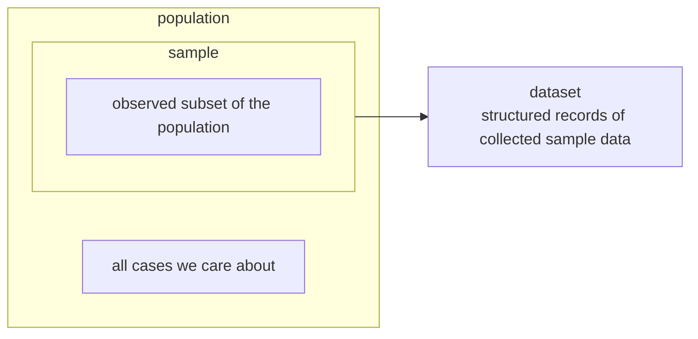
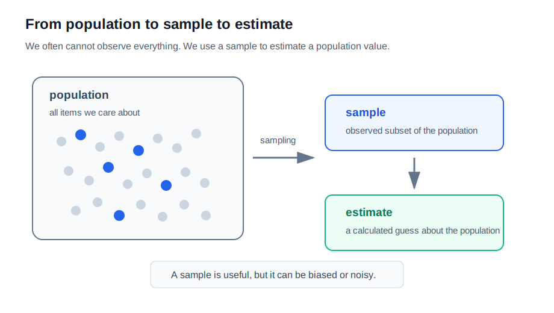
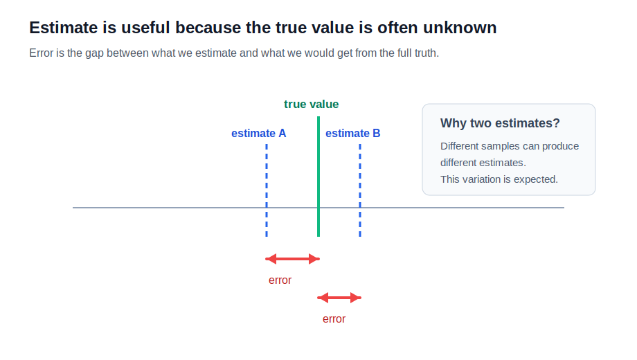
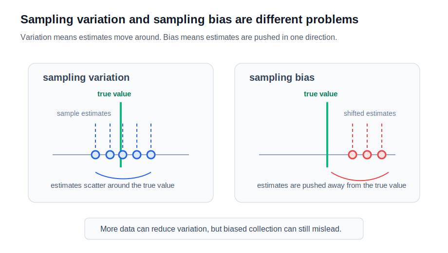
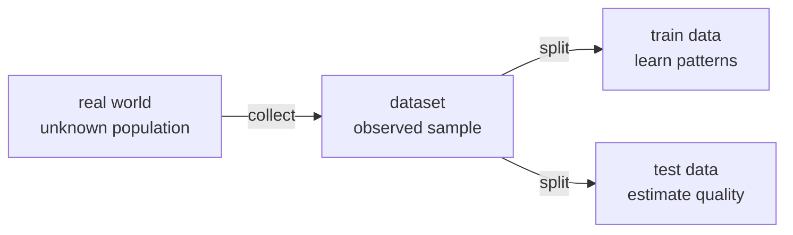

# P2-5.3 표본(sample), 추정(estimation), 오차(error)

P2-5.2에서는 데이터 묶음의 모양을 분포(distribution)로 보고, 중심을 평균(mean)으로 보고, 퍼짐을 분산(variance)으로 봤습니다. 이제 질문을 한 단계 바꿉니다.

```text
전체 데이터를 모두 볼 수 없다면 어떻게 할까?
일부 데이터만 보고 전체에 대해 말할 수 있을까?
그 말에는 얼마나 틀릴 가능성이 있을까?
```

이 질문에서 표본(sample), 추정(estimation), 오차(error)가 등장합니다.

| 용어 | 영어 | 핵심 질문 |
| --- | --- | --- |
| 모집단 | population | 알고 싶은 전체는 무엇인가? |
| 표본 | sample | 실제로 관측한 일부는 무엇인가? |
| 추정 | estimation | 일부로 전체의 값을 어떻게 짐작하는가? |
| 오차 | error | 그 짐작은 실제와 얼마나 다를 수 있는가? |

AI에서도 이 흐름은 매우 중요합니다. 모델은 현실 전체를 다 보지 못합니다. 우리가 가진 데이터셋(dataset)은 언제나 현실의 일부입니다. 그래서 AI 학습은 “일부 데이터로 전체 상황에 대해 얼마나 잘 말할 수 있는가”라는 문제를 계속 품고 있습니다.

## 이 절의 범위

이 절은 표본(sample), 모집단(population), 추정(estimation), 오차(error)의 기본 관계를 다룹니다.

다음 내용은 깊게 다루지 않습니다.

- 신뢰구간(confidence interval)
- 가설검정(hypothesis testing)
- 표준오차(standard error)의 공식 계산
- 중심극한정리(central limit theorem)의 엄밀한 설명
- 편향-분산 트레이드오프(bias-variance tradeoff)

이 내용은 이후 통계 심화, 머신러닝 평가, 모델 일반화에서 다시 등장합니다. 여기서는 “표본으로 전체를 추정할 때 오차가 생긴다”는 관점을 먼저 잡습니다.

이 절에서는 다음 질문에 집중합니다.

```text
모집단과 표본은 어떻게 다른가?
표본으로 무엇을 추정할 수 있는가?
왜 표본을 바꾸면 추정값도 달라질 수 있는가?
오차는 틀렸다는 말인가, 불확실성을 인정하는 말인가?
AI 데이터셋에서는 왜 표본 관점이 중요한가?
```

## 이 절의 목표

- 모집단(population)을 관심 대상 전체로 설명할 수 있습니다.
- 표본(sample)을 모집단에서 실제로 관측한 일부로 설명할 수 있습니다.
- 추정(estimation)을 표본으로 모집단의 값을 계산해 보는 일로 설명할 수 있습니다.
- 추정값(estimate)과 실제 값(true value)의 차이를 오차(error)로 설명할 수 있습니다.
- 표본이 달라지면 추정값도 달라질 수 있음을 설명할 수 있습니다.
- 표본 편향(sampling bias)과 무작위 변동(random variation)을 구분할 수 있습니다.
- AI 학습 데이터가 현실 전체가 아니라 표본이라는 점을 설명할 수 있습니다.

## 모집단은 관심 대상 전체다

모집단(population)은 우리가 알고 싶은 전체 대상입니다.

예를 들어 다음 질문을 생각해 봅니다.

```text
우리 서비스 전체 사용자의 평균 사용 시간은 얼마인가?
전국 고등학생의 평균 수학 점수는 얼마인가?
어떤 제품 구매자 전체의 재구매율은 얼마인가?
현실에서 들어올 전체 이미지 중 보행자가 포함된 비율은 얼마인가?
```

이 질문에서 관심 대상 전체가 모집단입니다.

```text
전체 사용자
전국 고등학생
전체 구매자
현실에서 들어올 전체 이미지
```

문제는 모집단 전체를 항상 관측할 수 없다는 점입니다. 비용이 너무 크거나, 시간이 오래 걸리거나, 미래 데이터라 아직 존재하지 않거나, 현실 세계가 계속 변하기 때문입니다.

그래서 표본이 필요합니다.

## 표본은 실제로 관측한 일부다

표본(sample)은 모집단에서 실제로 관측한 일부입니다.

```text
전체 사용자 중 1만 명의 로그
전국 고등학생 중 조사에 참여한 2천 명
전체 구매자 중 설문에 응답한 사람들
현실 이미지 중 수집된 학습 이미지 묶음
```

표본은 전체가 아닙니다. 하지만 잘 뽑은 표본은 전체를 이해하는 데 도움을 줄 수 있습니다.

아래 도식은 모집단과 표본의 포함 관계를 먼저 보여 줍니다. 표본은 모집단과 나란히 있는 별도 세계가 아니라, 모집단에서 실제로 관측한 일부입니다. 데이터셋(dataset)은 그 관측된 표본을 파일, 테이블, 레코드 형태로 정리한 결과로 볼 수 있습니다.



아래 차트는 모집단 전체에서 표본을 뽑고, 그 표본으로 모집단의 값을 추정하는 흐름을 보여 줍니다.



표본을 볼 때 가장 중요한 질문은 “이 표본이 전체를 잘 대표하는가?”입니다.

```text
표본이 너무 작지 않은가?
특정 집단만 과하게 포함되지 않았는가?
관측되지 않은 집단이 있는가?
수집 방식 때문에 특정 값이 빠지지 않았는가?
```

표본이 전체를 잘 대표하지 못하면, 그 표본으로 계산한 추정값도 흔들릴 수 있습니다.

## 추정은 일부로 전체를 말해 보는 일이다

추정(estimation)은 표본을 이용해 모집단의 값을 계산해 보는 일입니다.

예를 들어 전체 사용자의 평균 사용 시간을 알고 싶지만 전체 사용자를 모두 볼 수 없다고 하겠습니다. 대신 사용자 1만 명의 로그를 표본으로 뽑아 평균을 계산합니다.

```text
모집단에서 알고 싶은 값
-> 전체 사용자의 평균 사용 시간

실제로 가진 데이터
-> 표본 사용자 1만 명의 사용 시간

추정
-> 표본 평균으로 전체 평균을 짐작한다.
```

통계에서는 모집단의 실제 특성을 모수(parameter)라고 부르고, 표본에서 계산한 값을 통계량(statistic)이라고 부르는 경우가 많습니다.

| 구분 | 영어 | 작업용 설명 |
| --- | --- | --- |
| 모수 | parameter | 모집단 전체의 실제 특성 |
| 통계량 | statistic | 표본에서 계산한 값 |
| 추정값 | estimate | 모수를 짐작하기 위해 계산한 값 |

AI 문맥에서는 `parameter`라는 단어가 모델 파라미터(model parameter)로도 자주 쓰입니다. 그래서 이 절에서는 통계의 모수(parameter)와 모델의 파라미터(parameter)를 구분해야 합니다.

```text
통계의 parameter
-> 모집단의 실제 특성

모델의 parameter
-> 모델이 학습으로 조정하는 숫자
```

같은 영어 단어라도 문맥이 다르면 뜻이 달라집니다.

## 오차는 추정값과 실제 값 사이의 차이다

오차(error)는 추정값과 실제 값 사이의 차이입니다.

```text
실제 전체 평균: 50
표본으로 추정한 평균: 47
오차: -3
```

현실에서는 실제 전체 값을 모르는 경우가 많습니다. 그래서 오차를 항상 정확히 알 수는 없습니다. 하지만 오차가 있을 수 있다는 사실은 인정해야 합니다.

아래 차트는 추정값과 실제 값 사이의 차이를 오차로 보는 흐름을 보여 줍니다.



오차를 “실패”로만 이해하면 곤란합니다. 통계에서 오차는 일부로 전체를 말할 때 피하기 어려운 차이를 인정하는 언어입니다.

```text
표본으로 추정한다.
-> 전체를 완전히 알 수는 없다.
-> 차이가 생길 수 있다.
-> 그 차이를 오차로 다룬다.
```

AI 모델의 예측 오차도 비슷한 관점으로 볼 수 있습니다. 모델이 만든 예측과 실제 값이 다르면 오차가 생깁니다. 학습에서는 이 오차를 손실(loss)로 바꾸어 줄이려 합니다.

## 표본이 달라지면 추정값도 달라진다

같은 모집단에서 표본을 여러 번 뽑으면, 매번 같은 표본이 나오지 않을 수 있습니다. 그러면 표본 평균도 조금씩 달라질 수 있습니다.

예를 들어 전체 사용자의 실제 평균 사용 시간이 50분이라고 해도, 어떤 표본에서는 48분이 나오고 다른 표본에서는 52분이 나올 수 있습니다.

```text
표본 A의 평균: 48
표본 B의 평균: 52
표본 C의 평균: 49
```

이 차이는 표본추출 변동(sampling variation)입니다. 표본을 이용하는 한 어느 정도의 변동은 자연스럽습니다.

아래 차트는 같은 모집단에서 여러 표본을 뽑으면 추정값이 실제 값 주변에서 흔들릴 수 있음을 보여 줍니다. 이 흔들림은 표본을 쓰는 한 자연스러운 문제입니다.



중요한 것은 “표본이 달라지면 추정값도 달라질 수 있다”는 점입니다. 이 감각이 있어야 모델 평가 결과도 조심스럽게 읽을 수 있습니다.

```text
한 번의 평가 점수
-> 절대적인 진실이 아닐 수 있다.

다른 테스트 표본
-> 다른 점수가 나올 수 있다.

여러 번의 평가
-> 평균과 변동성을 함께 봐야 한다.
```

## 표본 편향은 더 위험하다

표본이 달라져 생기는 자연스러운 변동과, 표본이 처음부터 한쪽으로 치우친 문제는 구분해야 합니다.

표본 편향(sampling bias)은 표본이 모집단을 잘 대표하지 못하는 상태입니다.

```text
젊은 사용자만 많이 수집했다.
특정 지역의 데이터만 모았다.
응답한 사람만 설문 데이터에 포함했다.
성공한 사례만 로그에 남았다.
```

이런 표본으로 전체를 추정하면 결과가 체계적으로 틀어질 수 있습니다.

```text
무작위 변동
-> 표본을 뽑다 보면 자연스럽게 생기는 흔들림

표본 편향
-> 표본 수집 방식 때문에 특정 방향으로 치우친 문제
```

AI에서는 표본 편향이 매우 중요합니다. 학습 데이터가 특정 집단, 특정 상황, 특정 언어, 특정 기기 환경에 치우쳐 있으면 모델도 그 방향으로 치우칠 수 있습니다.

표본추출 변동과 표본 편향은 모두 추정을 흔들지만 성격이 다릅니다.

| 구분 | 영어 | 의미 | 대응 관점 |
| --- | --- | --- | --- |
| 표본추출 변동 | sampling variation | 표본을 뽑을 때 자연스럽게 생기는 흔들림 | 더 많은 표본, 반복 평가, 변동성 확인 |
| 표본 편향 | sampling bias | 수집 방식 때문에 표본이 한쪽으로 치우친 문제 | 수집 방식 점검, 누락 집단 확인, 데이터 구성 검토 |

## 데이터셋은 표본이 정리된 형태다

데이터셋(dataset)은 단순히 “데이터가 많이 모인 것”만을 뜻하지 않습니다. AI 학습 문맥에서는 보통 수집된 표본을 모델이 읽을 수 있도록 정리한 묶음입니다.

```text
현실에서 관측한다.
필요한 항목을 기록한다.
파일, 테이블, 이미지 폴더, 라벨 파일로 정리한다.
모델 학습이나 평가에 사용할 수 있는 데이터셋이 된다.
```

데이터셋은 현실 전체가 아닙니다. 데이터셋은 수집 시점, 수집 방법, 기록 형식, 정제 기준, 라벨링 기준의 영향을 받습니다. 그래서 데이터셋을 볼 때는 다음 질문을 함께 해야 합니다.

```text
무엇을 모집단으로 보고 있는가?
어떤 방식으로 표본을 수집했는가?
누락된 집단이나 상황은 없는가?
라벨은 어떤 기준으로 붙였는가?
학습에 쓰는 데이터와 평가에 쓰는 데이터는 어떻게 나누었는가?
```

이 관점은 이후 데이터셋 준비(dataset preparation), 라벨(label), 학습 데이터(training data), 테스트 데이터(test data)를 이해하는 바탕이 됩니다.

## 훈련 데이터도 현실의 표본이다

AI 학습 데이터(training data)는 현실 전체가 아닙니다. 현실에서 수집된 일부 표본입니다.

```text
현실 전체의 사용자 행동
-> 모집단에 가까운 개념

수집된 로그 데이터
-> 표본

학습 데이터셋
-> 모델이 실제로 보는 표본
```

그래서 모델이 학습 데이터에서 좋은 성능을 보여도, 현실 전체에서 항상 잘 동작한다고 바로 말할 수 없습니다.

```text
학습 데이터에서는 잘 맞는다.
-> 그 표본에서는 잘 맞는다는 뜻

새로운 현실 데이터에서도 잘 맞는가?
-> 별도로 확인해야 한다.
```

이 문제는 머신러닝에서 일반화(generalization)라는 큰 주제로 이어집니다.

아래 도식은 현실 세계의 일부가 데이터셋으로 수집되고, 그 데이터셋이 다시 훈련 데이터와 테스트 데이터로 나뉘는 흐름을 보여 줍니다.



## 테스트 데이터는 왜 따로 두는가

모델을 평가할 때 테스트 데이터(test data)를 따로 두는 이유도 표본과 추정의 관점으로 볼 수 있습니다.

모델이 학습 데이터만 외워도 학습 데이터 성능은 좋아질 수 있습니다. 그래서 학습에 사용하지 않은 데이터로 모델을 확인합니다.

```text
훈련 데이터
-> 모델이 배우는 표본

테스트 데이터
-> 모델을 확인하는 별도 표본
```

테스트 성능도 현실 전체 성능의 추정값입니다. 테스트 데이터가 충분히 대표적이지 않으면 평가 결과도 흔들릴 수 있습니다.

```text
테스트 점수
-> 현실 성능의 추정값

테스트 데이터의 구성
-> 추정의 신뢰도에 영향을 준다.
```

이 관점은 이후 train/test split, validation data, cross-validation을 이해하는 바탕이 됩니다.

## 이 절에서 기억할 관점

표본, 추정, 오차는 “일부로 전체를 말하는 법”입니다.

```text
모집단
-> 알고 싶은 전체

표본
-> 실제로 관측한 일부

추정
-> 표본으로 전체의 값을 짐작하는 일

오차
-> 추정값과 실제 값 사이의 차이
```

AI에서는 이 관점이 매우 중요합니다. 우리가 가진 데이터셋은 현실 전체가 아니라 표본입니다. 모델 평가는 현실 성능의 완전한 증명이 아니라, 표본을 통한 추정입니다.

## 체크리스트

- 모집단(population)을 관심 대상 전체로 설명할 수 있다.
- 표본(sample)을 모집단에서 실제로 관측한 일부로 설명할 수 있다.
- 추정(estimation)을 표본으로 모집단의 값을 짐작하는 일로 설명할 수 있다.
- 통계의 모수(parameter)와 모델 파라미터(model parameter)를 구분할 수 있다.
- 오차(error)를 추정값과 실제 값 사이의 차이로 설명할 수 있다.
- 표본추출 변동(sampling variation)과 표본 편향(sampling bias)을 구분할 수 있다.
- 훈련 데이터(training data)와 테스트 데이터(test data)를 현실 전체의 표본으로 설명할 수 있다.
- 모델 평가 점수를 현실 성능의 추정값으로 조심스럽게 읽을 수 있다.

## 출처와 참고 자료

- Barbara Illowsky, Susan Dean, [Introductory Statistics, 1.2 Data, Sampling, and Variation in Data and Sampling](https://openstax.org/books/introductory-statistics/pages/1-2-data-sampling-and-variation-in-data-and-sampling){: target="_blank" rel="noopener noreferrer" }, OpenStax, 확인 날짜: 2026-06-24.
- Barbara Illowsky, Susan Dean, [Introductory Statistics, 7 Introduction](https://openstax.org/books/introductory-statistics/pages/7-introduction){: target="_blank" rel="noopener noreferrer" }, OpenStax, 확인 날짜: 2026-06-24.
- Barbara Illowsky, Susan Dean, [Introductory Statistics, 7.1 The Central Limit Theorem for Sample Means](https://openstax.org/books/introductory-statistics/pages/7-1-the-central-limit-theorem-for-sample-means-averages){: target="_blank" rel="noopener noreferrer" }, OpenStax, 확인 날짜: 2026-06-24.
