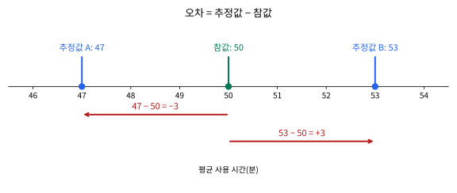
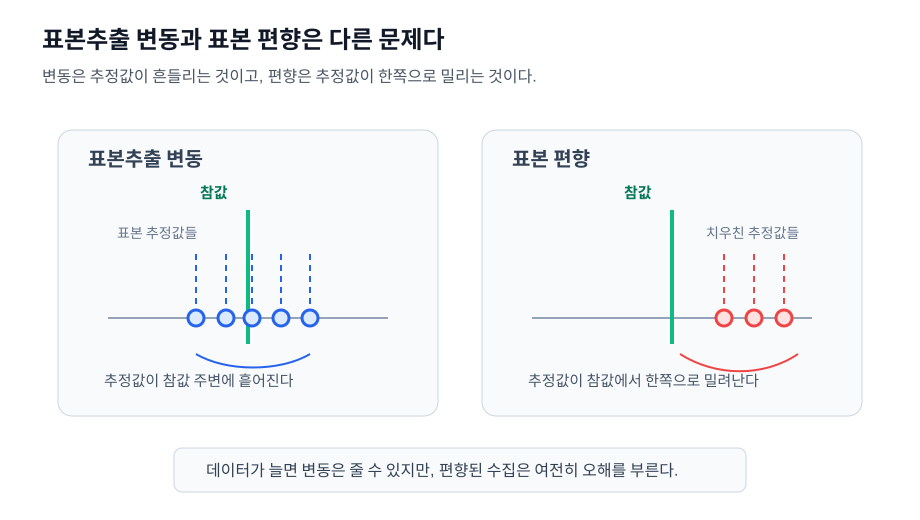

# P2-5.3 표본(sample), 추정(estimation), 오차(error)

> Section ID: `P2-5.3`
> Version: `v2026.09.15`

전체 사용자의 기록을 모두 확인할 수 없다면 일부 사용자의 기록으로 전체 평균을 추정합니다. 관측한 일부가 표본(sample)이고, 알고 싶은 전체가 모집단(population)입니다. 표본이 달라지거나 수집 방식이 치우치면 추정값도 달라질 수 있습니다.

| 용어 | 영어 | 핵심 질문 |
| --- | --- | --- |
| 모집단 | population | 알고 싶은 전체는 무엇인가? |
| 표본 | sample | 실제로 관측한 일부는 무엇인가? |
| 추정 | estimation | 일부로 전체의 값을 어떻게 짐작하는가? |
| 오차 | error | 그 짐작은 실제와 얼마나 다를 수 있는가? |

## 관심 대상인 모집단

모집단(population)은 우리가 알고 싶은 전체 대상입니다.

예를 들어 다음 질문을 생각해 봅니다.

- 어떤 서비스 전체 사용자의 평균 사용 시간은 얼마인가?
- 전국 고등학생의 평균 수학 점수는 얼마인가?
- 어떤 제품 구매자 전체의 재구매율은 얼마인가?
- 현실에서 들어올 전체 이미지 중 보행자가 포함된 비율은 얼마인가?

이 질문에서 관심 대상 전체가 모집단입니다. 예를 들면 전체 사용자, 전국 고등학생, 전체 구매자, 현실에서 들어올 전체 이미지가 모두 모집단이 될 수 있습니다.

문제는 모집단 전체를 항상 관측할 수 없다는 점입니다. 비용이 너무 크거나, 시간이 오래 걸리거나, 미래 데이터라 아직 존재하지 않거나, 현실 세계가 계속 변하기 때문입니다.

그래서 표본이 필요합니다.

## 관측한 표본

표본(sample)은 모집단에서 실제로 관측한 일부입니다. 예를 들어 전체 사용자 중 1만 명의 로그, 전국 고등학생 중 조사에 참여한 2천 명, 전체 구매자 중 설문에 응답한 사람들, 현실 이미지 중 수집된 학습 이미지 묶음은 모두 표본의 예가 될 수 있습니다.

표본은 전체가 아닙니다. 표본이 모집단을 잘 대표하면, 그 표본은 전체의 성질을 추정하는 근거가 됩니다.

아래 도식은 모집단과 표본의 포함 관계를 먼저 보여 줍니다. 표본은 모집단과 나란히 있는 별도 세계가 아니라, 모집단에서 실제로 관측한 일부입니다. 데이터셋(dataset)은 그 관측된 표본을 파일, 테이블, 레코드 형태로 정리한 결과로 볼 수 있습니다.

```mermaid
--8<-- "assets/part-02/chapter-05/population-sample-dataset-flow-ko.mmd"
```

표본을 볼 때 가장 중요한 질문은 “이 표본이 전체를 잘 대표하는가?”입니다. 따라서 표본이 너무 작지 않은지, 특정 집단만 과하게 포함되지 않았는지, 관측되지 않은 집단이 있는지, 수집 방식 때문에 특정 값이 빠지지 않았는지를 함께 살펴야 합니다.

표본이 전체를 잘 대표하지 못하면, 그 표본으로 계산한 추정값도 불안정해지거나 한쪽으로 치우칠 수 있습니다.

## 모수·통계량·추정값

추정(estimation)은 표본을 이용해 모집단의 값을 계산해 보는 일입니다.

예를 들어 어떤 서비스 전체 사용자의 평균 사용 시간을 알고 싶지만 전체 사용자를 모두 볼 수 없다고 하겠습니다. 대신 사용자 1만 명의 로그를 표본으로 뽑아 평균을 계산합니다. 이때 모집단에서 알고 싶은 값은 전체 사용자의 평균 사용 시간이고, 실제로 가진 데이터는 표본 사용자 1만 명의 사용 시간이며, 추정은 표본 평균으로 전체 평균을 짐작하는 일입니다.

통계에서는 모집단의 실제 특성을 모수(parameter)라고 부르고, 표본에서 계산한 값을 통계량(statistic)이라고 부르는 경우가 많습니다.

| 구분 | 영어 | 작업용 설명 |
| --- | --- | --- |
| 모수 | parameter | 모집단 전체의 실제 특성 |
| 통계량 | statistic | 표본에서 계산한 값 |
| 추정값 | estimate | 모수를 짐작하기 위해 계산한 값 |

AI 문맥의 모델 파라미터(model parameter)도 같은 영어 단어를 씁니다. 통계의 `parameter`는 모집단의 실제 특성을 뜻하고, 모델의 `parameter`는 모델이 학습으로 조정하는 숫자를 뜻합니다.

## 추정 오차

여기서는 추정 오차(error)를 `추정값 − 참값`으로 계산합니다. 실제 전체 평균이 50분이고 표본 평균이 47분이라면 오차는 `47 − 50 = −3분`입니다. 음수는 낮게 추정했음을, 양수는 높게 추정했음을 뜻합니다.

현실에서는 실제 전체 값을 모르는 경우가 많습니다. 그래서 오차를 항상 정확히 알 수는 없습니다. 하지만 오차가 있을 수 있다는 사실은 인정해야 합니다.

아래 차트는 추정값과 실제 값 사이의 차이를 오차로 보는 흐름을 보여 줍니다.

오차를 “실패”로만 이해하면 곤란합니다. 통계에서 오차는 일부로 전체를 말할 때 피하기 어려운 차이를 인정하는 언어입니다. 즉 표본으로 추정하는 한 전체를 완전히 알 수는 없고 차이가 생길 수 있으며, 그 차이를 오차로 다룹니다.

AI 모델의 예측 오차도 비슷한 관점으로 볼 수 있습니다. 모델이 만든 예측과 실제 값이 다르면 오차가 생깁니다. 학습에서는 이 오차를 손실(loss)로 바꾸어 줄이려 합니다.

## 표본추출 변동

사용자 5명의 사용 시간이 `40, 44, 50, 56, 60분`인 작은 모집단을 생각해 봅니다. 전체 평균은 `(40 + 44 + 50 + 56 + 60) / 5 = 50분`입니다.

매번 5명 중 서로 다른 2명을 같은 확률로 뽑아 평균을 계산합니다. 가능한 표본 중 세 가지를 비교하면 다음과 같습니다.

| 표본 | 관측한 사용 시간 | 표본 평균 | 추정 오차: 표본 평균 − 50 |
| --- | --- | --- | --- |
| A | 44, 50분 | (44 + 50) / 2 = 47분 | −3분 |
| B | 50, 56분 | (50 + 56) / 2 = 53분 | +3분 |
| C | 40, 60분 | (40 + 60) / 2 = 50분 | 0분 |

모집단과 추출 규칙은 같지만, 뽑힌 사용자가 달라지면 표본 평균도 달라집니다. 이것이 표본추출 변동(sampling variation)입니다. A의 평균이 낮게 나왔다는 사실만으로 수집 방식에 편향이 있다고 판단할 수는 없습니다. C처럼 우연히 모집단 평균과 같은 값이 나올 수도 있습니다.

이 표는 가능한 표본 세 가지의 계산 예이며, 추정값이 나타나는 전체 확률분포를 보여 주는 표는 아닙니다. 실제 모집단 평균을 모르는 경우에도 표본을 바꾸면 추정값이 달라질 수 있다는 점은 같습니다.

모델 평가에서도 다른 테스트 표본은 다른 점수를 만들 수 있습니다. 변동을 확인하려면 모델과 평가 기준을 고정하고 서로 다른 평가 표본의 점수를 비교해야 합니다. 같은 모델을 같은 데이터로 결정적으로 다시 실행하는 것만으로는 표본추출 변동을 확인할 수 없습니다.

## 수집 방식과 표본 편향

표본이 달라져 생기는 자연스러운 변동과, 표본이 처음부터 한쪽으로 치우친 문제는 구분해야 합니다.

표본 편향(sampling bias)은 수집 방식이 특정 집단이나 값을 체계적으로 더 포함하거나 빠뜨려, 추정이 한쪽으로 치우치는 문제입니다. 무작위로 뽑은 한 표본의 구성이 우연히 모집단과 달라진 것만으로는 수집 편향이라고 할 수 없습니다. 예를 들어 젊은 사용자만 많이 수집했거나, 특정 지역의 데이터만 모았거나, 응답한 사람만 설문 데이터에 포함했거나, 성공한 사례만 로그에 남았다면 표본 편향을 의심해야 합니다.

이런 표본으로 전체를 추정하면 결과가 체계적으로 틀어질 수 있습니다. 무작위 변동은 표본을 뽑다 보면 자연스럽게 생기는 흔들림이고, 표본 편향은 표본 수집 방식 때문에 특정 방향으로 치우친 문제입니다.

AI에서는 표본 편향이 매우 중요합니다. 학습 데이터가 특정 집단, 특정 상황, 특정 언어, 특정 기기 환경에 치우쳐 있으면 모델도 그 방향으로 치우칠 수 있습니다.

표본추출 변동과 표본 편향은 모두 추정을 흔들지만 성격이 다릅니다.

| 구분 | 영어 | 의미 | 대응 관점 |
| --- | --- | --- | --- |
| 표본추출 변동 | sampling variation | 표본을 뽑을 때 자연스럽게 생기는 흔들림 | 더 많은 표본, 반복 평가, 변동성 확인 |
| 표본 편향 | sampling bias | 수집 방식 때문에 표본이 한쪽으로 치우친 문제 | 수집 방식 점검, 누락 집단 확인, 데이터 구성 검토 |

## 데이터셋의 수집 조건

데이터셋(dataset)은 단순히 “데이터가 많이 모인 것”만을 뜻하지 않습니다. AI 학습 문맥에서는 보통 수집된 표본을 모델이 읽을 수 있도록 정리한 묶음입니다. 즉 현실에서 관측하고, 필요한 항목을 기록하고, 파일이나 테이블, 이미지 폴더, 라벨 파일로 정리하면 모델 학습이나 평가에 사용할 수 있는 데이터셋이 됩니다.

데이터셋은 현실 전체가 아닙니다. 데이터셋은 수집 시점, 수집 방법, 기록 형식, 정제 기준, 라벨링 기준의 영향을 받습니다. 그래서 데이터셋을 볼 때는 무엇을 모집단으로 보고 있는지, 어떤 방식으로 표본을 수집했는지, 누락된 집단이나 상황은 없는지, 라벨은 어떤 기준으로 붙였는지, 학습에 쓰는 데이터와 평가에 쓰는 데이터는 어떻게 나누었는지를 함께 물어야 합니다.

## 훈련 데이터와 일반화

AI 학습 데이터(training data)는 현실 전체가 아닙니다. 현실에서 수집된 일부 표본입니다. 예를 들어 현실 전체의 사용자 행동은 모집단에 가까운 개념이고, 수집된 로그 데이터는 표본이며, 학습 데이터셋은 모델이 실제로 보는 표본입니다.

그래서 모델이 학습 데이터에서 좋은 성능을 보여도, 현실 전체에서 항상 잘 동작한다고 바로 말할 수 없습니다. 학습 데이터에서 잘 맞는다는 것은 그 표본에서는 잘 맞는다는 뜻이고, 새로운 현실 데이터에서도 잘 맞는지는 별도로 확인해야 합니다.

학습에 쓰지 않은 새로운 데이터에서도 성능을 내는 능력을 일반화(generalization)라고 합니다.

아래 도식은 현실 세계의 일부가 데이터셋으로 수집되고, 그 데이터셋이 다시 훈련 데이터와 테스트 데이터로 나뉘는 흐름을 보여 줍니다.

```mermaid
--8<-- "assets/part-02/chapter-05/dataset-train-test-flow-ko.mmd"
```

## 별도 표본으로 성능 평가

모델을 평가할 때 테스트 데이터(test data)를 따로 두는 이유도 표본과 추정의 관점으로 볼 수 있습니다.

모델이 학습 데이터만 외워도 학습 데이터 성능은 좋아질 수 있습니다. 그래서 학습에 사용하지 않은 데이터로 모델을 확인합니다. 즉 훈련 데이터는 모델이 배우는 표본이고, 테스트 데이터는 모델을 확인하는 별도 표본입니다.

테스트 성능도 현실 전체 성능의 추정값입니다. 테스트 데이터가 충분히 대표적이지 않으면 평가 결과는 불안정해지거나 현실 성능을 빗나갈 수 있습니다. 테스트 점수는 현실 성능의 추정값이고, 테스트 데이터의 구성은 그 추정의 신뢰도에 영향을 줍니다.

## 사용자 구성에 따른 평균 차이

전체 사용자의 80%는 기존 사용자이고 20%는 신규 사용자라고 가정합니다. 두 집단의 평균 사용 시간이 각각 50분과 20분이면 전체 평균은 다음과 같습니다.

`0.8 × 50 + 0.2 × 20 = 44분`

그런데 수집한 로그 1만 명 중 기존 사용자와 신규 사용자가 각각 5천 명이라면, 집단별 평균이 같아도 표본 평균은 달라집니다.

`(5,000 × 50 + 5,000 × 20) / 10,000 = 35분`

| 구분 | 기존 사용자 비율 | 신규 사용자 비율 | 평균 사용 시간 |
| --- | --- | --- | --- |
| 모집단 | 80% | 20% | 44분 |
| 수집된 표본 | 50% | 50% | 35분 |

이 예의 추정 오차는 `35 − 44 = −9분`입니다. 신규 사용자가 전체보다 많이 포함되면서 평균이 낮아졌습니다. 같은 수집 비율로 로그를 10만 명까지 늘려도 이 구성 차이는 사라지지 않습니다. 수집 방식 때문에 생긴 차이라면 표본 수만 늘리는 대신 집단별 수집 비율과 누락 여부를 점검해야 합니다.

실제 분석에서는 모집단 평균을 모르는 경우가 많습니다. 위 예는 전체 구성과 집단별 평균을 알고 있다고 가정해, 표본 구성만 달라져도 추정값이 달라지는 원리를 계산한 것입니다.

## 체크리스트

- 모집단(population)을 관심 대상 전체로 설명할 수 있다.
- 표본(sample)을 모집단에서 실제로 관측한 일부로 설명할 수 있다.
- 추정(estimation)을 표본으로 모집단의 값을 짐작하는 일로 설명할 수 있다.
- 통계의 모수(parameter)와 모델 파라미터(model parameter)를 구분할 수 있다.
- 오차(error)를 추정값과 실제 값 사이의 차이로 설명할 수 있다.
- 표본추출 변동(sampling variation)과 표본 편향(sampling bias)을 구분할 수 있다.
- 훈련 데이터(training data)와 테스트 데이터(test data)를 현실 전체의 표본으로 설명할 수 있다.
- 모델 평가 점수를 현실 성능의 추정값으로 조심스럽게 읽을 수 있다.
- 데이터셋을 현실 전체처럼 읽지 않고 모집단과 표본을 다시 분리해 설명할 수 있다.

## 출처와 참고 자료

- Barbara Illowsky, Susan Dean, [Introductory Statistics, 1.2 Data, Sampling, and Variation in Data and Sampling](https://openstax.org/books/introductory-statistics/pages/1-2-data-sampling-and-variation-in-data-and-sampling){: target="_blank" rel="noopener noreferrer" }, OpenStax, 확인 날짜: 2026-07-20. 모집단 전체를 조사하기 어려울 때 표본을 사용하며, 표본이 대표하는 모집단과 같은 특성을 가져야 한다는 설명 확인에 사용했다.
- Barbara Illowsky, Susan Dean, [Introductory Statistics, 7 Introduction](https://openstax.org/books/introductory-statistics/pages/7-introduction){: target="_blank" rel="noopener noreferrer" }, OpenStax, 확인 날짜: 2026-07-20. 표본평균을 반복해서 계산할 때 평균과 퍼짐이 어떻게 읽히는지, 중심극한정리로 이어지는 맥락 확인에 사용했다.
- Barbara Illowsky, Susan Dean, [Introductory Statistics, 7.1 The Central Limit Theorem for Sample Means](https://openstax.org/books/introductory-statistics/pages/7-1-the-central-limit-theorem-for-sample-means-averages){: target="_blank" rel="noopener noreferrer" }, OpenStax, 확인 날짜: 2026-07-20. 표본평균의 표본분포, 표준오차, 반복 표본에서 표본평균이 모집단 평균에서 얼마나 떨어질 수 있는지 설명하는 근거로 사용했다.
