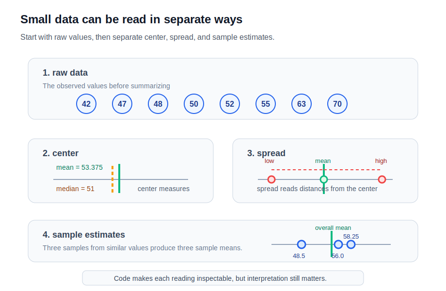

# P2-5.4 확률과 통계를 작은 데이터로 확인하기

P2-5.1에서는 확률(probability)을 불확실성을 다루는 숫자 언어로 봤습니다. P2-5.2에서는 분포(distribution), 평균(mean), 분산(variance)을 데이터 묶음의 모양을 읽는 도구로 봤습니다. P2-5.3에서는 표본(sample), 추정(estimation), 오차(error)를 “일부로 전체를 말하는 일”로 봤습니다.

이제 같은 내용을 작은 데이터로 확인합니다.

> 숫자 목록을 만든다.
> 평균을 계산한다.
> 평균에서 얼마나 떨어졌는지 본다.
> 분산을 계산한다.
> 표본을 바꾸면 평균이 어떻게 달라지는지 본다.

이 절의 목적은 통계 공식을 많이 외우는 것이 아닙니다. 숫자와 코드가 앞 절의 개념을 어떻게 드러내는지 확인하는 것입니다.



## 이 절의 범위

이 절은 작은 숫자 데이터로 평균(mean), 분산(variance), 표본 평균(sample mean), 표본추출 변동(sampling variation)을 확인합니다.

다음 내용은 깊게 다루지 않습니다.

- 확률분포(probability distribution)의 종류
- 정규분포(normal distribution)의 성질
- 표준편차(standard deviation)의 공식 유도
- 표준오차(standard error)
- 신뢰구간(confidence interval)
- 가설검정(hypothesis testing)

이 절에서는 다음 질문에 집중합니다.

> 평균과 중위값은 코드에서 어떻게 계산되는가?
> 분산은 평균과 어떤 관계가 있는가?
> 표본을 바꾸면 평균도 달라질 수 있는가?
> 코드로 계산한 숫자를 어떻게 해석해야 하는가?

## 이 절의 목표

- 작은 데이터 목록에서 평균(mean)을 계산할 수 있습니다.
- 평균(mean)과 중위값(median)을 구분할 수 있습니다.
- 각 값이 평균에서 얼마나 떨어졌는지 확인할 수 있습니다.
- 분산(variance)을 “평균 주변의 퍼짐”으로 설명할 수 있습니다.
- 모집단 분산(population variance)과 표본 분산(sample variance)의 계산 설정이 다를 수 있음을 설명할 수 있습니다.
- 표본을 바꾸면 표본 평균(sample mean)이 달라질 수 있음을 코드로 확인할 수 있습니다.
- 코드 출력값을 개념 설명과 연결해서 읽을 수 있습니다.

## 실행 환경

이 절의 코드는 NumPy(넘파이)를 사용합니다.

실행 환경은 P2-3.4의 [실행 환경을 먼저 구분한다](../chapter-03/section-04.md#_2)를 기준으로 확인합니다. 이 절은 파이썬 설치 방법을 다시 설명하지 않고, 통계 개념을 작은 코드로 확인하는 데 집중합니다.

Google Colab을 사용한다면 코드 셀에서 다음처럼 NumPy를 준비할 수 있습니다.

```python
%pip install numpy
```

로컬 PC를 사용한다면 개인 PC 터미널에서 다음 명령을 사용합니다.

```bash
python -m pip install numpy
```

본문의 전체 예제 코드는 다음 파일로도 확인할 수 있습니다.

- [p2_5_4_small_statistics.py](../../../assets/part-02/chapter-05/p2_5_4_small_statistics.py)

레포지토리 루트에서 실행한다면 다음 명령을 사용할 수 있습니다.

```bash
python docs/assets/part-02/chapter-05/p2_5_4_small_statistics.py
```

## 작은 데이터 만들기

먼저 작은 데이터 목록을 만듭니다.

```python
import numpy as np

data = np.array([42, 55, 48, 63, 52, 50, 47, 70])

print(data)
print(data.size)
```

출력은 다음처럼 볼 수 있습니다.

```text
[42 55 48 63 52 50 47 70]
8
```

여기서 `data`는 현실 전체가 아닙니다. 우리가 관측한 작은 데이터 묶음입니다. 앞 절의 표현으로 말하면 표본(sample)처럼 읽을 수 있습니다.

이 단계에서 중요한 질문은 다음입니다.

> 이 숫자들은 무엇을 기록한 값인가?
> 어떤 방식으로 모였는가?
> 전체를 대표한다고 볼 수 있는가?

코드는 계산을 해 주지만, 데이터가 무엇을 뜻하는지는 사람이 정해야 합니다.

## 평균은 중심을 하나의 숫자로 요약한다

평균(mean)은 데이터의 중심을 하나의 숫자로 요약합니다.

```python
mean_value = np.mean(data)
print(mean_value)
```

출력은 다음과 같습니다.

> 53.375

이 숫자는 다음 계산을 대신한 것입니다.

\[
\frac{42 + 55 + 48 + 63 + 52 + 50 + 47 + 70}{8} = 53.375
\]

평균은 편리하지만, 평균 하나만으로 데이터의 모양을 모두 알 수는 없습니다.

> 평균은 중심을 보여 준다.
> 하지만 값들이 얼마나 흩어져 있는지는 따로 봐야 한다.

또 평균은 매우 큰 값이나 매우 작은 값 하나에 흔들릴 수 있습니다. 이때 함께 볼 수 있는 대표값이 중위값(median)입니다.

## 중위값은 정렬했을 때 가운데 값이다

중위값(median)은 값을 크기순으로 정렬했을 때 가운데에 놓이는 값입니다.

다음 데이터는 값 하나가 유난히 큽니다.

```python
skewed_data = np.array([10, 12, 13, 15, 100])

print(np.mean(skewed_data))
print(np.median(skewed_data))
```

출력은 다음과 같습니다.

> 30.0
> 13.0

평균은 `100`의 영향을 크게 받아 `30.0`이 됩니다. 하지만 중위값은 정렬된 값의 가운데인 `13.0`입니다.

> 평균
> -> 모든 값을 더해 중심을 계산한다.
> -> 극단적으로 큰 값이나 작은 값에 흔들릴 수 있다.
>
> 중위값
> -> 정렬했을 때 가운데 위치를 본다.
> -> 극단값(outlier)에 상대적으로 덜 흔들린다.

현실 데이터에는 한쪽으로 긴 분포가 자주 나옵니다. 사용자 사용 시간, 대기 시간, 응답 지연 시간, 소득처럼 일부 값이 매우 커질 수 있는 데이터에서는 평균만 보면 데이터의 전형적인 모습을 오해할 수 있습니다.

여기서는 중위값을 깊게 다루지 않습니다. 다만 평균을 볼 때는 다음 질문을 함께 기억합니다.

> 평균이 데이터의 중심을 잘 보여 주는가?
> 극단값 때문에 평균이 한쪽으로 끌려가지 않았는가?
> 중위값을 함께 보면 해석이 달라지는가?

평균과 중위값으로 중심을 봤다면, 다음에는 값들이 그 중심 주변에서 얼마나 퍼져 있는지 봐야 합니다. 그래서 분산이 필요합니다.

## 분산은 평균에서 떨어진 정도를 본다

분산(variance)은 값들이 평균 주변에서 얼마나 퍼져 있는지 보는 숫자입니다.

먼저 각 값에서 평균을 뺍니다.

```python
centered = data - np.mean(data)
print(np.round(centered, 3))
```

출력은 다음처럼 볼 수 있습니다.

```text
[-11.375   1.625  -5.375   9.625  -1.375  -3.375  -6.375  16.625]
```

이 값들은 각 데이터가 평균에서 얼마나 떨어져 있는지를 보여 줍니다.

> 42는 평균보다 11.375 낮다.
> 70은 평균보다 16.625 높다.
> 55는 평균보다 1.625 높다.

그다음 떨어진 정도를 제곱합니다.

```python
squared_deviations = centered ** 2
print(np.round(squared_deviations, 3))
```

출력은 다음처럼 볼 수 있습니다.

```text
[129.391   2.641  28.891  92.641   1.891  11.391  40.641 276.391]
```

분산은 이 제곱된 차이들을 평균낸 값으로 볼 수 있습니다.

```python
print(np.var(data))
```

출력은 다음과 같습니다.

> 72.984375

여기서 중요한 것은 공식보다 해석입니다.

> 평균
> -> 중심을 본다.
>
> 평균에서의 차이
> -> 각 값이 중심에서 얼마나 떨어졌는지 본다.
>
> 분산
> -> 그 떨어짐을 전체적으로 요약한다.

## 모집단 분산과 표본 분산은 설정이 다를 수 있다

NumPy의 `np.var(data)`는 기본적으로 데이터 전체를 하나의 모집단처럼 보고 분산을 계산합니다. 이때는 값의 개수 \(N\)으로 나눕니다.

하지만 통계에서 표본으로 모집단 분산을 추정할 때는 \(N - 1\)로 나누는 표본 분산(sample variance)을 쓰는 경우가 많습니다. NumPy에서는 `ddof=1`을 지정해 확인할 수 있습니다.

```python
print(np.var(data))
print(np.var(data, ddof=1))
```

출력은 다음과 같습니다.

> 72.984375
> 83.41071428571429

두 값이 다르게 나옵니다. 이것은 코드가 틀렸다는 뜻이 아닙니다. “이 데이터를 전체로 볼 것인가, 표본으로 볼 것인가”라는 계산 설정이 다르기 때문입니다.

| 계산 | 코드 | 작업용 해석 |
| --- | --- | --- |
| 모집단 분산 | `np.var(data)` | 이 데이터 묶음을 전체처럼 보고 퍼짐을 계산한다. |
| 표본 분산 | `np.var(data, ddof=1)` | 이 데이터가 표본이며, 모집단의 퍼짐을 추정한다고 보고 계산한다. |

초심자 단계에서는 `ddof`를 외우기보다 다음 질문을 기억하는 편이 더 중요합니다.

> 내가 가진 데이터는 전체인가?
> 아니면 전체를 추정하기 위한 표본인가?

## 표본을 바꾸면 평균도 달라질 수 있다

이번에는 전체에 가까운 작은 값 묶음을 하나 만들고, 그 안에서 서로 다른 표본을 몇 개 골라 봅니다.

```python
population_like = np.array([42, 45, 47, 48, 50, 52, 55, 58, 61, 63, 66, 70])

samples = np.array([
    [42, 47, 50, 55],
    [48, 52, 63, 70],
    [45, 55, 58, 66],
])

print(np.mean(population_like))

for sample in samples:
    print(sample, np.mean(sample))
```

출력은 다음처럼 볼 수 있습니다.

```text
54.75
[42 47 50 55] 48.5
[48 52 63 70] 58.25
[45 55 58 66] 56.0
```

전체에 가까운 값 묶음의 평균은 `54.75`입니다. 하지만 표본을 어떻게 뽑느냐에 따라 표본 평균은 `48.5`, `58.25`, `56.0`처럼 달라집니다.

이것이 P2-5.3에서 말한 표본추출 변동(sampling variation)의 작은 예입니다.

> 전체 평균은 하나다.
> 표본 평균은 표본에 따라 달라질 수 있다.
> 그래서 표본 평균은 전체 평균의 추정값이다.

## 코드 출력은 판단이 아니라 재료다

코드는 평균과 분산을 빠르게 계산해 줍니다. 하지만 그 숫자를 어떻게 해석할지는 별도 문제입니다.

예를 들어 평균이 `53.375`라고 해서 바로 다음 결론을 내리면 위험합니다.

> 이 서비스의 전체 사용자 평균은 53.375다.
> 이 데이터는 전체를 완벽히 대표한다.
> 분산이 크므로 데이터가 나쁘다.

더 조심스러운 표현은 다음에 가깝습니다.

> 이 데이터 묶음에서 평균은 53.375다.
> 값들은 평균 주변에서 어느 정도 퍼져 있다.
> 이 데이터가 전체를 대표하는지는 수집 방식과 표본 구성을 함께 봐야 한다.

AI 데이터에서도 같은 태도가 필요합니다.

> 훈련 데이터의 평균
> -> 학습 데이터셋 안에서 계산된 요약값
>
> 테스트 데이터의 점수
> -> 테스트 표본에서 얻은 평가값
>
> 현실 성능
> -> 별도의 표본, 배포 후 관측, 지속적인 평가로 확인해야 하는 대상

## 이 절에서 기억할 관점

작은 데이터 실습은 통계 개념을 손으로 만져 보는 과정입니다.

> 평균은 중심을 요약한다.
> 중위값은 정렬했을 때의 가운데 위치를 보여 준다.
> 분산은 중심 주변의 퍼짐을 요약한다.
> 표본 평균은 표본에 따라 달라질 수 있다.
> 코드 출력은 판단의 끝이 아니라 해석의 시작이다.

NumPy는 계산을 빠르게 해 줍니다. 하지만 평균, 중위값, 분산, 표본, 추정, 오차의 의미를 대신 판단해 주지는 않습니다.

## 체크리스트

- 작은 데이터 목록을 NumPy 배열(array)로 만들 수 있다.
- `np.mean`으로 평균(mean)을 계산할 수 있다.
- `np.median`으로 중위값(median)을 계산할 수 있다.
- 평균이 극단값(outlier)에 흔들릴 수 있음을 설명할 수 있다.
- 평균에서 각 값이 얼마나 떨어졌는지 확인할 수 있다.
- `np.var`로 분산(variance)을 계산할 수 있다.
- `ddof=1`이 표본 분산 계산에서 쓰일 수 있음을 설명할 수 있다.
- 표본을 바꾸면 표본 평균(sample mean)이 달라질 수 있음을 설명할 수 있다.
- 코드 출력값을 데이터 수집 방식, 표본 대표성, 해석의 문제와 분리해서 볼 수 있다.

## 출처와 참고 자료

- NumPy Developers, [numpy.mean](https://numpy.org/doc/stable/reference/generated/numpy.mean.html){: target="_blank" rel="noopener noreferrer" }, NumPy Reference, 확인 날짜: 2026-06-24.
- NumPy Developers, [numpy.median](https://numpy.org/doc/stable/reference/generated/numpy.median.html){: target="_blank" rel="noopener noreferrer" }, NumPy Reference, 확인 날짜: 2026-06-24.
- NumPy Developers, [numpy.var](https://numpy.org/doc/stable/reference/generated/numpy.var.html){: target="_blank" rel="noopener noreferrer" }, NumPy Reference, 확인 날짜: 2026-06-24.
- Barbara Illowsky, Susan Dean, [Introductory Statistics, 1.2 Data, Sampling, and Variation in Data and Sampling](https://openstax.org/books/introductory-statistics/pages/1-2-data-sampling-and-variation-in-data-and-sampling){: target="_blank" rel="noopener noreferrer" }, OpenStax, 확인 날짜: 2026-06-24.
