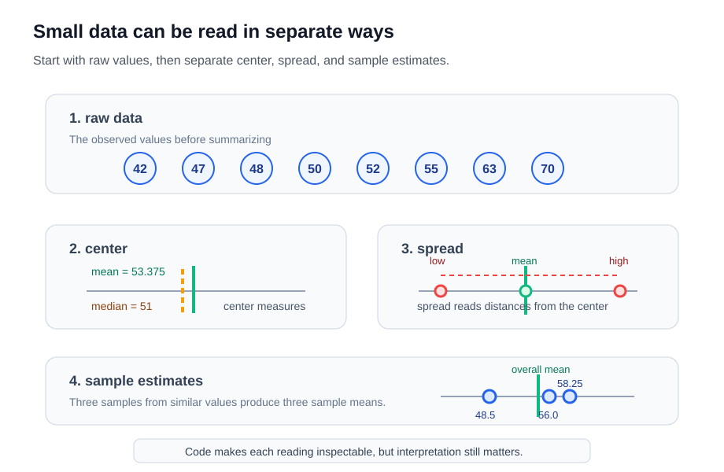

# P2-5.4 확률과 통계를 작은 데이터로 확인하기

> Section ID: `P2-5.4`
> Version: `v2026.07.07`

P2-5.1에서는 확률(probability)을 불확실성을 다루는 숫자 언어로 봤습니다. P2-5.2에서는 분포(distribution), 평균(mean), 분산(variance)을 데이터 묶음의 모양을 읽는 도구로 봤습니다. P2-5.3에서는 표본(sample), 추정(estimation), 오차(error)를 “일부로 전체를 말하는 일”로 봤습니다.

여기서는 작은 데이터 목록을 놓고 평균, 편차, 분산, 표본 평균 변화를 순서대로 확인합니다.

여기서는 통계 공식을 많이 외우기보다, 숫자와 코드가 앞 절의 개념을 어떻게 드러내는지 확인합니다.

여기서는 `작은 데이터`, `평균(mean)`, `중위값(median)`, `분산(variance)`, `표본 평균(sample mean)`을 코드와 함께 다시 정리합니다. 5.2와 5.3에서 개념을 읽었다면, 그 개념이 실제 숫자와 출력에서 어떻게 보이는지 정리합니다.

여기서는 통계 라이브러리 사용법을 넓게 익히기보다, 확률과 통계의 기본 개념을 작은 데이터와 코드로 다시 확인하는 데 집중합니다. 여기서 평균, 분산, 표본 평균의 변화를 눈으로 확인해 두면, 뒤에서 데이터셋 통계나 평가 숫자를 볼 때 개념과 출력이 따로 놀지 않고 연결됩니다.

| 지금 이 절에서 잡을 것 | 바로 다음에 이어질 질문 | 이후 다시 쓰이는 위치 |
| --- | --- | --- |
| 평균, 분산, 표본 평균을 코드 출력으로 읽는 감각 | P2-5.5 보충학습에서 표준오차와 신뢰구간으로 이어집니다. | Part 3의 평가 지표 평균, 손실 요약, 데이터 분포 점검에서 다시 씁니다. |
| 극단값이 평균과 중위값을 다르게 흔든다는 점 | `P2-5.5`에서 추정의 신뢰도와 통계 보강 질문으로 넘어갑니다. | 데이터 전처리와 이상치 해석 문맥에서 다시 등장합니다. |
| 표본을 바꾸면 통계량이 달라질 수 있다는 점 | 이어지는 보충학습에서 변동성 해석을 더 봅니다. | 테스트 점수를 현실 성능의 추정값으로 읽을 때 바탕이 됩니다. |



## 이 절의 범위

여기서는 작은 숫자 데이터로 평균(mean), 분산(variance), 표본 평균(sample mean), 표본추출 변동(sampling variation)을 확인합니다.

다음 내용은 깊게 다루지 않습니다.

- 확률분포(probability distribution)의 종류
- 정규분포(normal distribution)의 성질
- 표준편차(standard deviation)의 공식 유도
- 표준오차(standard error)
- 신뢰구간(confidence interval)
- 가설검정(hypothesis testing)

표준편차, 표준오차, 신뢰구간, 가설검정은 P2-5.5 보충학습에서 다시 다룹니다. 여기서는 코드로 평균, 분산, 표본 평균의 변화만 직접 확인합니다.

여기서는 다음 질문에 집중합니다.

- 평균과 중위값은 코드에서 어떻게 계산되는가?
- 분산은 평균과 어떤 관계가 있는가?
- 표본을 바꾸면 평균도 달라질 수 있는가?
- 코드로 계산한 숫자를 어떻게 해석해야 하는가?

| 용어 | 아주 짧은 뜻 | 이 절에서의 역할 |
| --- | --- | --- |
| 작은 데이터 | 직접 눈으로 따라갈 수 있는 숫자 묶음 | 개념을 확인하는 실습 재료 |
| 평균 | 중심을 하나의 숫자로 요약한 값 | 가장 먼저 확인할 요약값 |
| 중위값 | 정렬했을 때 가운데 값 | 극단값에 덜 흔들리는 중심 비교 대상 |
| 분산 | 평균 주변의 퍼짐을 나타내는 값 | 평균 바깥의 정보 |
| 표본 평균 | 표본에서 계산한 평균 | 표본을 바꾸면 달라질 수 있는 추정값 |

## 이 절의 목표

- 작은 데이터 목록에서 평균(mean)을 계산할 수 있습니다.
- 평균(mean)과 중위값(median)을 구분할 수 있습니다.
- 각 값이 평균에서 얼마나 떨어졌는지 확인할 수 있습니다.
- 분산(variance)을 “평균 주변의 퍼짐”으로 설명할 수 있습니다.
- 모집단 분산(population variance)과 표본 분산(sample variance)의 계산 설정이 다를 수 있음을 설명할 수 있습니다.
- 표본을 바꾸면 표본 평균(sample mean)이 달라질 수 있음을 코드로 확인할 수 있습니다.
- 코드 출력값을 개념 설명과 연결해서 읽을 수 있습니다.

## 세 가지 기준

| 기준 | 왜 중요한가 | 이 절에서 필요한 이해 수준 |
| --- | --- | --- |
| 코드는 개념을 숫자와 출력으로 드러낸다 | 평균, 분산, 표본 평균이 실제 계산에서 어떻게 보이는지 확인해야 개념과 출력이 연결되기 때문입니다. | 통계 개념이 작은 숫자 데이터에서 어떤 계산과 출력으로 나타나는지 본다고 이해합니다. |
| 평균과 중위값을 함께 본다 | 둘 다 중심을 말하지만 극단값이 있을 때 다르게 반응하기 때문입니다. | 평균과 중위값이 같은 중심 개념이지만 성격이 다르다고 이해합니다. |
| 분산은 퍼짐 정보를 더한다 | 중심만으로는 데이터 성격을 다 설명할 수 없기 때문입니다. | 분산을 값들이 평균 주변에 얼마나 퍼졌는지 보여 주는 값으로 이해합니다. |

## 실행 환경

이 절의 코드는 NumPy(넘파이)를 사용합니다.

실행 환경은 P2-3.5의 [실행 환경을 먼저 구분한다](../chapter-03/section-05.md#_2)를 기준으로 확인합니다. 여기서는 파이썬 설치 방법을 다시 설명하지 않고, 통계 개념을 작은 코드로 확인하는 데 집중합니다.

Google Colab을 사용한다면 코드 셀에서 다음처럼 NumPy를 준비할 수 있습니다.

문제 상황: Colab에서 이 절의 통계 예제를 실행하기 전에 NumPy를 준비합니다.
입력(input): 노트북 코드 셀의 `%pip install numpy` 명령입니다.
기대 출력(output): 현재 Colab 커널에 NumPy가 설치됩니다.
확인할 개념: 통계 예제 실행 전에 패키지 준비 단계와 계산 단계가 분리된다는 점을 봅니다.

```python
%pip install numpy
```

로컬 PC를 사용한다면 개인 PC 터미널에서 다음 명령을 사용합니다.

```bash
python -m pip install numpy
```

본문의 전체 예제 코드는 다음 파일로도 확인할 수 있습니다.

- [p2_5_4_small_statistics.py](../../../assets/part-02/chapter-05/p2_5_4_small_statistics.py)

프로젝트 루트에서 실행한다면 다음 명령을 사용할 수 있습니다.

```bash
python docs/assets/part-02/chapter-05/p2_5_4_small_statistics.py
```

## 작은 데이터 만들기

작은 데이터 목록을 기준으로 계산을 시작합니다.

문제 상황: 평균과 분산을 확인할 작은 숫자 데이터 묶음을 먼저 준비합니다.
입력(input): 값 8개를 담은 NumPy 배열 `data`입니다.
기대 출력(output): 데이터 전체와 원소 개수 `8`이 출력됩니다.
확인할 개념: 통계 계산은 항상 어떤 데이터 묶음을 기준으로 하는지 먼저 확인해야 한다는 점을 봅니다.

```python
import numpy as np

data = np.array([42, 55, 48, 63, 52, 50, 47, 70])

print(data)
print(data.size)
```

출력은 다음처럼 볼 수 있습니다.

```text
[42 55 48 63 52 50 47 70]
8
```

여기서 `data`는 현실 전체가 아닙니다. 우리가 관측한 작은 데이터 묶음입니다. 앞 절의 표현으로 말하면 표본(sample)처럼 읽을 수 있습니다.

이 단계에서 중요한 질문은 이 숫자들이 무엇을 기록한 값인지, 어떤 방식으로 모였는지, 전체를 대표한다고 볼 수 있는지입니다.

코드는 계산을 해 주지만, 데이터가 무엇을 뜻하는지는 사람이 정해야 합니다.

## 평균은 중심을 하나의 숫자로 요약한다

평균(mean)은 데이터의 중심을 하나의 숫자로 요약합니다.

문제 상황: 준비한 데이터에서 평균이 실제로 어떤 숫자로 계산되는지 확인합니다.
입력(input): 앞에서 만든 배열 `data`입니다.
기대 출력(output): 평균값 `53.375`가 출력됩니다.
확인할 개념: 평균은 여러 값을 하나의 대표 숫자로 요약하는 계산이라는 점을 봅니다.

```python
mean_value = np.mean(data)
print(mean_value)
```

출력은 `53.375`입니다.

이 숫자는 다음 계산을 대신한 것입니다.

\[
\frac{42 + 55 + 48 + 63 + 52 + 50 + 47 + 70}{8} = 53.375
\]

평균은 편리하지만, 평균 하나만으로 데이터의 모양을 모두 알 수는 없습니다. 평균은 중심을 보여 주지만, 값들이 얼마나 흩어져 있는지는 따로 봐야 합니다.

또 평균은 매우 큰 값이나 매우 작은 값 하나에 흔들릴 수 있습니다. 이때 함께 볼 수 있는 대표값이 중위값(median)입니다.

## 중위값은 정렬했을 때 가운데 값이다

중위값(median)은 값을 크기순으로 정렬했을 때 가운데에 놓이는 값입니다.

다음 데이터는 값 하나가 유난히 큽니다.

문제 상황: 극단값이 있을 때 평균과 중위값이 어떻게 다르게 반응하는지 비교합니다.
입력(input): 큰 값 `100`이 포함된 배열 `skewed_data`입니다.
기대 출력(output): 평균 `30.0`과 중위값 `13.0`이 출력됩니다.
확인할 개념: 평균은 극단값에 흔들릴 수 있고, 중위값은 상대적으로 덜 흔들린다는 점을 봅니다.

```python
skewed_data = np.array([10, 12, 13, 15, 100])

print(np.mean(skewed_data))
print(np.median(skewed_data))
```

출력은 `30.0`, `13.0`입니다.

평균은 `100`의 영향을 크게 받아 `30.0`이 됩니다. 하지만 중위값은 정렬된 값의 가운데인 `13.0`입니다.

평균은 모든 값을 더해 중심을 계산하므로 극단적으로 큰 값이나 작은 값에 흔들릴 수 있습니다. 반면 중위값은 정렬했을 때 가운데 위치를 보므로 극단값(outlier)에 상대적으로 덜 흔들립니다.

현실 데이터에는 한쪽으로 긴 분포가 자주 나옵니다. 사용자 사용 시간, 대기 시간, 응답 지연 시간, 소득처럼 일부 값이 매우 커질 수 있는 데이터에서는 평균만 보면 데이터의 전형적인 모습을 오해할 수 있습니다.

여기서는 중위값을 깊게 다루지 않습니다. 중위값, 표준편차, 신뢰구간처럼 평균 바깥의 요약값은 P2-5.5 보충학습에서 다시 정리합니다. 다만 평균을 볼 때는 평균이 데이터의 중심을 잘 보여 주는지, 극단값 때문에 평균이 한쪽으로 끌려가지 않았는지, 중위값을 함께 보면 해석이 달라지는지를 함께 기억합니다.

평균과 중위값으로 중심을 봤다면, 다음에는 값들이 그 중심 주변에서 얼마나 퍼져 있는지 봐야 합니다. 그래서 분산이 필요합니다.

## 분산은 평균에서 떨어진 정도를 본다

분산(variance)은 값들이 평균 주변에서 얼마나 퍼져 있는지 보는 숫자입니다.

먼저 각 값에서 평균을 뺍니다.

문제 상황: 각 데이터가 평균에서 얼마나 떨어져 있는지 직접 확인합니다.
입력(input): 배열 `data`와 그 평균입니다.
기대 출력(output): 평균에서 뺀 편차 배열이 소수 셋째 자리까지 반올림되어 출력됩니다.
확인할 개념: 분산을 보기 전에 먼저 각 값이 평균에서 얼마나 떨어졌는지 편차로 표현할 수 있다는 점을 봅니다.

```python
centered = data - np.mean(data)
print(np.round(centered, 3))
```

출력은 다음처럼 볼 수 있습니다.

```text
[-11.375   1.625  -5.375   9.625  -1.375  -3.375  -6.375  16.625]
```

이 값들은 각 데이터가 평균에서 얼마나 떨어져 있는지를 보여 줍니다. 예를 들어 42는 평균보다 11.375 낮고, 70은 평균보다 16.625 높으며, 55는 평균보다 1.625 높습니다.

그다음 떨어진 정도를 제곱합니다.

문제 상황: 평균에서의 차이를 제곱해 퍼짐을 음수 없이 비교할 준비를 합니다.
입력(input): 앞에서 구한 편차 배열 `centered`입니다.
기대 출력(output): 제곱 편차 배열이 출력됩니다.
확인할 개념: 분산은 편차를 그대로 더하지 않고 제곱해서 평균내는 흐름이라는 점을 봅니다.

```python
squared_deviations = centered ** 2
print(np.round(squared_deviations, 3))
```

출력은 다음처럼 볼 수 있습니다.

```text
[129.391   2.641  28.891  92.641   1.891  11.391  40.641 276.391]
```

분산은 이 제곱된 차이들을 평균낸 값으로 볼 수 있습니다.

문제 상황: 제곱 편차들을 한 숫자로 요약해 분산을 계산합니다.
입력(input): 배열 `data`입니다.
기대 출력(output): 분산값 `72.984375`가 출력됩니다.
확인할 개념: 분산은 평균 주변의 퍼짐을 하나의 숫자로 요약한 값이라는 점을 봅니다.

```python
print(np.var(data))
```

출력은 `72.984375`입니다.

여기서 중요한 것은 공식보다 해석입니다. 평균은 중심을 보고, 평균에서의 차이는 각 값이 중심에서 얼마나 떨어졌는지 보며, 분산은 그 떨어짐을 전체적으로 요약합니다.

## 모집단 분산과 표본 분산은 설정이 다를 수 있다

NumPy의 `np.var(data)`는 기본적으로 데이터 전체를 하나의 모집단처럼 보고 분산을 계산합니다. 이때는 값의 개수 \(N\)으로 나눕니다.

하지만 통계에서 표본으로 모집단 분산을 추정할 때는 \(N - 1\)로 나누는 표본 분산(sample variance)을 쓰는 경우가 많습니다. NumPy에서는 `ddof=1`을 지정해 확인할 수 있습니다.

문제 상황: 같은 데이터라도 모집단 분산과 표본 분산 설정이 어떻게 다른 값을 내는지 비교합니다.
입력(input): 배열 `data`와 `ddof` 설정 두 가지입니다.
기대 출력(output): 모집단 분산과 표본 분산 값이 차례대로 출력됩니다.
확인할 개념: 코드가 틀린 것이 아니라 계산 설정이 달라 값이 달라질 수 있다는 점을 봅니다.

```python
print(np.var(data))
print(np.var(data, ddof=1))
```

출력은 `72.984375`, `83.41071428571429`입니다.

두 값이 다르게 나옵니다. 이것은 코드가 틀렸다는 뜻이 아닙니다. “이 데이터를 전체로 볼 것인가, 표본으로 볼 것인가”라는 계산 설정이 다르기 때문입니다.

| 계산 | 코드 | 작업용 해석 |
| --- | --- | --- |
| 모집단 분산 | `np.var(data)` | 이 데이터 묶음을 전체처럼 보고 퍼짐을 계산한다. |
| 표본 분산 | `np.var(data, ddof=1)` | 이 데이터가 표본이며, 모집단의 퍼짐을 추정한다고 보고 계산한다. |

여기서는 `ddof`를 외우기보다 내가 가진 데이터가 전체인지, 아니면 전체를 추정하기 위한 표본인지를 먼저 묻는 편이 중요합니다.

## 표본을 바꾸면 평균도 달라질 수 있다

이번에는 전체에 가까운 작은 값 묶음을 하나 만들고, 그 안에서 서로 다른 표본을 몇 개 골라 봅니다.

문제 상황: 표본을 다르게 뽑으면 표본 평균이 어떻게 달라지는지 직접 확인합니다.
입력(input): 전체에 가까운 값 묶음 `population_like`와 세 개의 표본 배열 `samples`입니다.
기대 출력(output): 전체 평균과 각 표본 평균이 차례대로 출력됩니다.
확인할 개념: 표본 평균은 표본추출에 따라 달라질 수 있으며, 이것이 표본추출 변동의 기본 감각이라는 점을 봅니다.

```python
population_like = np.array([42, 45, 47, 48, 50, 52, 55, 58, 61, 63, 66, 70])

samples = np.array([
    [42, 47, 50, 55],
    [48, 52, 63, 70],
    [45, 55, 58, 66],
])

print(np.mean(population_like))

for sample in samples:
    print(sample, np.mean(sample))
```

출력은 다음처럼 볼 수 있습니다.

```text
54.75
[42 47 50 55] 48.5
[48 52 63 70] 58.25
[45 55 58 66] 56.0
```

전체에 가까운 값 묶음의 평균은 `54.75`입니다. 하지만 표본을 어떻게 뽑느냐에 따라 표본 평균은 `48.5`, `58.25`, `56.0`처럼 달라집니다.

이것이 P2-5.3에서 말한 표본추출 변동(sampling variation)의 작은 예입니다. 전체 평균은 하나지만 표본 평균은 표본에 따라 달라질 수 있고, 그래서 표본 평균은 전체 평균의 추정값입니다.

## 코드 출력은 판단이 아니라 재료다

코드는 평균과 분산을 빠르게 계산합니다. 하지만 그 숫자를 어떻게 해석할지는 별도 문제입니다.

예를 들어 평균이 `53.375`라고 해서 바로 `이 서비스의 전체 사용자 평균은 53.375다`, `이 데이터는 전체를 완벽히 대표한다`, `분산이 크므로 데이터가 나쁘다` 같은 결론을 내리면 위험합니다.

더 조심스러운 표현은 `이 데이터 묶음에서 평균은 53.375다`, `값들은 평균 주변에서 어느 정도 퍼져 있다`, `이 데이터가 전체를 대표하는지는 수집 방식과 표본 구성을 함께 봐야 한다`에 가깝습니다.

AI 데이터에서도 같은 태도가 필요합니다. 훈련 데이터의 평균은 학습 데이터셋 안에서 계산된 요약값이고, 테스트 데이터의 점수는 테스트 표본에서 얻은 평가값이며, 현실 성능은 별도의 표본, 배포 후 관측, 지속적인 평가로 확인해야 하는 대상입니다.

## 사례로 보기

### 사례 1. 작은 점수 목록으로도 평균과 분산 감각을 복구할 수 있을까

학습자가 통계 공식을 읽을 때는 이해한 것 같다가도, 실제 숫자를 보면 감각이 흐려진다고 해 보겠습니다. 이때는 큰 데이터셋보다 작은 점수 목록 하나를 두고 평균, 중위값, 분산을 직접 계산하는 편이 개념 차이를 더 분명하게 드러냅니다.

예를 들어 여덟 개 점수를 놓고 평균을 계산하면 중심이 하나의 숫자로 압축됩니다. 하지만 곧바로 중위값과 평균에서의 차이, 제곱 편차, 분산까지 같이 보면 `중심`, `극단값 영향`, `퍼짐`이 서로 다른 질문이라는 점이 드러납니다.

또한 표본을 몇 개 바꿔 뽑아 평균을 다시 계산해 보면, 같은 모집단 비슷한 값 묶음에서도 표본 평균이 조금씩 흔들릴 수 있다는 사실을 눈으로 확인할 수 있습니다. 이것이 앞 절에서 말한 표본추출 변동(sampling variation)의 가장 작은 실험 버전입니다.

이 사례는 작은 데이터 실습이 왜 필요한지를 보여 줍니다. 통계 개념은 공식만 읽을 때보다, 몇 개 숫자를 직접 바꾸고 출력이 어떻게 달라지는지 볼 때 훨씬 덜 추상적으로 남습니다.

## 이 절에서 기억할 관점

작은 데이터 실습은 통계 개념을 손으로 만져 보는 과정입니다. 평균은 중심을 요약하고, 중위값은 정렬했을 때의 가운데 위치를 보여 주며, 분산은 중심 주변의 퍼짐을 요약하고, 표본 평균은 표본에 따라 달라질 수 있으며, 코드 출력은 판단의 끝이 아니라 해석의 시작입니다.

NumPy는 계산을 빠르게 수행합니다. 하지만 평균, 중위값, 분산, 표본, 추정, 오차의 의미를 대신 판단하지는 않습니다.

## 짧은 점검

- 작은 데이터 목록을 NumPy 배열(array)로 만들 수 있다.
- `np.mean`으로 평균(mean)을 계산할 수 있다.
- `np.median`으로 중위값(median)을 계산할 수 있다.
- 평균이 극단값(outlier)에 흔들릴 수 있음을 설명할 수 있다.
- 평균에서 각 값이 얼마나 떨어졌는지 확인할 수 있다.
- `np.var`로 분산(variance)을 계산할 수 있다.
- `ddof=1`이 표본 분산 계산에서 쓰일 수 있음을 설명할 수 있다.
- 표본을 바꾸면 표본 평균(sample mean)이 달라질 수 있음을 설명할 수 있다.
- 코드 출력값을 데이터 수집 방식, 표본 대표성, 해석의 문제와 분리해서 볼 수 있다.

## 언제 이 관점을 먼저 떠올려야 하는가

- 평균, 중위값, 분산을 정의로는 기억하지만 실제 숫자와 코드 출력으로 연결되지 않을 때 먼저 떠올립니다.
- `np.mean`, `np.median`, `np.var` 결과를 보고도 그것이 중심, 극단값, 퍼짐과 어떻게 이어지는지 불분명할 때 먼저 떠올립니다.
- 통계 코드 출력이 나왔을 때 계산 결과와 데이터 해석 문제를 분리해서 읽어야 할 때 먼저 떠올립니다.

## 출처와 참고 자료

- NumPy Developers, [numpy.mean](https://numpy.org/doc/stable/reference/generated/numpy.mean.html){: target="_blank" rel="noopener noreferrer" }, NumPy Reference, 확인 날짜: 2026-06-24.
- NumPy Developers, [numpy.median](https://numpy.org/doc/stable/reference/generated/numpy.median.html){: target="_blank" rel="noopener noreferrer" }, NumPy Reference, 확인 날짜: 2026-06-24.
- NumPy Developers, [numpy.var](https://numpy.org/doc/stable/reference/generated/numpy.var.html){: target="_blank" rel="noopener noreferrer" }, NumPy Reference, 확인 날짜: 2026-06-24.
- Barbara Illowsky, Susan Dean, [Introductory Statistics, 1.2 Data, Sampling, and Variation in Data and Sampling](https://openstax.org/books/introductory-statistics/pages/1-2-data-sampling-and-variation-in-data-and-sampling){: target="_blank" rel="noopener noreferrer" }, OpenStax, 확인 날짜: 2026-06-24.
