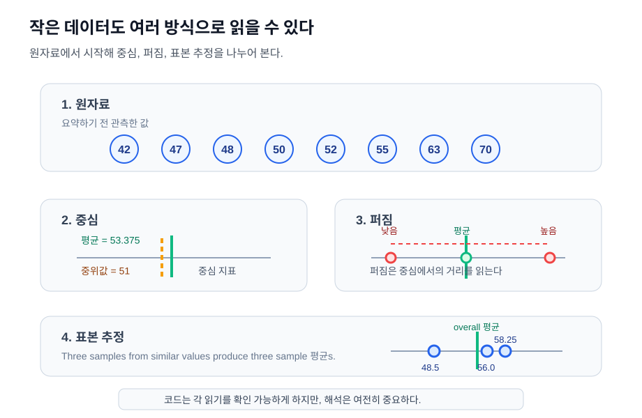

# P2-5.4 확률과 통계를 작은 데이터로 확인하기

> Section ID: `P2-5.4`
> Version: `v2026.09.15`

60점 이상인 관측 비율을 계산하고, 여덟 점수의 평균·중위값·분산을 확인합니다. 극단값을 바꾸고 서로 다른 표본의 평균을 비교해, 계산값과 모집단에 대한 추정을 구분합니다.



## 실행 환경

이 절의 코드는 NumPy(넘파이)를 사용합니다.

노트북 코드 셀과 터미널의 차이는 [명령의 실행 위치](../chapter-03/section-05.md#_2)를 참고합니다. 코드 블록은 위에서부터 순서대로 실행합니다.

Google Colab을 사용한다면 코드 셀에서 다음처럼 NumPy를 준비할 수 있습니다.

```python
# Colab/Jupyter 코드 셀에서 NumPy를 설치하는 명령입니다.
%pip install numpy
```

로컬 PC를 사용한다면 개인 PC 터미널에서 다음 명령을 사용합니다.

```bash
python -m pip install numpy
```

본문의 전체 예제 코드는 다음 파일로도 확인할 수 있습니다.

- [p2_5_4_small_statistics.py](../../../assets/part-02/chapter-05/p2_5_4_small_statistics.py)

프로젝트 루트에서 실행한다면 다음 명령을 사용할 수 있습니다.

```bash
python docs/assets/part-02/chapter-05/p2_5_4_small_statistics.py
```

## 점수 배열 만들기

작은 데이터 목록을 기준으로 계산을 시작합니다.

점수 8개를 배열 `data`에 담고, 값과 원소 개수 `8`을 출력합니다. 이 배열이 이후 평균과 분산 계산의 입력입니다.

```python
# NumPy를 불러와 작은 데이터의 평균, 중위값, 분산 계산을 준비하는 예제입니다.
import numpy as np

# data는 평균, 중위값, 분산을 확인할 작은 점수 데이터입니다.
data = np.array([42, 55, 48, 63, 52, 50, 47, 70])

print(data)

# size는 데이터가 몇 개의 값으로 이루어졌는지 보여 줍니다.
print(data.size)
```

출력은 다음처럼 볼 수 있습니다.

```text
[42 55 48 63 52 50 47 70]
8
```

여기서 `data`는 현실 전체가 아닙니다. 우리가 관측한 작은 데이터 묶음입니다. 앞 절의 표현으로 말하면 표본(sample)처럼 읽을 수 있습니다.

이 단계에서 중요한 질문은 이 숫자들이 무엇을 기록한 값인지, 어떤 방식으로 모였는지, 전체를 대표한다고 볼 수 있는지입니다.

코드는 계산을 해 주지만, 데이터가 무엇을 뜻하는지는 사람이 정해야 합니다.

## 60점 이상인 비율

`data >= 60`은 각 점수가 60점 이상인지 확인합니다. `True`는 조건을 만족하고, `False`는 만족하지 않는다는 뜻입니다. `np.count_nonzero`로 참인 원소를 세면 해당 점수 63·70의 개수인 2를 얻습니다.

```python
at_least_60 = data >= 60
count_at_least_60 = np.count_nonzero(at_least_60)
observed_ratio = count_at_least_60 / data.size
print(at_least_60)
print(count_at_least_60)
print(observed_ratio)
```

```text
[False False False  True False False False  True]
2
0.25
```

관측한 8개 점수 중 60점 이상은 `2 / 8 = 0.25`, 즉 25%입니다. 이 8개 중 하나를 같은 확률로 고른다면 60점 이상일 확률은 정확히 0.25입니다. 더 큰 모집단에서 60점 이상일 확률을 말하려면 이 비율을 추정값으로 사용하며, 표본의 수집 방식과 대표성을 함께 확인해야 합니다.

## 평균 계산

평균(mean)은 데이터의 중심을 하나의 숫자로 요약합니다.

배열 `data`에 `np.mean`을 적용하면 평균 `53.375`를 얻습니다.

```python
# mean_value는 data 전체를 하나의 중심값으로 요약한 평균입니다.
mean_value = np.mean(data)
print(mean_value)
```

출력은 `53.375`입니다.

이 숫자는 다음 계산을 대신한 것입니다.

\[
\frac{42 + 55 + 48 + 63 + 52 + 50 + 47 + 70}{8} = 53.375
\]

평균은 편리하지만, 평균 하나만으로 데이터의 모양을 모두 알 수는 없습니다. 평균은 중심을 보여 주지만, 값들이 얼마나 흩어져 있는지는 따로 봐야 합니다.

또 평균은 매우 큰 값이나 매우 작은 값 하나에 흔들릴 수 있습니다. 이때 함께 볼 수 있는 대표값이 중위값(median)입니다.

## 극단값과 중위값

중위값(median)은 값을 크기순으로 정렬했을 때 가운데 값입니다. 값의 개수가 짝수이면 가운데 두 값의 평균을 사용합니다.

원래 점수 8개를 정렬하면 가운데 두 값은 50과 52입니다. 중위값은 `(50 + 52) / 2 = 51`이며, 도입 도식의 중위값과 같습니다.

```python
print(np.sort(data))
print(np.median(data))
```

```text
[42 47 48 50 52 55 63 70]
51.0
```

다음 데이터는 값 하나가 유난히 큽니다.

`skewed_data`에 큰 값 `100`을 넣어 평균과 중위값을 비교합니다. 예상 결과는 각각 `30.0`, `13.0`입니다.

```python
# skewed_data는 극단값 100이 평균과 중위값에 미치는 차이를 보기 위한 데이터입니다.
skewed_data = np.array([10, 12, 13, 15, 100])

print(np.mean(skewed_data))
print(np.median(skewed_data))
```

출력은 `30.0`, `13.0`입니다.

평균은 `100`의 영향을 크게 받아 `30.0`이 됩니다. 하지만 중위값은 정렬된 값의 가운데인 `13.0`입니다.

평균은 모든 값을 더해 중심을 계산하므로 극단적으로 큰 값이나 작은 값에 흔들릴 수 있습니다. 반면 중위값은 정렬했을 때 가운데 위치를 보므로 극단값(outlier)에 상대적으로 덜 흔들립니다.

현실 데이터에는 한쪽으로 긴 분포가 자주 나옵니다. 사용자 사용 시간, 대기 시간, 응답 지연 시간, 소득처럼 일부 값이 매우 커질 수 있는 데이터에서는 평균만 보면 데이터의 전형적인 모습을 오해할 수 있습니다.

## 편차·제곱 편차·분산

분산(variance)은 값들이 평균 주변에서 얼마나 퍼져 있는지 보는 숫자입니다.

먼저 각 값에서 평균을 뺍니다.

`data`에서 평균을 뺀 편차를 소수 셋째 자리까지 출력합니다. 각 값이 중심보다 크거나 작은 정도가 나타납니다.

```python
# centered는 각 값이 평균에서 얼마나 떨어졌는지 나타내는 편차입니다.
centered = data - np.mean(data)
print(np.round(centered, 3))
```

출력은 다음처럼 볼 수 있습니다.

```text
[-11.375   1.625  -5.375   9.625  -1.375  -3.375  -6.375  16.625]
```

이 값들은 각 데이터가 평균에서 얼마나 떨어져 있는지를 보여 줍니다. 예를 들어 42는 평균보다 11.375 낮고, 70은 평균보다 16.625 높으며, 55는 평균보다 1.625 높습니다.

그다음 떨어진 정도를 제곱합니다.

편차 배열 `centered`를 제곱합니다. 제곱 편차는 음수와 양수가 서로 상쇄되지 않게 합니다.

```python
# squared_deviations는 편차를 제곱해 음수와 양수 차이를 모두 퍼짐으로 읽게 합니다.
squared_deviations = centered ** 2
print(np.round(squared_deviations, 3))
```

출력은 다음처럼 볼 수 있습니다.

```text
[129.391   2.641  28.891  92.641   1.891  11.391  40.641 276.391]
```

분산은 이 제곱된 차이들을 평균낸 값으로 볼 수 있습니다.

`np.var(data)`로 제곱 편차의 평균을 계산하면 분산 `72.984375`를 얻습니다.

```python
# np.var(data)는 data의 퍼짐을 하나의 분산값으로 요약합니다.
print(np.var(data))
```

출력은 `72.984375`입니다.

## 분산의 분모와 ddof

`np.var(data)`는 관측한 값들의 제곱 편차 합을 개수 `N`으로 나눕니다. 표본에서 얻은 데이터라도, 그 데이터 묶음 자체의 퍼짐을 기술할 때는 이 계산을 사용할 수 있습니다.

모집단 분산을 추정할 때 흔히 사용하는 표본분산은 같은 합을 `N − 1`로 나눕니다. NumPy에서는 `ddof=1`로 지정합니다. 독립적으로 같은 분포에서 뽑은 표본에서는, 표본 평균을 써서 제곱 편차를 계산할 때 생기는 분산 추정의 하향 편향을 이 보정으로 줄입니다.

```python
print(np.var(data))
print(np.var(data, ddof=1))
```

```text
72.984375
83.41071428571429
```

두 계산은 같은 데이터와 제곱 편차 합 `583.875`를 사용합니다. 첫 값은 `583.875 / 8`, 두 번째 값은 `583.875 / 7`입니다. 데이터가 바뀐 것이 아니라 계산 목적에 따라 분모를 다르게 선택한 것입니다.

| 계산 목적 | 코드 | 분모 |
| --- | --- | --- |
| 관측한 데이터 묶음 자체의 퍼짐 기술 | `np.var(data)` | `N = 8` |
| 표본으로 모집단 분산 추정 | `np.var(data, ddof=1)` | `N − 1 = 7` |

`np.var`의 분모는 `N − ddof`입니다. `ddof=1`은 특정 집단이 빠지거나 과하게 수집된 문제를 고치지 않습니다. 분모 보정과 표본 수집 방식의 점검은 별개입니다.

## 표본별 평균 비교

12개 값을 작은 모집단 `population_like`로 가정합니다. 여기서 고른 세 표본 `samples`의 평균을 모집단 평균 `54.75`와 비교합니다.

```python
# population_like의 12개 값을 이 예시의 작은 모집단으로 가정합니다.
population_like = np.array([42, 45, 47, 48, 50, 52, 55, 58, 61, 63, 66, 70])

# samples는 population_like에서 일부만 본 것처럼 비교할 표본 묶음입니다.
samples = np.array([
    [42, 47, 50, 55],
    [48, 52, 63, 70],
    [45, 55, 58, 66],
])

print(np.mean(population_like))

# 표본마다 평균이 달라지는지 차례로 확인합니다.
for sample in samples:
    print(sample, np.mean(sample))
```

출력은 다음처럼 볼 수 있습니다.

```text
54.75
[42 47 50 55] 48.5
[48 52 63 70] 58.25
[45 55 58 66] 56.0
```

이 예시의 모집단 평균은 `54.75`입니다. 하지만 표본을 어떻게 뽑느냐에 따라 표본 평균은 `48.5`, `58.25`, `56.0`처럼 달라집니다.

세 표본은 무작위 추출 결과가 아니라 비교를 위해 직접 고른 값들입니다. 전체 평균은 하나지만 표본 평균은 표본에 따라 달라질 수 있고, 그래서 표본 평균은 전체 평균의 추정값입니다.

## 계산 결과와 표본 대표성

코드는 평균과 분산을 빠르게 계산합니다. 하지만 그 숫자를 어떻게 해석할지는 별도 문제입니다.

예를 들어 평균이 `53.375`라고 해서 바로 `이 서비스의 전체 사용자 평균은 53.375다`, `이 데이터는 전체를 완벽히 대표한다`, `분산이 크므로 데이터가 나쁘다` 같은 결론을 내리면 위험합니다.

더 조심스러운 표현은 `이 데이터 묶음에서 평균은 53.375다`, `값들은 평균 주변에서 어느 정도 퍼져 있다`, `이 데이터가 전체를 대표하는지는 수집 방식과 표본 구성을 함께 봐야 한다`에 가깝습니다.

AI 데이터에서도 같은 태도가 필요합니다. 훈련 데이터의 평균은 학습 데이터셋 안에서 계산된 요약값이고, 테스트 데이터의 점수는 테스트 표본에서 얻은 평가값이며, 현실 성능은 별도의 표본, 배포 후 관측, 지속적인 평가로 확인해야 하는 대상입니다.

## 극단값을 바꿔 비교하기

`skewed_data`의 마지막 값 `100`을 `1000`으로 바꿔 평균과 중위값을 다시 출력해 봅니다. 평균은 `(10 + 12 + 13 + 15 + 1000) / 5 = 210`으로 커지지만 중위값은 `13`으로 유지됩니다.

이번에는 마지막 값을 `14`로 바꿉니다. 정렬하면 `10, 12, 13, 14, 15`이고 평균은 `12.8`, 중위값은 `13`입니다. 큰 값 하나가 평균을 얼마나 끌어올렸는지 두 출력으로 비교할 수 있습니다.

원래 배열을 보존하도록 `copy()`로 복사한 뒤 마지막 원소 `[-1]`만 바꿉니다. 각 행은 바꾼 값, 평균, 중위값 순서입니다.

```python
for last_value in [1000, 14]:
    changed_data = skewed_data.copy()
    changed_data[-1] = last_value
    print(last_value, np.mean(changed_data), np.median(changed_data))
```

```text
1000 210.0 13.0
14 12.8 13.0
```

## 체크리스트

- 관측 비율과 모집단 확률의 추정값을 구분할 수 있다.
- 작은 데이터 목록을 NumPy 배열(array)로 만들 수 있다.
- `np.mean`으로 평균(mean)을 계산할 수 있다.
- `np.median`으로 중위값(median)을 계산할 수 있다.
- 평균이 극단값(outlier)에 흔들릴 수 있음을 설명할 수 있다.
- 평균에서 각 값이 얼마나 떨어졌는지 확인할 수 있다.
- `np.var`로 분산(variance)을 계산할 수 있다.
- `ddof=1`이 표본 분산 계산에서 쓰일 수 있음을 설명할 수 있다.
- 표본을 바꾸면 표본 평균(sample mean)이 달라질 수 있음을 설명할 수 있다.
- 코드 출력값을 데이터 수집 방식, 표본 대표성, 해석의 문제와 분리해서 볼 수 있다.
- 평균, 중위값, 분산 정의를 실제 숫자와 코드 출력으로 연결해 설명할 수 있다.

## 출처와 참고 자료

- NumPy Developers, [numpy.array](https://numpy.org/doc/stable/reference/generated/numpy.array.html){: target="_blank" rel="noopener noreferrer" }, NumPy Reference, 확인 날짜: 2026-07-20. 작은 숫자 목록을 NumPy 배열로 만드는 예제 확인에 사용했다.
- NumPy Developers, [numpy.ndarray.size](https://numpy.org/doc/stable/reference/generated/numpy.ndarray.size.html){: target="_blank" rel="noopener noreferrer" }, NumPy Reference, 확인 날짜: 2026-07-20. 배열 원소 개수를 확인하는 `data.size` 예제 확인에 사용했다.
- NumPy Developers, [numpy.mean](https://numpy.org/doc/stable/reference/generated/numpy.mean.html){: target="_blank" rel="noopener noreferrer" }, NumPy Reference, 확인 날짜: 2026-07-20. 산술평균과 배열 평균 계산 예제 확인에 사용했다.
- NumPy Developers, [numpy.median](https://numpy.org/doc/stable/reference/generated/numpy.median.html){: target="_blank" rel="noopener noreferrer" }, NumPy Reference, 확인 날짜: 2026-07-20. 정렬된 값의 가운데 또는 가운데 두 값의 평균으로 중위값을 계산한다는 설명 확인에 사용했다.
- NumPy Developers, [numpy.var](https://numpy.org/doc/stable/reference/generated/numpy.var.html){: target="_blank" rel="noopener noreferrer" }, NumPy Reference, 확인 날짜: 2026-07-20. 분산, `ddof`, 모집단 분산과 표본 분산 계산 설정 차이 확인에 사용했다.
- Barbara Illowsky, Susan Dean, [Introductory Statistics, 1.2 Data, Sampling, and Variation in Data and Sampling](https://openstax.org/books/introductory-statistics/pages/1-2-data-sampling-and-variation-in-data-and-sampling){: target="_blank" rel="noopener noreferrer" }, OpenStax, 확인 날짜: 2026-07-20. 표본이 모집단을 대표해야 하며 표본추출 방식에 따라 변동이 생긴다는 통계적 배경 확인에 사용했다.

- NumPy Developers, [numpy.count_nonzero](https://numpy.org/doc/stable/reference/generated/numpy.count_nonzero.html){: target="_blank" rel="noopener noreferrer" }, NumPy Reference, 확인 날짜: 2026-09-15. 불리언 배열에서 조건을 만족하는 원소의 개수를 세는 코드 확인에 사용했다.
