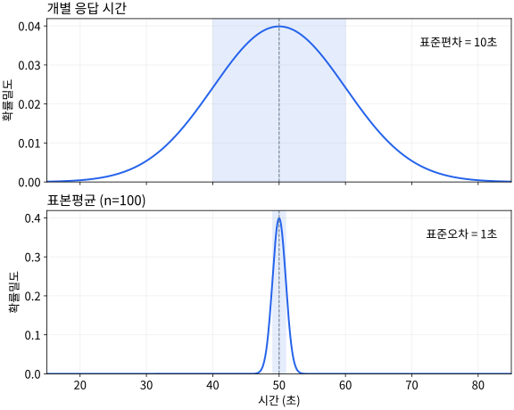
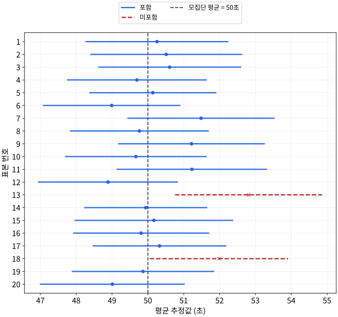

# P2-5.5 보충학습: 표준편차, 상관, 신뢰구간을 처음 읽는 법

> Section ID: `P2-5.5`
> Version: `v2026.09.15`

평균 옆에 적힌 `±` 값은 표준편차일 수도, 표준오차나 신뢰구간의 반폭일 수도 있습니다. 표준편차는 데이터의 퍼짐을, 표준오차와 신뢰구간은 추정의 불확실성을 나타냅니다. 상관계수는 두 변수의 관계를, 가설검정은 특정 가정과 관측 결과가 얼마나 맞는지를 다룹니다.

## 통계량이 나타내는 대상

| 용어 | 나타내는 것 |
| --- | --- |
| 표준편차(standard deviation) | 데이터 값들의 퍼짐 |
| 공분산(covariance) | 두 변수의 편차가 함께 변하는 방향 |
| 상관계수(correlation coefficient) | 두 변수 관계의 방향과 강도 |
| 표준오차(standard error) | 표본을 바꿨을 때 추정값이 달라지는 정도 |
| 신뢰구간(confidence interval) | 정해진 방법으로 계산한 모수의 추정 구간 |
| 가설검정(hypothesis testing) | 귀무가설을 기각할 근거가 있는지 판단하는 절차 |

## 표준편차와 원래 단위

표준편차는 분산의 제곱근입니다. 응답 시간의 분산이 `100초²`라면 표준편차는 `√100 = 10초`입니다. 분산과 같은 퍼짐 정보를 원래 데이터와 같은 단위로 읽을 수 있습니다.

평균이 50초이고 표준편차가 10초라고 해서 모든 응답 시간이 40~60초 안에 있다는 뜻은 아닙니다. 그 구간에 값이 얼마나 들어가는지는 데이터 분포도 확인해야 합니다.

## 편차의 곱과 공분산

공분산은 두 변수에서 각각 평균을 뺀 편차를 곱해 요약합니다. 두 편차의 부호가 같으면 곱이 양수이고, 반대면 음수입니다.

| 관측 | x | y | x의 편차 | y의 편차 | 편차의 곱 |
| --- | --- | --- | --- | --- | --- |
| 1 | −1 | 2 | −1 | −2 | 2 |
| 2 | 0 | 4 | 0 | 0 | 0 |
| 3 | 1 | 6 | 1 | 2 | 2 |

x의 평균은 0, y의 평균은 4입니다. 표본 공분산은 편차 곱의 합 `4`를 `n − 1 = 2`로 나눈 `2`입니다. 이 데이터에서는 x가 커질수록 y도 커지는 관계가 양의 공분산으로 나타납니다.

공분산의 크기는 단위의 영향을 받습니다. y를 미터에서 센티미터로 바꾸어 `200, 400, 600`으로 적으면 같은 관측의 표본 공분산도 `200`이 됩니다. 관계는 그대로인데 숫자는 100배가 됩니다.

## 피어슨 상관계수와 선형 관계

피어슨 상관계수(Pearson correlation coefficient)는 공분산을 두 변수의 표준편차의 곱으로 나누어 단위의 영향을 없앱니다. 두 변수의 표준편차가 모두 0보다 클 때 계산할 수 있으며, 값은 −1부터 1 사이입니다.

앞의 데이터에서 x와 y의 표본 표준편차는 각각 `1`, `2`입니다. 따라서 상관계수는 `2 / (1 × 2) = 1`입니다. y를 센티미터로 바꿔도 `200 / (1 × 200) = 1`로 같습니다.

| 피어슨 상관계수 | 해석 |
| --- | --- |
| 1 | 증가하는 직선 관계 |
| −1 | 감소하는 직선 관계 |
| 0에 가까움 | 선형 관계가 약함 |

상관계수가 0이어도 곡선 관계는 있을 수 있습니다. 예를 들어 `x = −1, 0, 1`, `y = 1, 0, 1`은 `y = x²`로 연결되지만 피어슨 상관계수는 0입니다. 상관이 크다는 사실만으로 한 변수가 다른 변수의 원인이라고 결론 내릴 수도 없습니다.

## 표준편차와 표준오차

표준오차는 추정값의 표본분포가 가진 표준편차입니다. 같은 방식으로 표본을 다시 뽑을 때, 표본 평균 같은 추정값이 얼마나 달라질 수 있는지를 나타냅니다.

한 번 뽑은 표본 안에는 개별 응답 시간이 여러 개 있습니다. 같은 크기의 표본을 여러 번 뽑고 매번 평균을 구하면 이번에는 평균값들이 여러 개 생깁니다. **표준편차는 개별 값들의 퍼짐을 읽고, 평균의 표준오차는 반복 표본에서 얻는 평균값들의 퍼짐을 읽습니다.** 실제 조사에서 표본을 여러 번 뽑아야만 표준오차를 계산할 수 있는 것은 아닙니다. 아래 공식은 한 표본의 정보로 그 퍼짐을 추정합니다.

독립적으로 같은 모집단에서 뽑은 표본으로 평균을 추정할 때, 평균의 표준오차는 표본 표준편차 `s`와 표본 크기 `n`을 이용해 `s / √n`으로 추정합니다.

표본이 100개이고 표본 표준편차가 10초라면 평균의 표준오차 추정값은 `10 / √100 = 1초`입니다. 표본이 400개이고 표본 표준편차가 여전히 10초라면 `10 / √400 = 0.5초`입니다. 데이터의 퍼짐이 같아도 표본 수가 늘면 평균을 더 정밀하게 추정할 수 있습니다.

아래는 모집단이 평균 50초, 표준편차 10초인 정규분포라고 가정한 이론적 비교입니다. 위쪽은 개별 응답 시간의 분포이고, 아래쪽은 독립 관측 100개씩을 뽑아 계산한 표본평균의 분포입니다. 모집단 표준편차를 알고 있으므로 여기서 평균의 표준오차는 정확히 `10/√100=1초`입니다.

가로축은 둘 다 초 단위이고, 세로축은 각 분포의 확률밀도입니다. 음영은 각 분포의 평균에서 그 분포의 표준편차만큼 양쪽으로 떨어진 범위입니다. 평균값의 분포가 좁다고 개별 응답 시간이 서로 비슷해진 것은 아닙니다. 100개를 평균한 값이 한 개의 응답 시간보다 덜 흔들리는 것입니다. 이 가상 모집단의 평균 50초는 아래 신뢰구간 계산 예시의 관측 평균 53.4초와 구별합니다.

## 평균의 신뢰구간

정규분포인 모집단에서 독립적으로 뽑은 표본 100개의 평균이 `53.4초`, 표본 표준편차가 `10초`라고 가정합니다. 모집단 평균의 95% 신뢰구간은 t 분포를 사용하는 방법으로 다음처럼 계산할 수 있습니다.

`표본 평균 ± t 계수 × 표준오차`

이 경우 자유도는 `n − 1 = 99`이고, 양쪽으로 계산하는 95% 구간의 t 계수는 약 `1.984`입니다. 자유도는 여기서 t 분포의 모양과 계수를 고르는 값입니다.

모집단 표준편차를 모르고 표본 표준편차 `s`로 대신하기 때문에 t 분포를 사용합니다. t 분포는 정규분포보다 꼬리가 두꺼워 표준편차 추정의 불확실성을 반영합니다. 표본으로 평균을 먼저 구하면 평균에서 뺀 편차의 합은 0이 됩니다. 그래서 편차 99개가 정해지면 마지막 하나는 자유롭게 정할 수 없으며, 이 계산의 자유도는 99입니다.

양측 95% 구간에서는 가운데 95%를 남기고 바깥쪽 5%를 두 꼬리에 2.5%씩 나눕니다. 자유도 99인 t 분포의 가운데 95% 경계가 약 `−1.984`, `+1.984`입니다. 여기서 t 계수는 이 분포의 누적확률표나 통계 도구에서 구하는 값이며, 관측 평균만 보고 정하는 숫자가 아닙니다.

`53.4 ± 1.984 × 1 ≈ [51.42, 55.38]초`

95%는 구간을 만드는 방법의 성질입니다. 같은 조건으로 표본추출과 구간 계산을 반복하면 장기적으로 약 95%의 구간이 모집단 평균을 포함한다는 뜻입니다. 이미 계산된 이 구간 안에 개별 응답 시간의 95%가 들어간다는 뜻은 아닙니다.

빈도주의 신뢰구간에서 모집단 평균은 고정되어 있고, 표본을 뽑을 때마다 구간이 바뀝니다. 따라서 이미 계산한 `[51.42,55.38]`에 대해 “모평균이 이 안에 있을 확률이 95%”라고 해석하지 않습니다. 95%는 같은 방법을 반복 적용했을 때의 포함률입니다.

위 그림은 평균 50초, 표준편차 10초인 정규분포에서 독립 표본 100개를 뽑는 실험을 20회 모의 실행한 결과입니다. 점은 각 표본의 평균이고 선분은 그 표본에서 구한 95% t 신뢰구간입니다. 세로 점선은 모의실험에서 알고 있는 모집단 평균입니다. 이를 포함하지 않는 구간은 빨간색 점선으로 표시했습니다. 이 실행에서는 20개 중 18개가 모집단 평균을 포함했습니다. **20개 중 반드시 19개가 포함해야 하는 것은 아닙니다.** 95%는 긴 반복에서의 비율이며, 실제 조사에서는 참값을 모르므로 개별 구간의 성공 여부도 보통 알 수 없습니다.

## 귀무가설과 가설검정

가설검정은 표본 데이터를 이용해 귀무가설(null hypothesis)을 기각할 근거가 있는지 판단합니다. 앞의 응답 시간 예에서 귀무가설을 `모집단 평균은 50초이다`, 대립가설을 `50초와 다르다`로 둘 수 있습니다.

유의수준 5%는 자료를 보고 결론을 정하기 전에 선택하는 오류 기준입니다. 귀무가설과 검정의 가정이 참일 때 같은 검정을 반복하면, 실제로는 참인 귀무가설을 잘못 기각하는 비율이 5%가 되도록 경계를 정합니다. “이번 결론이 틀릴 확률이 5%” 또는 “귀무가설이 참일 확률이 5%”라는 뜻은 아닙니다.

관측된 평균 53.4초와 가정한 평균 50초의 차이는 `3.4초`입니다. 표준오차 1초로 나눈 검정통계량은 `t = 3.4`입니다. 위와 같은 가정에서 유의수준을 5%로 정한 양측 t 검정의 기준값은 약 `±1.984`이므로 귀무가설을 기각합니다.

이 결과는 가정한 모집단 평균 50초와 관측 자료가 잘 맞지 않는다는 근거입니다. 차이가 실무적으로 큰지는 별도로 판단해야 합니다. 반대로 기각하지 못했다고 두 값이 같다는 사실이 증명되는 것도 아닙니다.

같은 양측 t 방법에서는 95% 신뢰구간과 유의수준 5% 검정이 연결됩니다. 가정한 평균 50초가 `[51.42,55.38]` 밖에 있으므로 검정에서도 기각합니다. 반대로 같은 표본에서 54초를 검정하면 구간 안에 있고, `t=(53.4−54)/1=−0.6`으로 경계 안에 있으므로 기각하지 않습니다. 구간 안의 모든 값이 똑같이 가능하다는 뜻이나, 54초가 참으로 입증되었다는 뜻은 아닙니다.

## 같은 평균 옆의 다른 숫자

앞의 표본을 보고서에 다음처럼 적을 수 있습니다.

| 표기 | 해석 |
| --- | --- |
| 평균 53.4초, 표준편차 10초 | 개별 응답 시간의 퍼짐 |
| 평균 53.4초, 표준오차 1초 | 평균 추정값의 변동 정도 |
| 평균 53.4초, 95% 신뢰구간 [51.42, 55.38]초 | 지정한 방법으로 추정한 모집단 평균의 구간 |

`53.4 ± 10`만 적으면 어떤 통계량인지 알 수 없습니다. 표나 그래프에서 `±`를 만나면 범례의 통계량 이름, 표본 수, 측정 단위를 함께 확인해야 합니다.

## 연습: 퍼짐과 추정 구분하기

첫째, 표본 크기 400, 표본 표준편차 10초일 때 평균의 표준오차를 구하세요. 둘째, `평균 53.4초 ± 0.5초`만 보고 이것이 95% 신뢰구간인지 판단할 수 있는지 설명하세요. 셋째, `x=−1,0,1`, `y=1,0,1`에서 상관계수가 0이라는 이유로 관계가 없다고 결론 내릴 수 있는지 설명하세요.

??? note "계산과 해설"
    평균의 표준오차 추정값은 `10/√400=0.5초`입니다. 표준편차 10초가 0.5초로 줄어든 것은 아닙니다. `±0.5초`의 통계량 이름이 없으면 구간의 의미를 확정할 수 없고, 95% t 신뢰구간의 반폭은 표준오차에 t 계수를 곱해야 합니다. 마지막 자료는 `y=x²`라는 곡선 관계가 있으므로 피어슨 상관계수 0을 관계 없음으로 해석하면 안 됩니다.

## 체크리스트

- 분산 100초²에서 표준편차 10초를 계산할 수 있다.
- 공분산은 측정 단위에 따라 크기가 달라질 수 있음을 설명할 수 있다.
- 피어슨 상관계수가 선형 관계를 나타내며 인과관계를 증명하지는 않음을 설명할 수 있다.
- 데이터의 표준편차와 평균의 표준오차를 구분할 수 있다.
- 95% 신뢰구간의 반복 표본추출에 따른 의미를 설명할 수 있다.
- 귀무가설을 기각하는 것과 차이의 실무적 중요성을 구분할 수 있다.
- 보고서의 `±` 표기를 통계량 이름과 함께 읽을 수 있다.

## 출처와 참고 자료

- Barbara Illowsky, Susan Dean, [Introductory Statistics, 2.7 Measures of the Spread of the Data](https://openstax.org/books/introductory-statistics/pages/2-7-measures-of-the-spread-of-the-data){: target="_blank" rel="noopener noreferrer" }, OpenStax, 확인 날짜: 2026-07-20. 표준편차가 평균에서 얼마나 떨어져 있는지를 재는 값이며, 분산의 제곱근이고 원래 데이터 단위와 연결된다는 설명 확인에 사용했다.
- NIST/SEMATECH, [Dataplot Reference: CORRELATION](https://www.itl.nist.gov/div898/software/dataplot/refman2/auxillar/correlat.htm){: target="_blank" rel="noopener noreferrer" }, NIST, 확인 날짜: 2026-09-15. 두 변수의 편차 곱 \(S_{xy}\)와 상관계수 공식을 통해 함께 움직임과 상관계수 해석의 근거로 사용했다.
- Barbara Illowsky, Susan Dean, [Introductory Statistics, 7.1 The Central Limit Theorem for Sample Means](https://openstax.org/books/introductory-statistics/pages/7-1-the-central-limit-theorem-for-sample-means-averages){: target="_blank" rel="noopener noreferrer" }, OpenStax, 확인 날짜: 2026-07-20. 표본평균의 표본분포와 표준오차가 반복 표본에서 표본평균이 모집단 평균에서 얼마나 떨어지는지 설명한다는 근거로 사용했다.
- Barbara Illowsky, Susan Dean, [Introductory Statistics, 8 Introduction](https://openstax.org/books/introductory-statistics/pages/8-introduction){: target="_blank" rel="noopener noreferrer" }, OpenStax, 확인 날짜: 2026-07-20. 점추정, 구간추정, 신뢰구간, 오차한계가 추정값 하나로 끝내지 않게 하는 장치라는 설명 확인에 사용했다.
- Barbara Illowsky, Susan Dean, [Introductory Statistics, 9 Introduction](https://openstax.org/books/introductory-statistics/pages/9-introduction){: target="_blank" rel="noopener noreferrer" }, OpenStax, 확인 날짜: 2026-07-20. 가설검정이 표본 데이터를 평가해 귀무가설을 기각할 충분한 근거가 있는지 결정하는 절차라는 설명 확인에 사용했다.
- Barbara Illowsky, Susan Dean, [Introductory Statistics 2e, 12.4 Testing the Significance of the Correlation Coefficient](https://openstax.org/books/introductory-statistics-2e/pages/12-4-testing-the-significance-of-the-correlation-coefficient){: target="_blank" rel="noopener noreferrer" }, OpenStax, 확인 날짜: 2026-07-20. 상관계수가 선형 관계의 강도와 방향을 말하지만 표본 크기와 함께 신뢰도를 읽어야 한다는 설명 확인에 사용했다.

- NIST/SEMATECH, [Confidence Limits for the Mean](https://www.itl.nist.gov/div898/handbook/eda/section3/eda352.htm){: target="_blank" rel="noopener noreferrer" }, 확인 날짜: 2026-09-15. 평균의 t 신뢰구간, 반복 표본추출 해석, 단일 표본 t 검정 공식의 근거. 본문의 수치는 설명을 위해 자체 구성했다.
