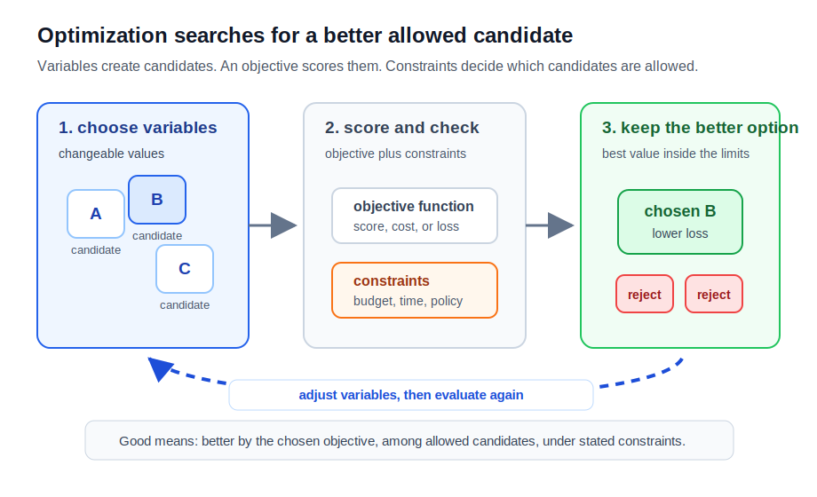

# P2-6.1 최적화(optimization)는 무엇을 찾는가

P2-5장에서는 데이터를 숫자로 요약하고, 표본으로 전체를 추정하며, 코드로 평균과 분산을 확인했습니다. 이제 질문이 바뀝니다.

> 값을 계산하는 것만으로 충분한가?
> 여러 후보 중에서 더 좋은 값을 어떻게 찾는가?
> 무엇을 기준으로 좋다고 말할 수 있는가?

이 질문은 조금 낯섭니다. 평균이나 분산은 값을 계산하면 결과가 바로 나옵니다. 하지만 “더 좋은 값”을 찾는 일은 다릅니다. 처음부터 답이 주어져 있지 않고, 여러 후보를 놓고 비교해야 합니다.

이 지점에서 최적화(optimization)라는 말이 등장합니다. 이 절에서는 최적화를 공식으로 외우지 않습니다. “어떤 값을 고르면 더 나아지는가?”라는 질문을 붙잡기 위한 이름으로 먼저 다룹니다.

교과서식으로 말하면, 최적화는 정해진 변수(variable)와 제약(constraint) 안에서 목적 함수(objective function)를 최소화(minimize)하거나 최대화(maximize)하는 값을 찾는 문제입니다.

다만 이 정의만 먼저 보면 어렵습니다. 그래서 이 절에서는 정의를 지우지 않고, 정의가 필요한 장면을 함께 봅니다.

아직 정확한 수식이나 알고리즘을 몰라도 됩니다. 여기서는 다음 정도의 감각을 만드는 것이 목적입니다.

> 정답을 바로 쓰는 것이 아니라
> 후보를 놓고
> 기준으로 비교하고
> 조금 더 나은 쪽으로 움직인다.



## 이 절의 범위

이 절은 최적화(optimization)를 AI 학습으로 들어가기 전 필요한 사고방식으로 소개합니다. 엄밀한 공식보다 “무엇을 찾는 문제인가”를 먼저 봅니다.

다음 내용은 깊게 다루지 않습니다.

- 손실 함수(loss function)의 종류
- 목적 함수(objective function)의 수식 구성
- 경사하강법(gradient descent)의 업데이트 공식
- 볼록 최적화(convex optimization)의 조건
- 선형계획법(linear programming), 제약 최적화의 세부 알고리즘

이 내용은 P2-6.2와 P2-6.3, 그리고 이후 머신러닝 학습 절에서 다시 다룹니다. 여기서는 “최적화라는 말을 들었을 때 어떤 장면을 떠올리면 되는가”를 먼저 잡습니다.

이 절에서는 다음 질문에 집중합니다.

> 최적화는 왜 필요해지는가?
> 후보, 기준, 제약은 무엇인가?
> 최적이라는 말은 완벽하다는 뜻인가?
> AI 학습에서 최적화는 왜 필요한가?

## 이 절의 목표

- 최적화(optimization)를 정답을 바로 쓰는 일이 아니라 더 나은 후보를 찾아가는 관점으로 설명할 수 있습니다.
- 후보(candidate), 기준(criterion), 제약(constraint)을 구분할 수 있습니다.
- 최소화(minimization)와 최대화(maximization)를 기본 방향으로 설명할 수 있습니다.
- 최적(optimal)이 항상 현실의 완벽한 답을 뜻하지 않음을 설명할 수 있습니다.
- AI 학습에서 모델이 직접 정답 규칙을 쓰기보다, 기준을 줄이거나 키우는 방향으로 값을 조정한다는 관점을 설명할 수 있습니다.

## 좋은 값을 찾는 장면에서 시작한다

최적화(optimization)를 처음부터 수학 용어로 이해하려 하면 딱딱해집니다. 먼저 “좋은 값을 찾는 장면”을 생각합니다.

> 가장 짧은 이동 경로를 찾는다.
> 가장 적은 비용으로 물건을 산다.
> 기다리는 시간이 가장 짧은 줄을 고른다.
> 가장 높은 점수를 낼 설정을 찾는다.

이 예들을 모두 수학적 최적화라고 부를 필요는 없습니다. 하지만 최적화의 감각을 익히기에는 좋습니다. 공통점은 다음입니다.

> 후보가 여러 개 있다.
> 그중 무엇이 더 좋은지 판단할 기준이 있다.
> 현실에서는 아무 선택이나 할 수 없어서 제약도 있다.

수학과 AI에서는 이 흐름을 계산 가능한 형태로 만들려고 합니다. 그때 최적화라는 말이 본격적으로 등장합니다.

## 정의를 다시 풀어 읽는다

앞에서 본 교과서식 정의를 다시 가져오겠습니다.

> 최적화는 정해진 변수와 제약 안에서
> 목적 함수를 최소화하거나 최대화하는 값을 찾는 문제다.

이 문장에는 네 가지 단어가 들어 있습니다.

| 용어 | 먼저 이해할 뜻 |
| --- | --- |
| 변수(variable) | 바꿔 볼 수 있는 값 |
| 제약(constraint) | 지켜야 하는 조건 |
| 목적 함수(objective function) | 좋고 나쁨을 계산하는 기준 |
| 최소화/최대화(minimize/maximize) | 줄이거나 키우고 싶은 방향 |

정의가 어렵게 느껴지는 이유는 수식이 어려워서만이 아닙니다. “좋다”라는 말을 숫자로 바꾸고, 선택 가능한 범위를 정하고, 그 안에서 더 나은 값을 찾는 사고 자체가 익숙하지 않기 때문입니다.

## 후보, 기준, 제약으로 나누어 본다

최적화는 처음부터 “답”을 들고 시작하지 않습니다. 먼저 후보(candidate)가 있습니다. 후보는 아직 확정된 답이 아니라 “이 값이면 어떨까?” 하고 시도해 볼 수 있는 값입니다.

예를 들어 직선을 하나 그어 데이터에 맞추고 싶다고 하겠습니다.

```text
y = ax + b
```

여기서 `a`와 `b`를 어떻게 정하느냐에 따라 직선이 달라집니다.

```text
a = 1, b = 0
a = 2, b = -3
a = 0.5, b = 4
```

각 조합은 하나의 후보입니다. 최적화는 이런 후보 중에서 기준에 더 잘 맞는 값을 찾으려는 시도입니다.

후보가 여러 개 있어도 기준(criterion)이 없으면 비교할 수 없습니다.

| 상황 | 후보(candidate) | 기준(criterion) |
| --- | --- | --- |
| 이동 경로 선택 | 여러 경로 | 이동 시간이 짧은가 |
| 물건 구매 | 여러 상품 | 비용이 낮은가 |
| 대기 줄 선택 | 여러 줄 | 기다리는 시간이 짧은가 |
| 모델 설정 선택 | 여러 설정값 | 평가 점수가 좋은가 |

현실에는 제약(constraint)도 있습니다.

> 비용은 10만 원을 넘으면 안 된다.
> 응답 시간은 1초 안에 끝나야 한다.
> 메모리는 특정 용량을 넘으면 안 된다.
> 법과 정책을 지켜야 한다.
> 사용자 경험을 망치면 안 된다.

그래서 최적화는 단순히 숫자 하나를 가장 좋게 만드는 일이 아닙니다. 후보, 기준, 제약을 함께 보는 문제입니다.

## 이런 사고가 필요한 분야가 많다

최적화는 AI에서만 쓰이는 사고가 아닙니다. “좋은 선택을 하고 싶은데 기준과 제약이 있다”면 비슷한 문제가 생깁니다.

| 분야 | 찾고 싶은 것 | 기준 | 제약 |
| --- | --- | --- | --- |
| 물류 | 배송 경로 | 이동 거리, 시간, 비용 | 차량 수, 시간 제한, 배송 순서 |
| 제조 | 생산 계획 | 생산량, 불량률, 비용 | 설비 용량, 재고, 납기 |
| 광고 | 예산 배분 | 전환율, 매출, 클릭률 | 예산, 노출 제한, 정책 |
| 서비스 운영 | 서버 자원 배치 | 응답 속도, 안정성, 비용 | 서버 비용, 트래픽 변동 |
| 검색/추천 | 결과 순서 | 클릭, 만족도, 관련성 | 다양성, 안전성, 정책 |
| 머신러닝 | 모델 파라미터 | 손실, 정확도, 평가 점수 | 데이터, 계산량, 시간 |

업무에서는 이런 질문으로 나타납니다.

> 비용을 더 쓰면 얼마나 좋아지는가?
> 지금 기준에서 무엇을 줄여야 하는가?
> 속도를 높이면 품질이 떨어지는가?
> 정확도를 높이면 비용이나 지연 시간이 늘어나는가?
> 제약을 지키면서 가장 나은 선택은 무엇인가?

이런 질문은 정답을 한 번에 쓰기 어렵습니다. 기준을 정하고, 후보를 비교하고, 제약을 확인하면서 더 나은 선택을 찾아야 합니다.

## 역사적으로는 계산 가능한 선택 문제에서 자라났다

최적화(optimization)는 AI가 등장하면서 갑자기 생긴 말이 아닙니다. 더 오래된 흐름에서는 “여러 선택지 중에서 제한된 자원을 어떻게 배분할 것인가”라는 문제와 가까웠습니다.

예를 들어 전쟁, 물류, 생산, 일정 계획에서는 다음과 같은 질문이 중요했습니다.

> 제한된 차량으로 어떤 경로를 돌릴 것인가?
> 제한된 인력으로 어떤 작업을 배정할 것인가?
> 제한된 원료로 어떤 제품을 얼마나 만들 것인가?
> 제한된 시간 안에 어떤 순서로 일을 처리할 것인가?

이 질문들은 단순히 “열심히 계산한다”로 해결되지 않습니다. 후보가 너무 많고, 기준과 제약이 함께 있기 때문입니다. 그래서 수학과 컴퓨팅은 이런 문제를 계산 가능한 형태로 바꾸려 했습니다.

선형계획법(linear programming)은 이런 흐름을 보여 주는 대표적인 역사적 사례입니다. 목적(objective)을 정하고, 제약(constraint)을 둔 뒤, 가능한 선택 중 더 나은 값을 찾는 방식입니다. George Dantzig의 simplex method는 물류, 일정, 네트워크 최적화 같은 실제 문제와 함께 자주 언급됩니다.

이 절에서 선형계획법이나 simplex method를 배우지는 않습니다. 중요한 것은 역사적 방향입니다.

> 현실의 선택 문제
> -> 기준과 제약을 가진 계산 문제
> -> 더 나은 값을 찾는 알고리즘
> -> AI 학습에서 모델 값을 조정하는 문제

따라서 최적화는 “AI 전용 기술”이라기보다, 기준과 제약 속에서 더 나은 값을 찾으려는 오래된 계산 사고가 AI 학습 안으로 들어온 것으로 이해할 수 있습니다.

## 최소화와 최대화가 있다

최적화 문제는 보통 두 방향으로 표현됩니다.

> 작을수록 좋은 값을 줄인다.
> -> 최소화(minimization)
>
> 클수록 좋은 값을 키운다.
> -> 최대화(maximization)

예를 들어 이동 시간, 비용, 오차, 손실은 보통 줄이고 싶습니다.

> 이동 시간을 줄인다.
> 비용을 줄인다.
> 오차를 줄인다.
> 손실을 줄인다.

반대로 정확도, 수익, 만족도 같은 값은 보통 키우고 싶습니다.

> 정확도를 높인다.
> 수익을 높인다.
> 만족도를 높인다.

AI 학습에서는 “줄이고 싶은 값”이 자주 등장합니다. 예측이 실제와 얼마나 다른지를 숫자로 만들고, 그 값을 줄이는 방향으로 모델의 값을 조정합니다. 아직 이 숫자를 정확히 몰라도 됩니다. 다음 절에서 손실 함수(loss function)라는 이름으로 다시 봅니다.

## 최적은 완벽하다는 뜻이 아니다

최적(optimal)이라는 말은 조심해서 읽어야 합니다. 이름만 보면 완벽한 답처럼 들리지만, 실제로는 그렇지 않을 때가 많습니다.

보통은 다음 범위 안에서 가장 좋은 값을 뜻합니다.

> 정해진 후보 범위 안에서
> 정해진 기준에 대해
> 정해진 제약을 지키며
> 찾은 더 좋은 값

따라서 최적화 결과를 볼 때는 질문을 함께 해야 합니다.

> 무엇을 기준으로 최적이라고 했는가?
> 어떤 후보 범위에서 찾았는가?
> 어떤 제약을 반영했는가?
> 현실의 다른 조건은 빠지지 않았는가?

이 관점은 AI 모델 평가에도 그대로 이어집니다. 어떤 모델이 특정 벤치마크에서 높은 점수를 얻었다고 해서 모든 현실 문제에서 최적이라는 뜻은 아닙니다. “어떤 기준에서 좋았는가?”를 계속 물어야 합니다.

## AI 학습은 최적화 문제로 볼 수 있다

AI 학습에서는 사람이 규칙을 하나하나 직접 쓰지 않는 경우가 많습니다. 대신 모델이 가진 값을 조정해 데이터에 더 잘 맞게 만듭니다. 이것이 낯선 지점입니다.

학습은 다음처럼 보일 수 있습니다.

> 처음에는 잘 모른다.
> 일단 예측해 본다.
> 틀린 정도를 본다.
> 조금 고친다.
> 다시 예측해 본다.

흐름을 조금 더 기술적으로 쓰면 다음과 같습니다.

> 모델이 예측한다.
> 예측과 실제의 차이를 계산한다.
> 그 차이를 줄이는 방향으로 값을 조정한다.
> 다시 예측한다.

이 흐름은 최적화의 관점으로 읽을 수 있습니다. 완벽히 이해하지 못해도 괜찮습니다. 지금은 “학습은 더 나은 값을 찾아가는 반복 과정으로 설명될 수 있다”는 연결만 잡습니다.

> 후보
> -> 현재 모델 파라미터
>
> 기준
> -> 예측이 얼마나 나쁜지 나타내는 숫자
>
> 목표
> -> 그 숫자를 줄이는 것

여기서 주의할 점이 있습니다. 이 절의 `parameter`는 모델이 학습으로 조정하는 값입니다. P2-5.3에서 본 통계의 모수(parameter)와 문맥이 다릅니다.

> 모델 파라미터
> -> 학습 과정에서 조정되는 값
>
> 통계의 모수
> -> 모집단의 실제 특성

같은 영어 단어라도 맥락을 확인해야 합니다. 다음 절에서는 이 “예측이 얼마나 나쁜지 나타내는 숫자”를 손실 함수(loss function)와 목적 함수(objective function)라는 말로 정리합니다.

## 이 절에서 기억할 관점

최적화는 좋은 값을 찾는 문제입니다. 하지만 좋은 값은 기준 없이 정해지지 않습니다. 그래서 최적화는 답보다 질문을 먼저 정리하게 만듭니다.

> 후보가 있다.
> 기준이 있다.
> 제약이 있다.
> 비교하고 조정한다.
> 더 나은 값을 찾는다.

AI 학습은 이 흐름을 모델 파라미터에 적용한 것으로 볼 수 있습니다. 모델이 처음부터 좋은 답을 아는 것이 아니라, 기준을 이용해 값을 조정해 갑니다. 이 절은 그 직관을 열어 두는 데 목적이 있습니다.

## 체크리스트

- 최적화(optimization)를 정답을 바로 쓰는 일이 아니라 더 나은 후보를 찾아가는 과정으로 설명할 수 있다.
- 후보(candidate), 기준(criterion), 제약(constraint)을 구분할 수 있다.
- 최소화(minimization)와 최대화(maximization)를 예로 설명할 수 있다.
- 최적(optimal)이 항상 완벽한 현실 답을 뜻하지 않음을 설명할 수 있다.
- AI 학습을 모델 파라미터를 조정해 기준을 개선하는 과정으로 설명할 수 있다.
- 손실 함수와 경사하강법은 다음 절에서 더 구체적으로 다룬다는 경계를 설명할 수 있다.

## 출처와 참고 자료

- Stephen Boyd, Lieven Vandenberghe, [Convex Optimization](https://web.stanford.edu/~boyd/cvxbook/bv_cvxbook.pdf){: target="_blank" rel="noopener noreferrer" }, Cambridge University Press, 2004, 확인 날짜: 2026-06-24.
- SciPy Developers, [Optimization and root finding](https://docs.scipy.org/doc/scipy/reference/optimize.html){: target="_blank" rel="noopener noreferrer" }, SciPy API Reference, 확인 날짜: 2026-06-24.
- Ian Goodfellow, Yoshua Bengio, Aaron Courville, [Deep Learning, Chapter 8: Optimization for Training Deep Models](https://www.deeplearningbook.org/contents/optimization.html){: target="_blank" rel="noopener noreferrer" }, MIT Press, 확인 날짜: 2026-06-24.
- Gary Wolf, [The Optimizer](https://www.wired.com/2001/12/dantzig){: target="_blank" rel="noopener noreferrer" }, Wired, 2001-12-01, 확인 날짜: 2026-06-24.
