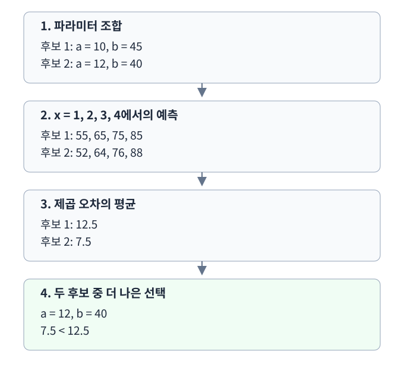

# P2-6.1 최적화(optimization)는 무엇을 찾는가

> Section ID: `P2-6.1`
> Version: `v2026.07.20`

P2-5장에서는 데이터를 숫자로 요약하고, 표본으로 전체를 추정하며, 코드로 평균과 분산을 확인했습니다. 이제 질문이 바뀝니다.

값을 계산하는 것만으로 충분할까요? 여러 후보 중에서 더 좋은 값을 어떻게 찾을까요? 무엇을 기준으로 좋다고 말할 수 있을까요?

이 질문은 조금 낯섭니다. 평균이나 분산은 값을 계산하면 결과가 바로 나옵니다. 하지만 “더 좋은 값”을 찾는 일은 다릅니다. 처음부터 답이 주어져 있지 않고, 여러 후보를 놓고 비교해야 합니다.

이 지점에서 최적화(optimization)라는 말이 등장합니다. 여기서는 최적화를 “어떤 값을 고르면 더 나아지는가?”라는 질문을 붙잡기 위한 이름으로 다룹니다.

여기서는 `최적화(optimization)`, `후보(candidate)`, `기준(criterion)`, `제약(constraint)`, `최소화/최대화(minimization/maximization)`를 다시 정리합니다. Chapter 5에서 데이터와 추정을 읽었다면, 이제 여러 후보 중 더 나은 값을 찾는 문제를 학습의 입구로 다시 정리합니다.

여기서는 최적화 알고리즘을 계산하기보다, 학습을 더 나은 값을 찾아가는 문제로 다시 읽는 데 집중합니다. 여기서 후보, 기준, 제약, 최소화의 감각을 잡아 두면, 뒤에서 손실 함수(loss function), 경사하강법(gradient descent), 옵티마이저(optimizer)를 볼 때 수식보다 먼저 문제 장면이 떠오릅니다.

## 먼저 붙잡을 공통 장면

Chapter 6에서는 작은 예시 하나를 세 절에서 계속 재사용합니다. 네 학생의 공부 시간 `x`와 퀴즈 점수 `y`가 다음과 같다고 해 봅시다.

| 학생 | 공부 시간 `x` | 퀴즈 점수 `y` |
| --- | ---: | ---: |
| A | 1 | 55 |
| B | 2 | 65 |
| C | 3 | 80 |
| D | 4 | 90 |

이제 질문은 `공부 시간을 넣으면 점수를 예측하는 직선 y = ax + b를 어떻게 고를까?`입니다. 여기서 `a`와 `b`를 직접 정답으로 쓰는 대신, 여러 후보 직선을 비교해 더 나은 쪽을 찾는 문제가 바로 최적화입니다.

- `a = 10, b = 45`도 하나의 후보입니다.
- `a = 12, b = 40`도 다른 후보입니다.
- 무엇이 더 나은지는 실제 점수와 얼마나 잘 맞는지라는 기준이 있어야 판단할 수 있습니다.
- 뒤 절에서는 이 기준을 손실(loss)이라 부르고, 그 손실이 줄어드는 쪽으로 직선을 움직이는 방법을 경사하강법이라 부릅니다.

| 지금 이 절에서 잡을 것 | 바로 다음에 이어질 질문 | 이후 다시 쓰이는 위치 |
| --- | --- | --- |
| 최적화가 좋은 값을 찾는 문제라는 감각 | P2-6.2에서 손실 함수와 목적 함수를 봅니다. | Part 3의 모델 선택과 Part 4의 학습 절차 설명에서 다시 씁니다. |
| 후보, 기준, 제약을 나누어 보는 방식 | P2-6.3에서 경사하강법이 어떻게 더 나은 후보로 움직이는지 봅니다. | 옵티마이저와 하이퍼파라미터 논의를 읽을 때 바탕이 됩니다. |
| 학습을 파라미터 조정 문제로 읽는 시선 | `P2-6.2`, `P2-6.3`에서 손실을 줄이는 방향의 의미로 이어집니다. | Part 4의 역전파, Part 5의 튜닝·평가 문맥에서 다시 등장합니다. |

교과서식으로 말하면, 최적화는 정해진 변수(variable)와 제약(constraint) 안에서 목적 함수(objective function)를 최소화(minimize)하거나 최대화(maximize)하는 값을 찾는 문제입니다.

다만 이 정의만 먼저 보면 어렵습니다. 그래서 여기서는 정의를 지우지 않고, 정의가 필요한 장면을 함께 봅니다.

아직 정확한 수식이나 알고리즘을 몰라도 됩니다. 여기서는 정답을 바로 쓰는 것이 아니라, 후보를 놓고, 기준으로 비교하고, 조금 더 나은 쪽으로 움직인다는 감각을 만드는 것이 목적입니다.



## 이 절의 목표

- 최적화(optimization)를 정답을 바로 쓰는 일이 아니라 더 나은 후보를 찾아가는 관점으로 설명할 수 있습니다.
- 후보(candidate), 기준(criterion), 제약(constraint)을 구분할 수 있습니다.
- 최소화(minimization)와 최대화(maximization)를 기본 방향으로 설명할 수 있습니다.
- 최적(optimal)이 항상 현실의 완벽한 답을 뜻하지 않음을 설명할 수 있습니다.
- AI 학습에서 모델이 직접 정답 규칙을 쓰기보다, 기준을 줄이거나 키우는 방향으로 값을 조정한다는 관점을 설명할 수 있습니다.

## 세 가지 기준

| 기준 | 왜 중요한가 | 이 절에서 필요한 이해 수준 |
| --- | --- | --- |
| 최적화는 가능한 후보들 중 더 나은 선택을 찾는 문제다 | 계산 자체보다 비교 기준이 먼저 필요하다는 점을 보여 준다 | 후보를 놓고 더 나은 값을 찾는 문제라는 정도면 충분하다 |
| 목적과 제약이 무엇이 좋은지 정한다 | 최적이라는 말이 절대적 품질이 아니라 조건부 판단임을 분명히 한다 | 기준과 제약이 함께 있어야 비교가 가능하다고 이해한다 |
| AI 학습도 손실을 줄이는 더 나은 파라미터를 찾는 과정이다 | 최적화가 추상 수학이 아니라 학습 절차의 입구라는 연결을 만든다 | 학습을 값 조정 문제로 읽는 관점을 잡는다 |

## 좋은 값을 찾는 장면에서 시작한다

최적화(optimization)를 처음부터 수학 용어로 이해하려 하면 딱딱해집니다. 먼저 “좋은 값을 찾는 장면”을 생각합니다. 예를 들어 가장 짧은 이동 경로를 찾거나, 가장 적은 비용으로 물건을 사거나, 기다리는 시간이 가장 짧은 줄을 고르거나, 가장 높은 점수를 낼 설정을 찾는 상황입니다.

이 예들을 모두 수학적 최적화라고 부를 필요는 없습니다. 하지만 최적화의 감각을 익히기에는 좋습니다. 공통점은 후보가 여러 개 있고, 그중 무엇이 더 좋은지 판단할 기준이 있으며, 현실에서는 아무 선택이나 할 수 없어서 제약도 있다는 점입니다.

수학과 AI에서는 이 흐름을 계산 가능한 형태로 만들려고 합니다. 그때 최적화라는 말이 본격적으로 등장합니다.

앞의 공부 시간-점수 표도 같은 구조입니다. 직선 후보는 여러 개 만들 수 있지만, 어떤 직선이 더 좋은지 알려면 실제 점수와의 차이를 계산하는 기준이 필요합니다. 즉 `좋은 직선`은 눈대중이 아니라 비교 기준 위에서 정해집니다.

## 정의를 다시 풀어 읽는다

앞에서 본 교과서식 정의를 다시 가져오겠습니다. 최적화는 정해진 변수와 제약 안에서 목적 함수를 최소화하거나 최대화하는 값을 찾는 문제입니다.

이 문장에는 네 가지 단어가 들어 있습니다.

| 용어 | 먼저 이해할 뜻 |
| --- | --- |
| 변수(variable) | 바꿔 볼 수 있는 값 |
| 제약(constraint) | 지켜야 하는 조건 |
| 목적 함수(objective function) | 좋고 나쁨을 계산하는 기준 |
| 최소화/최대화(minimize/maximize) | 줄이거나 키우고 싶은 방향 |

정의가 어렵게 느껴지는 이유는 수식이 어려워서만이 아닙니다. “좋다”라는 말을 숫자로 바꾸고, 선택 가능한 범위를 정하고, 그 안에서 더 나은 값을 찾는 사고 자체가 익숙하지 않기 때문입니다.

## 후보, 기준, 제약으로 나누어 본다

최적화는 처음부터 “답”을 들고 시작하지 않습니다. 먼저 후보(candidate)가 있습니다. 후보는 아직 확정된 답이 아니라 “이 값이면 어떨까?” 하고 시도해 볼 수 있는 값입니다.

예를 들어 직선을 하나 그어 데이터에 맞추고 싶다고 하겠습니다.

```text
y = ax + b
```

여기서 `a`와 `b`를 어떻게 정하느냐에 따라 직선이 달라집니다.

```text
a = 1, b = 0
a = 2, b = -3
a = 0.5, b = 4
```

각 조합은 하나의 후보입니다. 최적화는 이런 후보 중에서 기준에 더 잘 맞는 값을 찾으려는 시도입니다.

Chapter 6의 공통 장면으로 읽으면, `a`와 `b`를 이렇게 바꿔 가며 공부 시간과 점수 데이터를 더 잘 설명하는 직선을 찾는 일이 됩니다. 뒤 절의 손실 함수는 `어느 후보가 더 잘 맞는가`를 숫자로 만들고, 경사하강법은 `그 숫자가 줄어드는 쪽으로 어떻게 움직일까`를 설명합니다.

후보가 여러 개 있어도 기준(criterion)이 없으면 비교할 수 없습니다.

| 상황 | 후보(candidate) | 기준(criterion) |
| --- | --- | --- |
| 이동 경로 선택 | 여러 경로 | 이동 시간이 짧은가 |
| 물건 구매 | 여러 상품 | 비용이 낮은가 |
| 대기 줄 선택 | 여러 줄 | 기다리는 시간이 짧은가 |
| 모델 설정 선택 | 여러 설정값 | 평가 점수가 좋은가 |

현실에는 제약(constraint)도 있습니다. 예를 들어 비용은 10만 원을 넘으면 안 되고, 응답 시간은 1초 안에 끝나야 하며, 메모리는 특정 용량을 넘으면 안 되고, 법과 정책을 지켜야 하며, 사용자 경험을 망치면 안 될 수 있습니다.

그래서 최적화는 단순히 숫자 하나를 가장 좋게 만드는 일이 아닙니다. 후보, 기준, 제약을 함께 보는 문제입니다.

## 이런 사고가 필요한 분야가 많다

최적화는 AI에서만 쓰이는 사고가 아닙니다. “좋은 선택을 하고 싶은데 기준과 제약이 있다”면 비슷한 문제가 생깁니다.

| 분야 | 찾고 싶은 것 | 기준 | 제약 |
| --- | --- | --- | --- |
| 물류 | 배송 경로 | 이동 거리, 시간, 비용 | 차량 수, 시간 제한, 배송 순서 |
| 제조 | 생산 계획 | 생산량, 불량률, 비용 | 설비 용량, 재고, 납기 |
| 광고 | 예산 배분 | 전환율, 매출, 클릭률 | 예산, 노출 제한, 정책 |
| 서비스 운영 | 서버 자원 배치 | 응답 속도, 안정성, 비용 | 서버 비용, 트래픽 변동 |
| 검색/추천 | 결과 순서 | 클릭, 만족도, 관련성 | 다양성, 안전성, 정책 |
| 머신러닝 | 모델 파라미터 | 손실, 정확도, 평가 점수 | 데이터, 계산량, 시간 |

업무에서는 이런 질문으로 나타납니다.

- 비용을 더 쓰면 얼마나 좋아지는가?
- 지금 기준에서 무엇을 줄여야 하는가?
- 속도를 높이면 품질이 떨어지는가?
- 정확도를 높이면 비용이나 지연 시간이 늘어나는가?
- 제약을 지키면서 가장 나은 선택은 무엇인가?

이런 질문은 정답을 한 번에 쓰기 어렵습니다. 기준을 정하고, 후보를 비교하고, 제약을 확인하면서 더 나은 선택을 찾아야 합니다.

## 역사적으로는 계산 가능한 선택 문제에서 자라났다

최적화(optimization)는 AI가 등장하면서 갑자기 생긴 말이 아닙니다. 더 오래된 흐름에서는 “여러 선택지 중에서 제한된 자원을 어떻게 배분할 것인가”라는 문제와 가까웠습니다.

예를 들어 전쟁, 물류, 생산, 일정 계획에서는 제한된 차량으로 어떤 경로를 돌릴지, 제한된 인력으로 어떤 작업을 배정할지, 제한된 원료로 어떤 제품을 얼마나 만들지, 제한된 시간 안에 어떤 순서로 일을 처리할지가 중요한 질문이었습니다.

이 질문들은 단순히 “열심히 계산한다”로 해결되지 않습니다. 후보가 너무 많고, 기준과 제약이 함께 있기 때문입니다. 그래서 수학과 컴퓨팅은 이런 문제를 계산 가능한 형태로 바꾸려 했습니다.

선형계획법(linear programming)은 이런 흐름을 보여 주는 대표적인 역사적 사례입니다. 목적(objective)을 정하고, 제약(constraint)을 둔 뒤, 가능한 선택 중 더 나은 값을 찾는 방식입니다. George Dantzig의 simplex method는 물류, 일정, 네트워크 최적화 같은 실제 문제와 함께 자주 언급됩니다.

여기서는 선형계획법이나 simplex method의 계산 절차를 다루지 않습니다. 중요한 것은 역사적 방향입니다. 현실의 선택 문제가 기준과 제약을 가진 계산 문제로 바뀌고, 다시 더 나은 값을 찾는 알고리즘으로 정리되었으며, 그 흐름이 AI 학습에서 모델 값을 조정하는 문제로 이어졌다는 점입니다.

따라서 최적화는 “AI 전용 기술”이라기보다, 기준과 제약 속에서 더 나은 값을 찾으려는 오래된 계산 사고가 AI 학습 안으로 들어온 것으로 이해할 수 있습니다.

## 최소화와 최대화가 있다

최적화 문제는 보통 두 방향으로 표현됩니다. 작을수록 좋은 값을 줄이는 쪽은 최소화(minimization)이고, 클수록 좋은 값을 키우는 쪽은 최대화(maximization)입니다.

예를 들어 이동 시간, 비용, 오차, 손실은 보통 줄이고 싶습니다.

반대로 정확도, 수익, 만족도 같은 값은 보통 키우고 싶습니다.

AI 학습에서는 “줄이고 싶은 값”이 자주 등장합니다. 예측이 실제와 얼마나 다른지를 숫자로 만들고, 그 값을 줄이는 방향으로 모델의 값을 조정합니다. 아직 이 숫자를 정확히 몰라도 됩니다. 다음 절에서 손실 함수(loss function)라는 이름으로 다시 봅니다.

## 최적은 완벽하다는 뜻이 아니다

최적(optimal)이라는 말은 조심해서 읽어야 합니다. 이름만 보면 완벽한 답처럼 들리지만, 실제로는 그렇지 않을 때가 많습니다.

보통은 정해진 후보 범위 안에서, 정해진 기준에 대해, 정해진 제약을 지키며 찾은 더 좋은 값을 뜻합니다.

따라서 최적화 결과를 볼 때는 다음 질문을 함께 해야 합니다.

- 무엇을 기준으로 최적이라고 했는가?
- 어떤 후보 범위에서 찾았는가?
- 어떤 제약을 반영했는가?
- 현실의 다른 조건은 빠지지 않았는가?

이 관점은 AI 모델 평가에도 그대로 이어집니다. 어떤 모델이 특정 벤치마크에서 높은 점수를 얻었다고 해서 모든 현실 문제에서 최적이라는 뜻은 아닙니다. “어떤 기준에서 좋았는가?”를 계속 물어야 합니다.

## AI 학습은 최적화 문제로 볼 수 있다

AI 학습에서는 사람이 규칙을 하나하나 직접 쓰지 않는 경우가 많습니다. 대신 모델이 가진 값을 조정해 데이터에 더 잘 맞게 만듭니다. 이것이 낯선 지점입니다.

학습은 다음처럼 보일 수 있습니다. 먼저 예측해 보고, 틀린 정도를 본 뒤, 조금 고치고, 다시 예측해 보는 흐름입니다.

흐름을 조금 더 기술적으로 쓰면 모델이 예측하고, 예측과 실제의 차이를 계산하고, 그 차이를 줄이는 방향으로 값을 조정한 뒤, 다시 예측한다고 말할 수 있습니다.

이 흐름은 최적화의 관점으로 읽을 수 있습니다. 완벽히 이해하지 못해도 괜찮습니다. 지금은 학습이 더 나은 값을 찾아가는 반복 과정으로 설명될 수 있다는 연결만 잡으면 됩니다. 여기서 후보는 현재 모델 파라미터이고, 기준은 예측이 얼마나 나쁜지 나타내는 숫자이며, 목표는 그 숫자를 줄이는 것입니다.

여기서 주의할 점이 있습니다. 이 절의 `parameter`는 모델이 학습으로 조정하는 값입니다. P2-5.3에서 본 통계의 모수(parameter)와 문맥이 다릅니다. 모델 파라미터는 학습 과정에서 조정되는 값이고, 통계의 모수는 모집단의 실제 특성입니다.

같은 영어 단어라도 맥락을 확인해야 합니다. 다음 절에서는 이 “예측이 얼마나 나쁜지 나타내는 숫자”를 손실 함수(loss function)와 목적 함수(objective function)라는 말로 정리합니다.

## 사례 및 예시

### 사례 1. 광고 예산을 어디에 배분해야 하는가

한 팀이 이번 달 광고 예산 1,000만 원을 검색 광고, 배너 광고, 리타게팅 광고에 나누어 쓰려고 한다고 하겠습니다. 실무자는 보통 지난달 성과를 보고 `어디가 잘됐는지`, `어디가 비싼지`, `어디가 전환이 낮았는지`를 먼저 확인합니다.

하지만 성과가 좋았던 채널에 예산을 전부 몰아넣는다고 해서 바로 최선이 되지는 않습니다. 검색 광고는 이미 포화 상태라 추가 예산 효과가 작을 수 있고, 배너 광고는 노출은 많지만 전환이 낮을 수 있으며, 리타게팅 광고는 효율은 좋지만 도달 가능한 사용자 수가 제한될 수 있습니다.

이 장면에서 최적화는 `정답을 아는 일`이 아니라 `여러 후보 배분안을 기준과 제약으로 비교하는 일`입니다. 후보는 예산 배분안이고, 기준은 전환 수나 매출일 수 있으며, 제약은 총예산, 채널별 최소 집행액, 노출 정책 같은 조건입니다. 즉 무엇이 좋은 배분인지 말하려면 먼저 `무엇을 좋다고 볼지`와 `무엇을 넘으면 안 되는지`를 함께 정해야 합니다.

확인 가능한 결과는 여러 배분안에 대해 예상 전환 수와 비용을 표로 비교하는 것입니다. 예를 들어 A안은 전환 1,200건에 비용 980만 원, B안은 전환 1,150건에 비용 900만 원, C안은 전환 1,260건이지만 정책 한도를 넘는다면, `가장 큰 숫자`만이 아니라 `기준과 제약을 함께 만족하는 더 나은 후보`가 무엇인지 분명해집니다.

## 체크리스트

- 최적화(optimization)를 정답을 바로 쓰는 일이 아니라 더 나은 후보를 찾아가는 과정으로 설명할 수 있다.
- 후보(candidate), 기준(criterion), 제약(constraint)을 구분할 수 있다.
- 최소화(minimization)와 최대화(maximization)를 예로 설명할 수 있다.
- 최적(optimal)이 항상 완벽한 현실 답을 뜻하지 않음을 설명할 수 있다.
- AI 학습을 모델 파라미터를 조정해 기준을 개선하는 과정으로 설명할 수 있다.
- 학습을 단순 계산이 아니라 `더 나은 값 찾기` 문제로 다시 읽을 수 있다.
- 후보, 기준, 제약이 섞여 보일 때 무엇을 비교하고 무엇을 지켜야 하는지 분리할 수 있다.

## 출처와 참고 자료

- Stephen Boyd, Lieven Vandenberghe, [Convex Optimization](https://web.stanford.edu/~boyd/cvxbook/bv_cvxbook.pdf){: target="_blank" rel="noopener noreferrer" }, Cambridge University Press, 2004, 확인 날짜: 2026-07-20. 목적 함수와 제약 조건 아래에서 값을 최소화하는 최적화 문제 형식 확인에 사용했다.
- SciPy Developers, [Optimization and root finding](https://docs.scipy.org/doc/scipy/reference/optimize.html){: target="_blank" rel="noopener noreferrer" }, SciPy API Reference, 확인 날짜: 2026-07-20. 목적 함수를 최소화하거나 최대화하고, 제약을 포함할 수 있는 최적화 도구의 실제 API 맥락 확인에 사용했다.
- Ian Goodfellow, Yoshua Bengio, Aaron Courville, [Deep Learning, Chapter 8: Optimization for Training Deep Models](https://www.deeplearningbook.org/contents/optimization.html){: target="_blank" rel="noopener noreferrer" }, MIT Press, 2016, 확인 날짜: 2026-07-20. 딥러닝 학습에서 비용 함수(cost function)를 줄이는 방향으로 파라미터를 조정한다는 설명 확인에 사용했다.
- Gary Wolf, [The Optimizer](https://www.wired.com/2001/12/dantzig/){: target="_blank" rel="noopener noreferrer" }, Wired, 2001-12-01, 확인 날짜: 2026-07-20. George Dantzig와 simplex method가 물류·일정·네트워크 최적화 같은 실제 문제와 연결되어 설명되는 역사적 맥락 확인에 사용했다.
