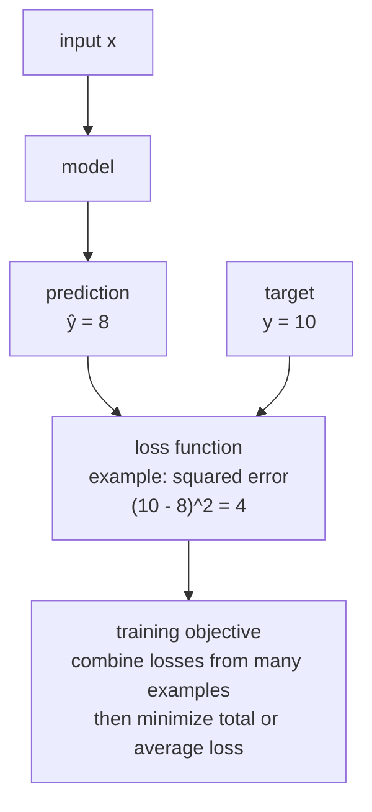

# P2-6.2 손실 함수(loss function)와 목적 함수(objective function)

> Section ID: `P2-6.2`
> Version: `v2026.07.09`

P2-6.1에서는 최적화를 “후보를 놓고, 기준으로 비교하고, 제약 안에서 더 나은 값을 찾는 문제”로 봤습니다. 이제 그 기준이 모델 학습에서는 어떤 이름으로 등장하는지 봅니다.

모델은 처음부터 “내가 얼마나 틀렸는지”를 알지 못합니다. 그래서 사람이 먼저 틀림을 숫자로 바꾸는 기준을 정해야 합니다. 이 기준이 손실 함수(loss function)입니다.

여기서는 `손실 함수(loss function)`, `목적 함수(objective function)`, `오차(error)`, `평균 손실(mean loss)`, `평가 지표(metric)`를 다시 정리합니다. 6.1에서 더 나은 값을 찾는 문제를 읽었다면, 이제 학습이 실제로 무엇을 기준으로 움직이는지 정리합니다.

여기서는 손실 함수 공식을 많이 외우기보다, 학습이 무엇을 기준으로 움직이는지 읽는 데 집중합니다. 여기서 손실 함수, 평균 손실, 목적 함수의 차이를 잡아 두면, 뒤에서 경사하강법과 역전파가 등장해도 `무엇을 줄이기 위해 움직이는가`를 놓치지 않고 따라갈 수 있습니다.

## 6.1의 공통 장면으로 다시 보기

앞 절의 데이터를 그대로 가져옵니다.

| 학생 | 공부 시간 `x` | 실제 점수 `y` |
| --- | ---: | ---: |
| A | 1 | 55 |
| B | 2 | 65 |
| C | 3 | 80 |
| D | 4 | 90 |

후보 직선 하나를 `\(\hat{y} = 10x + 45\)`라고 두면 예측값은 `55, 65, 75, 85`가 됩니다. 이 장면에서 손실 함수의 역할은 `이 직선이 얼마나 안 맞는가`를 숫자로 바꾸는 일입니다. 즉 6.1의 `후보 비교`가 여기서 `손실 계산`으로 구체화됩니다.

즉 모델이 예측하고, 실제값과 비교하고, 틀린 정도를 숫자로 만든 뒤, 그 숫자를 줄이는 방향으로 학습합니다.


```mermaid
flowchart TD
  X["input x"]
  M["model"]
  P["prediction<br/>ŷ = 8"]
  Y["target<br/>y = 10"]
  L["loss function<br/>example: squared error<br/>(10 - 8)^2 = 4"]
  O["training objective<br/>combine losses from many examples<br/>then minimize total or average loss"]

  X --> M --> P
  P --> L
  Y --> L
  L --> O
```

## 이 절의 범위

여기서는 손실 함수(loss function)와 목적 함수(objective function)를 AI 학습의 기준으로 소개합니다. 어떤 손실을 언제 선택해야 하는지의 세부 기준은 회귀와 분류는 Part 3의 알고리즘 장에서, 문제 유형별 손실은 P4-4.1과 P4-4.2에서 다시 다룹니다.

다음 내용은 깊게 다루지 않습니다.

- 회귀(regression), 분류(classification), 생성(generation)별 손실 함수 목록
- 교차 엔트로피(cross entropy)의 확률적 해석
- 정규화(regularization)를 포함한 목적 함수의 세부 설계
- 손실 곡면(loss surface)의 모양
- 경사하강법(gradient descent)의 업데이트 절차

회귀와 분류에서 자주 쓰는 손실의 직관은 P4-4.1과 P4-4.2에서 다시 다루고, 정규화는 P4-8.1에서, 경사하강법의 반복 구조는 P2-6.3과 P4-7.1에서 이어집니다. 생성 모델의 손실 설계 세부와 손실 곡면의 자세한 형태는 이 책의 현재 본편 범위 밖에 둡니다.

여기서 먼저 해결할 질문은 이것입니다. `모델이 틀렸다는 사실을 어떻게 학습이 실제로 움직일 수 있는 숫자 기준으로 바꾸는가`입니다.

그래서 이 절에서는 다음 네 질문만 먼저 고정합니다.

- 손실 함수는 무엇을 숫자로 만드는가?
- 목적 함수는 손실 함수와 어떻게 다른가?
- 손실이 낮다는 말은 항상 좋은 모델이라는 뜻인가?
- 평가 지표(metric)와 손실 함수는 같은 말인가?

| 용어 | 아주 짧은 뜻 | 이 절에서의 역할 |
| --- | --- | --- |
| 손실 함수 | 틀림을 숫자로 바꾸는 함수 | 학습 기준의 출발점 |
| 목적 함수 | 학습이 실제로 줄이거나 키우는 전체 기준 | 최적화의 대상 |
| 오차 | 실제값과 예측값의 차이 | 손실의 재료 |
| 평균 손실 | 여러 샘플 손실을 묶은 값 | 데이터 전체 경향을 보는 기준 |
| 평가 지표 | 사람이 해석하고 비교하는 기준 | 손실과 구분해야 할 운영 관점 |

이 절 다음 흐름도 단순합니다.

- `P2-6.3`에서는 지금 만든 손실 기준을 실제로 어떻게 줄여 가는지 경사하강법으로 이어 봅니다.
- Part 3과 Part 4에서는 회귀, 분류, 생성 문제마다 손실이 어떤 모습으로 바뀌는지 다시 읽습니다.
- Part 5 운영 문맥에서는 손실과 실제 서비스 지표가 왜 다를 수 있는지 다시 등장합니다.

## 이 절의 목표

- 손실 함수(loss function)를 예측의 틀림을 숫자로 바꾸는 함수로 설명할 수 있습니다.
- 목적 함수(objective function)를 학습에서 줄이거나 키우려는 전체 기준으로 설명할 수 있습니다.
- 개별 샘플의 손실과 여러 샘플의 평균 손실을 구분할 수 있습니다.
- 평균 제곱 오차(mean squared error, MSE)의 직관을 작은 숫자로 계산할 수 있습니다.
- 손실 함수와 평가 지표(metric)가 항상 같은 것은 아님을 설명할 수 있습니다.

## 세 가지 기준

| 기준 | 왜 중요한가 | 이 절에서 필요한 이해 수준 |
| --- | --- | --- |
| 손실은 모델이 얼마나 틀렸는지를 숫자로 만든 값이다 | 학습이 감각적 판단이 아니라 계산 가능한 기준 위에서 움직인다는 점을 보여 준다 | 틀림을 숫자로 바꾼다는 역할을 이해한다 |
| 여러 샘플의 손실을 묶어 전체 경향을 본다 | 한 번의 우연한 예측이 아니라 데이터 전반에서의 성능을 봐야 하기 때문이다 | 평균 손실이 왜 필요한지 설명할 수 있으면 충분하다 |
| 손실 함수와 평가 지표는 같을 수도 다를 수도 있다 | 학습 기준과 실제 운영 판단 기준을 혼동하면 해석이 어긋난다 | 학습용 숫자와 보고용 숫자를 구분하는 감각을 잡는다 |

## 손실은 틀림을 숫자로 만든다

모델의 예측이 틀렸다는 말은 사람에게는 자연스럽지만, 컴퓨터가 바로 사용할 수 있는 말은 아닙니다. 컴퓨터가 값을 조정하려면 틀림이 숫자로 표현되어야 합니다.

예를 들어 실제값이 10이고 모델 예측이 8이라고 하겠습니다.

```text
actual value: 10
prediction: 8
error: 10 - 8 = 2
```

오차(error)는 2입니다. 하지만 학습에서는 오차를 그대로 쓰지 않고 제곱하거나, 절댓값을 취하거나, 확률에 로그를 적용하는 등 문제에 맞는 방식으로 바꿉니다. 이때 사용하는 함수가 손실 함수(loss function)입니다.

가장 쉬운 예시는 제곱 오차(squared error)입니다.

\[
\mathrm{loss} = (y - \hat{y})^2
\]

여기서 \(y\)는 실제값이고, \(\hat{y}\)는 모델의 예측값입니다.

```text
actual y = 10
prediction y_hat = 8
loss = (10 - 8)^2 = 4
```

이 숫자 4는 “얼마나 틀렸는지”를 계산 가능한 값으로 바꾼 결과입니다. 이제 모델은 이 숫자를 줄이는 방향으로 값을 조정할 수 있습니다.

공통 장면으로 바꾸어 읽으면, 학생마다 `실제 점수 - 예측 점수`를 계산하고 그 오차를 제곱 오차 같은 손실로 바꿉니다. 손실 함수는 결국 `후보 직선이 데이터에 얼마나 안 맞는가`를 비교 가능한 숫자로 만드는 장치입니다.

## 왜 그냥 오차를 쓰지 않는가

“예측이 2만큼 틀렸다면 오차 2를 쓰면 되지 않을까?”라고 생각할 수 있습니다. 하지만 오차에는 방향이 있습니다. 예를 들어 실제값 10에 대해 예측값 8은 오차 2를 만들고, 예측값 12는 오차 -2를 만듭니다.

두 예측은 모두 실제값에서 2만큼 떨어져 있습니다. 그런데 부호가 다릅니다. 여러 샘플의 오차를 그냥 더하면 서로 상쇄될 수 있습니다.

```text
2 + (-2) = 0
```

틀린 예측 두 개가 있었는데 합계는 0이 됩니다. 이것은 모델이 잘 맞았다는 뜻이 아닙니다. 그래서 손실 함수는 오차를 학습에 쓸 수 있는 숫자로 바꿉니다.

| 방식 | 계산 | 직관 |
| --- | --- | --- |
| 절댓값 오차(absolute error) | \(|y - \hat{y}|\) | 얼마나 떨어졌는지 본다 |
| 제곱 오차(squared error) | \((y - \hat{y})^2\) | 큰 오차를 더 크게 벌준다 |
| 로그 손실(log loss) | 확률 예측에 로그를 적용 | 확률을 틀리게 자신한 경우를 강하게 벌준다 |

여기서는 제곱 오차만 계산합니다. 분류와 회귀에서 손실 함수가 왜 달라지는지는 P4-4.1과 P4-4.2에서 다시 다루고, 로그 손실(log loss) 자체를 읽는 입문 기준은 P3-6.4 보충학습에서 다시 연결합니다.

## 여러 샘플의 손실을 하나로 묶는다

학습 데이터는 보통 하나의 샘플(sample)만 갖고 있지 않습니다. 여러 샘플에 대해 예측하고, 각 샘플의 손실을 계산합니다.

예를 들어 세 개의 샘플이 있다고 하겠습니다.

| 샘플 | 실제값 \(y\) | 예측값 \(\hat{y}\) | 제곱 오차 |
| --- | ---: | ---: | ---: |
| 1 | 10 | 8 | 4 |
| 2 | 5 | 6 | 1 |
| 3 | 7 | 4 | 9 |

샘플마다 손실이 다릅니다. 학습에서는 이 손실들을 하나의 기준으로 묶어야 합니다. 가장 단순한 방법은 평균을 내는 것입니다.

\[
\mathrm{MSE} = \frac{4 + 1 + 9}{3} = \frac{14}{3} \approx 4.67
\]

이 평균 제곱 오차(mean squared error, MSE)는 여러 예측의 틀림을 하나의 숫자로 요약합니다.

앞의 직선 예시에서도 학생 A부터 D까지 나온 손실을 평균내면, 직선 `\(\hat{y} = 10x + 45\)` 하나에 대한 전체 점수를 만들 수 있습니다. 이제 다른 직선 후보와 평균 손실을 직접 비교할 수 있고, 이 비교 가능성이 최적화와 학습을 이어 줍니다.

조금 더 일반적으로 쓰면 다음과 같습니다.

\[
\mathrm{MSE}(y, \hat{y}) =
\frac{1}{n}
\sum_{i=1}^{n}
(y_i - \hat{y}_i)^2
\]

여기서 시그마(sigma)는 P2-2.2에서 본 것처럼 같은 계산을 여러 샘플에 반복해 더한다는 뜻입니다. 손실 함수는 시그마와 만나면서 “데이터 전체에서 얼마나 틀렸는가”를 나타내는 숫자가 됩니다.

## 목적 함수는 학습이 실제로 움직일 기준이다

손실 함수(loss function)와 목적 함수(objective function)는 자주 함께 쓰입니다. 여기서는 손실 함수는 예측이 얼마나 틀렸는지 계산하는 함수이고, 목적 함수는 학습이 실제로 줄이거나 키우려는 전체 기준이라고 구분합니다.

많은 경우 목적 함수는 평균 손실입니다.

```text
objective = average loss
```

하지만 항상 그렇게 단순하지는 않습니다. 예를 들어 모델이 너무 복잡해지지 않도록 벌점을 더할 수도 있습니다.

```text
objective = average loss + regularization penalty
```

이 식을 지금 자세히 이해할 필요는 없습니다. 중요한 것은 목적 함수가 “학습 과정이 실제로 최적화하려는 기준”이라는 점입니다. 손실 함수가 그 기준의 핵심 재료가 되는 경우가 많습니다.

독자 기준에서는 `학생 한 명에서 얼마나 틀렸는가`와 `네 학생 전체에서 이 직선 후보가 얼마나 안 맞는가`를 나눠 읽는 것이 중요합니다. 전자는 개별 손실이고, 후자는 평균 손실이나 목적 함수 쪽으로 이어집니다.

## 낮은 손실은 좋은 신호이지만 충분한 결론은 아니다

손실이 낮아졌다는 것은 보통 좋은 신호입니다. 모델의 예측이 학습 데이터 기준에서 더 잘 맞아졌다는 뜻이기 때문입니다.

하지만 낮은 손실만 보고 모델이 현실에서도 좋다고 단정하면 안 됩니다. 학습 데이터에서만 손실이 낮을 수 있고, 새 데이터에서는 잘 맞지 않을 수 있으며, 서비스 목표와 손실 함수가 다를 수 있고, 안전, 공정성, 비용 같은 제약은 손실 하나로 충분히 표현되지 않을 수 있습니다.

P2-5.3에서 본 표본(sample)과 오차(error)의 관점이 여기서 다시 등장합니다. 학습 데이터의 손실은 우리가 가진 데이터에서 계산한 값입니다. 실제 세계 전체에서의 성능을 완전히 보장하지 않습니다.

그래서 학습에서는 보통 훈련 데이터(training data)와 검증 데이터(validation data), 테스트 데이터(test data)를 나누어 봅니다. 이 데이터 분리는 나중에 머신러닝 파트에서 더 자세히 다룹니다.

## 손실 함수와 평가 지표는 같을 수도 있고 다를 수도 있다

손실 함수(loss function)는 학습 과정에서 모델 값을 조정하기 위해 사용됩니다. 평가 지표(metric)는 모델 결과를 사람이 해석하고 비교하기 위해 사용됩니다.

두 값이 같은 경우도 있습니다. 예를 들어 학습도 MSE로 하고 평가도 MSE로 하는 경우입니다.

하지만 다를 수도 있습니다. 예를 들어 학습은 로그 손실(log loss)을 줄이지만, 보고서에서는 정확도(accuracy), 정밀도(precision), 재현율(recall)을 보고, 실제 서비스에서는 비용, 지연 시간, 위험도까지 함께 볼 수 있습니다.

이 차이는 실무에서 중요합니다. 모델이 학습 중에 줄이는 숫자와 사람이 실제로 중요하게 보는 숫자가 다르면, 모델은 엉뚱한 방향으로 좋아질 수 있습니다.

공부 시간-점수 예시로도 같은 구분이 가능합니다. 학습은 평균 손실이 낮은 직선을 찾을 수 있지만, 사람은 `고득점 학생을 특히 많이 틀리는가`, `전반적으로 점수를 낮게 잡는가` 같은 해석 질문을 따로 볼 수 있습니다. 손실은 학습의 나침반이고, 평가는 사람이 결과를 읽는 자리입니다.

## 사례로 보기

### 사례 1. 배송 시간 예측에서 손실이 하는 일

택배 서비스가 주문별 배송 도착 시간을 예측한다고 해 보겠습니다. 사람은 `서울 도심`, `퇴근 시간`, `비 오는 날`, `물류센터 혼잡` 같은 조건이 늦어짐과 관련 있다고 설명할 수는 있지만, 각 조건이 몇 분씩 영향을 주는지 매번 손으로 정하기는 어렵습니다.

그래서 모델은 먼저 각 주문에 대해 도착 시간을 예측하고, 실제 도착 시간과 비교합니다. 예를 들어 실제 도착이 60분인데 예측이 50분이면 10분 차이가 납니다. 손실 함수는 이 차이를 학습에 쓸 수 있는 숫자로 바꿉니다.

이때 중요한 것은 `모델이 얼마나 틀렸는가`를 한 주문이 아니라 여러 주문 전체에서 함께 본다는 점입니다. 특정 주문 하나는 우연히 크게 빗나갈 수 있지만, 전체적으로 손실이 낮아지면 모델이 데이터 전반에서 더 나은 방향으로 조정되고 있다는 신호가 됩니다.

또한 서비스 운영팀이 실제로 중요하게 보는 기준은 평균 오차 하나로 끝나지 않을 수 있습니다. VIP 고객 지연, 새벽 배송 실패, 특정 지역 편차처럼 별도 지표가 더 중요할 수도 있습니다. 이 사례는 손실 함수와 평가 지표가 왜 같을 수도 있고 다를 수도 있는지를 보여 줍니다.

## 이 절에서 기억할 관점

손실 함수는 모델의 틀림을 숫자로 바꾸는 장치입니다. 목적 함수는 그 숫자를 포함해 학습이 실제로 줄이거나 키우려는 기준입니다. 흐름을 순서대로 적으면 모델이 예측하고, 실제값과 비교하고, 손실을 계산하고, 여러 손실을 묶은 뒤, 목적 함수를 줄이는 방향으로 학습합니다.

다음 절에서는 이 목적 함수를 줄이기 위해 모델의 값을 어떻게 조금씩 바꾸는지 봅니다. 그때 경사하강법(gradient descent)이 등장합니다.

## 짧은 점검

- 손실 함수(loss function)를 예측의 틀림을 숫자로 바꾸는 함수로 설명할 수 있다.
- 실제값 \(y\)와 예측값 \(\hat{y}\)의 차이를 이용해 제곱 오차를 계산할 수 있다.
- 평균 제곱 오차(mean squared error, MSE)가 여러 샘플의 손실을 평균낸 값임을 설명할 수 있다.
- 목적 함수(objective function)를 학습이 실제로 최적화하려는 기준으로 설명할 수 있다.
- 손실 함수와 평가 지표(metric)가 항상 같은 것은 아님을 설명할 수 있다.
- 낮은 손실이 좋은 신호이지만, 현실 성능을 자동으로 보장하지는 않음을 설명할 수 있다.

## 언제 이 관점을 먼저 떠올려야 하는가

- 모델이 `얼마나 틀렸는가`를 어떻게 숫자로 바꾸는지 막연할 때 먼저 떠올립니다.
- 개별 오차, 여러 샘플의 평균 손실, 학습 전체 목적 함수가 한 덩어리로 보일 때 먼저 떠올립니다.
- 손실이 낮다는 사실과 실제 운영에서 좋은 모델이라는 판단을 구분해야 할 때 먼저 떠올립니다.

## 출처와 참고 자료

- Ian Goodfellow, Yoshua Bengio, Aaron Courville, [Deep Learning, Chapter 5: Machine Learning Basics](https://www.deeplearningbook.org/contents/ml.html){: target="_blank" rel="noopener noreferrer" }, MIT Press, 2016, 확인 날짜: 2026-06-24.
- scikit-learn developers, [3.4. Metrics and scoring: quantifying the quality of predictions](https://scikit-learn.org/stable/modules/model_evaluation.html){: target="_blank" rel="noopener noreferrer" }, scikit-learn User Guide, 확인 날짜: 2026-06-24.
