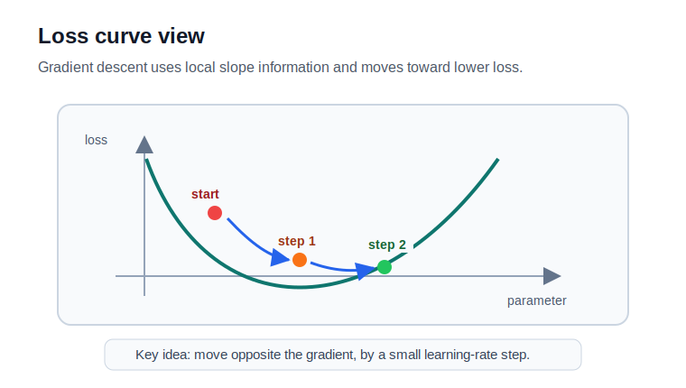
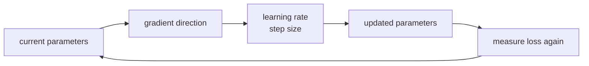

# P2-6.3 경사하강법(gradient descent)의 직관

P2-6.1에서는 최적화를 더 나은 값을 찾는 문제로 봤고, P2-6.2에서는 모델의 틀림을 손실(loss)이라는 숫자로 만드는 방법을 봤습니다. 이제 질문은 더 구체적입니다.

```text
줄이고 싶은 숫자가 생겼다.
그렇다면 모델의 값을 어떻게 바꿀 것인가?
```

경사하강법(gradient descent)은 이 질문에 대한 대표적인 답입니다. 이름은 어렵지만, 핵심은 단순합니다.

```text
현재 위치에서 손실이 어느 방향으로 커지는지 본다.
그 반대 방향으로 조금 움직인다.
다시 손실을 본다.
이 과정을 반복한다.
```

먼저 손실 곡선 위에서 보면, 경사하강법은 현재 위치에서 손실이 낮아지는 방향으로 작은 이동을 반복하는 방법입니다.



이 이동을 학습 루프로 보면 다음처럼 읽을 수 있습니다.



## 이 절의 범위

이 절은 경사하강법(gradient descent)의 직관을 다룹니다. P2-4.5에서 그래디언트(gradient), 편미분(partial derivative), 경사하강법의 이름을 보충수업으로 다뤘다면, 여기서는 최적화 장의 흐름 안에서 경사하강법이 어떤 역할을 하는지 정리합니다.

다음 내용은 깊게 다루지 않습니다.

- 편미분(partial derivative)의 계산 절차
- 경사하강법 업데이트 공식의 엄밀한 유도
- 확률적 경사하강법(stochastic gradient descent, SGD)의 세부 구현
- Adam, RMSProp 같은 옵티마이저(optimizer)
- 딥러닝 역전파(backpropagation)의 계산 절차

이 내용은 이후 머신러닝, 딥러닝 파트에서 다시 다룹니다. 여기서는 “왜 조금씩 움직이는가”와 “무엇을 조심해야 하는가”에 집중합니다.

이 절에서는 다음 질문에 집중합니다.

```text
경사하강법은 왜 반복 방법인가?
그래디언트는 어떤 방향 정보를 주는가?
학습률(learning rate)은 왜 필요한가?
경사하강법이 항상 완벽한 답을 보장하지 않는 이유는 무엇인가?
```

## 이 절의 목표

- 경사하강법(gradient descent)을 손실을 낮추기 위한 반복 이동 방법으로 설명할 수 있습니다.
- 그래디언트(gradient)가 현재 위치의 방향 정보임을 설명할 수 있습니다.
- 그래디언트 반대 방향으로 이동하는 이유를 설명할 수 있습니다.
- 학습률(learning rate)을 한 번에 얼마나 움직일지 정하는 값으로 설명할 수 있습니다.
- 경사하강법의 한계와 주의점을 입문 수준에서 설명할 수 있습니다.

## 산에서 내려오는 비유는 유용하지만 완전하지 않다

경사하강법은 산에서 내려오는 비유로 자주 설명됩니다. 높은 곳에 서 있을 때 주변 경사를 보고 더 낮아지는 방향으로 조금씩 내려간다는 설명입니다.

이 비유는 처음 이해하기에 좋습니다.

```text
현재 위치
-> 현재 모델 파라미터

높이
-> 손실 값

내려가는 방향
-> 손실이 줄어드는 방향
```

하지만 이 비유를 너무 믿으면 오해가 생깁니다. 실제 모델 학습에서는 산의 전체 지도를 한눈에 보는 것이 아닙니다. 현재 위치 근처의 변화 방향을 보고 조금 움직입니다.

```text
전체 지도를 아는 것이 아니다.
현재 위치 근처의 방향을 읽는다.
조금 움직이고 다시 확인한다.
```

그래서 경사하강법은 한 번에 정답으로 뛰어가는 방법이 아니라, 현재 정보로 조금씩 개선하려는 반복 방법입니다.

## 그래디언트는 올라가는 방향을 알려 준다

그래디언트(gradient)는 현재 위치에서 함수값이 가장 빠르게 증가하는 방향과 연결됩니다. 손실 함수(loss function)를 생각하면, 그래디언트 방향은 손실이 커지는 방향입니다.

AI 학습에서는 보통 손실을 줄이고 싶습니다. 그래서 그래디언트가 가리키는 방향 그대로 움직이지 않고, 그 반대 방향으로 움직입니다.

```text
그래디언트 방향
-> 손실이 커지는 쪽

그래디언트 반대 방향
-> 손실이 줄어드는 쪽
```

이것이 `descent`라는 말의 핵심입니다. `gradient`를 계산하지만, 목표는 올라가는 것이 아니라 내려가는 것입니다.

## 조금만 움직여야 한다

손실이 줄어드는 방향을 알았다고 해서 멀리 뛰어가면 되는 것은 아닙니다. 현재 위치의 그래디언트는 현재 근처의 정보입니다. 너무 크게 움직이면 더 낮은 곳으로 가는 대신 지나쳐 버릴 수 있습니다.

그래서 경사하강법에는 학습률(learning rate)이 필요합니다. 학습률은 한 번에 얼마나 움직일지 정하는 값입니다.

```text
학습률이 너무 작으면
-> 너무 천천히 움직인다.

학습률이 적절하면
-> 손실이 안정적으로 줄어들 수 있다.

학습률이 너무 크면
-> 좋은 위치를 지나치거나 손실이 흔들릴 수 있다.
```

입문 단계에서는 학습률을 “발걸음 크기”로 이해하면 됩니다. 방향을 알고 있어도 발걸음이 너무 크거나 작으면 학습이 어려워집니다.

## 업무에서는 무엇을 조금씩 바꾸는가

경사하강법은 “AI 모델 내부의 숫자를 바꾸는 방법”으로만 생각하면 멀게 느껴집니다. 업무 관점에서는 다음과 같이 볼 수 있습니다.

```text
목표가 있다.
현재 설정으로 결과를 낸다.
결과가 얼마나 나쁜지 숫자로 본다.
그 숫자가 줄어드는 방향으로 설정을 조금 바꾼다.
다시 확인한다.
```

이 구조는 여러 업무 예시로 생각해 볼 수 있습니다.

| 업무 상황 | 줄이고 싶은 것 | 조금씩 바꾸는 것 | 경사하강법적 관점 |
| --- | --- | --- | --- |
| 광고 문구 추천 | 클릭되지 않은 정도, 전환이 낮은 정도 | 문구 후보의 점수, 노출 순서 | 어떤 표현이 더 나은 결과를 만드는지 반복적으로 조정한다 |
| 상품 추천 | 사용자가 관심 없는 상품을 추천한 정도 | 상품별 가중치, 사용자 취향 표현 | 추천 결과의 손실을 보고 사용자와 상품 표현을 조정한다 |
| 수요 예측 | 실제 판매량과 예측 판매량의 차이 | 계절성, 가격, 이벤트 영향의 가중치 | 예측 오차가 줄어드는 쪽으로 모델 값을 바꾼다 |
| 불량 탐지 | 정상 제품을 불량으로 보거나 불량 제품을 놓친 정도 | 센서값의 중요도, 판단 경계 | 잘못된 판단을 줄이도록 기준을 조금씩 움직인다 |
| 배송 시간 예측 | 실제 도착 시간과 예측 도착 시간의 차이 | 거리, 시간대, 교통 변수의 영향 | 오차가 줄어드는 방향으로 변수의 영향력을 조정한다 |

여기서 중요한 점은 사람이 업무 규칙을 하나하나 완성해서 넣는 것이 아니라는 점입니다. 사람은 목표와 데이터, 손실을 정하고, 모델은 반복 계산을 통해 내부 값을 조정합니다.

```text
사람이 직접 규칙을 완성한다.
-> "비가 오면 10분 더한다" 같은 규칙 작성

모델이 손실을 보고 값을 조정한다.
-> 비, 거리, 시간대, 교통량의 영향을 데이터에서 조정
```

이 예시는 경사하강법이 모든 업무 문제를 자동으로 해결한다는 뜻이 아닙니다. 업무에서는 데이터 품질, 목표 설정, 비용, 안전, 설명 가능성 같은 조건이 함께 필요합니다. 경사하강법은 그중 “정해진 손실을 줄이기 위해 값을 어떻게 바꿀 것인가”에 답하는 계산 방법입니다.

## 업데이트 식은 이동의 구조를 압축한 표현이다

경사하강법은 보통 다음과 같은 모양의 식으로 표현됩니다.

\[
\theta_{\text{new}}
=
\theta_{\text{old}}
-
\eta \nabla J(\theta)
\]

처음 보면 복잡해 보이지만, 읽는 방법은 단순합니다.

| 기호 | 입문적 의미 |
| --- | --- |
| \(\theta\) | 모델이 조정하는 파라미터(parameter) |
| \(J(\theta)\) | 줄이고 싶은 목적 함수(objective function) |
| \(\nabla J(\theta)\) | 현재 위치에서 손실이 커지는 방향 정보 |
| \(\eta\) | 학습률(learning rate), 한 번에 움직이는 크기 |
| \(-\eta \nabla J(\theta)\) | 손실이 줄어드는 쪽으로 조금 움직이는 양 |

이 절의 목표는 이 식을 유도하는 것이 아닙니다. 식이 말하는 구조를 읽는 것입니다.

```text
현재 파라미터에서
그래디언트 반대 방향으로
학습률만큼 조금 이동한다.
```

## 반복이 학습처럼 보이는 이유

경사하강법은 같은 일을 반복합니다.

```text
1. 현재 파라미터로 예측한다.
2. 손실을 계산한다.
3. 그래디언트를 계산한다.
4. 파라미터를 조금 바꾼다.
5. 다시 예측한다.
```

이 반복이 학습(training)의 핵심 흐름처럼 보입니다. 모델이 스스로 개념을 이해한다기보다, 손실이 줄어드는 방향으로 내부 값을 조정합니다.

이때 중요한 것은 모델이 “정답 규칙”을 직접 받는 것이 아니라는 점입니다. 모델은 현재 파라미터로 예측하고, 손실을 보고, 방향 정보를 이용해 파라미터를 바꿉니다.

```text
정답 규칙을 직접 작성한다.
-> 규칙 기반 접근에 가깝다.

손실이 줄어드는 방향으로 파라미터를 조정한다.
-> 학습 기반 접근의 기본 흐름에 가깝다.
```

## 항상 완벽한 답을 보장하지는 않는다

경사하강법은 강력하지만, 완벽한 답을 자동으로 보장하는 방법은 아닙니다.

결과는 여러 조건에 영향을 받습니다.

| 조건 | 왜 중요한가 |
| --- | --- |
| 시작 위치(initialization) | 어디서 출발하느냐에 따라 경로가 달라질 수 있다 |
| 학습률(learning rate) | 너무 작으면 느리고, 너무 크면 불안정할 수 있다 |
| 손실 함수의 모양(loss landscape) | 골짜기, 평평한 구간, 여러 낮은 지점이 있을 수 있다 |
| 데이터(data) | 손실은 데이터에서 계산되므로 데이터 품질에 영향을 받는다 |
| 반복 횟수(iterations) | 너무 적으면 덜 학습되고, 너무 많으면 과적합될 수 있다 |

이것이 6.1에서 말한 “최적은 완벽하다는 뜻이 아니다”와 연결됩니다. 경사하강법은 주어진 기준과 조건 안에서 더 나은 방향으로 움직이는 방법입니다. 현실의 모든 조건을 자동으로 해결하지 않습니다.

## 이 절에서 기억할 관점

경사하강법은 손실을 줄이기 위해 파라미터를 조금씩 바꾸는 반복 방법입니다.

```text
손실을 계산한다.
그래디언트로 방향을 읽는다.
그래디언트 반대 방향으로 조금 이동한다.
다시 손실을 계산한다.
```

이 흐름은 이후 딥러닝에서 계속 다시 등장합니다. 다만 딥러닝에서는 파라미터가 매우 많고, 그래디언트를 계산하는 일이 복잡합니다. 그래서 역전파(backpropagation)와 옵티마이저(optimizer)가 등장합니다.

지금은 다음 정도를 기억하면 충분합니다.

```text
손실 함수
-> 무엇을 줄일지 정한다.

그래디언트
-> 어느 방향으로 변하는지 알려 준다.

경사하강법
-> 그 방향 정보를 이용해 조금씩 값을 바꾼다.
```

## 체크리스트

- 경사하강법(gradient descent)을 손실을 낮추기 위한 반복 이동 방법으로 설명할 수 있다.
- 그래디언트(gradient)가 현재 위치에서 손실이 커지는 방향과 연결됨을 설명할 수 있다.
- 손실을 줄이기 위해 그래디언트 반대 방향으로 움직인다는 점을 설명할 수 있다.
- 학습률(learning rate)을 한 번에 움직이는 크기로 설명할 수 있다.
- 경사하강법 업데이트 식을 “현재 값에서 그래디언트 반대 방향으로 조금 이동한다”는 구조로 읽을 수 있다.
- 경사하강법이 시작 위치, 학습률, 손실 함수 모양, 데이터, 반복 횟수에 영향을 받는다는 점을 설명할 수 있다.

## 출처와 참고 자료

- Ian Goodfellow, Yoshua Bengio, Aaron Courville, [Deep Learning, Chapter 8: Optimization for Training Deep Models](https://www.deeplearningbook.org/contents/optimization.html){: target="_blank" rel="noopener noreferrer" }, MIT Press, 2016, 확인 날짜: 2026-06-24.
- Stephen Boyd, Lieven Vandenberghe, [Convex Optimization](https://web.stanford.edu/~boyd/cvxbook/bv_cvxbook.pdf){: target="_blank" rel="noopener noreferrer" }, Cambridge University Press, 2004, 확인 날짜: 2026-06-24.
