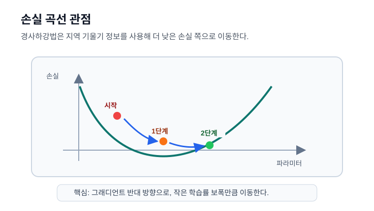

# P2-6.3 경사하강법(gradient descent)의 직관

> Section ID: `P2-6.3`
> Version: `v2026.09.08`

경사하강법(gradient descent)은 현재 파라미터에서 목적 함수의 그래디언트(gradient)를 계산하고, 그 반대 방향으로 파라미터를 바꾸는 방법입니다. 학습률(learning rate)은 그래디언트에 곱하는 값으로 이동량을 조절합니다.

## 직선 모델의 현재 손실

공부 시간으로 점수를 예측하는 데이터를 사용합니다.

| 학생 | 공부 시간 `x` | 실제 점수 `y` |
| --- | ---: | ---: |
| A | 1 | 55 |
| B | 2 | 65 |
| C | 3 | 80 |
| D | 4 | 90 |

현재 직선을 \(\hat{y} = 8x + 45\)로 두면 예측값은 `53, 61, 69, 77`입니다. 실제값보다 각각 `2, 4, 11, 13`만큼 낮습니다. 평균 제곱 오차는 `(4 + 16 + 121 + 169) / 4 = 77.5`입니다.

기울기 `a`와 절편 `b`를 바꿔 이 손실을 줄이는 것이 목표입니다.

이 이동을 학습 루프로 보면 다음처럼 읽을 수 있습니다.

```mermaid
--8<-- "assets/part-02/chapter-06/gradient-descent-loop-flow-ko.mmd"
```

## 방향·이동량·반복

| 기준 | 왜 중요한가 |
| --- | --- |
| 경사하강법은 손실이 줄어드는 쪽으로 작은 이동을 반복한다 | 학습이 한 번의 정답 도약이 아니라 반복적 조정이라는 점을 보여 준다 |
| 그래디언트 반대 방향으로 움직여야 한다 | 그래디언트는 손실이 커지는 방향 정보이므로 목표와 반대로 읽어야 한다 |
| 학습률은 한 번의 이동 폭을 정한다 | 방향이 맞아도 보폭이 잘못되면 학습이 흔들리거나 느려질 수 있다 |

## 현재 위치의 기울기

경사하강법은 산에서 내려오는 비유로 자주 설명됩니다. 높은 곳에 서 있을 때 주변 경사를 보고 더 낮아지는 방향으로 조금씩 내려간다는 설명입니다.

이 비유는 처음 이해하기에 좋습니다. 현재 위치는 현재 모델 파라미터를, 높이는 손실 값을, 내려가는 방향은 손실이 줄어드는 방향을 뜻한다고 보면 됩니다.

하지만 이 비유를 너무 믿으면 오해가 생깁니다. 실제 모델 학습에서는 산의 전체 지도를 한눈에 보는 것이 아닙니다. 현재 위치 근처의 방향을 읽고, 조금 움직인 뒤, 다시 확인합니다.

그래서 경사하강법은 한 번에 정답으로 뛰어가는 방법이 아니라, 현재 정보로 조금씩 개선하려는 반복 방법입니다.

공부 시간-점수 예시에서도 그렇습니다. 현재 직선이 학생 C, D를 전반적으로 낮게 예측한다면, 한 번에 완벽한 직선을 찍기보다 `기울기 a를 조금 키우면 손실이 줄어드는가`, `절편 b를 조금 조정하면 더 나아지는가`를 반복해서 확인합니다.

## 그래디언트의 반대 방향

그래디언트(gradient)는 현재 위치에서 함수값이 가장 빠르게 증가하는 방향과 연결됩니다. 손실 함수(loss function)를 생각하면, 그래디언트 방향은 손실이 커지는 방향입니다.

AI 학습에서는 보통 손실을 줄이고 싶습니다. 그래서 그래디언트가 가리키는 방향 그대로 움직이지 않고, 그 반대 방향으로 움직입니다. 그래디언트 방향은 손실이 커지는 쪽이고, 그래디언트의 반대 방향은 손실이 줄어드는 쪽입니다.

이것이 `descent`라는 말의 핵심입니다. `gradient`를 계산하지만, 목표는 올라가는 것이 아니라 내려가는 것입니다.

미분 가능한 목적 함수에서 그래디언트가 0이 아닐 때, 반대 방향으로 충분히 작게 이동하면 목적 함수값이 줄어듭니다. 이동량이 크면 같은 방향으로 움직여도 손실이 늘 수 있습니다.

## 학습률과 이동 크기

손실이 줄어드는 방향을 알았다고 해서 멀리 뛰어가면 되는 것은 아닙니다. 현재 위치의 그래디언트는 현재 근처의 정보입니다. 너무 크게 움직이면 더 낮은 곳으로 가는 대신 지나쳐 버릴 수 있습니다.

그래서 경사하강법에는 학습률(learning rate)이 필요합니다. 학습률은 한 번에 얼마나 움직일지 정하는 값입니다. 학습률이 너무 작으면 너무 천천히 움직이고, 적절하면 손실이 안정적으로 줄어들 수 있으며, 너무 크면 좋은 위치를 지나치거나 손실이 흔들릴 수 있습니다.

실제 이동량은 학습률과 그래디언트의 곱입니다. 학습률이 같아도 그래디언트의 크기가 달라지면 이동 거리도 달라집니다.

예를 들어 기울기 `a`를 한 번에 너무 크게 올리면 학생 D 쪽 오차는 줄어도 학생 A, B 쪽에서는 오히려 지나칠 수 있습니다. 반대로 너무 조금만 바꾸면 손실이 줄어드는 방향을 알아도 개선이 매우 느립니다. 학습률은 이 보폭을 정합니다.

## 경사하강법 업데이트 식

경사하강법은 보통 다음과 같은 모양의 식으로 표현됩니다.

\[
\theta_{\text{new}}
=
\theta_{\text{old}}
-
\eta \nabla J(\theta)
\]

기호는 다음 값을 나타냅니다.

| 기호 | 입문적 의미 |
| --- | --- |
| \(\theta\) | 모델이 조정하는 파라미터(parameter) |
| \(J(\theta)\) | 줄이고 싶은 목적 함수(objective function) |
| \(\nabla J(\theta)\) | 현재 위치에서 손실이 커지는 방향 정보 |
| \(\eta\) | 학습률(learning rate), 그래디언트에 곱하는 이동량 계수 |
| \(-\eta \nabla J(\theta)\) | 손실이 줄어드는 쪽으로 조금 움직이는 양 |

이 모델에서 \(\theta\)는 `[a, b]`이고 목적 함수 \(J\)는 네 학생의 평균 제곱 오차입니다. 식은 `현재 파라미터 − 학습률 × 그래디언트`라는 계산을 압축합니다.

## 기울기와 절편의 한 번 업데이트

각 학생의 `예측값 − 실제값`을 \(r_i\)로 쓰면 현재 오차는 `−2, −4, −11, −13`입니다. 평균 제곱 오차를 각 파라미터에 대해 미분하면 다음과 같습니다.

\[
\frac{\partial J}{\partial a}=\frac{2}{4}\sum_{i=1}^{4}r_i x_i
=\frac{2}{4}(-2-8-33-52)=-47.5
\]

\[
\frac{\partial J}{\partial b}=\frac{2}{4}\sum_{i=1}^{4}r_i
=\frac{2}{4}(-2-4-11-13)=-15
\]

`a`를 바꾸면 공부 시간 `x`가 큰 학생의 예측이 더 많이 변하므로 첫 식에는 `x_i`가 곱해집니다. `b`를 바꾸면 모든 학생의 예측이 같은 양만큼 바뀝니다.

학습률이 `0.01`이면 업데이트 결과는 다음과 같습니다.

- `a_new = 8 − 0.01 × (−47.5) = 8.475`
- `b_new = 45 − 0.01 × (−15) = 45.15`

새 직선으로 다시 예측하면 MSE는 `77.5`에서 약 `54.76`으로 줄어듭니다. 다음 업데이트에서는 새 위치 `[8.475, 45.15]`의 그래디언트를 다시 계산합니다.

## 예측부터 업데이트까지

경사하강법은 같은 일을 반복합니다.

1. 현재 파라미터로 예측한다.
2. 손실을 계산한다.
3. 그래디언트를 계산한다.
4. 파라미터를 조금 바꾼다.
5. 다시 예측한다.

## 학습률별 손실 비교

같은 시작점 `[8, 45]`와 같은 그래디언트 `[-47.5, -15]`에서 학습률만 바꿔 한 번 이동해 봅니다.

| 학습률 | 새 a | 새 b | 이동 후 MSE |
| --- | --- | --- | --- |
| 0.001 | 8.0475 | 45.015 | 약 75.04 |
| 0.01 | 8.475 | 45.15 | 약 54.76 |
| 0.2 | 17.5 | 48 | 약 409.63 |

세 경우 모두 그래디언트의 반대 방향으로 움직였지만, 학습률 `0.2`에서는 손실이 크게 늘었습니다. `0.001`에서는 손실이 줄어드는 폭이 작습니다. 방향을 정하는 일과 적절한 이동량을 정하는 일은 함께 필요합니다.

## 수렴에 영향을 주는 조건

경사하강법은 강력하지만, 완벽한 답을 자동으로 보장하는 방법은 아닙니다.

결과는 여러 조건에 영향을 받습니다.

| 조건 | 왜 중요한가 |
| --- | --- |
| 시작 위치(initialization) | 어디서 출발하느냐에 따라 경로가 달라질 수 있다 |
| 학습률(learning rate) | 너무 작으면 느리고, 너무 크면 불안정할 수 있다 |
| 손실 함수의 모양(loss landscape) | 골짜기, 평평한 구간, 여러 낮은 지점이 있을 수 있다 |
| 데이터(data) | 손실은 데이터에서 계산되므로 데이터 품질에 영향을 받는다 |
| 반복 횟수(iterations) | 너무 적으면 덜 학습되고, 너무 많으면 과적합될 수 있다 |

경사하강법은 주어진 기준과 조건 안에서 더 나은 방향으로 움직이는 방법입니다. 현실의 모든 조건을 자동으로 해결하지 않습니다.

## 체크리스트

- 경사하강법(gradient descent)을 손실을 낮추기 위한 반복 이동 방법으로 설명할 수 있다.
- 그래디언트(gradient)가 현재 위치에서 손실이 커지는 방향과 연결됨을 설명할 수 있다.
- 손실을 줄이기 위해 그래디언트 반대 방향으로 움직인다는 점을 설명할 수 있다.
- 학습률(learning rate)을 한 번에 움직이는 크기로 설명할 수 있다.
- 경사하강법 업데이트 식을 `현재 값에서 그래디언트 반대 방향으로 조금 이동한다`는 구조로 읽을 수 있다.
- 경사하강법이 시작 위치, 학습률, 손실 함수 모양, 데이터, 반복 횟수에 영향을 받는다는 점을 설명할 수 있다.
- 손실을 줄인다는 말이 실제로 파라미터를 어떻게 바꾸는지까지 연결해 설명할 수 있다.
- 그래디언트 방향과 그 반대 방향 이동이 왜 필요한지 구분할 수 있다.

## 출처와 참고 자료

- Ian Goodfellow, Yoshua Bengio, Aaron Courville, [Deep Learning, Chapter 8: Optimization for Training Deep Models](https://www.deeplearningbook.org/contents/optimization.html){: target="_blank" rel="noopener noreferrer" }, MIT Press, 2016, 확인 날짜: 2026-07-20. 딥러닝 최적화에서 비용 함수, 파라미터, 그래디언트 기반 이동, 경사하강법, 학습률의 역할을 설명하는 근거로 사용했다.
- Stephen Boyd, Lieven Vandenberghe, [Convex Optimization](https://web.stanford.edu/~boyd/cvxbook/bv_cvxbook.pdf){: target="_blank" rel="noopener noreferrer" }, Cambridge University Press, 2004, 확인 날짜: 2026-07-20. 최적화 문제와 그래디언트 기반 반복 이동을 수학적 최적화 맥락에서 확인하는 보조 근거로 사용했다.
