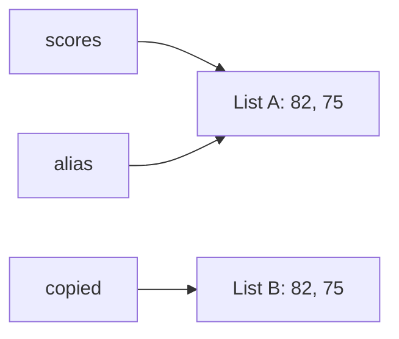

# P2-8.7 Supplementary Learning: References and Copies

> Section ID: `P2-8.7`
> Version: `v2026.09.15`

## Assignment and References

Assignment connects a name to an object. `other_scores = scores` creates no new list: both names refer to the list already named `scores`. This relationship from a name to an object is called a reference.

Refer to `[82, 75, 91]` through two names, then append `68` via `other_scores`. Both outputs are `[82, 75, 91, 68]`.

```python
scores = [82, 75, 91]
other_scores = scores

other_scores.append(68)

print(scores)
print(other_scores)
```

Example output:

```text
[82, 75, 91, 68]
[82, 75, 91, 68]
```

`scores` and `other_scores` refer to the same list. A value added through one name is visible through the other.

## Equal Values and Identical Objects

`==` compares values; `is` checks object identity. Copying a list with equal contents does not make the two lists the same object.

```python
scores = [82, 75]
alias = scores
copied = scores.copy()
print(scores == copied)
print(scores is copied)
print(scores is alias)
```

The outputs are `True`, `False`, and `True`. Value comparison alone does not establish that original and copy are separate objects. The arrows below show the object each name refers to.



Use `==` to compare numeric or string values, rather than relying on internal object reuse with `is`. The check `value is None` asks whether the value is the `None` object.

## Shallow Copies

A shallow copy creates a new outer container while retaining references to its contents.

Create a new outer list with `scores.copy()` and append `68` to the copy. The original is `[82, 75, 91]`; the copy is `[82, 75, 91, 68]`.

```python
scores = [82, 75, 91]
copied_scores = scores.copy()

copied_scores.append(68)

print(scores)
print(copied_scores)
```

Example output:

```text
[82, 75, 91]
[82, 75, 91, 68]
```

Because the outer list is new, appending to it does not directly change the original list.

Adding an item to the outer list and changing an item inside an inner list modify different objects.

## Shared Nested Lists

Shallow-copy `[[1, 2], [3, 4]]`, then change the first value of its first row to `99`. Both original and copy become `[[99, 2], [3, 4]]`.

```python
matrix = [[1, 2], [3, 4]]
shallow = matrix.copy()

shallow[0][0] = 99

print(matrix)
print(shallow)
```

Example output:

```text
[[99, 2], [3, 4]]
[[99, 2], [3, 4]]
```

`matrix` and `shallow` are different outer lists, but their first items refer to the same row list. `shallow[0][0] = 99` changes a value inside that shared row.

Replace the mutation with `shallow[0] = [99, 2]` and rerun from the beginning. The original stays `[[1, 2], [3, 4]]`, because this replaces the copy's first item with a new row rather than mutating the shared row.

## Deep Copies

A deep copy recursively copies internal objects that support copying. Here it creates both a new outer list and new inner row lists.

Using `copy.deepcopy()` on this nested list also creates new inner rows. Changing the copy's first value to `99` leaves the original as `[[1, 2], [3, 4]]`.

```python
import copy

matrix = [[1, 2], [3, 4]]
deep = copy.deepcopy(matrix)

deep[0][0] = 99

print(matrix)
print(deep)
```

Example output:

```text
[[1, 2], [3, 4]]
[[99, 2], [3, 4]]
```

The effect on the original depends on whether you modify the outer or inner list. Deep copying does not recreate every object: immutable objects may be reused, and it does not duplicate external resources such as files or sockets.

| Method | Intuition | Nested-structure concern |
| --- | --- | --- |
| Assignment | View one object through another name | Changes can be visible through both names |
| Shallow copy | Create only a new outer container | Nested objects may remain shared |
| Deep copy | Copy inner structure too | Helps preserve the original but may cost more |

## Case: Preserving Original Scores During Experiments

Change the first value in the first row of `[[10, 20], [30, 40]]` to `-1`. A uses assignment, B a shallow copy, and C a deep copy; each starts with a fresh original. A and B change the original, while C preserves it.

```python
import copy

base = [[10, 20], [30, 40]]

case_a = base

case_a[0][0] = -1
print("A:", base, case_a)

base = [[10, 20], [30, 40]]
case_b = base.copy()
case_b[0][0] = -1
print("B:", base, case_b)

base = [[10, 20], [30, 40]]
case_c = copy.deepcopy(base)
case_c[0][0] = -1
print("C:", base, case_c)
```

Example output:

```text
A: [[-1, 20], [30, 40]] [[-1, 20], [30, 40]]
B: [[-1, 20], [30, 40]] [[-1, 20], [30, 40]]
C: [[10, 20], [30, 40]] [[-1, 20], [30, 40]]
```

In B, changing an item inside the first row also affects the original. Replacing that mutation with `case_b.append([50, 60])` and rerunning leaves two rows in the original and three in the copy. The required copying depth depends on which object you will modify.

## Checklist

- Can you explain how two names can refer to one list?
- Can you distinguish shallow and deep copies with a nested-list example?
- Can you explain why copying matters in data preprocessing?
- Can you distinguish assignment, shallow copy, and deep copy by what remains shared?

- Can you explain how `==` compares values while `is` checks object identity?

## Sources and References


- Python Software Foundation, [The Python Tutorial - More on Lists](https://docs.python.org/3/tutorial/datastructures.html){: target="_blank" rel="noopener noreferrer" }, Python 3 documentation, checked on 2026-07-20. Used to confirm list assignment, `list.copy()`, slice copying, and list-method examples.
- Python Software Foundation, [Standard Library - `copy`](https://docs.python.org/3/library/copy.html){: target="_blank" rel="noopener noreferrer" }, Python 3 documentation, checked on 2026-09-15. Used as the core basis for the difference between assignment and copying, the definitions of shallow and deep copy, and the copying difference for nested objects.

- Python Software Foundation, [Built-in Types: Comparisons](https://docs.python.org/3/library/stdtypes.html#comparisons){: target="_blank" rel="noopener noreferrer" }, 2026-09-15. Value equality and object identity.
