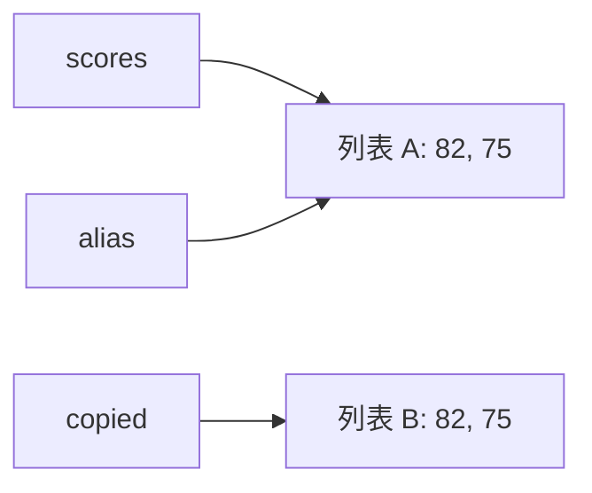

# P2-8.7 补充学习：区分引用与复制

> Section ID: `P2-8.7`
> Version: `v2026.09.15`

## 赋值与引用

赋值将名称与对象关联。`other_scores = scores` 不创建新列表，而是让两个名称都指向 `scores` 原本指向的列表。名称指向对象的关系称为引用。

用两个名称引用 `[82, 75, 91]`，再通过 `other_scores` 添加 `68`。两次输出都是 `[82, 75, 91, 68]`。

```python
scores = [82, 75, 91]
other_scores = scores

other_scores.append(68)

print(scores)
print(other_scores)
```

输出示例：

```text
[82, 75, 91, 68]
[82, 75, 91, 68]
```

`scores` 与 `other_scores` 指向同一列表。通过其中一个名称添加值，另一个也会看到相同变化。

## 相等的值与同一个对象

`==` 比较值是否相等，`is` 检查是否为同一个对象。即使列表副本内容相等，两者也不是同一对象。

```python
scores = [82, 75]
alias = scores
copied = scores.copy()
print(scores == copied)
print(scores is copied)
print(scores is alias)
```

输出依次为 `True`、`False`、`True`。只比较值，不能判断原对象与副本是否分离。下面箭头表示各名称引用的对象。



比较数字或字符串的值时使用 `==`，不要依赖内部对象复用情况用 `is` 比较值。`value is None` 检查的则是是否为 `None` 对象。

## 浅拷贝

浅拷贝创建新的外层容器，但其中的值仍可沿用原来的引用。

用 `scores.copy()` 创建新外层列表，再向副本添加 `68`。原列表为 `[82, 75, 91]`，副本为 `[82, 75, 91, 68]`。

```python
scores = [82, 75, 91]
copied_scores = scores.copy()

copied_scores.append(68)

print(scores)
print(copied_scores)
```

输出示例：

```text
[82, 75, 91]
[82, 75, 91, 68]
```

由于外层列表是新建的，对副本调用 `append()` 不会直接改变原列表。

向外层列表添加项，与修改内部列表中的项，改变的是不同对象。

## 嵌套列表的共享

对 `[[1, 2], [3, 4]]` 浅拷贝后，把第一行第一个值改为 `99`。原列表与副本都会变为 `[[99, 2], [3, 4]]`。

```python
matrix = [[1, 2], [3, 4]]
shallow = matrix.copy()

shallow[0][0] = 99

print(matrix)
print(shallow)
```

输出示例：

```text
[[99, 2], [3, 4]]
[[99, 2], [3, 4]]
```

`matrix` 与 `shallow` 是不同的外层列表，但两者第一项指向同一个行列表。`shallow[0][0] = 99` 修改了共享行内部的值。

把修改行换成 `shallow[0] = [99, 2]` 并从头执行，原列表会保持 `[[1, 2], [3, 4]]`。该赋值用新行替换副本第一项，并未修改共享行。

## 深拷贝

深拷贝递归复制可复制的内部对象。本例会新建外层列表以及内部行列表。

对同一嵌套列表使用 `copy.deepcopy()`，内部行列表也会重新创建。把副本首值改为 `99`，原列表仍为 `[[1, 2], [3, 4]]`。

```python
import copy

matrix = [[1, 2], [3, 4]]
deep = copy.deepcopy(matrix)

deep[0][0] = 99

print(matrix)
print(deep)
```

输出示例：

```text
[[1, 2], [3, 4]]
[[99, 2], [3, 4]]
```

对原对象的影响取决于修改外层还是内层列表。深拷贝并不表示所有对象都会新建：不可变对象可能被复用，它也不是复制文件、套接字等外部资源的方法。

| 方式 | 直观理解 | 嵌套结构注意事项 |
| --- | --- | --- |
| 赋值 | 用另一个名称看同一对象 | 一方修改可能同时可见 |
| 浅拷贝 | 只新建外层 | 内部对象可能共享 |
| 深拷贝 | 内层也复制 | 有利于保留原对象，但成本可能更高 |

## 案例：实验中保留原始分数

把 `[[10, 20], [30, 40]]` 第一行的首值改为 `-1`。A 使用赋值，B 使用浅拷贝，C 使用深拷贝，每次都从新的原列表开始。A、B 改变原列表，C 保留原列表。

```python
import copy

base = [[10, 20], [30, 40]]

case_a = base

case_a[0][0] = -1
print("A:", base, case_a)

base = [[10, 20], [30, 40]]
case_b = base.copy()
case_b[0][0] = -1
print("B:", base, case_b)

base = [[10, 20], [30, 40]]
case_c = copy.deepcopy(base)
case_c[0][0] = -1
print("C:", base, case_c)
```

输出示例：

```text
A: [[-1, 20], [30, 40]] [[-1, 20], [30, 40]]
B: [[-1, 20], [30, 40]] [[-1, 20], [30, 40]]
C: [[10, 20], [30, 40]] [[-1, 20], [30, 40]]
```

B 中修改第一行内部的项，也影响原列表。若改为 `case_b.append([50, 60])` 并从头执行，原列表仍有两行，只有副本变为三行。需要复制多深，取决于实际要修改哪个对象。

## 检查清单

- 能否解释两个名称如何引用同一个列表？
- 能否用嵌套列表示例区分浅拷贝和深拷贝？
- 能否说明数据预处理为何需要注意复制？
- 能否按原对象共享情况区分赋值、浅拷贝与深拷贝？

- 能否解释 `==` 比较值而 `is` 检查对象标识？

## 来源与参考资料


- Python Software Foundation, [The Python Tutorial - More on Lists](https://docs.python.org/3/tutorial/datastructures.html){: target="_blank" rel="noopener noreferrer" }, Python 3 documentation，确认日期：2026-07-20。用于确认列表赋值、`list.copy()`、切片复制和列表方法示例。
- Python Software Foundation, [Standard Library - `copy`](https://docs.python.org/3/library/copy.html){: target="_blank" rel="noopener noreferrer" }, Python 3 documentation，确认日期：2026-09-15。作为区分 assignment 与 copying、shallow copy 与 deep copy 定义，以及嵌套对象复制差异的核心依据。

- Python Software Foundation, [Built-in Types: Comparisons](https://docs.python.org/3/library/stdtypes.html#comparisons){: target="_blank" rel="noopener noreferrer" }, 2026-09-15. 值相等与对象标识的区别。
