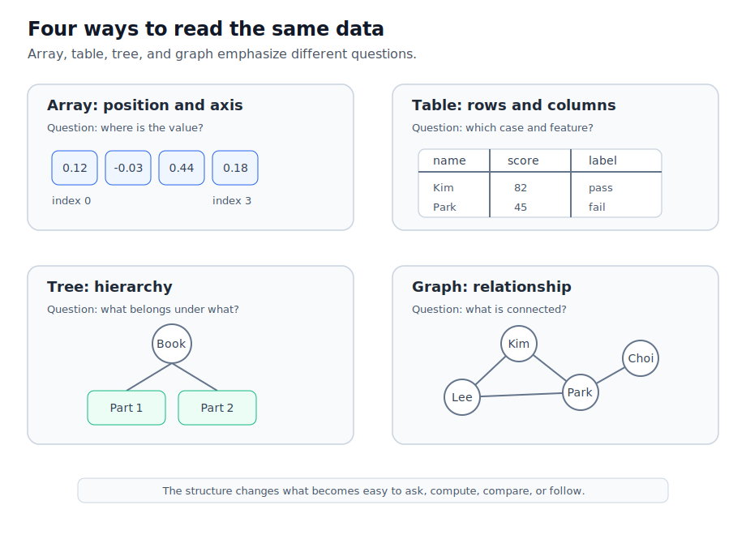
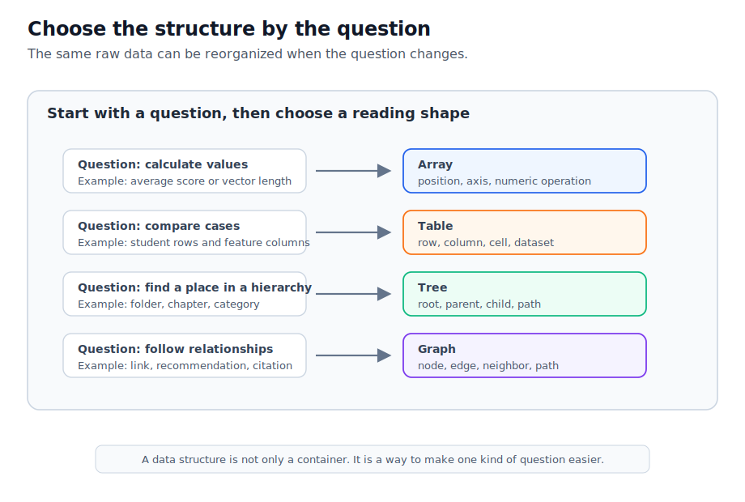
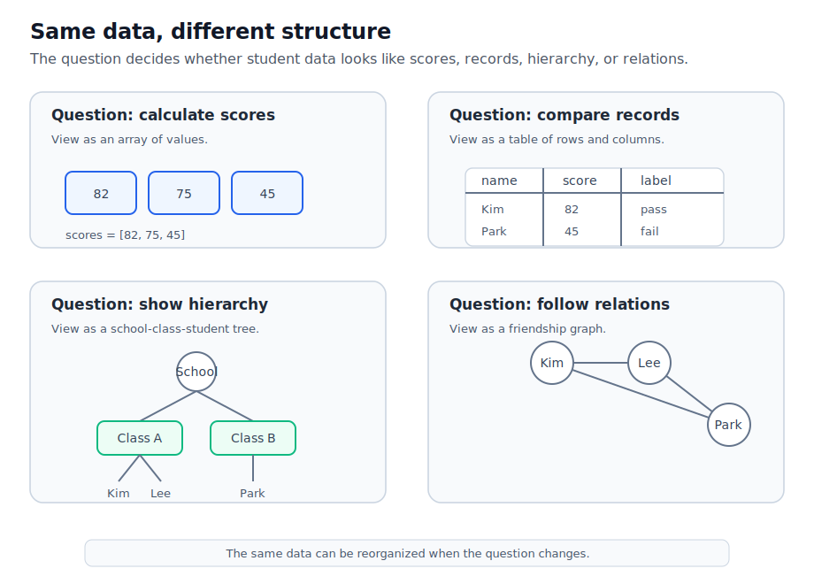

# P2-9.2 배열(array), 표(table), 트리(tree), 그래프(graph) 직관

P2-9.1에서는 자료구조(data structure)가 데이터를 어떤 모양으로 조직하느냐의 문제라고 봤습니다. 이제 AI 실습에서 자주 만나는 네 가지 모양을 넓게 비교합니다.

배열(array), 표(table), 트리(tree), 그래프(graph).

이 네 가지는 모두 데이터를 담는 방식이지만, 서로 다른 질문에 답합니다. 배열은 위치와 축(axis)을 묻고, 표는 행(row)과 열(column)을 묻고, 트리는 계층(hierarchy)을 묻고, 그래프는 관계(relation)를 묻습니다.

## 이 절의 범위

이 절은 배열, 표, 트리, 그래프를 깊게 구현하지 않습니다. 중심 질문은 “같은 데이터라도 어떤 관점으로 보면 배열, 표, 트리, 그래프가 되는가”입니다.

여기서는 다음 질문에 답합니다.

- 배열(array)은 왜 숫자 계산과 벡터(vector), 행렬(matrix)로 이어지는가?
- 표(table)는 왜 데이터셋(dataset)을 읽는 기본 모양이 되는가?
- 트리(tree)는 왜 목차, 폴더, 분류 체계를 설명하기 좋은가?
- 그래프(graph)는 왜 관계와 연결을 설명할 때 필요한가?
- AI 실습에서는 어떤 상황에서 어떤 구조 감각을 먼저 떠올리면 좋은가?

이 절에서는 그래프 탐색 알고리즘, 트리 구현, 데이터베이스 정규화, pandas 세부 사용법, NumPy 내부 메모리 배치를 깊게 다루지 않습니다. 그래프는 P2-9.3에서 따로 보고, 전통적인 자료구조 이름은 P2-9.4 보충학습에서 다시 정리합니다.

## 이 절의 목표

- 배열(array), 표(table), 트리(tree), 그래프(graph)를 서로 다른 데이터 관점으로 구분할 수 있습니다.
- 배열을 위치와 축, 표를 행과 열, 트리를 부모-자식, 그래프를 노드와 엣지 관점으로 설명할 수 있습니다.
- AI 실습에서 토큰, 임베딩, 데이터셋, 문서 구조, 지식 그래프가 어떤 구조 감각과 연결되는지 설명할 수 있습니다.
- 같은 정보를 목적에 따라 배열, 표, 트리, 그래프 중 다른 구조로 볼 수 있음을 설명할 수 있습니다.

## 네 가지 구조를 한 번에 비교하기

자료구조를 처음 볼 때는 이름보다 “무엇을 묻는가”가 중요합니다.

아래 도식은 네 구조가 각각 어떤 질문을 강조하는지 보여 줍니다.



| 구조 | 핵심 질문 | 기본 단위 | AI 실습에서 만나는 예 |
| --- | --- | --- | --- |
| 배열(array) | 어느 위치의 값인가? | 인덱스(index), 축(axis), 값(value) | 벡터, 행렬, 이미지 픽셀, 임베딩 |
| 표(table) | 어떤 행과 열의 값인가? | 행(row), 열(column), 셀(cell) | CSV 데이터셋, 학습 데이터, 평가 결과 |
| 트리(tree) | 상위와 하위가 어떻게 나뉘는가? | 루트(root), 부모(parent), 자식(child) | 목차, 폴더, 분류 체계, 의사결정 흐름 |
| 그래프(graph) | 무엇과 무엇이 연결되는가? | 노드(node), 엣지(edge) | 링크, 추천 관계, 지식 그래프, 검색 연결 |

이 네 구조는 서로 완전히 분리된 세계가 아닙니다. 표의 한 열이 배열처럼 계산될 수 있고, 트리는 그래프의 특수한 형태로 설명될 수 있으며, 그래프도 Python 딕셔너리와 리스트를 조합해 간단히 표현할 수 있습니다.

따라서 이 절에서는 “정답 구조”를 외우지 않습니다. 어떤 질문을 던지는지에 따라 데이터가 다르게 보인다는 점을 익힙니다.

아래 도식은 질문에서 자료구조로 넘어가는 흐름을 다시 정리한 것입니다.



처음에는 데이터의 이름보다 질문을 먼저 적어 보는 편이 좋습니다.

| 먼저 적을 질문 | 떠올릴 구조 |
| --- | --- |
| 숫자들을 순서대로 계산해야 하는가? | 배열(array) |
| 사례별 속성을 비교해야 하는가? | 표(table) |
| 상위와 하위의 포함 관계를 봐야 하는가? | 트리(tree) |
| 대상 사이의 연결을 따라가야 하는가? | 그래프(graph) |

## 배열(array): 위치와 축으로 읽는 데이터

배열(array)은 값을 위치(index)로 다루는 구조입니다. NumPy 문서에서 `ndarray`는 같은 타입과 크기의 항목을 담는 다차원 컨테이너로 설명됩니다. 입문 단계에서는 배열을 다음처럼 이해하면 충분합니다.

배열은 숫자들이 위치와 축을 가진 채 놓인 구조입니다.

1차원 배열은 한 줄의 숫자입니다.

```python
embedding = [0.12, -0.03, 0.44, 0.18]

print(embedding[0])
print(embedding[2])
```

2차원 배열은 행과 열이 있는 숫자 격자처럼 볼 수 있습니다.

```python
image_patch = [
    [0, 20, 40],
    [10, 30, 50],
]

print(image_patch[0][2])
print(image_patch[1][1])
```

배열에서 중요한 것은 값만이 아니라 위치입니다. 이미지의 픽셀은 위치가 바뀌면 다른 이미지가 되고, 임베딩 벡터도 숫자들이 정해진 순서로 놓여야 계산에 사용할 수 있습니다.

AI 실습에서는 배열 감각이 다음 장면에서 자주 등장합니다.

- 문장을 토큰 ID(token ID)의 시퀀스로 바꿀 때
- 단어, 문장, 이미지를 임베딩 벡터로 표현할 때
- 여러 샘플을 행렬(matrix)처럼 묶어 계산할 때
- 이미지 데이터를 높이, 너비, 채널(channel)의 축으로 다룰 때

배열은 “숫자 계산을 위한 구조”에 가깝습니다. 그래서 이후 NumPy, 벡터, 행렬, 텐서(tensor)를 배울 때 다시 등장합니다.

예를 들어 점수의 평균을 계산하려면 표 전체보다 점수 배열만 꺼내 보는 편이 단순합니다.

```python
scores = [82, 75, 45]

average = sum(scores) / len(scores)
print(average)
```

이 예제에서 관심은 학생의 이름이나 라벨이 아니라 숫자의 위치와 계산입니다. 이런 순간에는 배열 감각이 먼저 필요합니다.

## 표(table): 행과 열로 읽는 데이터

표(table)는 데이터를 행(row)과 열(column)로 읽는 구조입니다. pandas의 DataFrame은 2차원이고 크기를 바꿀 수 있으며, 잠재적으로 서로 다른 타입을 담을 수 있는 표 형식 데이터로 설명됩니다. 또한 행과 열이라는 라벨이 있는 축을 가진다고 설명합니다.

입문 단계에서는 표를 다음처럼 이해하면 충분합니다.

표는 사례 하나를 행으로 놓고, 속성 하나를 열로 놓는 구조입니다.

| name | age | score | label |
| --- | ---: | ---: | --- |
| Kim | 21 | 82 | pass |
| Lee | 20 | 75 | pass |
| Park | 22 | 45 | fail |

Python에서는 작은 표를 리스트와 딕셔너리로 표현할 수 있습니다.

```python
students = [
    {"name": "Kim", "age": 21, "score": 82, "label": "pass"},
    {"name": "Lee", "age": 20, "score": 75, "label": "pass"},
    {"name": "Park", "age": 22, "score": 45, "label": "fail"},
]

for student in students:
    print(student["name"], student["score"])
```

표에서 중요한 것은 한 행이 무엇을 뜻하고, 한 열이 무엇을 뜻하는지입니다.

AI 실습에서는 표 감각이 다음 장면에서 자주 등장합니다.

- CSV 파일을 데이터셋으로 읽을 때
- 입력 특징(feature)과 정답 라벨(label)을 나눌 때
- 학습 결과를 모델별, 실험별로 비교할 때
- 결측값(missing value), 이상값(outlier), 데이터 타입을 확인할 때

표는 “사례와 속성을 정리하는 구조”에 가깝습니다. 숫자 계산을 할 때는 배열로 바뀔 수 있지만, 사람이 데이터를 검토하고 설명할 때는 표가 더 읽기 쉽습니다.

예를 들어 합격한 학생만 골라 보려면 점수 배열보다 표 구조가 더 자연스럽습니다.

```python
passed_students = []

for student in students:
    if student["label"] == "pass":
        passed_students.append(student["name"])

print(passed_students)
```

이 예제에서 관심은 숫자 계산만이 아니라 한 사례가 가진 여러 속성입니다. 그래서 행과 열 감각이 중요합니다.

## 트리(tree): 계층으로 읽는 데이터

트리(tree)는 루트(root)에서 시작해 부모(parent)와 자식(child) 관계로 내려가는 구조입니다. NIST Dictionary of Algorithms and Data Structures는 트리를 루트 노드에서 접근하며, 내부 노드가 하나 이상의 자식 노드를 갖는 구조로 설명합니다.

입문 단계에서는 트리를 다음처럼 이해하면 충분합니다.

트리는 위에서 아래로 범위가 좁아지는 계층 구조입니다.

```text
AiBook
├─ Part 1. AI 개론과 지형도
│  ├─ Chapter 1
│  └─ Chapter 2
└─ Part 2. 기초 복구
   ├─ Chapter 8
   └─ Chapter 9
```

Python에서는 작은 트리를 딕셔너리와 리스트로 표현할 수 있습니다.

```python
book_tree = {
    "title": "AiBook",
    "children": [
        {"title": "Part 1", "children": ["Chapter 1", "Chapter 2"]},
        {"title": "Part 2", "children": ["Chapter 8", "Chapter 9"]},
    ],
}

for part in book_tree["children"]:
    print(part["title"])
```

트리에서 중요한 것은 계층과 경로입니다. 어떤 항목이 상위 항목 아래에 속하는지, 어디에서 시작해 어디로 내려가는지가 중요합니다.

AI 실습과 서비스에서는 트리 감각이 다음 장면에서 등장합니다.

- 문서 목차와 섹션 구조를 읽을 때
- 폴더와 파일 경로를 다룰 때
- 분류 체계나 카테고리를 만들 때
- 의사결정 트리(decision tree)를 이해할 때
- JSON이나 HTML처럼 중첩된 구조를 읽을 때

트리는 “관계를 계층으로 정리하는 구조”에 가깝습니다. 모든 관계가 트리로 표현되는 것은 아니지만, 상위와 하위가 뚜렷한 데이터에는 트리 감각이 잘 맞습니다.

트리에서는 “어떤 항목 아래에 무엇이 있는가”를 묻습니다. 예를 들어 특정 Part 아래의 Chapter 목록을 꺼내는 식입니다.

```python
for item in book_tree["children"]:
    if item["title"] == "Part 2":
        print(item["children"])
```

이 예제에서 중요한 것은 값의 크기나 표의 열이 아니라 경로(path)입니다. 루트에서 시작해 원하는 위치까지 내려가는 감각이 필요합니다.

## 그래프(graph): 연결로 읽는 데이터

그래프(graph)는 대상 사이의 연결을 표현합니다. NIST는 그래프를 엣지(edge)로 연결된 항목의 집합으로 설명하고, 각 항목을 정점(vertex) 또는 노드(node)라고 설명합니다.

입문 단계에서는 그래프를 다음처럼 이해하면 충분합니다.

그래프는 점과 선으로 관계를 표현하는 구조입니다.

```text
Kim -- Lee
Kim -- Park
Lee -- Choi
Park -- Choi
```

Python에서는 작은 그래프를 인접 리스트(adjacency list)처럼 표현할 수 있습니다.

```python
friends = {
    "Kim": ["Lee", "Park"],
    "Lee": ["Kim", "Choi"],
    "Park": ["Kim", "Choi"],
    "Choi": ["Lee", "Park"],
}

for person in friends["Kim"]:
    print("Kim is connected to", person)
```

그래프에서 중요한 것은 순서나 계층보다 연결입니다. 누가 누구와 연결되어 있는지, 어떤 경로를 따라갈 수 있는지가 중요합니다.

AI 실습과 서비스에서는 그래프 감각이 다음 장면에서 등장합니다.

- 문서와 문서의 링크를 따라갈 때
- 지식 그래프(knowledge graph)에서 개념 관계를 표현할 때
- 추천 시스템에서 사용자와 항목의 연결을 볼 때
- 검색 시스템에서 문서, 키워드, 출처의 연결을 볼 때
- RAG에서 문서 조각과 메타데이터의 관계를 다룰 때

그래프는 “관계를 따라가는 구조”에 가깝습니다. P2-9.3에서는 그래프를 노드와 엣지 관점으로 조금 더 자세히 봅니다.

그래프에서는 “이 대상과 직접 연결된 대상은 무엇인가”를 먼저 묻습니다.

```python
for friend in friends["Kim"]:
    print(friend)
```

그리고 한 단계 더 나아가 “연결을 따라가면 무엇이 더 보이는가”를 묻게 됩니다. 이 질문은 P2-9.3에서 더 자세히 다룹니다.

## 같은 정보를 네 가지 구조로 다시 보기

같은 학생 데이터를 네 가지 관점으로 다시 보겠습니다.

아래 도식은 같은 학생 데이터를 점수 배열, 레코드 표, 학교 계층, 친구 관계로 바꾸어 읽는 방식을 보여 줍니다.



점수만 순서대로 보면 배열 감각입니다.

```python
scores = [82, 75, 45]
```

학생별 속성을 행과 열로 보면 표 감각입니다.

```python
students = [
    {"name": "Kim", "score": 82, "label": "pass"},
    {"name": "Lee", "score": 75, "label": "pass"},
    {"name": "Park", "score": 45, "label": "fail"},
]
```

학교, 학년, 학생처럼 계층을 보면 트리 감각입니다.

```python
school = {
    "name": "School",
    "children": [
        {"name": "Class A", "children": ["Kim", "Lee"]},
        {"name": "Class B", "children": ["Park"]},
    ],
}
```

학생 사이의 친구 관계를 보면 그래프 감각입니다.

```python
friends = {
    "Kim": ["Lee"],
    "Lee": ["Kim", "Park"],
    "Park": ["Lee"],
}
```

중요한 것은 어떤 표현이 “정답”인지가 아닙니다. 질문이 다르면 구조도 달라집니다.

| 질문 | 더 자연스러운 구조 |
| --- | --- |
| 점수 숫자를 계산하고 싶은가? | 배열(array) |
| 학생별 속성을 비교하고 싶은가? | 표(table) |
| 학교-반-학생 계층을 보고 싶은가? | 트리(tree) |
| 학생 사이 관계를 보고 싶은가? | 그래프(graph) |

작은 실습에서는 같은 데이터를 여러 구조로 바꾸어 보는 훈련이 도움이 됩니다.

```python
students = [
    {"name": "Kim", "class": "A", "score": 82, "friends": ["Lee"]},
    {"name": "Lee", "class": "A", "score": 75, "friends": ["Kim", "Park"]},
    {"name": "Park", "class": "B", "score": 45, "friends": ["Lee"]},
]

scores = [student["score"] for student in students]
names_by_class = {}
friends = {}

for student in students:
    names_by_class.setdefault(student["class"], []).append(student["name"])
    friends[student["name"]] = student["friends"]

print("array:", scores)
print("tree-like grouping:", names_by_class)
print("graph:", friends)
```

이 코드는 하나의 구조가 항상 정답이라는 뜻이 아닙니다. 같은 원천 데이터에서 계산용 배열, 계층형 묶음, 관계 그래프를 각각 만들 수 있음을 보여 주는 예제입니다.

## 구조를 바꾸면 보이는 것이 달라진다

자료구조를 바꾼다는 것은 단지 저장 방식을 바꾸는 일이 아닙니다. 어떤 질문에 답하기 쉬워지는지를 바꾸는 일입니다.

배열로 보면 계산이 쉬워집니다.

표로 보면 비교와 필터링이 쉬워집니다.

트리로 보면 계층과 포함 관계가 쉬워집니다.

그래프로 보면 연결과 경로가 쉬워집니다.

AI 실습에서는 이 구조들이 서로 변환되기도 합니다. 표로 읽은 데이터셋의 숫자 열을 배열로 바꾸어 모델에 넣을 수 있고, 문서 표의 메타데이터를 그래프 관계로 확장할 수도 있습니다. 목차처럼 트리로 되어 있던 문서 구조가 검색 단계에서는 문서 조각의 연결 그래프로 다시 해석될 수도 있습니다.

## 이 절에서 기억할 관점

배열, 표, 트리, 그래프는 서로 다른 질문을 위한 데이터 관점입니다.

배열은 위치와 축을 봅니다.

표는 행과 열을 봅니다.

트리는 상위와 하위를 봅니다.

그래프는 연결과 관계를 봅니다.

AI 실습에서는 이 네 가지 감각이 계속 섞여 나옵니다. 따라서 처음부터 구현을 외우기보다, 지금 다루는 데이터가 어떤 질문을 요구하는지 먼저 보는 편이 좋습니다.

## 체크리스트

- 배열(array)을 위치(index), 축(axis), 숫자 계산 관점으로 설명할 수 있다.
- 표(table)를 행(row), 열(column), 데이터셋(dataset) 관점으로 설명할 수 있다.
- 트리(tree)를 루트(root), 부모(parent), 자식(child), 계층(hierarchy) 관점으로 설명할 수 있다.
- 그래프(graph)를 노드(node), 엣지(edge), 관계(relation) 관점으로 설명할 수 있다.
- 같은 데이터를 질문에 따라 배열, 표, 트리, 그래프 중 다른 구조로 볼 수 있음을 설명할 수 있다.
- AI 실습에서 토큰, 임베딩, 데이터셋, 문서 구조, 지식 그래프가 어떤 구조 감각과 연결되는지 설명할 수 있다.

## 출처와 참고 자료

- NumPy Developers, [The N-dimensional array (`ndarray`)](https://numpy.org/doc/stable/reference/arrays.ndarray.html){: target="_blank" rel="noopener noreferrer" }, NumPy documentation, 확인 날짜: 2026-06-25.
- pandas, [pandas.DataFrame](https://pandas.pydata.org/docs/reference/api/pandas.DataFrame.html){: target="_blank" rel="noopener noreferrer" }, pandas documentation, 확인 날짜: 2026-06-25.
- Paul E. Black, [tree](https://xlinux.nist.gov/dads/HTML/tree.html){: target="_blank" rel="noopener noreferrer" }, Dictionary of Algorithms and Data Structures, NIST, 확인 날짜: 2026-06-25.
- Paul E. Black, [graph](https://xlinux.nist.gov/dads/HTML/graph.html){: target="_blank" rel="noopener noreferrer" }, Dictionary of Algorithms and Data Structures, NIST, 확인 날짜: 2026-06-25.
