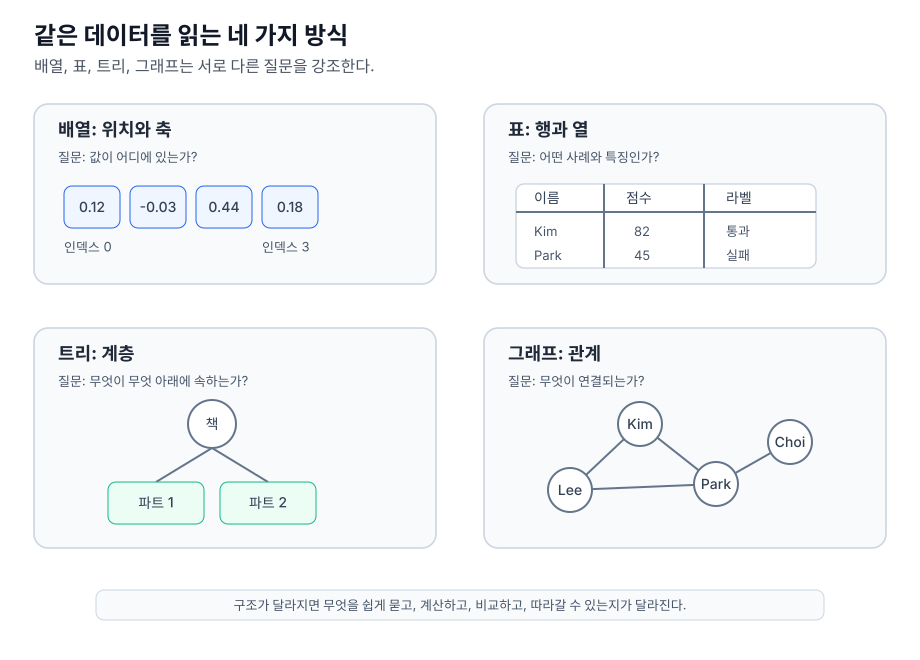
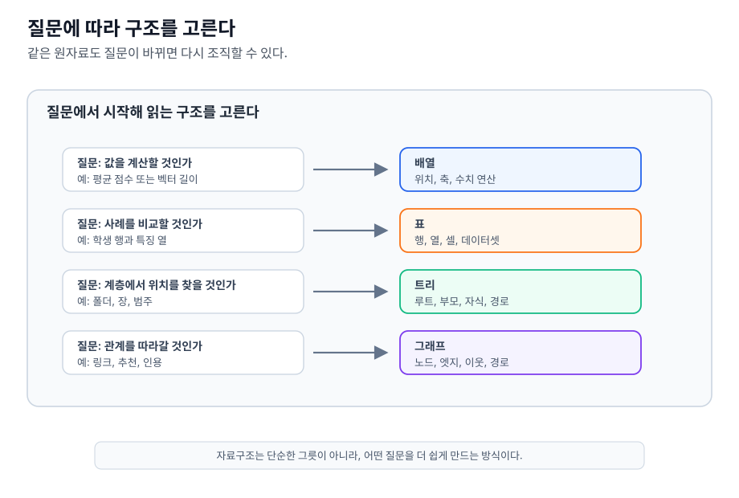
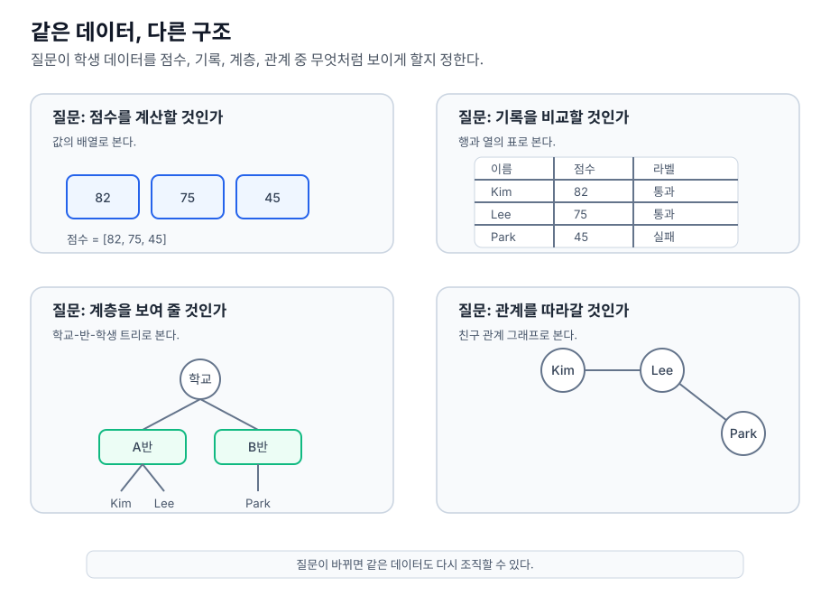

# P2-9.2 배열(array), 표(table), 트리(tree), 그래프(graph) 직관

> Section ID: `P2-9.2`
> Version: `v2026.09.08`

## 위치·행과 열·계층·연결

배열은 위치와 축(axis), 표는 행(row)과 열(column), 트리는 계층(hierarchy), 그래프는 연결 관계를 중심으로 데이터를 표현합니다.



| 구조 | 핵심 질문 | 기본 단위 | AI 실습에서 만나는 예 |
| --- | --- | --- | --- |
| 배열(array) | 어느 위치의 값인가? | 인덱스(index), 축(axis), 값(value) | 벡터, 행렬, 이미지 픽셀, 임베딩 |
| 표(table) | 어떤 행과 열의 값인가? | 행(row), 열(column), 셀(cell) | CSV 데이터셋, 학습 데이터, 평가 결과 |
| 트리(tree) | 상위와 하위가 어떻게 나뉘는가? | 루트(root), 부모(parent), 자식(child) | 목차, 폴더, 분류 체계, 의사결정 흐름 |
| 그래프(graph) | 무엇과 무엇이 연결되는가? | 노드(node), 엣지(edge) | 링크, 추천 관계, 지식 그래프, 검색 연결 |

이 네 구조는 서로 완전히 분리된 세계가 아닙니다. 표의 한 열이 배열처럼 계산될 수 있고, 트리는 그래프의 특수한 형태로 설명될 수 있으며, 그래프도 Python 딕셔너리와 리스트를 조합해 간단히 표현할 수 있습니다.

평균 계산, 학생별 속성 비교, 소속 확인, 친구 찾기는 각각 필요한 정보가 다릅니다.



## 배열: 위치와 축

배열(array)은 값을 위치(index)로 다루는 구조입니다. NumPy 문서에서 `ndarray`는 같은 타입과 크기의 항목을 담는 다차원 컨테이너로 설명됩니다. 수치 배열은 숫자들이 정해진 위치와 축에 놓인 구조입니다.

1차원 배열은 한 줄의 숫자입니다.

NumPy 배열 `[0.12, -0.03, 0.44, 0.18]`에서 인덱스 `0`과 `2`의 값을 꺼내면 `0.12`, `0.44`가 출력됩니다.

```python
import numpy as np

embedding = np.array([0.12, -0.03, 0.44, 0.18])

print(embedding[0])
print(embedding[2])
```

2차원 배열은 행과 열이 있는 숫자 격자처럼 볼 수 있습니다.

2행 3열 배열에서 첫 행의 세 번째 값은 `40`, 두 번째 행의 두 번째 값은 `30`입니다. 인덱스는 0부터 시작하므로 각각 `[0, 2]`, `[1, 1]`로 읽습니다.

```python
import numpy as np

image_patch = np.array([
    [0, 20, 40],
    [10, 30, 50],
])

print(image_patch[0, 2])
print(image_patch[1, 1])
```

배열에서 중요한 것은 값만이 아니라 위치입니다. 이미지의 픽셀은 위치가 바뀌면 다른 이미지가 되고, 임베딩 벡터도 숫자들이 정해진 순서로 놓여야 계산에 사용할 수 있습니다.

AI 실습에서는 배열 감각이 다음 장면에서 자주 등장합니다.

- 문장을 토큰 ID(token ID)의 시퀀스로 바꿀 때
- 단어, 문장, 이미지를 임베딩 벡터로 표현할 때
- 여러 샘플을 행렬(matrix)처럼 묶어 계산할 때
- 이미지 데이터를 높이, 너비, 채널(channel)의 축으로 다룰 때

NumPy 배열은 여러 숫자에 같은 연산을 적용할 때 사용할 수 있습니다.

예를 들어 점수의 평균을 계산하려면 표 전체보다 점수 배열만 꺼내 보는 편이 단순합니다.

점수 `[82, 75, 45]`의 합은 202, 개수는 3이므로 평균은 약 67.33입니다. 다음 코드는 평균을 `67.33333333333333`으로 출력합니다.

```python
import numpy as np

scores = np.array([82, 75, 45])

average = scores.mean()
print(average)
```

평균 계산에는 이름이나 라벨이 필요하지 않습니다. 점수의 순서를 바꿔도 평균은 같지만, 특정 학생의 점수를 찾으려면 학생과 배열 위치의 대응을 유지해야 합니다.

## 표: 행과 열

표(table)는 데이터를 행(row)과 열(column)로 읽는 구조입니다. pandas의 DataFrame은 2차원이고 크기를 바꿀 수 있으며, 잠재적으로 서로 다른 타입을 담을 수 있는 표 형식 데이터로 설명됩니다. 또한 행과 열이라는 라벨이 있는 축을 가진다고 설명합니다.

표는 사례 하나를 행으로 놓고, 속성 하나를 열로 놓는 구조입니다.

| name | age | score | label |
| --- | ---: | ---: | --- |
| Kim | 21 | 82 | pass |
| Lee | 20 | 75 | pass |
| Park | 22 | 45 | fail |

Python에서는 작은 표를 리스트와 딕셔너리로 표현할 수 있습니다.

표의 각 행을 딕셔너리로 표현하고 리스트에 모읍니다. 다음 코드는 `Kim 82`, `Lee 75`, `Park 45`를 차례로 출력합니다.

```python
students = [
    {"name": "Kim", "age": 21, "score": 82, "label": "pass"},
    {"name": "Lee", "age": 20, "score": 75, "label": "pass"},
    {"name": "Park", "age": 22, "score": 45, "label": "fail"},
]

for student in students:
    print(student["name"], student["score"])
```

표에서 중요한 것은 한 행이 무엇을 뜻하고, 한 열이 무엇을 뜻하는지입니다.

AI 실습에서는 표 감각이 다음 장면에서 자주 등장합니다.

- CSV 파일을 데이터셋으로 읽을 때
- 입력 특징(feature)과 정답 라벨(label)을 나눌 때
- 학습 결과를 모델별, 실험별로 비교할 때
- 결측값(missing value), 이상값(outlier), 데이터 타입을 확인할 때

표는 “사례와 속성을 정리하는 구조”에 가깝습니다. 숫자 계산을 할 때는 배열로 바뀔 수 있지만, 사람이 데이터를 검토하고 설명할 때는 표가 더 읽기 쉽습니다.

예를 들어 합격한 학생만 골라 보려면 점수 배열보다 표 구조가 더 자연스럽습니다.

앞의 `students`를 그대로 사용하여 라벨이 `"pass"`인 학생의 이름을 모읍니다. 출력은 `['Kim', 'Lee']`입니다.

```python
passed_students = []

for student in students:
    if student["label"] == "pass":
        passed_students.append(student["name"])

print(passed_students)
```

이 예제에서 관심은 숫자 계산만이 아니라 한 사례가 가진 여러 속성입니다. 그래서 행과 열 감각이 중요합니다.

## 트리: 부모와 자식

트리(tree)는 루트(root)에서 시작해 부모(parent)와 자식(child) 관계로 내려가는 구조입니다. NIST Dictionary of Algorithms and Data Structures는 트리를 루트 노드에서 접근하며, 내부 노드가 하나 이상의 자식 노드를 갖는 구조로 설명합니다.

이처럼 루트를 정한 트리에서는 루트 이외의 각 노드가 하나의 부모를 가집니다.

```text
study-book
├─ Part 1. Introduction
│  ├─ Chapter 1
│  └─ Chapter 2
└─ Part 2. Foundations
   ├─ Chapter 8
   └─ Chapter 9
```

Python에서는 작은 트리를 딕셔너리와 리스트로 표현할 수 있습니다.

루트 `study-course` 아래에 두 주제 묶음을 둡니다. 다음 코드는 바로 아래 자식의 제목 `Foundations`, `Data Work`를 출력합니다.

```python
course_tree = {
    "title": "study-course",
    "children": [
        {"title": "Foundations", "children": ["Variables", "Functions"]},
        {"title": "Data Work", "children": ["Tables", "Graphs"]},
    ],
}

for part in course_tree["children"]:
    print(part["title"])
```

트리에서 중요한 것은 계층과 경로입니다. 어떤 항목이 상위 항목 아래에 속하는지, 어디에서 시작해 어디로 내려가는지가 중요합니다.

AI 실습과 서비스에서는 트리 감각이 다음 장면에서 등장합니다.

- 문서 목차와 섹션 구조를 읽을 때
- 폴더와 파일 경로를 다룰 때
- 분류 체계나 카테고리를 만들 때
- 의사결정 트리(decision tree)를 이해할 때
- JSON이나 HTML처럼 중첩된 구조를 읽을 때

트리는 “관계를 계층으로 정리하는 구조”에 가깝습니다. 모든 관계가 트리로 표현되는 것은 아니지만, 상위와 하위가 뚜렷한 데이터에는 트리 감각이 잘 맞습니다.

트리에서는 “어떤 항목 아래에 무엇이 있는가”를 묻습니다. 예를 들어 특정 Part 아래의 Chapter 목록을 꺼내는 식입니다.

앞의 `course_tree`에서 `"Data Work"`를 찾고 그 자식을 출력하면 `['Tables', 'Graphs']`입니다.

```python
for item in course_tree["children"]:
    if item["title"] == "Data Work":
        print(item["children"])
```

이 예제에서 중요한 것은 값의 크기나 표의 열이 아니라 경로(path)입니다. 루트에서 시작해 원하는 위치까지 내려가는 감각이 필요합니다.

## 그래프: 노드와 연결

그래프(graph)는 대상 사이의 연결을 표현합니다. NIST는 그래프를 엣지(edge)로 연결된 항목의 집합으로 설명하고, 각 항목을 정점(vertex) 또는 노드(node)라고 설명합니다.

노드는 대상이고 엣지는 연결입니다.

```text
Kim -- Lee
Kim -- Park
Lee -- Choi
Park -- Choi
```

Python에서는 작은 그래프를 인접 리스트(adjacency list)처럼 표현할 수 있습니다.

친구 관계를 각 사람의 이웃 목록으로 저장합니다. Kim의 이웃을 순회하면 `Kim is connected to Lee`, `Kim is connected to Park`가 출력됩니다.

```python
friends = {
    "Kim": ["Lee", "Park"],
    "Lee": ["Kim", "Choi"],
    "Park": ["Kim", "Choi"],
    "Choi": ["Lee", "Park"],
}

for person in friends["Kim"]:
    print("Kim is connected to", person)
```

그래프에서 중요한 것은 순서나 계층보다 연결입니다. 누가 누구와 연결되어 있는지, 어떤 경로를 따라갈 수 있는지가 중요합니다.

AI 실습과 서비스에서는 그래프 감각이 다음 장면에서 등장합니다.

- 문서와 문서의 링크를 따라갈 때
- 지식 그래프(knowledge graph)에서 개념 관계를 표현할 때
- 추천 시스템에서 사용자와 항목의 연결을 볼 때
- 검색 시스템에서 문서, 키워드, 출처의 연결을 볼 때
- RAG에서 문서 조각과 메타데이터의 관계를 다룰 때

## 사례: 전학 전후의 데이터

같은 학생 데이터를 네 가지 관점으로 다시 보겠습니다.

아래 도식은 같은 학생 데이터를 점수 배열, 레코드 표, 학교 계층, 친구 관계로 바꾸어 읽는 방식을 보여 줍니다.



Kim과 Lee는 A반, Park은 B반입니다. 점수는 각각 82, 75, 45이며 Kim과 Lee, Lee와 Park이 친구입니다. 다음 코드는 이 레코드에서 점수 배열, 통과한 학생 이름, 반별 소속, 친구 관계를 만듭니다.

```python
import numpy as np

students = [
    {"name": "Kim", "class": "A", "score": 82, "label": "pass", "friends": ["Lee"]},
    {"name": "Lee", "class": "A", "score": 75, "label": "pass", "friends": ["Kim", "Park"]},
    {"name": "Park", "class": "B", "score": 45, "label": "fail", "friends": ["Lee"]},
]

scores = np.array([student["score"] for student in students])
passed_names = [student["name"] for student in students if student["label"] == "pass"]
names_by_class = {}
friends = {}

for student in students:
    class_name = student["class"]
    if class_name not in names_by_class:
        names_by_class[class_name] = []
    names_by_class[class_name].append(student["name"])
    friends[student["name"]] = student["friends"]

print("mean:", round(float(scores.mean()), 2))
print("passed:", passed_names)
print("classes:", names_by_class)
print("Kim's friends:", friends["Kim"])
```

```text
mean: 67.33
passed: ['Kim', 'Lee']
classes: {'A': ['Kim', 'Lee'], 'B': ['Park']}
Kim's friends: ['Lee']
```

`names_by_class`는 학교 아래에 반, 그 아래에 학생이 속하는 계층의 두 단계를 표현합니다. `friends`는 반을 넘어선 연결을 표현합니다. A반의 Lee와 B반의 Park도 친구이므로 친구 관계를 소속 트리만으로 알 수는 없습니다.

Park의 `"class"`를 `"A"`로 바꿔 전체 코드를 다시 실행하면 반별 목록은 `{'A': ['Kim', 'Lee', 'Park']}`가 됩니다. 평균과 통과 목록, 친구 관계는 그대로입니다. 반대로 Park의 점수만 `60`으로 바꾸면 평균은 `72.33`이 되지만, 기존 `"label": "fail"`은 자동으로 바뀌지 않습니다. 점수로 통과 여부를 정하는 데이터라면 라벨도 그 기준에 맞춰 갱신해야 합니다.

## 체크리스트

- 배열(array)을 위치(index), 축(axis), 숫자 계산 관점으로 설명할 수 있다.
- 표(table)를 행(row), 열(column), 데이터셋(dataset) 관점으로 설명할 수 있다.
- 트리(tree)를 루트(root), 부모(parent), 자식(child), 계층(hierarchy) 관점으로 설명할 수 있다.
- 그래프(graph)를 노드(node), 엣지(edge), 관계(relation) 관점으로 설명할 수 있다.
- 같은 데이터를 질문에 따라 배열, 표, 트리, 그래프 중 다른 구조로 볼 수 있음을 설명할 수 있다.
- AI 실습에서 토큰, 임베딩, 데이터셋, 문서 구조, 지식 그래프가 어떤 구조 감각과 연결되는지 설명할 수 있다.
- 지금 배열 질문인지, 표 질문인지, 계층 질문인지, 관계 질문인지 먼저 구분할 수 있다.

## 출처와 참고 자료

- NumPy Developers, [The N-dimensional array (`ndarray`)](https://numpy.org/doc/stable/reference/arrays.ndarray.html){: target="_blank" rel="noopener noreferrer" }, NumPy v2.5 Manual, 확인 날짜: 2026-07-20. `ndarray`의 차원, shape, dtype, 인덱싱과 슬라이싱 설명을 배열 직관의 근거로 사용했다.
- pandas, [pandas.DataFrame](https://pandas.pydata.org/docs/reference/api/pandas.DataFrame.html){: target="_blank" rel="noopener noreferrer" }, pandas 3.0.4 documentation, 확인 날짜: 2026-07-20. DataFrame을 행과 열을 가진 2차원 구조로 설명하는 근거로 사용했다.
- Paul E. Black, [tree](https://xlinux.nist.gov/dads/HTML/tree.html){: target="_blank" rel="noopener noreferrer" }, Dictionary of Algorithms and Data Structures, NIST, 확인 날짜: 2026-07-20. 트리를 루트와 부모-자식 관계를 가진 계층 구조로 설명하는 근거로 사용했다.
- Paul E. Black, [graph](https://xlinux.nist.gov/dads/HTML/graph.html){: target="_blank" rel="noopener noreferrer" }, Dictionary of Algorithms and Data Structures, NIST, 확인 날짜: 2026-07-20. 그래프를 노드와 엣지로 관계를 표현하는 구조로 설명하는 근거로 사용했다.
