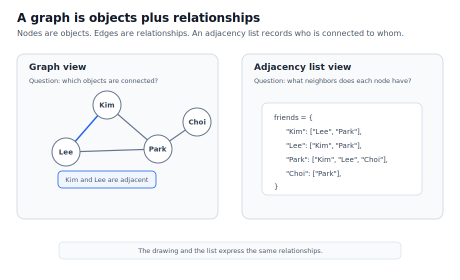
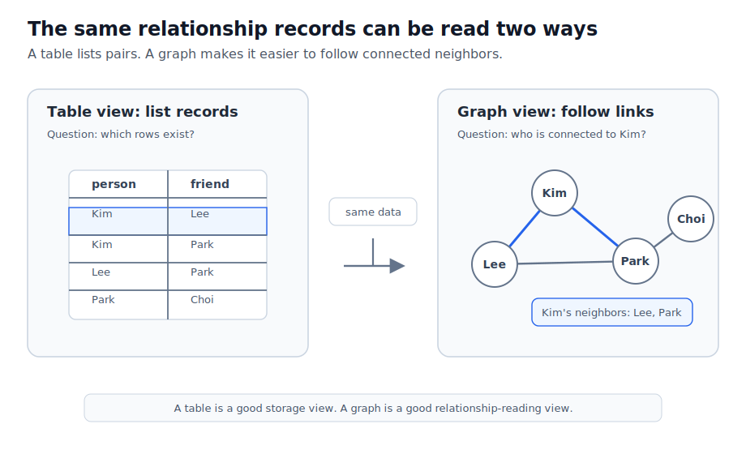
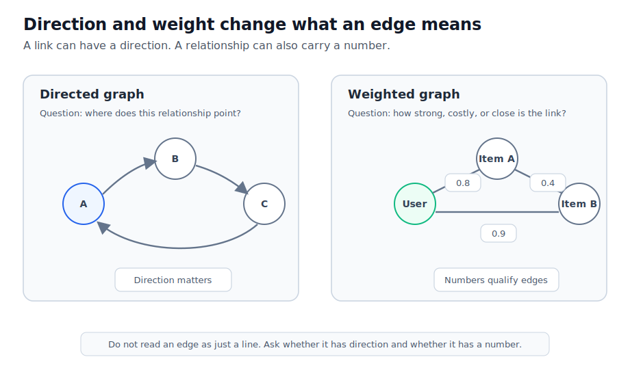
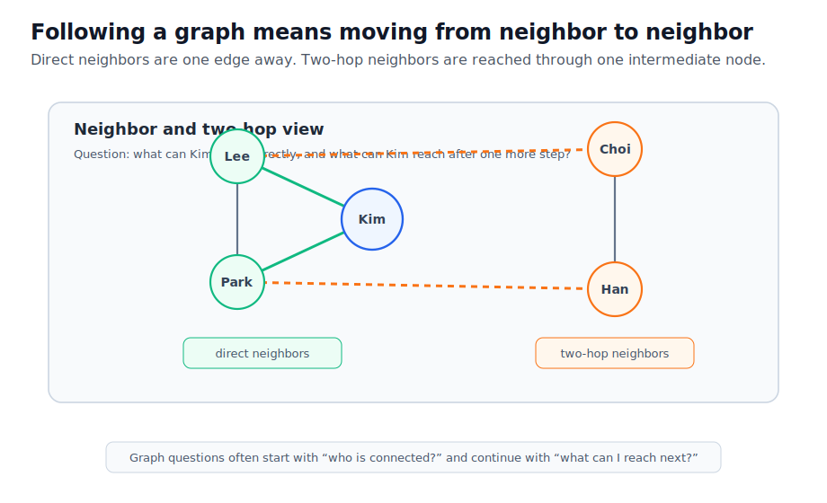

# P2-9.3 그래프(graph)는 관계를 어떻게 표현하는가

P2-9.2에서는 배열(array), 표(table), 트리(tree), 그래프(graph)를 서로 다른 데이터 관점으로 비교했습니다. 그중 그래프는 초심자에게 특히 낯설 수 있습니다.

그래프(graph)는 차트나 통계 그래프만을 뜻하지 않습니다. 자료구조와 수학 문맥에서 그래프는 대상 사이의 관계를 표현하는 구조입니다.

이 절에서는 그래프를 노드(node)와 엣지(edge)라는 최소 개념으로 읽습니다.

## 이 절의 범위

이 절은 그래프를 관계 표현 관점에서 다룹니다. 중심 질문은 “대상과 대상의 연결을 어떻게 데이터로 표현하는가”입니다.

여기서는 다음 질문에 답합니다.

- 노드(node)와 엣지(edge)는 무엇인가?
- 그래프는 왜 관계를 표현하기 좋은가?
- 무방향 그래프(undirected graph)와 방향 그래프(directed graph)는 어떻게 다른가?
- 가중치(weight)는 관계에 어떤 정보를 더하는가?
- Python에서는 그래프를 어떻게 간단히 표현해 볼 수 있는가?
- AI와 검색, 추천, RAG에서는 그래프 감각이 어디에서 다시 등장하는가?

이 절에서는 그래프 탐색 알고리즘, 최단 경로, 중심성, 그래프 신경망, 그래프 데이터베이스 구현을 깊게 다루지 않습니다. 지금은 그래프를 “관계를 담는 자료구조 감각”으로 이해하는 것이 목표입니다.

## 이 절의 목표

- 그래프(graph)를 노드(node)와 엣지(edge)의 구조로 설명할 수 있습니다.
- 그래프가 표나 트리로는 표현하기 어려운 연결 관계를 다룰 수 있음을 설명할 수 있습니다.
- 무방향 그래프와 방향 그래프의 차이를 입문 수준에서 설명할 수 있습니다.
- 가중치(weight)가 관계의 강도, 거리, 비용 같은 정보를 표현할 수 있음을 설명할 수 있습니다.
- 인접 리스트(adjacency list) 방식으로 작은 그래프를 Python에서 표현할 수 있습니다.

## 그래프는 점과 선으로 관계를 표현한다

NIST Dictionary of Algorithms and Data Structures는 그래프를 엣지(edge)로 연결된 항목들의 집합으로 설명하고, 각 항목을 정점(vertex) 또는 노드(node)라고 설명합니다.

입문 단계에서는 다음처럼 이해하면 충분합니다.

그래프는 대상을 노드로 놓고, 대상 사이의 관계를 엣지로 연결한 구조입니다.

아래 도식은 같은 그래프를 그림과 인접 리스트(adjacency list)로 함께 보여 줍니다.



그림에서 `Kim`, `Lee`, `Park`, `Choi`는 노드입니다.

`Kim -- Lee`처럼 두 노드를 잇는 선은 엣지입니다.

Python 딕셔너리로는 각 노드가 어떤 이웃(neighbor)을 갖는지 표현할 수 있습니다.

```python
friends = {
    "Kim": ["Lee", "Park"],
    "Lee": ["Kim", "Park"],
    "Park": ["Kim", "Lee", "Choi"],
    "Choi": ["Park"],
}

print(friends["Kim"])
```

이 표현을 인접 리스트(adjacency list)라고 볼 수 있습니다. 핵심은 노드마다 연결된 이웃 목록을 갖는다는 점입니다.

## 표와 그래프는 질문이 다르다

같은 친구 데이터를 표로 적을 수도 있습니다. 표는 “관계 한 건”을 한 행(row)으로 적기에 좋습니다.

| person | friend |
| --- | --- |
| Kim | Lee |
| Kim | Park |
| Lee | Park |
| Park | Choi |

하지만 “Kim과 연결된 사람은 누구인가?”, “Park를 거쳐 Choi로 갈 수 있는가?”처럼 연결을 따라가야 하는 질문에서는 그래프 관점이 더 자연스럽습니다.

아래 도식은 같은 관계 데이터를 표로 읽을 때와 그래프로 읽을 때 질문이 어떻게 달라지는지 보여 줍니다.



표 데이터를 Python에서 그래프처럼 다루려면 먼저 관계 목록을 인접 리스트로 바꾸어 볼 수 있습니다.

```python
friend_pairs = [
    ("Kim", "Lee"),
    ("Kim", "Park"),
    ("Lee", "Park"),
    ("Park", "Choi"),
]

friends = {}

for person, friend in friend_pairs:
    friends.setdefault(person, []).append(friend)
    friends.setdefault(friend, []).append(person)

print(friends["Kim"])
```

여기서 `friend_pairs`는 표의 행에 가깝고, `friends`는 그래프의 인접 리스트에 가깝습니다. 같은 데이터라도 어떤 질문을 하느냐에 따라 읽기 좋은 구조가 달라집니다.

표와 그래프의 차이는 다음처럼 볼 수 있습니다.

| 관점 | 잘 묻는 질문 | 예 |
| --- | --- | --- |
| 표(table) | 어떤 행이 어떤 값을 갖는가? | `person`과 `friend` 목록 |
| 그래프(graph) | 무엇과 무엇이 연결되는가? | Kim의 이웃, Park를 거치는 경로 |

표가 나쁘고 그래프가 좋은 것이 아닙니다. 관계를 목록으로 저장할 때는 표가 좋고, 관계를 따라 이동하거나 연결 구조를 보려면 그래프가 좋습니다.

## 트리와 그래프는 어떻게 다른가

트리(tree)는 그래프의 특수한 형태로 설명할 수 있습니다. NIST의 그래프 설명도 트리를 그래프의 한 종류로 언급합니다.

입문 단계에서는 다음처럼 구분하면 됩니다.

트리는 계층이 강한 관계입니다.

그래프는 더 일반적인 연결 관계입니다.

예를 들어 책 목차는 보통 트리로 읽기 좋습니다.

```text
AiBook
└─ Part 2
   └─ Chapter 9
      └─ Section 9.3
```

하지만 사람 사이의 관계는 트리로 정리하기 어렵습니다.

```text
Kim -- Lee
Kim -- Park
Lee -- Park
Park -- Choi
```

사람 관계에서는 한 사람이 여러 사람과 연결되고, 서로 연결이 되돌아올 수도 있습니다. 이런 구조는 그래프 관점이 더 자연스럽습니다.

## 무방향 그래프와 방향 그래프

그래프의 엣지는 방향이 없을 수도 있고, 방향이 있을 수도 있습니다.

무방향 그래프(undirected graph)는 관계가 양쪽으로 같은 의미를 갖는 경우에 사용합니다.

친구 관계를 단순하게 볼 때는 `Kim -- Lee`라고 표현할 수 있습니다. Kim이 Lee와 친구라면 Lee도 Kim과 친구라고 보는 방식입니다.

```python
friends = {
    "Kim": ["Lee"],
    "Lee": ["Kim"],
}
```

방향 그래프(directed graph)는 관계의 방향이 중요한 경우에 사용합니다.

예를 들어 웹 링크는 방향이 있습니다. A 문서가 B 문서로 링크한다고 해서 B 문서가 A 문서로 링크하는 것은 아닙니다.

```python
links = {
    "page_a": ["page_b", "page_c"],
    "page_b": ["page_c"],
    "page_c": [],
}
```

AI와 검색 문맥에서는 방향이 중요할 때가 많습니다. 문서가 다른 문서를 인용하거나, 작업 흐름이 다음 단계로 넘어가거나, 사용자가 항목을 클릭하는 흐름은 방향 그래프로 볼 수 있습니다.

아래 도식은 방향과 가중치가 엣지의 의미를 어떻게 바꾸는지 보여 줍니다.



방향 그래프를 코드로 표현할 때는 양쪽에 모두 관계를 넣지 않습니다. 관계가 실제로 향하는 쪽만 적습니다.

```python
page_links = {
    "page_a": ["page_b", "page_c"],
    "page_b": ["page_c"],
    "page_c": [],
}

print(page_links["page_b"])
```

이 예제에서 `page_b`는 `page_c`로 링크하지만, `page_c`가 다시 `page_b`로 링크한다고 말할 수는 없습니다.

## 가중치(weight)는 관계에 숫자를 붙인다

모든 연결이 같은 강도를 갖지는 않습니다. 어떤 관계는 가깝고, 어떤 관계는 멀고, 어떤 관계는 비용이 큽니다.

이때 엣지에 숫자를 붙일 수 있습니다. 이것을 가중치(weight)라고 부릅니다.

예를 들어 도시 사이의 거리를 그래프로 표현할 수 있습니다.

```python
distances = {
    "Seoul": {"Daejeon": 160, "Busan": 325},
    "Daejeon": {"Seoul": 160, "Busan": 200},
    "Busan": {"Seoul": 325, "Daejeon": 200},
}

print(distances["Seoul"]["Busan"])
```

여기서 `325`는 Seoul과 Busan 사이의 관계에 붙은 숫자입니다. 추천 시스템에서는 이 숫자가 유사도(similarity)일 수도 있고, 검색에서는 점수(score)일 수도 있고, 네트워크에서는 비용(cost)일 수도 있습니다.

중요한 것은 가중치가 정답 그 자체가 아니라 관계를 해석하기 위한 숫자라는 점입니다.

가중치가 붙으면 “연결되어 있는가”에서 끝나지 않고 “얼마나 가까운가”, “얼마나 비용이 드는가”, “얼마나 강하게 관련되는가”를 물을 수 있습니다.

```python
similarity = {
    "query": {"doc_a": 0.91, "doc_b": 0.72, "doc_c": 0.18},
}

for document, score in similarity["query"].items():
    if score >= 0.7:
        print(document, score)
```

이 코드는 검색 시스템을 구현한 것이 아닙니다. 다만 AI 검색이나 추천에서 관계에 숫자를 붙여 후보를 비교하는 감각을 작게 보여 줍니다.

## 그래프를 Python으로 작게 따라가 보기

다음 예제는 그래프 탐색 알고리즘을 본격적으로 구현하는 코드가 아닙니다. 그래프가 “연결된 이웃을 따라간다”는 감각을 확인하기 위한 작은 예제입니다.

```python
friends = {
    "Kim": ["Lee", "Park"],
    "Lee": ["Kim", "Park"],
    "Park": ["Kim", "Lee", "Choi"],
    "Choi": ["Park"],
}

start = "Kim"

print("Neighbors of Kim:")
for neighbor in friends[start]:
    print("-", neighbor)
```

한 단계 더 나아가면, Kim의 친구들의 친구도 볼 수 있습니다.

```python
friends_of_friends = set()

for neighbor in friends["Kim"]:
    for next_neighbor in friends[neighbor]:
        if next_neighbor != "Kim":
            friends_of_friends.add(next_neighbor)

print(friends_of_friends)
```

이 예제에서 중요한 것은 반복문 자체가 아닙니다. 그래프에서는 한 노드에서 연결된 이웃으로 이동하고, 다시 그 이웃의 이웃으로 이동할 수 있다는 점입니다.

관계를 따라가면 “직접 연결”과 “한 단계를 거친 연결”을 구분할 수 있습니다.

아래 도식은 Kim을 기준으로 직접 이웃과 두 단계 이웃을 구분해 보여 줍니다.



```python
direct_neighbors = set(friends["Kim"])
two_hop_neighbors = set()

for neighbor in direct_neighbors:
    two_hop_neighbors.update(friends[neighbor])

two_hop_neighbors.discard("Kim")
two_hop_neighbors = two_hop_neighbors - direct_neighbors

print("direct:", direct_neighbors)
print("two hop:", two_hop_neighbors)
```

여기서 `direct_neighbors`는 Kim과 바로 연결된 노드이고, `two_hop_neighbors`는 친구의 친구처럼 한 단계를 더 따라간 노드입니다. 그래프를 배우는 이유는 이런 연결 질문을 데이터로 다룰 수 있게 하기 위해서입니다.

## AI 실습에서 그래프 감각이 다시 등장하는 곳

그래프 감각은 AI의 여러 분야에서 다시 등장합니다.

| 장면 | 그래프 관점 |
| --- | --- |
| 지식 그래프(knowledge graph) | 개념, 사람, 장소, 사건을 노드로 두고 관계를 엣지로 표현 |
| 추천 시스템(recommender system) | 사용자와 항목, 항목과 항목의 연결을 표현 |
| 검색(search) | 문서, 링크, 키워드, 출처 사이의 연결을 표현 |
| RAG | 문서 조각, 메타데이터, 출처, 질문 사이의 관계를 표현 |
| 워크플로우(workflow) | 작업 단계와 다음 단계의 연결을 표현 |

이 절에서는 각 분야를 깊게 설명하지 않습니다. 지금은 그래프가 “관계가 중요한 데이터”를 표현하는 방식이라는 감각을 잡는 것이 중요합니다.

## 오해하기 쉬운 지점

그래프(graph)는 통계 차트나 선 그래프만을 뜻하지 않습니다.

자료구조 문맥에서 그래프는 노드와 엣지로 관계를 표현하는 구조입니다.

그래프는 항상 복잡한 알고리즘을 의미하지 않습니다.

작은 그래프는 Python 딕셔너리와 리스트만으로도 표현해 볼 수 있습니다.

그래프는 트리보다 무조건 좋은 구조가 아닙니다.

계층이 뚜렷하면 트리가 더 읽기 쉽고, 여러 방향의 연결이 중요하면 그래프가 더 자연스럽습니다.

그래프의 위치 그림은 설명을 돕는 시각화일 뿐입니다.

노드가 그림에서 어디에 놓였는지는 대부분의 경우 핵심이 아닙니다. 중요한 것은 어떤 노드들이 엣지로 연결되어 있는가입니다.

## 이 절에서 기억할 관점

그래프는 관계를 표현하는 구조입니다.

노드는 대상입니다.

엣지는 대상 사이의 연결입니다.

인접 리스트는 각 노드가 어떤 이웃과 연결되는지 적는 방식입니다.

방향은 관계의 흐름을 표현하고, 가중치는 관계의 강도나 비용을 표현합니다.

AI 실습에서 그래프는 지식, 추천, 검색, 문서 연결, 워크플로우를 이해할 때 다시 등장합니다.

## 체크리스트

- 그래프(graph)를 노드(node)와 엣지(edge)의 구조로 설명할 수 있다.
- 인접 리스트(adjacency list)를 각 노드의 이웃 목록으로 설명할 수 있다.
- 표와 그래프가 서로 다른 질문에 답한다는 점을 설명할 수 있다.
- 트리(tree)를 그래프의 특수한 형태로 입문 수준에서 설명할 수 있다.
- 무방향 그래프와 방향 그래프의 차이를 설명할 수 있다.
- 가중치(weight)가 관계에 숫자 정보를 붙인다는 점을 설명할 수 있다.
- Python 딕셔너리와 리스트로 작은 그래프를 표현하고 이웃을 따라가 볼 수 있다.

## 출처와 참고 자료

- Paul E. Black and Paul J. Tanenbaum, [graph](https://xlinux.nist.gov/dads/HTML/graph.html){: target="_blank" rel="noopener noreferrer" }, Dictionary of Algorithms and Data Structures, NIST, 확인 날짜: 2026-06-25.
- NetworkX Developers, [Graph - Undirected graphs with self loops](https://networkx.org/documentation/stable/reference/classes/graph.html){: target="_blank" rel="noopener noreferrer" }, NetworkX documentation, 확인 날짜: 2026-06-25.
