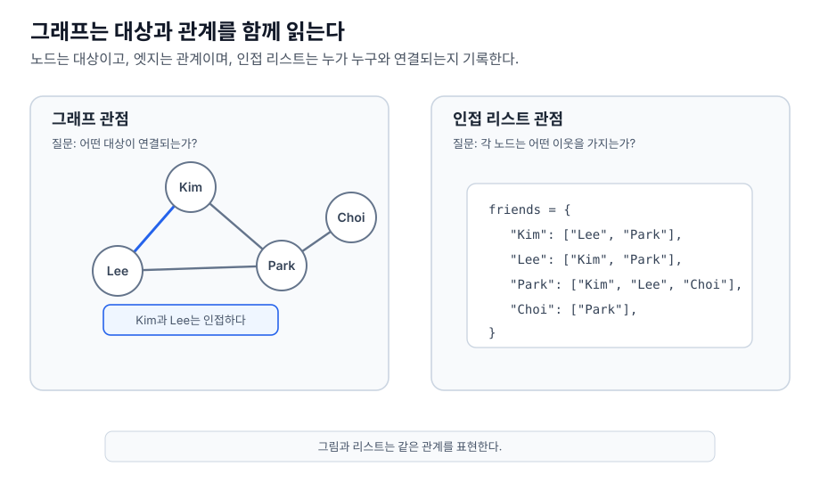
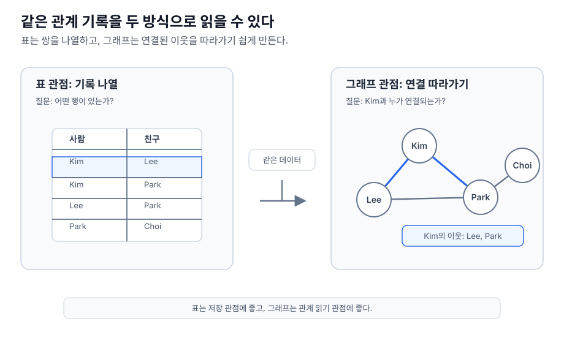
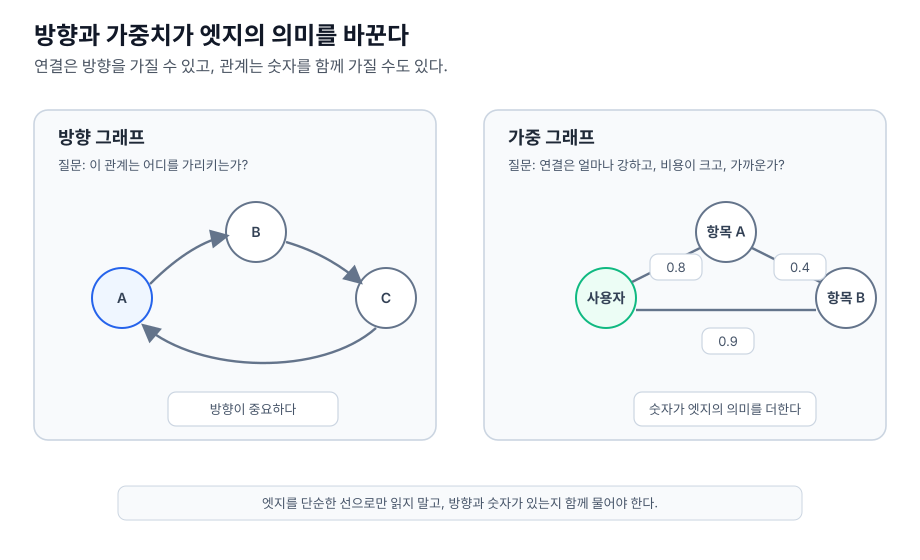
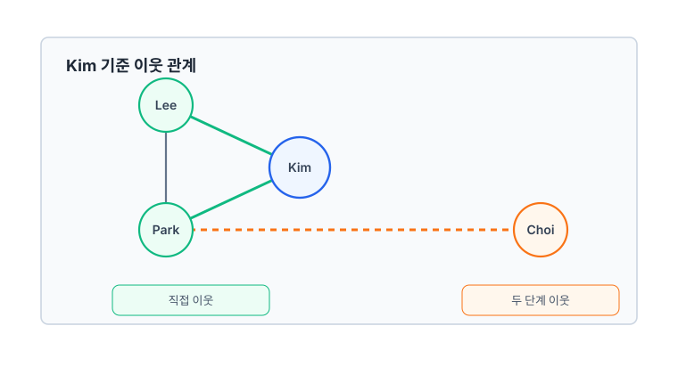

# P2-9.3 그래프(graph)는 관계를 어떻게 표현하는가

> Section ID: `P2-9.3`
> Version: `v2026.07.19`

P2-9.2에서는 배열(array), 표(table), 트리(tree), 그래프(graph)를 서로 다른 데이터 관점으로 비교했습니다. 그중 그래프는 특히 낯설 수 있습니다.

그래프(graph)는 차트나 통계 그래프만을 뜻하지 않습니다. 자료구조와 수학 문맥에서 그래프는 대상 사이의 관계를 표현하는 구조입니다.

여기서는 `그래프(graph)`, `노드(node)`, `엣지(edge)`, `방향(direction)`, `가중치(weight)`의 기본 구분을 설명합니다. `자료구조(data structure)`를 질문으로 읽는 대표 설명은 P2-9.1에, 네 구조 비교는 P2-9.2와 [개념사전](../../../reference/concept-glossary.md)에 두고, 여기서는 관계 데이터를 어떤 질문으로 읽는지에 집중합니다.

이 절에서는 그래프를 노드(node)와 엣지(edge)라는 최소 개념으로 읽습니다.

이 절은 그래프 알고리즘 자체보다 관계 데이터를 어떤 구조로 읽어야 하는지에 집중합니다. 앞 절이 배열, 표, 트리, 그래프를 넓게 비교했다면, 여기서는 그중에서도 특히 연결을 따라가는 질문이 필요한 장면만 따로 붙잡습니다. 이렇게 읽으면 그래프를 통계 차트와 혼동하지 않고 이후 검색, 추천, 지식 연결 이야기와도 자연스럽게 이어 갈 수 있습니다.

| 지금 이 절에서 잡을 것 | 바로 다음에 이어질 질문 | 이후 다시 쓰이는 위치 |
| --- | --- | --- |
| 그래프가 대상과 대상 사이의 연결을 표현하는 구조라는 점 | P2-9.4 보충학습에서 전통 자료구조 이름을 다시 볼 때 그래프를 어디에 놓아야 하는지로 이어집니다. | 이후 검색 구조, 추천 관계, 링크 구조, 지식 그래프 설명에서 반복됩니다. |
| 표와 그래프는 같은 데이터를 두고도 다른 질문을 다룬다는 점 | 관계 목록을 저장할지 연결을 따라 읽을지 판단하는 기준으로 이어집니다. | 이후 RAG 연결 구조, 문서 링크, 사용자-항목 관계 설명에서 다시 쓰입니다. |
| 방향과 가중치가 관계 의미를 바꾼다는 점 | 단순 연결을 넘어 비용, 거리, 유사도를 읽는 기준으로 이어집니다. | 이후 경로, 추천 점수, 검색 연결 강도 설명에서 바탕이 됩니다. |

| 용어 | 이 절에서 먼저 잡을 뜻 |
| --- | --- |
| 그래프(graph) | 대상을 노드로 두고 관계를 엣지로 연결한 구조입니다. |
| 노드(node) | 그래프 안에서 하나의 대상이나 지점을 나타내는 단위입니다. |
| 엣지(edge) | 노드와 노드 사이의 연결입니다. |
| 방향(direction) | 연결이 어느 쪽으로 향하는지 나타내는 성질입니다. |
| 가중치(weight) | 연결의 강도, 거리, 비용 같은 추가 정보를 붙인 값입니다. |

## 이 절의 범위

이 절은 그래프를 관계 표현 관점에서 다룹니다. 중심 질문은 “대상과 대상의 연결을 어떻게 데이터로 표현하는가”입니다.

여기서는 다음 질문에 답합니다.

- 노드(node)와 엣지(edge)는 무엇인가?
- 그래프는 왜 관계를 표현하기 좋은가?
- 무방향 그래프(undirected graph)와 방향 그래프(directed graph)는 어떻게 다른가?
- 가중치(weight)는 관계에 어떤 정보를 더하는가?
- 작은 그래프를 인접 리스트 관점으로 어떻게 읽을 수 있는가?
- AI와 검색, 추천, RAG에서는 그래프 감각이 어디에서 다시 등장하는가?

이번 절은 노드(node), 엣지(edge), 방향(direction), 가중치(weight)로 관계 데이터를 읽는 기준까지를 먼저 닫습니다. 자료구조 이름과 읽는 기준은 P2-9.4 보충학습에서 다시 정리하고, 그래프 감각이 검색 구조로 다시 등장하는 장면은 P1-13.4에서 이어집니다.

## 이 절의 목표

- 그래프(graph)를 노드(node)와 엣지(edge)의 구조로 설명할 수 있습니다.
- 그래프가 표나 트리로는 표현하기 어려운 연결 관계를 다룰 수 있음을 설명할 수 있습니다.
- 무방향 그래프와 방향 그래프의 차이를 입문 수준에서 설명할 수 있습니다.
- 가중치(weight)가 관계의 강도, 거리, 비용 같은 정보를 표현할 수 있음을 설명할 수 있습니다.
- 인접 리스트(adjacency list)를 노드별 이웃 목록으로 설명할 수 있습니다.
- Python 그래프 도구가 노드, 엣지, 이웃, 방향, 가중치를 어떤 API로 다루는지 읽을 수 있습니다.

## 세 가지 기준

| 기준 | 왜 중요한가 | 이 절에서 필요한 이해 수준 |
| --- | --- | --- |
| 그래프가 무엇을 표현하는가 | 그래프를 통계 차트가 아니라 관계 구조로 읽게 해 줍니다. | 대상과 대상 사이의 연결 관계를 표현하는 구조로 이해합니다. |
| 표와 그래프의 차이 | 같은 데이터를 두고도 저장 질문과 연결 질문이 다름을 분명하게 해 줍니다. | 표는 기록을 보기 좋고, 그래프는 연결을 따라가기 좋다는 구분을 잡습니다. |
| 방향과 가중치의 의미 | 연결의 성질이 달라지면 관계 해석도 달라짐을 보여 줍니다. | 연결이 어느 쪽으로 향하는지, 얼마나 강한지까지 읽을 수 있으면 충분합니다. |

## 그래프는 점과 선으로 관계를 표현한다

NIST Dictionary of Algorithms and Data Structures는 그래프를 엣지(edge)로 연결된 항목들의 집합으로 설명하고, 각 항목을 정점(vertex) 또는 노드(node)라고 설명합니다.

여기서는 다음처럼 이해합니다.

그래프는 대상을 노드로 놓고, 대상 사이의 관계를 엣지로 연결한 구조입니다.

아래 도식은 같은 그래프를 그림과 인접 리스트(adjacency list)로 함께 보여 줍니다.



그림에서 `Kim`, `Lee`, `Park`, `Choi`는 노드입니다.

`Kim -- Lee`처럼 두 노드를 잇는 선은 엣지입니다.

같은 관계는 노드별 이웃 목록으로도 적을 수 있습니다.

| 노드 | 이웃 목록 |
| --- | --- |
| Kim | Lee, Park |
| Lee | Kim, Park |
| Park | Kim, Lee, Choi |
| Choi | Park |

이 표현을 인접 리스트(adjacency list)라고 볼 수 있습니다. 핵심은 노드마다 연결된 이웃 목록을 갖는다는 점입니다.

## 표와 그래프는 질문이 다르다

같은 친구 데이터를 표로 적을 수도 있습니다. 표는 “관계 한 건”을 한 행(row)으로 적기에 좋습니다.

| person | friend |
| --- | --- |
| Kim | Lee |
| Kim | Park |
| Lee | Park |
| Park | Choi |

하지만 “Kim과 연결된 사람은 누구인가?”, “Park를 거쳐 Choi로 갈 수 있는가?”처럼 연결을 따라가야 하는 질문에서는 그래프 관점이 더 자연스럽습니다.

아래 도식은 같은 관계 데이터를 표로 읽을 때와 그래프로 읽을 때 질문이 어떻게 달라지는지 보여 줍니다.



표 데이터를 그래프 관점으로 읽으려면 관계 행을 노드별 이웃 목록으로 다시 묶어 보면 됩니다.

| 관계 행 목록 | 인접 리스트로 다시 읽기 |
| --- | --- |
| Kim - Lee | Kim: Lee, Park |
| Kim - Park | Lee: Kim, Park |
| Lee - Park | Park: Kim, Lee, Choi |
| Park - Choi | Choi: Park |

여기서 왼쪽은 표의 행에 가깝고, 오른쪽은 그래프의 인접 리스트에 가깝습니다. 같은 데이터라도 어떤 질문을 하느냐에 따라 읽기 좋은 구조가 달라집니다.

표와 그래프의 차이는 다음처럼 볼 수 있습니다.

| 관점 | 잘 묻는 질문 | 예 |
| --- | --- | --- |
| 표(table) | 어떤 행이 어떤 값을 갖는가? | `person`과 `friend` 목록 |
| 그래프(graph) | 무엇과 무엇이 연결되는가? | Kim의 이웃, Park를 거치는 경로 |

표가 나쁘고 그래프가 좋은 것이 아닙니다. 관계를 목록으로 저장할 때는 표가 좋고, 관계를 따라 이동하거나 연결 구조를 보려면 그래프가 좋습니다.

## Python 그래프 도구로 관계를 다뤄 보기

Python에서 그래프 관계를 다룰 때는 딕셔너리와 반복문으로 직접 구조를 만드는 방법도 있지만, 실제 분석이나 실습에서는 그래프 전용 도구를 쓰는 편이 자연스럽습니다. 대표적인 Python 그래프 라이브러리로 NetworkX가 있습니다.

아래 예제의 목적은 그래프 알고리즘을 깊게 구현하는 것이 아닙니다. 같은 관계 데이터를 NetworkX의 `Graph`와 `DiGraph` 객체에 넣었을 때 노드(node), 엣지(edge), 이웃(neighbor), 두 단계 이웃(two-hop neighbor), 방향(direction), 가중치(weight)를 어떻게 확인하는지 보는 설명형 예제입니다.

문제 상황: 친구 관계와 페이지 링크 관계를 각각 무방향 그래프와 방향 그래프로 만들고, 관계를 따라 읽는 기본 API를 확인합니다.

입력(input): 친구 관계 엣지 목록과 페이지 링크 엣지 목록입니다.

기대 출력(output): 노드 목록, 엣지 목록, Kim의 직접 이웃, Kim의 두 단계 이웃, Kim-Park 관계의 가중치, `page_b`의 다음 링크, `page_c`가 `page_b`로 되돌아가는 링크 여부를 확인합니다.

확인할 개념: 그래프 도구에서는 관계 데이터를 단순 출력값이 아니라 노드와 엣지를 가진 객체로 만든 뒤, 이웃·방향·가중치 같은 그래프 질문을 API로 물을 수 있습니다.

```python
import networkx as nx

friend_relationships = [
    ("Kim", "Lee", {"weight": 1.0}),
    ("Kim", "Park", {"weight": 0.9}),
    ("Lee", "Park", {"weight": 0.8}),
    ("Park", "Choi", {"weight": 0.7}),
]

friend_graph = nx.Graph()
friend_graph.add_edges_from(friend_relationships)

friend_edges = sorted(tuple(sorted(edge)) for edge in friend_graph.edges())
distances = nx.single_source_shortest_path_length(friend_graph, "Kim", cutoff=2)
two_hop_neighbors = sorted(
    node for node, distance in distances.items() if distance == 2
)

print("friend nodes:", sorted(friend_graph.nodes()))
print("friend edges:", friend_edges)
print("Kim neighbors:", sorted(friend_graph.neighbors("Kim")))
print("Kim two-hop neighbors:", two_hop_neighbors)
print("Kim-Park weight:", friend_graph["Kim"]["Park"]["weight"])

page_graph = nx.DiGraph()
page_graph.add_edge("page_a", "page_b")
page_graph.add_edge("page_a", "page_c")
page_graph.add_edge("page_b", "page_c")

print("page_b links to:", list(page_graph.successors("page_b")))
print("page_c links back to page_b:", page_graph.has_edge("page_c", "page_b"))
```

예상 출력은 다음과 같습니다.

```text
friend nodes: ['Choi', 'Kim', 'Lee', 'Park']
friend edges: [('Choi', 'Park'), ('Kim', 'Lee'), ('Kim', 'Park'), ('Lee', 'Park')]
Kim neighbors: ['Lee', 'Park']
Kim two-hop neighbors: ['Choi']
Kim-Park weight: 0.9
page_b links to: ['page_c']
page_c links back to page_b: False
```

이 예제에서 중요한 것은 출력 모양이 아닙니다. `nx.Graph()`는 친구 관계처럼 양쪽으로 읽는 연결을 만들고, `nx.DiGraph()`는 웹 링크처럼 한쪽 방향으로만 읽는 연결을 만듭니다. `neighbors()`는 한 노드의 직접 이웃을 찾고, `single_source_shortest_path_length()`는 시작 노드에서 몇 단계 떨어져 있는지 계산합니다. 엣지에 붙인 `weight`는 관계의 강도나 비용 같은 숫자로 다시 읽을 수 있습니다.

따라서 이 Python 예제는 “정답을 미리 만들어 놓고 출력만 바꾸는 코드”가 아니라, 그래프 관계를 다루는 도구의 사용법을 확인하는 예제입니다.

## 트리와 그래프는 어떻게 다른가

트리(tree)는 그래프의 특수한 형태로 설명할 수 있습니다. NIST의 그래프 설명도 트리를 그래프의 한 종류로 언급합니다.

여기서는 다음처럼 구분합니다.

트리는 계층이 강한 관계입니다.

그래프는 더 일반적인 연결 관계입니다.

예를 들어 책 목차는 보통 트리로 읽기 좋습니다.

```text
study-book
└─ Part 2
   └─ Chapter 9
      └─ Section 9.3
```

하지만 사람 사이의 관계는 트리로 정리하기 어렵습니다.

```text
Kim -- Lee
Kim -- Park
Lee -- Park
Park -- Choi
```

사람 관계에서는 한 사람이 여러 사람과 연결되고, 서로 연결이 되돌아올 수도 있습니다. 이런 구조는 그래프 관점이 더 자연스럽습니다.

## 무방향 그래프와 방향 그래프

그래프의 엣지는 방향이 없을 수도 있고, 방향이 있을 수도 있습니다.

무방향 그래프(undirected graph)는 관계가 양쪽으로 같은 의미를 갖는 경우에 사용합니다.

친구 관계를 단순하게 볼 때는 `Kim -- Lee`라고 표현할 수 있습니다. Kim이 Lee와 친구라면 Lee도 Kim과 친구라고 보는 방식입니다.

무방향 그래프에서는 같은 연결을 양쪽 노드에서 모두 읽을 수 있어야 합니다.

| 노드 | 이웃 |
| --- | --- |
| Kim | Lee |
| Lee | Kim |

방향 그래프(directed graph)는 관계의 방향이 중요한 경우에 사용합니다.

예를 들어 웹 링크는 방향이 있습니다. A 문서가 B 문서로 링크한다고 해서 B 문서가 A 문서로 링크하는 것은 아닙니다.

방향 그래프에서는 연결이 향하는 쪽만 적습니다.

| 출발 노드 | 향하는 노드 |
| --- | --- |
| page_a | page_b, page_c |
| page_b | page_c |
| page_c | 없음 |

AI와 검색 문맥에서는 방향이 중요할 때가 많습니다. 문서가 다른 문서를 인용하거나, 작업 흐름이 다음 단계로 넘어가거나, 사용자가 항목을 클릭하는 흐름은 방향 그래프로 볼 수 있습니다.

아래 도식은 방향과 가중치가 엣지의 의미를 어떻게 바꾸는지 보여 줍니다.



방향 그래프를 읽을 때는 양쪽에 모두 관계가 있다고 가정하지 않습니다. 관계가 실제로 향하는 쪽만 읽습니다.

| 질문 | 답 |
| --- | --- |
| `page_b`가 가리키는 다음 페이지는 무엇인가 | `page_c` |
| `page_c`가 다시 `page_b`를 가리키는가 | 이 표만으로는 아니오 |

이 예제에서 `page_b`는 `page_c`로 링크하지만, `page_c`가 다시 `page_b`로 링크한다고 말할 수는 없습니다.

## 가중치(weight)는 관계에 숫자를 붙인다

모든 연결이 같은 강도를 갖지는 않습니다. 어떤 관계는 가깝고, 어떤 관계는 멀고, 어떤 관계는 비용이 큽니다.

이때 엣지에 숫자를 붙일 수 있습니다. 이것을 가중치(weight)라고 부릅니다.

예를 들어 도시 사이의 거리를 그래프로 표현할 수 있습니다.

도시 사이의 거리도 노드와 엣지로 읽을 수 있습니다.

| 출발 노드 | 도착 노드 | 가중치 |
| --- | --- | ---: |
| Seoul | Daejeon | 160 |
| Seoul | Busan | 325 |
| Daejeon | Busan | 200 |

여기서 `325`는 Seoul과 Busan 사이의 관계에 붙은 숫자입니다. 추천 시스템에서는 이 숫자가 유사도(similarity)일 수도 있고, 검색에서는 점수(score)일 수도 있고, 네트워크에서는 비용(cost)일 수도 있습니다.

중요한 것은 가중치가 정답 그 자체가 아니라 관계를 해석하기 위한 숫자라는 점입니다.

가중치가 붙으면 “연결되어 있는가”에서 끝나지 않고 “얼마나 가까운가”, “얼마나 비용이 드는가”, “얼마나 강하게 관련되는가”를 물을 수 있습니다.

검색 후보나 추천 후보 사이의 관계 점수를 읽을 때도 같은 관점을 적용할 수 있습니다. 아래 장면은 이미 계산된 관계 점수를 기준선과 비교해 해석하는 예시입니다.

| 후보 문서 | 질의와의 관계 점수 | 기준 `0.7`과 비교 | 해석 |
| --- | ---: | --- | --- |
| `doc_a` | 0.91 | 기준 이상 | 먼저 살펴볼 강한 후보 |
| `doc_b` | 0.72 | 기준 이상 | 함께 살펴볼 후보 |
| `doc_c` | 0.18 | 기준 미만 | 현재 기준에서는 뒤로 미룰 후보 |

이 표는 검색 시스템을 구현한 것이 아닙니다. 다만 AI 검색이나 추천에서 관계에 숫자를 붙여 후보를 비교할 수 있고, 기준선에 따라 먼저 볼 연결과 뒤로 미룰 연결이 갈릴 수 있다는 감각을 보여 줍니다.

## 연결을 한 단계씩 따라가기

그래프 탐색 알고리즘을 구현하지 않아도, 그래프가 “연결된 이웃을 따라간다”는 감각은 표로 확인할 수 있습니다. 시작 노드를 `Kim`으로 두면 직접 연결과 한 단계를 거친 연결은 다음처럼 달라집니다.

| 기준 | 포함되는 노드 | 읽는 방법 |
| --- | --- | --- |
| 직접 이웃 | Lee, Park | Kim과 바로 연결된 노드 |
| 두 단계 후보 | Choi | Kim의 이웃을 한 번 더 따라갔을 때 새로 만나는 노드 |

여기서 중요한 것은 반복문 자체가 아닙니다. 그래프에서는 한 노드에서 연결된 이웃으로 이동하고, 다시 그 이웃의 이웃으로 이동할 수 있다는 점입니다.

관계를 따라가면 “직접 연결”과 “한 단계를 거친 연결”을 구분할 수 있습니다.

아래 도식은 Kim을 기준으로 직접 이웃과 두 단계 이웃을 구분해 보여 줍니다.



여기서 직접 이웃은 Kim과 바로 연결된 노드이고, 두 단계 이웃은 친구의 친구처럼 한 단계를 더 따라간 노드입니다. 그래프를 배우는 이유는 이런 연결 질문을 데이터로 다룰 수 있게 하기 위해서입니다.

## AI 실습에서 그래프 감각이 다시 등장하는 곳

그래프 감각은 P1-13.4 벡터 검색 구현, P5-13 벡터 데이터베이스와 인덱스 설명, 그리고 Part 6의 워크플로우·검색 프로젝트 문맥에서 다시 등장합니다.

| 장면 | 그래프 관점 |
| --- | --- |
| 지식 그래프(knowledge graph) | 개념, 사람, 장소, 사건을 노드로 두고 관계를 엣지로 표현 |
| 추천 시스템(recommender system) | 사용자와 항목, 항목과 항목의 연결을 표현 |
| 검색(search) | 문서, 링크, 키워드, 출처 사이의 연결을 표현 |
| RAG | 문서 조각, 메타데이터, 출처, 질문 사이의 관계를 표현 |
| 워크플로우(workflow) | 작업 단계와 다음 단계의 연결을 표현 |

이 절에서는 각 분야의 구현을 깊게 설명하지 않습니다. 벡터 검색과 인덱스는 P1-13.4와 P5-13에서 다시 보고, 워크플로우와 검색 프로젝트 연결은 Part 6에서 다시 봅니다. 지금은 그래프가 “관계가 중요한 데이터”를 표현하는 방식이라는 감각을 잡는 것이 중요합니다.

## 오해하기 쉬운 지점

그래프(graph)는 통계 차트나 선 그래프만을 뜻하지 않습니다.

자료구조 문맥에서 그래프는 노드와 엣지로 관계를 표현하는 구조입니다.

그래프는 항상 복잡한 알고리즘을 의미하지 않습니다.

작은 그래프는 노드별 이웃 목록만으로도 표현해 볼 수 있습니다.

그래프는 트리보다 무조건 좋은 구조가 아닙니다.

계층이 뚜렷하면 트리가 더 읽기 쉽고, 여러 방향의 연결이 중요하면 그래프가 더 자연스럽습니다.

그래프의 위치 그림은 설명을 돕는 시각화일 뿐입니다.

노드가 그림에서 어디에 놓였는지는 대부분의 경우 핵심이 아닙니다. 중요한 것은 어떤 노드들이 엣지로 연결되어 있는가입니다.

## 사례 및 예시

### 사례 1. 추천에서 친구의 친구를 보고 싶을 때 무엇이 필요한가

한 서비스가 `내가 직접 본 항목`뿐 아니라 `비슷한 사용자가 본 항목`이나 `친구의 친구가 자주 본 항목`까지 참고해 추천하려 한다고 하겠습니다. 사람은 처음에 표에 사용자-항목 기록을 쌓아 두는 것만으로 충분하다고 느낄 수 있습니다.

하지만 이런 질문은 단순 목록보다 연결을 따라가야 합니다. 누가 누구와 연결되어 있는지, 한 단계 이웃과 두 단계 이웃이 누구인지, 관계의 방향이나 강도가 어떤지를 함께 봐야 하기 때문입니다.

그래프는 바로 이런 장면을 읽기 위한 구조입니다. 노드는 사용자나 문서가 되고, 엣지는 클릭, 친구 관계, 링크, 유사도처럼 연결을 나타냅니다. 그래서 `직접 연결`, `한 단계를 거친 연결`, `가중치가 높은 연결` 같은 질문을 더 자연스럽게 표현할 수 있습니다.

확인 가능한 결과는 한 노드에서 이웃을 따라갈 수 있는지입니다. 예를 들어 Kim의 직접 이웃과 두 단계 이웃을 구분할 수 있다면, 표에 저장된 관계를 그래프 관점으로 읽고 있는 것입니다.

## 체크리스트

- 그래프(graph)를 노드(node)와 엣지(edge)의 구조로 설명할 수 있다.
- 인접 리스트(adjacency list)를 각 노드의 이웃 목록으로 설명할 수 있다.
- 표와 그래프가 서로 다른 질문에 답한다는 점을 설명할 수 있다.
- 트리(tree)를 그래프의 특수한 형태로 입문 수준에서 설명할 수 있다.
- 무방향 그래프와 방향 그래프의 차이를 설명할 수 있다.
- 가중치(weight)가 관계에 숫자 정보를 붙인다는 점을 설명할 수 있다.
- 작은 그래프를 노드별 이웃 목록으로 표현하고 이웃을 따라가 볼 수 있다.
- NetworkX 같은 Python 그래프 도구가 노드, 엣지, 이웃, 방향, 가중치를 어떻게 다루는지 읽을 수 있다.
- 연결이 핵심인 데이터를 만났을 때 그래프 관점을 먼저 떠올릴 수 있다.

## 출처와 참고 자료

- Paul E. Black and Paul J. Tanenbaum, [graph](https://xlinux.nist.gov/dads/HTML/graph.html){: target="_blank" rel="noopener noreferrer" }, Dictionary of Algorithms and Data Structures, NIST, 확인 날짜: 2026-07-19. 그래프를 vertices/nodes와 edges/arcs로 구성된 구조로 설명하는 근거로 사용했다.
- NetworkX Developers, [Graph - Undirected graphs with self loops](https://networkx.org/documentation/stable/reference/classes/graph.html){: target="_blank" rel="noopener noreferrer" }, NetworkX 3.6.1 documentation, 확인 날짜: 2026-07-19. 작은 무방향 그래프, 노드, 엣지, 인접 관계를 확인하는 근거로 사용했다.
- NetworkX Developers, [DiGraph - Directed graphs with self loops](https://networkx.org/documentation/stable/reference/classes/digraph.html){: target="_blank" rel="noopener noreferrer" }, NetworkX 3.6.1 documentation, 확인 날짜: 2026-07-19. 방향 그래프와 successor 관계를 확인하는 근거로 사용했다.
