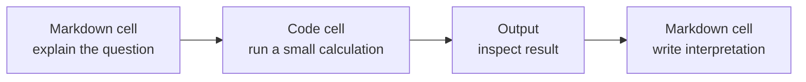
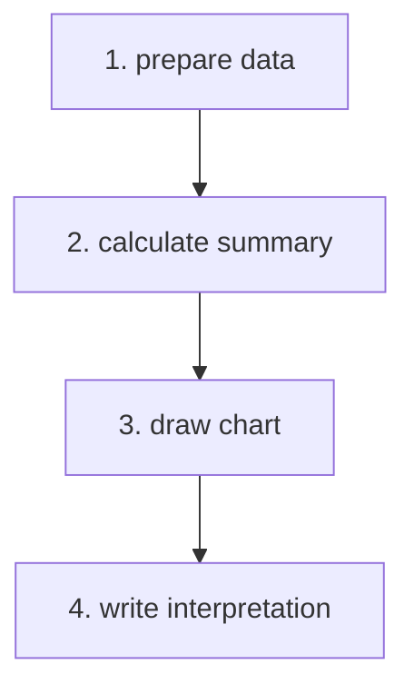

# P2-10.1 노트북(notebook)은 왜 학습에 유용한가

P2-7에서는 Python을 어디에서 실행하는지, 터미널(terminal), 셸(shell), 인터프리터(interpreter), 스크립트(script), 가상환경(virtual environment)을 나누어 봤습니다. P2-8과 P2-9에서는 Python 문법과 자료구조를 작은 예제로 복구했습니다.

이제 Jupyter Notebook이나 Google Colab 같은 노트북(notebook) 환경을 따로 봅니다. 여기서 말하는 노트북은 종이 공책이 아니라, 코드(code), 실행 결과(output), 설명(markdown)을 한 문서 안에 함께 남기는 계산 문서(computational notebook)입니다.

노트북은 AI 학습에서 특히 자주 등장합니다. 수식을 코드로 바꾸어 확인하고, 데이터 표를 출력하고, 차트를 그려 보고, 그 옆에 해석을 적을 수 있기 때문입니다.

## 이 절의 범위

이 절은 노트북을 설치하거나 Colab 사용법을 자세히 설명하는 절이 아닙니다. Colab과 로컬 PC 실행 환경의 차이는 P2-3.4와 P2-7에서 이미 봤고, Jupyter와 Colab의 차이는 P2-10.2에서 따로 다룹니다.

여기서는 다음 질문에 답합니다.

- 노트북(notebook)은 무엇인가?
- 코드 셀(code cell), 마크다운 셀(markdown cell), 출력(output)은 어떻게 함께 쓰이는가?
- 노트북은 왜 학습 기록에 유용한가?
- 노트북이 스크립트(script)보다 항상 좋은 것은 아닌 이유는 무엇인가?
- AI 재학습 과정에서 노트북을 어떤 태도로 사용하면 좋은가?

이 절에서는 Jupyter 서버 구조, 커널 프로토콜, `.ipynb` JSON 스키마, Colab 런타임 정책, 노트북 배포 자동화는 깊게 다루지 않습니다.

## 이 절의 목표

- 노트북(notebook)을 코드, 설명, 출력이 함께 있는 계산 문서로 설명할 수 있습니다.
- 코드 셀(code cell)과 마크다운 셀(markdown cell)의 역할을 구분할 수 있습니다.
- 노트북이 실험과 학습 기록에 유용한 이유를 설명할 수 있습니다.
- 셀 실행 순서와 숨은 상태(hidden state)가 노트북의 주의점임을 설명할 수 있습니다.
- 노트북을 학습 초안으로 쓰되, 반복 재사용할 코드는 스크립트나 모듈로 분리해야 할 수 있음을 설명할 수 있습니다.

## 노트북은 코드와 설명이 함께 있는 문서다

Project Jupyter 공식 문서는 노트북을 코드, 평문 설명, 데이터, 시각화, 상호작용 요소를 결합할 수 있는 공유 가능한 문서로 설명합니다. 또한 Jupyter 아키텍처 문서는 노트북이 코드와 출력, 마크다운 노트를 함께 저장하는 편집 가능한 문서라고 설명합니다.

입문 단계에서는 이렇게 이해하면 충분합니다.

> 노트북은 코드를 실행하는 문서입니다.
>
> 동시에, 실행 결과와 설명을 함께 남기는 학습 기록입니다.

일반적인 Python 스크립트 파일은 보통 코드 중심입니다.

```python
scores = [82, 75, 45]
average = sum(scores) / len(scores)
print(average)
```

반면 노트북에서는 같은 계산 앞뒤에 설명과 결과를 함께 둘 수 있습니다.

> 이번 셀에서는 세 학생의 평균 점수를 계산한다.

```python
scores = [82, 75, 45]
average = sum(scores) / len(scores)
average
```

> 출력 결과를 보고 평균이 약 67.3이라는 점을 확인한다.

이 차이는 작아 보이지만, 학습에서는 중요합니다. “무엇을 계산했는가”, “왜 계산했는가”, “결과를 어떻게 해석했는가”가 한 문서 안에 남기 때문입니다.

## 셀(cell)은 노트북의 기본 단위다

노트북은 보통 셀(cell) 단위로 구성됩니다. 셀은 문서 안의 작은 블록입니다.

| 셀 종류 | 영어 | 역할 |
| --- | --- | --- |
| 코드 셀 | code cell | Python 코드 등을 실행한다 |
| 마크다운 셀 | markdown cell | 설명, 제목, 목록, 수식, 링크를 적는다 |
| 출력 | output | 코드 실행 결과, 표, 차트, 오류 메시지를 보여 준다 |

흐름은 다음처럼 볼 수 있습니다.



노트북 학습의 핵심은 이 네 단계를 짧게 반복하는 것입니다.

> 질문을 적는다.
> 코드를 실행한다.
> 결과를 본다.
> 해석을 남긴다.

이 방식은 AI 수학과 Python을 다시 공부할 때 유용합니다. 예를 들어 시그마(sigma), 평균(mean), 분산(variance), 그래디언트(gradient)를 배울 때 수식만 읽으면 추상적으로 느껴질 수 있습니다. 노트북에서는 바로 아래 셀에서 숫자로 확인할 수 있습니다.

## 노트북은 학습 흔적을 남기기 좋다

노트북이 학습에 유용한 첫 번째 이유는 생각의 흔적을 남기기 쉽다는 점입니다.

예를 들어 평균을 배울 때 단순히 최종 코드만 남기면 나중에 왜 이 계산을 했는지 잊기 쉽습니다.

```python
scores = [82, 75, 45]
sum(scores) / len(scores)
```

노트북에서는 계산 앞에 질문을 남길 수 있습니다.

> 질문: 세 학생의 점수를 하나의 대표값으로 요약하면 무엇을 볼 수 있을까?

그리고 계산 뒤에 해석을 남길 수 있습니다.

> 해석: 평균은 전체 점수의 중심을 보는 데 유용하지만, 45처럼 낮은 값이 섞여 있다는 사실은 평균만으로 충분히 드러나지 않는다.

이런 기록은 나중에 Part 3에서 모델 평가(metric), 데이터 분포(distribution), 오차(error)를 다시 볼 때 도움이 됩니다.

## 노트북은 실험을 작게 쪼개기 좋다

두 번째 이유는 코드를 셀 단위로 나누어 실행할 수 있다는 점입니다.

예를 들어 다음 흐름을 생각해 볼 수 있습니다.



스크립트에서도 같은 일을 할 수 있지만, 초심자 학습에서는 한 번에 전체 파일을 실행하는 것보다 한 셀씩 확인하는 방식이 덜 부담스럽습니다.

작은 실습은 다음처럼 나눌 수 있습니다.

첫 번째 셀은 데이터를 준비합니다.

```python
scores = [82, 75, 45, 90, 61]
```

두 번째 셀은 요약값을 계산합니다.

```python
mean_score = sum(scores) / len(scores)
mean_score
```

세 번째 셀은 조건을 바꾸어 봅니다.

```python
passed = [score for score in scores if score >= 60]
passed
```

이렇게 나누면 “어느 단계에서 무엇이 바뀌었는가”를 보기 쉽습니다.

## 결과(output)를 바로 볼 수 있다는 점이 강점이다

노트북은 출력(output)을 코드 바로 아래에 보여 줍니다. 숫자, 표, 차트, 오류 메시지가 코드와 가까운 곳에 남습니다.

이 점은 AI 학습에서 중요합니다.

| 학습 장면 | 노트북에서 확인하기 좋은 것 |
| --- | --- |
| 수식 복구 | 작은 숫자 계산 결과 |
| 통계 복구 | 평균, 분산, 표본 계산 결과 |
| 데이터 확인 | 표, 행 개수, 결측값 |
| 시각화 | 선 그래프, 산점도, 히스토그램 |
| 모델 실험 | 손실 값, 평가 지표, 예측 결과 |

결과를 바로 볼 수 있다는 말은 “항상 올바른 결과가 나온다”는 뜻이 아닙니다. 오히려 결과를 바로 보고 의심할 수 있다는 점이 중요합니다.

> 값이 예상보다 큰가?
> 표의 행 개수가 맞는가?
> 차트가 내가 생각한 모양인가?
> 오류 메시지가 어느 셀에서 생겼는가?

노트북은 이 질문을 반복하기 좋은 환경입니다.

## 노트북의 주의점: 셀 실행 순서

노트북은 편하지만, 주의할 점도 있습니다. 가장 중요한 것은 셀 실행 순서(execution order)입니다.

다음 예를 봅니다.

```python
x = 10
```

다른 셀에서 다음 코드를 실행합니다.

```python
x + 5
```

이 코드는 앞에서 `x`가 만들어져 있어야 실행됩니다. 그런데 중간 셀을 건너뛰거나, 예전에 실행한 셀의 값이 남아 있으면 현재 문서에 보이는 순서와 실제 실행 상태가 달라질 수 있습니다.

입문 단계에서는 다음 습관이 중요합니다.

| 확인할 것 | 이유 |
| --- | --- |
| 위에서 아래로 다시 실행해 보기 | 숨은 상태를 줄인다 |
| 필요한 import를 앞쪽에 모으기 | 어떤 패키지가 필요한지 보인다 |
| 데이터 준비 셀을 분명히 두기 | 뒤 셀이 무엇에 의존하는지 보인다 |
| 결과 해석을 코드 바로 아래에 적기 | 나중에 읽을 때 맥락이 남는다 |

노트북은 자유롭게 실행할 수 있다는 장점 때문에, 오히려 실행 순서가 흐트러질 수 있습니다. 이 점은 스크립트보다 조심해야 합니다.

## 노트북은 스크립트를 대체하지 않는다

노트북은 학습과 탐색에 좋지만 모든 상황에 적합한 것은 아닙니다.

반복해서 실행해야 하는 코드, 다른 프로젝트에서 재사용할 코드, 자동화해야 하는 코드는 `.py` 스크립트나 모듈(module)로 분리하는 편이 좋을 수 있습니다.

| 상황 | 노트북이 좋은가 | 스크립트가 좋은가 |
| --- | --- | --- |
| 처음 개념을 실험한다 | 좋다 | 가능하지만 설명을 따로 남겨야 한다 |
| 데이터와 차트를 보며 해석한다 | 좋다 | 가능하지만 중간 결과 확인이 불편할 수 있다 |
| 같은 작업을 매일 자동 실행한다 | 불리할 수 있다 | 좋다 |
| 함수를 여러 프로젝트에서 재사용한다 | 불리할 수 있다 | 좋다 |
| 문서와 실험 기록을 함께 공유한다 | 좋다 | 별도 문서가 필요하다 |

따라서 이 책에서는 노트북을 학습 기록과 작은 실험의 도구로 봅니다. 나중에 코드가 길어지고 반복 실행이 필요해지면 스크립트와 패키지 구조로 옮기는 판단이 필요합니다.

## AI 재학습에서 노트북을 쓰는 방법

이 책의 독자에게 노트북은 “정답을 제출하는 파일”보다 “이해를 복구하는 작업장”에 가깝습니다.

다음 순서로 사용하면 좋습니다.

1. 먼저 질문을 마크다운 셀에 적습니다.
2. 작은 데이터나 숫자 예제를 코드 셀에 적습니다.
3. 결과를 출력합니다.
4. 결과가 예상과 맞는지 짧게 해석합니다.
5. 셀을 위에서 아래로 다시 실행해 봅니다.

예를 들어 확률과 통계를 공부할 때는 다음처럼 적을 수 있습니다.

> 질문: 표본 평균은 데이터가 바뀌면 얼마나 달라질까?

```python
sample_a = [10, 12, 13, 11, 14]
sample_b = [8, 16, 9, 15, 12]

mean_a = sum(sample_a) / len(sample_a)
mean_b = sum(sample_b) / len(sample_b)

mean_a, mean_b
```

> 해석: 두 표본은 값의 구성이 다르지만 평균은 비슷할 수 있다. 평균만으로 분포의 차이를 모두 알 수는 없다.

이런 방식은 이후 머신러닝 실습에서도 계속 쓰입니다. 데이터 준비, 모델 학습, 평가, 해석을 한 번에 완성하려고 하지 말고, 셀 단위로 작은 질문을 확인합니다.

## 이 절에서 기억할 관점

노트북은 코드 실행 도구이면서 학습 기록 문서입니다.

코드 셀은 계산을 실행합니다.

마크다운 셀은 질문과 해석을 남깁니다.

출력은 결과를 바로 확인하게 해 줍니다.

노트북은 탐색과 학습에는 유용하지만, 실행 순서와 숨은 상태를 주의해야 합니다.

반복 실행과 재사용이 중요해지면 스크립트나 모듈로 분리하는 판단이 필요합니다.

## 체크리스트

- 노트북(notebook)을 코드, 설명, 출력이 함께 있는 계산 문서로 설명할 수 있다.
- 코드 셀(code cell)과 마크다운 셀(markdown cell)을 구분할 수 있다.
- 노트북이 AI 수학과 Python 실습 기록에 유용한 이유를 설명할 수 있다.
- 셀 실행 순서가 결과에 영향을 줄 수 있음을 설명할 수 있다.
- 노트북이 스크립트를 완전히 대체하지 않는다는 점을 설명할 수 있다.
- 학습 노트북에서 질문, 코드, 출력, 해석을 함께 남길 수 있다.

## 출처와 참고 자료

- Project Jupyter, [Project Jupyter Documentation](https://docs.jupyter.org/en/latest/){: target="_blank" rel="noopener noreferrer" }, 확인 날짜: 2026-06-25.
- Project Jupyter, [Architecture](https://docs.jupyter.org/en/latest/projects/architecture/content-architecture.html){: target="_blank" rel="noopener noreferrer" }, 확인 날짜: 2026-06-25.
- Google, [Welcome to Colab](https://colab.research.google.com/notebooks/intro.ipynb){: target="_blank" rel="noopener noreferrer" }, 확인 날짜: 2026-06-25.
