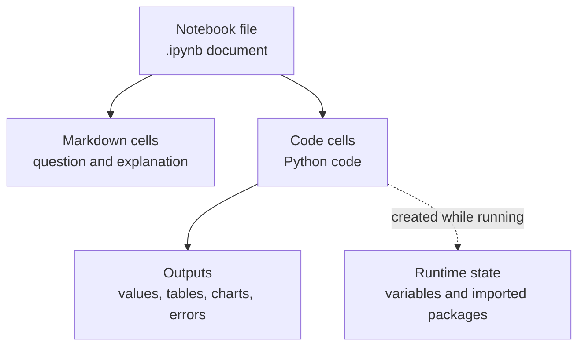
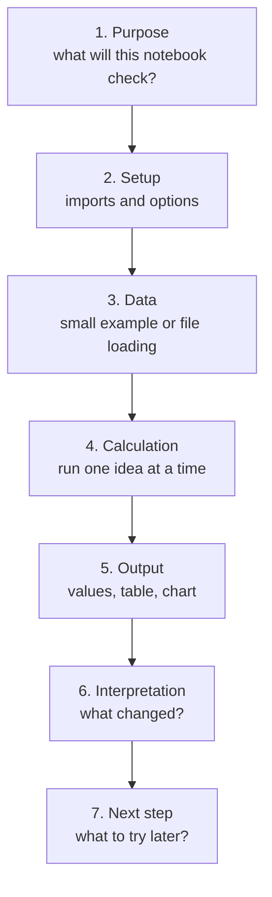

# P2-10.3 노트북을 재실행 가능한 기록으로 정리하기

P2-10.1에서는 노트북(notebook)을 코드, 설명, 출력이 함께 있는 계산 문서로 봤습니다. P2-10.2에서는 Jupyter, Colab, 로컬 실행의 차이를 실행 위치와 파일 접근 관점에서 구분했습니다.

이제 한 단계 더 들어갑니다. 노트북은 학습 기록으로 유용하지만, 셀을 여러 번 실행하다 보면 문서에 보이는 순서와 실제 실행 상태가 달라질 수 있습니다. 그래서 노트북은 “읽기 좋은 문서”이면서 동시에 “다시 실행 가능한 기록(reproducible record)”으로 정리해야 합니다.

## 이 절의 범위

이 절은 노트북을 멋지게 꾸미는 방법을 다루지 않습니다. Jupyter 확장 기능, Colab 고급 설정, 자동 배포, 대규모 실험 추적 도구도 다루지 않습니다.

여기서는 다음 질문에 답합니다.

- 노트북을 왜 위에서 아래로 다시 실행해 봐야 하는가?
- 코드 셀(code cell), 마크다운 셀(markdown cell), 출력(output)을 어떤 순서로 배치하면 좋은가?
- 패키지(package), 데이터 파일(data file), 랜덤성(randomness)은 어디에 적어야 하는가?
- Colab과 로컬 실행에서 재현성(reproducibility)을 어떻게 다르게 조심해야 하는가?
- 노트북에서 시작한 코드를 언제 `.py` 파일로 분리하면 좋은가?

이 절은 P2-7.5의 의존성(dependency)과 재현성(reproducibility), P2-10.1의 노트북 장단점, P2-10.2의 실행 환경 차이를 실습 기록 습관으로 연결합니다.

## 이 절의 목표

- 노트북을 다시 실행 가능한 학습 기록으로 정리해야 하는 이유를 설명할 수 있습니다.
- 실행 순서(execution order)와 숨은 상태(hidden state)가 노트북 결과를 헷갈리게 만들 수 있음을 설명할 수 있습니다.
- 노트북 앞부분에 환경, 패키지, 데이터 준비 셀을 두는 이유를 설명할 수 있습니다.
- Colab 공유에서 노트북 내용과 런타임 상태가 다를 수 있음을 설명할 수 있습니다.
- 노트북에서 검증한 코드를 함수와 스크립트(script)로 분리해야 하는 시점을 설명할 수 있습니다.

## 노트북은 문서이면서 실행 기록이다

Jupyter Notebook 파일은 `.ipynb` 확장자를 가진 JSON 기반 문서입니다. nbformat 문서는 노트북이 셀(cell) 목록과 메타데이터(metadata)를 포함하고, 각 셀이 입력과 출력을 가질 수 있다고 설명합니다. Jupyter 아키텍처 문서도 노트북을 코드, 출력, 마크다운 노트가 함께 저장되는 문서로 설명합니다.

입문 단계에서는 이 구조를 이렇게 이해하면 됩니다.



여기서 중요한 점은 파일에 저장된 내용과 실행 중인 상태가 같지 않다는 것입니다.

노트북 파일에는 코드와 일부 출력이 남을 수 있습니다. 하지만 변수(variable), import된 패키지, 임시 파일, 메모리 상태는 실행 중인 런타임(runtime)에 있습니다. 런타임을 다시 시작하면 그 상태는 사라질 수 있습니다.

그래서 노트북은 저장만 해서는 충분하지 않습니다. 저장된 노트북이 나중에 다시 실행되는지도 확인해야 합니다.

## 위에서 아래로 실행되는 흐름을 만든다

좋은 학습용 노트북은 위에서 아래로 읽고 실행할 수 있어야 합니다.

다음 흐름을 기본으로 삼을 수 있습니다.



이 구조는 형식이 아니라 사고 순서입니다.

먼저 무엇을 확인하려는지 적습니다. 그다음 필요한 패키지를 불러오고, 데이터를 준비하고, 계산을 실행합니다. 결과를 본 뒤에는 해석을 적습니다.

이 순서가 무너지면 나중에 노트북을 다시 열었을 때 “왜 이 계산을 했는지”, “어떤 데이터로 실행했는지”, “결과가 어떤 의미인지”를 잃기 쉽습니다.

## 첫 셀에는 목적을 적는다

노트북의 첫 부분에는 코드보다 목적을 먼저 둡니다.

예를 들어 다음처럼 시작할 수 있습니다.

> 이 노트북은 작은 점수 데이터에서 평균(mean)과 분산(variance)을 계산해 보고, 데이터의 중심과 퍼짐이 어떻게 다른지 확인한다.

이 한 문장은 나중에 매우 중요합니다. 노트북은 셀을 추가하다 보면 금방 길어집니다. 목적이 없으면 실험이 흩어지고, 결과가 무엇을 설명하는지 흐려집니다.

목적 셀에는 다음 내용을 짧게 적습니다.

| 항목 | 적는 이유 |
| --- | --- |
| 확인할 질문 | 실험이 흩어지지 않게 한다 |
| 사용할 데이터 | 결과의 범위를 분명히 한다 |
| 기대하는 출력 | 무엇을 봐야 하는지 정한다 |
| 다루지 않을 것 | 노트북이 과도하게 커지지 않게 한다 |

노트북도 Section과 비슷합니다. 하나의 노트북은 가능하면 하나의 중심 질문을 가져야 합니다.

## 패키지와 설정은 앞쪽에 모은다

노트북 중간중간에 import가 흩어져 있으면 나중에 다시 실행할 때 어떤 패키지가 필요한지 찾기 어렵습니다.

좋은 습관은 앞부분에 setup 셀을 두는 것입니다.

```python
import numpy as np
import pandas as pd
import matplotlib.pyplot as plt
```

이 셀은 “이 노트북이 어떤 도구를 쓰는가”를 보여 줍니다.

Colab에서는 패키지를 설치하는 셀도 앞쪽에 둡니다.

```python
%pip install numpy pandas matplotlib
```

Colab이나 Jupyter에서 `!pip install ...`을 보는 경우도 많습니다. `!`는 노트북 셀에서 셸(shell) 명령을 실행하겠다는 뜻으로 쓰입니다. 다만 Python 패키지 설치에는 `%pip` 같은 IPython 매직 명령(magic command)이 현재 실행 중인 커널(kernel)과 더 잘 맞는 경우가 있어, 이 책에서는 가능한 한 `%pip` 형태를 우선 소개합니다.

이 절의 목적은 설치법을 깊게 다루는 것이 아닙니다. 중요한 것은 패키지 설치와 import가 노트북 앞쪽에 있어야 다른 사람이 다시 실행할 때 필요한 준비를 알 수 있다는 점입니다.

## 데이터 준비 셀을 분명히 둔다

노트북 실습이 실패하는 흔한 이유 중 하나는 파일 경로(path)입니다.

로컬 PC에서는 다음 경로가 있을 수 있습니다.

```python
data_path = "data/scores.csv"
```

하지만 Colab에서는 같은 파일이 없을 수 있습니다. 파일을 업로드했는지, Google Drive에 연결했는지, GitHub에서 내려받았는지에 따라 경로가 달라집니다.

그래서 데이터 준비 셀에는 다음 중 하나가 분명히 보여야 합니다.

| 상황 | 노트북에 남길 내용 |
| --- | --- |
| 작은 예제 데이터 | 코드 안에 직접 만든다 |
| 로컬 파일 | 파일 위치와 폴더 구조를 적는다 |
| Colab 업로드 | 업로드가 필요하다고 적는다 |
| Drive 파일 | Drive 연결과 권한을 적는다 |
| 웹에서 받은 파일 | 다운로드 출처와 확인 날짜를 적는다 |

입문 단계에서는 가능하면 작은 예제 데이터를 코드 안에 직접 두는 것이 좋습니다.

```python
scores = [82, 75, 45, 90, 61]
```

이 방식은 실제 프로젝트에는 부족할 수 있지만, 개념 학습에는 좋습니다. 파일 문제 없이 평균, 분산, 표본, 오차 같은 개념에 집중할 수 있기 때문입니다.

## 출력은 남기되, 해석도 함께 남긴다

노트북은 출력(output)을 저장할 수 있습니다. 하지만 출력만 남기면 학습 기록으로 충분하지 않습니다.

예를 들어 다음 출력이 있다고 가정합니다.

```python
67.3
```

나중에 보면 이 숫자가 평균인지, 정확도인지, 손실인지 알기 어렵습니다.

그래서 출력 바로 아래에는 짧은 해석을 둡니다.

> 평균은 67.3이다. 하지만 45처럼 낮은 값이 포함되어 있으므로 평균만으로 전체 분포를 설명하기 어렵다.

이 한 문장이 학습 기록의 품질을 바꿉니다. 노트북은 코드를 모아 둔 파일이 아니라, 계산 결과를 해석한 기록이어야 합니다.

## 셀 실행 순서가 결과를 바꿀 수 있다

노트북은 셀을 자유롭게 실행할 수 있습니다. 이 장점은 동시에 위험입니다.

다음 상황을 생각해 봅니다.

```python
learning_rate = 0.1
```

나중에 아래 셀에서 이 값을 바꿉니다.

```python
learning_rate = 0.01
```

문서에는 위에서 아래로 두 값이 보이지만, 실제 런타임에서는 마지막으로 실행한 셀의 값이 남습니다. 만약 아래 셀을 먼저 실행하고 위 셀을 나중에 실행했다면 결과는 다시 달라질 수 있습니다.

따라서 중요한 노트북은 다음처럼 확인합니다.

1. 런타임을 다시 시작한다.
2. 첫 셀부터 마지막 셀까지 순서대로 실행한다.
3. 오류가 나는 셀이 없는지 확인한다.
4. 출력이 설명과 맞는지 확인한다.
5. 불필요한 임시 셀을 정리한다.

이 과정을 거치면 노트북이 “내 컴퓨터에서 우연히 돌아간 기록”이 아니라 “다시 실행할 수 있는 기록”에 가까워집니다.

## 랜덤성은 고정하거나 설명한다

AI와 통계 실습에서는 랜덤(random) 요소가 자주 등장합니다. 표본을 뽑거나, 데이터를 섞거나, 모델의 초기값을 정할 때 결과가 달라질 수 있습니다.

입문 단계에서는 랜덤성이 있는지 먼저 설명하는 것만으로도 충분합니다.

```python
rng = np.random.default_rng(seed=42)
sample = rng.choice([10, 20, 30, 40, 50], size=3, replace=False)
sample
```

여기서 `seed`는 같은 난수 흐름을 다시 만들기 위한 시작값으로 볼 수 있습니다. 모든 실습에서 seed를 반드시 고정해야 하는 것은 아니지만, 같은 결과를 다시 보고 싶다면 seed를 남기는 것이 좋습니다.

주의할 점은 seed가 모든 재현성 문제를 해결하지는 않는다는 것입니다. 패키지 버전, 실행 환경, 하드웨어, 병렬 처리 방식에 따라 결과가 달라질 수도 있습니다. 이 절에서는 그 세부까지 깊게 들어가지 않습니다.

## Colab 공유는 노트북 공유와 런타임 공유가 다르다

Colab FAQ는 노트북을 공유하면 텍스트, 코드, 출력, 댓글 같은 노트북 내용은 공유될 수 있지만, 가상 머신(virtual machine), 런타임 파일, 설치한 라이브러리는 공유되지 않는다고 설명합니다.

따라서 Colab 노트북을 공유할 때는 다음을 확인해야 합니다.

| 확인할 것 | 이유 |
| --- | --- |
| 필요한 패키지 설치 셀이 있는가 | 공유받은 사람의 런타임에는 설치되어 있지 않을 수 있다 |
| 데이터 파일 준비 방법이 있는가 | 내 런타임 파일은 공유되지 않을 수 있다 |
| Drive 파일 권한이 필요한가 | 개인 Drive 파일은 상대방이 접근하지 못할 수 있다 |
| 위에서 아래로 실행되는가 | 숨은 상태 없이 재현되는지 확인한다 |
| 출력이 오래된 것은 아닌가 | 저장된 출력과 현재 코드 결과가 다를 수 있다 |

이 점은 책의 예제 노트북을 만들 때도 중요합니다. 독자가 링크를 열었을 때 코드만 보이는 것이 아니라, 무엇을 먼저 실행해야 하는지 알 수 있어야 합니다.

## 노트북에서 스크립트로 옮기는 기준

노트북에서 시작한 코드는 시간이 지나면 길어집니다. 어느 순간에는 `.py` 스크립트로 옮기는 편이 낫습니다.

다음 신호가 보이면 분리를 검토합니다.

| 신호 | 의미 |
| --- | --- |
| 같은 코드를 여러 셀에 반복한다 | 함수(function)로 묶을 수 있다 |
| 셀 순서가 자주 꼬인다 | 스크립트 실행 순서가 더 안전할 수 있다 |
| 매번 같은 전처리를 한다 | 별도 함수나 모듈(module)로 옮길 수 있다 |
| 다른 노트북에서도 같은 코드를 쓴다 | 공통 `.py` 파일이 필요할 수 있다 |
| 자동 실행이 필요하다 | 노트북보다 스크립트가 자연스럽다 |

흐름은 다음처럼 잡을 수 있습니다.


이 책에서는 처음부터 패키지 구조를 만들라고 요구하지 않습니다. 먼저 노트북에서 이해하고, 반복되는 코드가 보이면 함수로 묶고, 재사용이 필요해지면 파일로 분리합니다.

## 학습용 노트북의 최소 템플릿

학습용 노트북을 만들 때 다음 흐름을 기본 템플릿으로 사용할 수 있습니다.

| 순서 | 셀 역할 | 예 |
| --- | --- | --- |
| 1 | 목적 | 이 노트북에서 확인할 질문 |
| 2 | 환경 | 패키지 설치, import, 버전 확인 |
| 3 | 데이터 | 작은 예제 데이터 또는 파일 경로 |
| 4 | 계산 | 한 번에 하나의 개념만 실행 |
| 5 | 출력 | 숫자, 표, 차트, 오류 메시지 |
| 6 | 해석 | 결과가 무엇을 의미하는지 |
| 7 | 정리 | 알게 된 것과 다음 질문 |

이 템플릿은 형식이 아니라 점검표입니다. 노트북이 길어질수록 “목적, 환경, 데이터, 계산, 출력, 해석”이 모두 남아 있는지 확인합니다.

## 이 절에서 기억할 관점

노트북은 저장된 문서와 실행 중인 런타임이 함께 만들어 내는 작업 환경입니다.

노트북 파일이 있다고 해서 실행 상태가 보존되는 것은 아닙니다.

다시 실행 가능한 노트북은 위에서 아래로 실행할 수 있어야 합니다.

패키지, 데이터 파일, 랜덤성은 노트북 앞부분이나 가까운 설명에 남겨야 합니다.

Colab에서 공유되는 것은 주로 노트북 내용이며, 런타임의 임시 상태까지 그대로 공유되는 것은 아닙니다.

노트북에서 반복되는 코드는 함수와 스크립트로 분리할 수 있습니다.

## 체크리스트

- 노트북의 첫 부분에 목적과 범위가 있는가?
- 필요한 import와 패키지 설치 셀이 앞쪽에 있는가?
- 데이터 파일을 어디에서 가져오는지 설명되어 있는가?
- 셀을 위에서 아래로 다시 실행해도 오류가 없는가?
- 출력 아래에 해석이 남아 있는가?
- 랜덤성이 있는 경우 seed나 변동 가능성을 설명했는가?
- Colab 공유 시 파일, 패키지, 권한 문제가 생기지 않는지 확인했는가?
- 반복되는 코드를 함수나 `.py` 파일로 분리할 필요가 있는가?

## 출처와 참고 자료

- Project Jupyter, [Architecture](https://docs.jupyter.org/en/latest/projects/architecture/content-architecture.html){: target="_blank" rel="noopener noreferrer" }, 확인 날짜: 2026-06-25.
- Project Jupyter, [The Jupyter Notebook Format](https://nbformat.readthedocs.io/en/latest/format_description.html){: target="_blank" rel="noopener noreferrer" }, 확인 날짜: 2026-06-25.
- Google, [Google Colab FAQ](https://research.google.com/colaboratory/faq.html){: target="_blank" rel="noopener noreferrer" }, 확인 날짜: 2026-06-25.
