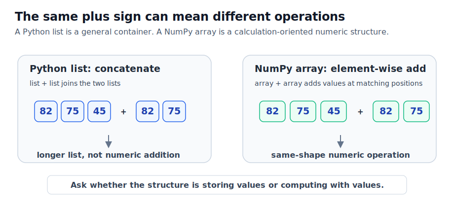
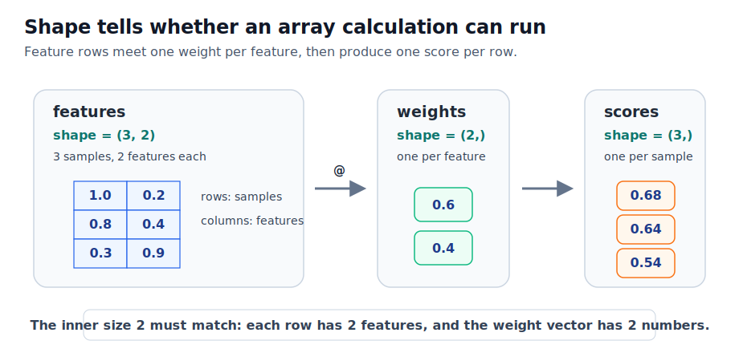

# P2-11.1 NumPy 배열(array)로 벡터와 행렬 만들기

P2-3에서는 스칼라(scalar), 벡터(vector), 행렬(matrix)을 수학 기호와 작은 코드로 확인했습니다. P2-8에서는 Python의 리스트(list)와 딕셔너리(dictionary)를 봤고, P2-9에서는 배열(array), 표(table), 트리(tree), 그래프(graph)를 서로 다른 데이터 구조 관점으로 구분했습니다. P2-10에서는 노트북(notebook)을 실행 가능한 학습 기록으로 정리하는 방법을 봤습니다.

이제 NumPy를 다시 봅니다. NumPy는 Numerical Python에서 온 이름입니다. Python에서 숫자 배열(array)을 만들고, 벡터와 행렬 계산을 빠르고 일관된 문법으로 실행하기 위해 널리 쓰이는 오픈소스 라이브러리입니다.

이번 장은 “NumPy 문법을 많이 외우는 장”이 아닙니다. AI 실습에서 벡터, 행렬, 데이터 묶음이 코드에서 어떤 모양으로 나타나는지 읽기 위한 장입니다.

AI를 공부하다 보면 데이터가 금방 숫자 배열로 바뀝니다. 문장은 토큰 ID(token ID)의 배열이 되고, 이미지는 픽셀(pixel) 배열이 되며, 표 데이터는 특징(feature) 행렬이 되고, 임베딩(embedding)은 벡터가 됩니다. 이 숫자 묶음을 Python 리스트만으로 다룰 수도 있지만, 여러 값을 같은 방식으로 더하고 곱하고 평균을 내고 행렬 곱을 하려면 NumPy 배열이 훨씬 자연스럽습니다.

## 이 절의 범위

이 절은 NumPy 배열(array)을 만들고, 모양(shape), 차원 수(ndim), 데이터 타입(dtype)을 확인하는 법을 다룹니다. 벡터와 행렬을 만들고, 작은 가중합(weighted sum)을 계산하는 예제까지 봅니다.

여기서는 다음 질문에 답합니다.

- Python 리스트(list)와 NumPy 배열(array)은 왜 다르게 쓰이는가?
- NumPy 배열로 벡터(vector)와 행렬(matrix)을 어떻게 만드는가?
- `shape`, `ndim`, `dtype`은 무엇을 알려 주는가?
- 벡터와 행렬을 만들 때 왜 숫자의 모양을 먼저 확인해야 하는가?
- AI 실습에서 입력 데이터와 가중치(weight)가 배열로 보이는 이유는 무엇인가?

이 절에서는 브로드캐스팅(broadcasting), 고급 인덱싱(advanced indexing), 성능 최적화, 메모리 배치, GPU 계산, 선형대수 알고리즘 내부 구현은 다루지 않습니다. 축(axis)과 슬라이싱(slicing)은 P2-11.2에서 더 자세히 다룹니다.

## 이 절의 목표

- NumPy 배열(array)을 Python 리스트와 구분해 설명할 수 있습니다.
- 1차원 배열을 벡터(vector), 2차원 배열을 행렬(matrix)로 읽을 수 있습니다.
- `.shape`, `.ndim`, `.dtype`을 확인해 배열의 모양과 성격을 설명할 수 있습니다.
- 같은 숫자 묶음이라도 리스트와 배열이 계산에서 다르게 쓰임을 설명할 수 있습니다.
- 입력 행렬과 가중치 벡터를 곱해 작은 예측 점수를 만드는 흐름을 읽을 수 있습니다.

## NumPy는 숫자 배열 계산을 위한 도구다

NumPy 공식 문서는 NumPy를 과학과 공학에서 널리 쓰이는 오픈소스 Python 라이브러리로 소개합니다. 또한 NumPy가 다차원 배열 자료구조인 `ndarray`와 그 배열에 대해 효율적으로 동작하는 함수들을 제공한다고 설명합니다.

입문 단계에서는 이렇게 이해하면 충분합니다.

> NumPy 배열은 숫자들이 정해진 모양(shape)으로 놓인 계산용 묶음입니다.

Python 리스트도 값을 묶을 수 있습니다.

```python
scores = [82, 75, 45]
```

하지만 리스트는 범용적인 값 묶음입니다. 숫자만 담을 수도 있고, 문자열이나 객체를 섞을 수도 있습니다. NumPy 공식 문서도 Python 리스트를 훌륭한 범용 컨테이너로 설명하면서, 데이터가 같은 타입이고 양이 많으며 공통 계산을 수행해야 할 때 NumPy가 적합하다고 설명합니다.

반면 NumPy 배열은 같은 종류의 숫자를 정해진 모양으로 놓고 계산하기 위한 구조에 가깝습니다.

```python
import numpy as np

scores = np.array([82, 75, 45])
```

이 차이는 AI 실습에서 중요합니다. 모델 입력(input), 특징(feature), 가중치(weight), 임베딩(embedding), 이미지 픽셀(pixel)은 대개 숫자 배열로 계산됩니다.

## 왜 AI 학습에서 NumPy를 먼저 만나는가

AI 모델의 내부 계산을 처음부터 모두 직접 구현할 필요는 없습니다. 실제 딥러닝 프레임워크는 PyTorch, TensorFlow, JAX 같은 도구를 사용할 수 있습니다. 하지만 그 도구들도 결국 숫자 배열, shape, 축(axis), 행렬 곱, 위치별 연산 같은 감각 위에 서 있습니다.

NumPy를 먼저 보는 이유는 다음과 같습니다.

| 이유 | 학습에서 얻는 것 |
| --- | --- |
| 배열의 모양을 직접 볼 수 있다 | `shape`으로 입력과 출력 구조를 확인한다 |
| 벡터와 행렬 계산을 작게 재현할 수 있다 | 수식이 코드에서 어떻게 실행되는지 본다 |
| Python 리스트와 계산용 배열의 차이를 볼 수 있다 | 데이터 구조와 계산 구조를 구분한다 |
| 머신러닝 예제가 자주 NumPy 배열을 사용한다 | 공식 예제와 튜토리얼을 읽기 쉬워진다 |
| pandas, scikit-learn, 시각화 도구와 연결된다 | 이후 데이터 처리 도구로 넘어가기 쉽다 |

따라서 NumPy는 “AI 자체”가 아닙니다. 그러나 AI 계산을 읽기 위한 기초 언어에 가깝습니다. 이 절에서는 NumPy를 깊게 배우기보다, 모델 계산을 읽기 위한 최소 감각을 만듭니다.

## 리스트와 배열은 비슷해 보이지만 목적이 다르다

Python 리스트와 NumPy 배열은 겉으로는 비슷해 보입니다.

```python
python_scores = [82, 75, 45]
numpy_scores = np.array([82, 75, 45])
```

하지만 같은 연산을 해 보면 차이가 드러납니다.

```python
print(python_scores + python_scores)
print(numpy_scores + numpy_scores)
```

리스트에서 `+`는 두 목록을 이어 붙입니다.

```text
[82, 75, 45, 82, 75, 45]
```

NumPy 배열에서 `+`는 같은 위치의 숫자를 더합니다.

```text
[164 150  90]
```

이 차이를 기억해야 합니다.

| 구조 | 주요 목적 | `+`의 대표적 의미 |
| --- | --- | --- |
| Python 리스트(list) | 여러 값을 순서대로 담는 범용 컨테이너 | 리스트 연결 |
| NumPy 배열(array) | 숫자 묶음을 같은 모양으로 계산 | 위치별 덧셈 |

NumPy 배열은 “자료를 담는 구조”이면서 동시에 “계산을 수행하는 구조”입니다.

아래 도식은 같은 `+` 기호가 리스트와 NumPy 배열에서 다르게 읽히는 상황을 보여 줍니다.



이 차이는 처음에는 사소해 보이지만, AI 코드에서는 중요합니다. 숫자 묶음을 저장하고 싶은 것인지, 숫자 묶음 전체에 같은 계산을 적용하고 싶은 것인지가 달라지기 때문입니다.

## 벡터 만들기

벡터(vector)는 숫자가 한 줄로 놓인 구조로 볼 수 있습니다.

```python
import numpy as np

embedding = np.array([0.12, -0.03, 0.44, 0.18])

print(embedding)
print(embedding.shape)
print(embedding.ndim)
print(embedding.dtype)
```

예상 출력은 다음과 비슷합니다.

```text
[ 0.12 -0.03  0.44  0.18]
(4,)
1
float64
```

여기서 각 정보는 다음을 뜻합니다.

| 표현 | 뜻 | 이 예제의 의미 |
| --- | --- | --- |
| `shape` | 배열의 모양 | 값이 4개인 1차원 배열 |
| `ndim` | 차원 수 | 1차원 |
| `dtype` | 값의 데이터 타입 | 실수형 숫자 |

수학적으로는 다음 벡터와 대응해서 볼 수 있습니다.

\[
\mathbf{x} = [0.12,\ -0.03,\ 0.44,\ 0.18]
\]

입문 단계에서는 벡터를 “순서가 있는 숫자 묶음”으로 읽어도 됩니다. 다만 NumPy에서는 그 숫자 묶음이 계산 가능한 배열이라는 점이 중요합니다.

## 행렬 만들기

행렬(matrix)은 행(row)과 열(column)이 있는 2차원 배열로 볼 수 있습니다.

```python
scores = np.array([
    [82, 75, 45],
    [90, 61, 70],
])

print(scores)
print(scores.shape)
print(scores.ndim)
print(scores.dtype)
```

예상 출력은 다음과 비슷합니다.

```text
[[82 75 45]
 [90 61 70]]
(2, 3)
2
int64
```

`(2, 3)`은 2행 3열이라는 뜻입니다.

\[
S =
\begin{bmatrix}
82 & 75 & 45 \\
90 & 61 & 70
\end{bmatrix}
\]

이때 “2행 3열”이라는 말은 단순한 모양 설명이 아닙니다. 어떤 축(axis)이 무엇을 의미하는지 정해야 합니다.

예를 들어 이 행렬을 다음처럼 읽을 수 있습니다.

| 축 | 해석 |
| --- | --- |
| 행(row) | 학생 또는 샘플(sample) |
| 열(column) | 과목 또는 특징(feature) |

AI 실습에서는 보통 행을 샘플(sample), 열을 특징(feature)으로 읽는 경우가 많습니다. 하지만 항상 그런 것은 아닙니다. 그래서 배열을 만들면 먼저 `shape`을 확인하고, 각 축이 무엇을 뜻하는지 적어야 합니다.

## shape은 계산의 문법이다

NumPy 코드에서 `shape`은 단순한 부가 정보가 아닙니다. 어떤 계산이 가능한지 판단하는 기본 문법입니다.

다음 배열을 봅니다.

```python
features = np.array([
    [1.0, 0.2],
    [0.8, 0.4],
    [0.3, 0.9],
])

weights = np.array([0.6, 0.4])

print(features.shape)
print(weights.shape)
```

출력은 다음과 같습니다.

```text
(3, 2)
(2,)
```

이 모양은 다음처럼 읽을 수 있습니다.

| 배열 | shape | 의미 |
| --- | --- | --- |
| `features` | `(3, 2)` | 샘플 3개, 특징 2개 |
| `weights` | `(2,)` | 특징 2개에 곱할 가중치 |

이제 행렬 곱 연산자 `@`를 사용해 각 샘플의 점수를 계산할 수 있습니다.

```python
scores = features @ weights
print(scores)
print(scores.shape)
```

출력은 다음과 비슷합니다.

```text
[0.68 0.64 0.54]
(3,)
```

이 계산은 각 샘플의 두 특징에 가중치를 곱해 하나의 점수로 만든 것입니다.

\[
\begin{bmatrix}
1.0 & 0.2 \\
0.8 & 0.4 \\
0.3 & 0.9
\end{bmatrix}
\begin{bmatrix}
0.6 \\
0.4
\end{bmatrix}
=
\begin{bmatrix}
0.68 \\
0.64 \\
0.54
\end{bmatrix}
\]

여기서 중요한 것은 공식 암기가 아닙니다. `features`의 열 개수와 `weights`의 길이가 맞아야 계산이 된다는 점입니다.

아래 도식은 같은 계산을 shape 관점으로 다시 정리한 것입니다.



왼쪽의 `features`는 샘플 3개와 특징 2개를 가진 행렬입니다. 가운데의 `weights`는 특징 2개에 대응하는 가중치 벡터입니다. 두 배열의 안쪽 크기 2가 맞기 때문에 각 샘플마다 하나의 점수(score)가 만들어집니다.

## 배열은 작은 모델 계산의 모양을 보여 준다

위 예제는 아주 작은 모델 계산처럼 볼 수 있습니다.

현실의 머신러닝 모델은 훨씬 복잡하지만, 기본 감각은 비슷합니다.

> 여러 샘플의 특징을 숫자 배열로 놓는다.
> 가중치 배열을 준비한다.
> 배열 계산으로 출력값을 만든다.

이 구조는 Part 3의 머신러닝, Part 4의 딥러닝에서 계속 반복됩니다. 그래서 NumPy 배열을 배우는 목적은 “라이브러리 사용법”을 넘어섭니다. 모델 계산을 읽는 눈을 만드는 것입니다.

## 배열을 만들 때 확인할 세 가지

NumPy 배열을 만들면 먼저 세 가지를 확인합니다.

```python
print(array.shape)
print(array.ndim)
print(array.dtype)
```

각각의 질문은 다음과 연결됩니다.

| 확인 | 질문 | 왜 중요한가 |
| --- | --- | --- |
| `shape` | 어떤 모양인가? | 계산 가능한 모양인지 확인한다 |
| `ndim` | 몇 차원인가? | 벡터, 행렬, 더 높은 차원을 구분한다 |
| `dtype` | 어떤 타입인가? | 정수, 실수, 문자열 혼동을 줄인다 |

입문 단계에서 오류가 나면 먼저 값을 하나하나 보려고 하기보다 `shape`을 확인하는 습관이 좋습니다. AI 코드에서 많은 오류는 값의 크기보다 배열의 모양이 맞지 않아 발생합니다.

## 예제 코드 파일

이 절의 예제 코드는 다음 파일로도 확인할 수 있습니다.

- [p2_11_1_numpy_arrays.py](../../../assets/part-02/chapter-11/p2_11_1_numpy_arrays.py)

Colab에서는 코드 내용을 셀에 붙여 넣어 실행할 수 있습니다. 로컬 PC에서는 레포지토리 루트에서 다음처럼 실행할 수 있습니다.

```bash
python docs/assets/part-02/chapter-11/p2_11_1_numpy_arrays.py
```

이 명령은 벡터, 행렬, 특징 행렬, 가중치 벡터의 `shape`, `ndim`, `dtype`을 출력하고, 작은 가중합 계산을 보여 줍니다.

출력에는 Python 리스트의 `+`와 NumPy 배열의 `+`가 어떻게 다른지도 포함되어 있습니다. 같은 기호라도 자료구조가 달라지면 의미가 달라질 수 있다는 점을 직접 확인하기 위한 예제입니다.

## 이 절에서 기억할 관점

NumPy 배열은 숫자를 정해진 모양으로 놓고 계산하기 위한 구조입니다.

Python 리스트와 NumPy 배열은 비슷해 보이지만, 계산의 의미가 다를 수 있습니다.

벡터는 1차원 배열로, 행렬은 2차원 배열로 읽을 수 있습니다.

`shape`은 배열 계산의 문법입니다.

AI 실습에서는 입력, 특징, 가중치, 출력이 모두 배열의 모양으로 나타날 수 있습니다.

## 체크리스트

- Python 리스트와 NumPy 배열의 목적 차이를 설명할 수 있다.
- `np.array()`로 벡터와 행렬을 만들 수 있다.
- `.shape`, `.ndim`, `.dtype`이 무엇을 알려 주는지 설명할 수 있다.
- 1차원 배열과 2차원 배열을 구분할 수 있다.
- `(샘플 수, 특징 수)` 형태의 행렬을 읽을 수 있다.
- `features @ weights` 같은 작은 계산의 입력과 출력 shape을 설명할 수 있다.

## 출처와 참고 자료

- NumPy Developers, [NumPy: the absolute basics for beginners](https://numpy.org/doc/stable/user/absolute_beginners.html){: target="_blank" rel="noopener noreferrer" }, 확인 날짜: 2026-06-25.
- NumPy Developers, [The N-dimensional array](https://numpy.org/doc/stable/reference/arrays.ndarray.html){: target="_blank" rel="noopener noreferrer" }, 확인 날짜: 2026-06-25.
- NumPy Developers, [Array creation](https://numpy.org/doc/stable/user/basics.creation.html){: target="_blank" rel="noopener noreferrer" }, 확인 날짜: 2026-06-25.
