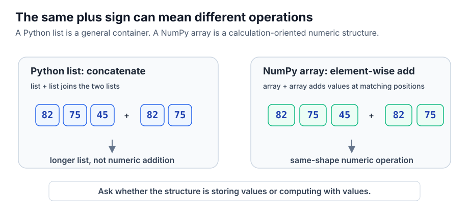
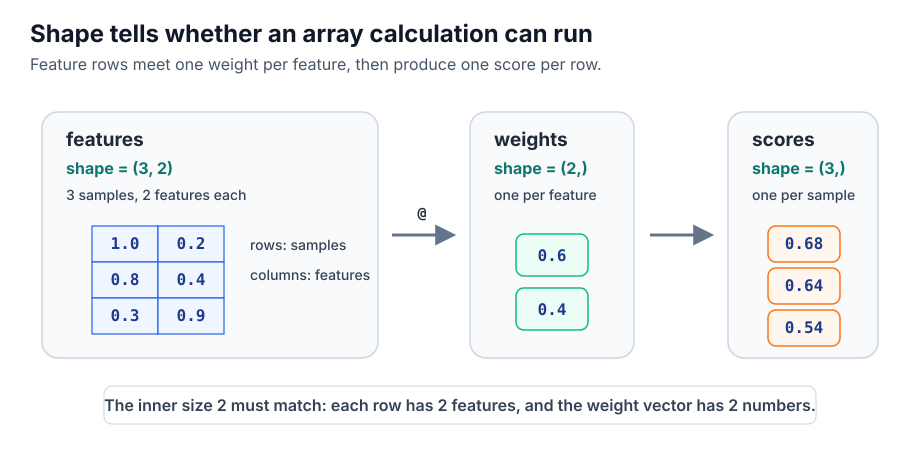

# P2-11.1 NumPy 배열(array)로 벡터와 행렬 만들기

P2-3에서는 스칼라(scalar), 벡터(vector), 행렬(matrix)을 수학 기호와 작은 코드로 확인했습니다. P2-8에서는 Python의 리스트(list)와 딕셔너리(dictionary)를 봤고, P2-9에서는 배열(array), 표(table), 트리(tree), 그래프(graph)를 서로 다른 데이터 구조 관점으로 구분했습니다. P2-10에서는 노트북(notebook)을 실행 가능한 학습 기록으로 정리하는 방법을 봤습니다.

이제 NumPy를 다시 봅니다. NumPy는 Numerical Python에서 온 이름입니다. Python에서 숫자 배열(array)을 만들고, 벡터와 행렬 계산을 빠르고 일관된 문법으로 실행하기 위해 널리 쓰이는 오픈소스 라이브러리입니다.

이번 장은 “NumPy 문법을 많이 외우는 장”이 아닙니다. AI 실습에서 벡터, 행렬, 데이터 묶음이 코드에서 어떤 모양으로 나타나는지 읽기 위한 장입니다.

AI를 공부하다 보면 데이터가 금방 숫자 배열로 바뀝니다. 문장은 토큰 ID(token ID)의 배열이 되고, 이미지는 픽셀(pixel) 배열이 되며, 표 데이터는 특징(feature) 행렬이 되고, 임베딩(embedding)은 벡터가 됩니다. 이 숫자 묶음을 Python 리스트만으로 다룰 수도 있지만, 여러 값을 같은 방식으로 더하고 곱하고 평균을 내고 행렬 곱을 하려면 NumPy 배열이 훨씬 자연스럽습니다.

지금 읽는 층위는 `계산 가능한 숫자 모양 층위`입니다. 앞 장의 Python 문법과 자료구조가 `무엇을 어떤 문장으로 적을까`를 다뤘다면, 여기서는 그 값을 실제 계산에 쓸 수 있는 벡터와 행렬 모양으로 어떻게 다룰지 읽습니다. 바로 다음 장들에서는 이 숫자 모양을 표로 읽고, 그래프로 확인하고, 마지막에는 기록으로 남기는 쪽으로 질문이 다시 이동합니다.

처음 읽을 때는 모든 NumPy 문법을 익히기보다 `이 숫자 묶음이 계산 가능한 배열 모양인가`, `shape와 차원을 먼저 확인했는가`, `바로 다음 장에서 이 배열을 어떤 표와 그래프로 다시 읽을 것인가`라는 세 질문만 먼저 붙잡으면 충분합니다.

| 지금 이 절에서 잡을 것 | 바로 다음에 이어질 질문 | 이후 다시 쓰이는 위치 |
| --- | --- | --- |
| NumPy가 계산 가능한 숫자 모양을 만드는 도구라는 점 | P2-12에서 그 배열이 어떤 행과 열의 표로 읽히는지로 이어집니다. | 이후 모든 머신러닝 입력 행렬, 임베딩, 예측 계산에서 반복됩니다. |
| `shape`, `ndim`, `dtype`을 먼저 확인해야 한다는 점 | P2-11.2와 P2-12에서 축과 표 구조를 헷갈리지 않기 위한 기준으로 이어집니다. | 이후 전처리, 모델 입력 점검, 오류 진단에서 계속 중요합니다. |
| NumPy가 `계산 -> 표 -> 그래프 -> 기록` 흐름의 첫 단계라는 점 | P2-13과 P2-14에서 무엇을 보고 무엇을 기록으로 남길지로 이어집니다. | Part 3 이후 실험 해석과 결과 재현의 출발점이 됩니다. |

## 이 절의 범위

이 절은 NumPy 배열(array)을 만들고, 모양(shape), 차원 수(ndim), 데이터 타입(dtype)을 확인하는 법을 다룹니다. 벡터와 행렬을 만들고, 작은 가중합(weighted sum)을 계산하는 예제까지 봅니다.

여기서는 다음 질문에 답합니다.

- Python 리스트(list)와 NumPy 배열(array)은 왜 다르게 쓰이는가?
- NumPy 배열로 벡터(vector)와 행렬(matrix)을 어떻게 만드는가?
- `shape`, `ndim`, `dtype`은 무엇을 알려 주는가?
- 벡터와 행렬을 만들 때 왜 숫자의 모양을 먼저 확인해야 하는가?
- AI 실습에서 입력 데이터와 가중치(weight)가 배열로 보이는 이유는 무엇인가?

이 절에서는 브로드캐스팅(broadcasting), 고급 인덱싱(advanced indexing), 성능 최적화, 메모리 배치, GPU 계산, 선형대수 알고리즘 내부 구현은 다루지 않습니다. 축(axis)과 슬라이싱(slicing)은 P2-11.2에서 더 자세히 다루고, 고급 인덱싱과 shape 변화는 P2-11.4 보충학습에서 다시 정리합니다.

## 이 절의 목표

- NumPy 배열(array)을 Python 리스트와 구분해 설명할 수 있습니다.
- 1차원 배열을 벡터(vector), 2차원 배열을 행렬(matrix)로 읽을 수 있습니다.
- `.shape`, `.ndim`, `.dtype`을 확인해 배열의 모양과 성격을 설명할 수 있습니다.
- 같은 숫자 묶음이라도 리스트와 배열이 계산에서 다르게 쓰임을 설명할 수 있습니다.
- 입력 행렬과 가중치 벡터를 곱해 작은 예측 점수를 만드는 흐름을 읽을 수 있습니다.

## 먼저 볼 세 가지

| 질문 | 먼저 잡을 관점 |
| --- | --- |
| NumPy 배열은 무엇인가? | 숫자를 일정한 모양으로 담아 계산하기 위한 구조입니다. |
| 리스트와 왜 다르게 보아야 하나? | 둘 다 값을 담지만, 배열은 수치 계산을 더 직접 겨냥합니다. |
| 무엇을 먼저 확인해야 하나? | 값보다 먼저 `shape`와 차원을 확인해야 합니다. |

## NumPy는 숫자 배열 계산을 위한 도구다

NumPy 공식 문서는 NumPy를 과학과 공학에서 널리 쓰이는 오픈소스 Python 라이브러리로 소개합니다. 또한 NumPy가 다차원 배열 자료구조인 `ndarray`와 그 배열에 대해 효율적으로 동작하는 함수들을 제공한다고 설명합니다.

입문 단계에서는 이렇게 이해하면 충분합니다.

> NumPy 배열은 숫자들이 정해진 모양(shape)으로 놓인 계산용 묶음입니다.

Python 리스트도 값을 묶을 수 있습니다.

문제 상황: NumPy를 쓰기 전에도 숫자 묶음을 Python 리스트로 저장할 수 있다는 점을 먼저 확인합니다.
입력(input): 점수 세 개를 담은 Python 리스트입니다.
기대 출력(output): 출력은 없지만 숫자 묶음의 가장 단순한 형태를 보여 줍니다.
확인할 개념: 리스트는 값을 담는 범용 컨테이너이고, 아직 계산용 배열은 아니라는 점을 봅니다.

```python
scores = [82, 75, 45]
```

하지만 리스트는 범용적인 값 묶음입니다. 숫자만 담을 수도 있고, 문자열이나 객체를 섞을 수도 있습니다. NumPy 공식 문서도 Python 리스트를 훌륭한 범용 컨테이너로 설명하면서, 데이터가 같은 타입이고 양이 많으며 공통 계산을 수행해야 할 때 NumPy가 적합하다고 설명합니다.

반면 NumPy 배열은 같은 종류의 숫자를 정해진 모양으로 놓고 계산하기 위한 구조에 가깝습니다.

문제 상황: 같은 숫자 묶음을 NumPy 배열로 바꾸면 계산용 구조가 어떻게 보이는지 확인합니다.
입력(input): 점수 세 개를 가진 1차원 배열입니다.
기대 출력(output): 출력은 없지만 `np.array(...)`로 만든 계산용 배열이 준비됩니다.
확인할 개념: NumPy 배열은 같은 종류의 숫자를 일정한 모양으로 다루기 위한 구조라는 점을 봅니다.

```python
import numpy as np

scores = np.array([82, 75, 45])
```

이 차이는 AI 실습에서 중요합니다. 모델 입력(input), 특징(feature), 가중치(weight), 임베딩(embedding), 이미지 픽셀(pixel)은 대개 숫자 배열로 계산됩니다.

## 왜 AI 학습에서 NumPy를 먼저 만나는가

AI 모델의 내부 계산을 처음부터 모두 직접 구현할 필요는 없습니다. 실제 딥러닝 프레임워크는 PyTorch, TensorFlow, JAX 같은 도구를 사용할 수 있습니다. 하지만 그 도구들도 결국 숫자 배열, shape, 축(axis), 행렬 곱, 위치별 연산 같은 감각 위에 서 있습니다.

NumPy를 먼저 보는 이유는 다음과 같습니다.

| 이유 | 학습에서 얻는 것 |
| --- | --- |
| 배열의 모양을 직접 볼 수 있다 | `shape`으로 입력과 출력 구조를 확인한다 |
| 벡터와 행렬 계산을 작게 재현할 수 있다 | 수식이 코드에서 어떻게 실행되는지 본다 |
| Python 리스트와 계산용 배열의 차이를 볼 수 있다 | 데이터 구조와 계산 구조를 구분한다 |
| 머신러닝 예제가 자주 NumPy 배열을 사용한다 | 공식 예제와 튜토리얼을 읽기 쉬워진다 |
| pandas, scikit-learn, 시각화 도구와 연결된다 | 이후 데이터 처리 도구로 넘어가기 쉽다 |

따라서 NumPy는 “AI 자체”가 아닙니다. 그러나 AI 계산을 읽기 위한 기초 언어에 가깝습니다. 이 절에서는 NumPy를 깊게 배우기보다, 모델 계산을 읽기 위한 최소 감각을 만듭니다.

지금부터 Chapter 11~14를 읽을 때는 다음 한 흐름을 먼저 잡는 편이 좋습니다.

| 읽기 흐름 | 지금 확인하는 역할 |
| --- | --- |
| NumPy | 계산 가능한 숫자 모양을 만든다 |
| Pandas | 표에서 입력과 정답 후보를 고른다 |
| Matplotlib | 그 계산과 데이터의 모양을 눈으로 확인한다 |
| Git | 그 확인 과정과 변경 이유를 기록으로 남긴다 |

이 표의 핵심은 NumPy, Pandas, Matplotlib, Git이 서로 다른 도구 이름이면서도 `데이터를 읽고 확인하고 남기는 준비`라는 한 흐름 안에 있다는 점입니다. 지금 Chapter 11은 그중에서도 가장 앞단인 `계산 가능한 모양 만들기`를 맡습니다.

이 흐름을 한 번 더 짧게 눌러 두면 다음과 같습니다.

| 바로 지금 장에서 끝내야 하는 것 | 바로 뒤 장에서 이어질 것 | 마지막에 기록으로 남길 것 |
| --- | --- | --- |
| 벡터, 행렬, shape처럼 계산 가능한 숫자 모양을 만든다 | 그 모양을 표와 그래프로 읽고 해석한다 | 어떤 계산과 해석을 했는지 Git으로 다시 설명할 수 있게 남긴다 |

## 리스트와 배열은 비슷해 보이지만 목적이 다르다

Python 리스트와 NumPy 배열은 겉으로는 비슷해 보입니다.

문제 상황: 같은 숫자 묶음을 리스트와 배열 두 방식으로 나란히 준비해 비교하고 싶습니다.
입력(input): 같은 점수 데이터를 Python 리스트와 NumPy 배열로 만든 변수 두 개입니다.
기대 출력(output): 출력은 없지만 이후 같은 연산을 비교할 준비가 됩니다.
확인할 개념: 겉모양이 비슷해 보여도 리스트와 배열은 계산 의미가 달라질 수 있다는 점을 봅니다.

```python
python_scores = [82, 75, 45]
numpy_scores = np.array([82, 75, 45])
```

하지만 같은 연산을 해 보면 차이가 드러납니다.

문제 상황: 같은 `+` 연산자가 리스트와 배열에서 어떻게 다르게 읽히는지 직접 비교합니다.
입력(input): 앞에서 만든 `python_scores`, `numpy_scores`입니다.
기대 출력(output): 리스트는 이어 붙여지고, 배열은 위치별 덧셈 결과가 출력됩니다.
확인할 개념: NumPy 배열은 저장 구조이면서 동시에 계산 구조라는 점을 확인합니다.

```python
print(python_scores + python_scores)
print(numpy_scores + numpy_scores)
```

리스트에서 `+`는 두 목록을 이어 붙입니다.

```text
[82, 75, 45, 82, 75, 45]
```

NumPy 배열에서 `+`는 같은 위치의 숫자를 더합니다.

```text
[164 150  90]
```

이 차이를 기억해야 합니다.

| 구조 | 주요 목적 | `+`의 대표적 의미 |
| --- | --- | --- |
| Python 리스트(list) | 여러 값을 순서대로 담는 범용 컨테이너 | 리스트 연결 |
| NumPy 배열(array) | 숫자 묶음을 같은 모양으로 계산 | 위치별 덧셈 |

NumPy 배열은 “자료를 담는 구조”이면서 동시에 “계산을 수행하는 구조”입니다.

아래 도식은 같은 `+` 기호가 리스트와 NumPy 배열에서 다르게 읽히는 상황을 보여 줍니다.



이 차이는 처음에는 사소해 보이지만, AI 코드에서는 중요합니다. 숫자 묶음을 저장하고 싶은 것인지, 숫자 묶음 전체에 같은 계산을 적용하고 싶은 것인지가 달라지기 때문입니다.

## 벡터 만들기

벡터(vector)는 숫자가 한 줄로 놓인 구조로 볼 수 있습니다.

문제 상황: 임베딩처럼 보이는 숫자 묶음을 1차원 NumPy 배열로 만들고 기본 속성을 확인합니다.
입력(input): 실수 네 개를 담은 배열 `embedding`입니다.
기대 출력(output): 배열 값, `shape`, `ndim`, `dtype`이 순서대로 출력됩니다.
확인할 개념: 1차원 배열을 벡터로 읽고, 모양과 차원 수를 함께 확인하는 습관을 봅니다.

```python
import numpy as np

embedding = np.array([0.12, -0.03, 0.44, 0.18])

print(embedding)
print(embedding.shape)
print(embedding.ndim)
print(embedding.dtype)
```

예상 출력은 다음과 비슷합니다.

```text
[ 0.12 -0.03  0.44  0.18]
(4,)
1
float64
```

여기서 각 정보는 다음을 뜻합니다.

| 표현 | 뜻 | 이 예제의 의미 |
| --- | --- | --- |
| `shape` | 배열의 모양 | 값이 4개인 1차원 배열 |
| `ndim` | 차원 수 | 1차원 |
| `dtype` | 값의 데이터 타입 | 실수형 숫자 |

수학적으로는 다음 벡터와 대응해서 볼 수 있습니다.

\[
\mathbf{x} = [0.12,\ -0.03,\ 0.44,\ 0.18]
\]

입문 단계에서는 벡터를 “순서가 있는 숫자 묶음”으로 읽어도 됩니다. 다만 NumPy에서는 그 숫자 묶음이 계산 가능한 배열이라는 점이 중요합니다.

## 행렬 만들기

행렬(matrix)은 행(row)과 열(column)이 있는 2차원 배열로 볼 수 있습니다.

문제 상황: 여러 학생 점수표처럼 보이는 숫자 묶음을 2차원 배열로 만들고 속성을 확인합니다.
입력(input): 2행 3열 정수 배열 `scores`입니다.
기대 출력(output): 행렬 값, `shape`, `ndim`, `dtype`이 순서대로 출력됩니다.
확인할 개념: 2차원 배열을 행렬로 읽고 행과 열 개수를 `shape`로 확인하는 방법을 봅니다.

```python
scores = np.array([
    [82, 75, 45],
    [90, 61, 70],
])

print(scores)
print(scores.shape)
print(scores.ndim)
print(scores.dtype)
```

예상 출력은 다음과 비슷합니다.

```text
[[82 75 45]
 [90 61 70]]
(2, 3)
2
int64
```

`(2, 3)`은 2행 3열이라는 뜻입니다.

\[
S =
\begin{bmatrix}
82 & 75 & 45 \\
90 & 61 & 70
\end{bmatrix}
\]

이때 “2행 3열”이라는 말은 단순한 모양 설명이 아닙니다. 어떤 축(axis)이 무엇을 의미하는지 정해야 합니다.

예를 들어 이 행렬을 다음처럼 읽을 수 있습니다.

| 축 | 해석 |
| --- | --- |
| 행(row) | 학생 또는 샘플(sample) |
| 열(column) | 과목 또는 특징(feature) |

AI 실습에서는 보통 행을 샘플(sample), 열을 특징(feature)으로 읽는 경우가 많습니다. 하지만 항상 그런 것은 아닙니다. 그래서 배열을 만들면 먼저 `shape`을 확인하고, 각 축이 무엇을 뜻하는지 적어야 합니다.

## shape은 계산의 문법이다

NumPy 코드에서 `shape`은 단순한 부가 정보가 아닙니다. 어떤 계산이 가능한지 판단하는 기본 문법입니다.

다음 배열을 봅니다.

문제 상황: 특징 행렬과 가중치 벡터가 서로 계산 가능한 모양인지 먼저 확인합니다.
입력(input): `features`는 `(3, 2)` 모양의 행렬이고, `weights`는 길이 2 벡터입니다.
기대 출력(output): 두 배열의 `shape`가 출력됩니다.
확인할 개념: 계산 전에 배열 값보다 먼저 모양이 맞는지 확인해야 한다는 점을 봅니다.

```python
features = np.array([
    [1.0, 0.2],
    [0.8, 0.4],
    [0.3, 0.9],
])

weights = np.array([0.6, 0.4])

print(features.shape)
print(weights.shape)
```

출력은 다음과 같습니다.

```text
(3, 2)
(2,)
```

이 모양은 다음처럼 읽을 수 있습니다.

| 배열 | shape | 의미 |
| --- | --- | --- |
| `features` | `(3, 2)` | 샘플 3개, 특징 2개 |
| `weights` | `(2,)` | 특징 2개에 곱할 가중치 |

이제 행렬 곱 연산자 `@`를 사용해 각 샘플의 점수를 계산할 수 있습니다.

문제 상황: 각 샘플의 두 특징에 가중치를 곱해 샘플별 점수를 계산합니다.
입력(input): 앞의 `features` 행렬과 `weights` 벡터입니다.
기대 출력(output): 샘플별 점수 배열과 결과 `shape`가 출력됩니다.
확인할 개념: 안쪽 차원이 맞으면 특징 행렬과 가중치 벡터로 샘플별 점수를 만들 수 있다는 점을 확인합니다.

```python
scores = features @ weights
print(scores)
print(scores.shape)
```

출력은 다음과 비슷합니다.

```text
[0.68 0.64 0.54]
(3,)
```

이 계산은 각 샘플의 두 특징에 가중치를 곱해 하나의 점수로 만든 것입니다.

\[
\begin{bmatrix}
1.0 & 0.2 \\
0.8 & 0.4 \\
0.3 & 0.9
\end{bmatrix}
\begin{bmatrix}
0.6 \\
0.4
\end{bmatrix}
=
\begin{bmatrix}
0.68 \\
0.64 \\
0.54
\end{bmatrix}
\]

여기서 중요한 것은 공식 암기가 아닙니다. `features`의 열 개수와 `weights`의 길이가 맞아야 계산이 된다는 점입니다.

아래 도식은 같은 계산을 shape 관점으로 다시 정리한 것입니다.



왼쪽의 `features`는 샘플 3개와 특징 2개를 가진 행렬입니다. 가운데의 `weights`는 특징 2개에 대응하는 가중치 벡터입니다. 두 배열의 안쪽 크기 2가 맞기 때문에 각 샘플마다 하나의 점수(score)가 만들어집니다.

## 배열은 작은 모델 계산의 모양을 보여 준다

위 예제는 아주 작은 모델 계산처럼 볼 수 있습니다.

현실의 머신러닝 모델은 훨씬 복잡하지만, 기본 감각은 비슷합니다.

> 여러 샘플의 특징을 숫자 배열로 놓는다.
> 가중치 배열을 준비한다.
> 배열 계산으로 출력값을 만든다.

이 구조는 Part 3의 머신러닝, Part 4의 딥러닝에서 계속 반복됩니다. 그래서 NumPy 배열을 배우는 목적은 “라이브러리 사용법”을 넘어섭니다. 모델 계산을 읽는 눈을 만드는 것입니다.

## 배열을 만들 때 확인할 세 가지

NumPy 배열을 만들면 먼저 세 가지를 확인합니다.

문제 상황: 새로 만든 배열을 만났을 때 가장 먼저 무엇을 출력해 볼지 점검합니다.
입력(input): 임의의 NumPy 배열 변수 `array`입니다.
기대 출력(output): `shape`, `ndim`, `dtype`이 순서대로 출력됩니다.
확인할 개념: 값을 하나하나 보기 전에 배열의 모양, 차원, 타입부터 확인하는 습관을 봅니다.

```python
print(array.shape)
print(array.ndim)
print(array.dtype)
```

각각의 질문은 다음과 연결됩니다.

| 확인 | 질문 | 왜 중요한가 |
| --- | --- | --- |
| `shape` | 어떤 모양인가? | 계산 가능한 모양인지 확인한다 |
| `ndim` | 몇 차원인가? | 벡터, 행렬, 더 높은 차원을 구분한다 |
| `dtype` | 어떤 타입인가? | 정수, 실수, 문자열 혼동을 줄인다 |

입문 단계에서 오류가 나면 먼저 값을 하나하나 보려고 하기보다 `shape`을 확인하는 습관이 좋습니다. AI 코드에서 많은 오류는 값의 크기보다 배열의 모양이 맞지 않아 발생합니다.

## 예제 코드 파일

이 절의 예제 코드는 다음 파일로도 확인할 수 있습니다.

- [p2_11_1_numpy_arrays.py](../../../assets/part-02/chapter-11/p2_11_1_numpy_arrays.py)

Colab에서는 코드 내용을 셀에 붙여 넣어 실행할 수 있습니다. 로컬 PC에서는 레포지토리 루트에서 다음처럼 실행할 수 있습니다.

```bash
python docs/assets/part-02/chapter-11/p2_11_1_numpy_arrays.py
```

이 명령은 벡터, 행렬, 특징 행렬, 가중치 벡터의 `shape`, `ndim`, `dtype`을 출력하고, 작은 가중합 계산을 보여 줍니다.

출력에는 Python 리스트의 `+`와 NumPy 배열의 `+`가 어떻게 다른지도 포함되어 있습니다. 같은 기호라도 자료구조가 달라지면 의미가 달라질 수 있다는 점을 직접 확인하기 위한 예제입니다.

## 사례로 보기

### 사례 1. 학생 점수표가 왜 갑자기 숫자 행렬로 보이기 시작하는가

학습자가 학생별 점수표를 보다가 NumPy 배열 예제를 만나면 `이게 왜 갑자기 행렬이 되지?`라고 느낄 수 있습니다. 사람은 표를 보면 먼저 이름과 과목을 읽지만, 계산 단계에서는 각 학생의 점수 묶음이 하나의 행(row), 각 과목이 하나의 열(column)로 바뀌어 읽히기 때문입니다.

예를 들어 세 과목 점수를 가진 학생 네 명의 표는 NumPy에서는 `(4, 3)` 배열로 보일 수 있습니다. 이때 중요한 것은 숫자를 많이 외우는 일이 아니라, `행 4개는 학생 네 명`, `열 3개는 과목 세 개`라는 대응을 먼저 잡는 일입니다. 그래야 평균, 가중합, 행렬 곱 같은 계산이 무엇을 뜻하는지도 해석할 수 있습니다.

이 사례는 왜 `shape`를 값보다 먼저 확인해야 하는지도 보여 줍니다. 같은 숫자라도 `(4, 3)`으로 읽는지 `(3, 4)`로 읽는지에 따라 각 축의 의미가 달라지고, 뒤의 계산 해석도 달라집니다.

즉 NumPy 입문은 새 문법 암기보다 `현실 데이터를 계산 가능한 모양으로 읽는 연습`에 가깝습니다. 이 감각이 있어야 Part 3 이후의 특징 행렬과 가중치 계산도 덜 낯설어집니다.

## 이 절에서 기억할 관점

NumPy 배열은 숫자를 정해진 모양으로 놓고 계산하기 위한 구조입니다.

Python 리스트와 NumPy 배열은 비슷해 보이지만, 계산의 의미가 다를 수 있습니다.

벡터는 1차원 배열로, 행렬은 2차원 배열로 읽을 수 있습니다.

`shape`은 배열 계산의 문법입니다.

AI 실습에서는 입력, 특징, 가중치, 출력이 모두 배열의 모양으로 나타날 수 있습니다.

이 절을 읽고 나면 아래 흐름이 바로 이어져야 합니다.

| 지금 장의 손잡이 | 바로 다음 장에서 더 보는 것 | 마지막에 기록으로 남길 것 |
| --- | --- | --- |
| 계산 가능한 숫자 모양과 `shape`를 읽는다 | 그 숫자 모양을 표와 그래프로 확인하고 해석한다 | 어떤 배열과 해석을 사용했는지 Git 이력으로 다시 설명할 수 있게 남긴다 |

## 체크리스트

- Python 리스트와 NumPy 배열의 목적 차이를 설명할 수 있다.
- `np.array()`로 벡터와 행렬을 만들 수 있다.
- `.shape`, `.ndim`, `.dtype`이 무엇을 알려 주는지 설명할 수 있다.
- 1차원 배열과 2차원 배열을 구분할 수 있다.
- `(샘플 수, 특징 수)` 형태의 행렬을 읽을 수 있다.
- `features @ weights` 같은 작은 계산의 입력과 출력 shape을 설명할 수 있다.

## 출처와 참고 자료

- NumPy Developers, [NumPy: the absolute basics for beginners](https://numpy.org/doc/stable/user/absolute_beginners.html){: target="_blank" rel="noopener noreferrer" }, 확인 날짜: 2026-06-25.
- NumPy Developers, [The N-dimensional array](https://numpy.org/doc/stable/reference/arrays.ndarray.html){: target="_blank" rel="noopener noreferrer" }, 확인 날짜: 2026-06-25.
- NumPy Developers, [Array creation](https://numpy.org/doc/stable/user/basics.creation.html){: target="_blank" rel="noopener noreferrer" }, 확인 날짜: 2026-06-25.
