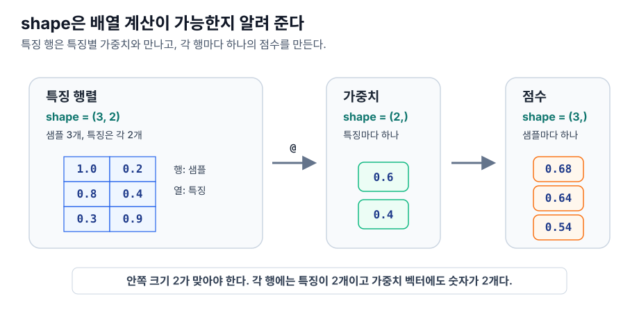

# P2-11.1 NumPy 배열(array)로 벡터와 행렬 만들기

> Section ID: `P2-11.1`
> Version: `v2026.09.08`

## 리스트 연결과 배열 덧셈

NumPy는 다차원 배열인 `ndarray`와 배열 연산을 제공하는 Python 라이브러리입니다. 리스트와 배열은 같은 숫자를 담을 수 있지만 연산 규칙은 다릅니다.

점수 `[82, 75, 45]`를 Python 리스트와 NumPy 배열로 각각 준비합니다. 이 코드는 값을 저장하며 출력은 없습니다.

```python
import numpy as np

python_scores = [82, 75, 45]
numpy_scores = np.array([82, 75, 45])
```

하지만 같은 연산을 해 보면 차이가 드러납니다.

앞에서 만든 두 묶음을 각각 자기 자신과 더합니다. 리스트는 항목 여섯 개로 연결되고, 배열은 같은 위치끼리 더해 `[164 150 90]`이 됩니다.

```python
print(python_scores + python_scores)
print(numpy_scores + numpy_scores)
```

리스트에서 `+`는 두 목록을 이어 붙입니다.

```text
[82, 75, 45, 82, 75, 45]
```

NumPy 배열에서 `+`는 같은 위치의 숫자를 더합니다.

```text
[164 150  90]
```

이 차이를 기억해야 합니다.

| 구조 | 주요 목적 | `+`의 대표적 의미 |
| --- | --- | --- |
| Python 리스트(list) | 여러 값을 순서대로 담는 범용 컨테이너 | 리스트 연결 |
| NumPy 배열(array) | 숫자 묶음을 같은 모양으로 계산 | 위치별 덧셈 |

NumPy 배열은 “자료를 담는 구조”이면서 동시에 “계산을 수행하는 구조”입니다.

아래 도식은 같은 `+` 기호가 리스트와 NumPy 배열에서 다르게 읽히는 상황을 보여 줍니다.


이 차이는 사소해 보일 수 있지만, AI 코드에서는 중요합니다. 숫자 묶음을 저장하고 싶은 것인지, 숫자 묶음 전체에 같은 계산을 적용하고 싶은 것인지가 달라지기 때문입니다.

## 벡터 만들기

벡터(vector)는 숫자가 한 줄로 놓인 구조로 볼 수 있습니다.

실수 네 개를 1차원 배열로 만듭니다. 값과 함께 `shape` `(4,)`, 차원 수 `1`, 데이터 타입 `float64`가 출력됩니다.

```python
import numpy as np

embedding = np.array([0.12, -0.03, 0.44, 0.18])

print(embedding)
print(embedding.shape)
print(embedding.ndim)
print(embedding.dtype)
```

예상 출력은 다음과 비슷합니다.

```text
[ 0.12 -0.03  0.44  0.18]
(4,)
1
float64
```

여기서 각 정보는 다음을 뜻합니다.

| 표현 | 뜻 | 이 예제의 의미 |
| --- | --- | --- |
| `shape` | 배열의 모양 | 값이 4개인 1차원 배열 |
| `ndim` | 차원 수 | 1차원 |
| `dtype` | 값의 데이터 타입 | 실수형 숫자 |

수학적으로는 다음 벡터와 대응해서 볼 수 있습니다.

\[
\mathbf{x} = [0.12,\ -0.03,\ 0.44,\ 0.18]
\]

`(4,)`의 쉼표는 길이가 하나인 튜플 표기입니다. 축은 하나이며 그 축에 값이 네 개 있습니다.

## 행렬 만들기

행렬(matrix)은 행(row)과 열(column)이 있는 2차원 배열로 볼 수 있습니다.

두 학생의 세 과목 점수를 2차원 배열로 만듭니다. 출력은 배열 값, `shape` `(2, 3)`, 차원 수 `2`, 정수 타입입니다. 아래처럼 `dtype=np.int64`를 지정하면 타입은 `int64`입니다.

```python
scores = np.array([
    [82, 75, 45],
    [90, 61, 70],
], dtype=np.int64)

print(scores)
print(scores.shape)
print(scores.ndim)
print(scores.dtype)
```

예상 출력은 다음과 비슷합니다.

```text
[[82 75 45]
 [90 61 70]]
(2, 3)
2
int64
```

`(2, 3)`은 2행 3열이라는 뜻입니다.

\[
S =
\begin{bmatrix}
82 & 75 & 45 \\
90 & 61 & 70
\end{bmatrix}
\]

이때 “2행 3열”이라는 말은 단순한 모양 설명이 아닙니다. 어떤 축(axis)이 무엇을 의미하는지 정해야 합니다.

예를 들어 이 행렬을 다음처럼 읽을 수 있습니다.

| 축 | 해석 |
| --- | --- |
| 행(row) | 학생 또는 샘플(sample) |
| 열(column) | 과목 또는 특징(feature) |

AI 실습에서는 보통 행을 샘플(sample), 열을 특징(feature)으로 읽는 경우가 많습니다. 하지만 항상 그런 것은 아닙니다. 그래서 배열을 만들면 먼저 `shape`을 확인하고, 각 축이 무엇을 뜻하는지 적어야 합니다.

## 행렬 곱의 모양

NumPy 코드에서 `shape`은 단순한 부가 정보가 아닙니다. 어떤 계산이 가능한지 판단하는 기본 문법입니다.

다음 배열을 봅니다.

샘플 세 개에 특징이 두 개씩 있습니다. 특징 행렬과 가중치 벡터의 모양을 출력하면 `(3, 2)`와 `(2,)`입니다.

```python
features = np.array([
    [1.0, 0.2],
    [0.8, 0.4],
    [0.3, 0.9],
])

weights = np.array([0.6, 0.4])

print(features.shape)
print(weights.shape)
```

출력은 다음과 같습니다.

```text
(3, 2)
(2,)
```

이 모양은 다음처럼 읽을 수 있습니다.

| 배열 | shape | 의미 |
| --- | --- | --- |
| `features` | `(3, 2)` | 샘플 3개, 특징 2개 |
| `weights` | `(2,)` | 특징 2개에 곱할 가중치 |

이제 행렬 곱 연산자 `@`를 사용해 각 샘플의 점수를 계산할 수 있습니다.

앞의 `features`와 `weights`를 행렬 곱하면 샘플별 점수 `[0.68 0.64 0.54]`와 결과 모양 `(3,)`이 출력됩니다.

```python
scores = features @ weights
print(scores)
print(scores.shape)
```

출력은 다음과 비슷합니다.

```text
[0.68 0.64 0.54]
(3,)
```

이 계산은 각 샘플의 두 특징에 가중치를 곱해 하나의 점수로 만든 것입니다.

\[
\begin{bmatrix}
1.0 & 0.2 \\
0.8 & 0.4 \\
0.3 & 0.9
\end{bmatrix}
\begin{bmatrix}
0.6 \\
0.4
\end{bmatrix}
=
\begin{bmatrix}
0.68 \\
0.64 \\
0.54
\end{bmatrix}
\]

첫 샘플의 점수는 1.0 × 0.6 + 0.2 × 0.4 = 0.68입니다. `features`의 열 개수와 `weights`의 길이가 모두 2여야 각 특징에 대응하는 가중치를 곱할 수 있습니다.

아래 도식은 같은 계산을 shape 관점으로 다시 정리한 것입니다.



왼쪽의 `features`는 샘플 3개와 특징 2개를 가진 행렬입니다. 가운데의 `weights`는 특징 2개에 대응하는 가중치 벡터입니다. 두 배열의 안쪽 크기 2가 맞기 때문에 각 샘플마다 하나의 점수(score)가 만들어집니다.

## 배열 속성 확인

NumPy 배열을 만들면 먼저 세 가지를 확인합니다.

앞서 만든 특징 행렬의 `shape`, `ndim`, `dtype`을 확인하면 `(3, 2)`, `2`, `float64`입니다.

```python
print(features.shape)
print(features.ndim)
print(features.dtype)
```

각각의 질문은 다음과 연결됩니다.

| 확인 | 질문 | 왜 중요한가 |
| --- | --- | --- |
| `shape` | 어떤 모양인가? | 계산 가능한 모양인지 확인한다 |
| `ndim` | 몇 차원인가? | 벡터, 행렬, 더 높은 차원을 구분한다 |
| `dtype` | 어떤 타입인가? | 정수, 실수, 문자열 혼동을 줄인다 |

입문 단계에서 오류가 나면 먼저 값을 하나하나 보려고 하기보다 `shape`을 확인하는 습관이 좋습니다. AI 코드에서 많은 오류는 값의 크기보다 배열의 모양이 맞지 않아 발생합니다.

## 예제 코드 파일

이 절의 예제 코드는 다음 파일로도 확인할 수 있습니다.

- [p2_11_1_numpy_arrays.py](../../../assets/part-02/chapter-11/p2_11_1_numpy_arrays.py)

Colab에서는 코드 내용을 셀에 붙여 넣어 실행할 수 있습니다. 로컬 PC에서는 프로젝트 루트에서 다음처럼 실행할 수 있습니다.

```bash
python docs/assets/part-02/chapter-11/p2_11_1_numpy_arrays.py
```

이 명령은 벡터, 행렬, 특징 행렬, 가중치 벡터의 `shape`, `ndim`, `dtype`을 출력하고, 작은 가중합 계산을 보여 줍니다.

출력에는 Python 리스트의 `+`와 NumPy 배열의 `+`가 어떻게 다른지도 포함되어 있습니다. 같은 기호라도 자료구조가 달라지면 의미가 달라질 수 있다는 점을 직접 확인하기 위한 예제입니다.

## 사례: 가중치 순서를 바꾸면

앞의 특징 행렬에서 첫 열과 둘째 열에 곱할 가중치는 각각 0.6, 0.4입니다. 이를 `[0.4, 0.6]`으로 바꾸고 행렬 곱을 다시 실행하면 결과는 `[0.52, 0.56, 0.66]`입니다. 첫 샘플이 가장 높던 순서가 세 번째 샘플이 가장 높은 순서로 바뀝니다.

모양은 여전히 `(3, 2) @ (2,)`여서 계산은 성공합니다. 따라서 모양 확인만으로 각 열과 가중치의 의미가 맞는지까지 검증할 수는 없습니다. 반대로 가중치를 `[0.6, 0.3, 0.1]`로 바꾸면 길이가 3이 되어 행렬 곱에서 `ValueError`가 발생합니다.

| 변경 | 계산 결과 | 확인할 점 |
| --- | --- | --- |
| 가중치 `[0.6, 0.4]` | `[0.68, 0.64, 0.54]` | 두 특징과 가중치의 대응 |
| 가중치 `[0.4, 0.6]` | `[0.52, 0.56, 0.66]` | 모양이 같아도 점수와 순위는 변함 |
| 가중치 `[0.6, 0.3, 0.1]` | 모양 불일치 오류 | 특징 수와 가중치 수가 다름 |

## 체크리스트

- Python 리스트와 NumPy 배열의 목적 차이를 설명할 수 있다.
- `np.array()`로 벡터와 행렬을 만들 수 있다.
- `.shape`, `.ndim`, `.dtype`이 무엇을 알려 주는지 설명할 수 있다.
- 1차원 배열과 2차원 배열을 구분할 수 있다.
- `(샘플 수, 특징 수)` 형태의 행렬을 읽을 수 있다.
- `features @ weights` 같은 작은 계산의 입력과 출력 shape을 설명할 수 있다.
- NumPy 배열을 숫자를 정해진 모양으로 놓고 계산하는 구조로 설명할 수 있다.

## 출처와 참고 자료

- NumPy Developers, [NumPy: the absolute basics for beginners](https://numpy.org/doc/stable/user/absolute_beginners.html){: target="_blank" rel="noopener noreferrer" }, NumPy v2.5 Manual, 확인 날짜: 2026-07-20. NumPy 배열의 동질적 N차원 `ndarray`, shape, dtype, Python 리스트와의 차이 설명 확인에 사용했다.
- NumPy Developers, [The N-dimensional array](https://numpy.org/doc/stable/reference/arrays.ndarray.html){: target="_blank" rel="noopener noreferrer" }, NumPy v2.5 Manual, 확인 날짜: 2026-07-20. `ndarray` 속성과 배열 객체 구조를 벡터·행렬 예시의 근거로 사용했다.
- NumPy Developers, [Array creation](https://numpy.org/doc/stable/user/basics.creation.html){: target="_blank" rel="noopener noreferrer" }, NumPy v2.5 Manual, 확인 날짜: 2026-07-20. `np.array`, `zeros`, `ones`, `arange`, `linspace` 같은 기본 배열 생성 방식 확인에 사용했다.
