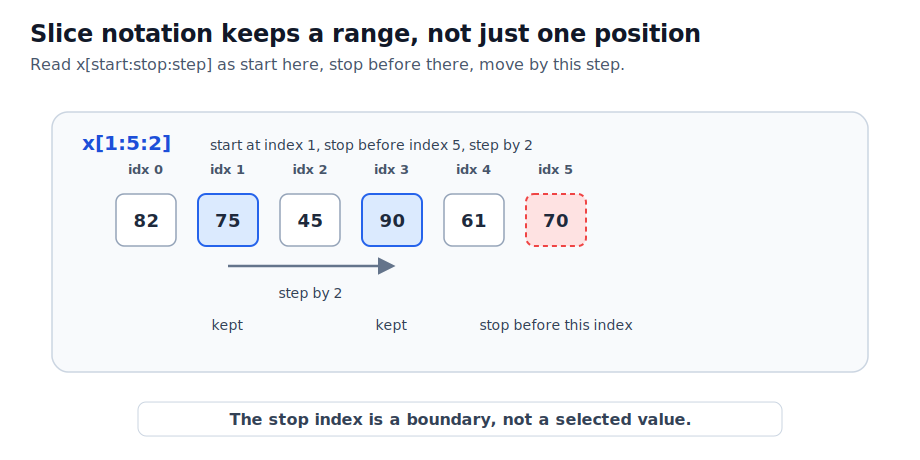
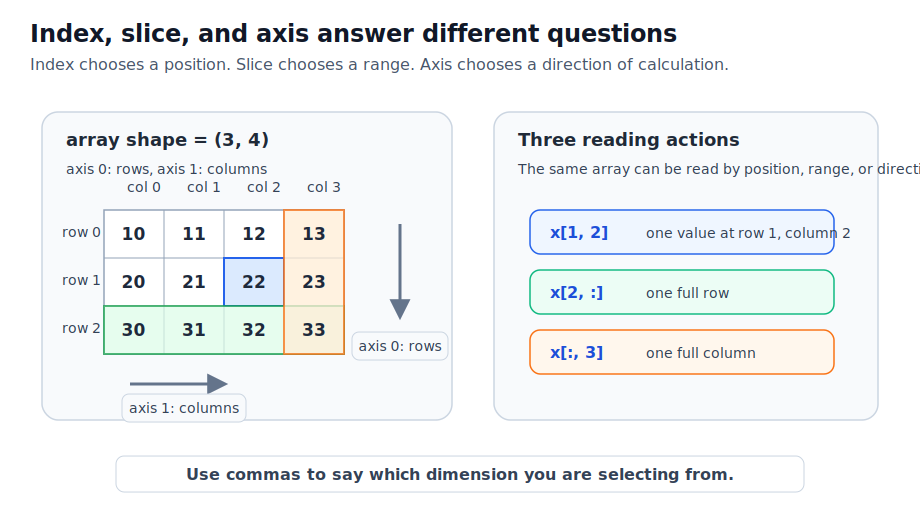
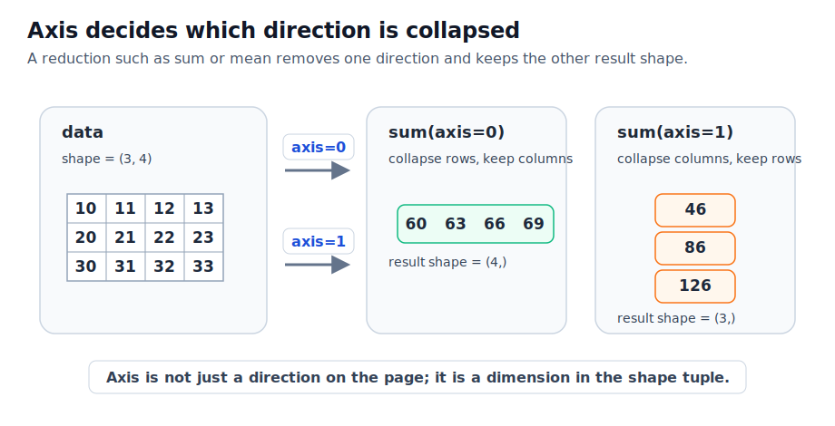
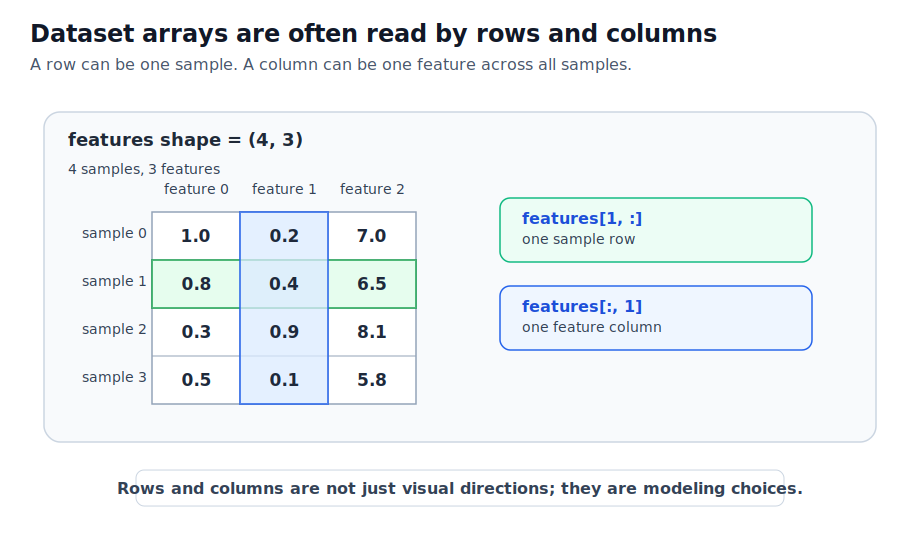

# P2-11.2 인덱싱(indexing), 슬라이싱(slicing), 축(axis)

P2-11.1에서는 NumPy 배열(array)을 만들고, `shape`, `ndim`, `dtype`을 확인했습니다. 이제 배열 안에서 어느 값을 읽을지, 어느 구간을 잘라 볼지, 어느 방향으로 계산할지를 봅니다.

NumPy 배열을 읽을 때 자주 만나는 말은 세 가지입니다.

인덱싱(indexing), 슬라이싱(slicing), 축(axis).

이 세 말은 비슷해 보이지만 역할이 다릅니다. 인덱싱은 위치를 고릅니다. 슬라이싱은 구간을 고릅니다. 축은 계산의 방향을 정합니다.

## 이 절의 범위

이 절은 1차원과 2차원 NumPy 배열에서 값을 꺼내고, 행과 열을 자르고, `axis=0`, `axis=1`의 의미를 확인합니다.

여기서는 다음 질문에 답합니다.

- 인덱싱(indexing)은 무엇을 고르는가?
- 슬라이싱(slicing)은 무엇을 남기는가?
- 2차원 배열에서 `x[row, column]`은 어떻게 읽는가?
- `:`는 어떤 의미로 쓰이는가?
- `axis=0`과 `axis=1`은 각각 어떤 방향을 뜻하는가?

이 절에서는 고급 인덱싱(advanced indexing), 불리언 마스크(boolean mask), 팬시 인덱싱(fancy indexing), `np.newaxis`, `...`, view와 copy의 세부 차이는 다루지 않습니다. 여기서는 배열을 읽는 기본 감각을 만드는 데 집중합니다.

## 이 절의 목표

- `x[0]`, `x[1, 2]` 같은 인덱싱을 위치 선택으로 설명할 수 있습니다.
- `x[1:3]`, `x[:, 0]`, `x[0:2, 1:3]` 같은 슬라이싱을 구간 선택으로 설명할 수 있습니다.
- 2차원 배열에서 첫 번째 축(axis 0)을 행 방향, 두 번째 축(axis 1)을 열 방향으로 읽을 수 있습니다.
- `sum(axis=0)`과 `sum(axis=1)`의 결과 shape이 왜 다른지 설명할 수 있습니다.
- 데이터셋에서 행은 샘플, 열은 특징으로 읽히는 경우가 많다는 관점을 설명할 수 있습니다.

## 인덱싱은 위치를 고르는 일이다

NumPy 공식 문서는 `ndarray`가 표준 Python 문법인 `x[obj]` 형태로 인덱싱될 수 있다고 설명합니다. 또한 Python처럼 인덱스는 0부터 시작합니다.

먼저 1차원 배열을 봅니다.

```python
import numpy as np

scores = np.array([82, 75, 45, 90])

print(scores[0])
print(scores[2])
```

출력은 다음과 같습니다.

```text
82
45
```

`scores[0]`은 첫 번째 값입니다. `scores[2]`는 세 번째 값입니다. Python과 NumPy에서는 보통 첫 위치를 1이 아니라 0으로 셉니다.

이 점은 초심자에게 자주 헷갈립니다.

| 표현 | 읽는 법 | 결과 |
| --- | --- | --- |
| `scores[0]` | 0번 위치 | `82` |
| `scores[1]` | 1번 위치 | `75` |
| `scores[2]` | 2번 위치 | `45` |
| `scores[-1]` | 마지막 위치 | `90` |

인덱싱은 “몇 번째 값인가”를 묻는 작업입니다.

## 2차원 배열은 행과 열을 함께 고른다

2차원 배열에서는 보통 행(row)과 열(column)을 함께 지정합니다.

```python
data = np.array([
    [10, 11, 12, 13],
    [20, 21, 22, 23],
    [30, 31, 32, 33],
])

print(data.shape)
print(data[1, 2])
```

출력은 다음과 같습니다.

```text
(3, 4)
22
```

`data[1, 2]`는 1번 행, 2번 열의 값을 고릅니다.

여기서도 인덱스는 0부터 시작합니다.

| 표현 | 읽는 법 | 결과 |
| --- | --- | --- |
| `data[0, 0]` | 0번 행, 0번 열 | `10` |
| `data[0, 3]` | 0번 행, 3번 열 | `13` |
| `data[1, 2]` | 1번 행, 2번 열 | `22` |
| `data[2, 1]` | 2번 행, 1번 열 | `31` |

2차원 배열에서 쉼표는 차원을 나누는 표시로 볼 수 있습니다.

> `data[행, 열]`

이렇게 읽으면 됩니다.

## 슬라이싱은 구간을 남기는 일이다

슬라이싱(slicing)은 하나의 위치가 아니라 구간을 선택합니다.

```python
scores = np.array([82, 75, 45, 90])

print(scores[1:3])
```

출력은 다음과 같습니다.

```text
[75 45]
```

`1:3`은 1번 위치부터 3번 위치 전까지를 뜻합니다. 즉 1번과 2번 위치가 선택됩니다.

입문 단계에서는 이렇게 기억하면 됩니다.

| 표현 | 의미 |
| --- | --- |
| `start:stop` | start부터 stop 전까지 |
| `:` | 전체 |
| `:3` | 처음부터 3 전까지 |
| `1:` | 1부터 끝까지 |
| `::2` | 두 칸씩 건너뛰기 |

슬라이싱은 “어느 구간을 남길 것인가”를 묻는 작업입니다.

아래 도식은 `start:stop:step` 표기를 한 줄 배열에서 어떻게 읽는지 보여 줍니다.



여기서 중요한 점은 `stop` 위치의 값은 선택되지 않는다는 것입니다. `scores[1:5:2]`는 1번 위치에서 시작해 5번 위치 전까지 보되, 두 칸씩 이동합니다.

```python
scores = np.array([82, 75, 45, 90, 61, 70])

print(scores[1:5])
print(scores[1:5:2])
print(scores[:3])
print(scores[-2:])
```

출력은 다음과 같습니다.

```text
[75 45 90 61]
[75 90]
[82 75 45]
[61 70]
```

## 행과 열을 자르는 법

2차원 배열에서 `:`를 쓰면 행이나 열 전체를 고를 수 있습니다.

```python
data = np.array([
    [10, 11, 12, 13],
    [20, 21, 22, 23],
    [30, 31, 32, 33],
])

print(data[2, :])
print(data[:, 3])
```

출력은 다음과 같습니다.

```text
[30 31 32 33]
[13 23 33]
```

`data[2, :]`는 2번 행의 모든 열을 고릅니다.

`data[:, 3]`는 모든 행에서 3번 열을 고릅니다.

아래 도식은 같은 배열을 인덱싱, 행 슬라이싱, 열 슬라이싱으로 다르게 읽는 상황을 보여 줍니다.



이 도식에서 파란색은 하나의 값, 초록색은 한 행, 주황색은 한 열을 강조합니다. 모두 같은 배열에서 나온 선택입니다.

## 작은 영역을 자를 수도 있다

행과 열의 구간을 함께 지정하면 작은 부분 배열(sub-array)을 만들 수 있습니다.

```python
print(data[0:2, 1:3])
```

출력은 다음과 같습니다.

```text
[[11 12]
 [21 22]]
```

`data[0:2, 1:3]`은 다음처럼 읽습니다.

> 0번 행부터 2번 행 전까지.
> 1번 열부터 3번 열 전까지.

즉 0번과 1번 행, 1번과 2번 열이 남습니다.

슬라이싱은 원본 배열 전체를 바꾸는 일이 아니라, 필요한 구간을 읽는 방식으로 먼저 이해하면 됩니다. view와 copy의 차이는 이 절에서 다루지 않습니다.

## 축(axis)은 계산의 방향을 정한다

NumPy 용어집은 축(axis)을 배열의 차원을 가리키는 말로 설명합니다. 축은 왼쪽에서 오른쪽으로 번호가 붙고, `axis 0`은 shape 튜플의 첫 번째 요소입니다. 2차원 배열에서는 axis 0이 행 방향, axis 1이 열 방향으로 설명됩니다.

입문 단계에서는 다음처럼 이해하면 됩니다.

```python
data.shape
```

이 결과가 `(3, 4)`라면 다음처럼 읽습니다.

| 축 | shape에서의 위치 | 이 예제의 의미 |
| --- | --- | --- |
| `axis=0` | 첫 번째 숫자 `3` | 행이 3개 |
| `axis=1` | 두 번째 숫자 `4` | 열이 4개 |

축은 특히 `sum`, `mean` 같은 요약 계산에서 중요합니다.

```python
print(data.sum(axis=0))
print(data.sum(axis=1))
```

출력은 다음과 같습니다.

```text
[60 63 66 69]
[ 46  86 126]
```

`sum(axis=0)`은 행 방향을 따라 내려가며 더합니다. 그래서 열마다 하나의 합이 남습니다.

`sum(axis=1)`은 열 방향을 따라 가로로 더합니다. 그래서 행마다 하나의 합이 남습니다.

아래 도식은 축에 따라 어떤 방향이 접히고 어떤 결과가 남는지 보여 줍니다.



중요한 점은 `axis=0`이 “0번 행을 고른다”는 뜻이 아니라는 것입니다. 인덱싱에서 `0`은 위치를 고르는 숫자입니다. 하지만 `axis=0`은 계산이 진행되는 차원을 지정합니다.

## 행은 샘플, 열은 특징으로 자주 읽힌다

AI 실습에서 2차원 배열은 자주 다음처럼 읽힙니다.

| 방향 | 자주 쓰는 해석 |
| --- | --- |
| 행(row) | 샘플(sample), 데이터 한 건 |
| 열(column) | 특징(feature), 변수(variable) |

예를 들어 다음 배열을 봅니다.

```python
features = np.array([
    [1.0, 0.2],
    [0.8, 0.4],
    [0.3, 0.9],
])
```

이 배열은 샘플 3개와 특징 2개로 읽을 수 있습니다.

```python
print(features[0, :])
print(features[:, 1])
```

첫 번째 코드는 첫 번째 샘플을 꺼냅니다.

두 번째 코드는 모든 샘플의 두 번째 특징을 꺼냅니다.

이 감각은 이후 데이터셋(dataset)을 다룰 때 중요합니다. 모델에 입력할 때는 “어떤 행이 하나의 사례인가”, “어떤 열이 하나의 특징인가”를 먼저 정해야 합니다.

아래 도식은 같은 관점을 조금 더 데이터셋에 가깝게 보여 줍니다.



여기서 `features[1, :]`는 한 샘플의 모든 특징을 꺼내는 코드입니다. 반대로 `features[:, 1]`는 모든 샘플에서 같은 특징 하나를 꺼내는 코드입니다.

```python
features = np.array([
    [1.0, 0.2, 7.0],
    [0.8, 0.4, 6.5],
    [0.3, 0.9, 8.1],
    [0.5, 0.1, 5.8],
])

print(features[1, :])
print(features[:, 1])
print(features[:, 1].mean())
```

출력은 다음과 같습니다.

```text
[0.8 0.4 6.5]
[0.2 0.4 0.9 0.1]
0.4
```

이 예제에서 마지막 줄은 두 번째 특징의 평균을 계산합니다. 즉 “한 열을 고른다”는 일은 이후 평균, 분산, 정규화, 특징 비교 같은 작업으로 이어질 수 있습니다.

## 예제 코드 파일

이 절의 예제 코드는 다음 파일로도 확인할 수 있습니다.

- [p2_11_2_index_slice_axis.py](../../../assets/part-02/chapter-11/p2_11_2_index_slice_axis.py)

로컬 PC에서는 레포지토리 루트에서 다음처럼 실행할 수 있습니다.

```bash
python docs/assets/part-02/chapter-11/p2_11_2_index_slice_axis.py
```

Colab에서는 파일 내용을 코드 셀에 붙여 넣어 실행할 수 있습니다.

출력에는 1차원 슬라이싱의 `start:stop:step` 예제와 데이터셋 형태의 행/열 선택 예제도 포함되어 있습니다.

## 이 절에서 기억할 관점

인덱싱은 하나의 위치를 고르는 일입니다.

슬라이싱은 구간을 남기는 일입니다.

2차원 배열에서는 `data[행, 열]`로 읽습니다.

`:`는 해당 차원 전체를 뜻합니다.

축(axis)은 계산의 방향을 정하는 차원입니다.

`axis=0`과 `axis=1`은 위치 선택이 아니라 요약 계산의 방향 선택입니다.

## 체크리스트

- NumPy 인덱스가 0부터 시작한다는 점을 설명할 수 있다.
- `data[1, 2]`를 행과 열 기준으로 읽을 수 있다.
- `data[2, :]`와 `data[:, 3]`의 차이를 설명할 수 있다.
- `data[0:2, 1:3]`이 어떤 부분 배열을 선택하는지 설명할 수 있다.
- `sum(axis=0)`과 `sum(axis=1)`의 결과가 왜 다른지 설명할 수 있다.
- 행을 샘플, 열을 특징으로 읽는 데이터셋 관점을 설명할 수 있다.

## 출처와 참고 자료

- NumPy Developers, [Indexing on ndarrays](https://numpy.org/doc/stable/user/basics.indexing.html){: target="_blank" rel="noopener noreferrer" }, 확인 날짜: 2026-06-25.
- NumPy Developers, [NumPy glossary](https://numpy.org/doc/stable/glossary.html){: target="_blank" rel="noopener noreferrer" }, 확인 날짜: 2026-06-25.
