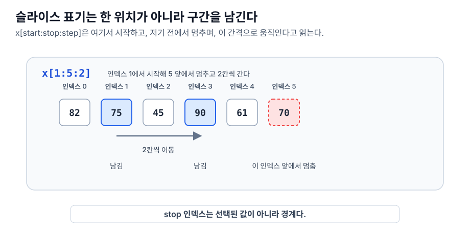
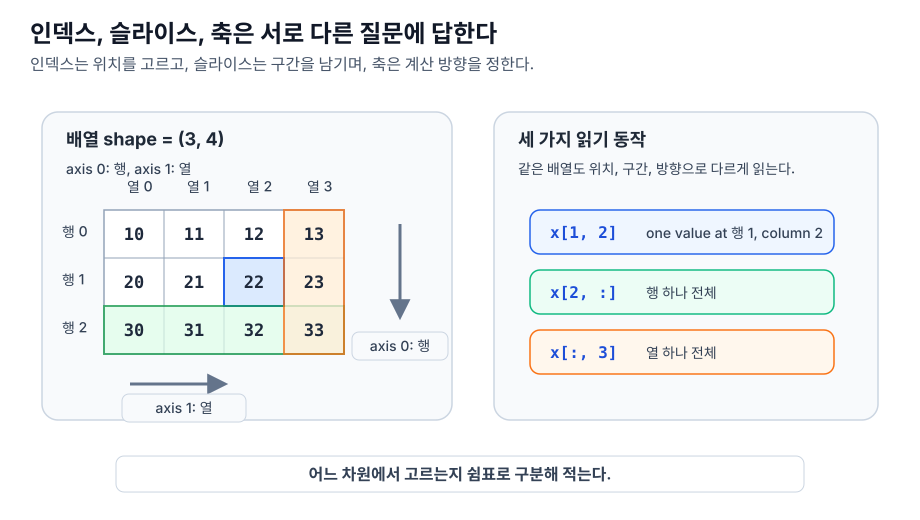
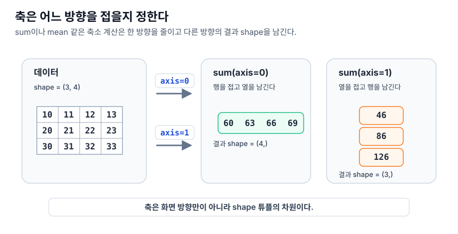
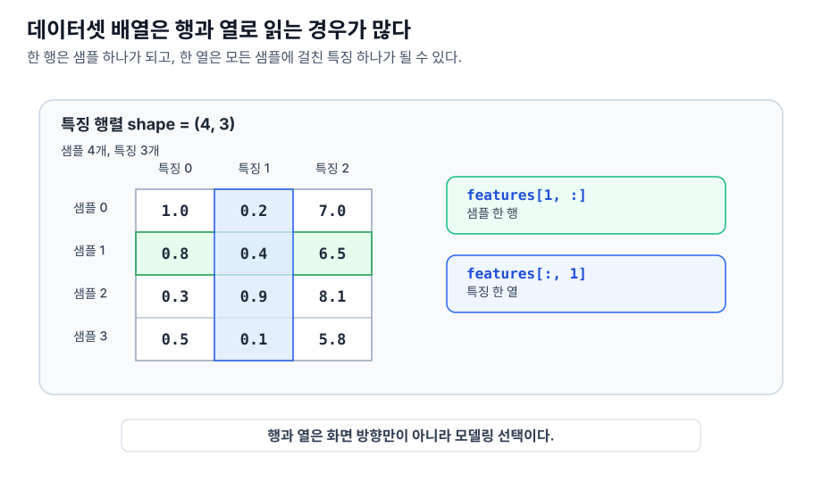

# P2-11.2 인덱싱(indexing), 슬라이싱(slicing), 축(axis)

> Section ID: `P2-11.2`
> Version: `v2026.09.08`

## 위치 선택

NumPy 공식 문서는 `ndarray`가 표준 Python 문법인 `x[obj]` 형태로 인덱싱될 수 있다고 설명합니다. 또한 Python처럼 인덱스는 0부터 시작합니다.

먼저 1차원 배열을 봅니다.

점수 `[82, 75, 45, 90]`에서 인덱스 `0`과 `2`를 선택하면 첫 값 `82`와 세 번째 값 `45`가 출력됩니다.

```python
import numpy as np

scores = np.array([82, 75, 45, 90])

print(scores[0])
print(scores[2])
```

출력은 다음과 같습니다.

```text
82
45
```

`scores[0]`은 첫 번째 값입니다. `scores[2]`는 세 번째 값입니다. Python과 NumPy에서는 보통 첫 위치를 1이 아니라 0으로 셉니다.

이 점은 자주 헷갈립니다.

| 표현 | 읽는 법 | 결과 |
| --- | --- | --- |
| `scores[0]` | 0번 위치 | `82` |
| `scores[1]` | 1번 위치 | `75` |
| `scores[2]` | 2번 위치 | `45` |
| `scores[-1]` | 마지막 위치 | `90` |

인덱싱은 “몇 번째 값인가”를 묻는 작업입니다.

## 행과 열 위치

2차원 배열에서는 보통 행(row)과 열(column)을 함께 지정합니다.

3행 4열 배열에서 `[1, 2]`는 두 번째 행의 세 번째 값입니다. 다음 코드는 모양 `(3, 4)`와 값 `22`를 출력합니다.

```python
data = np.array([
    [10, 11, 12, 13],
    [20, 21, 22, 23],
    [30, 31, 32, 33],
])

print(data.shape)
print(data[1, 2])
```

출력은 다음과 같습니다.

```text
(3, 4)
22
```

`data[1, 2]`는 1번 행, 2번 열의 값을 고릅니다.

여기서도 인덱스는 0부터 시작합니다.

| 표현 | 읽는 법 | 결과 |
| --- | --- | --- |
| `data[0, 0]` | 0번 행, 0번 열 | `10` |
| `data[0, 3]` | 0번 행, 3번 열 | `13` |
| `data[1, 2]` | 1번 행, 2번 열 | `22` |
| `data[2, 1]` | 2번 행, 1번 열 | `31` |

2차원 배열에서 쉼표는 차원을 나누는 표시로 볼 수 있습니다. 따라서 `data[행, 열]`처럼 읽으면 됩니다.

## 구간과 간격

슬라이싱(slicing)은 하나의 위치가 아니라 구간을 선택합니다.

점수 네 개에서 구간 `1:3`을 선택하면 인덱스 1과 2의 값 `[75 45]`가 출력됩니다.

```python
scores = np.array([82, 75, 45, 90])

print(scores[1:3])
```

출력은 다음과 같습니다.

```text
[75 45]
```

`1:3`은 1번 위치부터 3번 위치 전까지를 뜻합니다. 즉 1번과 2번 위치가 선택됩니다.

구간 표기는 다음과 같습니다.

| 표현 | 의미 |
| --- | --- |
| `start:stop` | start부터 stop 전까지 |
| `:` | 전체 |
| `:3` | 처음부터 3 전까지 |
| `1:` | 1부터 끝까지 |
| `::2` | 두 칸씩 건너뛰기 |

슬라이싱은 “어느 구간을 남길 것인가”를 묻는 작업입니다.

아래 도식은 `start:stop:step` 표기를 한 줄 배열에서 어떻게 읽는지 보여 줍니다.



여기서 중요한 점은 `stop` 위치의 값은 선택되지 않는다는 것입니다. `scores[1:5:2]`는 1번 위치에서 시작해 5번 위치 전까지 보되, 두 칸씩 이동합니다.

점수 여섯 개에서 연속 구간, 두 칸 간격, 앞 세 개, 뒤 두 개를 선택합니다. 각각 `[75 45 90 61]`, `[75 90]`, `[82 75 45]`, `[61 70]`이 출력됩니다.

```python
scores = np.array([82, 75, 45, 90, 61, 70])

print(scores[1:5])
print(scores[1:5:2])
print(scores[:3])
print(scores[-2:])
```

출력은 다음과 같습니다.

```text
[75 45 90 61]
[75 90]
[82 75 45]
[61 70]
```

## 행 전체와 열 전체

2차원 배열에서 `:`를 쓰면 행이나 열 전체를 고를 수 있습니다.

같은 3행 4열 배열에서 세 번째 행 전체와 네 번째 열 전체를 선택합니다. 출력은 `[30 31 32 33]`과 `[13 23 33]`입니다.

```python
data = np.array([
    [10, 11, 12, 13],
    [20, 21, 22, 23],
    [30, 31, 32, 33],
])

print(data[2, :])
print(data[:, 3])
```

출력은 다음과 같습니다.

```text
[30 31 32 33]
[13 23 33]
```

`data[2, :]`는 2번 행의 모든 열을 고릅니다.

`data[:, 3]`는 모든 행에서 3번 열을 고릅니다.

아래 도식은 같은 배열을 인덱싱, 행 슬라이싱, 열 슬라이싱으로 다르게 읽는 상황을 보여 줍니다.



이 도식에서 파란색은 하나의 값, 초록색은 한 행, 주황색은 한 열을 강조합니다. 모두 같은 배열에서 나온 선택입니다.

## 부분 배열

행과 열의 구간을 함께 지정하면 작은 부분 배열(sub-array)을 만들 수 있습니다.

앞의 `data`에서 행 구간 `0:2`, 열 구간 `1:3`을 선택하면 `[[11, 12], [21, 22]]`에 해당하는 2행 2열 배열이 출력됩니다.

```python
print(data[0:2, 1:3])
```

출력은 다음과 같습니다.

```text
[[11 12]
 [21 22]]
```

`data[0:2, 1:3]`은 `0번 행부터 2번 행 전까지`, `1번 열부터 3번 열 전까지`로 읽습니다.

즉 0번과 1번 행, 1번과 2번 열이 남습니다.

이 기본 슬라이싱 결과는 원본과 데이터를 공유하는 뷰(view)입니다. 부분 배열의 값을 수정하면 원본에도 반영됩니다. 독립된 배열이 필요하면 슬라이싱 결과에 `.copy()`를 적용할 수 있습니다.

## 축별 합계

NumPy 용어집은 축(axis)을 배열의 차원을 가리키는 말로 설명합니다. 축은 왼쪽에서 오른쪽으로 번호가 붙고, `axis 0`은 shape 튜플의 첫 번째 요소입니다. 2차원 배열에서는 axis 0이 행 방향, axis 1이 열 방향으로 설명됩니다.

앞의 `data` 모양은 `(3, 4)`입니다. `shape`는 각 축의 길이를 순서대로 담습니다.

```python
print(data.shape)
```

이 결과가 `(3, 4)`라면 다음처럼 읽습니다.

| 축 | shape에서의 위치 | 이 예제의 의미 |
| --- | --- | --- |
| `axis=0` | 첫 번째 숫자 `3` | 행이 3개 |
| `axis=1` | 두 번째 숫자 `4` | 열이 4개 |

축은 특히 `sum`, `mean` 같은 요약 계산에서 중요합니다.

앞의 배열을 `axis=0`으로 더하면 열별 합 `[60 63 66 69]`, `axis=1`로 더하면 행별 합 `[46 86 126]`이 출력됩니다.

```python
print(data.sum(axis=0))
print(data.sum(axis=1))
```

출력은 다음과 같습니다.

```text
[60 63 66 69]
[ 46  86 126]
```

`sum(axis=0)`은 행 방향을 따라 내려가며 더합니다. 그래서 열마다 하나의 합이 남습니다.

`sum(axis=1)`은 열 방향을 따라 가로로 더합니다. 그래서 행마다 하나의 합이 남습니다.

아래 도식은 축에 따라 어떤 방향이 접히고 어떤 결과가 남는지 보여 줍니다.



중요한 점은 `axis=0`이 “0번 행을 고른다”는 뜻이 아니라는 것입니다. 인덱싱에서 `0`은 위치를 고르는 숫자입니다. 하지만 `axis=0`은 계산이 진행되는 차원을 지정합니다.

## 샘플과 특징

AI 실습에서 2차원 배열은 자주 다음처럼 읽힙니다.

| 방향 | 자주 쓰는 해석 |
| --- | --- |
| 행(row) | 샘플(sample), 데이터 한 건 |
| 열(column) | 특징(feature), 변수(variable) |

예를 들어 다음 배열을 봅니다.

샘플 세 개의 특징 두 개씩을 행렬에 담습니다. 각 행이 한 샘플이며 이 준비 코드는 출력이 없습니다.

```python
features = np.array([
    [1.0, 0.2],
    [0.8, 0.4],
    [0.3, 0.9],
])
```

이 배열은 샘플 3개와 특징 2개로 읽을 수 있습니다.

앞의 `features`에서 첫 샘플 전체는 `[1.0, 0.2]`, 두 번째 특징 전체는 `[0.2, 0.4, 0.9]`입니다. 다음 코드가 두 배열을 출력합니다.

```python
print(features[0, :])
print(features[:, 1])
```

첫 번째 코드는 첫 번째 샘플을 꺼냅니다.

두 번째 코드는 모든 샘플의 두 번째 특징을 꺼냅니다.

모델 입력에서는 각 행이 어떤 사례인지, 각 열이 어떤 특징인지 데이터 정의로 정해야 합니다. 모양만으로 축의 의미까지 알 수는 없습니다.

여기서 한 번 더 짧게 다시 묶으면 다음과 같습니다.

| NumPy 배열에서 보는 것 | 데이터셋 언어로 다시 읽을 때 |
| --- | --- |
| 한 행(row) | 샘플(sample) 한 건 |
| 한 열(column) | 특징(feature) 하나 전체 |
| `shape[0]` | 샘플 수 |
| `shape[1]` | 특징 수 |

아래 도식은 같은 관점을 조금 더 데이터셋에 가깝게 보여 줍니다.



여기서 `features[1, :]`는 한 샘플의 모든 특징을 꺼내는 코드입니다. 반대로 `features[:, 1]`는 모든 샘플에서 같은 특징 하나를 꺼내는 코드입니다.

샘플 네 개의 특징 세 개씩을 담은 배열에서 두 번째 샘플과 두 번째 특징 열을 선택합니다. 마지막 출력은 두 번째 특징 평균 `0.4`입니다.

```python
features = np.array([
    [1.0, 0.2, 7.0],
    [0.8, 0.4, 6.5],
    [0.3, 0.9, 8.1],
    [0.5, 0.1, 5.8],
])

print(features[1, :])
print(features[:, 1])
print(features[:, 1].mean())
```

출력은 다음과 같습니다.

```text
[0.8 0.4 6.5]
[0.2 0.4 0.9 0.1]
0.4
```

이 예제에서 마지막 줄은 두 번째 특징의 평균을 계산합니다. 즉 “한 열을 고른다”는 일은 이후 평균, 분산, 정규화, 특징 비교 같은 작업으로 이어질 수 있습니다.

## 예제 코드 파일

이 절의 예제 코드는 다음 파일로도 확인할 수 있습니다.

- [p2_11_2_index_slice_axis.py](../../../assets/part-02/chapter-11/p2_11_2_index_slice_axis.py)

로컬 PC에서는 프로젝트 루트에서 다음처럼 실행할 수 있습니다.

```bash
python docs/assets/part-02/chapter-11/p2_11_2_index_slice_axis.py
```

Colab에서는 파일 내용을 코드 셀에 붙여 넣어 실행할 수 있습니다.

출력에는 1차원 슬라이싱의 `start:stop:step` 예제와 데이터셋 형태의 행/열 선택 예제도 포함되어 있습니다.

## 사례: 학생별 합과 과목별 합

두 학생의 국어·수학·영어 점수가 각각 `[80, 70, 90]`, `[60, 90, 75]`라고 하겠습니다. 다음 코드는 두 번째 학생의 점수, 수학 열, 과목별 합, 학생별 합을 출력합니다.

```python
import numpy as np

marks = np.array([[80, 70, 90], [60, 90, 75]])
print("second student:", marks[1, :])
print("math:", marks[:, 1])
print("subject totals:", marks.sum(axis=0))
print("student totals:", marks.sum(axis=1))
```

```text
second student: [60 90 75]
math: [70 90]
subject totals: [140 160 165]
student totals: [240 225]
```

과목별 합은 학생 축을 합쳐 결과 모양이 `(3,)`이고, 학생별 합은 과목 축을 합쳐 `(2,)`입니다. 두 번째 학생의 수학 점수를 `90`에서 `100`으로 바꾸면 과목별 합은 `[140, 170, 165]`, 학생별 합은 `[240, 235]`가 됩니다. 수학 합과 두 번째 학생 합만 10씩 증가합니다.

## 체크리스트

- NumPy 인덱스가 0부터 시작한다는 점을 설명할 수 있다.
- `data[1, 2]`를 행과 열 기준으로 읽을 수 있다.
- `data[2, :]`와 `data[:, 3]`의 차이를 설명할 수 있다.
- `data[0:2, 1:3]`이 어떤 부분 배열을 선택하는지 설명할 수 있다.
- `sum(axis=0)`과 `sum(axis=1)`의 결과가 왜 다른지 설명할 수 있다.
- 행을 샘플, 열을 특징으로 읽는 데이터셋 관점을 설명할 수 있다.
- `shape = (4, 3)`을 보면 `샘플 4개, 특징 3개`처럼 읽을 수 있다.
- 인덱싱은 위치를 고르고, 슬라이싱은 구간을 남기며, 축은 계산 방향을 정한다는 점을 설명할 수 있다.

## 출처와 참고 자료

- NumPy Developers, [Indexing on ndarrays](https://numpy.org/doc/stable/user/basics.indexing.html){: target="_blank" rel="noopener noreferrer" }, NumPy v2.5 Manual, 확인 날짜: 2026-07-20. 기본 인덱싱, 슬라이싱, 다차원 인덱스, advanced indexing과 copy/view 주의점 확인에 사용했다.
- NumPy Developers, [NumPy glossary](https://numpy.org/doc/stable/glossary.html){: target="_blank" rel="noopener noreferrer" }, NumPy v2.5 Manual, 확인 날짜: 2026-07-20. axis, broadcasting, copy, view 같은 용어를 현재 절의 용어 설명과 맞추는 근거로 사용했다.
